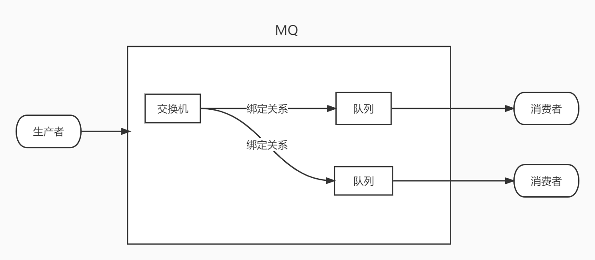
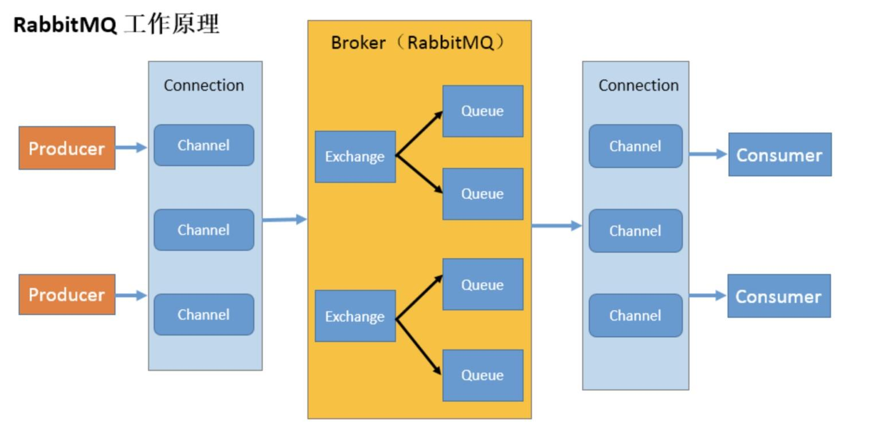

# 1. 消息队列

##1.1 MQ

### 什么是MQ

MQ(message queue)，从字面意思上看，本质是个队列，FIFO 先入先出，只不过队列中存放的内容是message 而已，还是一种跨进程的通信机制，用于上下游传递消息。在互联网架构中，MQ 是一种非常常见的上下游“逻辑解耦+物理解耦”的消息通信服务。使用了 MQ 之后，消息发送上游只需要依赖 MQ，不用依赖其他服务。


### 为什么要用MQ？（MQ的作用）

1. 流量消峰
2. 应用解耦
3. 异步处理


### MQ的分类及其特点

- ==ActiveMQ==
  - 优点：单机吞吐量万级，时效性 ms 级，可用性高，基于主从架构实现高可用性，消息可靠性较低的概率丢失数据
  - 缺点：官方社区现在对 ActiveMQ 5.x 维护越来越少，高吞吐量场景较少使用。
- ==Kafka==
  - 优点：**吞吐量高**，时效性 ms 级可用性非常高，kafka 是分布式的，一个数据多个副本，少数机器宕机，不会丢失数据，不会导致不可用,消费者采用 Pull 方式获取消息, **消息有序**, 通过控制能够保证所有消息被消费且仅被消费一次。在日志领域比较成熟，被多家公司和多个开源项目使用，在**大数据领域的实时计算以及日志采集**被大规模使用。
  - 缺点：Kafka 单机超过 64 个队列/分区，Load 会发生明显的飙高现象，队列越多，load 越高，发送消息响应时间变长，使用短轮询方式，实时性取决于轮询间隔时间，消费失败不支持重试；支持消息顺序， 但是一台代理宕机后，就会产生消息乱序，社区更新较慢。
- ==RocketMQ==
  - 优点：**单机吞吐量十万级，可用性非常高**，分布式架构，**消息可以做到 0 丢失**，MQ 功能较为完善，还是分布式的，扩展性好，支持 10 亿级别的消息堆积，不会因为堆积导致性能下降，源码是 java 我们可以自己阅读源码，定制自己公司的 MQ。
  - 缺点：**支持的客户端语言不多**，目前是 java 及 c++，其中 c++不成熟；社区活跃度一般,没有在MQ
    核心中去实现 JMS 等接口,有些系统要迁移需要修改大量代码
- ==RabbitMQ==
  - 优点：由于 erlang 语言的**高并发特性**，性能较好；**吞吐量到万级**，MQ 功能比较完备,健壮、稳定、易用、**跨平台、支持多种语言** 如：Python、Ruby、.NET、Java、JMS、C、PHP、ActionScript、XMPP、STOMP 等，支持 AJAX 文档齐全；开源提供的管理界面非常棒，用起来很好用,社区活跃度高；更新频率相当高
  - 缺点：商业版需要收费，学习成本较高。


## 1.2 RabbitMQ

### 四大核心概念

- ==生产者==：产生数据发送消息的程序是生产者
- ==交换机==：交换机是 RabbitMQ 非常重要的一个部件，一方面它接收来自生产者的消息，另一方面它将消息推送到队列中。交换机必须确切知道如何处理它接收到的消息，是将这些消息推送到特定队列还是推送到多个队列，亦或者是把消息丢弃，这个得有交换机类型决定
- ==队列==：队列是 RabbitMQ 内部使用的一种数据结构，尽管消息流经 RabbitMQ 和应用程序，但它们只能存储在队列中。队列仅受主机的内存和磁盘限制的约束，本质上是一个大的消息缓冲区。许多生产者可以将消息发送到一个队列，许多消费者可以尝试从一个队列接收数据。这就是我们使用队列的方式
- ==消费者==：消费与接收具有相似的含义。消费者大多时候是一个等待接收消息的程序。请注意生产者，消费者和消息中间件很多时候并不在同一机器上。同一个应用程序既可以是生产者又是可以是消费者。




### RabbitMQ的六种工作模式

1. **Hello World 简单模式**

   

   - 消息产生者将消息放入队列
   - 消息的消费者(consumer) 监听(while) 消息队列,如果队列中有消息,就消费掉,消息被拿走后,自动从队列中删除(隐患 消息可能没有被消费者正确处理,已经从队列中消失了,造成消息的丢失)
   - 应用场景:聊天(中间有一个过度的服务器;p端,c端)

   

2. **Work Queues 工作队列模式**（资源竞争）

   

   - 生产者 --> 队列 --> 消费者，**没有交换机**；
   - 消息产生者将消息放入队列消费者可以有多个，消费者1，消费者2，同时监听同一个队列，消息被消费。$C_1$ $C_2$共同争抢当前的消息队列内容，谁先拿到谁负责消费消息；
   - 隐患：高并发情况下，默认会产生某一个消息被多个消费者共同使用，可以设置一个开关(syncronize，与同步锁的性能不一样) 保证一条消息只能被一个消费者使用；
   - 应用场景：红包；大项目中的资源调度(任务分配系统不需知道哪一个任务执行系统在空闲，直接将任务扔到消息队列中，空闲的系统自动争抢)

   

3. **Publish/Subscribe 发布订阅模式**(共享资源)

   

   - 生产者 --> 交换机 -->（多个）队列 --> 消费者
   - 每个消费者监听自己的队列。
   - 生产者将消息发给交换机，由交换机将消息转发到绑定此交换机的每个队列，对应消息队列的消费者拿到消息进行消费；
   - 相关场景：邮件群发，群聊天，广播(广告)

   

4. **Routing 路由模式**

   

   - 每个消费者监听自己的队列，并且设置routingkey。
   - 生产者将消息发给交换机，由交换机根据routingkey来转发消息到指定的队列。

   

5. **Topics 主题模式**(路由模式的一种)

   

   - $*$和#号代表通配符，其中$*$代表多个单词，#代表一个单词

   - 路由功能添加模糊匹配；

   - 消息产生者产生消息，把消息交给交换机；交换机根据key的规则模糊匹配到对应的队列，由队列的监听消费者接收消息消费。

     

6. **RPC**

   

   RPC即客户端远程调用服务端的方法 ，使用MQ可以实现RPC的异步调用，基于Direct交换机实现，流程如下：

   1、客户端即是生产者就是消费者，向RPC请求队列发送RPC调用消息，同时监听RPC响应队列。

   2、服务端监听RPC请求队列的消息，收到消息后执行服务端的方法，得到方法返回的结果

   3、服务端将RPC方法 的结果发送到RPC响应队列

   4、客户端（RPC调用方）监听RPC响应队列，接收到RPC调用结果。


### 名词介绍



- **Broker**：接收和分发消息的应用，RabbitMQ Server 就是 Message Broker
- **Virtual host**：出于多租户和安全因素设计的，把 AMQP 的基本组件划分到一个虚拟的分组中，类似于网络中的 namespace 概念。当多个不同的用户使用同一个 RabbitMQ server 提供的服务时，可以划分出多个 vhost，每个用户在自己的 vhost 创建 exchange／queue 等
- **Connection**：publisher／consumer 和 broker 之间的 TCP 连接
- **Channel**：如果每一次访问 RabbitMQ 都建立一个 Connection，在消息量大的时候建立 TCP Connection 的开销将是巨大的，效率也较低。Channel 是在 connection 内部建立的逻辑连接，如果应用程序支持多线程，通常每个 thread 创建单独的 channel 进行通讯，AMQP method 包含了 channel id 帮助客户端和 message broker 识别 channel，所以 channel 之间是完全隔离的。Channel 作为轻量级的Connection 极大减少了操作系统建立 TCP connection 的开销
- **Exchange**：message 到达 broker 的第一站，根据分发规则，匹配查询表中的 routing key，分发消息到 queue 中去。常用的类型有：direct (point-to-point), topic (publish-subscribe) and fanout (multicast)
- **Queue**：消息最终被送到这里等待 consumer 取走
- **Binding**：exchange 和queue 之间的虚拟连接，binding 中可以包含 routing key，Binding 信息被保存到 exchange 中的查询表中，用于 message 的分发依据


# 2. 消息应答和RabbitMQ持久化

## 2.1 消息应答

### 概念

消费者完成一个任务可能需要一段时间，如果其中一个消费者处理一个长的任务并仅只完成了部分突然它挂掉了，会发生什么情况。RabbitMQ 一旦向消费者传递了一条消息，便立即将该消息标记为删除。在这种情况下，突然有个消费者挂掉了，我们将丢失正在处理的消息。以及后续发送给该消费这的消息，因为它无法接收到。

为了保证消息在发送过程中不丢失，rabbitmq 引入消息应答机制，消息应答就是：**消费者在接收到消息并且处理该消息之后，告诉 RabbitMQ 它已经处理了，RabbitMQ 可以把该消息删除了。**


### 自动应答

消息发送后立即被认为已经传送成功，这种模式需要在**高吞吐量**和**数据传输安全性**方面做权衡，因为这种模式如果消息在接收到之前，消费者那边出现连接或者 channel 关闭，那么消息就丢失了；当然另一方面这种模式消费者那边可以传递过载的消息，**没有对传递的消息数量进行限制**，当然这样有可能使得消费者这边由于接收太多还来不及处理的消息，导致这些消息的积压，最终使得内存耗尽，最终这些消费者线程被操作系统杀死，**所以这种模式仅适用在消费者可以高效并以某种速率能够处理这些消息的情况下使用。**


### 消息应答的方法

1. Channel.basicAck(用于肯定确认)：RabbitMQ 已知道该消息并且成功的处理消息，可以将其丢弃了
2. Channel.basicNack(用于否定确认)
3. Channel.basicReject(用于否定确认)：与 Channel.basicNack 相比少一个参数。不处理该消息了直接拒绝，可以将其丢弃了


### Multiple的解释

手动应答的好处是可以批量应答并且减少网络拥堵

```java
channel.basicAck(deliveryTag,true)
```

multiple的true和false代表不同意思：

- true代表批量应答channel上未应答的消息，比如说channel上有传送tag的消息5,6,7,8，当前tag是8，那么此时5-8的这些还未应答的消息都会被确认收到消息应答
- false同上面相比，只会应答tag=8的消息，5,6,7这3个消息依然会不被确认收到消息应答


### 消息自动重新入队

如果消费者由于某些原因失去连接(其通道已关闭，连接已关闭或 TCP 连接丢失)，导致消息未发送 ACK 确认，RabbitMQ 将了解到消息未完全处理，并将对其重新排队。如果此时其他消费者可以处理，它将很快将其重新分发给另一个消费者。这样，即使某个消费者偶尔死亡，也可以确保不会丢失任何消息。


## 2.1 RabbitMQ持久化

### 概念

刚刚我们已经看到了如何处理任务不丢失的情况，但是如何保障当 RabbitMQ 服务停掉以后消息生产者发送过来的消息不丢失。默认情况下 RabbitMQ 退出或由于某种原因崩溃时，它忽视队列和消息，除非告知它不要这样做。确保消息不会丢失需要做两件事：我们需要**将队列和消息都标记为持久化。**


### 队列持久化

创建的队列默认是非持久化的，RabbitMQ 如果重启的话，该队列就会被删除掉，如果要队列实现持久化，需要在声明队列的时候把 durable 参数设置为true实现持久化。

如果之前声明的队列不是持久化的，需要把原先队列先删除，或者重新创建一个持久化的队列，不然就会出现错误。这时即使重启RabbitMQ，队列也依旧存在。


### 消息持久化

要想让消息实现持久化需要在消息生产者修改代码，MessageProperties.PERSISTENT_TEXT_PLAIN 添加这个属性。**队列持久化必须开启，否则不会生效。**

**将消息标记为持久化并不能完全保证不会丢失消息**。尽管它告诉 RabbitMQ 将消息保存到磁盘，但是这里依然存在当消息刚准备存储在磁盘的时候 但是还没有存储完，消息还在缓存的一个间隔点。此时并没有真正写入磁盘。持久性保证并不强，但是对于我们的简单任务队列而言，这已经绰绰有余了。


### 不公平分发

假如有两个消费者，一个处理的快，一个处理的慢，那么采用轮询的话，处理的快的消费者就会去等待处理的慢的消费者，这个属于公平分发。而不公平分发，**处理的快的不会去等待，而是继续处理下一个消息**。

开启：设置参数 `channel.basicQos(1)`

意思就是如果这个消息我还没有处理完或者我还没有应答你，你先别分配给我，我目前只能处理一个任务，然后 rabbitmq 就会把该任务分配给没有那么忙的那个空闲消费者。

- 优点：提高工作线程的利用率
- 缺点：如果所有的消费者都没有完成手上任务，队列还在不停的添加新任务，队列有可能就会遇到队列被撑满的情况，这个时候就只能添加新的 worker 或者改变其他存储任务的策略。


### 预取值

本身消息的发送就是异步发送的，所以在任何时候，channel 上肯定不止只有一个消息另外来自消费者的手动确认本质上也是异步的。因此这里就存在一个未确认的消息缓冲区，因此希望开发人员能**限制此缓冲区的大小，以避免缓冲区里面无限制的未确认消息问题**。这个时候就可以通过使用 basic.qos 方法设置“预取计数”值来完成的。该值**定义通道上允许的未确认消息的最大数量**。一旦数量达到配置的数量， RabbitMQ 将停止在通道上传递更多消息，除非至少有一个未处理的消息被确认，例如，假设在通道上有未确认的消息 5、6、7，8，并且通道的预取计数设置为 4，此时RabbitMQ 将不会在该通道上再传递任何消息，除非至少有一个未应答的消息被 ack。比方说 tag=6 这个消息刚刚被确认 ACK，RabbitMQ 将会感知这个情况到并再发送一条消息。消息应答和 QoS 预取值对用户吞吐量有重大影响。通常，增加预取将提高向消费者传递消息的速度。**虽然自动应答传输消息速率是最佳的，但是，在这种情况下已传递但尚未处理的消息的数量也会增加，从而增加了消费者的 RAM 消耗**(随机存取存储器)应该小心使用具有无限预处理的自动确认模式或手动确认模式，消费者消费了大量的消息如果没有确认的话，会导致消费者连接节点的内存消耗变大，所以找到合适的预取值是一个反复试验的过程，不同的负载该值取值也不同 100 到 300 范
围内的值通常可提供最佳的吞吐量，并且不会给消费者带来太大的风险。预取值为 1 是最保守的。当然这将使吞吐量变得很低，特别是消费者连接延迟很严重的情况下，特别是在消费者连接等待时间较长的环境中。对于大多数应用来说，稍微高一点的值将是最佳的。


# 3. 发布确认

## 3.1 发布确认原理

生产者将信道设置成 confirm 模式，一旦信道进入 confirm 模式，**所有在该信道上面发布的消息都将会被指派一个唯一的 ID**(从 1 开始)，一旦消息被投递到所有匹配的队列之后，broker 就会发送一个确认给生产者(包含消息的唯一 ID)，这就使得生产者知道消息已经正确到达目的队列了，如果消息和队列是可持久化的，那么确认消息会在将消息写入磁盘之后发出，broker 回传给生产者的确认消息中 delivery-tag 域包含了确认消息的序列号，此外 broker 也可以设置basic.ack 的 multiple 域，表示到这个序列号之前的所有消息都已经得到了处理。

confirm 模式最大的好处在于他是异步的，一旦发布一条消息，生产者应用程序就可以在等信道返回确认的同时继续发送下一条消息，当消息最终得到确认之后，生产者应用便可以通过回调方法来处理该确认消息，如果 RabbitMQ 因为自身内部错误导致消息丢失，就会发送一条 nack 消息，生产者应用程序同样可以在回调方法中处理该 nack 消息。