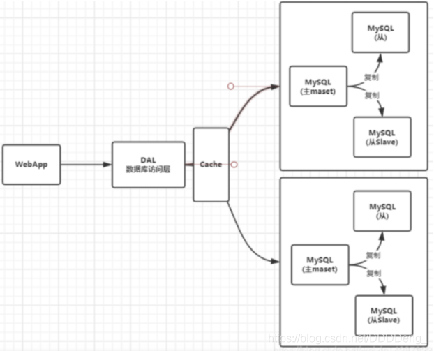
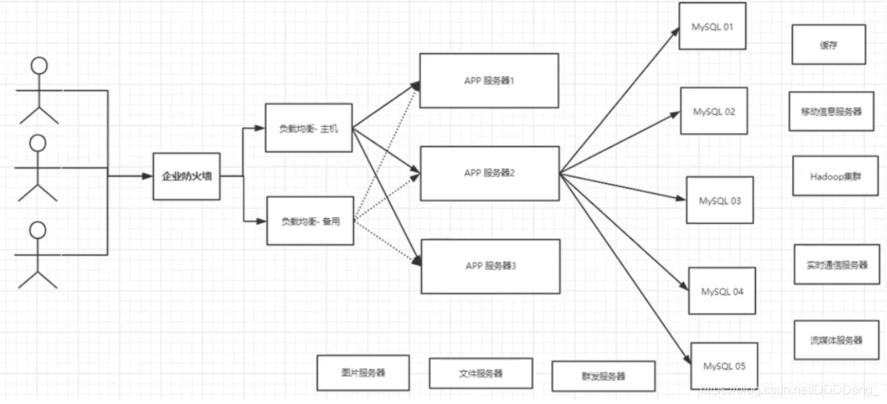
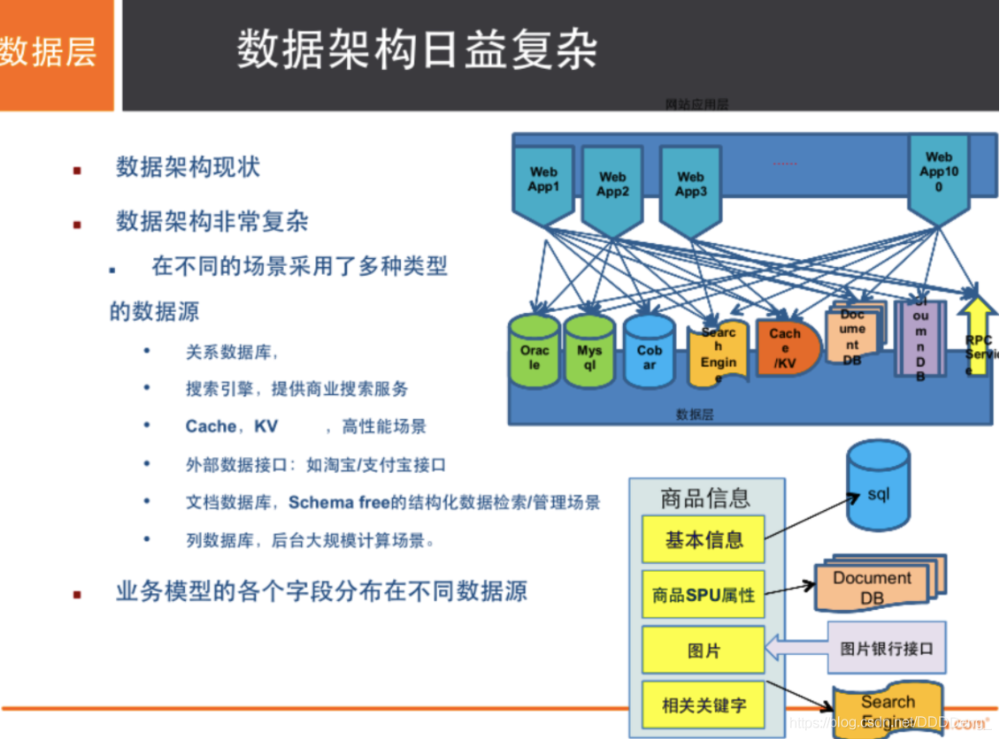
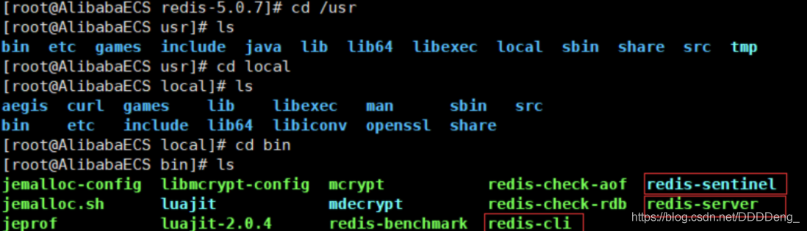
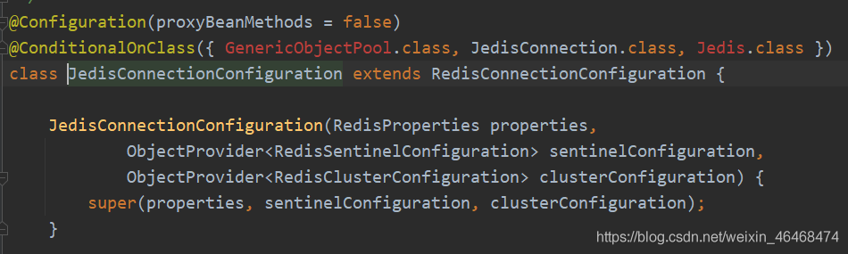
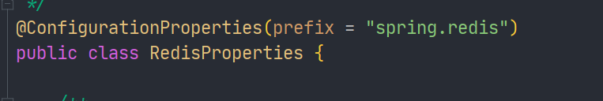
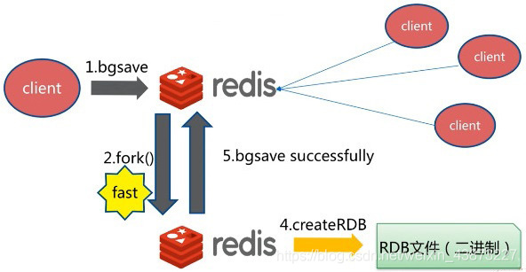
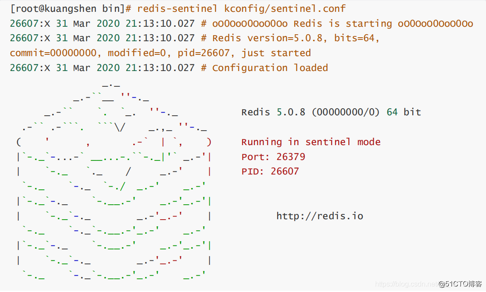
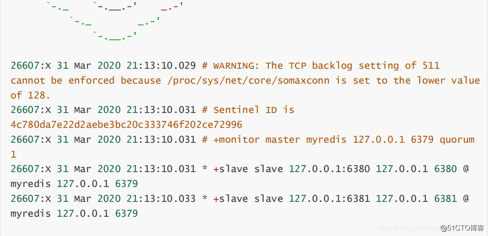

# Redis

## 一、Nosql概述

### 为什么使用Nosql

> 1、单机Mysql时代


90年代,一个网站的访问量一般不会太大，单个数据库完全够用。随着用户增多，网站出现以下问题：

1. 数据量增加到一定程度，单机数据库就放不下了
2. 数据的索引（B+ Tree）,一个机器内存也存放不下
3. 访问量变大后（读写混合），一台服务器承受不住。

> 2、Memcached(缓存) + Mysql + 垂直拆分（读写分离）

网站80%的情况都是在读，每次都要去查询数据库的话就十分的麻烦！所以说我们希望减轻数据库的压力，我们可以使用缓存来保证效率！


优化过程经历了以下几个过程：

1. 优化数据库的数据结构和索引(难度大)
2. 文件缓存，通过IO流获取比每次都访问数据库效率略高，但是流量爆炸式增长时候，IO流也承受不了
3. MemCache,当时最热门的技术，通过在数据库和数据库访问层之间加上一层缓存，第一次访问时查询数据库，将结果保存到缓存，后续的查询先检查缓存，若有直接拿去使用，效率显著提升。

> 3、分库分表 + 水平拆分 + Mysql集群



> 4、如今最近的年代

如今信息量井喷式增长，各种各样的数据出现（用户定位数据，图片数据等），大数据的背景下关系型数据库（RDBMS）无法满足大量数据要求。Nosql数据库就能轻松解决这些问题。

> 目前一个基本的互联网项目



> 为什么要用NoSQL ？

用户的个人信息，社交网络，地理位置。用户自己产生的数据，用户日志等等爆发式增长！
这时候我们就需要使用NoSQL数据库的，Nosql可以很好的处理以上的情况！

### 什么是Nosql

**NoSQL = Not Only SQL（不仅仅是SQL）**

Not Only Structured Query Language

关系型数据库：列+行，同一个表下数据的结构是一样的。

非关系型数据库：数据存储没有固定的格式，并且可以进行横向扩展。

NoSQL泛指**非关系型数据库**，随着web2.0互联网的诞生，传统的关系型数据库很难对付web2.0时代！尤其是超大规模的高并发的社区，暴露出来很多难以克服的问题，NoSQL在当今大数据环境下发展的十分迅速，Redis是发展最快的。

### Nosql特点

1. 方便扩展（数据之间没有关系，很好扩展！）
2. 大数据量高性能（Redis一秒可以写8万次，读11万次，NoSQL的缓存记录级，是一种细粒度的缓存，性能会比较高！）
3. 数据类型是多样型的！（不需要事先设计数据库，随取随用）
4. 传统的 RDBMS 和 NoSQL

```bash
传统的 RDBMS(关系型数据库)
- 结构化组织
- SQL
- 数据和关系都存在单独的表中 row col
- 操作，数据定义语言
- 严格的一致性
- 基础的事务
- ...
```

```bash
Nosql
- 不仅仅是数据
- 没有固定的查询语言
- 键值对存储，列存储，文档存储，图形数据库（社交关系）
- 最终一致性
- CAP定理和BASE
- 高性能，高可用，高扩展
- ...
```

> 了解：3V + 3高

大数据时代的3V ：主要是**描述问题**的

1. 海量Velume
2. 多样Variety
3. 实时Velocity

大数据时代的3高 ： 主要是**对程序的要求**

1. 高并发
2. 高可扩
3. 高性能

真正在公司中的实践：NoSQL + RDBMS 一起使用才是最强的。

### 阿里巴巴演进分析

推荐阅读：阿里云的这群疯子https://yq.aliyun.com/articles/653511




```bash
# 商品信息
- 一般存放在关系型数据库：Mysql,阿里巴巴使用的Mysql都是经过内部改动的。

# 商品描述、评论(文字居多)
- 文档型数据库：MongoDB

# 图片
- 分布式文件系统 FastDFS
- 淘宝：TFS
- Google: GFS
- Hadoop: HDFS
- 阿里云: oss

# 商品关键字 用于搜索
- 搜索引擎：solr,elasticsearch
- 阿里：Isearch 多隆

# 商品热门的波段信息
- 内存数据库：Redis，Memcache

# 商品交易，外部支付接口
- 第三方应用
```

### Nosql的四大分类

> **KV键值对**

- 新浪：**Redis**
- 美团：Redis + Tair
- 阿里、百度：Redis + Memcache

> **文档型数据库（bson数据格式）：**

- MongoDB

  (掌握)

  - 基于分布式文件存储的数据库。C++编写，用于处理大量文档。
  - MongoDB是RDBMS和NoSQL的中间产品。MongoDB是非关系型数据库中功能最丰富的，NoSQL中最像关系型数据库的数据库。

- ConthDB

> **列存储数据库**

- **HBase**(大数据必学)
- 分布式文件系统

> **图关系数据库**

用于广告推荐，社交网络

- **Neo4j**、InfoGrid


## 二、Redis入门

### 概述

> Redis是什么？

Redis（==R==emote ==Di==ctionary ==S==erver )，即远程字典服务。

是一个开源的使用ANSI C语言编写、支持网络、可基于内存亦可持久化的日志型、Key-Value数据库，并提供多种语言的API。

与memcached一样，为了保证效率，**数据都是缓存在内存中**。区别的是Redis会周期性的把更新的数据写入磁盘或者把修改操作写入追加的记录文件，并且在此基础上实现了master-slave(主从)同步

> Redis能干什么？

1. 内存存储、持久化，内存是断电即失的，所以需要持久化（RDB、AOF）
2. 高效率、用于高速缓存
3. 发布订阅系统
4. 地图信息分析
5. 计时器、计数器(eg：浏览量)
6. ......

> 特性

1. 多样的数据类型

2. 持久化

3. 集群

4. 事务

   …

### 环境搭建

官网：https://redis.io/

推荐使用Linux服务器学习。

windows版本的Redis已经停更很久了…

### Windows安装

https://github.com/microsoftarchive/redis/releases/tag/win-3.2.100

1. 解压安装包


2. 开启redis-server.exe（默认端口6379）

3. 启动redis-cli.exe测试


### Linux安装

## Linux安装Redis

1. 下载安装包！`redis-5.0.8.tar.gz`
2. 解压Redis的安装包！程序一般放在 `/opt` 目录下


3. 基本环境安装

```bash
yum install gcc-c++
# 然后进入redis目录下执行
make
# 然后执行
make install
```


4. redis默认安装路径 `/usr/local/bin`



5. 将redis的配置文件复制到 程序安装目录 `/usr/local/bin/kconfig`下

   

6. redis默认不是后台启动的，需要修改配置文件！


7. 通过指定的配置文件启动redis服务 

>**一定要使用root用户开启和关闭服务，否则会由于权限问题无法关闭！！！**


8. 使用redis-cli连接指定的端口号测试，Redis的默认端口6379


9. 查看redis进程是否开启


10. 关闭Redis服务 `shutdown`


11. 再次查看进程是否存在

12. 后面我们会使用单机多Redis启动集群测试

## redis-benchmark性能测试工具


**简单测试：**

```bash
# 测试：100个并发连接 100000请求
redis-benchmark -h localhost -p 6379 -c 100 -n 100000
```


### 基础知识

> redis默认有16个数据库


默认使用的第0个;

16个数据库为：DB 0~DB 15
默认使用DB 0 ，可以使用`select n`切换到DB n，`dbsize`可以查看当前数据库的大小（与key数量相关）。

```bash
127.0.0.1:6379> config get databases # 命令行查看数据库数量databases
1) "databases"
2) "16"

127.0.0.1:6379> select 8 # 切换数据库 DB 8
OK
127.0.0.1:6379[8]> dbsize # 查看数据库大小
(integer) 0

# 不同数据库之间 数据是不能互通的，并且dbsize 是根据库中key的个数。
127.0.0.1:6379> set name sakura 
OK
127.0.0.1:6379> SELECT 8
OK
127.0.0.1:6379[8]> get name # db8中并不能获取db0中的键值对。
(nil)
127.0.0.1:6379[8]> DBSIZE
(integer) 0
127.0.0.1:6379[8]> SELECT 0
OK
127.0.0.1:6379> keys *
1) "counter:__rand_int__"
2) "mylist"
3) "name"
4) "key:__rand_int__"
5) "myset:__rand_int__"
127.0.0.1:6379> DBSIZE # size和key个数相关
(integer) 5
```

`keys *` ：查看当前数据库中所有的key。

`flushdb`：清空当前数据库中的键值对。

`flushall`：清空所有数据库的键值对。

> **Redis是单线程的，Redis是基于内存操作的。**

所以**Redis的性能瓶颈不是CPU,而是机器内存和网络带宽**。

那么为什么Redis的速度如此快呢，性能这么高呢？QPS（Queries-Per-Second，每秒内的查询次数）达到10W+

> Redis单线程为什么速度还是这么快？

对于Redis，有两个误区：

1. 高性能的服务器一定是多线程的？
2. 多线程一定比单线程效率高？

**Redis将所有的数据全部放在内存中，使用单线程去操作效率比较高**，**对于多线程，CPU有一种东西叫做上下文切换，这种操作耗时**，对于内存系统来说，没有上下文切换，效率一定是最高的。

Redis使用单进程的模式来处理客户端的请求，对大部分事件的响应都是通过epoll函数的加强封装，Redis的实际处理速度依靠主进程的执行效率，epoll可以显著提高程序在大量并发连接中系统的CPU利用率

## 三、五大数据类型

Redis 是一个开源（BSD许可）的，内存中的数据结构存储系统，它可以用作==数据库==、==缓存==和==消息中间件==。 它支持多种类型的数据结构，如 [字符串（strings）](http://www.redis.cn/topics/data-types-intro.html#strings)， [散列（hashes）](http://www.redis.cn/topics/data-types-intro.html#hashes)， [列表（lists）](http://www.redis.cn/topics/data-types-intro.html#lists)， [集合（sets）](http://www.redis.cn/topics/data-types-intro.html#sets)， [有序集合（sorted sets）](http://www.redis.cn/topics/data-types-intro.html#sorted-sets) 与范围查询， [bitmaps](http://www.redis.cn/topics/data-types-intro.html#bitmaps)， [hyperloglogs](http://www.redis.cn/topics/data-types-intro.html#hyperloglogs) 和 [地理空间（geospatial）](http://www.redis.cn/commands/geoadd.html) 索引半径查询。 Redis 内置了 [复制（replication）](http://www.redis.cn/topics/replication.html)，[LUA脚本（Lua scripting）](http://www.redis.cn/commands/eval.html)， [LRU驱动事件（LRU eviction）](http://www.redis.cn/topics/lru-cache.html)，[事务（transactions）](http://www.redis.cn/topics/transactions.html) 和不同级别的 [磁盘持久化（persistence）](http://www.redis.cn/topics/persistence.html)， 并通过 [Redis哨兵（Sentinel）](http://www.redis.cn/topics/sentinel.html)和自动 [分区（Cluster）](http://www.redis.cn/topics/cluster-tutorial.html)提供高可用性（high availability）。

### Redis-key

```bash
# 基础语法：
# SET key value	          设置一个key
# GET key                 获取一个key对应value
# EXISTS key              查询key是否存在
# MOVE key n（数字）	     将当前key移动到指定的几号数据库中
# KEYS *                  查询当前数据库中全部的key
# EXPIRE key time         设置当前key的过期时间
# TTL key                 查询当前key的存活时间
# TYPE key                查看key的数据类型
127.0.0.1:6379> set name mabiao # 设置key-value
OK
127.0.0.1:6379> get name # 查询key指定的value
"mabiao"
127.0.0.1:6379> EXISTS name # 查看当前key是否存在
(integer) 1
127.0.0.1:6379> EXISTS name1
(integer) 0
127.0.0.1:6379> MOVE name 1 # 将当前key移动到1号数据库
(integer) 1
127.0.0.1:6379> KEYS *
(empty list or set)
127.0.0.1:6379> SELECT 1 # 选择数据库
OK
127.0.0.1:6379[1]> KEYS *
1) "name"
127.0.0.1:6379[1]> EXPIRE name 10 # 设置当前key的过期时间，单位是秒
(integer) 1
127.0.0.1:6379[1]> KEYS *
1) "name"
127.0.0.1:6379[1]> KEYS *
1) "name"
127.0.0.1:6379[1]> KEYS *
1) "name"
127.0.0.1:6379[1]> KEYS *
1) "name"
127.0.0.1:6379[1]> ttl name # 查看指定key的存活时间，
(integer) -2 # 返回-2表示当前key已经过期，如果为-1，表示永不过期
127.0.0.1:6379[1]> KEYS *
(empty list or set)
127.0.0.1:6379> set name mabiao
OK
127.0.0.1:6379> set age 23
OK
127.0.0.1:6379> KEYS *
1) "age"
2) "name"
127.0.0.1:6379> TYPE name # 查看指定key的value的数据类型
string
127.0.0.1:6379> TYPE age
string
127.0.0.1:6379> 
```


### String（字符串）

```bash
# 语法：
# APPEND key appendValue                 对指定key实现字符串拼接，如果key不存在，等同于set
# STRLEN key                             查看指定key的长度
# INCR key                               对指定key进行自增，类似于Java中的i++
# DECR key                               自减，类似于Java的i--
# INCRBY key n                           对指定key按照指定的步长值进行自增
# DECRBY key n											   按照指定的步长值自减
# SETRANGE key index value               从指定key的索引开始，插入指定的value值。
# 																    如果key不存在且索引>1,那么当前的索引之前的数据，会用\x00代替并占用一个索引位置，相当于ASCII码中的null
# GETRANGE key startIndex endIndex			将指定key按照索引的开始和结束范围进行截取，成为一个新的key
# SETEX key time value							 	 设置一个有存活时间的key
# SETNX key value                     	如果这个key不存在，即创建
# MSET key value ...								 	 设置多个key value
# MGET key ...												获取多个key指定的value
# GETSET key value                    	先获取指定的key，然后再设置指定的value
127.0.0.1:6379> set k1 v1
OK
127.0.0.1:6379> get k1
"v1"
127.0.0.1:6379> KEYS * # 获取当前数据库中所有的key
1) "k1"
127.0.0.1:6379> APPEND k1 hello #给k1再继续追加value值
(integer) 7
127.0.0.1:6379> get k1
"v1hello"
127.0.0.1:6379> APPEND k1 ,xiaohuang
(integer) 17
127.0.0.1:6379> STRLEN k1 # 查看当前k1的长度
(integer) 17
127.0.0.1:6379> get k1
"v1hello,xiaohuang"
127.0.0.1:6379> KEYS * 
1) "k1"
127.0.0.1:6379> APPEND name xiaohuang
(integer) 9
127.0.0.1:6379> get name
"xiaohuang"
127.0.0.1:6379> KEYS *
1) "k1"
2) "name"
###################实现自增自减效果################
127.0.0.1:6379> set views 0
OK
127.0.0.1:6379> get views
0
127.0.0.1:6379> INCR views # 设置value的自增效果
(integer) 1
127.0.0.1:6379> INCR views 
(integer) 2
127.0.0.1:6379> get views
"2"
127.0.0.1:6379> DECR views # 设置value的自减效果
(integer) 1
127.0.0.1:6379> DECR views
(integer) 0
127.0.0.1:6379> get views
"0"
############可以在自增自减时设置步长##############
127.0.0.1:6379> INCRBY views 2 # 自增，设置步长为2
(integer) 2
127.0.0.1:6379> INCRBY views 2
(integer) 4
127.0.0.1:6379> get views
"4"
127.0.0.1:6379> DECRBY views 3 # 自减，设置步长为3
(integer) 1
127.0.0.1:6379> DECRBY views 3
(integer) -2
127.0.0.1:6379> get views
"-2"
# 注意：value的自增和自减只适用于Integer类型
127.0.0.1:6379> incr name 
(error) ERR value is not an integer or out of range
#################实现字符串截取效果#################
127.0.0.1:6379> set k1 hello,mabiao
OK
127.0.0.1:6379> get k1
"hello,mabiao"
127.0.0.1:6379> GETRANGE k1 0 3 # 实现字符串截取，有起始索引和结束索引，相当于Java中的subString()
"hell"
# 如果结束索引为-1，则表示当前截取的字符串为全部
127.0.0.1:6379> GETRANGE k1 0 -1
"hello,mabiao"
###############实现字符串的替换效果#################
127.0.0.1:6379> set key2 abcdefg
OK
127.0.0.1:6379> get key2
"abcdefg"
127.0.0.1:6379> SETRANGE key2 2 hello # 实现字符串的替换效果，命令中的数字“2”表示从索引2的位置开始将其替换为指定字符串
(integer) 7
127.0.0.1:6379> get key2
"abhello"
# 如果长度不够会自动添加
127.0.0.1:6379> SETRANGE name 3 hello
(integer) 8
127.0.0.1:6379> get name
"abhhello"
##################################################
# setex(set with expire) # 设置过期时间
# setnx(set with not exist) # 如果key不存在，创建（分布式锁中常用）
127.0.0.1:6379> setex k3 10 v3 # 设置一个k3，过期时间为10秒
OK
127.0.0.1:6379> keys *
1) "k1"
2) "key2"
3) "name"
4) "views"
5) "k3"
# 10秒之后会自动删除
127.0.0.1:6379> keys *
1) "k1"
2) "key2"
3) "name"
4) "views"
127.0.0.1:6379> setnx lan redis # 如果key不存在，即创建
(integer) 1 
127.0.0.1:6379> setnx lan mongodb
(integer) 0 # 0表示没有设置成功，也可理解为“有0行受到影响”
127.0.0.1:6379> get lan
"redis"
######################一次性设置（获取）多个键值对#####################
127.0.0.1:6379> mset k1 v1 k2 v2 k3 v3 # 同时设置多个值
OK
127.0.0.1:6379> KEYS * 
1) "k2"
2) "k1"
3) "k3"
127.0.0.1:6379> mget k1 k2 k3 # 同时获取多个值
1) "v1"
2) "v2"
3) "v3"
# 也可以在这边的语法前面加上一个m，代表设置多个
127.0.0.1:6379> msetnx k1 vv1 k4 v4 
(integer) 0
# 但是这边同时设置多个值，如果有一个key已经存在，那么这一条设置语句便不会执行成功，
# 因为Redis单条语句是原子操作，要么同时成功，要么同时失败
127.0.0.1:6379> keys * 
1) "k2"
2) "k1"
3) "k3"
# 在Redis中，还推荐了一个比较有意思的东西
# 这是Redis中关于key的命名，可以用“:”来代表层次结构，可以对指定的key进行分类存储
127.0.0.1:6379> mset user:1:name xiaohuang user:1:age 21
OK
127.0.0.1:6379> mget user:1:name user:1:age
1) "xiaohuang"
2) "21"
127.0.0.1:6379> getset sqlan redis # 先获取当前key指定的value，如果不存在，会返回nil（null），然后设置新值
(nil)
127.0.0.1:6379> get sqlan
"redis"
127.0.0.1:6379> getset sqlan hbase
"redis"
127.0.0.1:6379> get sqlan
"hbase"
####################################################################
```

类似于Redis中String这样的使用场景，value值可以是字符串，也可以是其他类型

**String的存储的字符串长度最大可以达到512M**

主要用途

- 计数器
- 统计多单位的数量
- 一个用户的粉丝数
- 一个有过期时间的验证码

### List（列表）

Redis中的List列表可以做很多事情，可以将其看成数据结构中的栈，也可以是队列，或者阻塞队列

```bash
# 命令：
# LPUSH key value1 value2 ...                      设置一个key，从头部插入数据（头插法）
# RPUSH key value1 value2 ...										 设置一个key，从尾部插入数据（尾插法）
# LRANGE key startIndex endIndex                   返回列表中从开始索引到结束索引位置的value值
# LPOP key                                         从key头部弹出一个value
# RPOP key                                         从尾部弹出一个value
# LINDEX index                                     返回key中指定索引的value值
# LREM key n value                                 删除key中的指定的value值，n代表删除几个
# LLEN key                                         返回key的长度
# LTRIM key startIndex endIndex                    截取key，截取的范围从开始索引到结束索引
# LSET key index value                             从当前key的索引开始插入指定的value值
# RPOPLPUSH key1 key2                              从key1的尾部弹出一个元素，将此元素从key2的头部插入
# LINSERT key BEFORE|AFTER oldValue newValue       从指定key中已存在的value的前面或者后面插入一个指定的value
127.0.0.1:6379> LPUSH list one # 从list头部插入一个或者多个元素（从左边插入，看命令首字母）
(integer) 1
127.0.0.1:6379> LPUSH list two
(integer) 2
127.0.0.1:6379> LPUSH list three
(integer) 3
# 返回存储在列表中指定范围的元素，0和-1代表开始索引和结束索引，
# -1不代表实际位置的索引，它表示需要返回到这个列表的最后一个元素
127.0.0.1:6379> LRANGE list 0 -1 
1) "three"
2) "two"
3) "one"
127.0.0.1:6379> LRANGE list 0 1 # 返回list中指定位置的元素
1) "three"
2) "two"
127.0.0.1:6379> RPUSH list right # 从list尾部插入一个或多个元素（从右边插入，同第一行一样）
(integer) 4
127.0.0.1:6379> LRANGE list 0 -1
1) "three"
2) "two"
3) "one"
4) "right"
127.0.0.1:6379> LPOP list # 从list头部（左）弹出（删除）一个元素
"three"
127.0.0.1:6379> RPOP list # 从list末尾（右）弹出一个元素
"right"
127.0.0.1:6379> LRANGE list 0 -1
1) "two"
2) "one"
######################################################################################################################
127.0.0.1:6379> LRANGE list 0 -1
1) "two"
2) "one"
127.0.0.1:6379> LINDEX list 0 # 从头部查询list中指定索引的元素
"two"
127.0.0.1:6379> LINDEX list 1 
"one"
######################################################################################################################
127.0.0.1:6379> lrange list 0 -1 
1) "three"
2) "two"
3) "one"
127.0.0.1:6379> LLEN list # 返回list的长度
(integer) 3
127.0.0.1:6379> LPUSH list three # list可以添加重复项，重复项同时存在于list中而不会覆盖
(integer) 4
127.0.0.1:6379> lrange list 0 -1
1) "three"
2) "three"
3) "two"
4) "one"
# ================================================================================================================================
# 表示删除key中的value值
# 语法为 LREM key 删除个数 value
# ================================================================================================================================
127.0.0.1:6379> LREM list 1 three # 删除list中的1个three
(integer) 1
127.0.0.1:6379> lrange list 0 -1
1) "three"
2) "two"
3) "one"
##################信息截取操作#########################################################################################
127.0.0.1:6379> LRANGE mylist 0 -1 
1) "zero"
2) "one"
3) "two"
4) "three"
5) "four"
127.0.0.1:6379> LTRIM mylist 0 2 # 截取mylist列表，只保留从开始索引到结束索引的元素 
OK
127.0.0.1:6379> LRANGE mylist 0 -1 
1) "zero"
2) "one"
3) "two"
127.0.0.1:6379> 
######################################################################################################################
# 复杂命令：rpoplpush
# 语法：rpoplpush source（源列表，必须存在） destination（目标列表，如不存在，即创建）
127.0.0.1:6379> LRANGE mylist 0 -1
1) "zero"
2) "one"
3) "two"
4) "three"
5) "four"
# RPOPLPUSH 表示移除mylist中的最后一个元素，将这个被删除掉的元素从头部进入一个list
127.0.0.1:6379> RPOPLPUSH mylist list 
"four"
127.0.0.1:6379> lrange list 0 -1
1) "four"
127.0.0.1:6379> lrange mylist 0 -1
1) "zero"
2) "one"
3) "two"
4) "three"
######################################################################################################################
# lset 命令，类似于关系型数据库中的Update语句，将指定索引的value值修改为其他的指定value值
127.0.0.1:6379> EXISTS list # 判断key是否存在
(integer) 0
127.0.0.1:6379> lset list 0 item # 如果当前这个key不存在，无法修改，报错
(error) ERR no such key
127.0.0.1:6379> LPUSH list v1 
(integer) 1
127.0.0.1:6379> LRANGE list 0 0
1) "v1"
127.0.0.1:6379> lset list 0 item01 # lset命令只对已存在的列表操作才是有效的（将list当中的0号元素替换为item01）
OK
127.0.0.1:6379> LRANGE list 0 0
1) "item01"
127.0.0.1:6379> lset list 1 item02 # 如果要更新的索引超过列表的长度，那么它也会报错
(error) ERR index out of range
######################################################################################################################
# linsert 命令，从列表中的某一个value值的前面或后面插入一个新的value值
# 语法：linsert key before|after 列表中的value值 新value值
127.0.0.1:6379> LPUSH mylist hello 
(integer) 1
127.0.0.1:6379> LPUSH mylist xiaohuang
(integer) 2
127.0.0.1:6379> LRANGE mylist 0 -1 
1) "xiaohuang"
2) "hello"
127.0.0.1:6379> LINSERT mylist after hello world 
(integer) 3
127.0.0.1:6379> LRANGE mylist 0 -1 
1) "xiaohuang"
2) "hello"
3) "world"
127.0.0.1:6379> LINSERT mylist before xiaohuang nihao
(integer) 4
127.0.0.1:6379> LRANGE mylist 0 -1 
1) "nihao"
2) "xiaohuang"
3) "hello"
4) "world"
```

**List列表实际上它是一个数据结构的链表**

- 可以在Node节点的before或者after，left或者right插入值
- key不存在，创建新链表
- key存在，新增内容
- 如果移除了所有了value，也代表不存在
- 在Node节点的两边插入，效率最高！中间元素效率较低

Redis中可以将这个列表灵活的使用

栈（lpush lpop | rpush rpop），队列（lpush rpop | rpush lpop）

### set（集合）

set集合无序不重复

>Redis的Set是string类型的无序集合。集合成员是唯一的，这就意味着**集合中不能出现重复的数据**。
>
>Redis 中 集合是通过哈希表实现的，所以**添加，删除，查找的复杂度都是O(1)**。
>
>集合中最大的成员数为 $2^{32} - 1$ (4294967295, 每个集合可存储40多亿个成员)。

```bash
# 命令：
# SADD key value1 value2 ...          设置一个key
# SMEMBERS key                        查看当前key
# SISMEMBER key value                 查看key中指定的value是否存在
# SCARD key                           查看key的长度
# SREM key value                      删除key中的指定value
# SPOP key                            随机删除key中的一个value
# SRANDMEMBER key [n]                 随机查看当前key中的一个或者多个value
# SMOVE key1 key2 key1Value           将key1中的value移动到key2中
# SDIFF key1 key2                     两个key相交，求第一个key的补集
# SINTER key1 key2                    两个key相交，求交集
# SUNION key1 key2                    两个key相交，求并集
127.0.0.1:6379> SADD myset hello # myset集合添加元素
(integer) 1
127.0.0.1:6379> SADD myset xiaohuang
(integer) 1
127.0.0.1:6379> SADD myset love
(integer) 1
127.0.0.1:6379> SMEMBERS myset # 查看myset的所有值
1) "love"
2) "hello"
3) "xiaohuang"
127.0.0.1:6379> SISMEMBER myset hello # 判断hello是否在set集合中
(integer) 1 
127.0.0.1:6379> SISMEMBER myset world
(integer) 0 
127.0.0.1:6379> SADD myset hello # 如果往set集合中添加一个重复的值，不会报错，但是也不会插入成功，因为set集合无序且不重复
(integer) 0 
127.0.0.1:6379> SCARD myset # 查看myset集合中的元素个数
(integer) 3
127.0.0.1:6379> SREM myset hello # 删除set集合中hello
(integer) 1
127.0.0.1:6379> SMEMBERS myset
1) "love"
2) "xiaohuang"
######################################################################################################################
# 在一个无序集合中，随机抽取一个数
127.0.0.1:6379> SMEMBERS nums
1) "1"
2) "2"
3) "3"
4) "4"
5) "5"
6) "6"
7) "7"
8) "8"
9) "9"
127.0.0.1:6379> SRANDMEMBER nums # 随机抽取
"8"
127.0.0.1:6379> SRANDMEMBER nums
"7"
127.0.0.1:6379> SRANDMEMBER nums
"5"
127.0.0.1:6379> SRANDMEMBER nums 2 # 随机抽取指定个数的元素 
1) "5"
2) "4"
######################################################################################################################
# 删除指定key，随机删除key
# 以上面的数字集合为例
127.0.0.1:6379> SPOP nums # 随机删除一个set集合元素
"5"
127.0.0.1:6379> SPOP nums
"8"
127.0.0.1:6379> SPOP nums
"7"
127.0.0.1:6379> SMEMBERS nums
1) "1"
2) "2"
3) "3"
4) "4"
5) "6"
6) "9"
######################################################################################################################
# 一个set集合中的值移动到另外一个set集合中
# 语法： smove source(源set集合，必须存在) destination（目标集合，被添加元素） value（必须是源set集合中存在的value）
127.0.0.1:6379> SMEMBERS set01
1) "hello"
2) "xiaohuang"
3) "world"
127.0.0.1:6379> SMEMBERS set02
1) "me"
127.0.0.1:6379> SMOVE set01 set02 xiaohuang # 将set01中的xiaohuang放入到set02中
(integer) 1
127.0.0.1:6379> SMEMBERS set02
1) "xiaohuang"
2) "me"
127.0.0.1:6379> SMEMBERS set01
1) "hello"
2) "world"
######################################################################################################################
# 生活中的一个小现象，就比如说微信公众号，会有共同关注，还有QQ的共同好友
# 数学集合关系中的：交、并、补。微信公众号中的共同关注，以及QQ的共同好友，就是关系中的交！
127.0.0.1:6379> SMEMBERS k1
1) "b"
2) "c"
3) "a"
127.0.0.1:6379> SMEMBERS k2
1) "e"
2) "d"
3) "c"
# 上面的两个集合都有c这个元素
127.0.0.1:6379> SDIFF k1 k2 # k1 与 k2 之间的差集（以k1为主）
1) "b"
2) "a"
127.0.0.1:6379> SINTER k1 k2 # k1 和 k2 之间的交集，公众号的共同关注，QQ中的共同好友就可以这么来实现
1) "c"
127.0.0.1:6379> SUNION k1 k2 # k1 和 k2 之间的并集
1) "c"
2) "a"
3) "e"
4) "b"
5) "d"
# 在多聊一嘴，其实这些命令都可以在英语单词中找到一些规律
# 把SDIFF、SINTER还有SUNION这三个单词首字母去掉，可以得到
# DIFF：different，它代表不同的，用一句Redis官网的翻译来描述：返回的集合元素是第一个key的集合与后面所有key的集合的差集
# INTER：intersection，翻译过来为交叉，同样的，意指数学关系中的交集
# UNION：union，翻译为联合，与数学关系中的并集也是可以沾边的
######################################################################################################################
```

这里的命令，实际上也可以和生活中的东西都有关系，上面提到的共同关注，共同爱好，还有QQ当中的同一个星座，或者是“二度好友”，什么是二度好友，就是类似于QQ当中给你推荐QQ用户的意思，起源于六度分割理论（什么是六度分割理论，简单地说：就是你和任何一个陌生人之间所间隔的人不会超过五个，最多通过六个人你就能够认识任何一个陌生人）

### Hash（哈希）

Redis中的哈希，本质上KV相同但是KV中的V，它也是一个键值对，本质和操作字符串区别不大

```bash
# 命令：
# HSET key field value                 设置单个hash
# HGET key field                       获取单个
# HMSET key field1 v1 field2 v2        设置多个
# HMGET key field                      获取多个
# HGETALL key                          获取hash中全部的field-value
# HLEN key                             获取hash长度
# HEXISTS key field                    查询hash中指定的field是否存在
# HKEYS key                            只获取hash中的field
# HVALS key                            只获取hash中value
# HINCRBY key field n                  对hash中指定的field设置自增自减
127.0.0.1:6379> HSET myhash k1 v1 
(integer) 1
127.0.0.1:6379> HGET myhash k1
"v1"
127.0.0.1:6379> HMSET myhash k2 v2 k3 v3 k4 v4 # 根据Redis 4.0.0，HMSET被视为已弃用。请在新代码中使用HSET。
OK
127.0.0.1:6379> hmget myhash k1 k2 k3 k4
1) "v1"
2) "v2"
3) "v3"
4) "v4"
127.0.0.1:6379> HGETALL myhash # 获取myhash中全部的kv键值对
1) "k1"
2) "v1"
3) "k2"
4) "v2"
5) "k3"
6) "v3"
7) "k4"
8) "v4"
127.0.0.1:6379> HDEL myhash k4 # 删除myhash一个指定的键值对元素
(integer) 1
127.0.0.1:6379> HGETALL myhash
1) "k1"
2) "v1"
3) "k2"
4) "v2"
5) "k3"
6) "v3"
######################################################################################################################
127.0.0.1:6379> HLEN myhash # 获取当前hash中的value长度
(integer) 3
127.0.0.1:6379> HEXISTS myhash k1 # 判断当前hash中的kv键值对是否存在
(integer) 1
127.0.0.1:6379> HEXISTS myhash k4
(integer) 0
127.0.0.1:6379> HKEYS myhash # 只获取hash中的key
1) "k1"
2) "k2"
3) "k3"
127.0.0.1:6379> HVALS myhash # 只获取hash中key对应的value
1) "v1"
2) "v2"
3) "v3"
######################################################################################################################
# 备注：Redis中，有自增，没有自减，即使是没有自减，也可以在自增的步长当中设置一个负数即可
# hincrby key field 步长值
127.0.0.1:6379> hset myhash num 3
(integer) 1
127.0.0.1:6379> HINCRBY myhash num 2
(integer) 5
127.0.0.1:6379> HINCRBY myhash num 2
(integer) 7
127.0.0.1:6379> HSETNX myhash k4 v4 # 如果hash中的一个元素不存在，即可创建
(integer) 1
127.0.0.1:6379> HSETNX myhash k4 vv4 # 存在，即创建失败
(integer) 0
######################################################################################################################
# 可以使用hash做一些临时变更的数据，可以是用户信息，或者是经常变动的信息
# 上面的String也提到了使用“:”进行层次分割，不过hash更适合对象存储，String适合于文本的存储
127.0.0.1:6379> HMSET user:1 name xiaohuang age 21 sex boy
OK
127.0.0.1:6379> HGETALL user:1
1) "name"
2) "xiaohuang"
3) "age"
4) "21"
5) "sex"
6) "boy"
```

 Hash变更的数据user name age，尤其是用户信息之类的，经常变动的信息！**Hash更适合于对象的存储，Sring更加适合字符串存储！**

### Zset（有序集合）

在set的基础上增加了一个score的值，相当于zset k1 score v1，使用score来对当前key中元素进行排序

```bash
# 命令：
# ZADD key score1 value1 score2 value2 ...              zset中添加一个或多个元素
# ZRANGE key startIndex endIndex                        查询从开始到结束索引的zset集合
# ZRANGEBYSCORE key min max [WITHSCORES]                对hash中按照指定数值进行升序排列
# ZREVRANGE key startIndex endIndex                     对指定开始和结束索引进行降序排列
# ZREM key field                                        删除hash中指定的field
# ZCARD key                                             查询hash长度
# ZCOUNT key [min max]                                  查询hash数量，还可以增加最大值和最小值的范围
127.0.0.1:6379> ZADD myset 1 one
(integer) 1
127.0.0.1:6379> ZADD myset 2 two # zset集合添加一个值
(integer) 1
127.0.0.1:6379> ZRANGE myset 0 -1
1) "one"
2) "two"
127.0.0.1:6379> ZADD myset 3 three 4 four
(integer) 2
127.0.0.1:6379> ZRANGE myset 0 -1 
1) "one"
2) "two"
3) "three"
4) "four"
######################################################################################################################
# 实现元素的排序
# 根据zset中score的值来实现元素的排序
127.0.0.1:6379> ZADD salary 3500 xiaohong 6500 xiaohuang 3900 zhangsan
(integer) 3
# 当前命令，inf在Unix系统中代表的意思是无穷，所以当前命令是指，将当前zset，以从小到大的形式进行排列
127.0.0.1:6379> ZRANGEBYSCORE salary -inf +inf 
1) "xiaohong"
2) "zhangsan"
3) "xiaohuang"
127.0.0.1:6379> ZRANGEBYSCORE salary -inf +inf withscores # 在排列的同时，将score和指定的元素全部展示
1) "xiaohong"
2) "3500"
3) "zhangsan"
4) "3900"
5) "xiaohuang"
6) "6500"
127.0.0.1:6379> ZREVRANGE salary 0 -1 withscores # 将数据从大到小进行排列
1) "xiaohuang"
2) "6500"
3) "zhangsan"
4) "3900"
5) "xiaohong"
6) "3500"
127.0.0.1:6379> ZRANGEBYSCORE salary -inf 4000 withscores # 展示的同时还可以指示score的查询最大值，指定查询范围
1) "xiaohong"
2) "3500"
3) "zhangsan"
4) "3900"
127.0.0.1:6379> ZREM salary zhangsan # 删除zset中的一个元素
(integer) 1
127.0.0.1:6379> ZRANGE salary 0 -1 
1) "xiaohong"
2) "xiaohuang"
127.0.0.1:6379> ZCARD salary
(integer) 2
######################################################################################################################
127.0.0.1:6379> ZADD myset 1 hello 2 world 3 xiaohuang 4 xiaohei 5 xiaolan
(integer) 5
# 语法：ZCOUNT key min max ，min和max包左也包右，它是一个闭区间
127.0.0.1:6379> ZCOUNT myset 2 5 # 获取指定区间的成员数量
(integer) 4
127.0.0.1:6379> 
```

其他的API，如果说在工作中出现了，可以查看Redis的官方文档：http://www.redis.cn/commands.html

案例：zset是Redis的数据类型，可以排序，生活中也有案例，班级成绩，员工工资

设置权重，1、普通消息；2、重要消息；添加权重进行消息判断其重要性

来一个更接地气的案例，可以打开B站，排行榜，B站会根据视频的浏览量和弹幕量进行综合评分，进行排名

## 四、三种特殊数据类型

### geospatial 地理位置

微信朋友圈中的朋友的位置，或者是QQ中也有的附近的人，饿了么中外卖小哥的位置距离

这个在Redis中被定为特殊的数据类型可叫做Geo，它是Redis3.2正式推出的一个特性，可以推导出两个地方的地理位置，两地之间的距离，方圆几千米之内的人。

对于这个关于地理的数据类型，它有6个命令

GEOADD
GEODIST
GEOHASH
GEOPOS
GEORADIUS
GEORADIUSBYMEMBER
因为这个特殊的数据类型和地理相关，需要用到地理的经纬度，可以推荐一个网站查看指定城市的经纬度：http://www.jsons.cn/lngcode/

> GEOADD

```bash
# geoadd 添加地理位置
# 语法：GEOADD key 经度 纬度 城市名称 ...
# 注意：南北极无法直接添加。用添加城市数据来说，一般都会使用Java的Jedis来操作，而这些城市数据都是被下载下来通过JavaAPI调用
# 有效经度从-180到180度
# 有效纬度从-85.05112878 到 85.05112878 度。超过范围会出现(error) ERR invalid longitude,latitude pair
127.0.0.1:6379> GEOADD china:city 116.40 39.90 beijing 121.47 31.23 shanghai
(integer) 2
127.0.0.1:6379> GEOADD china:city 113.28 23.12 guangzhou 114.08 22.54 shenzhen
(integer) 2
127.0.0.1:6379> GEOADD china:city 119.30 26.07 fuzhou 118.11 24.49 xiamen
(integer) 2
```

> GEOPOS

```bash
# geopos 查询某个地区的地理位置
# 语法：GEOPOS key member1 member2 ...
127.0.0.1:6379> GEOPOS china:city beijing
1) 1) "116.39999896287918091"
   2) "39.90000009167092543"
127.0.0.1:6379> GEOPOS china:city shanghai guangzhou # 获取一个或多个地理信息
1) 1) "121.47000163793563843"
   2) "31.22999903975783553"
2) 1) "113.27999979257583618"
   2) "23.1199990030198208"
```

> GEODIST

GEODIST命令表示指定两个位置的距离

单位：

- **m**表示单位米
- **km**表示千米
- **mi**表示英里
- **ft**表示英尺

```bash
# 语法：GEODIST key member1 member2 [unit]
# 后面的unit加了中括号表示可选操作，即当前这个命令计算出来的结果为m（米）
127.0.0.1:6379> GEODIST china:city beijing shanghai # 查看beijing和shanghai两个位置的直线距离,默认单位为m
"1067378.7564"
127.0.0.1:6379> GEODIST china:city beijing shanghai km
"1067.3788"
127.0.0.1:6379> GEODIST china:city beijing fuzhou km
"1561.6135"
127.0.0.1:6379>
```

> GEORADIUS

对于社交软件来说，附近的人，就相当于，你现在所在的地址，再加上一定的半径来进行查找

```bash
# 语法：GEORADIUS key 经度 纬度 半径 [单位] [WITHCOORD（搜寻到的目标的经纬度）] [WITHDIST（直线距离）] [count] 
127.0.0.1:6379> GEORADIUS china:city 111 31 1000 km # 以111经度31纬度为中心，1000km为半径搜寻在器范围之内的城市
1) "shenzhen"
2) "guangzhou"
3) "fuzhou"
4) "shanghai"
127.0.0.1:6379> GEORADIUS china:city 111 31 1000 km WITHCOORD WITHDIST # 追加参数，目标经纬度，直线距离
1) 1) "shenzhen"
   2) "989.2821"
   3) 1) "114.08000081777572632"
      2) "22.53999903789756587"
2) 1) "guangzhou"
   2) "905.0108"
   3) 1) "113.27999979257583618"
      2) "23.1199990030198208"
3) 1) "fuzhou"
   2) "978.4847"
   3) 1) "119.29999798536300659"
      2) "26.06999873822022806"
4) 1) "shanghai"
   2) "996.9549"
   3) 1) "121.47000163793563843"
      2) "31.22999903975783553"
127.0.0.1:6379> GEORADIUS china:city 111 31 1000 km WITHCOORD WITHDIST count 2 # 还可以限制查询的结果条数，只显示两条
1) 1) "guangzhou"
   2) "905.0108"
   3) 1) "113.27999979257583618"
      2) "23.1199990030198208"
2) 1) "fuzhou"
   2) "978.4847"
   3) 1) "119.29999798536300659"
      2) "26.06999873822022806"
```

> GEORADIUSBYMEMBER

找出指定元素周围的其他元素，就是以城市为中心，一定长度为半径搜索

```bash
# 语法：GEORADIUSBYMEMBER key member 长度 [unit]单位
127.0.0.1:6379> GEORADIUSBYMEMBER china:city shanghai 2500 km 
1) "shenzhen"
2) "guangzhou"
3) "xiamen"
4) "fuzhou"
5) "shanghai"
6) "beijing"
127.0.0.1:6379> GEORADIUSBYMEMBER china:city shanghai 1000 km # 找出以shanghai为中心，1000km为半径搜索
1) "xiamen"
2) "fuzhou"
3) "shanghai"
127.0.0.1:6379> 
```

> GEOHASH

返回一个或多个元素的GeoHash表示，该命令返回11个字符组成的GeoHash字符串

```bash
# GEOHASH key member
127.0.0.1:6379> GEOHASH china:city beijing 
1) "wx4fbxxfke0"
# 多聊一嘴GeoHash，Redis原先是将二维的经纬度通过一定的策略转换为一维的52位的字符串编码，这个时候的编码描述的地理位置是准确的，这种操作俗称“降维打击”
# 当前命令相比于52位的字符串来说，它砍掉了右边的大多数字符串，这也意味着它失去了一定的精度，但是地理位置的指向不变
```

**geospatial的底层，实际上它就是一个zset集合**，geospatial数据类型是zset的一层封装

可以使用zset的基本命令来查看当前的key

```bash
127.0.0.1:6379> ZRANGE china:city 0 -1 # 使用zset命令查看geospatial
1) "shenzhen"
2) "guangzhou"
3) "xiamen"
4) "fuzhou"
5) "shanghai"
6) "beijing"
```

并且在这个特殊的数据类型中，并没有删除操作，因为**使用zset的基本命令即可删除**

```bash
127.0.0.1:6379> ZREM china:city beijing
(integer) 1
127.0.0.1:6379> ZRANGE china:city 0 -1
1) "shenzhen"
2) "guangzhou"
3) "xiamen"
4) "fuzhou"
5) "shanghai"
```

### Hyperloglogs

> 什么是基数？

**集合中包含的不重复元素即为基数**，就比如一个A数据集，A{1,3.7,9,11}，它的基数为5，可以接受误差

Hyperloglog是Redis2.8.9更新的，它是一种数据结构，主要是针对于基数统计的算法

优点，占用的内存很小，只需要使用12KB的内存即可统计$2^{64}$的数据

在实际业务中，网页的UV（Unique Visitor，独立访客），一个人访问一个网站多次，只能算作是一个

用传统的方式，set集合保存用户的id，然后统计set中元素个数作为标准来判断。使用这种方式来进行数据统计的话，大量的内存用来浪费给保存用户id了，目的是为了计数，而不是为了保存用户id

Hyperloglog计数的错误率在0.81%，用来执行UV任务，可以忽略不计

```bash
# 语法：
# PFADD key value1 value2...                创建一组数据集，如果数据集中有相同的元素就会有去重效果
# PFCOUNT key                               查看元素的长度
# PFMERGE key3 key1 key2                    将两组元素合并成一个新数组，并带有去重效果，相当于数学中的并集
127.0.0.1:6379> PFADD k1 a b c d e f g h i j
(integer) 1 
127.0.0.1:6379> PFCOUNT k1 
(integer) 10
127.0.0.1:6379> PFADD k2 h i j k l n m o p q
(integer) 1
127.0.0.1:6379> PFCOUNT k2 
(integer) 10
127.0.0.1:6379> PFMERGE k3 k1 k2 
OK
127.0.0.1:6379> PFCOUNT k3 
(integer) 17
127.0.0.1:6379> 
```

如果在项目中允许容错，可以使用Hyperloglog

如果不行，就可以直接使用set或者Java的HashMap来实现

### Bitmaps

> Bitmaps是一种位存储的数据类型，在Redis2.2.0被推出，

生活中可以实现的场景，统计活跃用户，在线状态，用户签到，这些都是表示两种状态之间的，可以使用Bitmaps

Bitmaps，译为位图，也是一种数据结构，操作二进制位进行记录，只有0和1两种状态。Bitmaps通过最小的单位bit来进行存储，表示元素对应的状态

```bash
# 语法：
# SETBIT key offset value                    设置一个key，在指定的offset位置上设置一个value，这个value只能是0或者1
# GETBIT key offset                          获取指定key上的offset位的value值
# BITCOUNT key [start] [end]                 在指定key中计算被设置为 1 的比特位的数量。
# BITOP operation destKey key1 key2 ...      对一个或者多个key进行二进制的逻辑运算
# BiTPOS key bit [start] [end]               指定key中返回value中第一个出现0或1的offset    
127.0.0.1:6379> SETBIT week 1 0
(integer) 0
127.0.0.1:6379> SETBIT week 2 0
(integer) 0
127.0.0.1:6379> SETBIT week 3 0
(integer) 0
127.0.0.1:6379> SETBIT week 4 1
(integer) 0
127.0.0.1:6379> SETBIT week 5 1
(integer) 0
127.0.0.1:6379> SETBIT week 6 1
(integer) 0
127.0.0.1:6379> SETBIT week 7 1
(integer) 0
127.0.0.1:6379> GETBIT week 3 
(integer) 0
127.0.0.1:6379> GETBIT week 5 
(integer) 1
127.0.0.1:6379> BITCOUNT week
(integer) 4
127.0.0.1:6379> BITPOS week 1 0 -1 # 在week中返回第一个出现1的value值
(integer) 4
########################################################################################################################################
# BITOP逻辑运算
# 一共有4种逻辑运算，AND、OR、NOT、XOR，分别代表 并、或、非、异或
127.0.0.1:6379> SETBIT bit-1 0 1
(integer) 0
127.0.0.1:6379> SETBIT bit-1 1 1
(integer) 0
127.0.0.1:6379> SETBIT bit-1 3 1
(integer) 0
# bit-1的二进制数为1011，为什么嘞，这和基本数据类型中的list有点相似。
# list列表的LPUSH和LPOP组合起来可以作为一个栈的数据结构，在指定的比特位当中设置一个0或1，先进先出，如果没有设置值，就默认为0来进行处理
127.0.0.1:6379> SETBIT bit-2 0 1
(integer) 0
127.0.0.1:6379> SETBIT bit-2 3 1
(integer) 0
# bit-2的二进制数为1001
# 对bit-1和bit-2进行 并 操作
127.0.0.1:6379> BITOP AND and-bit bit-1 bit-2
(integer) 1
127.0.0.1:6379> GETBIT and-bit 0
(integer) 1
127.0.0.1:6379> GETBIT and-bit 1
(integer) 0
127.0.0.1:6379> GETBIT and-bit 2
(integer) 0
127.0.0.1:6379> GETBIT and-bit 3
(integer) 1
# and-bit：1001

# 对bit-1和bit-2进行 或 操作
127.0.0.1:6379> BITOP OR or-bit bit-1 bit-2
(integer) 1
127.0.0.1:6379> GETBIT or-bit 0
(integer) 1
127.0.0.1:6379> GETBIT or-bit 1
(integer) 1
127.0.0.1:6379> GETBIT or-bit 2
(integer) 0
127.0.0.1:6379> GETBIT or-bit 3
(integer) 1
# or-bit：1011

# 对bit-1进行 非 操作，注意：非操作只针对一个key
127.0.0.1:6379> BITOP NOT not-bit bit-1
(integer) 1
127.0.0.1:6379> GETBIT not-bit 0
(integer) 0
127.0.0.1:6379> GETBIT not-bit 1
(integer) 0
127.0.0.1:6379> GETBIT not-bit 2
(integer) 1
127.0.0.1:6379> GETBIT not-bit 3
(integer) 0
# not-bit：0100
127.0.0.1:6379> BITOP NOT not-bit2 bit-1 bit-2
(error) ERR BITOP NOT must be called with a single source key.

# 对bit-1和bit-2进行 异或 操作
127.0.0.1:6379> BITOP XOR xor-bit bit-1 bit-2
(integer) 1
127.0.0.1:6379> GETBIT xor-bit 0
(integer) 0
127.0.0.1:6379> GETBIT xor-bit 1
(integer) 1
127.0.0.1:6379> GETBIT xor-bit 2
(integer) 0
127.0.0.1:6379> GETBIT xor-bit 3
(integer) 0
# xor-bit：0010
# 备注：BITOP执行命令较慢，因为其时间复杂度为O(n)。
# 在进行计数时，如果数据量过大，建议直接将其指派到master-slave中的slave节点进行处理，避免阻塞master
########################################################################################################################################
```

## 事务

**Redis单条命令保持原子性，但是Redis事务不保证原子性**

Redis事务本质，可以将Redis的事务看成是一个队列，将一组命令进行“入队”，然后一起执行

一个事务中的所有命令都会被序列化，在事务执行的过程中，会按照顺序执行

Redis事务的三个特性：**一次性**，**顺序性**，**排他性**

### Redis事务操作过程

- 开启事务（`multi`）
- 命令入队
- 执行事务（`exec`）

**Redis事务没有隔离级别的概念**

- 不会出现幻读、脏读和不可重复读；
- 所有事务中的命令在加入时都没有被执行，直到提交时才会开始执行(Exec)一次性完成。

```bash
127.0.0.1:6379> multi # 开启事务
OK
127.0.0.1:6379> set k1 v1 # 命令入队
QUEUED
127.0.0.1:6379> set k2 v2 # ..
QUEUED
127.0.0.1:6379> get k1
QUEUED
127.0.0.1:6379> set k3 v3
QUEUED
127.0.0.1:6379> keys *
QUEUED
127.0.0.1:6379> exec # 事务执行
1) OK
2) OK
3) "v1"
4) OK
5) 1) "k3"
   2) "k2"
   3) "k1"
```

**取消事务(`discurd`)**

```bash
127.0.0.1:6379> multi
OK
127.0.0.1:6379> set k1 v1
QUEUED
127.0.0.1:6379> set k2 v2
QUEUED
127.0.0.1:6379> DISCARD # 放弃事务
OK
127.0.0.1:6379> EXEC 
(error) ERR EXEC without MULTI # 当前未开启事务
127.0.0.1:6379> get k1 # 被放弃事务中命令并未执行
(nil)
```

### 事务错误

> 代码语法错误（编译时异常）所有的命令都不执行

```bash
127.0.0.1:6379> multi
OK
127.0.0.1:6379> set k1 v1
QUEUED
127.0.0.1:6379> set k2 v2
QUEUED
127.0.0.1:6379> error k1 # 这是一条语法错误命令
(error) ERR unknown command `error`, with args beginning with: `k1`, # 会报错但是不影响后续命令入队 
127.0.0.1:6379> get k2
QUEUED
127.0.0.1:6379> EXEC
(error) EXECABORT Transaction discarded because of previous errors. # 执行报错
127.0.0.1:6379> get k1 
(nil) # 其他命令并没有被执行
```

> 代码逻辑错误 (运行时异常) **其他命令可以正常执行 ** >>> 所以不保证事务原子性

```bash
127.0.0.1:6379> multi
OK
127.0.0.1:6379> set k1 v1
QUEUED
127.0.0.1:6379> set k2 v2
QUEUED
127.0.0.1:6379> INCR k1 # 这条命令逻辑错误（对字符串进行增量）
QUEUED
127.0.0.1:6379> get k2
QUEUED
127.0.0.1:6379> exec
1) OK
2) OK
3) (error) ERR value is not an integer or out of range # 运行时报错
4) "v2" # 其他命令正常执行

# 虽然中间有一条命令报错了，但是后面的指令依旧正常执行成功了。
# 所以说Redis单条指令保证原子性，但是Redis事务不能保证原子性。
```

### 监控

**悲观锁：**

- 很悲观，认为什么时候都会出现问题，无论做什么都会加锁

**乐观锁：**

- 很乐观，认为什么时候都不会出现问题，所以不会上锁！更新数据的时候去判断一下，在此期间是否有人修改过这个数据
- 获取version
- 更新的时候比较version

使用`watch key`监控指定数据，相当于乐观锁加锁。

> 正常执行

```bash
127.0.0.1:6379> set money 100 # 设置余额:100
OK
127.0.0.1:6379> set use 0 # 支出使用:0
OK
127.0.0.1:6379> watch money # 监视money (上锁)
OK
127.0.0.1:6379> multi
OK
127.0.0.1:6379> DECRBY money 20
QUEUED
127.0.0.1:6379> INCRBY use 20
QUEUED
127.0.0.1:6379> exec # 监视值没有被中途修改，事务正常执行
1) (integer) 80
2) (integer) 20
```

> 测试多线程修改值，使用watch可以当做redis的乐观锁操作（相当于getversion）

我们启动另外一个客户端模拟插队线程。

线程1：

```bash
127.0.0.1:6379> watch money # money上锁
OK
127.0.0.1:6379> multi
OK
127.0.0.1:6379> DECRBY money 20
QUEUED
127.0.0.1:6379> INCRBY use 20
QUEUED
127.0.0.1:6379> 	# 此时事务并没有执行
```

模拟线程插队，线程2：

```bash
127.0.0.1:6379> INCRBY money 500 # 修改了线程一中监视的money
(integer) 600
```

回到线程1，执行事务：

```bash
127.0.0.1:6379> EXEC # 执行之前，另一个线程修改了我们的值，这个时候就会导致事务执行失败
(nil) # 没有结果，说明事务执行失败

127.0.0.1:6379> get money # 线程2 修改生效
"600"
127.0.0.1:6379> get use # 线程1事务执行失败，数值没有被修改
"0"
```

> 解锁获取最新值，然后再加锁进行事务。
>
> `unwatch`进行解锁。

## 六、Jedis

使用Java来操作Redis，Jedis是Redis官方推荐使用的Java连接redis的客户端。

1. 导入依赖

```xml
<!--导入jredis的包-->
<dependency>
    <groupId>redis.clients</groupId>
    <artifactId>jedis</artifactId>
    <version>3.2.0</version>
</dependency>
<!--fastjson-->
<dependency>
    <groupId>com.alibaba</groupId>
    <artifactId>fastjson</artifactId>
    <version>1.2.70</version>
</dependency>
```

编码测试

- 连接数据库
- 操作命令
- 断开连接

```java
package com.zhou.config;

import redis.clients.jedis.Jedis;

public class TestPing {
    public static void main(String[] args) {
        // new一个Jedis对象
        Jedis jedis = new Jedis("127.0.0.1", 6379);
        // Jedis中的API就是之前学习的命令
        System.out.println(jedis.ping());

        jedis.close(); //关闭连接
    }
}
```


不过这边有一个小问题，如果你的Redis是远程连接的话，会出现连接超时或者是拒绝访问的问题，在这边需要做两件事情，当然，**防火墙的关闭也是必不可少的**

打开redis.conf配置文件


随后进行API测试

> ```
> 所有的API与之前的指令一摸一样，没有一点区别
> ```

```java
package com.zhou.config;

import redis.clients.jedis.Jedis;

public class TestRedis {
        public static void main(String[] args) {
//            所有的API与之前的指令一摸一样，没有一点区别
            Jedis jedis = new Jedis("192.168.1.107", 6379);
            System.out.println(jedis.ping());
            // String
            System.out.println(jedis.set("k1", "v1"));
            System.out.println(jedis.get("k1")); // v1
            System.out.println(jedis.append("k1", "+value"));
            System.out.println(jedis.get("k1")); // v1+value
            System.out.println(jedis.strlen("k1")); // 8
            System.out.println("=====================================================");
            // List
            System.out.println(jedis.lpush("listKey", "l1", "l2", "l3"));
            System.out.println(jedis.lrange("listKey", 0, -1)); // [l3, l2, l1]
            System.out.println(jedis.llen("listKey"));
            System.out.println("=====================================================");
            // Hash
            System.out.println(jedis.hset("hashKey", "k1", "v1"));
            System.out.println(jedis.hset("hashKey", "k2", "v2"));
            System.out.println(jedis.hset("hashKey", "k3", "v3"));
            System.out.println(jedis.hmget("hashKey", "k1", "k2", "k3")); // [v1, v2, v3]
            System.out.println(jedis.hgetAll("hashKey")); // {k3=v3, k2=v2, k1=v1}
            System.out.println("=====================================================");
            // Set
            System.out.println(jedis.sadd("setKey", "s1", "s2", "s3", "s4"));
            System.out.println(jedis.smembers("setKey")); // [s2, s1, s4, s3]
            System.out.println(jedis.scard("setKey"));
            System.out.println("=====================================================");
            // ZSet
            System.out.println(jedis.zadd("ZKey", 90, "z1"));
            System.out.println(jedis.zadd("ZKey", 80, "z2"));
            System.out.println(jedis.zadd("ZKey", 85, "z3"));
            System.out.println(jedis.zrange("ZKey", 0, -1)); // [z2, z3, z1]


            jedis.close(); //关闭连接
    }
}
```

测试事务

> 事务

```java
package com.zhou.config;

import com.alibaba.fastjson.JSONObject;
import redis.clients.jedis.Jedis;
import redis.clients.jedis.Transaction;

public class TestTransaction {

    public static void main(String[] args) {
        Jedis jedis = new Jedis("192.168.1.107", 6379);
        jedis.flushDB();
        JSONObject jsonObject = new JSONObject();
        jsonObject.put("name", "xiaohuang");
        jsonObject.put("age", "21");
        jsonObject.put("sex", "boy");
        Transaction multi = jedis.multi(); //  开启事务
        String user = jsonObject.toJSONString();
        try {
            multi.set("user1", user);
            multi.set("user2", user);

            int i = 1/0; //制造异常

            multi.exec();
        } catch (Exception e) {
            multi.discard(); // 出现问题，放弃事务
            e.printStackTrace();
        } finally {
            System.out.println(jedis.mget("user1", "user2"));
            jedis.close(); // 关闭连接
        }
    }
}
```

## 七、SpringBoot整合

> 备注：从SpringBoot2.x之后，原先使用的Jedis被lettuce替代

Jedis：采用直连，模拟多个线程操作会出现安全问题。为避免此问题，需要使用Jedis Pool连接池！类似于BIO模式

lettuce：采用netty网络框架，对象可以在多个线程中被共享，完美避免线程安全问题，减少线程数据，类似于NIO模式

我们在学习SpringBoot自动配置的原理时，整合一个组件并进行配置一定会有一个自动配置类xxxAutoConfiguration,并且在spring.factories中也一定能找到这个类的完全限定名。Redis也不例外。


首先先查看RedisAutoConfiguration中的源码

```java
@Configuration(proxyBeanMethods = false)
@ConditionalOnClass(RedisOperations.class)
@EnableConfigurationProperties(RedisProperties.class)
@Import({ LettuceConnectionConfiguration.class, JedisConnectionConfiguration.class })
public class RedisAutoConfiguration {
  @Bean
  @ConditionalOnMissingBean(name = "redisTemplate")
  public RedisTemplate<Object, Object> redisTemplate(RedisConnectionFactory redisConnectionFactory)
        throws UnknownHostException {
     // 默认的RedisTemplate直接使用此类内部默认设置操作数据，但是Redis对象需要序列化
     // 泛型都是Object，后面使用的话，大都是RedisTemplate<String, Object>
     RedisTemplate<Object, Object> template = new RedisTemplate<>();
     template.setConnectionFactory(redisConnectionFactory);
     return template;
  }

  @Bean
  @ConditionalOnMissingBean
  public StringRedisTemplate stringRedisTemplate(RedisConnectionFactory redisConnectionFactory)
        throws UnknownHostException {
     StringRedisTemplate template = new StringRedisTemplate();
     template.setConnectionFactory(redisConnectionFactory);
     return template;
  }
}
```

上面的@Import注解导入了两个配置类，有Lettuce和Jedis，可以点开这两个类查看




对比一下可以发现，Jedis配置类中有两个类是默认不存在的，不存在就无法使用

现在我们回到RedisAutoConfiguratio


只有两个简单的Bean

- **RedisTemplate**
- **StringRedisTemplate**

当看到xxTemplate时可以对比RestTemplat、SqlSessionTemplate,通过使用这些Template来间接操作组件。那么这俩也不会例外。分别用于操作Redis和Redis中的String数据类型。

在RedisTemplate上也有一个条件注解，说明我们是可以对其进行定制化的

说完这些，我们需要知道如何编写配置文件然后连接Redis，就需要阅读RedisProperties



这是一些基本的配置属性。


还有一些连接池相关的配置。注意使用时一定使用Lettuce的连接池。

1. 导入依赖

```xml
<dependency>
  <groupId>org.springframework.boot</groupId>
  <artifactId>spring-boot-starter-data-redis</artifactId>
</dependency>
```

2. 编写配置

```properties
# 配置Redis
spring.redis.host=127.0.0.1
spring.redis.port=6379
```

备注：这边的配置，需要注意的是，SpringBoot整合的是Lettuce，如果在配置文件中添加额外的配置，比如Redis的最大等待时间、超时时间等，在对应的RedisProperties类所映射的配置文件中，属性名称一定要加上带有lettuce，如果加上jedis，它默认不会生效


3. 使用RedisTemplate测试

```java
@SpringBootTest
class Redis02SpringbootApplicationTests {

    @Autowired
    private RedisTemplate redisTemplate;

    @Test
    void contextLoads() {

        // redisTemplate 操作不同的数据类型，api和我们的指令是一样的
        // opsForValue 操作字符串 类似String
        // opsForList 操作List 类似List
        // opsForHah

        // 除了基本的操作，我们常用的方法都可以直接通过redisTemplate操作，比如事务和基本的CRUD

        // 获取连接对象
        //RedisConnection connection = redisTemplate.getConnectionFactory().getConnection();
        //connection.flushDb();
        //connection.flushAll();

        redisTemplate.opsForValue().set("mykey","kuangshen");
        System.out.println(redisTemplate.opsForValue().get("mykey"));
    }
}
```

4. 测试结果正常

**此时我们回到Redis查看数据时候，惊奇发现全是乱码，可是程序中可以正常输出：**

这时候就关系到存储对象的序列化问题，在网络中传输的对象也是一样需要序列化，否者就全是乱码。

我们转到看那个默认的RedisTemplate内部什么样子：


在最开始就能看到几个关于序列化的参数。

默认的序列化器是采用JDK序列化器


而默认的RedisTemplate中的所有序列化器都是使用这个序列化器：


后续我们定制RedisTemplate就可以对其进行修改。

`RedisSerializer`提供了多种序列化方案：

1. 直接调用RedisSerializer的静态方法来返回序列化器，然后set


2. 自己new 相应的实现类，然后set


### 定制RedisTemplate的模板

我们创建一个Bean加入容器，就会触发RedisTemplate上的条件注解使默认的RedisTemplate失效。

```java
package com.zhou.config;

import com.fasterxml.jackson.annotation.JsonAutoDetect;
import com.fasterxml.jackson.annotation.JsonTypeInfo;
import com.fasterxml.jackson.annotation.PropertyAccessor;
import com.fasterxml.jackson.databind.ObjectMapper;
import com.fasterxml.jackson.databind.jsontype.impl.LaissezFaireSubTypeValidator;
import org.springframework.context.annotation.Bean;
import org.springframework.context.annotation.Configuration;
import org.springframework.data.redis.connection.RedisConnectionFactory;
import org.springframework.data.redis.core.RedisTemplate;
import org.springframework.data.redis.serializer.Jackson2JsonRedisSerializer;
import org.springframework.data.redis.serializer.StringRedisSerializer;

/**
 * @program: springboot
 * @description: RedisTemplate配置
 * @create: 2021/06/13 16:05
 */

@Configuration
public class RedisConfig {
    @Bean
    @SuppressWarnings("all")
    public RedisTemplate<String, Object> redisTemplate(RedisConnectionFactory factory) {
        RedisTemplate<String, Object> template = new RedisTemplate<String, Object>();
        template.setConnectionFactory(factory);
        // Json序列化配置
        Jackson2JsonRedisSerializer jackson2JsonRedisSerializer = new Jackson2JsonRedisSerializer(Object.class);
        ObjectMapper om = new ObjectMapper();
        om.setVisibility(PropertyAccessor.ALL, JsonAutoDetect.Visibility.ANY);
        om.activateDefaultTyping(LaissezFaireSubTypeValidator.instance, ObjectMapper.DefaultTyping.NON_FINAL,
                JsonTypeInfo.As.WRAPPER_ARRAY);
        jackson2JsonRedisSerializer.setObjectMapper(om);
        // String 的序列化
        StringRedisSerializer stringRedisSerializer = new StringRedisSerializer();
        // key采用String的序列化方式
        template.setKeySerializer(stringRedisSerializer);
        // hash的key也采用String的序列化方式
        template.setHashKeySerializer(stringRedisSerializer);
        // value序列化方式采用jackson
        template.setValueSerializer(jackson2JsonRedisSerializer);
        // hash的value序列化方式采用jackson
        template.setHashValueSerializer(jackson2JsonRedisSerializer);
        template.afterPropertiesSet();
        return template;
    }
}
```


### RedisUtil配置(CRUD操作string，map,list,set)

```java
package com.zhou.utils;

import org.springframework.beans.factory.annotation.Autowired;
import org.springframework.data.redis.core.RedisTemplate;
import org.springframework.stereotype.Component;
import org.springframework.util.CollectionUtils;

import java.util.Collection;
import java.util.List;
import java.util.Map;
import java.util.Set;
import java.util.concurrent.TimeUnit;

/**
 * @program: springboot
 * @description: Redis工具类
 * @author: huyuqiao
 * @create: 2021/06/13 16:14
 */

@Component
public final class RedisUtil {

    @Autowired
    private RedisTemplate<String, Object> redisTemplate;

    // =============================common============================
    /**
     * 指定缓存失效时间
     * @param key  键
     * @param time 时间(秒)
     */
    public boolean expire(String key, long time) {
        try {
            if (time > 0) {
                redisTemplate.expire(key, time, TimeUnit.SECONDS);
            }
            return true;
        } catch (Exception e) {
            e.printStackTrace();
            return false;
        }
    }

    /**
     * 根据key 获取过期时间
     * @param key 键 不能为null
     * @return 时间(秒) 返回0代表为永久有效
     */
    public long getExpire(String key) {
        return redisTemplate.getExpire(key, TimeUnit.SECONDS);
    }


    /**
     * 判断key是否存在
     * @param key 键
     * @return true 存在 false不存在
     */
    public boolean hasKey(String key) {
        try {
            return redisTemplate.hasKey(key);
        } catch (Exception e) {
            e.printStackTrace();
            return false;
        }
    }


    /**
     * 删除缓存
     * @param key 可以传一个值 或多个
     */
    @SuppressWarnings("unchecked")
    public void del(String... key) {
        if (key != null && key.length > 0) {
            if (key.length == 1) {
                redisTemplate.delete(key[0]);
            } else {
                redisTemplate.delete((Collection<String>) CollectionUtils.arrayToList(key));
            }
        }
    }


    // ============================String=============================

    /**
     * 普通缓存获取
     * @param key 键
     * @return 值
     */
    public Object get(String key) {
        return key == null ? null : redisTemplate.opsForValue().get(key);
    }

    /**
     * 普通缓存放入
     * @param key   键
     * @param value 值
     * @return true成功 false失败
     */

    public boolean set(String key, Object value) {
        try {
            redisTemplate.opsForValue().set(key, value);
            return true;
        } catch (Exception e) {
            e.printStackTrace();
            return false;
        }
    }


    /**
     * 普通缓存放入并设置时间
     * @param key   键
     * @param value 值
     * @param time  时间(秒) time要大于0 如果time小于等于0 将设置无限期
     * @return true成功 false 失败
     */

    public boolean set(String key, Object value, long time) {
        try {
            if (time > 0) {
                redisTemplate.opsForValue().set(key, value, time, TimeUnit.SECONDS);
            } else {
                set(key, value);
            }
            return true;
        } catch (Exception e) {
            e.printStackTrace();
            return false;
        }
    }


    /**
     * 递增
     * @param key   键
     * @param delta 要增加几(大于0)
     */
    public long incr(String key, long delta) {
        if (delta < 0) {
            throw new RuntimeException("递增因子必须大于0");
        }
        return redisTemplate.opsForValue().increment(key, delta);
    }


    /**
     * 递减
     * @param key   键
     * @param delta 要减少几(小于0)
     */
    public long decr(String key, long delta) {
        if (delta < 0) {
            throw new RuntimeException("递减因子必须大于0");
        }
        return redisTemplate.opsForValue().increment(key, -delta);
    }


    // ================================Map=================================

    /**
     * HashGet
     * @param key  键 不能为null
     * @param item 项 不能为null
     */
    public Object hget(String key, String item) {
        return redisTemplate.opsForHash().get(key, item);
    }

    /**
     * 获取hashKey对应的所有键值
     * @param key 键
     * @return 对应的多个键值
     */
    public Map<Object, Object> hmget(String key) {
        return redisTemplate.opsForHash().entries(key);
    }

    /**
     * HashSet
     * @param key 键
     * @param map 对应多个键值
     */
    public boolean hmset(String key, Map<String, Object> map) {
        try {
            redisTemplate.opsForHash().putAll(key, map);
            return true;
        } catch (Exception e) {
            e.printStackTrace();
            return false;
        }
    }


    /**
     * HashSet 并设置时间
     * @param key  键
     * @param map  对应多个键值
     * @param time 时间(秒)
     * @return true成功 false失败
     */
    public boolean hmset(String key, Map<String, Object> map, long time) {
        try {
            redisTemplate.opsForHash().putAll(key, map);
            if (time > 0) {
                expire(key, time);
            }
            return true;
        } catch (Exception e) {
            e.printStackTrace();
            return false;
        }
    }


    /**
     * 向一张hash表中放入数据,如果不存在将创建
     *
     * @param key   键
     * @param item  项
     * @param value 值
     * @return true 成功 false失败
     */
    public boolean hset(String key, String item, Object value) {
        try {
            redisTemplate.opsForHash().put(key, item, value);
            return true;
        } catch (Exception e) {
            e.printStackTrace();
            return false;
        }
    }

    /**
     * 向一张hash表中放入数据,如果不存在将创建
     *
     * @param key   键
     * @param item  项
     * @param value 值
     * @param time  时间(秒) 注意:如果已存在的hash表有时间,这里将会替换原有的时间
     * @return true 成功 false失败
     */
    public boolean hset(String key, String item, Object value, long time) {
        try {
            redisTemplate.opsForHash().put(key, item, value);
            if (time > 0) {
                expire(key, time);
            }
            return true;
        } catch (Exception e) {
            e.printStackTrace();
            return false;
        }
    }


    /**
     * 删除hash表中的值
     *
     * @param key  键 不能为null
     * @param item 项 可以使多个 不能为null
     */
    public void hdel(String key, Object... item) {
        redisTemplate.opsForHash().delete(key, item);
    }


    /**
     * 判断hash表中是否有该项的值
     *
     * @param key  键 不能为null
     * @param item 项 不能为null
     * @return true 存在 false不存在
     */
    public boolean hHasKey(String key, String item) {
        return redisTemplate.opsForHash().hasKey(key, item);
    }


    /**
     * hash递增 如果不存在,就会创建一个 并把新增后的值返回
     *
     * @param key  键
     * @param item 项
     * @param by   要增加几(大于0)
     */
    public double hincr(String key, String item, double by) {
        return redisTemplate.opsForHash().increment(key, item, by);
    }


    /**
     * hash递减
     *
     * @param key  键
     * @param item 项
     * @param by   要减少记(小于0)
     */
    public double hdecr(String key, String item, double by) {
        return redisTemplate.opsForHash().increment(key, item, -by);
    }


    // ============================set=============================

    /**
     * 根据key获取Set中的所有值
     * @param key 键
     */
    public Set<Object> sGet(String key) {
        try {
            return redisTemplate.opsForSet().members(key);
        } catch (Exception e) {
            e.printStackTrace();
            return null;
        }
    }


    /**
     * 根据value从一个set中查询,是否存在
     *
     * @param key   键
     * @param value 值
     * @return true 存在 false不存在
     */
    public boolean sHasKey(String key, Object value) {
        try {
            return redisTemplate.opsForSet().isMember(key, value);
        } catch (Exception e) {
            e.printStackTrace();
            return false;
        }
    }


    /**
     * 将数据放入set缓存
     *
     * @param key    键
     * @param values 值 可以是多个
     * @return 成功个数
     */
    public long sSet(String key, Object... values) {
        try {
            return redisTemplate.opsForSet().add(key, values);
        } catch (Exception e) {
            e.printStackTrace();
            return 0;
        }
    }


    /**
     * 将set数据放入缓存
     *
     * @param key    键
     * @param time   时间(秒)
     * @param values 值 可以是多个
     * @return 成功个数
     */
    public long sSetAndTime(String key, long time, Object... values) {
        try {
            Long count = redisTemplate.opsForSet().add(key, values);
            if (time > 0)
                expire(key, time);
            return count;
        } catch (Exception e) {
            e.printStackTrace();
            return 0;
        }
    }


    /**
     * 获取set缓存的长度
     *
     * @param key 键
     */
    public long sGetSetSize(String key) {
        try {
            return redisTemplate.opsForSet().size(key);
        } catch (Exception e) {
            e.printStackTrace();
            return 0;
        }
    }


    /**
     * 移除值为value的
     *
     * @param key    键
     * @param values 值 可以是多个
     * @return 移除的个数
     */

    public long setRemove(String key, Object... values) {
        try {
            Long count = redisTemplate.opsForSet().remove(key, values);
            return count;
        } catch (Exception e) {
            e.printStackTrace();
            return 0;
        }
    }

    // ===============================list=================================

    /**
     * 获取list缓存的内容
     *
     * @param key   键
     * @param start 开始
     * @param end   结束 0 到 -1代表所有值
     */
    public List<Object> lGet(String key, long start, long end) {
        try {
            return redisTemplate.opsForList().range(key, start, end);
        } catch (Exception e) {
            e.printStackTrace();
            return null;
        }
    }


    /**
     * 获取list缓存的长度
     *
     * @param key 键
     */
    public long lGetListSize(String key) {
        try {
            return redisTemplate.opsForList().size(key);
        } catch (Exception e) {
            e.printStackTrace();
            return 0;
        }
    }


    /**
     * 通过索引 获取list中的值
     *
     * @param key   键
     * @param index 索引 index>=0时， 0 表头，1 第二个元素，依次类推；index<0时，-1，表尾，-2倒数第二个元素，依次类推
     */
    public Object lGetIndex(String key, long index) {
        try {
            return redisTemplate.opsForList().index(key, index);
        } catch (Exception e) {
            e.printStackTrace();
            return null;
        }
    }


    /**
     * 将list放入缓存
     *
     * @param key   键
     * @param value 值
     */
    public boolean lSet(String key, Object value) {
        try {
            redisTemplate.opsForList().rightPush(key, value);
            return true;
        } catch (Exception e) {
            e.printStackTrace();
            return false;
        }
    }


    /**
     * 将list放入缓存
     * @param key   键
     * @param value 值
     * @param time  时间(秒)
     */
    public boolean lSet(String key, Object value, long time) {
        try {
            redisTemplate.opsForList().rightPush(key, value);
            if (time > 0)
                expire(key, time);
            return true;
        } catch (Exception e) {
            e.printStackTrace();
            return false;
        }

    }


    /**
     * 将list放入缓存
     *
     * @param key   键
     * @param value 值
     * @return
     */
    public boolean lSet(String key, List<Object> value) {
        try {
            redisTemplate.opsForList().rightPushAll(key, value);
            return true;
        } catch (Exception e) {
            e.printStackTrace();
            return false;
        }

    }


    /**
     * 将list放入缓存
     *
     * @param key   键
     * @param value 值
     * @param time  时间(秒)
     * @return
     */
    public boolean lSet(String key, List<Object> value, long time) {
        try {
            redisTemplate.opsForList().rightPushAll(key, value);
            if (time > 0)
                expire(key, time);
            return true;
        } catch (Exception e) {
            e.printStackTrace();
            return false;
        }
    }


    /**
     * 根据索引修改list中的某条数据
     *
     * @param key   键
     * @param index 索引
     * @param value 值
     * @return
     */

    public boolean lUpdateIndex(String key, long index, Object value) {
        try {
            redisTemplate.opsForList().set(key, index, value);
            return true;
        } catch (Exception e) {
            e.printStackTrace();
            return false;
        }
    }


    /**
     * 移除N个值为value
     *
     * @param key   键
     * @param count 移除多少个
     * @param value 值
     * @return 移除的个数
     */

    public long lRemove(String key, long count, Object value) {
        try {
            Long remove = redisTemplate.opsForList().remove(key, count, value);
            return remove;
        } catch (Exception e) {
            e.printStackTrace();
            return 0;
        }

    }

}
```

在SpringBoot中，如要操作Redis，就需要一直调用RedisTemplate.opsxxx的方法，一般在工作中不会去这样使用，公司里都会内部将这些操作数据类型的API进行一个封装，就像在学JDBC还有Mybatis等框架的时候，都会有一个XxxUtil的Java工具类，使用起来比较简单

## 八、Redis.conf

> 容量单位不区分大小写，G和GB有区别


> 可以使用 include 组合多个配置文件


> 网络配置


> 日志输出级别


> 日志输出文件


> 持久化规则

由于Redis是基于内存的数据库，需要将数据由内存持久化到文件中

持久化方式：

- RDB
- AOF


> RDB文件相关


> 主从复制


> Security模块中进行密码设置


客户端连接相关

```bash
maxclients 10000  最大客户端数量
maxmemory <bytes> 最大内存限制
maxmemory-policy noeviction # 内存达到限制值的处理策略
```

redis 中的**默认**的过期策略是 **volatile-lru** 。

**设置方式**

```bash
config set maxmemory-policy volatile-lru 
```

maxmemory-policy 六种方式
1、**volatile-lru：**只对设置了过期时间的key进行LRU（默认值）

2、**allkeys-lru** ： 删除lru算法的key

3、**volatile-random：**随机删除即将过期key

4、**allkeys-random：**随机删除

5、**volatile-ttl** ： 删除即将过期的

6、**noeviction** ： 永不过期，返回错误

> AOF相关部分


## 九、Redis持久化

面试和工作，持久化都是重点！（答出RDB，AOF即可）

Redis 是内存数据库，如果不将内存中的数据库状态保存到磁盘，那么一旦服务器进程退出，服务器中的数据库状态也会消失。所以 Redis 提供了持久化功能！

### RDB（Redis DataBase）

​		在指定的时间间隔内将内存中的数据集快照写入磁盘，也就是行话讲的Snapshot快照，它恢复时是将快照文件直接读到内存里。

​		Redis会单独创建（fork）一个子进程来进行持久化，会先将数据写入到一个临时文件中，待持久化过程都结束了，再用这个临时文件替换上次持久化好的文件。整个过程中，主进程是不进行任何IO操作的。这就确保了极高的性能。如果需要进行大规模数据的恢复，且对于数据恢复的完整性不是非常敏感，那RDB方式要比AOF方式更加的高效。RDB的缺点是最后一次持久化后的数据可能丢失。我们默认的就是RDB，一般情况下不需要修改这个配置！

**有时候在生产环境我们会将这个文件进行备份！**

**rdb保存的文件是dump.rdb 都是在我们的配置文件中快照中进行配置的！**


#### RDB工作原理

在进行 RDB 的时候，redis 的主线程是不会做 io 操作的，主线程会 fork 一个子线程来完成该操作；

Redis 调用forks。同时拥有父进程和子进程。
子进程将数据集写入到一个临时 RDB 文件中。
当子进程完成对新 RDB 文件的写入时，Redis 用新 RDB 文件替换原来的 RDB 文件，并删除旧的 RDB 文件。
这种工作方式使得 Redis 可以从写时复制（copy-on-write）机制中获益(因为是使用子进程进行写操作，而父进程依然可以接收来自客户端的请求。)




> 1.触发机制

1. save的规则满足的情况下，会自动触发rdb规则
2. 执行 flushall 命令，也会触发我们的rdb规则！
3. 退出redis，也会产生 rdb 文件！

备份就自动生成一个 dump.rdb


> 2.如何恢复rdb文件？

1. 只需要将rdb文件放在我们redis启动目录就可以，redis启动的时候会自动检查dump.rdb 恢复其中的数据!
2. 查看需要存在的位置

```bash
127.0.0.1:6379> config get dir 
1) "dir" 
2) "/usr/local/bin" # 如果在这个目录下存在 dump.rdb 文件，启动就会自动恢复其中的数据
```

几乎Redis的默认配置就够用了，但是我们还是需要去学习！

RDB优点：

1、适合大规模的数据恢复！
2、对数据的完整性要不高！

RDB缺点：

1、需要一定的时间间隔进程操作！如果redis意外宕机了，这个最后一次修改数据就没有的了！
2、fork进程的时候，会占用一定的内容空间

### AOF（Append Only File）

将我们的所有命令都记录下来，history，恢复的时候就把这个文件全部在执行一遍！


以日志的形式来记录每个写操作，将Redis执行过的所有指令记录下来（读操作不记录），只许追加文件但不可以改写文件，redis启动之初会读取该文件重新构建数据，换言之，redis重启的话就根据日志文件的内容将写指令从前到后执行一次以完成数据的恢复工作

Aof保存的是 appendonly.aof 文件

> append


默认是不开启的，我们需要手动进行配置！我们只需要将 appendonly 改为yes就开启了 aof！

重启，redis 就可以生效了！

如果这个 aof 文件有错误，这时候 redis 是启动不起来的吗，我们需要修复这个aof文件
redis 给我们提供了一个工具 redis-check-aof --fix


如果文件正常，重启就可以直接恢复了！


> 重写规则说明

aof 默认就是文件的无限追加，文件会越来越大！


如果 aof 文件大于 64m，太大了！ fork一个新的进程来将我们的文件进行重写！

> 优点和缺点！

```bash
appendonly no # 默认是不开启aof模式的，默认是使用rdb方式持久化的，在大部分所有的情况下， rdb完全够用！ 
appendfilename "appendonly.aof" # 持久化的文件的名字

# appendfsync always # 每次修改都会 sync。消耗性能 
appendfsync everysec # 每秒执行一次 sync，可能会丢失这1s的数据！ 
# appendfsync no # 不执行 sync，这个时候操作系统自己同步数据，速度最快！

# rewrite 重写
```

优点：

- 每一次修改都同步，文件的完整会更加好！
- 每秒同步一次，可能会丢失一秒的数据
- 从不同步，效率最高的！

缺点：

- 相对于数据文件来说，aof远远大于 rdb，修复的速度也比 rdb慢！
- Aof 运行效率也要比 rdb 慢，所以我们redis默认的配置就是rdb持久化！

> 扩展：

1. RDB 持久化方式能够在指定的时间间隔内对你的数据进行快照存储
2. AOF 持久化方式记录每次对服务器写的操作，当服务器重启的时候会重新执行这些命令来恢复原始的数据，AOF命令以Redis 协议追加保存每次写的操作到文件末尾，Redis还能对AOF文件进行后台重写，使得AOF文件的体积不至于过大。
3. 只做缓存，如果你只希望你的数据在服务器运行的时候存在，你也可以不使用任何持久化
4. 同时开启两种持久化方式
   * **在这种情况下，当redis重启的时候会优先载入AOF文件来恢复原始的数据**，因为在通常情况下AOF文件保存的数据集要比RDB文件保存的数据集要完整。
   * RDB 的数据不实时，同时使用两者时服务器重启也只会找AOF文件，那要不要只使用AOF呢？作者建议不要，因为RDB更适合用于备份数据库（AOF在不断变化不好备份），快速重启，而且不会有AOF可能潜在的Bug，留着作为一个万一的手段。
5. 性能建议
   * 因为RDB文件只用作后备用途，建议只在Slave上持久化RDB文件，而且只要15分钟备份一次就够了，只保留 save 900 1 这条规则。
   * 如果Enable AOF ，好处是在最恶劣情况下也只会丢失不超过两秒数据，启动脚本较简单只load自己的AOF文件就可以了，代价一是带来了持续的IO，二是AOF rewrite 的最后将 rewrite 过程中产生的新数据写到新文件造成的阻塞几乎是不可避免的。只要硬盘许可，应该尽量减少AOF rewrite的频率，AOF重写的基础大小默认值64M太小了，可以设到5G以上，默认超过原大小100%大小重写可以改到适当的数值。
   * 如果不Enable AOF ，仅靠 Master-Slave Repllcation 实现高可用性也可以，能省掉一大笔IO，也减少了rewrite时带来的系统波动。代价是如果Master/Slave 同时倒掉，会丢失十几分钟的数据，启动脚本也要比较两个 Master/Slave 中的 RDB文件，载入较新的那个，微博就是这种架构。

## 十、Redis发布订阅

　Redis 发布订阅(pub/sub)是一种消息通信模式：发送者(pub)发送消息，订阅者(sub)接收消息。微信、微博、关注系统！

Redis 客户端可以订阅任意数量的频道。

订阅/发布消息图：
第一个：消息发送者， 第二个：频道 第三个：消息订阅者！


下图展示了频道 channel1 ， 以及订阅这个频道的三个客户端 —— client2 、 client5 和 client1 之间的关系：


当有新消息通过 PUBLISH 命令发送给频道 channel1 时， 这个消息就会被发送给订阅它的三个客户端：


> 命令

这些命令被广泛用于构建即时通信应用，比如网络聊天室(chatroom)和实时广播、实时提醒等。


> redis测试消息订阅与发送：

1、在一个窗口注册频道


2、在另外一个窗口连接到指定的频道，发送消息


3、频道1接收到消息


###  java实现redis的订阅与发布：

> 特性介绍：

​		什么是redis的发布订阅（pub/sub）？  Pub/Sub功能（means Publish, Subscribe）即发布及订阅功能。基于事件的系统中，Pub/Sub是目前广泛使用的通信模型，它采用事件作为基本的通信机制，提供大规模系统所要求的松散耦合的交互模式：订阅者(如客户端)以事件订阅的方式表达出它有兴趣接收的一个事件或一类事件；发布者(如服务器)可将订阅者感兴趣的事件随时通知相关订阅者。熟悉设计模式的朋友应该了解这与23种设计模式中的观察者模式极为相似。 

   同样,Redis的pub/sub是一种消息通信模式，主要的目的是解除消息发布者和消息订阅者之间的耦合,  Redis作为一个pub/sub的server, 在订阅者和发布者之间起到了消息路由的功能。

　　如果没听懂上述的专业解释，没关系，其实我也没太听懂。

　　简单来讲，这里面还有个channel的概念，这里就是频道的意思，比如你订阅了银行的频道，当你的资金发生变动时，银行就会通过它的频道给你发送信息，在这里，你是属于被动接收的，而不是向银行索要信息，这个例子中，你就是sub（订阅者），而银行就是pub（发布者）。

> 项目运用场景：

一直都认为你会一样技术之前，都必须先明白这样一种技术在哪些地方会被用到，不能盲目的学东西。

　　看到发布订阅的特性，用来做一个简单的实时聊天系统再适合不过了。这是其中之一，当然这样的东西，我们开发中很少涉及到。再举一个常用的，在我们的分布式架构中，常常会遇到读写分离的场景，在写入的过程中，就可以使用redis发布订阅，使得写入值及时发布到各个读的程序中，就保证数据的完整一致性。再比如，在一个博客网站中，有100个粉丝订阅了你，当你发布新文章，就可以推送消息给粉丝们拉。总之场景很多，需要去挖掘。

> 回顾java如何操作redis：

　redis是一种缓存数据库，它也是C/S的结构，也就是客户端和服务端，一般来说，在java中，我们通常使用 jedis（客户端）去操作redis（服务端），这其中操作的时候，两者之间肯定要建立连接，就像数据库链接一样，在关系型数据库中，我们一般都维护一个连接池，以达到链接的复用，来省去建立连接和关闭连接的时间。所以在jedis中，同样也存在一个jedispool（jedis连接池）的概念，我们都是从池中去取连接使用。

> 实现代码：

1、引入依赖

```xml
<!-- 操作redis -->
<dependency>
    <groupId>org.springframework.boot</groupId>
    <artifactId>spring-boot-starter-data-redis</artifactId>
</dependency>
<!--redis客户端-->
<dependency>
    <groupId>redis.clients</groupId>
    <artifactId>jedis</artifactId>
    <version>2.9.0</version>
</dependency>
```

2、创建消息发布者：Publisher

```java
package com.zhou.chatroom;

import redis.clients.jedis.Jedis;
import redis.clients.jedis.JedisPool;

import java.io.BufferedReader;
import java.io.IOException;
import java.io.InputStreamReader;

/**
 * @author zhangzhixi
 * @date 2021/3/2 19:06
 * 消息的发布者
 */
public class Publisher extends Thread {

    private final JedisPool jedisPool;

    public Publisher(JedisPool jedisPool) {
        this.jedisPool = jedisPool;
    }

    @Override
    public void run() {
        BufferedReader reader = new BufferedReader(new InputStreamReader(System.in));
        //连接池中取出一个连接
        Jedis jedis = jedisPool.getResource();
        while (true) {
            String line = null;
            try {
                line = reader.readLine();
                if (!"quit".equals(line)) {
                    //从 mychannel 的频道上推送消息
                    jedis.publish("mychannel", line);
                } else {
                    break;
                }
            } catch (IOException e) {
                e.printStackTrace();
            }
        }
    }
}
```

3、创建消息的订阅者：Subscribe

```java
package com.zhou.chatroom;

import redis.clients.jedis.JedisPubSub;

/**
 * @author zhangzhixi
 * @date 2021/3/2 19:23
 * 消息的订阅者
 */
public class Subscriber extends JedisPubSub {

    public Subscriber() {
    }

    @Override
    public void onMessage(String channel, String message) {       //收到消息会调用
        System.out.println("接收redis发布的消息, 订阅号: " + channel + ", 消息:" + message + "");
    }

    @Override
    public void onSubscribe(String channel, int subscribedChannels) {    //订阅了频道会调用
        System.out.println("订阅redis频道成功, 订阅号:" + channel + ", 频道渠号:" + subscribedChannels + "");
    }

    @Override
    public void onUnsubscribe(String channel, int subscribedChannels) {   //取消订阅 会调用
        System.out.println("退订Redis频道, 订阅号:" + channel + ", 频道渠号:" + subscribedChannels + "");

    }
}
```

4、订阅者去订阅频道

```java
package com.zhou.chatroom;

import redis.clients.jedis.Jedis;
import redis.clients.jedis.JedisPool;

/**
 * @author zhangzhixi
 * @date 2021/3/2 19:23
 * 订阅频道
 */
public class SubThread extends Thread {

    private final JedisPool jedisPool;
    // 消息的订阅者
    private final Subscriber subscriber = new Subscriber();
    // 消息的频道
    private final String channel = "mychannel";

    public SubThread(JedisPool jedisPool) {
        super("SubThread");
        this.jedisPool = jedisPool;
    }

    @Override
    public void run() {
        System.out.println("订阅" + channel + "频道...");
        Jedis jedis = null;
        try {
            //取出一个连接
            jedis = jedisPool.getResource();
            //通过subscribe 的api去订阅，入参是订阅者和频道名
            jedis.subscribe(subscriber, channel);
        } catch (Exception e) {
            System.out.println(String.format("subsrcibe channel error, %s", e));
        } finally {
            if (jedis != null) {
                jedis.close();
            }
        }
    }
}
```

5、测试类

```java
package com.zhou.chatroom;

import redis.clients.jedis.JedisPool;
import redis.clients.jedis.JedisPoolConfig;

/**
 * @author zhangzhixi
 * @date 2021/3/2 19:23
 */
public class PubSubDemo {

    public static void main(String[] args) {
        // 连接redis服务端
        JedisPool jedisPool = new JedisPool(new JedisPoolConfig(), "182.92.209.212", 6379);

        System.out.println("redis线程池正在启动");
        //订阅者
        SubThread subThread = new SubThread(jedisPool);
        subThread.start();
        //发布者
        Publisher publisher = new Publisher(jedisPool);
        publisher.start();
    }
}
```

6、测试结果


## 十一、Redis主从复制

> 概念

**主从复制，是指将一台Redis服务器的数据，复制到其他的Redis服务器**。前者称为主节点(master/leader)，后者称为从节点(slave/follower)；**数据的复制是单向的，只能由主节点到从节点。**
Master以写为主，Slave 以读为主。(==读写分离==)

　　**默认情况下，每台Redis服务器都是主节点；**

且一个主节点可以有多个从节点(或没有从节点)，但一个从节点只能有一个主节点。

主从复制的作用主要包括：

1. 数据冗余：主从复制实现了数据的热备份，是持久化之外的一种数据冗余方式。
2. 故障恢复：当主节点出现问题时，可以由从节点提供服务，实现快速的故障恢复；实际上是一种服务的冗余。
3. 负载均衡：在主从复制的基础上，配合读写分离，可以由主节点提供写服务，由从节点提供读服务（即写Redis数据时应用连接主节点，读Redis数据时应用连接从节点），分担服务器负载；尤其是在写少读多的场景下，通过多个从节点分担读负载，可以大大提高Redis服务器的并发量。
4. 高可用（集群）基石：除了上述作用以外，主从复制还是哨兵和集群能够实施的基础，因此说主从复制是Redis高可用的基础。

一般来说，要将Redis运用于工程项目中，只使用一台Redis是万万不能的（宕机），原因如下：

1. 从结构上，单个Redis服务器会发生单点故障，并且一台服务器需要处理所有的请求负载，压力较大；
2. 从容量上，单个Redis服务器内存容量有限，就算一台Redis服务器内存容量为256G，也不能将所有内存用作Redis存储内存，一般来说，单台Redis最大使用内存不应该超过20G。

电商网站上的商品，一般都是一次上传，无数次浏览的，说专业点也就是"多读少写"。
对于这种场景，我们可以使如下这种架构：


**主从复制，读写分离！ 80% 的情况下都是在进行读操作！减缓服务器的压力！架构中经常使用！ 一主二从！**

只要在公司中，主从复制就是必须要使用的，因为在真实的项目中不可能单机使用Redis！

### 环境配置

只配置从库，不用配置主库！


复制3个配置文件：cp redis.config redis79.config...


修改信息：

- 1、端口


- 2、pid 名字


- 3、log文件名字


- 4、dump.rdb 名字


修改完毕之后，启动我们的3个redis服务器，可以通过进程信息查看！


### 一主二从

`默认情况下，每台Redis服务器都是主节点`； 我们一般情况下只用配置从机就好了！
认老大！ 一主 （79）二从（80，81）


 在主机中查看：


真实的从主配置应该在配置文件中配置，这样的话是永久的，我们这里使用的是命令，暂时的！

从机配置主机的信息：


> 注意：主机可以写，从机不能写只能读！主机中的所有信息和数据，都会自动被从机保存！

主机写：


 从机只能读取，不能写入：


测试：主机断开连接，从机依旧连接到主机的，但是没有写操作，这个时候，主机如果回来了，从机依旧可以直接获取到主机写的信息！

如果是使用命令行，来配置的主从，这个时候如果重启了，就会变回主机！只要变为从机，立马就会从主机中获取值！

> 复制原理

Slave 启动成功连接到 master 后会发送一个sync同步命令

　　Master 接到命令，启动后台的存盘进程，同时收集所有接收到的用于修改数据集命令，在后台进程执行完毕之后，master将传送整个数据文件到slave，并完成一次完全同步。

- **全量复制**：而slave服务在接收到数据库文件数据后，将其存盘并加载到内存中。
- **增量复制**：Master继续将新的所有收集到的修改命令依次传给slave，完成同步

但是只要是重新连接master，一次完全同步（全量复制）将被自动执行！ 我们的数据一定可以在从机中看到！

> 层层链路

上一个M链接下一个 S！

这时候也可以完成我们的主从复制！


如果没有老大了，这个时候能不能选择一个老大出来呢？

谋朝篡位

如果主机断开了连接，我们可以使用 **SLAVEOF no one** 让自己变成主机！其他的节点就可以手动连接到最新的这个主节点（手动）！如果这个时候老大修复了，那就重新连接！

## 十二、哨兵模式(sentinel)

（自动选举老大的模式）

> 概述

主从切换技术的方法是：当主服务器宕机后，需要手动把一台从服务器切换为主服务器，这就需要人工干预，费事费力，还会造成一段时间内服务不可用。这不是一种推荐的方式，更多时候，我们优先考虑哨兵模式。

Redis从2.8开始正式提供了Sentinel（哨兵） 架构来解决这个问题。

谋朝篡位的自动版，==能够后台监控主机是否故障，如果故障了根据投票数自动将从库转换为主库==。

哨兵模式是一种特殊的模式，首先Redis提供了哨兵的命令，哨兵是一个独立的进程，作为进程，它会独立运行。其原理是哨兵通过发送命令，等待Redis服务器响应，从而监控运行的多个Redis实例。


这里的哨兵有两个作用

- 通过发送命令，让Redis服务器返回监控其运行状态，包括主服务器和从服务器。
- 当哨兵监测到master宕机，会自动将slave切换成master，然后通过发布订阅模式通知其他的从服务器，修改配置文件，让它们切换主机。

然而一个哨兵进程对Redis服务器进行监控，可能会出现问题，为此，我们可以使用多个哨兵进行监控。各个哨兵之间还会进行监控，这样就形成了多哨兵模式。


假设主服务器宕机，哨兵1先检测到这个结果，系统并不会马上进行failover过程，仅仅是哨兵1主观的认为主服务器不可用，这个现象成为主观下线。当后面的哨兵也检测到主服务器不可用，并且数量达到一定值时，那么哨兵之间就会进行一次投票，投票的结果由一个哨兵发起，进行failover[故障转移]操作。
切换成功后，就会通过发布订阅模式，让各个哨兵把自己监控的从服务器实现切换主机，这个过程称为客观下线。

> 测试

我们目前的状态是 一主二从！

1、配置哨兵配置文件 sentinel.conf

```bash
# sentinel monitor 哨兵名称 local post 1(表示只要有1个哨兵认为master下线，则判断为master宕机并开始投票)
  sentinel monitor myredis 127.0.0.1 6379 1
```

2、启动哨兵！





如果Master 节点断开了，这个时候就会从从机中随机选择一个服务器！ （这里面有一个投票算法！）


哨兵日志！


**如果主机此时回来了，只能归并到新的主机下，当做从机，这就是哨兵模式的规则！**

> 哨兵模式优缺点

优点：

1. 哨兵集群，基于主从复制模式，所有的主从配置优点，它全有
2.  主从可以切换，故障可以转移，系统的可用性就会更好
3. 哨兵模式就是主从模式的升级，手动到自动，更加健壮！

缺点：

1. Redis 不好在线扩容的，集群容量一旦到达上限，在线扩容就十分麻烦！
2. 实现哨兵模式的配置其实是很麻烦的，里面有很多选择！

> 哨兵模式的全部配置！

```bash
# Example sentinel.conf
 
# 哨兵sentinel实例运行的端口 默认26379
port 26379
 
# 哨兵sentinel的工作目录
dir /tmp
 
# 哨兵sentinel监控的redis主节点的 ip port 
# master-name  可以自己命名的主节点名字 只能由字母A-z、数字0-9 、这三个字符".-_"组成。
# quorum 当这些quorum个数sentinel哨兵认为master主节点失联 那么这时 客观上认为主节点失联了
# sentinel monitor <master-name> <ip> <redis-port> <quorum>
sentinel monitor mymaster 127.0.0.1 6379 1
 
# 当在Redis实例中开启了requirepass foobared 授权密码 这样所有连接Redis实例的客户端都要提供密码
# 设置哨兵sentinel 连接主从的密码 注意必须为主从设置一样的验证密码
# sentinel auth-pass <master-name> <password>
sentinel auth-pass mymaster MySUPER--secret-0123passw0rd
 
 
# 指定多少毫秒之后 主节点没有应答哨兵sentinel 此时 哨兵主观上认为主节点下线 默认30秒
# sentinel down-after-milliseconds <master-name> <milliseconds>
sentinel down-after-milliseconds mymaster 30000
 
# 这个配置项指定了在发生failover主备切换时最多可以有多少个slave同时对新的master进行 同步，
这个数字越小，完成failover所需的时间就越长，
但是如果这个数字越大，就意味着越 多的slave因为replication而不可用。
可以通过将这个值设为 1 来保证每次只有一个slave 处于不能处理命令请求的状态。
# sentinel parallel-syncs <master-name> <numslaves>
sentinel parallel-syncs mymaster 1
 
# 故障转移的超时时间 failover-timeout 可以用在以下这些方面： 
#1. 同一个sentinel对同一个master两次failover之间的间隔时间。
#2. 当一个slave从一个错误的master那里同步数据开始计算时间。直到slave被纠正为向正确的master那里同步数据时。
#3.当想要取消一个正在进行的failover所需要的时间。  
#4.当进行failover时，配置所有slaves指向新的master所需的最大时间。不过，即使过了这个超时，slaves依然会被正确配置为指向master，但是就不按parallel-syncs所配置的规则来了
# 默认三分钟
# sentinel failover-timeout <master-name> <milliseconds>
sentinel failover-timeout mymaster 180000
 
# SCRIPTS EXECUTION
 
#配置当某一事件发生时所需要执行的脚本，可以通过脚本来通知管理员，例如当系统运行不正常时发邮件通知相关人员。
#对于脚本的运行结果有以下规则：
#若脚本执行后返回1，那么该脚本稍后将会被再次执行，重复次数目前默认为10
#若脚本执行后返回2，或者比2更高的一个返回值，脚本将不会重复执行。
#如果脚本在执行过程中由于收到系统中断信号被终止了，则同返回值为1时的行为相同。
#一个脚本的最大执行时间为60s，如果超过这个时间，脚本将会被一个SIGKILL信号终止，之后重新执行。
 
#通知型脚本:当sentinel有任何警告级别的事件发生时（比如说redis实例的主观失效和客观失效等等），将会去调用这个脚本，
#这时这个脚本应该通过邮件，SMS等方式去通知系统管理员关于系统不正常运行的信息。调用该脚本时，将传给脚本两个参数，
#一个是事件的类型，
#一个是事件的描述。
#如果sentinel.conf配置文件中配置了这个脚本路径，那么必须保证这个脚本存在于这个路径，并且是可执行的，否则sentinel无法正常启动成功。
#通知脚本
# sentinel notification-script <master-name> <script-path>
  sentinel notification-script mymaster /var/redis/notify.sh
 
# 客户端重新配置主节点参数脚本
# 当一个master由于failover而发生改变时，这个脚本将会被调用，通知相关的客户端关于master地址已经发生改变的信息。
# 以下参数将会在调用脚本时传给脚本:
# <master-name> <role> <state> <from-ip> <from-port> <to-ip> <to-port>
# 目前<state>总是“failover”,
# <role>是“leader”或者“observer”中的一个。 
# 参数 from-ip, from-port, to-ip, to-port是用来和旧的master和新的master(即旧的slave)通信的
# 这个脚本应该是通用的，能被多次调用，不是针对性的。
# sentinel client-reconfig-script <master-name> <script-path>
sentinel client-reconfig-script mymaster /var/redis/reconfig.sh
```


## 十三、Redis缓存穿透和雪崩

服务的高可用问题！

在这里我们不会详细的区分析解决方案的底层！

Redis缓存的使用，极大的提升了应用程序的性能和效率，特别是数据查询方面。但同时，它也带来了一些问题。其中，最要害的问题，就是数据的一致性问题，从严格意义上讲，这个问题无解。如果对数据的一致性要求很高，那么就不能使用缓存。

另外的一些典型问题就是，缓存穿透、缓存雪崩和缓存击穿。目前，业界也都有比较流行的解决方案。


### 缓存穿透(查询不到数据)

> 概念

​		缓存穿透的概念很简单，用户想要查询一个数据，发现redis内存数据库没有，也就是缓存没有命中，于是向持久层数据库查询。发现也没有，于是本次查询失败。当用户很多的时候，缓存都没有命中（秒杀！），于是都去请求了持久层数据库。这会给持久层数据库造成很大的压力，这时候就相当于出现了缓存穿透。

> 解决方案

#### 布隆过滤器

布隆过滤器是一种数据结构，对所有可能查询的丢弃，从而避免了对底层存储系统的查询压力；所有可能统的查询


#### 缓存空对象
当存储层不命中后，即使返回的空对象也将其缓存起来，同时会设置一个过期时间，之后再访问这个数据将会从缓存中获取，保护后端数据源。


但是这种方法会存在两个问题：

1. 如果空值能够被缓存起来，这就意味着缓存需要更多的空间存储更多的键，因为这当中可能会有很多的空值的键；
2. 即使对空值设置了过期时间，还是会存在缓存层和存储层的数据会有一段时间窗口的不一致，这对于需要保持一致性的业务会有影响。

### 缓存击穿（量太大，缓存过期！）

> 概述

​		这里需要注意和缓存击穿的区别，缓存击穿，是指一个key非常热点，在不停的扛着大并发，大并发集中对这一个点进行访问，当这个key在失效的瞬间，持续的大并发就穿破缓存，直接请求数据库，就像在一个屏障上凿开了一个洞。

​		当某个key在过期的瞬间，有大量的请求并发访问，这类数据一般是热点数据，由于缓存过期，会同时访问数据库来查询最新数据，并且回写缓存，会导使数据库瞬间压力过大。

> 解决方案

#### 设置热点数据永不过期
从缓存层面来看，没有设置过期时间，所以不会出现热点 key 过期后产生的问题。

#### 加互斥锁
分布式锁：使用分布式锁，保证对于每个key同时只有一个线程去查询后端服务，其他线程没有获得分布式锁的权限，因此只需要等待即可。这种方式将高并发的压力转移到了分布式锁，因此对分布式锁的考验很大。

### 缓存雪崩

> 概念

　缓存雪崩，是指在某一个时间段，缓存集中过期失效。Redis 宕机！

产生雪崩的原因之一，比如在写本文的时候，马上就要到双十二零点，很快就会迎来一波抢购，这波商品时间比较集中的放入了缓存，假设缓存一个小时。那么到了凌晨一点钟的时候，这批商品的缓存就都过期了。而对这批商品的访问查询，都落到了数据库上，对于数据库而言，就会产生周期性的压力波峰。于是所有的请求都会达到存储层，存储层的调用量会暴增，造成存储层也会挂掉的情况。


其实集中过期，倒不是非常致命，比较致命的缓存雪崩，是缓存服务器某个节点宕机或断网。因为自然形成的缓存雪崩，一定是在某个时间段集中创建缓存，这个时候，数据库也是可以顶住压力的。无非就是对数据库产生周期性的压力而已。而缓存服务节点的宕机，对数据库服务器造成的压力是不可预知的，很有可能瞬间就把数据库压垮。

> 解决方案

#### redis高可用
​		这个思想的含义是，既然redis有可能挂掉，那我多增设几台redis，这样一台挂掉之后其他的还可以继续工作，其实就是搭建的集群。（异地多活！）

#### 限流降级（在SpringCloud讲解过！）
​		这个解决方案的思想是，在缓存失效后，通过加锁或者队列来控制读数据库写缓存的线程数量。比如对某个key只允许一个线程查询数据和写缓存，其他线程等待。

#### 数据预热
		数据加热的含义就是在正式部署之前，我先把可能的数据先预先访问一遍，这样部分可能大量访问的数据就会加载到缓存中。在即将发生大并发访问前手动触发加载缓存不同的key，设置不同的过期时间，让缓存失效的时间点尽量均匀。