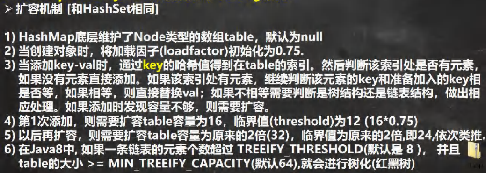

# 哈希表

# 1. 概述

哈希表（Hash Table），也翻译为散列表。一般来说，哈希表都是用来快速判断一个元素是否出现集合里。

>哈希表是根据关键码的值而直接进行访问的数据结构。

## 1.1 哈希函数

哈希函数指**将哈希表中元素的关键键值映射为元素存储位置的函数**。

一般的线性表，树中，记录在结构中的相对位置是随机的，即和记录的关键字之间不存在确定的关系，因此，在结构中查找记录时需进行一系列和关键字的比较。这一类查找方法建立在“比较“的基础上，查找的效率依赖于查找过程中所进行的比较次数。 理想的情况是能直接找到需要的记录，因此必须在记录的存储位置和它的关键字之间建立一个确定的对应关系f，使每个关键字和结构中一个唯一的存储位置相对应。

## 1.2 哈希碰撞

在哈希表中，不同的关键字值对应到同一个存储位置的现象。即关键字K1≠K2，但H（K1）= H（K2）。均匀的哈希函数可以减少冲突，但不能避免冲突。发生冲突后，必须解决；也即必须寻找下一个可用地址。

解决哈希碰撞的方法：**链接法**和**开放寻址法**

### 1.2.1 链接法

链接法其实就是HashMap中用的策略。原理是在HashMap中同样哈希值的位置以一串链表存储起来数据，把多个原始值不同而哈希结果相同的数据以链表存储起来。

### 1.2.2 开放寻址法

当发生地址冲突时，按照某种方法继续探测哈希表中的其他存储单元，直到找到空位置为止。探测方式一般分为：**线性探测**、**二次探测**和**双重散列**。

- 线性探测：使用线性探测法，一定要保证tableSize（哈希表大小）大于dataSize（数据规模）。 我们需要依靠哈希表中的空位来解决碰撞问题。

# 2. HashSet

## 2.1 概述

- HashSet实现了Set接口；

- HashSet实际上是HashMap：

  ```java
  public HashSet(){
      map = new HashMap<>();
  }
  ```

- HashSet可以存放null值，但是只能有一个null；

- HashSet不保证元素是有序的，取决于hash后，再决定索引的结果。（即：不保证存放元素的顺序和去除顺序一致）；

- 不能有重复元素/对象；

- HashSet底层是HashMap，HashMap底层是**数组+链表+红黑树**；

- HashSet添加元素底层：hash()+equals()


- HashSet扩容和转成红黑树机制


## 2.2 相关操作

```java
public class HashSerOperation {

    public static void main(String[] args) {
        HashSet<Integer> hashSet = new HashSet<>(); // HashSet定义

        hashSet.add(5); // 添加元素
        boolean contains = hashSet.contains(3); // 判断是否存在特定元素
        int hashSetSize = hashSet.size(); // hashSet存储元素的个数
        boolean empty = hashSet.isEmpty(); // 判断hashSet是否为空
        boolean remove = hashSet.remove(5); // 删除特定元素，返回是否删除成功
        hashSet.clear(); // 清楚hashSet中所有元素

        // 遍历hashSet
        for (Integer integer : hashSet) {
            System.out.println(integer);
        }

        // Java.util.HashSet.iterator()方法用于返回与哈希集具有相同元素的迭代器。
        // 从哈希集中存在的元素以随机顺序返回元素。
        Iterator<Integer> iterator = hashSet.iterator();
        while (iterator.hasNext()){
            System.out.println(iterator.next());
        }
    }
}
```


# 3. HashMap

## 3.1 概述

- HashMap实现了Map接口，是Map接口使用平吕最高的实现类；
- HashMap是以key-value对的方式来存储对象；
- key不能重复，但是值可以重复，**允许使用null键和null值**；
- 如果添加相同的key，则会覆盖原来的key-value，等同于修改（key不会替换，value会替换）；
- 不保证映射的顺序，因为底层是以hash表的方式来存储的；
- 底层：**数组+链表+红黑树**；
- HashMap没有实现同步，因此是**线程不安全**的，方法没有做同步互斥的操作，**没有synchronized**。
- 扩容机制




## 3.2 相关操作

```java
public class HashMapOperation {
    public static void main(String[] args) {
        HashMap<String, Integer> hashMap = new HashMap<>(); // HashSet定义

        // 增
        hashMap.put("Lily", 19);
        hashMap.put("Jack", 20); // hashMap添加元素
        // 删
        hashMap.remove("Jack"); // hashMap删除特定元素
        // 改
        hashMap.put("Lily", 21); // hashMap修改key-value
        hashMap.replace("Lily", 22); // 替换 hashMap 中是指定的 key 对应的 value。
        hashMap.replace("Lily", 22, 23); // replace(K key, V oldValue, V newValue)
        // 查
        hashMap.get("Lily"); // hashMap获取特定key对应的value
        hashMap.getOrDefault("Lily", 0); // hashMap获取指定key对应对value,如果找不到key,则返回设置的默认值

        int size = hashMap.size(); // 计算hashMap中键/值对的数量
        boolean empty = hashMap.isEmpty(); // 判断hashMap是否为空
        boolean containsKey = hashMap.containsKey("Lily"); // 检查hashMap中是否存在指定的key
        boolean containsValue = hashMap.containsValue(20); // 检查hashMap中是否存在指定的value
        hashMap.clear(); // 删除 hashMap 中的所有键/值对
        hashMap.forEach((key, value) -> {
            value = value - 1;
            System.out.println(value);
        }); // 对hashMap中的每个映射执行指定的操作。

        // 获取所有键
        Set<String> strings = hashMap.keySet(); // 此时所有key构成Set集合
        // 获取所有值
        Collection<Integer> values = hashMap.values(); // 此时所有value构成Collection集合
        // 获取所有映射项
        Set<Map.Entry<String, Integer>> entries = hashMap.entrySet(); // 返回此HashMap中存在的条目(键值对)，以在Set中进行查看

        // 遍历HashMap
        // 1. for each
        // 1.1 for each keySet()
        for (String s : hashMap.keySet()) {System.out.println(s);}
        // 1.2 for each entrySet()
        for (Map.Entry<String, Integer> stringIntegerEntry : hashMap.entrySet()) {
            String key = stringIntegerEntry.getKey();
            Integer value = stringIntegerEntry.getValue();
        }

        // 2. 迭代器iterator
        // 2.1 entrySet().iterator() --> 效率高
        Iterator<Map.Entry<String, Integer>> iterator = hashMap.entrySet().iterator();
        while (iterator.hasNext()){
            Map.Entry<String, Integer> next = iterator.next();
            String key = next.getKey();
            Integer value = next.getValue();
        }
        // 2.2 keySet().iterator() --> 效率低
        Iterator<String> iterator1 = hashMap.keySet().iterator();
        while (iterator1.hasNext()){
            String key = iterator1.next();
            Integer value = hashMap.get(key);
        }

        // 3. forEach()方法
        hashMap.forEach((key, value) -> {
            System.out.println("key:" + key + "value:" + value);
        });
        
        // 按照key排序
        Set<String> set=hashMap.keySet();
        Object[] arr=set.toArray();
        Arrays.sort(arr);
        for (Object o : arr) {
            System.out.println(o + ":" + hashMap.get(o));
        }

        // 按照value排序(视具体情况，更推荐使用优先队列等其他的数据结构)
        List<Map.Entry<String, Integer>> list = new ArrayList<Map.Entry<String, Integer>>(hashMap.entrySet()); //转换为list
        list.sort(new Comparator<Map.Entry<String, Integer>>() {
            @Override
            public int compare(Map.Entry<String, Integer> o1, Map.Entry<String, Integer> o2) {
                return o2.getValue().compareTo(o1.getValue());
            }
        });
        // 或者使用Collections.sort()
//        Collections.sort(list, new Comparator<Map.Entry<String, Integer>>() {
//            @Override
//            public int compare(Map.Entry<String, Integer> o1, Map.Entry<String, Integer> o2) {
//                return o2.getValue().compareTo(o1.getValue());
//            }
//        });
        for (Map.Entry<String, Integer> mapping : list){
            System.out.println(mapping.getKey()+": "+mapping.getValue());
        }

    }
}
```

