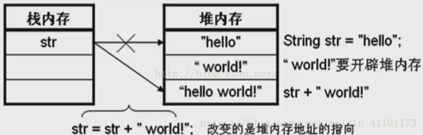
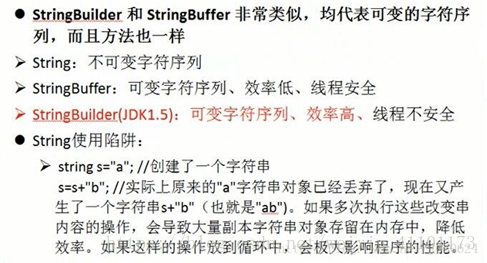

# String、StringBuffer和StringBuilder

# 1. 概述

| String                                                       | StringBuffer                                                 | StringBuilder          |
| ------------------------------------------------------------ | ------------------------------------------------------------ | ---------------------- |
| String 的值是不可变的，这就导致每次对 String 的操作都会生成新的 String 对象，不仅效率低下，而且浪费大量优先的内存空间 | StringBuffer 是可变类，和线程安全的字符串操作类，任何对它指向的字符串的操作都不会产生新的对象。每个 StringBuffer 对象都有一定的缓冲区容量，当字符串大小没有超过容量时，不会分配新的容量，当字符串大小超过容量时，会自动增加容量 | 可变类，速度更快       |
| 不可变                                                       | 可变                                                         | 可变                   |
|                                                              | 线程安全、执行速度慢                                         | 线程不安全、执行速度快 |
|                                                              | 多线程操作字符串                                             | 单线程操作字符串       |

# 2. String类

1. String 类是 final 类，也即意味着 String 类不能被继承，并且它的成员方法都默认为 final 方法。在 Java 中，被 final 修饰的类是不允许被继承的，并且该类中的成员方法都默认为 final 方法。
2. String 类其实是通过 char 数组来保存字符串的。

```java
public final class String
    implements java.io.Serializable, Comparable, CharSequence
{
    /** The value is used for character storage. */
    private final char value[];
 
    /** The offset is the first index of the storage that is used. */
    private final int offset;
 
    /** The count is the number of characters in the String. */
    private final int count;
 
    /** Cache the hash code for the string */
    private int hash; // Default to 0
 
    /** use serialVersionUID from JDK 1.0.2 for interoperability */
    private static final long serialVersionUID = -6849794470754667710L;
 
    ......
 
}
```

String类的一些方法：

```java
public String substring(int beginIndex, int endIndex) {
    if (beginIndex < 0) {
        throw new StringIndexOutOfBoundsException(beginIndex);
    }
    if (endIndex > count) {
        throw new StringIndexOutOfBoundsException(endIndex);
    }
    if (beginIndex > endIndex) {
        throw new StringIndexOutOfBoundsException(endIndex - beginIndex);
    }
    return ((beginIndex == 0) && (endIndex == count)) ? this :
        new String(offset + beginIndex, endIndex - beginIndex, value);
    }
 
 public String concat(String str) {
    int otherLen = str.length();
    if (otherLen == 0) {
        return this;
    }
    char buf[] = new char[count + otherLen];
    getChars(0, count, buf, 0);
    str.getChars(0, otherLen, buf, count);
    return new String(0, count + otherLen, buf);
    }
 
 public String replace(char oldChar, char newChar) {
    if (oldChar != newChar) {
        int len = count;
        int i = -1;
        char[] val = value; /* avoid getfield opcode */
        int off = offset;   /* avoid getfield opcode */
 
        while (++i < len) {
        if (val[off + i] == oldChar) {
            break;
        }
        }
        if (i < len) {
        char buf[] = new char[len];
        for (int j = 0 ; j < i ; j++) {
            buf[j] = val[off+j];
        }
        while (i < len) {
            char c = val[off + i];
            buf[i] = (c == oldChar) ? newChar : c;
            i++;
        }
        return new String(0, len, buf);
        }
    }
    return this;
```

总结：**对 String 对象的任何改变都不影响到原对象，相关的任何 change 操作都会生成新的对象**



例子：

```java
String str1 = "hello world";
String str2 = new String("hello world");
String str3 = "hello world";
String str4 = new String("hello world");

System.out.println(str1==str2);	// false
System.out.println(str1==str3); // true
System.out.println(str2==str4); // false
```

在 class 文件中有一部分 来存储编译期间生成的 字面常量以及符号引用，这部分叫做 class 文件常量池，在运行期间对应着方法区的运行时常量池。

String str1 = "hello world"; 和 String str3 = "hello world"; 都在编译期间生成了 字面常量和符号引用，运行期间字面常量 "hello world" 被存储在运行时常量池（当然只保存了一份）。通过这种方式来将 String 对象跟引用绑定的话，JVM 执行引擎会先在运行时常量池查找是否存在相同的字面常量，如果存在，则直接将引用指向已经存在的字面常量；否则在运行时常量池开辟一个空间来存储该字面常量，并将引用指向该字面常量。

通过 new 关键字来生成对象是在堆区进行的，而在堆区进行对象生成的过程是不会去检测该对象是否已经存在的。因此**通过 new 来创建对象，创建出的一定是不同的对象**，即使字符串的内容是相同的。

# 3. StringBuffer和StringBuilder

String 类型和 StringBuffer 类型的主要性能区别其实在于 **String 是不可变的对象, 因此在每次对 String 类型进行改变的时候其实都等同于生成了一个新的 String 对象，然后将指针指向新的 String 对象，这样不仅效率低下，而且大量浪费有限的内存空间，所以经常改变内容的字符串最好不要用 String**。因为每次生成对象都会对系统性能产生影响，特别当内存中无引用对象多了以后， JVM 的 GC 就会开始工作，那速度是一定会相当慢的。


当对字符串进行修改的时候，特别是字符串对象经常改变的情况下，需要使用 StringBuffer 和 StringBuilder 类。和 String 类不同的是，StringBuffer 和 StringBuilder 类的对象能够被多次的修改，并且**不产生新的未使用对象**。StringBuilder 类和 StringBuffer 之间的最大不同在于 **StringBuilder 的方法不是线程安全的（不能同步访问）**。

由于 StringBuilder 相较于 StringBuffer 有速度优势，所以多数情况下建议使用 StringBuilder 类。然而在应用程序要求线程安全的情况下，则必须使用 StringBuffer 类。




# 4. 例题

1. 下面这段代码的输出结果是什么？

```java
String a = "hello2"; 　　
String b = "hello" + 2; 　　
System.out.println((a == b));
```

　　输出结果为：true。原因很简单，"hello"+2 在编译期间就已经被优化成 "hello2"，因此在运行期间，变量 a 和变量 b 指向的是同一个对象。

2. 下面这段代码的输出结果是什么？

```java
String a = "hello2"; 　  
String b = "hello";       
String c = b + 2;       
System.out.println((a == c));
```

　　输出结果为: false。由于有符号引用的存在，所以  String c = b + 2; 不会在编译期间被优化，不会把 b+2 当做字面常量来处理的，因此这种方式生成的对象事实上是保存在堆上的。因此 a 和 c 指向的并不是同一个对象。

3. 下面这段代码的输出结果是什么？

```java
String a = "hello2";   　 
final String b = "hello";       
String c = b + 2;       
System.out.println((a == c));
```

　　输出结果为：true。对于被 final 修饰的变量，会在 class 文件常量池中保存一个副本，也就是说不会通过连接而进行访问，对 final 变量的访问在编译期间都会直接被替代为真实的值。那么 String c = b + 2; 在编译期间就会被优化成：String c = "hello" + 2

4. 下面这段代码输出结果为：

```java
public class Main {
    public static void main(String[] args) {
        String a = "hello2";
        final String b = getHello();
        String c = b + 2;
        System.out.println((a == c));
    }
     
    public static String getHello() {
        return "hello";
    }
}
```

输出结果为 false。这里面虽然将 b 用 final 修饰了，但是由于其赋值是通过方法调用返回的，那么它的值只能在运行期间确定，因此 a 和 c 指向的不是同一个对象。

5. 下面这段代码的输出结果是什么？

```java
String a = "hello";
String b =  new String("hello");
String c =  new String("hello");
String d = b.intern();

System.out.println(a==b);
System.out.println(b==c);
System.out.println(b==d);
System.out.println(a==d);
```

false, false, false, true. 这里面涉及到的是 String.intern 方法的使用。在 String 类中，intern 方法是一个本地方法，在 JAVA SE6 之前，intern 方法会在运行时常量池中查找是否存在内容相同的字符串，如果存在则返回指向该字符串的引用，如果不存在，则会将该字符串入池，并返回一个指向该字符串的引用。因此，a 和 d 指向的是同一个对象。

6. String str = new String("abc") 创建了多少个对象？

一个。在类加载的过程中，确实在运行时常量池中创建了一个 "abc" 对象，而在代码执行过程中确实只创建了一个 String 对象。如果换成 String str = new String("abc") 涉及到几个 String 对象？合理的解释是 2 个。

7. 下面这段代码1）和2）的区别是什么？

```java
String str1 = "I";
str1 += "love"+"java";        // 1)
str1 = str1+"love"+"java";      // 2)
```

1）的效率比2）的效率要高，1）中的"love"+"java"在编译期间会被优化成"lovejava"，而2）中的不会被优化。