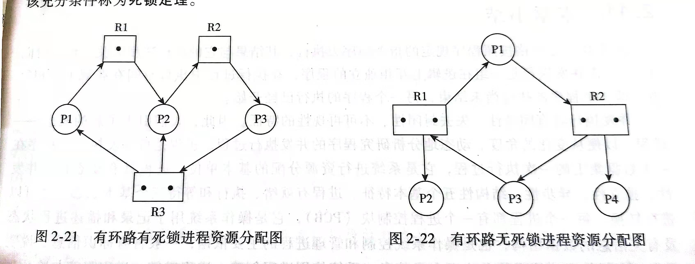
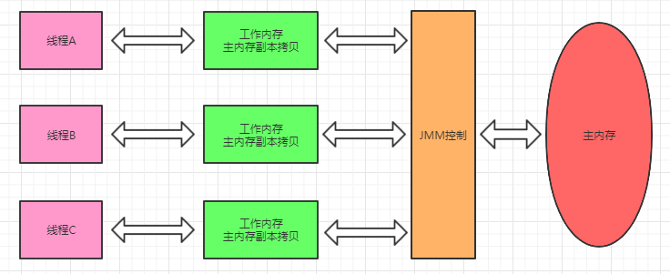

# 1. 计算机网络

### 计算机网络的五层模型

5层模型由**应用层，运输层，网络层，数据链路层，物理层**组成。

- 应用层：**报文**。为操作系统或网络应用程序提供访问网络服务的接口 ，通过应用进程间的交互完成特定网络应用。应用层定义的是应用进程间通信和交互的规则。
  - 常见协议：HTTP、FTP、SMTP、TELNET、POP3、DNS
- 传输层：**报文段**。负责向两个主机中进程之间的通信提供通用数据服务。
  - 常见协议： TCP 和 UDP 协议。
- 网络层：**数据报**。负责对数据包进行路由选择和存储转发。
  - 常见协议： IP 协议、ping使用ICMP协议、ARP/RARP协议。
- 数据链路层：两个相邻节点之间传送数据时，数据链路层将网络层交下来的IP数据报组装成**帧**，在两个相邻的链路上传送帧（frame)。每一帧包括数据和必要的控制信息。（PPP、FR、HDLC、VLAN、MAC ）
- 物理层：物理层所传数据单位是**比特（bit)**。物理层要考虑用多大的电压代表1 或 0 ，以及接受方如何识别发送方所发送的比特。


### 计算机网络的七层模型

7层模型由**应用层，表示层，会话层，传输层，网络层，数据链路层，物理层**组成。

- 表示层：把所传送的数据的抽象语法变换为传送语法，即把不同计算机内部的不同表示形式转换成网络通信中的标准表示形式。此外，对传送的数据加密（或解密）、正文压缩（或还原）也是表示层的任务。
- 会话层：该层对传输的报文提供同步管理服务。在两个不同系统的互相通信的应用进程之间建立、组织和协调交互。例如，确定是双工还是半双工工作。

>第一层：物理层 
>第二层：数据链路层 802.2、802.3ATM、HDLC、FRAME RELAY  
>第三层：网络层 IP、IPX、ARP/RARP、APPLETALK、ICMP  
>第四层：传输层 TCP、UDP、SPX  
>第五层：会话层 RPC、SQL、NFS 、X WINDOWS、ASP 
>第六层：表示层 ASCLL、PICT、TIFF、JPEG、 MIDI、MPEG  
>第七层：应用层 HTTP,FTP,SNMP等


### TCP/IP 4层模型

1. 应用层
2. 传输层
3. 网络层
4. 网络接口层


### IP协议

IP是一种 不可靠的 端到端的数据包 传输服务，主要实现两个功能：数据传输 和 数据分片


1、数据传输：IP协议根据「IP地址」将数据传输到指定的目标主机，就像你寄快递的时候需要提供一个收货地址一样。IP地址是全世界唯一的 32 位「二进制」数，通常用4位点分十进制来表示。

2、数据分片：IP协议负责将网络层的IP数据报（IP分组）传输到链路层，由链路层将数据封装成帧。帧最多只能封装 1500 字节（默认）的数据，当超过上限时，就需要分割数据，放到多个数据帧中传输，到达目标主机后，再将数据重组起来。分割和重组的操作在路由器中完成，发送方发送的信息经过路由器时，路由器会将数据「分割」，放到不同的数据帧中，并在帧首部的字段（MF）标明数据的顺序；当数据传输到目的路由器后，再根据帧首部的字段将信息「重组」，发送给目标主机。

>**为什么TCP报文段的最大数据荷载是65495字节？**
>
>整个TCP报文段必需适配IP分组65535字节的总长度。因为TCP头最少20个字节,IP头的开销最少20个字节,因此仅剩下65495字节用于TCP数据。


### DHCP协议

1、基础概念

DHCP（动态主机配置协议）是一个局域网的网络协议。指的是由服务器控制一段lP地址范围，客户机登录服务器时就可以自动获得服务器分配的lP地址和子网掩码。默认情况下，DHCP作为Windows Server的一个服务组件不会被系统自动安装，还需要管理员手动安装并进行必要的配置。

通俗来讲就是，通过该协议给内部网络自动分配IP地址及一些配置信息（集中分发和管理IP地址）。它是基于Client/Server（CS）结构的。

2、工作原理

DHCP使用**UDP协议**工作，采用**67（DHCP服务器端）**和**68（DHCP客户端）**两个端口号。546号端口用于DHCPv6Client，而不用于DHCPv4，是为DHCPfailover服务。DHCP客户端向DHCP服务器发送的报文称之为DHCP请求报文，而DHCP服务器向DHCP客户端发送的报文称之为DHCP应答报文。

DHCP交互过程共分为4步

**第一步**：Client端在局域网内发起一个DHCP Discover包，目的是想发现能够给它提供IP的DHCP Server（DHCP服务端）。

**第二步**：可用的DHCP Server接收到Discover包之后，通过发送DHCP Offer包给予Client端应答，意在告诉Client端它可以提供IP地址。

**第三步**：Client端接收到Offer包之后，发送DHCP Request包请求分配IP。

**第四步**：DHCP Server发送ACK数据包，确认信息。


### TCP和UDP

- TCP协议（可靠协议）：面向连接，传输可靠以字节流形式顺序传输。位于IP层上方，能够让连接的两端确认请求接收、请求重传丢失或被破坏的包，允许接收端的包以发送时的顺序重新组合在一起。

- UDP协议（不可靠协议）：无连接的不可靠传输，以数据报文段形式传输。不保证包会到达目的地，也不保证包会以发送时相同的顺序到达。

> 例：视频传输中丢失某一两个数据为不会造成质量太多下降。用TCP要等丢失的数据重传耗费时间。而用UDP效率较高，可以在应用层的UDP数据流中建立纠错码，来解决数据丢失问题。


### TCP和UDP的区别

1. TCP面向连接，UDP是无连接的，即发送数据之前不需要建立连接。
2. TCP提供可靠的服务。也就是说，通过TCP连接传送的数据，无差错，不丢失，不重复，且按序到达;UDP尽最大努力交付，即不保证可靠交付。
3. **TCP面向字节流，实际上是TCP把数据看成一连串无结构的字节流，UDP是面向报文的，UDP没有拥塞控制，因此网络出现拥塞不会使源主机的发送速率降低（对实时应用很有用，如IP电话，实时视频会议等）**
4. 每一条TCP连接只能是点到点的，UDP支持一对一，一对多，多对一和多对多的交互通信。
5. TCP首部开销20字节，UDP的首部开销小，只有8个字节。
6. TCP的逻辑通信信道是全双工的可靠信道，UDP则是不可靠信道。


### TCP和UDP的优缺点

* TCP的优点： **可靠，稳定**。TCP的可靠体现在TCP在传递数据之前，会有三次握手来建立连接，而且在数据传递时，有确认、窗口、重传、拥塞控制机制，在数据传完后，还会断开连接用来节约系统资源。 
* TCP的缺点： **慢，效率低，占用系统资源高，易被攻击**。TCP在传递数据之前，要先建连接，这会消耗时间，而且在数据传递时，确认机制、重传机制、拥塞控制机制等都会消耗大量的时间，而且要在每台设备上维护所有的传输连接，事实上，每个连接都会占用系统的CPU、内存等硬件资源。 而且，因为TCP有确认机制、三次握手机制，这些也导致TCP容易被人利用，实现DOS、DDOS、CC等攻击。
* UDP的优点： **快，比TCP稍安全**。UDP没有TCP的握手、确认、窗口、重传、拥塞控制等机制，UDP是一个无状态的传输协议，所以它在传递数据时非常快。没有TCP的这些机制，UDP较TCP被攻击者利用的漏洞就要少一些。但UDP也是无法避免攻击的，比如：UDP Flood攻击…… 
* UDP的缺点：**不可靠，不稳定**。因为UDP没有TCP那些可靠的机制，在数据传递时，如果网络质量不好，就会很容易丢包。 


### 什么时候使用TCP？什么时候使用UDP？

- 什么时候应该使用TCP： **当对网络通讯质量有要求的时候**，比如：整个数据要准确无误的传递给对方，这往往用于一些要求可靠的应用，比如HTTP、HTTPS、FTP等传输文件的协议，POP、SMTP等邮件传输的协议。 在日常生活中，常见使用TCP协议的应用如下： 浏览器，用的HTTP FlashFXP，用的FTP Outlook，用的POP、SMTP Putty，用的Telnet、SSH QQ文件传输。
- 什么时候应该使用UDP： **当对网络通讯质量要求不高的时候，要求网络通讯速度能尽量的快**，这时就可以使用UDP。 比如，日常生活中，常见使用UDP协议的应用如下： QQ语音 QQ视频 TFTP。


### TCP为什么可靠？

+ 确认和重传机制：建立连接时三次握手同步双方的“序列号 + 确认号 + 窗口大小信息”，是确认重传、流控的基础。传输过程中，如果Checksum校验失败、丢包或延时，发送端重传
+ 数据排序：TCP有专门的序列号SN字段，可提供数据re-order
+ 流量控制：如果发送方把数据发送得过快，接收方可能会来不及接收，这就会造成数据的丢失。TCP的流量控制是利用滑动窗口机制实现的，接收方在返回的数据中会包含自己的接收窗口的大小，以控制发送方的数据发送。
+ 拥塞控制：拥塞控制就是防止过多的数据注入到网络中，这样可以使网络中的路由器或链路不致过载。拥塞控制方法：慢开始、拥塞避免算法、快重传、快恢复


### TCP流量控制如何实现？

TCP的流量控制通过**滑动窗口**机制来实现，数据接收端可根据自己的资源情况，随时动态地调整对方的传输窗口大小。

1、滑动窗口的概念

TCP每发送一个数据，都需要进行一次应答。当收到了上一个应答，在发下一个数据，但这种方式效率比较低。数据包往返时间越长，通信的效率就越低。为了解决这个问题，TCP引入了窗口概念。即在接收窗口范围内的数据，无需等待确认，可以继续发送窗口内数据，直到把发送窗口数据传输完毕。

窗口的实现实际上是在操作系统开辟一个缓存空间（空间和序号都是有限的，并且要循环使用，一般为环形队列），发送主机在等到确认应答返回之前，必须在缓冲区保留已发送窗口的数据（超时重传）。收到应答后，将此数据清除。

因为滑动窗口设置得太大或太小都不易于数据传输，所以是根据接收端的反馈，发送端可以对滑动窗口大小进行动态调整的。发送端在发送的数据包的序号必须小于最大的滑动窗口值，所以当发送的数据包过多，导致接收端的缓冲区写满时，接收端会通知给客户端将滑动窗口设置为更小的值，减少发送的量，达到一个流量控制的效果。

2、滑动窗口的过程

假设A要向B发送数据，主机建立TCP连接时，B告诉A接收窗口rwnd 的大小
假设A发送的每个TCP报文段可携带100个字节数据，每个小格子是100个字节数据的序号

- A向B将窗口内的数据封装成报文段发送（在发送数据后,便立刻创建一个该报文段的重传计时器），凡是没有收到确认的数据都会保留在发送缓存，以便在超时重传时使用
- B会对接收到的报文段进行累计确认，返回确认报文段，确认位ACK=1（在建立连接后ACK都为1），ack=201（确认号为接收方期待发送方发送的下一个报文数据的第一个字节的序号）， B根据缓存大小返回 rwnd接收窗口大小=300，
- A收到B发送的确认报文段：
  ① A会将窗口调整为300，
  ② 并删除缓存中已经被确认的数据报 ，
  ③ 则撤销已被确认的报文的重传计时器

假设A发送的数据报中途丢失，该报文段的重传计时器超时后，则A重发报文段，直到B返回确认报文段

3、死锁问题

当B向A发送了0窗口报文，B此时已经没有空间接受A发送的数据了，通知A停止发送。A在收到后即停止发送，等待一段时间后，B有了一些空间，可以继续接收了，此时再向A发送非0窗口报文。如果此非0窗口报文在网络中丢失,那么A将一直等待非零窗口的通告，B也一直在等待A发来的数据，这样就会造成死锁。

解决：
假设A收到B发送的零窗口通知，A就会启动持续计时器；若持续计时器超时，A会发送零窗口探测报文；B收到后将当前窗口大小值返回给A。

如果窗口仍是0，重启持续计时器，超时后再发送探测报文段
假设rwnd不为0，则A改变发送窗口大小，开始发送报文段
注意：零窗口探测报文段也有重传计时器，若零窗口探测报文段丢失，当重传计时器超时，零窗口探测报文段会重传


### TCP拥塞控制

1. 慢开始

   刚开始发送TCP报文段时，先令拥塞窗口cwnd=1 （1个最大报文段长度MSS），逐次加倍。当到达慢开始门限ssthresh时，改用拥塞避免算法。

2. 拥塞避免算法

   cwnd每次加1。当网络出现拥塞时，慢开始门限ssthresh变为此时拥塞窗口cwnd的一半，cwnd 变为1，开始使用慢开始算法。

   

3. 快重传

   发送方一旦收到3个连续的重复确认，就将相应的报文段立即重传，而不是等该报文的超时重传计时器超时再重传。

4. 快恢复

   当出现三个重复的ACK报文时，开始使用快恢复算法，将拥塞窗口变为原来的一半，开始使用拥塞避免算法。(把cwnd值设置为慢开始门限ssthresh减半后的数值，然后开始执行拥塞避免算法，使拥塞窗口缓慢地线性增大。)

   

   

### 有了流量控制为什么还需要拥塞控制？

流量控制是发送数据一方根据接收数据一方的接收数据的能力，包括接收缓存、处理速度等，调整数据发送速率和数据量，以避免接收方被数据淹没；拥塞控制则是根据网络的通过能力或网络拥挤程度，来调整数据发送速率和数据量。也就是说，**拥塞控制主要考虑端系统之间的网络环境**，目的是使网络负载不超过网络的传送能力；而**流量控制主要考虑接收端的数据接收与处理能力**，目的是使发送端的发送速率不超过接收端的接收能力。另外，**拥塞控制的任务是确保网络能够承载所达到的流量；而流量控制只与特定的发送方和特定的接收方之间的点到点流量有关**。做一个类比，假设从A地向B地放行一列车队。如果为了适应B地停车场的停车能力，来调整或约束A地车辆的放行速率，这就是流量控制；如果为了避免A地到B地经过的路网不出现塞车，或者为了消除已发生的塞车现象，而约束A地放行车辆的速率，这就是拥塞控制。显然，虽然流量控制和拥塞控制都可能需要约束或调整端系统发送数据的速率或者数量，但两者的目标和解决的问题不同，调整速率的依据也不同，二者不可能彼此互相取代。


### TCP为什么会丢包？如何解决？

TCP丢包的原因：

1. TCP是基于不可靠的网路实现可靠传输，肯定会存在丢包问题。
2. 如果在通信过程中，发现缺少数据或者丢包，那边么最大的可能性是程序发送过程或者接受过程中出现问题。


解决TCP丢包：

1. 数据分片：发送端对数据进行分片，接受端要对数据进行重组，由TCP确定分片的大小并控制分片和重组
2. 到达确认：接收端接收到分片数据时，根据分片数据序号向发送端发送一个确认
3. 超时重发：发送方在发送分片时设置超时定时器，如果在定时器超时之后没有收到相应的确认，重发分片数据
4. 滑动窗口：TCP连接的每一方的接受缓冲空间大小固定，接收端只允许另一端发送接收端缓冲区所能接纳的数据，TCP在滑动窗口的基础上提供流量控制，防止较快主机致使较慢主机的缓冲区溢出
5. 失序处理：作为IP数据报来传输的TCP分片到达时可能会失序，TCP将对收到的数据进行重新排序，将收到的数据以正确的顺序交给应用层;
6. 重复处理：作为IP数据报来传输的TCP分片会发生重复，TCP的接收端必须丢弃重复的数据;
7. 数据校验：TCP将保持它首部和数据的检验和，这是一个端到端的检验和，目的是检测数据在传输过程中的任何变化。如果收到分片的检验或有差错，TCP将丢弃这个分片，并不确认收到此报文段导致对端超时并重发


### TCP的三次握手过程

简单来说：主机A向B发送连接请求；主机B对收到的主机A的报文段进行确认；主机A再次对主机B的确认进行确认。

* 第一次握手：建立连接时，客户端发送syn包（syn=x）到服务器，并进入SYN_SENT状态，等待服务器确认；SYN：同步序列编号（Synchronize Sequence Numbers）。
* 第二次握手：服务器收到syn包，必须确认客户的SYN（ack=x+1），同时自己也发送一个SYN包（syn=y），即SYN+ACK包，此时服务器进入SYN_RECV状态；
* 第三次握手：客户端收到服务器的SYN+ACK包，向服务器发送确认包ACK(ack=y+1），此包发送完毕，客户端和服务器进入ESTABLISHED（TCP连接成功）状态，完成三次握手。


### 为什么使用三次握手？

- 三次握手最主要的目的就是双方确认自己与对方的发送与接收是正常的。为了防止已失效的连接请求报文段突然又传送到了服务端，因而产生错误。
- 服务端会在最后一次握手接收到客户端发送的ACK数据包，再分配连接资源。
- 如果是三次握手，服务器端会等待客户端的第三次握手，如果第三次握手迟迟不来，服务器端就会释放相关资源。而客户端虽然开启连接了，通过通信就会发现收到服务器端的RST应答。
- 本质上就是减少服务端无用资源的创建，确保建立可靠的通信信道。


### 为什么不能两次握手？

两次握手的问题在于服务器端不知道SYN的有效性。

失效的连接请求报文段是指：主机A发出的连接请求没有收到主机B的确认，于是经过一段时间后，主机A又重新向主机B发送连接请求，且建立成功，顺序完成数据传输。考虑这样一种特殊情况，主机A第一次发送的连接请求并没有丢失，而是因为网络节点导致延迟达到主机B，主机B以为是主机A又发起的新连接，于是主机B同意连接，并向主机A发回确认，但是此时主机A根本不会理会，主机B就一直在等待主机A发送数据，导致主机B的资源浪费。

因为TCP传输是双向的，每个方向的通道的建立都需要一次SYN+ACK，所以建立两个方向的通道最多需要两次(SYN+ACK)，即四次握手。

另外，建立一个方向的通道，最关键就是确定初始的seq号，因此，在SYN中确定seq=n，并收到ACK=n+1时，才算确定好seq号。

因此，TCP的建立最多需要四次握手，但是由于第二次和第三次的握手SYN和ACK可以合并，因此最少可以三次握手。

另外，若只进行两次握手，那么显然只能建立一个单方向的通道，即数据只能从客户端发送到服务器。


### 为什么不能四次握手？

完全可靠的通信协议是根本不存在的，任何的通信协议都是在接受这样的现实情况之上进行的。而三次握手后，客户端和服务端至少可以确认之前的通信情况，但无法确认之后的情况。在这个道理上说，无论是四次还是五次或是更多次都是徒劳的。


### TCP的四次挥手过程

1. 客户端进程发出连接释放报文，并且停止发送数据。**释放数据报文首部，FIN=1，其序列号为seq=u（等于前面已经传送过来的数据的最后一个字节的序号加1）**，此时，**客户端进入FIN-WAIT-1（终止等待1）状态**。 TCP规定，FIN报文段即使不携带数据，也要消耗一个序号。
2. **服务器收到连接释放报文，发出确认报文，ACK=1，ack=u+1，并且带上自己的序列号seq=v，此时，服务端就进入了CLOSE-WAIT（关闭等待）状态**。TCP服务器通知高层的应用进程，客户端向服务器的方向就释放了，这时候处于半关闭状态，即客户端已经没有数据要发送了，但是服务器若发送数据，客户端依然要接受。这个状态还要持续一段时间，也就是整个CLOSE-WAIT状态持续的时间。
3. 客户端收到服务器的确认请求后，此时，**客户端就进入FIN-WAIT-2（终止等待2）状态**，等待服务器发送连接释放报文（在这之前还需要接受服务器发送的最后的数据）。
4. 服务器将最后的数据发送完毕后，**就向客户端发送连接释放报文，FIN=1，ack=u+1，由于在半关闭状态，服务器很可能又发送了一些数据，假定此时的序列号为seq=w，此时，服务器就进入了LAST-ACK（最后确认）**状态，等待客户端的确认。
5. **客户端收到服务器的连接释放报文后，必须发出确认，ACK=1，ack=w+1，而自己的序列号是seq=u+1，此时，客户端就进入了TIME-WAIT（时间等待）状态**。注意此时TCP连接还没有释放，必须经过2∗∗MSL（最长报文段寿命）的时间后，当客户端撤销相应的TCB后，才进入CLOSED状态。
6. 服务器只要收到了客户端发出的确认，立即进入CLOSED状态。同样，撤销TCB后，就结束了这次的TCP连接。可以看到，服务器结束TCP连接的时间要比客户端早一些


简单来说：

- 客户端 - 发送一个 FIN、seq数据包，用来关闭客户端到服务器的数据传送
- 服务器 - 收到这个 FIN、seq数据包，它发回一个 ACK，**确认序号为收到的序号加1** 。和 SYN 一样，一个 FIN 将占用一个序号
- 服务器 - 关闭与客户端的连接，发送一个FIN、ack数据包给客户端
- 客户端 - 发回 ACK 报文确认，并将确认序号设置为收到序号加1


### 为什么断开连接需要四次挥手？

1. 前两次握手后，服务端可能还有些请求还在处理，等请求处理完成之后，再进行后两次挥手。
2. 每次发送，都有发送seq序号，保证请求的有效性。


### 为什么需要等待2*MSL？

虽然按道理，四个报文都发送完毕，我们可以直接进入CLOSE状态了，但是我们必须假想网络是不可靠的，有可以最后一个ACK丢失。所以TIME_WAIT状态就是用来重发可能丢失的ACK报文。在Client发送出最后的ACK回复，但该ACK可能丢失。Server如果没有收到ACK，将不断重复发送FIN片段。所以Client不能立即关闭，它必须确认Server接收到了该ACK。Client会在发送出ACK之后进入到TIME_WAIT状态。Client会设置一个计时器，等待2MSL的时间。如果在该时间内再次收到FIN，那么Client会重发ACK并再次等待2MSL。所谓的2MSL是两倍的MSL(Maximum Segment Lifetime)。MSL指一个片段在网络中最大的存活时间，2MSL就是一个发送和一个回复所需的最大时间。如果直到2MSL，Client都没有再次收到FIN，那么Client推断ACK已经被成功接收，则结束TCP连接。


### TIME_WAIT的意义？

（1）可靠地实现TCP全双工连接的终止

为了保证A发送的最后一个ACK报文段能够到达B。

A给B发送的ACK可能会丢失，B收不到A发送的确认，B会超时重传FIN+ACK报文段，此时A处于2MSL时间内，就可以收到B重传的FIN+ACK报文段，接着A重传一次确认，重启2MSL计时器。最后，A和B都能够正常进入到CLOSED状态。

如果A在发完ACK后直接立即释放连接，而不等待一段时间，就无法收到B重传的FIN+ACK报文段，也就不会再次发送确认报文段，这样，B就无法按照正常步骤进入CLOSED状态。

（2）允许旧的报文段在网络中消逝  

A发送确认后，该确认报文段可能因为路由器异常在网络中发生“迷途”，并没有到达B，该确认报文段可以称为旧的报文段。A在超时后进行重传， 发送新的报文段，B在收到新的报文段后进入CLOSED状态。在这之后，发生迷途的旧报文段可能到达了B，通常情况下，该报文段会被丢弃，不会造成任何的影响。但是如果两个相同主机A和B之间又建立了一个具有相同端口号的新连接，那么旧的报文段可能会被看成是新连接的报文段，如果旧的报文段中数据的任何序列号恰恰在新连接的当前接收窗口中，数据就会被重新接收，对连接造成破坏。为了避免这种情况，TCP不允许处于TIME_WAIT状态的连接启动一个新的连接，因为TIME_WAIT状态持续2MSL，就可以保证当再次成功建立一个TCP连接的时，来自之前连接的旧的报文段已经在网络中消逝，不会再出现在新的连接中。


### 如果出现大量的time-wait或close-wait，可能是什么原因？

1、出现大量的time-wait，可能是因为过多的短链接。长连接比短连接从根本上减少了关闭连接的次数，减少了TIME_WAIT状态的产生数量，在高并发的系统中，这种方式的改动非常有效果，可以明显减少系统TIME_WAIT的数量。

2、出现大量的close-wait，可能：

- 关闭socket不及时：例如I/O线程被意外阻塞，或者I/O线程执行的用户自定义Task比例过高，导致I/O操作处理不及时，链路不能被及时释放。也可能是代码层面没有关闭socket链接，或者在close之前出现了死循环。
- 响应太慢或者超时设置过小：如果连接双方不和谐，一方不耐烦直接 timeout，另一方却还在忙于耗时逻辑，就会导致 close 被延后。响应太慢是首要问题，不过换个角度看，也可能是 timeout 设置过小。


### time-wait状态过多会产生什么后果？怎么处理？

从服务器来讲，短时间内关闭了大量的Client连接，就会造成服务器上出现大量的TIME_WAIT连接，严重消耗着服务器的资源，此时部分客户端就会显示连接不上。

从客户端来讲，客户端TIME_WAIT过多，就会导致端口资源被占用，因为端口就65536个，被占满就会导致无法创建新的连接。

**解决办法：**

- 服务器可以设置 SO_REUSEADDR 套接字选项来避免 TIME_WAIT状态，此套接字选项告诉内核，即使此端口正忙（处于 TIME_WAIT状态），也请继续并重用它。

- 调整系统内核参数，修改/etc/sysctl.conf文件，即修改`net.ipv4.tcp_tw_reuse 和 tcp_timestamps`

  >net.ipv4.tcp_tw_reuse = 1 表示开启重用。允许将TIME-WAIT sockets重新用于新的TCP连接，默认为0，表示关闭；
  >net.ipv4.tcp_tw_recycle = 1 表示开启TCP连接中TIME-WAIT sockets的快速回收，默认为0，表示关闭。

- 强制关闭，发送 RST 包越过TIME_WAIT状态，直接进入CLOSED状态。


### TCP头部


1. 源端口和目的端口：用于寻找发端和收端的应用程序。这两个值加上IP首部的源端IP和目的端IP唯一确定一个TCP连接；
2. 序号（Seq）：标识从TCP发端向TCP收端发送的数据字节流，它标识在这个报文段中的第一个数据字节的序号。如果将字节流看作在两个应用程序间的单向流动，则TCP用序号对每个字节进行计数。序号是32bit的无符号数，序号到达2的32次方减一后又从0开始。SYN标志消耗一个序号；
3. 确认序号（ACK）：如果上次成功收到数据字节序号加一。只有ACK标志为1时确认序号才有效，ACK = Seq + 1；
4. 数据偏移：标识该TCP头部有多少个32bit（4字节），4字节最大表示15，TCP头部最长为60字节；
5. 窗口：TCP流量控制的手段，告诉对方，我的TCP接收端缓冲区还能容纳多少个字节，这样对方能控制发送数据的速度；
6. 校验和：由发送端填充，接收端对TCP报文执行CRC算法，以检验TCP报文段是否损毁。不仅校验头部，还包括数据部分；
7. 紧急指针：也称为紧急偏移。紧急指针是一个正的偏移量，和序号字段的值相加表示最后一个紧急指针的下一字节的序号。是相对于当前序号的偏移。紧急指针是发送端向接收端发送紧急数据的方法；
8. 六个标志位：a）URG：表示紧急指针是否有效；b）ACK：表示确认号是否有效，携带ACK标志的数据报文段为确认报文段；c）PSH：提示接收端的应用程序应该立即从TCP接受缓冲区中读走数据，为接受后数据腾出空间；d）RST：表示要求对方重新建立连接，携带RST标志位的TCP报文段称为复位报文段；e）SYN：  表示请求建立一个连接，携带SYN标志的TCP报文段称为同步报文段；f）FIN：通知对方本端要关闭了，带FIN标志的TCP报文段称为结束报文段；
9. TCP头部选项：头部选项是一个可变长的信息，这部分最多包含40个字节（前面20字节是固定的）
   头部选项的实际运用：a）最大报文传输段（Maxinum Segment Size——MSS）；b）窗口扩大选项（window scaling）；c）选择确认选项（Selective Acknowledgements——SACK）；d）NOP


### HTTP

Http协议是由Http请求和响应组成。当在浏览器中输入网址访问某个网站时，浏览器会将你的请求封装乘一个Http请求发送给服务器点，服务器接收到请求后会组织响应数据封装成一个Http响应返回给浏览器。

1. **Http请求**

   - **请求行**：请求方式（post、get）、请求的资源、协议版本（HTTP/1.0：创建一次链接获得一个web资源，链接断开；HTTP/1.1：创建一个链接，获得多个web资源，保持连接）

   - **请求头**：客户端发送给服务器端的一些信息，用键值对表示。

     

   - **请求体**：当请求方式是post时，请求体会有请求参数格式如下：`username=zhangsan&password=123`当请求方式时get时，请求参数是不会出现在请求体中，会拼接在url地址后面：`http://localhost:8080...？username=zhangsan&password=123`

2. **Http响应**

   - **响应行**：常用状态码（200：请求成功；302：请求重定向；304：请求资源没有变，访问本地缓存；404：请求资源不存在；500：服务器内部错误）

   - **响应头**：服务器端将信息以键值对的形式返回给客户端

     

   - **响应体**：服务器回写给客户端的页面正文，浏览器将正文加载到内存，然后解析渲染，显示在页面内容。


### HTTP长连接和短连接的区别

长连接：

+ client方与server方先建立连接，**连接建立后不断开，然后再进行报文发送和接收**。这种方式下由于通讯连接一直存在。此种方式常用于P2P通信。
+ 长连接多用于操作频繁，点对点的通讯，而且连接数不能太多的情况。

短连接

+ Client方与server每进行一次**报文收发交易时才进行通讯连接，交易完毕后立即断开连接**。此方式常用于一点对多点通讯。
+ web网站的http服务一般都用短连接。因为长连接对于服务器来说要耗费一定的资源。像web网站这么频繁的成千上万甚至上亿客户端的连接用短连接更省一些资源


### http状态码？500表示什么？4开头的表示什么？3开头的表示什么？

+ 200：请求成功，一般用于get和post请求
+ 400：bad request，客户端请求的语法错误，服务器无法理解
+ 403：Forbidden，服务器拒绝执行此请求
+ 404：Not found，找不到资源
+ 500：服务器内部错误，访问数据库错误
+ 502：Bad Gateway 作为网关或者代理工作的服务器尝试执行请求时，从远程服务器接收到了一个无效的响应
+ 503：Service Unavailable 由于临时的服务器维护或者过载，服务器当前无法处理请求。这个状况是临时的，并且将在一段时间以后恢复。如果能够预计延迟时间，那么响应中可以包含一个 Retry-After头
+ 504：Gateway Time-out  充当网关或代理的服务器，未及时从远端服务器获取请求

|      | 已定义范围 | 分类       |
| ---- | ---------- | ---------- |
| 1xx  | 100-101    | 信息提示   |
| 2xx  | 200-206    | 成功       |
| 3xx  | 300-305    | 重定向     |
| 4xx  | 400-415    | 客户端错误 |
| 5xx  | 500-505    | 服务器错误 |

4开头的状态码：代表了客户端看起来可能发生了错误，妨碍了服务器的处理。除非响应的是一个 HEAD 请求，否则服务器就应该返回一个解释当前错误状况的实体，以及这是临时的还是永久性的状况。这些状态码适用于任何请求方法。浏览器应当向用户显示任何包含在此类错误响应中的实体内容。如果错误发生时客户端正在传送数据，那么使用TCP的服务器实现应当仔细确保在关闭客户端与服务器之间的连接之前，客户端已经收到了包含错误信息的数据包。如果客户端在收到错误信息后继续向服务器发送数据，服务器的TCP栈将向客户端发送一个重置数据包，以清除该客户端所有还未识别的输入缓冲，以免这些数据被服务器上的应用程序读取并干扰后者。

3开头的状态码：代表需要客户端采取进一步的操作才能完成请求。通常，这些状态码用来重定向，后续的请求地址（重定向目标）在本次响应的 Location 域中指明。当且仅当后续的请求所使用的方法是 GET 或者 HEAD 时，用户浏览器才可以在没有用户介入的情况下自动提交所需要的后续请求。客户端应当自动监测无限循环重定向（例如：A->A，或者A->B->C->A），因为这会导致服务器和客户端大量不必要的资源消耗。按照 HTTP/1.0 版规范的建议，浏览器不应自动访问超过5次的重定向。


### HTTP和HTTPS的区别？HTTPS的优点？

1. https协议需要到ca申请证书，一般免费证书较少，因而需要一定费用。
2. http是超文本传输协议，信息是明文传输，https则是具有安全性的ssl对称加密传输协议。
3. http和https使用的是完全不同的连接方式，用的端口也不一样，前者是80，后者是443。
4. http的连接很简单，是无状态的；HTTPS协议是由SSL+HTTP协议构建的可进行加密传输、身份认证的网络协议，比http协议安全。

https://blog.csdn.net/lyhjava/article/details/51860215


### https的连接过程

1. 客户端请求 HTTPS 网址，然后连接到 server 的 443 端口 (HTTPS 默认端口，类似于 HTTP 的80端口)。

2. 采用 HTTPS 协议的服务器必须要有一套数字 CA (Certification Authority)证书。颁发证书的同时会产生一个私钥和公钥。私钥由服务端自己保存，不可泄漏。公钥则是附带在证书的信息中，可以公开的。证书本身也附带一个证书电子签名，这个签名用来验证证书的完整性和真实性，可以防止证书被篡改。

3. 服务器响应客户端请求，将证书传递给客户端，证书包含公钥和大量其他信息，比如证书颁发机构信息，公司信息和证书有效期等。

4. 客户端解析证书并对其进行验证。如果证书不是可信机构颁布，或者证书中的域名与实际域名不一致，或者证书已经过期，就会向访问者显示一个警告，由其选择是否还要继续通信。

   如果证书没有问题，客户端就会从服务器证书中取出服务器的公钥A。然后客户端还会生成一个随机码 KEY，并使用公钥A将其加密。

5. 客户端把加密后的随机码 KEY 发送给服务器，作为后面对称加密的密钥。

6. 服务器在收到随机码 KEY 之后会使用私钥B将其解密。经过以上这些步骤，客户端和服务器终于建立了安全连接，完美解决了对称加密的密钥泄露问题，接下来就可以用对称加密愉快地进行通信了。

7. 服务器使用密钥 (随机码 KEY)对数据进行对称加密并发送给客户端，客户端使用相同的密钥 (随机码 KEY)解密数据。

8. 双方使用对称加密愉快地传输所有数据。


### https的加密流程

Https采用混合的加密机制。

1. 第一阶段使用非对称加密方式，

   传递对称加密

   所需的客户端及服务端的会话秘钥。

   1. 客户端收到非对称加密公钥，经过CA认证。生成客户端的RSA非对称加密**公私钥**及客户端会话秘钥。
   2. 客户端使用服务端非对称公钥(asymmetric-public-sever)加密: 客户端RSA公钥 + 客户端会话秘钥
   3. 服务器使用私钥解密获取客户端RSA公钥 + 客户端会话秘钥，服务器生成 服务器会话秘钥。
   4. 服务端使用客户端RSA公钥加密，传输：服务端会话秘钥
   5. 客户端使用自己的RSA秘钥解密，获取服务端会话秘钥。

2. 第二阶段使用对称加密的方式，进行消息传输。第一阶段通过非对称加密传输的方式，客户端及服务端都获取了对称加密所需的秘钥。


### 对称加密算法

基于“对称密钥”的加密算法主要有DES、TripleDES、RC2、RC4、RC5和Blowfish等。

https目前普遍采用的是非对称加密算法，包括RSA，ECC等，如果是国密证书，使用的是SM2/3，这种算法相较于以往的对称加密算法，安全性更高。


### TCP和HTTP的区别

1. TCP协议是传输层协议，主要解决数据如何在网络中传输，而HTTP是应用层协议，主要解决如何包装数据。

   TCP/IP和HTTP协议的关系，从本质上来说，二者没有可比性，我们在传输数据时，可以只使用（传输层）TCP/IP协议，但是那样的话，如果没有应用层，便无法识别数据内容，如果想要使传输的数据有意义，则必须使用到应用层协议，应用层协议有很多，比如HTTP、FTP、TELNET 等，也可以自己定义应用层协议。WEB使用HTTP协议作应用层协议，以封装HTTP 文本信息，然后使用TCP/IP做传输层协议将它发到网络上。

2. Http协议是建立在TCP协议基础之上的

   当浏览器需要从服务器获取网页数据的时候，会发出一次Http请求。Http会通过TCP建立起一个到服务器的连接通道，当本次请求需要的数据完毕后，Http会立即将TCP连接断开，这个过程是很短的，所以Http连接是一种短连接，是一种无状态的连接。

   所谓的无状态，是指浏览器每次向服务器发起请求的时候，不是通过一个连接，而是每次都建立一个新的连接。如果是一个连接的话，服务器进程中就能保持住这个连接并且在内存中记住一些信息状态。

   而每次请求结束后，连接就关闭，相关的内容就释放了，所以记不住任何状态，称为无状态连接。而我们直接通过Socket编程使用TCP协议的时候，因为我们自己可以通过代码区控制什么时候打开连接什么时候关闭连接，只要我们不通过代码把连接关闭，这个连接就会在客户端和服务端的进程中一直存在，相关状态数据会一直保存着。


### HTTP 1.0 / 1.1 / 2.0 / 3.0的区别

**HTTP 1.0**

- 无状态，无连接；
- **短连接**：每次发送请求都要重新建立tcp请求，即三次握手，非常浪费性能；
- 无host头域，也就是http请求头里的host；
- 不允许断点续传，而且不能只传输对象的一部分，要求传输整个对象。

**HTTP 1.1**

- **长连接**，流水线，使用connection:keep-alive使用长连接；
- 请求管道化；
- 增加缓存处理(新的字段如cache-control)；
- 增加Host字段，支持断点传输等；
- 引入cookie和安全机制。

**HTTP 2.0**

- **二进制分帧**（在HTTP1.x中，通过文本的方式传输数据）；
- **多路复用**(或连接共享)，使用多个stream，每个stream又分帧传输，使得一个tcp连接能够处理多个http请求；
- **头部压缩**，使用了HPACK（HTTP2头部压缩算法）压缩格式对传输的header进行编码，减少了header的大小。
- 存在问题：如果在传输的过程中存在丢包的情况的话，那么整个tcp就得重新传输，后面资源就会被阻塞。

**HTTP 3.0**

- 基于google的**QUIC协议**，而QUIC协议是使用UDP实现的；
- 改善了多路复用产生的问题，如果出现丢包的情况，不需要整个重新发送，只需要重发丢掉的包就可以。


### TCP的keepalive和HTTP的keepalive

- TCP 的 Keepalive，是由 **TCP 层（内核态）** 实现的，称为 TCP 保活机制；

在双方长时间未通讯时，如何得知对方还活着？如何得知这个TCP连接是健康且具有通讯能力的？

TCP的保活机制就是用来解决此类问题，这个机制我们也可以称作：keepalive。保活机制默认是关闭的，TCP连接的任何一方都可打开此功能。有三个主要配置参数用来控制保活功能。

如果在一段时间（**保活时间：tcp_keepalive_time**）内此连接都不活跃，开启保活功能的一端会向对端发送一个保活探测报文。

- 若对端正常存活，且连接有效，对端必然能收到探测报文并进行响应。此时，发送端收到响应报文则证明TCP连接正常，重置保活时间计数器即可。
- 若由于网络原因或其他原因导致，发送端无法正常收到保活探测报文的响应。那么在一定**探测时间间隔（tcp_keepalive_intvl）**后，将继续发送保活探测报文。直到收到对端的响应，或者达到配置的**探测循环次数上限（tcp_keepalive_probes）**都没有收到对端响应，这时对端会被认为不可达，TCP连接随存在但已失效，需要将连接做中断处理。

在探测过程中，对端主机会处于以下四种状态之一：


- HTTP 的 Keep-Alive，是由**应用层（用户态）** 实现的，称为 HTTP 长连接；

http协议是一个运行在TCP协议之上的无状态的应用层协议。在早期的http1.0中，默认是“请求-应答”模式，特点是：客户端的每一次请求都要和服务端创建TCP连接，服务器响应后，断开TCP连接。下次客户端再有请求，则重新建立连接。这种方式频繁的创建连接和销毁连接无疑是有一定性能损耗的。

所以引入了**keep-alive**机制。http1.0默认是关闭的，通过http请求头设置“connection: keep-alive”进行开启；http1.1中默认开启，通过http请求头设置“connection: close”关闭。

keep-alive机制：若开启后，在一次http请求中，服务器进行响应后，不再直接断开TCP连接，而是将TCP连接维持一段时间。在这段时间内，如果同一客户端再次向服务端发起http请求，便可以复用此TCP连接，向服务端发起请求，并重置timeout时间计数器，在接下来一段时间内还可以继续复用。这样无疑省略了反复创建和销毁TCP连接的损耗。


### Cookie和Session的区别

- 作用范围不同，Cookie 保存在客户端（浏览器），Session 保存在服务器端。
- 存取方式的不同，Cookie 只能保存 ASCII，Session 可以存任意数据类型，一般情况下我们可以在 Session 中保持一些常用变量信息，比如说 UserId 等。
- 有效期不同，Cookie 可设置为长时间保持，比如我们经常使用的默认登录功能，Session 一般失效时间较短，客户端关闭或者 Session 超时都会失效。
- 隐私策略不同，Cookie 存储在客户端，比较容易遭到不法获取，早期有人将用户的登录名和密码存储在 Cookie 中导致信息被窃取；Session 存储在服务端（默认是文件），安全性相对 Cookie 要好一些。
- 存储大小不同， 单个 Cookie 保存的数据不能超过 4K，Session 可存储数据远高于 Cookie。


### 如果没有cookie的话session还能用吗？

一般是通过 `Cookie` 来保存 `SessionID` ，假如你使用了 `Cookie` 保存 `SessionID` 的方案的话， 如果客户端禁用了 `Cookie`，那么 `Session` 就无法正常工作。

但是，并不是没有 `Cookie` 之后就不能用 `Session` 了，比如你可以将 `SessionID` 放在请求的 `url` 里面`https://javaguide.cn/?Session_id=xxx` 。这种方案的话可行，但是安全性和用户体验感降低。当然，为了你也可以对 `SessionID` 进行一次加密之后再传入后端。


### 输入一条url会发生什么？

1. 识别URL，包括http/https、域名、端口等。默认80端口。
2. 进行DNS解析操作，首先在本地缓存查、再在host文件查，最后才是根服务器。根据DNS解析的结果查到服务器IP地址
3. 通过ip寻址和arp地址解析协议，找到服务器，并利用三次握手建立TCP连接
4. 浏览器生成HTTP报文，发送HTTP请求，等待服务器响应
5. 服务器处理请求，并返回给浏览器
6. 根据HTTP是否开启长连接，进行TCP的挥手过程
7. 浏览器根据收到的静态资源进行页面渲染


### 连续两次访问同一个url，会进行几次DNS解析？

一次。如果每次上网的时候都去访问域名服务器获取 IP 地址显然是不实际的，解决方法就是使用缓存保存域名和 IP 地址的映射。

计算机中 DNS 记录在本地有两种缓存方式：浏览器缓存和操作系统缓存(hosts 文件)。在浏览器中进行访问的时候，会优先查询浏览器缓存，如果未命中则继续查询操作系统缓存，最后再查询本地域名服务器，然后本地域名服务器会递归的查找域名记录，最后返回结果。


### DNS解析

主机向本地域名服务器的查询都是采用递归查询。

如果主机所询问的本地域名服务器不知道被查询域名的IP地址，那么本地域名服务器就以DNS客户的身份向其他域名服务器继续发出查询请求报文。

本地域名服务器向根域名服务器的查询通常采用迭代查询，当然也可以采用递归查询，这取决于最初的查询请求报文的设置要求使用哪一种查询方式。

1、迭代查询


注意：因为主机向本地域名服务器的查询都是采用递归查询，所以迭代查询又称为递归与迭代相结合的查询方式，相比递归查询，这种方式更常用。

2、递归查询


### HTTP网页从请求到响应的过程

1、对 URL 进行解析后，浏览器确定了 Web 服务器和文件名，根据这些信息来构造 HTTP 请求报文。

2、浏览器解析 URL 并生成 HTTP 数据结构后，在发给服务器之前，还需要查询域名对应的 IP 地址，因为操作系统发送消息时，必须提供通信对象的 IP 地址。DNS 服务器就是专门保存 域名与 IP 的对应关系，负责解析域名的服务器 。

3、经过上述步骤 获取到 IP 后， HTTP 的传输工作就交给系统中的协议栈了（TCP、UDP、IP）。协议栈的内部分为几个部分，分别承担不同的工作。上下关系是有一定的规则的，上面的部分会向下面的部分委托工作，下面的部分收到委托的工作并执行。


4、网络接口层：加上IP头部后，接下来网络包还需要在 IP 头部的前面加上 MAC 头部。MAC 头部是以太网使用的头部，它包含了接收和发送方的网卡 MAC 地址等信息。

5、中间网络设备：比特流顺着网线发出去以后，需要经过很多中间设备才能到达服务器。首先就要经过交换机。交换机主要是负责转发，将网络包原样转发到目的地。交换机工作在 MAC 层，也称为二层网络设备，当然也有三层交换机。

6、逆向拆包：数据包最终抵达了服务器，服务器会进行解包。数据包抵达服务器后，服务器会先检查数据包的 MAC 头部，查看是否和服务器自己的 MAC 地址符合，符合就接收包。接着继续查看数据包的 IP 头，发现 IP 地址符合，根据 IP 头中协议项，知道自己上层是 TCP 协议。接着查看 TCP 的头，里面有序列号，检查该序列包是不是需要的，如果是就放入缓存然后返回一个 ACK，否则丢弃。TCP头部里面还有端口号， Web服务正在监听这个端口号。于是，系统就知道了是 HTTP 进程的包，便把包发给 HTTP 进程。


https://blog.csdn.net/abraham76/article/details/124617901


### get请求和post请求的区别

二者都是http协议中的两种发送请求的方法。HTTP的底层是TCP/IP。所以GET和POST的底层也是TCP/IP，也就是说，GET/POST都是TCP链接。

区别：

1. GET在浏览器回退时是无害的，而POST会再次提交请求。 
2. GET产生的URL地址可以被Bookmark，而POST不可以。 
3. GET请求会被浏览器主动cache，而POST不会，除非手动设置。 
4. GET请求只能进行url编码，而POST支持多种编码方式。 
5. GET请求参数会被完整保留在浏览器历史记录里，而POST中的参数不会被保留。 
6. GET请求在URL中传送的参数是有长度限制的，而POST没有。 
7. 对参数的数据类型，GET只接受ASCII字符，而POST没有限制。 
8. GET比POST更不安全，因为参数直接暴露在URL上，所以不能用来传递敏感信息。 
9. GET参数通过URL传递，POST放在Request body中。
10. GET产生一个TCP数据包；POST产生两个TCP数据包。即：对于 GET 方式的请求，浏览器会把 http header 和 data 一并发送出去，服务器响应 200（返回数据）；而对于 POST，浏览器先发送 header，服务器响应 100 continue，浏览器再发送 data，服务器响应 200 ok（返回数据）。在网络环境好的情况下，发一次包的时间和发两次包的时间差别基本可以无视。而在网络环境差的情况下，两次包的 TCP 在验证数据包完整性上，有非常大的优点。


### 子网掩码的作用

用来指明一个IP地址的哪些位标识的是主机所在的子网，以及哪些位标识的是主机的位掩码。子网掩码不能单独存在，它必须结合IP地址一起使用。

减少网络上的通信量；节省IP地址；便于管理；解决物理网络本身的某些问题。

使用子网掩码划分子网后，子网内可以通信，跨子网不能通信，子网间通信应该使用路由器，并正确配置静态路由信息。


### MAC地址

1、什么是MAC地址？

局域网中每台计算机都有一个唯一的号码，成为MAC地址或物理地址、硬件地址。每块网卡出厂即被赋予一个全球唯一的MAC地址，它被固化在网卡的ROM中，共48bit(6B)。例如，`01-3e-01-23-4e-3c`十二个十六进制表示。高24bit为厂商代码，低24bit为厂商自行分配的网卡序列号。每个网络制造商必须确保它制造的每个以太网都具有相同的三个字节以及不同的后3个字节。这样，就可以保证世界上每个以太网设备都具有唯一的MAC地址。

2、如何查看MAC地址？

Windows下在cmd输入`ipconfig /all`，其中物理地址就是MAC地址。Linux下输入`ifconfig -a`其中HWaddr就是MAC地址。

3、有了IP地址，为什么还要用MAC地址？

如果只用IP地址不用MAC地址。IP地址是要设备上线之后，才能根据进入哪个子网来分配，在设备还没有IP的时候（或者分配IP地址的过程中），我们还需要用MAC地址来区分不同的设备。

如果只用MAC地址不用IP地址。路由器需要记住每个MAC地址所在的子网是哪一个（不然每次收到数据包的时候路由器都要找这个MAC地址的位置）。而世界上有$2^{48}$个MAC地址，这就意味着即使我们给每个MAC地址只留1字节的存储空间，每个路由器也需要256TB的内存，这显然是不可能实现的。IP地址是跟地域相关的，对于位于同一个子网上的设备，分配的IP前缀是一样的。路由器通过IP地址的前缀就知道这个设备在哪个子网上，所以路由器只需要记住每个子网的位置即可，大大减少了路由器所需要的内存。

https://mp.weixin.qq.com/s/jiPMUk6zUdOY6eKxAjNDbQ


### 网络攻击

1、**XSS攻击（跨站脚本攻击）**

XSS攻击是Web攻击中最常见的攻击方法之一，它是通过对网页注入可执行代码且成功地被浏览器执行，达到攻击的目的，形成了一次有效XSS攻击。

> 一旦攻击成功，它可以获取用户的联系人列表，然后向联系人发送虚假诈骗信息，可以删除用户的日志等等，有时候还和其他攻击方式同时实 施比如SQL注入攻击服务器和数据库、Click劫持、相对链接劫持等实施钓鱼，它带来的危害是巨 大的，是web安全的头号大敌。

举例 我们知道留言板通常的任务就是把用户留言的内容展示出来。正常情况下，用户的留言都是正常的语言文字，留言板显示的内容也就没毛病。然而这个时候如果有人不按套路出牌，在留言内容中丢进去一行：`<script>alert("hey!you are attacked")</script>`那么别的用户加载到留言板的时候，就会出现这个弹出框。

2、**CSP内容安全策略**

内容安全策略 (CSP) 是一个额外的安全层，用于检测并削弱某些特定类型的攻击，包括跨站脚本 (XSS) 和数据注入攻击等。无论是数据盗取、网站内容污染还是散发恶意软件，这些攻击都是主要的手段；

CSP 本质上是建立白名单，规定了浏览器只能够执行特定来源的代码;那么即使发生了xss攻击，也不会加载来源不明的第三方脚本；

3、**CSRF攻击（跨站请求伪造）**

跨站请求伪造（Cross-Site Request Forgery），也被称为 one-click attack 或者 session riding，通常缩写为 CSRF 或者 XSRF， 是一种挟制用户在当前已登录的Web应用程序上执行非本意的操作的攻击方法。跟跨网站指令码（XSS）相比，XSS 利用的是用户对指定网站的信任，CSRF 利用的是网站对用户网页浏览器的信任。

同一个浏览器下 假如一家银行用以执行转帐操作的URL地址如下：`http://www.examplebank.com/withdraw?account=AccoutName&amount=1000&for=PayeeName` 那么，一个恶意攻击者可以在另一个网站上放置如下代码：` `如果有账户名为Alice的用户访问了恶意站点，而她之前刚访问过银行不久，登录信息尚未过期，那么她就会损失1000资金。

4、**中间人攻击**

中间人攻击(Man-in-the-MiddleAttack，简称“MITM攻击”)是指攻击者与通讯的两端分别创建独立的联系，并交换其所收到的数据，使通讯的两端认为他们正在通过一个私密的连接与对方 直接对话，但事实上整个会话都被攻击者完全控制。

> 两端的通讯请求都被窃听，并使用自己的公私钥当成对方的公私钥传递给另一端。


### DDOS攻击

1、概念

分布式拒绝服务（Distributed Denial-Of-Service, DDOS）。通过大规模互联网流量淹没目标服务器或其周边基础设施，以破坏目标服务器、服务或网络正常流量的恶意行为。

更加形象的比喻：如果把互联网上的网站或服务器看作一个个商店（比如淘宝、京东、微信等等），每个访问网站的网民看作是商店里的顾客。DDoS 就相当于一堆小混混装成正常顾客涌入商店，逛来逛去赖着不走让正常的顾客进不来，或者跟售卖员有一搭没一搭地说话，占用他们的时间，让他们无法正常服务客户。

2、DDOS攻击的工作原理

DDoS 攻击是通过连接互联网的计算机网络进行的。这些网络由计算机和其他设备（例如 IoT 设备）组成，它们感染了恶意软件，从而被攻击者远程控制。这些个体设备称为机器人（或僵尸），一组机器人则称为僵尸网络。一旦建立了僵尸网络，攻击者就可通过向每个机器人发送远程指令来发动攻击。

当僵尸网络将受害者的服务器或网络作为目标时，每个机器人会将请求发送到目标的 IP 地址，这可能导致服务器或网络不堪重负，从而造成对正常流量的拒绝服务。由于每个机器人都是合法的互联网设备，因而可能很难区分攻击流量与正常流量。

3、如何识别DDOS攻击

DDoS 攻击最明显的症状是网站或服务突然变慢或不可用。但是，造成类似性能问题的原因有多种（如合法流量激增），因此通常需要进一步调查。流量分析工具可以帮助您发现 DDoS 攻击的一些明显迹象：

- 来自单个 IP 地址或 IP 范围的可疑流量
- 来自共享单个行为特征（例如设备类型、地理位置或 Web 浏览器版本）的用户的大量流量
- 对单个页面或端点的请求数量出现不明原因的激增
- 奇怪的流量模式，例如一天中非常规时间段的激增或看似不自然的模式（例如，每 10 分钟出现一次激增）

4、常见的DDOS攻击

①应用程序层攻击

**攻击目标：**此类攻击有时称为第 7 层DDoS 攻击（指 OSI 模型第 7 层），其目标是耗尽目标资源。

攻击目标是生成网页并传输网页响应HTTP请求的服务器层。在客户端执行一项 HTTP 请求的计算成本比较低，但目标服务器做出响应却可能非常昂贵，因为服务器通常必须加载多个文件并运行数据库查询才能创建网页。第 7 层攻击很难防御，因为难以区分恶意流量和合法流量。

**HTTP 洪水**：HTTP 洪水攻击类似于同时在大量不同计算机的 Web 浏览器中一次又一次地按下刷新 ——大量 HTTP 请求涌向服务器，导致拒绝服务。

这种类型的攻击有简单的，也有复杂的。较简单的实现可以使用相同范围的攻击 IP 地址、referrer 和用户代理访问一个 URL。复杂版本可能使用大量攻击性 IP 地址，并使用随机 referrer 和用户代理来针对随机网址。

②协议攻击

**攻击目标：**协议攻击也称为状态耗尽攻击，这类攻击会过度消耗服务器资源和/或[防火墙](https://www.cloudflare.com/learning/security/what-is-a-firewall/)和负载平衡器之类的网络设备资源，从而导致服务中断。协议攻击利用协议堆栈第 3 层和第 4 层的弱点致使目标无法访问。

**SYN 洪水**：SYN 洪水就好比补给室中的工作人员从商店的柜台接收请求。工作人员收到请求，前去取包裹，再等待确认，然后将包裹送到柜台。工作人员收到太多包裹请求，但得不到确认，直到无法处理更多包裹，实在不堪重负，致使无人能对请求做出回应。

此类攻击利用 TCP 握手（两台计算机发起网络连接时要经过的一系列通信），通过向目标发送大量带有[伪造](https://www.cloudflare.com/learning/ddos/glossary/ip-spoofing/)源 IP 地址的 TCP“初始连接请求”SYN 数据包来实现。目标计算机响应每个连接请求，然后等待握手中的最后一步，但这一步确永远不会发生，因此在此过程中耗尽目标的资源。

③容量耗尽攻击

**攻击目标：**此类攻击试图通过消耗目标与较大的互联网之间的所有可用带宽来造成拥塞。攻击运用某种放大攻击或其他生成大量流量的手段（如僵尸网络请求），向目标发送大量数据。

**DNS 放大**：DNS 放大就好比有人打电话给餐馆说“每道菜都订一份，请给我回电话复述整个订单”，而提供的回电号码实际上属于受害者。几乎不费吹灰之力，就能产生很长的响应并发送给受害者。

利用伪造的 IP 地址（受害者的 IP 地址）向开放式 DNS 服务器发出请求后，目标 IP 地址将收到服务器发回的响应。

5、如何防护DDOS攻击？

若要缓解 DDoS 攻击，关键在于区分攻击流量与正常流量。为防护多方位 DDoS 攻击，需要部署多项不同策略，从而缓解不同层级的攻击。一般而言，攻击越复杂，越难以区分攻击流量与正常流量 —— 攻击者的目标是尽可能混入正常流量，从而尽量减弱缓解成效。如果缓解措施不加选择地丢弃或限制流量，很可能将正常流量与攻击流量一起丢弃，同时攻击还可能进行修改调整以规避缓解措施。为克服复杂的破坏手段，采用分层解决方案效果最理想。

①黑洞路由：有一种解决方案几乎适用于所有网络管理员：创建黑洞路由，并将流量汇入该路由。在最简单的形式下，当在没有特定限制条件的情况下实施黑洞过滤时，合法网络流量和恶意网络流量都将路由到空路由或黑洞，并从网络中丢弃。如果互联网设备遭受 DDoS 攻击，则该设备的互联网服务提供商（ISP）可能会将站点的所有流量发送到黑洞中作为防御。这不是理想的解决方案，因为它相当于让攻击者达成预期的目标：使网络无法访问。

②速率限制：限制服务器在某个时间段接收的请求数量也是防护拒绝服务攻击的一种方法。虽然速率限制对于减缓 Web 爬虫窃取内容及防护暴力破解攻击很有帮助，但仅靠速率限制可能不足以有效应对复杂的 DDoS 攻击。

③Web 应用程序防火墙：Web 应用程序防火墙（WAF） 是一种有效工具，有助于缓解第 7 层 DDoS 攻击。在互联网和源站之间部署 WAF 后，WAF 可以充当反向代理，保护目标服务器，防止其遭受特定类型的恶意流量入侵。通过基于一系列用于识别 DDoS 工具的规则过滤请求，可以阻止第 7 层攻击。有效的 WAF 的一个关键价值是能够快速实施自定义规则以应对攻击。

④Anycast 网络扩散：此类缓解方法使用 Anycast 网络，将攻击流量分散至分布式服务器网络，直到网络吸收流量为止。这种方法就好比将湍急的河流引入若干独立的小水渠，将分布式攻击流量的影响分散到可以管理的程度，从而分散破坏力。

Anycast 网络在缓解 DDoS 攻击方面的可靠性取决于攻击规模及网络规模和效率。采用 Anycast 分布式网络是 Cloudflare 实施 DDoS防护策略的一个重要组成部分。Cloudflare 拥有 121 Tbps 的网络，比有记录的最大 DDoS 攻击大一个数量级。如果您目前恰好受到攻击，可以采取一些措施摆脱压力。


### 客户端大量SYN_SENT状态的原因？

第一种可能：客户端或者请求端没有收到服务器的SYN_ACK包，最简单的是使用ping来查看
第二种可能：客户端或者请求端收到服务器的SYN_ACK包，但是客户端没有返回给服务端ACK。这种问题稍微有点复杂，一种是服务端发送的ACK客户端拒绝接受，比如SYN Flood类型的DOS/DDOS攻击；还有一种可能是，客户端或者请求端收到的SYN,ACK包不合法，一般的SYN包目的服务地址和应答的SYN,ACK包的源地址不同。


### 网络中两台主机通信的完整过程

1、主机A和主机B在同一个二层网络中，直接走二层交换


主机A查看自己的ARP缓存，检查是否有主机B的IP到MAC的映射，如果有映射，构造报文，目的IP为主机B的IP，源IP为主机A的IP，目的MAC为主机B的MAC，源MAC为主机A的MAC，将报文发送给交换机C，交换机C进行MAC地址表学习，将主机A的MAC和报文入端口号记录下来，然后交换机C查看自己的MAC转发表，检查是否有主机B的MAC到端口的映射，如果有映射，获取对应的端口，将报文从此端口转发出去，报文到达主机B。如果交换机C没有主机B的MAC转发表映射，采用洪泛的形式广播报文，主机B收到报文后向主机A回复，交换机C进行MAC表学习，将主机B的MAC和报文入端口号记录下来。

如果主机A没有主机B的ARP映射，主机A需要发送ARP请求，以获取主机B的MAC，将报文发往交换机C，交换机C采用洪泛的形式广播报文，主机B收到广播报文后，在自己的ARP缓存表中写入主机A的IP到MAC的映射，将自己的MAC封装到ARP回复报文中，单播给主机A，主机A获取到主机B的MAC后，在自己的ARP缓存表中写入主机B的IP到MAC的映射，构造报文发送给主机B，过程同上。

 主机B向主机A回复报文的过程类似。

2、主机A和主机B不在同一个网络中，走三层路由


主机A查看自己的ARP缓存表，检查是否有路由器E的IP到MAC的映射，如果有映射，获取路由器E的MAC，构造报文，目的IP为主机B的IP，源IP为主机A的IP，目的MAC为路由器E的MAC，源MAC为主机A的MAC，将报文通过交换机C发往路由器E，过程同上。 如果主机A没有路由器E的IP到MAC的映射，需要发送ARP请求，获取路由器E的MAC，过程同上。路由器E收到主机A的报文后，剥离报文的MAC帧头，查询路由表，发现目标主机B所在的网络是直连的，查看自己的ARP缓存表，如果有主机B的IP到MAC的映射关系，获取主机B的MAC，封装报文MAC帧头，目的MAC为主机B的MAC，源MAC为路由器E的MAC，将报文通过交换机D发往主机B，如果路由器E没有主机B的IP到MAC的映射关系，需要发送ARP请求，获取主机B的MAC，过程同上。

主机B向主机A回复报文的过程类似。


# 2. 操作系统

### 什么是内核态和用户态？

为了避免操作系统和关键数据被用户程序破坏，将处理器的执行状态分为内核态和用户态。

- **内核态**是操作系统管理程序执行时所处的状态，能够执行包含特权指令在内的一切指令，能够访问系统内所有的存储空间。
- **用户态**是用户程序执行时处理器所处的状态，不能执行特权指令，只能访问用户地址空间。

用户程序运行在用户态,操作系统内核运行在内核态。


### 系统调用

我们运行的程序基本都是运行在用户态，如果我们调用操作系统提供的系统态级别的子功能，就需要系统调用了。也就是说在我们运行的用户程序中，凡是与系统态级别的资源有关的操作（如文件管理、进程控制、内存管理等)，都必须通过系统调用方式向操作系统提出服务请求，并由操作系统代为完成。

这些系统调用按功能大致可分为如下几类：

- 设备管理。完成设备的请求或释放，以及设备启动等功能。
- 文件管理。完成文件的读、写、创建及删除等功能。
- 进程控制。完成进程的创建、撤销、阻塞及唤醒等功能。
- 进程通信。完成进程之间的消息传递或信号传递等功能。
- 内存管理。完成内存的分配、回收以及获取作业占用内存区大小及地址等功能。


### 并发和并行的区别

- **并发**：两个及两个以上的作业在同一 **时间段** 内执行。
- **并行**：两个及两个以上的作业在同一 **时刻** 执行


### 同步和异步的区别

- **同步**：同步是指一个进程在执行某个请求的时候，如果该请求需要一段时间才能返回信息，那么这个进程会一直等待下去，直到收到返回信息才继续执行下去。
- **异步**：异步是指进程不需要一直等待下去，而是继续执行下面的操作，不管其他进程的状态，当有信息返回的时候会通知进程进行处理，这样就可以提高执行的效率了，即异步是我们发出的一个请求，该请求会在后台自动发出并获取数据，然后对数据进行处理，在此过程中，我们可以继续做其他操作，不管它怎么发出请求，不关心它怎么处理数据。


### 程序局部性原理

程序的局部性原理是指程序在执行时呈现出局部性规律，即在一段时间内，整个程序的执行仅限于程序中的某一部分。相应地，执行所访问的存储空间也局限于某个内存区域。局部性原理又表现为：时间局部性和空间局部性。时间局部性是指如果程序中的某条指令一旦执行，则不久之后该指令可能再次被执行；如果某数据被访问，则不久之后该数据可能再次被访问。空间局部性是指一旦程序访问了某个存储单元，则不久之后，其附近的存储单元也将被访问。


### 大端存储和小端存储

"大端"和"小端"表示多字节值的哪一端存储在该值的起始地址处;小端存储在起始地址处,即是小端字节序;大端存储在起始地址处,即是大端字节序。
**大端存储模式**：数据的低位保存在内存中的高地址中，数据的高位保存在内存中的低地址中；
**小端存储模式**：数据的低位保存在内存中的低地址中，数据的高位保存在内存中的高地址中；


### 如何实现内核态和用户态的切换？

处理器从用户态切换到内核态的方法有三种：系统调用、异常和外部中断。

1. **系统调用**是操作系统的最小功能单位，是操作系统提供的用户接口，系统调用本身是一种软中断。
2. **异常**，也叫做内中断，是由错误引起的，如文件损坏、缺页故障等。
3. **外部中断**，是通过两根信号线来通知处理器外设的状态变化，是硬中断。


### 中断

1、中断和异常的定义：

- 中断（Interruption）：也称外中断，指来自CPU执行指令以外的事件的发生，如设备发出的IO结束中断，表示设备输入/输出处理已经完成，希望处理机能够向设备发下一个输入/输出请求，同时让完成输入/输出后的程序继续运行。
- 异常（Exception）：也称内中断、例外或陷入(trap)，指源自CPU执行指令内部的事件，如程序的非法操作码、地址越界、算数溢出、虚存系统的缺页及专门的陷入指令等引起的事件。


2、中断处理的过程


### 缓存

1、**CPU缓存**：高速缓冲存储器，读写速度很快，几乎与CPU一样。由于CPU的运算速度太快，内存的数据存取速度无法跟上CPU的速度，所以在cpu与内存间设置了ccache为cpu的数据快取区。

2、**磁盘缓存**：实际上就是将下载到的数据先保存于系统为软件分配的内存空间中（这个内存空间被称之为内存池），当保存到内存池中的数据达到一个程度时，便将数据保存到硬盘中。这样可以减少实际的磁盘操作，有效的保护磁盘免于重复的读写操作而导致的损坏。

磁盘缓存分为读缓存和写缓存。读缓存是指，操作系统为已读取的文件数据，在内存较空闲的情况下留在内存空间中（内存池），当下次软件或用户再次读取同一文件时就不必重新从磁盘上读取，从而提高速度。写缓存实际上就是将要写入磁盘的数据先保存于系统为写缓存分配的内存空间中，当保存到内存池中的数据达到一个程度时，便将数据保存到硬盘中。

3、**内存缓存**：像memcached和redis这样利用内存作为缓存。一般是愿意消耗一些内存空间来提升速度，预料某些数据会被查询多次以上。

4、**HTTP缓存**：当客户端向服务器请求资源时，会先抵达浏览器缓存，如果浏览器有“要请求资源”的副本，就可以直接从浏览器缓存中提取而不是从原始服务器中提取这个资源。常见的http缓存只能缓存get请求响应的资源，对于其他类型的响应则无能为力。

HTTP缓存分为强缓存和协商缓存。强缓存：不向服务器发起请求的缓存，也就是本地强制缓存。浏览器想要获取特定数据的时候，首先会检查一下本地的缓存是否存在该数据，如果存在，就直接在本地获取了，如果不存在，就向服务器所要该数据。协商缓存：浏览器第一次请求数据时，服务器会将缓存标识与数据一起返回给客户端，客户端将二者备份至缓存数据库中。再次请求数据时，客户端将备份的缓存标识发送给服务器，服务器根据缓存标识进行判断，判断成功后，返回304状态码，通知客户端比较成功，可以使用缓存数据。


### 进程、线程和协程的区别

1. **进程是操作系统资源分配的最小单位，线程是CPU任务调度的最小单位**。一个进程可以包含多个线程，所以进程和线程都是一个时间段的描述，是CPU工作时间段的描述，不过是颗粒大小不同。
2. 协程（Coroutines）是一种比线程更加轻量级的存在，正如一个进程可以拥有多个线程一样，**一个线程可以拥有多个协程**。协程不是被操作系统内核所管理的，而是完全由程序所控制，也就是在用户态执行。这样带来的好处是性能大幅度的提升，因为不会像线程切换那样消耗资源。协程的切换内容是硬件上下文，切换内存保存在用户自己的变量（用户栈或堆）中。协程的切换过程只有用户态，即没有陷入内核态，因此切换效率高。
3. **不同进程间数据很难共享，同一进程下不同线程间数据很易共享**。
4. **每个进程都有独立的代码和数据空间**，进程要比线程消耗更多的计算机资源。线程可以看做轻量级的进程，**同一类线程共享代码和数据空间，每个线程都有自己独立的运行栈和程序计数器，线程之间切换的开销小**。
5. 进程间不会相互影响，**一个线程挂掉将导致整个进程挂掉**。
6. 系统在运行的时候会为每个进程分配不同的内存空间；而对线程而言，除了CPU外，系统不会为线程分配内存（线程所使用的资源来自其所属进程的资源），线程组之间只能共享资源。
7. 使用场景
   + 进程：多进程适合在**CPU 密集**型操作(cpu 操作指令比较多，计算密集型，如科学计算，位数多的浮点运算)
   + 线程：多线程适合在**IO 密集**型操作(读写数据操作较多的，比如爬虫)


### 进程的组成部分

在UNIX系统中进程由以下三部分组成：

- 进程控制块PCB
- 数据段
- 正文段

进程控制块(PCB)是用来记录进程状态及其他相关信息的数据结构,PCB是进程存在的唯一标志，PCB存在则进程存在。系统创建进程时会产生一个PCB，撤销进程时，PCB也自动消失。

UNIX系统为了节省进程控制块所占的内存空间，把每个进程控制块分成两部分。一部分常驻内存，不管进程是否正占有处理器运行，系统经常会对这部分内容进行查询和处理，常驻部分内容包括：进程状态、优先数、过程特征、数据段始址、等待原因和队列指针等，这是进行处理器调度时必须使用的一些主要信息。另一部分非常驻内存，当进程不占有处理器时，系统不会对这部分内容进行查询和处理，因此这部分内容可以存放在磁盘的对换区中，它随用户的程序和数据部分换进或换出内存。

UNIX系统把进程的数据段又划分成三部分:用户栈区(供用户程序使用的信息区)；用户数据区(包括用户工作数据和非可重入的程序段)；系统数据区(包括系统变量和对换信息)。

正文段是可重入的程序，能被若干进程共享。为了管理可共享的正文段，UNIX设置了一张正文表，每个正文段都占用一个表目，用来指出该正文段在内存和磁盘上的位置、段的大小以及调用该段的进程数等情况。


### 进程的地址空间

进程的地址空间本质是一个数据结构，包含的有代码和数据，以及操作系统所维护的相关数据结构，PCB模块，mm_struct，页表，MMU等。

每个进程都有自己的地址空间，也是虚拟的地址，认为自己是独享内存资源的，也就是内存有多大，它的虚拟空间就有多大，但是实际上的空间是由物理内存也就是真正的内存决定的，其中通过页表和MMU两个共同作用将虚拟地址和物理内存建立映射关系，从而存储数据。


### 进程隔离

进程隔离是操作系统内核对于资源管理和安全增强的特性，其最终的目的是对于操作系统内核能够更好的控制程序对资源的申请和使用，并且控制此程序可访问资源的范围并限定此程序异常之后能够影响的范围。 

进程隔离对硬件有一些基本的要求，其中最主要的硬件是**MMU** （Memory Management Unit 内存管理单元），MMU的作用简单用一句话概括就是将线性地址（虚拟地址）翻译为物理地址

每一个进程都有自己的**页表**，cpu拿到逻辑地址通过页表转换为物理地址，就算cpu用相同的逻辑地址去访问不同的进程块，也会访问到不同的物理内存或者磁盘上的空间，因为每个进程的页表是不同的。

虚拟内存一方面使得每个进程拥有完整的内存空间（看起来），甚至可以更大，一方面提供了保护机制，使得每个进程的私有空间互不影响，而且每个进程也不必在内存或磁盘中是连续的，也不必整个一起载入内存就能执行，极大提高了系统效率。


### 线程共享哪些进程资源？独占哪些资源？

**线程独占的资源**

1. 线程运行的本质就是函数的执行，函数运行时的信息保存在栈帧中，包括函数的返回值、使用的局部变量、寄存器信息等，因此每个进程都有自己独立的、私有的栈区
2. 程序计数器、函数运行使用的寄存器组的值也是线程私有的
3. 每个线程用户独立的线程ID、独立的调度优先级、错误返回码

简言之，所属线程的栈区、程序计数器、栈指针以及函数运行使用的寄存器（在CPU）是线程私有的。以上这些信息有一个统一的名字，就是**线程上下文**（thread context）。

**线程共享的资源**

1. 多个线程共享进程的代码区，代码区存放的是编译后的可执行机器指令，即任何一个函数都可以放到线程中去执行
2. 多个线程共享进程的数据区，即任何一个线程都可以访问全局变量和静态变量
3. 多个线程共享进程的堆区，尽管栈区是线程的私有数据，但栈区没有添加任何保护机制，一个线程的栈区对其他线程也是可见的
4. 动态链接库：若一个程序是动态链接的，那么其地址空间中有一部分包含的就是动态链接库，该部分也是被多个线程共享的
5. 文件：如果程序运行时打开了一些文件，那么进程地址空间中保存了打开的文件信息，进程打开的文件也属于线程共享的资源
6. 线程共享当前工作目录、以及用户ID和组ID


### 多线程和单线程

线程不是越多越好，假如你的业务逻辑全部是计算型的（CPU密集型）,不涉及到IO，并且只有一个核心。那肯定一个线程最好，多一个线程就多一点线程切换的计算，CPU不能完完全全的把计算能力放在业务计算上面，线程越多就会造成CPU利用率（用在业务计算的时间/总的时间）下降。但是在WEB场景下，业务并不是CPU密集型任务，而是IO密集型的任务，一个线程是不合适，如果一个线程在等待数据时，把CPU的计算能力交给其他线程，这样也能充分的利用CPU资源。但是线程数量也要有个限度，一般线程数有一个公式：最佳启动线程数=[任务执行时间/(任务执行时间-IO等待时间)]*CPU内核数超过这个数量，CPU要进行多余的线程切换从而浪费计算能力，低于这个数量，CPU要进行IO等待从而造成计算能力不饱和。总之就是要尽可能的榨取CPU的计算能力。如果你的CPU处于饱和状态，并且没有多余的线程切换浪费，那么此时就是你服务的完美状态，如果再加大并发量，势必会造成性能上的下降。


### 进程的组成部分及线程状态

进程由进程控制块（PCB）、程序段、数据段三部分组成。包括：

**新建态**：刚刚创建的进程，操作系统还没有把它加入到可执行进程组中，通常是进程控制块已经创建但是还没有加载到内存中的进程。

**就绪态**：也被称为“可执行状态”。线程对象被创建后，其他线程调用了该对象的start()方法，从而启动该线程。如：thread.start(); 处于就绪状态的线程随时可能被CPU调度执行。

**运行态**：该进程正在执行。

**阻塞态**（等待态）：阻塞状态是线程因为某种原因放弃CPU使用权限，暂时停止运行。直到线程进入就绪状态，才有机会进入运行状态。阻塞的三种情况：

  1）等待阻塞：通过调用线程的wait()方法，让线程等待某工作的完成。

  2）同步阻塞：线程在获取synchronized同步锁失败（因为锁被其他线程占用），它会进入同步阻塞状态。

  3）其他阻塞：通过调用线程的sleep()或join()或发出了I/O请求时，线程会进入到阻塞状态。当sleep()状态超时、join()等待线程终止或超时、或者I/O处理完毕时，线程重新转入就绪状态。

**退出态**：线程执行完了或因异常退出了run()方法，该线程结束生命周期。


### 什么是上下文切换？

线程在执行过程中会有自己的运行条件和状态（也称上下文），比如程序计数器，栈信息等。当出现如下情况的时候，线程会从占用 CPU 状态中退出：

- 主动让出 CPU，比如调用了 `sleep()`, `wait()` 等。
- 时间片用完，因为操作系统要防止一个线程或者进程长时间占用CPU导致其他线程或者进程饿死。
- 调用了阻塞类型的系统中断，比如请求 IO，线程被阻塞。
- 被终止或结束运行

这其中前三种都会发生线程切换，线程切换意味着需要保存当前线程的上下文，留待线程下次占用 CPU 的时候恢复现场。并加载下一个将要占用 CPU 的线程上下文。这就是所谓的 **上下文切换**。

上下文切换是现代操作系统的基本功能，因其每次需要保存信息恢复信息，这将会占用 CPU，内存等系统资源进行处理，也就意味着效率会有一定损耗，如果频繁切换就会造成整体效率低下。


### 进程的通信方式

1. **管道/匿名管道(Pipes)** ：用于具有亲缘关系的父子进程间或者兄弟进程之间的通信。
2. **有名管道(Names Pipes)** : 匿名管道由于没有名字，只能用于亲缘关系的进程间通信。为了克服这个缺点，提出了有名管道。有名管道严格遵循**先进先出(first in first out)**。有名管道以磁盘文件的方式存在，可以实现本机任意两个进程通信。
3. **信号(Signal)** ：信号是一种比较复杂的通信方式，用于通知接收进程某个事件已经发生；
4. **消息队列(Message Queuing)** ：消息队列是消息的链表,具有特定的格式,存放在内存中并由消息队列标识符标识。管道和消息队列的通信数据都是先进先出的原则。与管道（无名管道：只存在于内存中的文件；命名管道：存在于实际的磁盘介质或者文件系统）不同的是消息队列存放在内核中，只有在内核重启(即，操作系统重启)或者显式地删除一个消息队列时，该消息队列才会被真正的删除。消息队列可以实现消息的随机查询,消息不一定要以先进先出的次序读取,也可以按消息的类型读取.比 FIFO 更有优势。**消息队列克服了信号承载信息量少，管道只能承载无格式字 节流以及缓冲区大小受限等缺点。**
5. **信号量(Semaphores)** ：信号量是一个计数器，用于多进程对共享数据的访问，信号量的意图在于进程间同步。这种通信方式主要用于解决与同步相关的问题并避免竞争条件。
6. **共享内存(Shared memory)** ：使得多个进程可以访问同一块内存空间，不同进程可以及时看到对方进程中对共享内存中数据的更新。这种方式需要依靠某种同步操作，如互斥锁和信号量等。可以说这是最有用的进程间通信方式。
7. **套接字(Sockets)** : 此方法主要用于在客户端和服务器之间通过网络进行通信。套接字是支持 TCP/IP 的网络通信的基本操作单元，可以看做是不同主机之间的进程进行双向通信的端点，简单的说就是通信的两方的一种约定，用套接字中的相关函数来完成通信过程。


### 线程间通信

线程通信是从进程通信演变而来的。由于每个进程至少有一个线程,进程的通信就是进程里面的线程通信。管道所占的空间既可以是内存，也可以是磁盘。

1. 管道、记名管道、套接字

   一个线程发出某种数据信息，另外一方接受数据信息，这些数据信息通过一片共享的存储空间进行传递。要创建一个管道，一个线程只需调用管道创建的系统调用即可。

   - **管道（无名管道）**：(无名)管道的一个重要特点是使用管道的两个线程之间必须存在某种关系， 例如，使用popen需要提供另一端进程的文件名，使用pipe的两个线程则分别隶属于父子进程。
   - **记名管道**：**如两个不同进程里面的线程，之间进行管道通信，则需要使用记名管道**。记名管道的名字不能与文件系统里的任何文件名重名。
   - **套接字**：使用套接字进行通信需要双方均创建一个套接字，其中一方作为服务器方，另外一方作为客户方。服务器方必须先创建一个服务器套接字，然后在该套接字上进行监听，等待远方的连接请求。欲与服务器通信的客户则创建一个客户套接字，然后向服务器套接字发送连接请求。服务器套接字在收到连接请求后，将在服务器机器上创建一个客户套接字，与远方的客户机上的客户套接字形成点到点的通信通道。之后，客户端和服务器端就可以通过send和recv命令在这个创建的套接字通道上进行交流了。

2. **信号、信号量**：在计算机里，信号量实际上就是一个简单整数。一个进程在信号变为0或者1的情况下推进，并且将信号变为1或0来防止别的进程推进。当进程完成任务后,则将信号再改变为0或1，从而允许其他进程执行。

3. **共享内存**

4. **消息队列**：无需固定的读写进程，任何进程都可以读写(当然是有权限的讲程)。其次,它可以同时支持多个进程，多个进程可以读写消息队列。即所谓的多对多，而不是管道的点对点。另外，消息队列只在内存中实现。

5. 其他

   如Windows支持的进程通信方式就有剪贴板(clipboard)， COM/DCOM，动态数据交换(DDE) ，邮箱( mailslots) ；而 solaris则有所谓的solaris 门机制，让客户通过轻量级(16KB)系统调用使用服务器的服务。


### 共享内存实现方式

**mmap机制**

在磁盘上建立一个文件，每个进程存储器中，单独开辟一个空间来映射保存到实际硬盘，实际并没有反映到主存上。
使得进程之间通过映射同一个普通文件实现共享内存，普通文件被映射到进程地址空间后，进程可以向访问普通内存一样对文件进行访问，不必再调用read()，write（）等操作。

- 优点：存储量大
- 缺点：读取和写入速度比较慢

**shm机制**

每个进程的共享内存都直接映射到实际物理存储器上shm保存到物理存储器(主存)，实际的存储量直接反映到主存上。
 进程间需要共享的数据被放在一个叫做**IPC共享内存区域**的地方，所有需要访问该共享区域的进程都要把该共享区域映射到本进程的地址空间中去。

- 优点：进程间访问速度比磁盘快
- 缺点：存储量不能非常大


### 僵尸进程和孤儿进程

1. 什么是僵尸进程和孤儿进程

   ​        在 Unix/Linux 系统中，正常情况下，子进程是通过父进程创建的，且两者的运行是相互独立的，父进程永远无法预测子进程到底什么时候结束。当一个进程调用 exit 命令结束自己的生命时，其实它并没有真正的被销毁，内核只是释放了该进程的所有资源，包括打开的文件、占用的内存等，但是留下一个称为僵尸进程的数据结构，这个结构保留了一定的信息（包括进程号 the process ID，退出状态，运行时间），这些信息直到父进程通过 wait()/waitpid() 来取时才释放。这样设计的目的主要是保证只要父进程想知道子进程结束时的状态信息，就可以得到

   - 僵尸进程：一个进程使用 fork 创建子进程，如果子进程退出，而父进程并没有调用 wait 或 waitpid 获取子进程的状态信息，那么子进程的进程描述符仍然保存在系统中，这种进程称之为僵死进程。
   - 孤儿进程：一个父进程退出，而它的一个或多个子进程还在运行，那么这些子进程将成为孤儿进程。孤儿进程将被 init 进程(进程号为1)所收养，并由 init 进程对它们完成状态收集工作。

2. 僵尸进程和孤儿进程的问题危害

   僵尸进程虽然不占有任何内存空间，但如果父进程不调用 wait() / waitpid() 的话，那么保留的信息就不会释放，其进程号就会一直被占用，而系统所能使用的进程号是有限的，如果大量的产生僵死进程，将因为没有可用的进程号而导致系统不能产生新的进程，此即为僵尸进程的危害。

   孤儿进程是没有父进程的进程，孤儿进程这个重任就落到了 init 进程身上，init 进程就好像是一个民政局，专门负责处理孤儿进程的善后工作。每当出现一个孤儿进程的时候，内核就把孤儿进程的父进程设置为 init，而 init 进程会循环地 wait() 它的已经退出的子进程。这样，当一个孤儿进程凄凉地结束了其生命周期的时候，init 进程就会出面处理它的一切善后工作。因此孤儿进程并不会有什么危害。

3. 如何解决僵尸进程造成的问题

   - 方案一：父进程通过 wait 和 waitpid 等函数等待子进程结束，但这会导致父进程挂起，所以这并不是一个好办法，父进程如果不能和子进程并发执行的话，那我们创建子进程的意义就没有。同时一个 wait 只能解决一个子进程，如果有多个子进程就要用到多个 wait

   - 方案二：通过信号机制：子进程退出时，向父进程发送 SIGCHILD 信号，父进程处理 SIGCHILD 信号，在信号处理函数中调用 wait 进行处理僵尸进程。

   - 方案三：fork两次：

     原理是将进程成为孤儿进程，从而其的父进程变为 init 进程，通过 init 进程处理僵尸进程。具体操作为：父进程一次 fork() 后产生一个子进程随后立即执行 wait(NULL) 来等待子进程结束，然后子进程 fork() 后产生孙子进程随后立即exit(0)。这样子进程顺利终止（父进程仅仅给子进程收尸，并不需要子进程的返回值），然后父进程继续执行。这时的孙子进程由于失去了它的父进程（即是父进程的子进程），将被转交给Init进程托管。于是父进程与孙子进程无继承关系了，它们的父进程均为Init，Init进程在其子进程结束时会自动收尸，这样也就不会产生僵死进程了

   - 方案四：kill 父进程：

     严格地来说，僵死进程并不是问题的根源，罪魁祸首是产生出大量僵死进程的那个父进程。因此，当我们寻求如何消灭系统中大量的僵死进程时，答案就是把产生大量僵死进程的那个元凶枪毙掉（也就是通过 kill 发送 SIGTERM 或者 SIGKILL 信号啦）。枪毙了元凶进程之后，它产生的僵死进程就变成了孤儿进 程，这些孤儿进程会被 init 进程接管，init 进程会 wait() 这些孤儿进程，释放它们占用的系统进程表中的资源，这样，这些已经僵死的孤儿进程就能瞑目而去了。
     
     

### 线程阻塞的方式

1. Join()

2. Sleep()

3. 后台线程（Daemon Thread）

4. 改变线程的优先级/setPriority()


### 进程同步的方式

1. 信号量：P操作(递减操作)可以用于阻塞一个进程，V操作(增加操作)可以用于解除阻塞一个进程。
2. 管程：管程是由一个或多个过程、一个初始化序列和局部数据组成的软件模块。
3. 消息传递：消息传递的实际功能以一对原语的形式提供（receive, send）。这是进程间进程消息传递所需要的最小操作集。一个进程以消息的形式给另一个指定的目标进程发送消息；进程通过执行receive原语接收消息，receive原语中指明发送消息的源进程和消息。


### 线程同步的方式

线程同步是两个或多个共享关键资源的线程的并发执行。应该同步线程以避免关键的资源使用冲突。操作系统一般有下面三种线程同步的方式：

1. **互斥量(Mutex)**：采用互斥对象机制，只有拥有互斥对象的线程才有访问公共资源的权限。因为互斥对象只有一个，所以可以保证公共资源不会被多个线程同时访问。比如 Java 中的 synchronized 关键词和各种 Lock 都是这种机制。
2. **信号量(Semaphore)** ：它允许同一时刻多个线程访问同一资源，但是需要控制同一时刻访问此资源的最大线程数量。
3. **事件(Event)** :Wait/Notify：通过通知操作的方式来保持多线程同步，还可以方便的实现多线程优先级的比较操作。


### 进程调度的时机

1. 当前运行的进程运行结束。
2. 当前运行的进程由于某种原因阻塞。
3. 执行完系统调用等系统程序后返回用户进程。
4. 在使用抢占调度的系统中，具有更高优先级的进程就绪时。
5. 分时系统中，分给当前进程的时间片用完。


### 进程调度策略（进程调度算法）有哪几种？

- **先到先服务(FCFS)调度算法** : 队列实现，非抢占，先请求CPU的进程先分配到CPU，可以作为作业调度算法也可以作为进程调度算法；按作业或者进程到达的先后顺序依次调度，对于长作业比较有利。有利于CPU繁忙型作业，而不利于I/O繁忙型作业。
- **短作业 / 进程优先(SJF / SPF)的调度算法** : 算法从就绪队列中选择一个估计时间最短的作业，将处理机分配给它，使之立即运行，直到得出结果或者发生某个时间而阻塞时，才会释放处理机。平均等待时间和平均周转时间最短，但难以知道下一个CPU区间长度；缺点：不利于长作业；未考虑进程 / 作业的紧迫程度；由于作业的长短只是根据用户所提供的估计执行时间而定的，而用户又可能有意或无意地缩短其作业的估计运行时间，致使该算法不一定能真正做到短作业优先调度。
- **优先级调度** ： (可以是抢占的，也可以是非抢占的)，优先级越高越先分配到CPU，相同优先级先到先服务，存在的主要问题是：低优先级进程无穷等待CPU，会导致无穷阻塞或饥饿。
- **时间片轮转调度算法** ：(可抢占的)，系统将所有就绪进程按照到达时间的先后次序排成一个队列，进程调度程序按到达的先后次序排成一个队列，进程调度程序总是选择就绪队列中的第一个进程执行，即先来先服务的原则，但仅能运行一个时间片，如100ms。在使用完一个时间片后，即使进程并未完成其运行，它也必须释放出（被剥夺）处理机给下一个就绪的进程，而被剥夺的进程返回到就绪队列的末尾重新排队，等候再次运行。在实践片轮转调度算法中，时间片的大小对系统性能的影响很大。若时间片足够大，以致于所有进程都能在一个时间片内执行完毕，则时间片轮转调度算法就退化为先来先服务调度FCFS算法；若时间片很小，则处理机将在进程间过于频繁地切换，使处理机的开销增大，而真正用于运行用户进程的时间将减少。因此，时间片的大小应该选择适当，通常由以下因素决定：系统的响应时间、就绪队列中的进程数目和系统的处理能力。
- **多级反馈队列调度算法** ：多级反馈队列调度算法是时间片轮转调度算法和优先级调度算法的综合与发展，既能使高优先级的作业得到响应又能使短作业（进程）迅速完成。通过动态调整进程优先级和时间片大小，多级反馈队列调度算法可以兼顾多方面的系统目标。例如，为提高系统吞吐量和缩短平均周转时间而照顾短进程；为获得较好的I/O设备利用率和缩短相应时间而照顾I.O型进程；同时，也不必事先估计进程的执行时间。因而它是目前**被公认的一种较好的进程调度算法**，UNIX 操作系统采取的便是这种调度算法。


### 死锁和阻塞的区别

死锁是由于两个对象在拥有一份资源的情况下申请另一份资源，而另一份资源恰好又是这两个对象所持有的，导致两个对象无法完成操作，且所持资源无法释放。

阻塞是由于资源不足引起的排队等待的现象


### 死锁的4个必要条件

1. **互斥条件**：一个资源每次只能被一个线程使用；
2. **请求与保持条件**：一个线程因请求资源而阻塞时，对已获得的资源保持不放；
3. **不剥夺条件**：进程已经获得的资源，在未使用完之前，不能强行剥夺；
4. **循环等待条件**：若干线程之间形成一种头尾相接的循环等待资源关系。   


### 解决死锁的方法

一般的情况下，有**预防，避免，检测和解除**四种。

- **预防** 是采用某种策略，**限制并发进程对资源的请求**，从而使得死锁的必要条件在系统执行的任何时间上都不满足。
- **避免**则是系统在分配资源时，根据资源的使用情况**提前做出预测**，从而**避免死锁的发生**
- **检测**是指系统设有**专门的机构**，当死锁发生时，该机构能够检测死锁的发生，并精确地确定与死锁有关的进程和资源。
- **解除** 是与检测相配套的一种措施，用于**将进程从死锁状态下解脱出来**。


### 预防死锁

只要破坏四个必要条件中的任何一个就能够预防死锁的发生。

破坏第一个条件 **互斥条件**：使得资源是可以同时访问的，这是种简单的方法，磁盘就可以用这种方法管理，但是我们要知道，有很多资源 **往往是不能同时访问的** ，所以这种做法在大多数的场合是行不通的。

破坏第三个条件 **非抢占** ：也就是说可以采用 **剥夺式调度算法**，但剥夺式调度方法目前一般仅适用于 **主存资源** 和 **处理器资源** 的分配，并不适用于所以的资源，会导致 **资源利用率下降**。

所以一般比较实用的 **预防死锁的方法**，是通过考虑破坏第二个条件和第四个条件。

**1、静态分配策略**

静态分配策略可以破坏死锁产生的第二个条件（请求与保持条件）。所谓静态分配策略，就是指一个进程必须在执行前就申请到它所需要的全部资源，并且知道它所要的资源都得到满足之后才开始执行。进程要么占有所有的资源然后开始执行，要么不占有资源，不会出现占有一些资源等待一些资源的情况。

静态分配策略逻辑简单，实现也很容易，但这种策略 **严重地降低了资源利用率**，因为在每个进程所占有的资源中，有些资源是在比较靠后的执行时间里采用的，甚至有些资源是在额外的情况下才是用的，这样就可能造成了一个进程占有了一些 **几乎不用的资源而使其他需要该资源的进程产生等待** 的情况。

**2、层次分配策略**

层次分配策略破坏了产生死锁的第四个条件(循环等待)。在层次分配策略下，所有的资源被分成了多个层次，一个进程得到某一次的一个资源后，它只能再申请较高一层的资源；当一个进程要释放某层的一个资源时，必须先释放所占用的较高层的资源，按这种策略，是不可能出现循环等待链的，因为那样的话，就出现了已经申请了较高层的资源，反而去申请了较低层的资源，不符合层次分配策略。


### 避免死锁

上面提到的 **破坏** 死锁产生的四个必要条件之一就可以成功 **预防系统发生死锁** ，但是会导致 **低效的进程运行** 和 **资源使用率** 。而死锁的避免相反，它的角度是**允许系统中同时存在四个必要条件** ，只要掌握并发进程中与每个进程有关的资源动态申请情况，做出明智和合理的选择 ，仍然可以避免死锁，因为四大条件仅仅是产生死锁的必要条件。

我们将系统的状态分为 **安全状态** 和 **不安全状态** ，每当在未申请者分配资源前先测试系统状态，若把系统资源分配给申请者会产生死锁，则拒绝分配，否则接受申请，并为它分配资源。

> 如果操作系统能够保证所有的进程在有限的时间内得到需要的全部资源，则称系统处于安全状态，否则说系统是不安全的。很显然，系统处于安全状态则不会发生死锁，系统若处于不安全状态则可能发生死锁。

那么如何保证系统保持在安全状态呢？通过算法，其中最具有代表性的就是**银行家算法**。银行家算法用一句话表达就是：当一个进程申请使用资源的时候，银行家算法通过先试探分配给该进程资源，然后通过安全性算法判断分配后系统是否处于安全状态，若不安全则试探分配作废，让该进程继续等待，若能够进入到安全的状态，则就真的分配资源给该进程。银行家算法改善解决了资源使用率低的问题 ，但是它要不断地检测每个进程对各类资源的占用和申请情况，以及做安全性检查 ，需要花费较多的时间。


### 检测死锁

进程-资源分配图

操作系统中的每一刻时刻的系统状态都可以用进程-资源分配图来表示，进程-资源分配图是描述进程和资源申请及分配关系的一种有向图，可用于检测系统是否处于死锁状态。

用一个方框表示每一个资源类，方框中的黑点表示该资源类中的各个资源，每个键进程用一个圆圈表示，用 **有向边** 来表示进程申请资源和资源被分配的情况。

图中 2-21 是进程-资源分配图的一个例子，其中共有三个资源类，每个进程的资源占有和申请情况已清楚地表示在图中。在这个例子中，由于存在占有和等待资源的环路*，导致一组进程永远处于等待资源的状态，发生了死锁。



进程-资源分配图中存在环路并不一定是发生了死锁。因为循环等待资源仅仅是死锁发生的必要条件，而不是充分条件。图 2-22 便是一个有环路而无死锁的例子。虽然进程 P1 和进程 P3 分别占用了一个资源 R1 和一个资源 R2，并且因为等待另一个资源 R2 和另一个资源 R1 形成了环路，但进程 P2 和进程 P4 分别占有了一个资源 R1 和一个资源 R2，它们申请的资源得到了满足，在有限的时间里会归还资源，于是进程 P1 或 P3 都能获得另一个所需的资源，环路自动解除，系统也就不存在死锁状态了。

总结：

1. 如果进程-资源分配图中无环路，则此时系统没有发生死锁
2. 如果进程-资源分配图中有环路，且每个资源类仅有一个资源，则系统中已经发生了死锁。
3. 如果进程-资源分配图中有环路，且涉及到的资源类有多个资源，此时系统未必会发生死锁。如果能在进程-资源分配图中找出一个 **既不阻塞又非独立的进程** ，该进程能够在有限的时间内归还占有的资源，也就是把边给消除掉了，重复此过程，直到能在有限的时间内 **消除所有的边** ，则不会发生死锁，否则会发生死锁。(消除边的过程类似于 **拓扑排序**)


### 死锁的解除

常用的解除死锁的方法有以下四种：

1. **立即结束所有进程的执行，重新启动操作系统** ：这种方法简单，但以前所在的工作全部作废，损失很大。
2. **撤销涉及死锁的所有进程，解除死锁后继续运行** ：这种方法能彻底打破**死锁的循环等待**条件，但将付出很大代价，例如有些进程可能已经计算了很长时间，由于被撤销而使产生的部分结果也被消除了，再重新执行时还要再次进行计算。
3. **逐个撤销涉及死锁的进程，回收其资源直至死锁解除。**
4. **抢占资源** ：从涉及死锁的一个或几个进程中抢占资源，把夺得的资源再分配给涉及死锁的进程直至死锁解除。


###  如何将用户源程序变为可在内存中执行的程序？

- **编译**。由编译程序将用户源代码编译成若干目标模块。
- **链接**。由链接程序将编译后形成的一组目标模块及所需的库函数链接在一起，形成一个完整的装入模块。程序的链接有以下三种方式：
  - **静态链接**。在程序运行之前，先将各目标模块及它们所需的库函数链接成一个完整的可执行程序，以后不拆开。
  - **装入时动态链接**。将用户源程序编译后所得到的一组目标模块，在装入内存时，采用边装入边链接的方式。
  - **运行时动态链接**。对某些目标模块的链接，是在程序执行中需要该目标模块时才进行的。其优点是便于修改和更新，便于实现对目标模块的共享。
- **装入**。由装入程序将装入模块装入内存运行。内存的装入模块在装入内存时，同样有以下三种方式：
  - **绝对装入**。在编译时，若知道程序将驻留在内存的某个位置，则编译程序将产生绝对地址的目标代码。绝对装入程序按照装入模块中的地址，将程序和数据装入内存。.由于程序中的逻辑地址与实际内存地址完全相同，因此不需对程序和数据的地址进行修改。
  - **可重定位装入**：在多道程序环境下，多个目标模块的起始地址( 简称始址)通常都从0开始，程序中的其他地址都是相对于始址的，此时应采用可重定位装入方式。根据内存的当前情况，将装入模块装入内存的适当位置。装入时对目标程序中指令和数据的修改过程成为**重定位**。
  - **动态运行时装入**：也称动态重定位。程序在内存中若发生移动，则需要采用动态的装入方式。装入程序把装入模块装入内存后，并不立即把装入模块中的相对地址转换为绝对地址，而是把这种地址转换推迟到程序真正要执行时才进行。因此，装入内存后的所有地址均为相对地址。这种方式需要一一个 重定位寄存器的支持。


### 内存碎片

内存碎片通常分为内部碎片和外部碎片： 

内部碎片：内存中划分为若干个固定的块（这些块大小可能相等也可能不相等），当一个程序或一个程序分解后的部分程序装进这些块后，在块里面不能完全占用的内存空间成为内部碎片。 

+ **解决方法：①采用可变分区分配 ②采用分段存储管理方式（一般采用这种方式） **

 外部碎片：由于某些未分配的连续内存区域太小，以至于不能满足任意进程的内存分配请求，从而不能被进程利用的内存区域。

+ **解决方法：③采用分页存储管理方式  ④采用段页式存储管理方式（第③和第④是常用方法）**

​    现在普遍采取的内存分配方式是**段页式内存分配**。将内存分为不同的段，再将每一段分成固定大小的页。通过页表机制，使段内的页可以不必连续处于同一内存区域。


### 内存分配管理方式


1、连续分配管理方式

1.1、单一连续分配

内存在此方式下分为系统区和用户区，系统区仅供操作系统使用，通常在低地址部分；用户区是为用户提供的、除系统区之外的内存空间。内存中永远只有一道程序，优点是简单、无外部碎片；缺点是智能用于单用户单任务的操作系统中、有内部碎片、存储器的利用率极低。

1.2、固定分区分配

固定分区分配是最简单的一-种多道程序存储管理方式，它将用户内存空间划分为若干固定大小的区域，每个分区只装入一道作业。当有空闲分区时，便可再从外存的后备作业队列中选择适当大小的作业装入该分区，如此循环。固定分区无外部碎片，但是存储利用率低，存在内部碎片。

固定分区分配在划分分区时有两种不同的方法：

- 分区大小相等。用于利用一台计算机去控制多个相同对象的场合，缺乏灵活性。
- 分区大小不等。划分为多个较小的分区、适量的中等分区和少量大分区。


1.3、动态分区分配

动态分区分配又称可变分区分配，是一-种动态 划分内存的分区方法。这种分区方法不预先划分内存，而是在进程装入内存时，根据进程的大小动态地建立分区，并使分区的大小正好适合进程的需要。因此，系统中分区的大小和数目是可变的。

存在外部碎片。克服外部碎片可以通过紧凑(Compaction)技术来解决，即操作系统不时地对进程进行移动和整
理。但这需要动态重定位寄存器的支持，且相对费时。

动态分区的分配策略：

1)首次适应(First Fit) 算法。空闲分区以地址递增的次序链接。分配内存时顺序查找，找到大小能满足要求的第一个空闲分区。
2)最佳适应(Best Fit) 算法。空闲分区按容量递增的方式形成分区链，找到第一个能满足要求的空闲分区。
3)最坏适应(Worst Fit)算法。又称最大适应(Largest Fit)算法，空闲分区以容量递减的次序链接，找到第-一个能满足要求的空闲分区，即挑选出最大的分区。
4)邻近适应(NextFit) 算法。又称循环首次适应算法，由首次适应算法演变而成。不同之处是，分配内存时从上次查找结束的位置开始继续查找。


2、非连续分配管理方式

非连续分配允许一个程序分散地装入不相邻的内存分区。作业所要求的内存空间可以分散地分配在内存的各个区域，这也需要额外的空间去存储分散区域的索引，使得非连续分配方式的存储密度低于连续存储方式。

2.1、页式管理：

①基本分页存储管理方式：把主存空间划分为大小相等且固定的块，块相对较小，作为主存的基本单位。每个进程也以块为单位进行划分，进程在执行时，以块为单位逐个申请主存中的块空间。进程中的块成为**页**，内存中的块成为**页帧**，外存中同样单位划分称为**块**，页和页框一一对应的表叫做**页表**。**分页管理不会产生外部碎片，进程只会在最后一个不完整的块申请一个主存块空间时，才会产生内部碎片**，相较于进程来说很小。

2.2、段式管理：把主存分为一段一段的，每一段的空间又要比一页一页的空间小很多，这种方法在空间利用率上又比页式管理高很多，但是也有另外一个缺点。一个程序片断可能会被分为几十段，这样很多时间就会被浪费在计算每一段的物理地址上。

2.3、段页式管理：结合了段式管理和页式管理的优点。将程序分成若干段，每个段分成若干页。段页式管理每取一数据，要访问3次内存


### 分页机制和分段机制的共同点和区别

1、共同点

- 分页机制和分段机制都是为了提高内存利用率，减少内存碎片。
- 页和段都是离散存储的，所以两者都是离散分配内存的方式。但是，每个页和段中的内存是连续的。

2、区别

- 页的大小是固定的，由操作系统决定；而段的大小不固定，取决于我们当前运行的程序。
- 分页仅仅是为了满足操作系统内存管理的需求，而段是逻辑信息的单位，在程序中可以体现为代码段，数据段，能够更好满足用户的需要。


### 快表和多级页表

在分页内存管理中，很重要的两点是：

1. 虚拟地址到物理地址的转换要快。
2. 解决虚拟地址空间大，页表也会很大的问题。

**快表**

为了提高虚拟地址到物理地址的转换速度，操作系统在页表方案基础之上引入了快表来加速虚拟地址到物理地址的转换。我们可以把快表理解为一种特殊的高速缓冲存储器（Cache），其中的内容是页表的一部分或者全部内容。作为页表的 Cache，它的作用与页表相似，但是提高了访问速率。由于采用页表做地址转换，读写内存数据时 CPU 要访问两次主存。有了快表，有时只要访问一次高速缓冲存储器，一次主存，这样可加速查找并提高指令执行速度。

使用快表之后的地址转换流程是这样的：

1. 根据虚拟地址中的页号查快表；
2. 如果该页在快表中，直接从快表中读取相应的物理地址；
3. 如果该页不在快表中，就访问内存中的页表，再从页表中得到物理地址，同时将页表中的该映射表项添加到快表中；
4. 当快表填满后，又要登记新页时，就按照一定的淘汰策略淘汰掉快表中的一个页。

看完了之后你会发现快表和我们平时经常在我们开发的系统使用的缓存（比如 Redis）很像。

**多级页表**

引入多级页表的主要目的是为了避免把全部页表一直放在内存中占用过多空间，特别是那些根本就不需要的页表就不需要保留在内存中。多级页表属于时间换空间的典型场景。


### 逻辑地址、物理地址、线性地址、虚拟地址、段基地址、偏移地址

1. 物理地址：是指在 CPU 外部地址总线上的寻址物理内存的地址信号，是地址变换的最终结果，是内存储器中的实际有效地址，也叫作绝对地址，从0开始顺序编排，直到其支持的最大存储单元。处理器使用物理地址访问主存储器芯片。
2. 逻辑地址：是在有地址变换功能的计算机中，访内指令给出的地址 (操作数) 叫逻辑地址，也叫相对地址，也就是机器语言指令中，用来指定一个操作数或是一条指令的地址。要经过寻址方式的计算和变换才得到物理地址。一个逻辑地址由两部份组成，段标识符: 段内偏移量。同时处理器内部以及程序员编程时采用的地址为逻辑地址。
3. 段基地址：在主存中的起始地址。
4. 偏移地址:距离段基地址的位移量。
5. 虚拟地址：是由程序产生的由段选择符和段内偏移地址组成的地址。这两部分组成的地址**并没有直接访问物理内存，而是要通过分段地址的变换处理后才会对应到相应的物理内存地址。**操作系统利用存储管理单元MMU将逻辑地址映射为线性地址（虚拟地址）。
6. 线性地址：是逻辑地址到物理地址变换之间的中间层。（在分段部件中基地址加上段中的偏移地址就是逻辑地址）

总结：

1. 线性地址和虚拟地址的关系：线性地址不是是物理地址时，线性地址此时叫虚拟地址（“虚拟”意思是“不是真的”）。
2. 线性地址和物理地址的关系：如果CPU没有开启分页功能，线性地址就是物理地址；如果CPU开启了分页功能，MMU还需要查询业表来将线性地址转换为物理地址。
3. **程序员编程（逻辑地址）<-- 算法 --> 操作系统（虚拟地址）<-- 内存管理单元 --> 物理元件（物理地址）**


### 内存换入换出

- **内存换入**：假设虚拟内存4G，实际内存2G。首先进程访问0 ~ 1G这段虚拟内存空间的时候，就将这一段内存与物理内存建立映射。接着如果进程访问3~4G这段虚拟内存空间的时候，就将这段内存与物理内存建立映射，即只有在访问的时候才映射。

  基本流程是：一个逻辑地址CS:IP，首先根据CS在段表中找到对应的基址，加上偏移得到虚拟地址：页号+偏移。然后根据页号在页表中找到对应的页框号，加上偏移得到物理地址。但是如果在页表中找不到对应的页号对应的页框地址的话，就要从磁盘上将这一页换入了。这个换入采用的是中断的形式，如果load[addr]的时候，发现addr在页表里面没有对应映射，那么就将中断向量寄存器的某一位置为一，说明有中断产生。然后在中断服务函数里面将addr导入到物理内存中。然后再次执行load[addr]这条语句。当然查表的操作是MMU做的。

- **内存换出**：由于物理内存大小是有限的，在内存换入多次后，物理内存就会满，因此必须换页，才能腾出空间给新换入的页。内存换出算法：

  - FIFO算法
  - MIN算法：选最远（不常用的）将使用的页淘汰， 是最优方案
  - LRU算法
  - CLOCK算法


### 什么是虚拟内存？

虚拟内存是计算机系统内存管理的一种技术。它使得应用程序认为它拥有连续可用的内存（一个连续完整的地址空间），而实际上，它通常是被分隔成多个物理内存碎片，还有部分暂时存储在外部磁盘存储器上，在需要时进行数据交换。


### 虚拟内存可以大于物理内存吗？

虚拟内存的大小一般大于物理内存，我们又不得不实现虚拟内存，所以，用换入换出实现这一差别(建立虚拟内存与物理内存的映射)。


### 局部性原理

局部性原理表现在以下两个方面：

1. **时间局部性** ：如果程序中的某条指令一旦执行，不久以后该指令可能再次执行；如果某数据被访问过，不久以后该数据可能再次被访问。产生时间局部性的典型原因，是由于在程序中存在着大量的循环操作。
2. **空间局部性** ：一旦程序访问了某个存储单元，在不久之后，其附近的存储单元也将被访问，即程序在一段时间内所访问的地址，可能集中在一定的范围之内，这是因为指令通常是顺序存放、顺序执行的，数据也一般是以向量、数组、表等形式簇聚存储的。

时间局部性是通过将近来使用的指令和数据保存到高速缓存存储器中，并使用高速缓存的层次结构实现。空间局部性通常是使用较大的高速缓存，并将预取机制集成到高速缓存控制逻辑中实现。虚拟内存技术实际上就是建立了 “内存一外存”的两级存储器的结构，利用局部性原理实现髙速缓存。


### 虚拟内存的技术实现

虚拟内存的实现需要建立在离散分配的内存管理方式的基础上。虚拟内存的实现有以下三种方式：

1. **请求分页存储管理** ：建立在分页管理之上，为了支持虚拟存储器功能而增加了请求调页功能和页面置换功能。请求分页是目前最常用的一种实现虚拟存储器的方法。请求分页存储管理系统中，在作业开始运行之前，仅装入当前要执行的部分段即可运行。假如在作业运行的过程中发现要访问的页面不在内存，则由处理器通知操作系统按照对应的页面置换算法将相应的页面调入到主存，同时操作系统也可以将暂时不用的页面置换到外存中。
2. **请求分段存储管理** ：建立在分段存储管理之上，增加了请求调段功能、分段置换功能。请求分段储存管理方式就如同请求分页储存管理方式一样，在作业开始运行之前，仅装入当前要执行的部分段即可运行；在执行过程中，可使用请求调入中断动态装入要访问但又不在内存的程序段；当内存空间已满，而又需要装入新的段时，根据置换功能适当调出某个段，以便腾出空间而装入新的段。
3. **请求段页式存储管理**：是建立在段页式存储管理基础上的一种段页式虚拟存储管理。请求段页式存储管理首先按照程序自身的逻辑结构，将其划分为若干个不同的分段，在每个段内则按页的大小划分为不同的页，内存空间则按照页的大小划分为若干个物理块。


### 页面置换算法

1. 最佳置换算法OPT：只具有理论意义的算法，用来评价其他页面置换算法。置换策略是将当前页面中在未来最长时间内不会被访问的页置换出去。
2. 先进先出置换算法FIFO：简单粗暴的一种置换算法，没有考虑页面访问频率信息。每次淘汰最早调入的页面。
3. 最近最久未使用算法LRU：算法赋予每个页面一个访问字段，用来记录上次页面被访问到现在所经历的时间t，每次置换的时候把t值最大的页面置换出去(实现方面可以采用寄存器或者栈的方式实现)。
4. 时钟算法clock(也被称为是最近未使用算法NRU)：页面设置一个访问位，并将页面链接为一个环形队列，页面被访问的时候访问位设置为1。页面置换的时候，如果当前指针所指页面访问为为0，那么置换，否则将其置为0，循环直到遇到一个访问为位0的页面。
5. 改进型Clock算法：在Clock算法的基础上添加一个修改位，替换时根究访问位和修改位综合判断。优先替换访问位和修改位都是0的页面，其次是访问位为0修改位为1的页面。
6. LFU最少使用算法LFU：设置寄存器记录页面被访问次数，每次置换的时候置换当前访问次数最少的。


### 内存泄漏和内存溢出

1、内存泄漏：内存泄漏（memory leak）指是指程序在申请内存后，因疏忽或错误造成已申请的内存空间无法释放，导致应用程序对该空间失去控制，因而造成了内存的浪费。**内存泄漏最终会导致内存溢出。**

内存泄漏的分类：

- 堆内存泄漏：程序执行开辟中new / malloc / realloc开辟的空间，没有释放
- 系统资源泄漏：系统分配的资源，例如：套接字、文件描述符，没有释放

内存泄漏的危害：

- 导致程序运行崩溃：一旦内存不足以为某些对象分配所需要的空间，将会导致程序崩溃，造成体验差。
- 频繁的开辟空间，没有得到释放，会造成内存的碎片化。

内存泄露的解决方法：

- 事前预防型。例如：智能指针
- 事后查错型。例如：泄漏检测工具

2、内存溢出（ out of memory ）：指程序申请内存时，没有足够的内存供申请者使用。

内存泄漏和内存溢出的联系：

- 内存泄漏的堆积最终会导致内存溢出。
- 内存泄漏是指向系统申请分配内存，但是用完之后没有释放，结果是你将申请到的那块内存的地址给弄丢了，而系统也不能再次将它分配给需要的程序。
- 内存溢出就是申请的内存空间超过了系统实际分配给你的空间，此时系统相当于没法满足你的需求，就会报内存溢出的错误。
- 内存溢出：比方说栈，栈满时再做进栈必定产生空间溢出，叫上溢，栈空时再做退栈也产生空间溢出，称为下溢。


### 堆和栈的区别

（1）**管理方式不同**。栈由操作系统自动分配释放，无需我们手动控制；堆的申请和释放工作由程序员控制，容易产生内存泄漏；

（2）**空间大小不同**。每个进程拥有的栈的大小要远远小于堆的大小。理论上，程序员可申请的堆大小为虚拟内存的大小，进程栈的大小 64bits 的 Windows 默认 1MB，64bits 的 Linux 默认 10MB；

（3）**生长方向不同**。堆的生长方向向上，内存地址由低到高；栈的生长方向向下，内存地址由高到低。

（4）**分配方式不同**。堆都是动态分配的，没有静态分配的堆。栈有2种分配方式：静态分配和动态分配。静态分配是由操作系统完成的，比如局部变量的分配。动态分配由alloca函数进行分配，但是栈的动态分配和堆是不同的，他的动态分配是由操作系统进行释放，无需我们手工实现。

（5）**分配效率不同**。栈由操作系统自动分配，会在硬件层级对栈提供支持：分配专门的寄存器存放栈的地址，压栈出栈都有专门的指令执行，这就决定了栈的效率比较高。堆则是由C/C++提供的库函数或运算符来完成申请与管理，实现机制较为复杂，频繁的内存申请容易产生内存碎片。显然，堆的效率比栈要低得多。

（6）**存放内容不同**。栈存放的内容，函数返回地址、相关参数、局部变量和寄存器内容等。当主函数调用另外一个函数的时候，要对当前函数执行断点进行保存，需要使用栈来实现，首先入栈的是主函数下一条语句的地址，即扩展指针寄存器的内容（EIP），然后是当前栈帧的底部地址，即扩展基址指针寄存器内容（EBP），再然后是被调函数的实参等，一般情况下是按照从右向左的顺序入栈，之后是被调函数的局部变量，注意静态变量是存放在数据段或者BSS段，是不入栈的。出栈的顺序正好相反，最终栈顶指向主函数下一条语句的地址，主程序又从该地址开始执行。堆，一般情况堆顶使用一个字节的空间来存放堆的大小，而堆中具体存放内容是由程序员来填充的。

# 3. Linux

### 基本命令

1. 查看进程：ps -ef|grep pid
2. 查看线程：ps -T -p pid
3. 查看内存：free
4. 查看端口：netstat -nap | grep pid 或者  lsof -i | grep pid
5. 查询文本或其他：grep命令，如查询某个文件中字符出现的次数 grep -c 'aa' a.txt
6. 文本处理工具：awk [选项参数] 'script' var=value file(s)
7. 查看IP：ifconfig
8. 查看主机名：hostname
9. 修改权限：chmod 755。 第一个表示文件所有者权限、第二个表示同用户组权限、第三个表示其他用户组权限。每个权限由三位组成，表示读、写、执行。7表示111，表示可读可写可执行，5表示101可读可执行
10. 查找文件：find 路径 表达式 -name 
11. 按照文件内容排序：sort。sort将文件的每一行作为一个单位，相互比较， 比较原则是从首字符向后，依次按ASCII码值进行比较，最后将他们按升序输出。只有sort 情况下，前面有空格的默认排到最前面，然后是大写字母排到小写字母前面。


### 同步和异步

- 同步：同步是指一个进程在执行某个请求的时候，如果该请求需要一段时间才能返回信息，那么这个进程会一直等待下去，直到收到返回信息才继续执行下去。
- 异步：异步是指进程不需要一直等待下去，而是继续执行下面的操作，不管其他进程的状态，当有信息返回的时候会通知进程进行处理，这样就可以提高执行的效率了，即异步是我们发出的一个请求，该请求会在后台自动发出并获取数据，然后对数据进行处理，在此过程中，我们可以继续做其他操作，不管它怎么发出请求，不关心它怎么处理数据。


### IO模型

同步阻塞IO（BIO）、同步非阻塞IO（NIO）、多路复用IO、信号驱动IO以及异步IO（AIO）

**同步IO和异步IO的区别就在于：** 数据拷贝的时候进程是否阻塞

**阻塞IO和非阻塞IO的区别就在于：** 应用程序的调用是否立即返回

1、**BIO**

阻塞IO，指的是需要内核IO操作彻底完成后，才返回到用户空间，执行用户的操作，在此期间请求的用户进程是挂起状态。阻塞指的是用户空间程序的执行状态，用户空间程序需等到IO操作彻底完成。传统的IO模型都是同步阻塞IO。默认创建的socket都是阻塞的。

使用recv的默认参数一直等数据直到拷贝到用户空间，这段时间内进程始终阻塞。A同学用杯子装水，打开水龙头装满水然后离开。这一过程就可以看成是使用了阻塞IO模型，因为如果水龙头没有水，他也要等到有水并装满杯子才能离开去做别的事情。很显然，这种IO模型是同步的。

2、**NIO**

非阻塞IO，指的是用户程序不需要等待内核IO操作完成后，内核立即返回给用户一个状态值，用户空间无需等到内核的IO操作彻底完成，可以立即返回用户空间，执行用户的操作，处于非阻塞的状态。

简单的说：阻塞是指用户空间（调用线程）一直在等待，而且别的事情什么都不做；非阻塞是指用户空间（调用线程）拿到状态就返回，IO操作可以干就干，不可以干，就去干的事情。非阻塞IO要求socket被设置为NONBLOCK。

改变flags，让recv不管有没有获取到数据都返回，如果没有数据那么一段时间后再调用recv看看，如此循环。B同学也用杯子装水，打开水龙头后发现没有水，它离开了，过一会他又拿着杯子来看看……在中间离开的这些时间里，B同学离开了装水现场(回到用户进程空间)，可以做他自己的事情。这就是非阻塞IO模型。但是它只有是检查无数据的时候是非阻塞的，在数据到达的时候依然要等待复制数据到用户空间(等着水将水杯装满)，因此它还是同步IO。

3、**IO多路复用**

一种同步IO模型，单个进程/线程就可以同时处理多个IO请求。一个进程/线程可以监视多个文件句柄；一旦某个文件句柄就绪，就能够通知应用程序进行相应的读写操作；没有文件句柄就绪时会阻塞应用程序，交出cpu。多路是指网络连接，复用指的是同一个进程/线程。

这里在调用recv前先调用select或者poll，这2个系统调用都可以在内核准备好数据(网络数据到达内核)时告知用户进程，这个时候再调用recv一定是有数据的。因此这一过程中它是阻塞于select或poll，而没有阻塞于recv。在数据到达的时候依然要等待复制数据到用户空间(等着水将水杯装满)，因此它还是同步IO。

这种IO模型比较特别，分个段。因为它能同时监听多个文件描述符(fd)。这个时候C同学（代表一个进程）来装水，发现有一排水龙头（带代表多个socket连接），舍管阿姨告诉他这些水龙头都还没有水，等有水了告诉他。于是等啊等(select调用中)，过了一会阿姨告诉他有水了，但不知道是哪个水龙头有水，自己看吧。于是C同学一个个打开，往杯子里装水(recv)。这里再顺便说说鼎鼎大名的epoll(高性能的代名词啊)，epoll也属于IO复用模型，主要区别在于舍管阿姨会告诉C同学哪几个水龙头有水了，不需要一个个打开看(当然还有其它区别)。

4、**信号驱动IO**

通过调用sigaction注册信号函数，等内核数据准备好的时候系统中断当前程序，执行信号函数(在这里面调用recv)。D同学让舍管阿姨等有水的时候通知他(注册信号函数)，没多久D同学得知有水了，跑去装水。是不是很像异步IO？很遗憾，它还是同步IO(省不了装水的时间啊)。

5、**异步IO**

调用aio_read，让内核等数据准备好，并且复制到用户进程空间后执行事先指定好的函数。E同学让舍管阿姨将杯子装满水后通知他。整个过程E同学都可以做别的事情(没有recv)，这才是真正的异步IO。


### BIO和NIO的区别

1、什么Block？

所谓“Block”是指操作系统可以预见这个Block会发生才会主动Block。例如当读取TCP连接的数据时，如果发现Socket buffer里没有数据就可以确定定对方还没有发过来，于是Block；而对于普通磁盘文件的读写，也许磁盘运作期间会抖动，会短暂暂停，但是操作系统无法预见这种情况，只能视作不会Block，照样执行。

在讨论IO时，一定要严格区分网络IO和磁盘文件IO。**NIO和IO多路复用只对网络IO有意义**。对于磁盘文件IO，Linux总是不视作Block。

2、BIO

BIO是Blocking IO的意思。**在类似于网络中进行`read`, `write`, `connect`一类的系统调用时会被卡住**。

举个例子，当用`read`去读取网络的数据时，是无法预知对方是否已经发送数据的。因此在收到数据之前，能做的只有等待，直到对方把数据发过来，或者等到网络超时。

对于单线程的网络服务，这样做就会有卡死的问题。因为当等待时，整个线程会被挂起，无法执行，也无法做其他的工作。于是，网络服务为了同时响应多个并发的网络请求，必须实现为多线程的。每个线程处理一个网络请求。线程数随着并发连接数线性增长。

问题的关键在于，当调用`read`接受网络请求时，有数据到了就用，没数据到时，实际上是可以干别的。使用大量线程，仅仅是因为Block发生，没有其他办法。

要是操作IO接口时，操作系统能够总是直接告诉有没有数据，而不是Block去等就好了。于是，NIO登场。

3、NIO

NIO是指将IO模式设为“Non-Blocking”模式。NIO采用轮询的方式不断尝试有没有数据到达，有了就处理，没有就等一会再试。

NIO三大核心部分：Channel（通道），Buffer（缓冲区），Selector（选择器），其中Selector（选择器）的作用是循环监听多个客户端连接通道，如果通道中没有数据即客户端没有请求时它可以去处理别的通道或者做其他的事情，如果通道中有数据他就会选择这个通道然后进行处理，这就做到了**一个线程处理多个连接**。

4、BIO和NIO的区别？

- **BIO以流的方式处理数据，NIO以块的方式处理数据，块IO的效率比流IO高很多。**（比如说流IO他是一个流，你必须时刻去接着他，不然一些流就会丢失造成数据丢失，所以处理这个请求的线程就阻塞了他无法去处理别的请求，他必须时刻盯着这个请求防止数据丢失。而块IO就不一样了，线程可以等他的数据全部写入到缓冲区中形成一个数据块然后再去处理他，在这期间该线程可以去处理其他请求）
- **BIO是阻塞的，NIO是非阻塞的**
- **BIO基于字节流和字符流进行操作的，而NIO基于Channel（通道）和Buffer（缓冲区）进行操作的**，数据总是从通道读取到缓冲区中，或者从缓冲区写入到通道中。Selector（选择器）用于监听多个通道事件，因此使用单个线程就可以监听多个客户端通道

https://blog.csdn.net/vtopqx/article/details/88115899


### IO多路复用

IO多路复用（IO Multiplexing）一种同步IO模型，单个进程/线程就可以同时处理多个IO请求。一个进程/线程可以监视多个文件句柄；一旦某个文件句柄就绪，就能够通知应用程序进行相应的读写操作；没有文件句柄就绪时会阻塞应用程序，交出cpu。多路是指网络连接，复用指的是同一个进程/线程。
一个进程/线程虽然任一时刻只能处理一个请求，但是处理每个请求的事件时，耗时控制在 1 毫秒以内，这样 1 秒内就可以处理上千个请求，把时间拉长来看，多个请求复用了一个进程/线程，这就是多路复用，这种思想很类似一个 CPU 并发多个进程，所以也叫做时分多路复用。

> 在文件I/O中，要从一个文件读取数据，应用程序首先要调用操作系统函数并传送文件名，并选一个到该文件的路径来打开文件。该函数取回一个顺序号，即文件句柄（file handle），该文件句柄对于打开的文件是唯一的识别依据。

单个线程通过记录跟踪每一个Socket(I/O流)的状态来同时管理多个I/O流。**select, poll, epoll 都是I/O多路复用的具体的实现**

1、为什么要用IO多路复用？

NIO的问题：

- 如果有大量文件描述符都要等，那么就得一个一个的read。这会带来大量的Context Switch（`read`是系统调用，每调用一次就得在用户态和核心态切换一次）
- 休息一会的时间不好把握。这里是要猜多久之后数据才能到。等待时间设的太长，程序响应延迟就过大；设的太短，就会造成过于频繁的重试，干耗CPU而已。

要是操作系统能一口气告诉程序，哪些数据到了就好了。于是IO多路复用被搞出来解决这个问题。

2、IO多路复用机制

IO多路复用（IO Multiplexing）是指单个进程/线程就可以同时处理多个IO请求。

实现原理：用户将想要监视的文件描述符（File Descriptor）添加到select/poll/epoll函数中，由内核监视，函数阻塞。一旦有文件描述符就绪（读就绪或写就绪），或者超时（设置timeout），函数就会返回，然后该进程可以进行相应的读/写操作。

>**文件描述符**（fd）在形式上是一个非负整数。实际上，它是一个索引值，指向内核为每一个进程所维护的该进程打开文件的记录表。当程序打开一个现有文件或者创建一个新文件时，内核向进程返回一个文件描述符。


### AIO

AIO是异步IO的缩写，即Asynchronized IO。虽然NIO在网络操作中，提供了非阻塞的方法，但是NIO的IO行为还是同步的，对于NIO来说，我们的业务线程是在IO操作准备好时，得到通知，接着就由这个线程自行进行IO操作，IO操作本身还是同步的。

异步IO采用“订阅-通知”模式：即应用程序向操作系统注册IO监听，然后继续做自己的事情。当操作系统发生IO事件（不是在IO准备好时再通知线程，而是在IO操作已经完成后），并且准备好数据后，在主动通知应用程序，触发相应的函数。因此，AIO是完全不会阻塞的。此时，我们的业务逻辑将变成一个回调函数，等待IO操作完成后，由系统自动触发。

和同步IO一样，异步IO也是由操作系统进行支持的。微软的windows系统提供了一种异步IO技术: IOCP(I/O Completion Port，I/O完成端口)；Linux下由于没有这种异步IO技术，所以使用的是epoll(上文介绍过的一种多路复用IO技术的实现)对异步IO进行模拟。

**NIO和AIO的使用场景**：

- NIO方式适用于连接数目多且连接比较短（轻操作）的架构，比如聊天服务器，并发局限于应用中，JDK1.4开始支持。
- AIO方式使用于连接数目多且连接比较长（重操作）的架构，比如HTTP服务器等，充分调用OS参与并发操作，JDK7开始支持


### select、poll、epoll的原理和区别

select，poll，epoll都是IO多路复用的实现机制。

原理：

1、select

我们使用select就可以实现同时处理多个网络连接的IO请求，基本原理就是程序调用select，然后整个程序就进入阻塞状态，这个时候，kernel内核就会轮询检查所有select负责的文件描述符fd，当找到其中哪个数据准备好了文件描述符，会返回给select，select通知系统调用，将数据从内核复制到进程的缓存区。

时间复杂度O(n)

缺点：进程可以打开的fd有限制，（32位机1024个，64位2048个）（原因是存储fd是一个固定大小的数组）
对socket进行扫描是线性扫描，即采用轮询的方法，效率较低。用户空间和内核空间之间复制数据非常的消耗资源。

2、poll

poll的基本原理和select非常的类似，但是采用的是链表来存储fd，且poll相比select不会修改描述符。poll相对于select提供了更多的事件类型，并且对描述符的重复利用比select高。

**select和poll的返回结果没有声明哪些描述符已经准备好了，如果返回值大于0.，应用进程就需要使用轮询的方式找到IO完成的描述符。这也是影响效率的一大因素**

3、epoll

```c++
// 建立一個 epoll 对象，并传回它的id
int epoll_create(int size);
  
// 事件注册函数，将需要监听的事件和需要监听的fd交给epoll对象
int epoll_ctl(int epfd, int op, int fd, struct epoll_event *event);
    
// 等待注册的事件被触发或者timeout发生
int epoll_wait(int epfd, struct epoll_event *events, int maxevents, int timeout);
```

epoll主要解决了这些问题：

- 对fd的数量没有限制，所以最大数量与能打开的fd数量有关。
- epoll不再需要每次调用都从用户空间将fd_set复制到内核
- select和poll都是主动去轮询，需要遍历每个fd。而epoll采用的是被动触发的方式，给fd注册了相应的事件的时候，为每个fd指定了一个回调函数，当数据准备好后，就会把就绪的fd加入到就绪队列中，epoll_wait的工作方式实际上就是再这个就绪队列中查看有没有就绪的fd，如果有，就唤醒就绪队列上的等待者，然后调用回调函数。
- 就算select和poll只能通知有fd已经就绪了，但不能知道究竟是哪个fd就绪，所以select和poll就要去主动轮询一遍找到就绪的fd。而epoll则是不但可以知道有fd可以就绪，而且还具体可以知道就绪fd的编号，所以直接找到就可以，不用轮询。这也是主动式和被动式的区别。

epoll有两种触发方式：LT（水平触发），ET（边缘触发）

- LT模式：当epoll_wait()检查到描述符事件到达时，将此事件通知进行，进程可以不立即处理该事件，下次调用epoll_wait()会再次通知进程。是默认的一种模式，并且同时支持Blocking和No-Blocking。
- ET模型：和LT模式不同的是，通知之后进程必须立即处理事件，下次再调用epoll_wait()时不会再得到事件到达的通知。ET模式很大程度上减少了epoll事件被重复触发的次数，因此效率比LT模式要高。只支持No-Blocking，以避免由于一个文件句柄的阻塞读/阻塞写操作把处理多个文件描述符的任务饿死。

区别：

1、支持一个进程所能打开的最大连接数

select：单个进程所能打开的最大连接数有FD_SETSIZE宏定义，其大小是32个整数的大小（在32位的机器上，大小就是3232，同理64位机器上FD_SETSIZE为3264），当然我们可以对进行修改，然后重新编译内核，但是性能可能会受到影响，这需要进一步的测试。

poll：poll本质上和select没有区别，但是它没有最大连接数的限制，原因是它是基于链表来存储的。

epoll：虽然连接数有上限，但是很大，1G内存的机器上可以打开10万左右的连接，2G内存的机器可以打开20万左右的连接。

2、FD剧增后带来的IO效率问题

select：因为每次调用时都会对连接进行线性遍历，所以随着FD的增加会造成遍历速度慢的“线性下降性能问题”。

poll：同上

epoll：因为epoll内核中实现是根据每个fd上的callback函数来实现的，只有活跃的socket才会主动调用callback，所以在活跃socket较少的情况下，使用epoll没有前面两者的线性下降的性能问题，但是所有socket都很活跃的情况下，可能会有性能问题。

3、 消息传递方式

select：内核需要将消息传递到用户空间，都需要内核拷贝动作

poll：同上

epoll：epoll通过内核和用户空间共享一块内存来实现的。


https://blog.csdn.net/Hbw_aini/article/details/125361486


### 什么时候使用select/poll，什么时候使用epoll？

当连接数较多并且有很多的不活跃连接时，epoll的效率比其它两者高很多；

但是当连接数较少并且都十分活跃的情况下，由于epoll需要很多回调，因此性能可能低于其它两者。


### 什么是文件描述符？

文件描述符在形式上是一个非负整数。实际上，它是一个索引值，指向内核为每一个进程所维护的该进程打开文件的记录表。当程序打开一个现有文件或者创建一个新文件时，内核向进程返回一个文件描述符。

内核通过文件描述符来访问文件。文件描述符指向一个文件。


### epoll有几种模式？他们之间有什么区别

ET（边缘触发）和LT（水平触发）

- 水平触发（LT，Level Trigger）模式下，只要一个文件描述符就绪，就会触发通知，如果用户程序没有一次性把数据读写完，下次还会通知；
- 边缘触发（ET，Edge Trigger）模式下，当描述符从未就绪变为就绪时通知一次，之后不会再通知，直到再次从未就绪变为就绪（缓冲区从不可读/写变为可读/写）。
- 区别：边缘触发效率更高，减少了被重复触发的次数，函数不会返回大量用户程序可能不需要的文件描述符。
- 为什么边缘触发一定要用非阻塞（non-block）IO：避免由于一个描述符的阻塞读/阻塞写操作让处理其它描述符的任务出现饥饿状态。

# 4. Java基础

## 4.1 Java基础

### Java三大特性

1. 封装：是面向对象方法的重要原则，就是把对象的属性和操作（或服务）结合为一个独立的整体，并尽可能隐藏对象的内部实现细节。

   >好处：（1）良好的封装能够减少耦合（代码与界面）；（2）类内部的实现可以自由修改的；（3）类具有清晰的对外接口(确定内容的访问属性，是公有还是私有；字段是只读、只写或者是可读可写等)

2. 继承：继承是从已有的类中派生出新的类，新的类能吸收已有类的数据属性和方法，并能扩展新的能力。**Java类只能单继承，接口可以多继承**。

   >好处：（1）继承使得所有的子类的公共部分都放在了父类中，使得代码得到了共享。提高了代码的重用性，避免了重复。（2）继承可使得修改或扩展继承而来的实现都较为容易（3）使类与类之间产生联系，为多态提供了前提。
   >
   >缺点：（1）继承具有入侵性（即继承必须拥有父类的所有非私有属性和方法）；（2）父类变，子类变；（3）继承破坏封装，父类实现细节暴露给子类，增大了两个类之间的耦合性

3. 多态：可以说是“一个接口，多种实现”或者说是父类的引用变量可以指向子类的实例，被引用对象的类型决定调用谁的方法，但这个方法必须在父类中定义

   >优点：（1）提高了代码的维护性（继承保证）；（2）提高了代码的可扩展性（有多态保证）


### Java为什么要使用单继承？

为了安全。当类可以多继承类时，被继承的不同的父类可能会有同名同参的方法，如果子类也没有重写这个同名同参的方法，则在子类的实例调用这个方法的时候就会出现冲突。


### private、protected、default、public

- public：可以被所有其他类所访问
- private：只能被自己访问和修改
- protected：自身、子类及同一个包中类可以访问
- default：同一包中的类可以访问，声明时没有加修饰符，认为是friendly。


### final修饰符

根据程序上下文环境，Java关键字final有“这是无法改变的”或者“终态的”含义，它可以修饰非抽象类、非抽象类成员方法和变量。你可能出于两种理解而需要阻止改变：设计或效率。 

- final类不能被继承，没有子类，final类中的方法默认是final的。 
- final方法不能被子类的方法重写，但可以被继承。 
- final成员变量表示常量，只能被赋值一次，赋值后值不再改变。 
- final不能用于修饰构造方法。 
- 注意：父类的private成员方法是不能被子类方法覆盖的，因此private类型的方法默认是final类型的。

如果一个类不允许其子类覆盖某个方法，则可以把这个方法声明为final方法。 
使用final方法的原因有二： 

　　1. 把方法锁定，防止任何继承类修改它的意义和实现。 
  　　2. 高效。编译器在遇到调用final方法时候会转入内嵌机制，大大提高执行效率。


### try-catch-finally

- `try`块 ： 用于捕获异常。其后可接零个或多个 `catch` 块，如果没有 `catch` 块，则必须跟一个 `finally` 块。
- `catch`块 ： 用于处理 try 捕获到的异常。
- `finally` 块 ： 无论是否捕获或处理异常，`finally` 块里的语句都会被执行。当在 `try` 块或 `catch` 块中遇到 `return` 语句时，`finally` 语句块将在方法返回之前被执行。

finally中的代码不执行只有以下几种情况：

- finally 之前虚拟机被终止运行的话（`System.exit(1)`），finally 中的代码就不会被执行。
- 程序所在的线程死亡。
- 关闭 CPU。


### final、finally和finalize的区别和用法

- final用于声明属性，方法和类，分别表示属性不可交变，方法不可覆盖，类不可继承。
- finally是异常处理语句结构的一部分，表示总是执行。
- finalize是Object类的一个方法，在垃圾收集器执行的时候会调用被回收对象的此方法，供垃圾收集时的其他资源回收，例如关闭文件等。


### Java重写(Override)和重载(Overload)的区别？

方法的重载和重写都是实现多态的方式，区别在于**重载实现的是编译时的多态性，而重写实现的是运行时的多态性**。重载发生在一个类中，同名的方法如果有不同的参数列表（参数类型不同、参数个数不同或者二者都不同）则视为重载；重写发生在子类与父类之间，重写要求子类被重写方法与父类被重写方法有相同的返回类型，比父类被重写方法更好访问，不能比父类被重写方法声明更多的异常（里氏代换原则）。重载对返回类型没有特殊的要求。

方法重载的规则：

1. 方法名一致，参数列表中参数的顺序，类型，个数不同。
2. 重载与方法的返回值无关，存在于父类和子类，同类中。
3. 可以抛出不同的异常，可以有不同修饰符

方法重写的规则：

1. 参数列表必须完全与被重写方法的一致，返回类型必须完全与被重写方法的返回类型一致。
2. 构造方法不能被重写（但是可以重载，比如不同的构造函数），声明为 final 的方法不能被重写，声明为 static 的方法不能被重写，但是能够被再次声明。
3. 访问权限不能比父类中被重写的方法的访问权限更低。
4. 重写的方法能够抛出任何非强制异常（UncheckedException，也叫非运行时异常），无论被重写的方法是否抛出异常。但是，重写的方法不能抛出新的强制性异常，或者比被重写方法声明的更广泛的强制性异常，反之则可以。


### 接口和抽象类的区别

不同：

1. 接口只有定义，不能有方法的实现，java 1.8中可以定义default方法体，而抽象类可以有定义与实现，方法可在抽象类中实现。
2. 实现接口的关键字为implements，继承抽象类的关键字为extends。一个类可以实现多个接口，但一个类只能继承一个抽象类。所以，使用接口可以间接地实现多重继承。
3. 接口强调特定功能的实现，而抽象类强调所属关系。
4. 接口成员变量默认为public static final，必须赋初值，不能被修改；抽象类中成员变量默认default，可在子类中被重新定义，也可被重新赋值；

相同：

1. 不能够实例化
2. 可以将抽象类和接口类型作为引用类型
3. 一个类如果继承了某个抽象类或者实现了某个接口都需要对其中的抽象方法全部进行实现，否则该类仍然需要被声明为抽象类


### Java创建对象的方式

- new创建新对象
- 通过反射机制
- 采用clone机制
- 通过序列化机制


### Java基本类型和包装类

**基本类型**，或者叫做**内置类型**，是Java中不同于类的特殊类型，是我们编程中使用最频繁的类型。**Java**是一种强类型语言，第一次声明变量必须说明数据类型，第一次变量赋值称为变量的初始化。

除此之外其它的类型都可算为引用类型（如类、数组等）；因为基本类型不具有自己的属性和方法，为了方便操作，Java提供了将基本类型封装后的包装类

| 基本类型 | 包装类型 | 位数 | 字节 | 默认值 | 取值范围                          | 缓存对象（基本数据类型值） |
| -------- | -------- | ---- | ---- | ------ | --------------------------------- | -------------------------- |
| byte     | Byte     | 8    | 1    | 0      | -128 ~ 127                        | -128~127(全部值)           |
| short    | Short    | 16   | 2    | 0      | -32768 ~ 32767                    | -128~127                   |
| int      | Integer  | 32   | 4    | 0      | $$-2^{31}$$ ~ $$2^{31} - 1$$      | -128 ~ 127(默认为127)      |
| long     | Long     | 64   | 8    | 0L     | $$-2^{63}$$ ~ $$2^{63} - 1$$      | -128 ~ 127                 |
| float    | Float    | 32   | 4    | 0f     | 1.4E-45 ~ 3.4028235E38            | 无缓存值                   |
| double   | Double   | 64   | 8    | 0d     | 4.9E-324 ~ 1.7976931348623157E308 | 无缓存值                   |
| boolean  | Boolean  | 1    |      | false  | true、false                       | true、false（全部值）      |

对于 `boolean`，官方文档未明确定义，它依赖于 JVM 厂商的具体实现。逻辑上理解是占用 1 位，但是实际中会考虑计算机高效存储因素。

区别：

- 成员变量包装类型不赋值就是 `null` ，而基本类型有默认值且不是 `null`。
- 包装类型可用于泛型，而基本类型不可以。
- 基本数据类型的局部变量存放在 Java 虚拟机栈中的局部变量表中，基本数据类型的成员变量（未被 `static` 修饰 ）存放在 Java 虚拟机的堆中。包装类型属于对象类型，我们知道几乎所有对象实例都存在于堆中。（HotSpot 虚拟机引入了 JIT 优化之后，会对对象进行逃逸分析，如果发现某一个对象并没有逃逸到方法外部，那么就可能通过标量替换来实现栈上分配，而避免堆上分配内存）
- 相比于对象类型， 基本数据类型占用的空间非常小。

>**为什么存在这两种类型**？
>
>在Java语言中，new一个对象存储在堆里，我们通过栈中的引用来使用这些对象；但是对于经常用到的一系列类型如int，如果我们用new将其存储在堆里就不是很有效——特别是简单的小的变量。所以就出现了基本类型，同C++一样，Java采用了相似的做法，对于这些类型不是用new关键字来创建，而是直接将变量的值存储在栈中，因此更加高效。
>
>**有了基本类型为什么还要有包装类型呢？**
>
>Java是一个面相对象的编程语言，基本类型并不具有对象的性质，为了让基本类型也具有对象的特征，就出现了包装类型（如我们在使用集合类型Collection时就一定要使用包装类型而非基本类型），它相当于将基本类型“包装起来”，使得它具有了对象的性质，并且为其添加了属性和方法，丰富了基本类型的操作。


### Java装箱和拆箱原理

+ 自动装箱：编译器调用valueOf将原始类型值转换成对象（int变量 --> Integer对象）

+ 自动拆箱：编译器通过调用类似intValue(), doubleValue()这类的方法将对象转换成原始类型值。（Integer对象 --> int变量）

```java
public static Integer valueOf(int i) {
    if (i >= IntegerCache.low && i <= IntegerCache.high)
        return IntegerCache.cache[i + (-IntegerCache.low)];
    return new Integer(i);
}
// -128,127
// 使用cache里面的，不再创建
```


### 包装类型的缓存机制

`Byte`,`Short`,`Integer`,`Long` 这 4 种包装类默认创建了数值 **[-128，127]** 的相应类型的缓存数据，`Character` 创建了数值在 **[0,127]** 范围的缓存数据，`Boolean` 直接返回 `True` or `False`。

如果超出对应范围仍然会去创建新的对象，缓存的范围区间的大小只是在性能和资源之间的权衡。

```java
Integer i1 = 33;
Integer i2 = 33;
System.out.println(i1 == i2);// 输出 true

Integer i1 = 40;	// 装箱,等价于Integer i1=Integer.valueOf(40),i1直接使用的是缓存中的对象
Integer i2 = new Integer(40); // 创建新的对象
System.out.println(i1==i2); // 输出 false
```


### Object类方法

Object是所有类的父类，任何类都默认继承Object。Object类到底实现了哪些方法？

1、clone方法：保护方法，实现对象的浅复制，只有实现了Cloneable接口才可以调用该方法，否则抛出CloneNotSupportedException异常。

2、getClass方法：final方法，获得运行时类型。

3、toString方法：该方法用得比较多，一般子类都有覆盖。

4、finalize方法：该方法用于释放资源。因为无法确定该方法什么时候被调用，很少使用。

5、equals方法：该方法是非常重要的一个方法。一般equals和==是不一样的，但是在Object中两者是一样的。子类一般都要重写这个方法。

6、hashCode方法：

该方法用于哈希查找，重写了equals方法一般都要重写hashCode方法。这个方法在一些具有哈希功能的Collection中用到。

**一般必须满足`obj1.equals(obj2)==true`。可以推出`obj1.hashCode()==obj2.hashCode()`，但是hashCode相等不一定就满足equals（哈希碰撞）。**不过为了提高效率，应该尽量使上面两个条件接近等价。

7、wait方法：

wait方法就是使当前线程等待该对象的锁，当前线程必须是该对象的拥有者，也就是具有该对象的锁。wait()方法一直等待，直到获得锁或者被中断。wait(long timeout)设定一个超时间隔，如果在规定时间内没有获得锁就返回。

调用该方法后当前线程进入睡眠状态，直到以下事件发生。

1. 其他线程调用了该对象的notify方法。
2. 其他线程调用了该对象的notifyAll方法。
3. 其他线程调用了interrupt中断该线程。
4. 时间间隔到了。

此时该线程就可以被调度了，如果是被中断的话就抛出一个InterruptedException异常。

8、notify方法：该方法唤醒在该对象上等待的某个线程。

9、notifyAll方法：该方法唤醒在该对象上等待的所有线程。


### Java中==和equals有哪些区别

equals 和== 最大的区别是一个是方法一个是运算符。

==：作用是**判断两个对象的地址是不是相等。**即，判断两个对象是不试同一个对象。

equals()：作用也是**判断两个对象是否相等。**但它一般有两种使用情况：

> 1、类没有重写equals()方法。则通过equals()比较该类的两个对象时，等价于通过“==”比较这两个对象。
> 2、类重写了equals()方法。一般，我们都重写equals()方法来两个对象的内容相等；若它们的内容相等，则返回true(即，认为这两个对象相等)。

注意：equals 方法在Object类中就是使用 == ，如果不重写equals方法就会使用Object类中的equals方法，也就是 == 进行判断。


### 为什么重写equals还必须要重写hashcode方法

1. **提高效率**。hash类型的存储结构，添加元素重复性校验的标准就是先取hashCode值，后判断equals()。重写后，使用hashcode方法提前校验，可以避免每一次比对都调用equals方法。
2. **保证是同一个对象**。如果重写了equals方法，而没有重写hashcode方法，会出现equals相等的对象，hashcode不相等的情况，重写hashcode方法就是为了避免这种情况的出现。


### Java int 和Integer的区别，怎样比较int和Integer类型的值是否相等？

int和Integer的区别：

1. integer是int的包装类，int是Java的一种基本数据结构
2. integer变量必须实例化后才能使用，int变量不需要
3. integer实际是对象的引用，int是直接存储数据值
4. integer的默认值是null，int的默认值是0

比较int和Integer类型的值：

- 在[-128, 127]的Integer值并且以Integer x = value;的方式赋值的Integer值在进行==和equals比较时，都会返回true，因为Java里面对处在在[-128, 127]之间的Integer值，用的是原生数据类型int，会在内存里共重用，也就是说这之间的Integer值进行比较时只是进行int原生数据类型的数值比较，而超出[-128, 127]的范围，进行比较时是进行地址及数值比较。
- Integer实现的equals进行的就是数值的比较


### static的作用是什么？

通常来说，用new创建类的对象时，数据存储空间才被分配，方法才供外界调用。但有时我们只想为特定域分配单一存储空间，不考虑要创建多少对象或者说根本就不创建任何对象，再就是我们想在没有创建对象的情况下也想调用方法。在这两种情况下，static关键字，满足了我们的需求。

static表明一个成员变量或者是成员方法可以在没有所属的类的实例变量的情况下被访问。

所以，static的主要作用有两个：

1. 为某种特定数据类型或对象分配与创建对象个数无关的单一的存储空间。
2. 使得某个方法或属性与类而不是对象关联在一起，即在不创建对象的情况下可通过类直接调用方法或使用类的属性。

static 关键字主要有以下四种使用场景：

1. **修饰成员变量和成员方法:** 被 static 修饰的成员属于类，不属于单个这个类的某个对象，被类中所有对象共享，可以并且建议通过类名调用。被 static 声明的成员变量属于静态成员变量，静态变量 存放在 Java 内存区域的方法区。调用格式：`类名.静态变量名` `类名.静态方法名()`
2. **静态代码块:** 静态代码块定义在类中方法外, 静态代码块在非静态代码块之前执行(静态代码块—>非静态代码块—>构造方法)。 该类不管创建多少对象，静态代码块只执行一次.
3. **静态内部类（static 修饰类的话只能修饰内部类）：** 静态内部类与非静态内部类之间存在一个最大的区别: 非静态内部类在编译完成之后会隐含地保存着一个引用，该引用是指向创建它的外围类，但是静态内部类却没有。没有这个引用就意味着：1. 它的创建是不需要依赖外围类的创建。2. 它不能使用任何外围类的非 static 成员变量和方法。
4. **静态导包(用来导入类中的静态资源，1.5 之后的新特性):** 格式为：`import static` 这两个关键字连用可以指定导入某个类中的指定静态资源，并且不需要使用类名调用类中静态成员，可以直接使用类中静态成员变量和成员方法。


**Java中是否可以覆盖(override)一个private或者是static的方法？**

Java中static方法不能被覆盖，因为方法覆盖是基于运行时动态绑定的，而static方法是编译时静态绑定的。static方法跟类的任何实例都不相关，所以概念上不适用。

**是否可以在static环境中访问非static变量？**

static变量在Java中是属于类的，它在所有的实例中的值是一样的。当类被Java虚拟机载入的时候，会对static变量进行初始化。如果你的代码尝试不用实例来访问非static的变量，编译器会报错，因为这些变量还没有被创建出来，还没有跟任何实例关联上。

**static静态方法能不能引用非静态资源？**

不能，new的时候才会产生的东西，对于初始化后就存在的静态资源来说，根本不认识它。

**static静态方法里面能不能引用静态资源？**

可以，因为都是类初始化的时候加载的，大家相互都认识。

**非静态方法里面能不能引用静态资源？**

可以，非静态方法就是实例方法，那是new之后才产生的，那么属于类的内容它都认识。


### java静态变量、代码块、和静态方法的执行顺序是什么？

基本上代码块分为三种：Static静态代码块、构造代码块、普通代码块

代码块执行顺序**静态代码块——> 成员变量、普通代码块 ——> 构造方法** 

继承中代码块执行顺序：**父类静态变量、静态代码块——>子类静态变量、静态代码块——>父类成员变量、普通代码块——>父类构造方法——>子类成员变量、普通代码块——>子类构造方法**


### 成员变量和局部变量的区别？

- **语法形式** ：从语法形式上看，**成员变量是属于类的，而局部变量是在代码块或方法中定义的变量或是方法的参数**；成员变量可以被 `public`,`private`,`static` 等修饰符所修饰，而局部变量不能被访问控制修饰符及 `static` 所修饰；但是，成员变量和局部变量都能被 `final` 所修饰。
- **存储方式** ：从变量在内存中的存储方式来看,**如果成员变量是使用 `static` 修饰的，那么这个成员变量是属于类的，如果没有使用 `static` 修饰，这个成员变量是属于实例的。而对象存在于堆内存，局部变量则存在于栈内存。**
- **生存时间** ：从变量在内存中的生存时间上看，成员变量是对象的一部分，它随着对象的创建而存在，而局部变量随着方法的调用而自动生成，随着方法的调用结束而消亡。
- **默认值** ：从变量是否有默认值来看，成员变量如果没有被赋初始值，则会自动以类型的默认值而赋值（一种情况例外:被 `final` 修饰的成员变量也必须显式地赋值），而局部变量则不会自动赋值


### 静态方法为什么不能调用非静态成员？

1. 静态方法是属于类的，在类加载的时候就会分配内存，可以通过类名直接访问。而非静态成员属于实例对象，只有在对象实例化之后才存在，需要通过类的实例对象去访问。
2. 在类的非静态成员不存在的时候静态成员就已经存在了，此时调用在内存中还不存在的非静态成员，属于非法操作。


### Java代码执行顺序

1. 父类静态代码块（只执行一次）
2. 子类静态代码块（只执行一次）
3. 父类构造代码块
4. 父类构造函数
5. 子类构造代码块
6. 子类构造函数
7. 普通代码块


### Java的序列化与反序列化

- 序列化：将java对象转化为字节序列，由此可以通过网络对象进行传输。
- 反序列化：将字节序列转化为java对象。
- 具体实现：实现Serializable接口，或实现Externalizable接口中的writeExternal()与readExternal()方法。


### Java反射机制

反射赋予了我们在运行时分析类以及执行类中方法的能力。通过反射可以获取任意一个类的所有属性和方法，还可以调用这些方法和属性。

1、反射的作用：

- 在运行时（动态编译）获知任意一个对象所属的类。
- 在运行时构造任意一个类的对象。
- 在运行时获知任意一个类所具有的成员变量和方法。
- 在运行时调用任意一个对象的方法和属性。

2、反射的具体原理：

在通常情况下，一定是先有类然后再 new 一个对象，类的正常加载过程是这样的：

首先 JVM 会将我们的代码编译成一个 `.class` 字节码文件，然后被类加载器（ClassLoader）加载进 JVM 的内存中，同时会创建这个类的 `Class` 对象存到堆中（注意这个不是 new 出来的对象，而是类的类型对象）。JVM 在创建这个类对象前，会先检查其类是否加载，寻找类对应的 `Class` 对象，若加载好，则为其分配内存，然后再进行初始化 `new` 操作。

OK，那么在加载完一个类后，堆内存的方法区就产生了一个 `Class` 对象，并且包含了这个类的完整结构信息，我们可以通过这个 `Class` 对象看到类的结构，就好比一面镜子。所以我们形象的称之为：反射。

说的再详细点，在通常情况下，一定是先有类再有对象，我们把这个通常情况称为 “正”。那么反射中的这个 “反” 我们就可以理解为根据对象找到对象所属的类（对象的出处）

通过反射，也就是调用了 `getClass()` 方法后，我们就获得了这个类类对应的 `Class` 对象，看到了这个类的结构，输出了类对象所属的类的完整名称，即找到了对象的出处。

获取 `Class` 对象的方式：①调用 `getClass()` ；②任何数据类型（包括基本数据类型）都有一个“静态”的class属性`Class stuClass2 = Student.class;`；③通过Class类的静态方法：forName（String className）
④通过类加载器 xxxClassLoader.loadClass() 传入类路径获取`class clazz = ClassLoader.LoadClass("com.xxx.TargetObject");`。

3、用途：

1. 反编译：.class-->.java
2. 通过反射机制访问java对象的属性，方法，构造方法等
3. 当我们在使用IDE,比如Ecplise时，当我们输入一个对象或者类，并想调用他的属性和方法是，一按点号，编译器就会自动列出他的属性或者方法，这里就是用到反射。
4. 反射最重要的用途就是开发各种通用框架。比如很多框架（Spring）都是配置化的（比如通过XML文件配置Bean），为了保证框架的通用性，他们可能需要根据配置文件加载不同的类或者对象，调用不同的方法，这个时候就必须使用到反射了，运行时动态加载需要的加载的对象。
5. 动态代理机制
6. 使用JDBC连接数据库

4、优缺点：

优点：比较灵活，能够在运行时动态获取类的实例。

缺点：

- 性能瓶颈：反射相当于一系列解释操作，通知 JVM 要做的事情，性能比直接的 Java 代码要慢很多。
- 安全问题：反射机制破坏了封装性，因为通过反射可以获取并调用类的私有方法和字段。

5、基本使用：

+ 获得class：Object.getClass()，数据类型（对象）的静态class属性 Student.class，通过class类的静态方法 Class.forName(String ClassName)
+ 判断是否为某个类的示例   public native boolean isInstance(Object obj);
+ 创建实例：
  + 使用Class对象的newInstance()方法来创建Class对象对应类的实例。
  + 先通过Class对象获取指定的Constructor对象，再调用Constructor对象的newInstance()方法来创建对象，这种方法可以用指定的构造器构造类的实例。

```java
// 1.获取Class对象
Class clazz = Class.forName("包名+类名");
Class clazz = 对象.getClass();
Class clazz = 类名.class;
// 2.获取构造器
Constructor ctor = clazz.getDeclaredConstructor();
// 3.创建对象
Object obj = ctor.newInstance();
```


### Java异常分类


java异常Throwable是异常的根，包括Error和Exception

+ Error：当程序发生不可控的错误时，通常做法是通知用户并中止程序的执行。与异常不同的是Error及其子类的对象不应被抛出。Error是throwable的子类，代表编译时间和系统错误，用于指示合理的应用程序不应该试图捕获的严重问题。Error由Java虚拟机生成并抛出，包括动态链接失败，虚拟机错误等。程序对其不做处理。
+ Exception：包括Checked和Runtime异常
  + Checked： I/O 错误导致的 IOException、SQLException。一般是外部错误，这种异常都发生在编译阶段，Java 编译器会强制程序去捕获此类异常，即会出现要求你把这段可能出现异常的程序进行 try catch。
  + RuntimeException：NullPointerException 、 ClassCastException ；是那些可能在 Java 虚拟机正常运行期间抛出的异常的超类。 如果出现 RuntimeException，那么一定是程序员代码书写导致的错误.


### Java泛型

泛型的本质是参数化类型，也就是说所操作的数据类型被指定为一个参数。意味着编写的代码可以被不同类型的对象所重用。主要包括泛型类、泛型接口、泛型方法。好处：

- 类型安全 
  - 泛型的主要目标是提高 Java 程序的类型安全
  - 编译时期就可以检查出因 Java 类型不正确导致的 ClassCastException 异常
  - 符合越早出错代价越小原则
- 消除强制类型转换 
  - 泛型的一个附带好处是，使用时直接得到目标类型，消除许多强制类型转换
  - 所得即所需，这使得代码更加可读，并且减少了出错机会
- 潜在的性能收益 
  - 由于泛型的实现方式，支持泛型（几乎）不需要 JVM 或类文件更改
  - 所有工作都在编译器中完成
  - 编译器生成的代码跟不使用泛型（和强制类型转换）时所写的代码几乎一致，只是更能确保类型安全而已


### 深拷贝和浅拷贝

1、区别：

- **浅拷贝**：浅拷贝会在堆上创建一个新的对象（区别于引用拷贝的一点），不过，如果原对象内部的属性是引用类型的话，浅拷贝会直接复制内部对象的引用地址，也就是说拷贝对象和原对象共用同一个内部对象。
- **深拷贝** ：深拷贝会完全复制整个对象，包括这个对象所包含的内部对象。

2、实现浅拷贝的方式

- **通过拷贝构造方法实现浅拷贝**：拷贝构造方法指的是该类的构造方法参数为该类的对象。使用拷贝构造方法可以很好地完成浅拷贝，直接通过一个现有的对象创建出与该对象属性相同的新的对象。

```java

/* 拷贝构造方法实现浅拷贝 */
public class CopyConstructor {
    public static void main(String[] args) {
        Age a=new Age(20);
        Person p1=new Person(a,"摇头耶稣");
        Person p2=new Person(p1); // 此时p2为p1的浅拷贝，二者Person的成员属性都一样
        System.out.println(p1 == p2); // false
        // 修改p1的各属性值
        p1.setName("小傻瓜");
        a.setAge(99);
        System.out.println("修改后的p1是"+p1); // p1是小傻瓜 99
        System.out.println("修改后的p2是"+p2); // p2是摇头耶稣 99
    }
}

//两个属性值：分别代表值传递和引用传递
class Person{ private Age age; private String name; ... }

class Age{ private int age; ...}

```

- **通过重写clone()方法进行浅拷贝**：Object类是类结构的根类，其中有一个方法为protected Object clone() throws CloneNotSupportedException，这个方法就是进行的浅拷贝。有了这个浅拷贝模板，我们可以通过调用clone()方法来实现对象的浅拷贝。但是需要注意：1、Object类虽然有这个方法，但是这个方法是受保护的（被protected修饰），所以我们无法直接使用。2、使用clone方法的类必须实现Cloneable接口，否则会抛出异常CloneNotSupportedException。对于这两点，我们的解决方法是，在要使用clone方法的类中重写clone()方法，通过super.clone()调用Object类中的原clone方法。

3、实现深拷贝的方式

- **通过重写clone方法来实现深拷贝**：与通过重写clone方法实现浅拷贝的基本思路一样，只需要为对象图的每一层的每一个对象都实现Cloneable接口并重写clone方法，最后在最顶层的类的重写的clone方法中调用所有的clone方法即可实现深拷贝。简单的说就是：**每一层的每个对象都进行浅拷贝 = 深拷贝**。

- **通过对象序列化实现深拷贝**：虽然层次调用clone方法可以实现深拷贝，但是显然代码量实在太大。特别对于属性数量比较多、层次比较深的类而言，每个类都要重写clone方法太过繁琐。

  将对象序列化为字节序列后，默认会将该对象的整个对象图进行序列化，再通过反序列即可完美地实现深拷贝。


### 什么是序列化?什么是反序列化?

1、如果我们需要持久化 Java 对象比如将 Java 对象保存在文件中，或者在网络传输 Java 对象，这些场景都需要用到序列化。简单来说：

- **序列化**： 将数据结构或对象转换成二进制字节流的过程
- **反序列化**：将在序列化过程中所生成的二进制字节流转换成数据结构或者对象的过程

对于 Java 这种面向对象编程语言来说，我们序列化的都是对象（Object）也就是实例化后的类(Class)，但是在 C++这种半面向对象的语言中，struct(结构体)定义的是数据结构类型，而 class 对应的是对象类型。

2、实现序列化的方式：

- **实现Serializable接口**
- **实现Externalizable接口**

综上：**序列化的主要目的是通过网络传输对象或者说是将对象存储到文件系统、数据库、内存中。**

3、应用序列化和反序列化的场景：

- 对象在进行网络传输（比如远程方法调用 RPC 的时候）之前需要先被序列化，接收到序列化的对象之后需要再进行反序列化；
- 将对象存储到文件中的时候需要进行序列化，将对象从文件中读取出来需要进行反序列化。
- 将对象存储到缓存数据库（如 Redis）时需要用到序列化，将对象从缓存数据库中读取出来需要反序列化。

4、序列化和反序列化对应网络模型的哪一层？

对应OSI七层模型协议中的表示层。表示层做的事情主要就是对应用层的用户数据进行处理转换为二进制流。反过来的话，就是将二进制流转换成应用层的用户数据。


### 如果有些字段不想进行序列化怎么办？

对于不想进行序列化的变量，使用 `transient` 关键字修饰。

`transient` 关键字的作用是：**阻止实例中那些用此关键字修饰的的变量序列化；当对象被反序列化时，被 `transient` 修饰的变量值不会被持久化和恢复。**

关于 `transient` 还有几点注意：

- `transient` 只能修饰变量，不能修饰类和方法。
- `transient` 修饰的变量，在反序列化后变量值将会被置成类型的默认值。例如，如果是修饰 `int` 类型，那么反序列后结果就是 `0`。
- `static` 变量因为不属于任何对象(Object)，所以无论有没有 `transient` 关键字修饰，均不会被序列化。


### for-each语法糖和for有什么区别？

如果遍历的数据是数组，则就跟原来的for循环时一致的，如果是实现了迭代器接口比如集合库，则就用迭代器。


### Java内部类

Java内部类分为：**成员内部类、静态内部类、局部内部类、匿名内部类**。

1、成员内部类：

- 使用场景：不想被其他类公开使用的类，因为外部类只能定义为public或者缺省。类是属于对象的，所以不能有静态属性
- 内部类的对象总有一个隐式引用，它指向创建它的外部类的对象，编译器修改了所有的内部类的构造器，添加了一个外围类引用的参数OuterClass.this
- 内部类构造器：A.B = new A().newB()
- 内部类不允许有static变量（static final除外）和方法
- **内部类拥有访问特权，可以访问外围类的私有域**（包括private和static）

2、静态内部类

- 使用场景：一个类与另一个类关联性比较强，但是又可以不依赖外部类而独立存在。比如HashMap与Node。静态内部类是属于类的，跟普通类使用没什么区别。
- **静态内部类没有外围类对象的引用特权**
- 静态内部类可以有静态域和方法
- 声明在接口中的内部类自动成为public static类

3、局部内部类

- 使用场景：局部内部类访问方法中定义的final类型的局部变量，局部类完全对外部隐藏，比较少用。
- 局部类不能用public或private声明，作用域被限定在声明这个局部类的块中
- 不能有static方法和属性（static final除外）
- **只能访问局部的final变量**

4、匿名内部类

- 使用场景：适用于快速构造对象，lambda表达式等场景
- 匿名类不能有构造器，将构造器参数传递给超类的构造器
- 匿名类的equals方法无法判断:if (getClass() != other.getClass()) return false;
- 匿名内部类类名为OutClass$数字
- **只能访问外部类的final变量**


### 内部比较器和外部比较器

比较器：确定两个对象之间的大小关系及排列顺序称为比较，能实现这个比较功能的类或方法称之为比较器，在java中只有两种比较器：内部比较器（Comparable接口）和外部比较器（Comparator接口）。

- 内部比较器：简单点说就是把比较器写在类的内部。类实现了Comparable接口，然后重写了compareTo方法（这个方法可以看作比较器），这个类就拥有了内部比较器。注意，你一旦实现了比较器，就说明这个类支持排序，比如单例模式的类就不能进行排序。
- 外部比较器：简单点说就是把比较器写在类的外边。新定义一个类，类名随意，但这个类必须实现Comparator接口，重写compare方法，我们把这个称作外部比较器。


### 二维数组在内存中的分配

第一种定义方式：


第二种定义方式：


第三种定义方式：


## 4.2 Java集合

### Java集合类继承体系

Java集合类主要由两个接口**Collection**和**Map**派生出来的，Collection有三个子接口：List、Set、Queue。


### java集合存储null情况

- List / ArrayList：可以存储无限null
- Vector：可以存储无限个null
- LinkedList：可以存储无限个null
- HashMap：可以有一个键为null，可以有无数个值为null
- HashSet：因为底层是hashmap，所以可以有一个元素为null。
- ConcurrentHashMap：不能有null键和值，因为会有歧义。
- Deque / Queue：不能存储null(除了LinkedList以外)


### Java中的集合是否线程安全

1. 线程不安全：HashMap、ArrayList、HashSet
2. 线程安全：HashTable、Vector
3. 线程不安全解决方法：
   1. HashMap：使用ConcurrentHashMap
   2. ArrayList：
      1. 使用Vector替代，List<String> a = new Vector();    **vector里面的add方法有synchronized关键字**，但性能会下降
      2. 使用Collections.synchronizedList(new ArrayList<>())，使用Collections工具类转换
      3. 使用CopyOnWriteArrayList()   多线程可以用这个， 原理：**通过添加锁，在写入的时候先复制一遍Arrays.copyof，向复制的里面添加元素，然后将原List的引用指向新的List，这样的好处是读的时候不需要加锁，（读写分离）**
   3. HashSet
      1. CopyOnWriteArraySet，读写分离，写时复制


### ArrayList和LinkedList的区别？

- **是否保证线程安全：** `ArrayList` 和 `LinkedList` 都是不同步的，也就是不保证线程安全；
- **底层数据结构：** `ArrayList` 底层使用的是 **`Object` 数组**；`LinkedList` 底层使用的是 **双向链表** 数据结构（JDK1.6 之前为循环链表，JDK1.7 取消了循环）
- **插入和删除是否受元素位置的影响**：
  - `ArrayList` 采用数组存储，所以插入和删除元素的时间复杂度受元素位置的影响。 比如：执行`add(E e)`方法的时候， `ArrayList` 会默认在将指定的元素追加到此列表的末尾，这种情况时间复杂度就是 O(1)。但是如果要在指定位置 i 插入和删除元素的话（`add(int index, E element)`）时间复杂度就为 O(n-i)。因为在进行上述操作的时候集合中第 i 和第 i 个元素之后的(n-i)个元素都要执行向后位/向前移一位的操作。
  - `LinkedList` 采用链表存储，所以，如果是在头尾插入或者删除元素不受元素位置的影响（`add(E e)`、`addFirst(E e)`、`addLast(E e)`、`removeFirst()` 、 `removeLast()`），时间复杂度为 O(1)，如果是要在指定位置 `i` 插入和删除元素的话（`add(int index, E element)`，`remove(Object o)`）， 时间复杂度为 O(n) ，因为需要先移动到指定位置再插入。
- **是否支持快速随机访问：** `LinkedList` 不支持高效的随机元素访问，而 `ArrayList` 支持。快速随机访问就是通过元素的序号快速获取元素对象(对应于`get(int index)`方法)。
- **内存空间占用：** `ArrayList` 的空 间浪费主要体现在在 list 列表的结尾会预留一定的容量空间，而 LinkedList 的空间花费则体现在它的每一个元素都需要消耗比 ArrayList 更多的空间（因为要存放直接后继和直接前驱以及数据）。


### ArrayList 的扩容机制？

**不指定ArrayList的初始容量，在第一次add的时候会把容量初始化为10**；

ArrayList扩容的本质就是计算出新的扩容数组的size后实例化，并将原有数组内容复制到新数组中去。默认情况下，**新的容量会是原容量的1.5倍**。以JDK1.8为例说明:

```java
public boolean add(E e) {
    //判断是否可以容纳e，若能，则直接添加在末尾；若不能，则进行扩容，然后再把e添加在末尾
    ensureCapacityInternal(size + 1);
    //将e添加到数组末尾
    elementData[size++] = e;
    return true;
    }
 
// 每次在新增一个元素时，需要判断这个list的容量
private void ensureCapacityInternal(int minCapacity) {
      ensureExplicitCapacity(calculateCapacity(elementData, minCapacity));
}
 
private static int calculateCapacity(Object[] elementData, int minCapacity) {
        if (elementData == DEFAULTCAPACITY_EMPTY_ELEMENTDATA) {
            return Math.max(DEFAULT_CAPACITY, minCapacity);
        }
        return minCapacity;
}
 
private void ensureExplicitCapacity(int minCapacity) {
    modCount++;
    // 容量不足则扩容
    if (minCapacity - elementData.length > 0) grow(minCapacity);
}
 
private void grow(int minCapacity) {
    int oldCapacity = elementData.length;
    // 扩容至原来的1.5倍
    int newCapacity = oldCapacity + (oldCapacity >> 1);
    // 检查容量是否充足
    if (newCapacity - minCapacity < 0) newCapacity = minCapacity;
	// 若预设值大于默认的最大值检查是否溢出
    if (newCapacity - MAX_ARRAY_SIZE > 0) newCapacity = hugeCapacity(minCapacity);
    // 调用Arrays.copyOf方法将elementData数组指向新的内存空间时newCapacity的连续空间
    // 并将elementData的数据复制到新的内存空间
    elementData = Arrays.copyOf(elementData, newCapacity);
}
```


### 线程安全的List？

LinkedList在单线程环境下是安全的，多线程环境下不是线程安全的，容易造成脏读的问题。ArrayList也是线程不安全的。

线程安全的List：Vector、SynchronizedList、CopyOnWriteArrayList

1. java.util.Collections.SynchronizedList能把所有 List 接口的实现类转换成线程安全的List，比 Vector 有更好的扩展性和兼容性。但是它所有方法都是带同步对象锁的，和 Vector 一样，它不是性能最优的。在读多写少的情况，SynchronizedList这种集合性能非常差。
2. java.util.concurrent.CopyOnWriteArrayList即复制再写入，就是在添加元素的时候，先把原 List 列表复制一份，再添加新的元素。在高并发情况下，读取元素时不加锁，写数据时才加锁，大大提升了读取性能。但CopyOnWriteArrayList只适合于读多写少的情况，如果写多读少，使用这个就没意义了，因为每次写操作都要进行集合内存复制，性能开销很大，如果集合较大，很容易造成内存溢出。


### HashSet如何检查重复？

当你把对象加入`HashSet`时，`HashSet` 会先计算对象的`hashcode`值来判断对象加入的位置，同时也会与其他加入的对象的 `hashcode` 值作比较，如果没有相符的 `hashcode`，`HashSet` 会假设对象没有重复出现。但是如果发现有相同 `hashcode` 值的对象，这时会调用`equals()`方法来检查 `hashcode` 相等的对象是否真的相同。如果两者相同，`HashSet` 就不会让加入操作成功。

在 JDK1.8 中，`HashSet`的`add()`方法只是简单的调用了`HashMap`的`put()`方法，并且判断了一下返回值以确保是否有重复元素。也就是说，在 JDK1.8 中，实际上无论`HashSet`中是否已经存在了某元素，`HashSet`都会直接插入，只是会在`add()`方法的返回值处告诉我们插入前是否存在相同元素。


### CopyOnWriteList

CopyOnWriteArrayList是一个线程安全，读操作时无锁的ArrayList。


### 快速失败（fail-fast）和安全失败（fail-safe）

**快速失败（fail—fast）**

- 在用迭代器遍历一个集合对象时，如果遍历过程中对集合对象的内容进行了修改（增加、删除、修改），则会抛出Concurrent Modification Exception。
- 原理：迭代器在遍历时直接访问集合中的内容，并且在遍历过程中使用一个 modCount 变量。集合在被遍历期间如果内容发生变化，就会改变modCount的值。每当迭代器使用hashNext()/next()遍历下一个元素之前，都会检测modCount变量是否为expectedmodCount值，是的话就返回遍历；否则抛出异常，终止遍历。
- 注意：这里异常的抛出条件是检测到 modCount！=expectedmodCount 这个条件。如果集合发生变化时修改modCount值刚好又设置为了expectedmodCount值，则异常不会抛出。因此，不能依赖于这个异常是否抛出而进行并发操作的编程，这个异常只建议用于检测并发修改的bug。
- 场景：java.util包下的集合类都是快速失败的，不能在多线程下发生并发修改（迭代过程中被修改），比如HashMap、ArrayList 这些集合类。

**安全失败（fail—safe）**

- 采用安全失败机制的集合容器，在遍历时不是直接在集合内容上访问的，而是先复制原有集合内容，在拷贝的集合上进行遍历。
- 原理：由于迭代时是对原集合的拷贝进行遍历，所以在遍历过程中对原集合所作的修改并不能被迭代器检测到，所以不会触发Concurrent Modification Exception。
- 缺点：基于拷贝内容的优点是避免了Concurrent Modification Exception，但同样地，迭代器并不能访问到修改后的内容，即：迭代器遍历的是开始遍历那一刻拿到的集合拷贝，在遍历期间原集合发生的修改迭代器是不知道的。
- 场景：java.util.concurrent包下的容器都是安全失败，可以在多线程下并发使用，并发修改，比如：ConcurrentHashMap。


### String

#### String可以被继承吗

不可以，因为String类有final修饰符，而final修饰的类是不能被继承的，实现细节不允许改变。


#### String类型为什么是不可变的？

1. 保存字符串的数组被 `final` 修饰且为私有的，并且`String` 类没有提供/暴露修改这个字符串的方法。
2. `String` 类被 `final` 修饰导致其不能被继承，进而避免了子类破坏 `String` 不可变。

注意：String类型的对象不可变的真正原因并不是`String` 类中使用 `final` 关键字修饰字符数组来保存字符串。


#### String为什么要用final修饰符？

1. 为了安全和效率，final修饰的char数组不能继承，不能更改，需要初始化。
2. 线程安全，不需要同步操作提高了效率。
3. HashCode不可变性，键值往往都是字符串


#### String中equals与==的区别

String类型比较不同对象内容是否相同，应该用equals，因为==用于比较引用类型和比较基本数据类型时具有不同的功能。

 "=="操作符的作用：

1. 用于基本数据类型的比较
2. 判断引用是否指向堆内存的同一块地址

equals的作用：用于判断两个变量是否是对同一个对象的引用，即堆中的内容是否相同，返回值为布尔类型

String作为一个对象来使用

1. 对象不同，内容相同，"=="返回false，equals返回true

   ```java
   String s1 = new String("java");
   String s2 = new String("java");
   
   System.out.println(s1==s2);            //false
   System.out.println(s1.equals(s2));    //true
   ```

2. 同一对象，"=="和equals结果相同

   ```java
   String s1 = new String("java");
   String s2 = s1;
   
   System.out.println(s1==s2);            //true
   System.out.println(s1.equals(s2));    //true
   ```

String作为一个基本类型来使用

​	如果值不相同，对象就不相同，所以"==" 和equals结果一样

```java
String s1 = "java";
String s2 = "java";

System.out.println(s1==s2);            //true
System.out.println(s1.equals(s2));    //true
```


#### String的equals方法原理

`String` 中的 `equals` 方法是被重写过的，比较的是 String 字符串的值是否相等。

```java
public boolean equals(Object anObject) {
    // 判断两个对象内存地址是否相同
    if (this == anObject) {
        return true;
    }
    // 判断是否为String类型
    if (anObject instanceof String) {
        String anotherString = (String)anObject;
        // 取出原字符串的char数组的长度
        int n = value.length;
        // 比较两个char的数组长度，不一样证明字符就不一样
        if (n == anotherString.value.length) {
            char v1[] = value;
            char v2[] = anotherString.value;
            int i = 0;
            // 原字符串的char数组长度递减，通过从0下标开始循环判断两个char数组相同下标下的内容是否都一样。
            while (n-- != 0) {
                if (v1[i] != v2[i])
                    return false;
                i++;
            }
            return true;
        }
    }
    return false;
}
```

综上，判断两个String对象是否相等，需要依次判断内存地址，类型，内容是否相等。

当两个对象的equals相等，hashcode一定相等；hashcode相等的两个对象，equals不一定相等。


#### String.intern()方法有什么用？

`String.intern()` 是一个 native（本地）方法，其作用是将指定的字符串对象的引用保存在字符串常量池中，可以简单分为两种情况：

- 如果字符串常量池中保存了对应的字符串对象的引用，就直接返回该引用。
- 如果字符串常量池中没有保存了对应的字符串对象的引用，那就在常量池中创建一个指向该字符串对象的引用并返回。


#### StringBuilder和StringBuffer的区别

+ 线程安全：StringBuffer线程安全，所有方法都是用的synchronized修饰，StringBuilder线程不安全
+ 缓冲区：StringBuffer 每次获取 toString 都会直接使用缓存区的 toStringCache 值来构造一个字符串，而 StringBuilder 则每次都需要复制一次字符数组，再构造一个字符串。
+ 性能：既然 StringBuffer 是线程安全的，它的所有公开方法都是同步的，StringBuilder 是没有对方法加锁同步的，所以毫无疑问，StringBuilder 的性能要远大于 StringBuffer。
+ 总结：单线程用StringBuilder，多线程用StringBuffer


#### String、StringBuilder和StringBuffer的区别是什么？ 

 **①String是不可变的，StringBuilder和StringBuffer是可变的** 

 String是不可变的，String类中使用final关键字修饰char字符数组来保存字符串，private final char value[]，从Java9开始，String类的实现改用byte字节数组存储字符串private final byte[] value 

 而StringBuilder与StringBuffer都继承自AbstractStringBuilder类，在AbstractStringBuilder中也是使用**字符数组**保存字符串char[] value但是没有用final关键字修饰，所以这两种对象都是可变的。 

 **②String和StringBuffer是线程安全的，StringBuilder不是线程安全的。** 

 String中的对象的不可变的，所以是线程安全。 

 StringBuffer对方法加了synchronized同步锁,所以是线程安全的。 

 StringBuilder没有对方法加同步锁，所以不是线程安全的。 

 **③执行效率方法：StringBuilder最高，StringBuffer次之，String最低。** 

  每次对String类型进行改变的时候，都会生成一个新的String对象，然后将指针指向新的String对象。StringBuffer每次都会对StringBuffer本身进行操作，而不是生成新的对象并改变对象引用。相同情况下使用StringBuilder相比使用StringBuffer仅能获得10%~15%左右的性能提升，但要冒多线程不安全的风险。 

 **对于三者使用的总结：** 

- 当操作少量数据时，优先使用String
- 当在单线程下操作大量数据，优先使用StringBuilder类
- 当在多线程下操作大量数据，优先使用StringBuffer类


#### String类型的字符串存在哪？

String类型表示字符串可以分为两种方式：

- 直接使用字符串变量接收一个字符串常量；这个字符串常量是在常量池中存储的；

  ```java
  String str1 = "abc";
  ```

- 使用new关键字创建字符串对象，则在堆中存储。

  ```java
  String str2 = new String("abc");
  ```


#### 常用String对象判断==

```java
String s1 = "ZifuChuan";
String s2 = "BianLiang";
String s3 = s1 + s2;
String s4 = "ZifuChuan" + "BianLiang";
String s5 = "ZifuChuanBianLiang";
String s6 = s1 + new String("BianLiang");
String s7 = new String("ZifuChuan") + new String("BianLiang");
String s8 = s7.intern();
String s9 = new String("ZifuChuanBianLiang");
String s10 = new String(s5);
System.out.println(s3 == s4); // false
System.out.println(s4 == s5); // true
System.out.println(s5 == s6); // false
System.out.println(s5 == s7); // false
System.out.println(s5 == s8); // true
System.out.println(s5 == s9); // false
System.out.println(s5 == s10); // false
```


### HashMap

#### Map是什么？它的实现类有哪些？

Map是Java中一个集合接口，表示一个散列表，存储的内容是<Key, Value>，其中Key值不允许又重复。Map接口的实现类包括：HashMap，TreeMap，LinkedHashMap。 


#### 哈希表为什么快？（查询，插入时间复杂度为O(1)）

- 哈希表，底层实现就是一个数组，只不过数组当中保存的是链表而已
- 哈希表的查询速度是非常快的，因为哈希表是通过散列函数存储和查询的，也就是说，我们给定一个关键字，经散列函数计算后，得到的就是存储的数组下标，如果散列函数设计的足够好，那么产生的冲突会很少，哈希表的效率就会非常的高。


#### HashMap的底层数据结构是什么？

在JDK1.7时，HashMap的底层数据结构是**数组+链表**。

在JDK1.8时，HashMap的底层数据结构是**数组+链表+红黑树**。 


#### HashMap的源码原理

HashMap底层：Node类型的数组+Node类型的链表+红黑树

Node是HashMap的内部类，实现了Map.Entry接口，本质是一个键值对。每个Node节点存储着用来定位数据索引位置的hash值，K值，V值以及指向链表下一个节点的Node<K,V> next节点组成。

```java
static class Node<K,V> implements Map.Entry<K,V>{
    final int hash;
    final K key;
    V value;
    Node<K,V> next;
}
```

HashMap实现了 Serializable 而 transient 关键字的作用是 被修饰的属性不进行序列化

```java
    /**
     * 默认初始容量-必须是2的幂。
     */
    static final int DEFAULT_INITIAL_CAPACITY = 1 << 4; // aka 16

    /**
     * 最大容量，如果任何一个带参数的构造函数隐式指定了更高的值，则使用该容量。
     * 必须是2的幂, <= 2^30
     */
    static final int MAXIMUM_CAPACITY = 1 << 30;

    /**
     * 构造函数中未指定时使用的负载因子。
     */
    static final float DEFAULT_LOAD_FACTOR = 0.75f;

    /**
     * 使用树而不是列表的容器计数阈值。当向至少有这么多元素的容器中添加一个元素时，容器将转换为树。
     * 该值必须大于2，并且至少应为8，以符合树移除中关于收缩后转换回普通容器的假设。
     */
    static final int TREEIFY_THRESHOLD = 8; // 树化的最小长度8

    /**
     * 容器计数阈值，用来在调整大小操作期间 退树。
     * 应该小于TREEIFY_THRESHOLD，并且最大为6来符合移除时进行收缩检测
     */
    static final int UNTREEIFY_THRESHOLD = 6; // 树变成链表的阀值6

    /**
     * 可以将容器树化的最小表容量。否则，如果容器中的node太多，则会调整表的大小
     * 应该小于 4 * TREEIFY_THRESHOLD 以避免调整大小和树化阈值之间的冲突。
     */
    static final int MIN_TREEIFY_CAPACITY = 64; // hashMap进行树化的最低条件table的大小达到64，否则只是进行扩容

	/* ---------------- Fields -------------- */

	/**
     * HashMap中实际存在的键值对的临界值
     */
    transient int size;

    /**
     * 记录HashMap内部结构发生变化的次数
     * 包括 put，add，remove
     */
    transient int modCount;		

    /**
     * 所能容纳的键值对的临界值，计算公式为 数组长度* 负载因子。
     * HashMap的默认容量DEFAULT_INITIAL_CAPACITY为16
     */
    int threshold;				

    /**
     * 负载因子，默认0.75
     * The load factor for the hash table.
     */
    final float loadFactor;
```

HashMap数组部分称为哈希桶。在1.8中,当**链表长度大于8,且数组的长度大于等于64**时,会转换成红黑树(**如果数组长度没有64,不会转换成红黑树,只会扩容**) 当 链表长度小于等于 6 时,会退树,成为链表。

>为什么是链表长度大于8？

链表长度在大于8以后再出现hash碰撞的可能性几乎为0，虽然转化为红黑树后，查找的效率会比链表高，但是转化红黑树这个过程是耗时的，而且在扩容时还要对红黑树重新的左旋右旋保持平衡，相对耗时，所以，阈值设置为8就是为了尽量减少hashmap中出现红黑树（hashmap中链表才是常态） 

>为什么是数组长度大于64？

如果链表长度大于8，但是数组长度小于64时，还是会进行扩容操作，不会转换为红黑树。因为数组的长度较小，应该尽量避开红黑树。因为红黑树需要进行左旋，右旋，变色操作来保持平衡，

>为什么退化为链表的阈值是6？

主要是一个过渡，避免链表和红黑树之间频繁的转换。如果阈值是7的话，删除一个元素红黑树就必须退化为链表，增加一个元素就必须树化，来回不断的转换结构无疑会降低性能，所以阈值才不设置的那么临界。

```java
// 转换为红黑树相关代码
// -1因为binCount是从0开始计数的 if里面的这句判断代码相当于 binCount +1(新结点) >= TREEIFY_THRESHOLD
else {
    tab[i] = newNode(hash, key, v, first);
    if (binCount >= TREEIFY_THRESHOLD - 1)
        treeifyBin(tab, hash);
}
```

```java
// 退树转换成链表相关代码
if (loHead != null) {
    if (lc <= UNTREEIFY_THRESHOLD)
        tab[index] = loHead.untreeify(map);
    else {
        tab[index] = loHead;
        if (hiHead != null) // (else is already treeified)
            loHead.treeify(tab);
    }
}
```

源码分析：当一个值中要存储到Map的时候会根据Key的值来计算出他的hash，通过哈希来确认到数组的位置，如果发生哈希碰撞就以链表的形式存储，但是这样如果链表过长（超过8），HashMap会把这个链表转换成红黑树来存储。当移除remove元素的时候，如果红黑树的节点小于6，就会变为链表。

**在JDK1.7，链表使用的是头插法，放在头部位置。JDK1.8之后变为尾插法**


```java
public HashMap(int initialCapacity, float loadFactor)  // 容量+负载因子
```

```java
public V get(Object key) {
    Node<K,V> e;
    // 通过key的hash值找到对应的链表
    return (e = getNode(hash(key), key)) == null ? null : e.value;
}
 final Node<K,V> getNode(int hash, Object key) {
     // Node类型数组 和 Node类型链表
     Node<K,V>[] tab; Node<K,V> first, e; int n; K k;
     if ((tab = table) != null && (n = tab.length) > 0 &&
         (first = tab[(n - 1) & hash]) != null) {
         // 在数组中根据hash查找到value，没有发生碰撞
         if (first.hash == hash && // always check first node
             ((k = first.key) == key || (key != null && key.equals(k))))
             return first;
         // 发生了碰撞之后
         if ((e = first.next) != null) {
             if (first instanceof TreeNode)
                 return ((TreeNode<K,V>)first).getTreeNode(hash, key);
             do {
                 if (e.hash == hash &&
                     ((k = e.key) == key || (key != null && key.equals(k))))
                     return e;
             } while ((e = e.next) != null);
         }
     }
     return null;
 }
// 使用了红黑树
static final class TreeNode<K,V> extends LinkedHashMap.Entry<K,V> {
    TreeNode<K,V> parent;  // red-black tree links
    TreeNode<K,V> left;
    TreeNode<K,V> right;
    TreeNode<K,V> prev;    // needed to unlink next upon deletion
    boolean red;
    TreeNode(int hash, K key, V val, Node<K,V> next) {
        super(hash, key, val, next);
}
```


#### HashMap为什么用红黑树？

比链表要快，而且是平衡的，综合效率最高，时间复杂度为logn


#### 为什么HashMap中数据结构选择红黑树而不是平衡二叉树或者B+树？

如果选择平衡二叉树，插入删除操作后维持树平衡开销大于红黑树。如果选择B+树，会发生多个元素储存在一个树节点的情况，查找效率退化为链表查找。 


#### HashMap中的数组大小有什么特点

一定是2的n次幂


#### HashMap中的数组大小为什么是2的幂次方

装逼解释: 因为2的幂次方减掉1后， 二进制的值的低位都是1，这样就保证了和Hash值 相与【&】后结果 低位都是被保留下来的 这样就可以避免不同的Hash值传入进来 被分配到 同一个卡槽位置 去存储。（只有当n的值是2的N次幂的时候，进行&位运算的时候，才可以只看后几位，而不需要全部进行计算）

直接解释:提高效率, 降低哈希碰撞率


#### HashMap中如何计算hash值？为什么这么做？

首先取key的hashcode值记为h，将h右移16为得到h1（即取h的32位中的高16位），将二者进行异或操作得到结果。异或操作可以看作是一次扰动函数，混合原始哈希码的高位和低位，增加低位可能性，减少碰撞可能性。

```java
static final int hash(Object key) {
    int h;
    return (key == null) ? 0 : (h = key.hashCode()) ^ (h >>> 16);
}
```


#### HashMap中是如何计算数组下标的

通过计算得到的hash和数组长度n-1进行与操作，得到在数组中的位置。数组长度n为2的m次幂时，n-1转换成二进制各位均为1，如15（1111）。因此与数组长度n-1的与操作，等同于取hash值的低m位，作为数组中的存储位置。

1. 取key的 hashCode 值

2. 根据 hashcode 计算出hash值

3. 通过取模计算下标

   ```java
   // jdk1.7
   // 计算hash值
   static int hash(int h) {
       int h = hashSeed;
           if (0 != h && k instanceof String) {
               return sun.misc.Hashing.stringHash32((String) k);
           }
   
       h ^= k.hashCode(); // 为第一步：取hashCode值
       h ^= (h >>> 20) ^ (h >>> 12); 
       return h ^ (h >>> 7) ^ (h >>> 4);
   }
   // 计算哈希值h的index
   static int indexFor(int h, int length) {  //jdk1.7的源码，jdk1.8没有这个方法，但实现原理一样
        return h & (length-1);  //第三步：取模运算 等价于h % length
   }
   ```

   ```java
   // jdk1.8
   static final int hash(Object key) {   
        int h;
        return (key == null) ? 0 : (h = key.hashCode()) ^ (h >>> 16);
       /* 
        h = key.hashCode() 为第一步：取hashCode值
        h ^ (h >>> 16)  为第二步：高位参与运算
       */
   }
   ```

   

> **JDK1.8 为什么要 hashcode 异或其右移十六位的值？**

因为在JDK 1.7 中扰动了 4 次，计算 hash 值的性能会稍差一点点。 从速度、功效、质量来考虑，JDK1.8 优化了高位运算的算法，通过hashCode()的高16位异或低16位实现：(h = k.hashCode()) ^ (h >>> 16)。这么做可以在数组 table 的 length 比较小的时候，也能保证考虑到高低Bit都参与到Hash的计算中，同时不会有太大的开销。

> **为什么 hash 值要与length-1相与？**

当 length 总是 2 的n次方时，令一个数 y 与 x-1 做与运算，可以去除 y 位级表示的第 4 位以上数；这个性质使 y & （x - 1）和 y 对 x 取模效果是一样的。但是位运算的代价比求模运算小的多，因此在进行这种计算时用位运算的话能带来更高的性能。


#### HashMap怎么设定初始容量大小？

一般如果new HashMap() 不传值，默认大小是16，负载因子是0.75， 如果自己传入初始大小k，初始化大小为 大于k的 2的整数次方，例如如果传10，大小为16。


#### HashMap扩容机制

扩容时机：当HashMap中元素的个数超过**容量（初始容量为16） * 负载因子 (0.75)**的时候就会触发扩容操作。

扩容操作：

+ 扩容：创建一个新的Entry数组，长度为原数组的两倍。
+ JDK1.7中会ReHash：遍历原数组，将所有的节点重新Hash到新数组。若没有元素，直接存放在数组中即可；若存在元素，则遍历链表或红黑树，查找已存在为key的元素：若存在，即更新该Node的value值；不存在，插入元素；
+ JDK1.8中使用与&操作：```(e.hash & oldCap) == 0``` 判断哈希值与上原数组长度，如果为0，则位置不变，如果不为0，放在新索引（原索引 + oldCap）处的建立新链表

```java
if ((e.hash & oldCap) == 0) {
    //放在原索引处的建立新链表
    if (loTail == null) loHead = e;
    else loTail.next = e;
    loTail = e;
} else {
    //放在新索引（原索引 + oldCap）处的建立新链表
    if (hiTail == null) hiHead = e;
    else hiTail.next = e;
    hiTail = e;
}
```


#### 为什么HashMap扩容的时候是两倍？

保证HashMap的容量为2的n次幂，这样进行&位运算的时候，才可以只看后几位，而不需要全部进行计算。


#### HashMap头插法和尾插法

- 头插法：1.8以前。插入时，如果数组位置上已经有元素，将新元素放到数组中。
- 尾插法：1.8 遍历链表，将元素放置到链表的最后。
- 头插法扩容时，头插法会使链表发生反转，多线程环境下会产生环；
  A 线程在插入节点 B，B 线程也在插入，遇到容量不够开始扩容，重新 hash，放置元素，采用头插法，后遍历到的 B 节点放入了头部，这样形成了环。


#### HashMap死循环

有线程T1和线程T2都准备对HashMap进行扩容操作， 此时T1和T2指向的都是链表的头节点A，而T1和T2的下一个节点分别是T1.next和T2.next，它们都指向B节点。

开始扩容，这时候，假设线程T2的时间片用完，进入了休眠状态，而线程T1开始执行扩容操作，一直到线程T1扩容完成后，线程T2才被唤醒。


线程T1扩容操作执行完之后，线程T2的指向依然没变。T1执行完扩容之后，B节点的下一个节点是A，而T2线程指向的首节点是A，第二个节点是B，这个顺序刚好和T1扩容之前的节点顺序是相反的。T1执行完之后的顺序是B到A，而T2的顺序是A到B，这样A节点和B节点就形成了死循环。


解决方案：

1. 使用线程安全的ConcurrentHashMap替代HashMap，个人推荐使用此方案。
2. 使用线程安全的容器Hashtable替代，但它性能较低，不建议使用。
3. 使用synchronized或Lock加锁之后，再进行操作，相当于多线程排队执行，也会影响性能，不建议使用。
4. JDK1.8 HashMap采用尾插法可以避免环形链表的产生。


#### HashMap解决Hash冲突

在数据结构中，处理hash冲常用的办法有：开放定址法、rehash法、链地址法、建立公共溢出区。而HashMap处理hash冲突的方法就是**链地址法**。

这种方法的基本思想就是将所有的哈希地址为i的元素构成一个称为同一次链的单链表，并将单链表的头指针存在哈希表的第i个单元中，因而查找、插入和删除主要在同义词链中进行，链地址法适用与经常进行插入和删除的情况。

1、开放定址法（在遇到哈希冲突时，去寻找一个新的空闲的哈希地址）。如何寻找新的位置就通过以下几种方法实现：

- 线性探测法：如果hash(x)已经被占用，那么就往后面一直加1并对m取模直到存在一个空余的地址供我们存放值，取模是为了保证找到的位置在0~m-1的有效空间之中。
  $h(x) = (hash(x)+i) mod (hashtable.length) (i会逐渐递增)$
- 平方探测法（二次探测）：如果hash(x)已经被占用，会前后（x+x^2 位置以及x-x^2 位置）寻找。
  $h(x) = (hash(x) + i) mod (hashtable.length) $  (i依次为x+x ^ 2和x+x ^ 2）
- 容易产生堆积问题；不适合大规模的数据存储；散列函数的设计对冲突会有很大的影响；插入时可能会出现多次冲突的现象，删除的元素是多个冲突元素的一个，需要对后面的元素作处理，实现较为复杂；结点规模很大时会浪费很多空间。

2、再哈希法（rehash法）：同时构造多个不同的哈希函数，等发生哈希冲突时就使用第二个、第三个……等其他的哈希函数计算地址，直到不发生冲突为止。虽然不易发生聚集，但是增加了计算时间。

3、链地址法：将所有哈希地址相同的记录都链接在同一链表中。

- 处理冲突简单，且无堆积现象，平均查找长度短；链表中的结点是动态申请的，适合构造表不能确定长度的情况；插入结点应该在链首，删除结点比较方便，只需要调整指针而不需要对其他冲突元素作调整。

4、建立公共溢出区：将哈希表分为基本表和溢出表，将发生冲突的都存放在溢出表中。


#### 为什么HashMap是线程不安全的？

- **多线程下扩容死循环**。JDK1.7中的 HashMap 使用头插法插入元素，在多线程的环境下，扩容的时候有可能导致环形链表的出现，形成死循环。因此，JDK1.8使用尾插法插入元素，在扩容时会保持链表元素原本的顺序，不会出现环形链表的问题。

- **多线程的put可能导致元素的丢失**。多线程同时执行 put 操作，如果计算出来的索引位置是相同的，那会造成前一个 key 被后一个 key 覆盖，从而导致元素的丢失。此问题在JDK 1.7和 JDK 1.8 中都存在。

  >如果插入元素没有发生hash碰撞则直接插入。
  >
  >如果线程A和线程B同时进行put，刚好两条数据的hash值相同，如果线程A已经判断该位置数据为null，此时被挂起，线程B正常执行，并且正常插入数据，随后线程A继续执行就会将线程A的数据给覆盖。发生线程不安全。

- **put和get并发时，可能导致get为null**。线程1执行put时，因为元素个数超出threshold而导致rehash，线程2此时执行get，有可能导致这个问题。此问题在JDK 1.7和 JDK 1.8 中都存在。


#### 1.8 hashmap底层put过程

1. 首先判断table是否需要扩容，若需要进行扩容操作
2. 计算当前元素hash经过散列后是否有元素存在，若不存在元素直接添加。
3. 若存在元素，分下面两个判断
   1. 替换：若旧元素的hash值与新添加元素一致，且新添加Node的key调用equals方法一致，则直接替换旧节点。
   2. 拉链法：
      - 普通链表：循环判断链表节点是否为key相同替换情况，若均不是需要替换情况，则定位到链表尾部添加新节点。
      - 红黑树：树形遍历判断是否存在，不存在添加。


####HashMap底层get过程

-  根据key计算hash值，找到key在数组中的位置。 
-  如果该位置为null，直接返回null。 
-  通过equals方法判断该节点是否等于key，如果相等直接返回。 
   -  如果该节点为红黑树中节点，按照红黑树进行查找。 
   -  如果该节点为链表，按照链表进行查找。 


#### HashMap与HashTable的区别

1. HashTable线程安全，HashMap非线程安全。

2. HashTable不允许<键,值>有空值，HashMap允许<键,值>有空值。

   HashSet的value存的是一个static finial PRESENT = newObject()。而HashSet的remove是使用HashMap实现,则是 map.remove而map的移除会返回value,如果底层value都是存null,显然将无法分辨是否移除成功。

3. HashTable使用Enumeration，HashMap使用Iterator。

4. HashTable中hash数组的默认大小是11，增加方式的old*2+1，HashMap中hash数组的默认大小是16，增长方式是2的指数倍。

5. HashMap jdk1.8之前list + 链表 jdk1.8之后list + 链表,当链表长度到8时，转化为红黑树

6. HashMap链表插入节点的方式 在Java1.7中，插入链表节点使用**头插法**。Java1.8中变成了**尾插法**  

7. Java1.8的hash()中，将hash值高位（前16位）参与到取模的运算中，使得计算结果的不确定性增强，降低发生哈希碰撞的概率


#### HashMap和Hashtable使用场景

- 非并发场景使用HashMap，并发场景可以使用Hashtable，但是推荐使用ConcurrentHashMap（锁粒度更低、效率更高）。
- 另外使用在使用HashMap时要注意null值的判断， Hashtable也要注意防止put null key和 null value。
- HashMap提供对key的Set进行遍历，因此它是fail-fast的，但HashTable提供对key的Enumeration进行遍历，它不支持fail-fast


#### HashMap如果我想要让自己的Object作为K应该怎么办

1. 重写hashCode()；如果不重写，会调用Object类中的hashCode函数，计算方法是根据对象的地址进行计算的。两个相同对象的hash值会不同，因此需要重写，保证让他们相同。
2. 重写equals()方法，Object.equals()是判断对象地址是否相等，所以需要重写，为了向`HashMap`表明当前对象和`key`上所保存的对象是相等的，这样我们才真正地获得了这个`key`所对应的这个键值对


### ConcurrentHashMap

#### HashMap和ConcurrentHashMap的区别？

1. ConcurrentHashMap对整个桶数组进复行了分段制，而HashMap则没有（在存储结构中ConcurrentHashMap比HashMap多出了一个类Segment，而Segment是一个可重入锁。）
2. ConcurrentHashMap在每一个分段上都用锁进行保护，从而让锁的粒度更精细一些，并发性能更好，而HashMap没有锁机制，不是线程安全的


#### JDK1.7和JDK1.8的ConcurrentHashMap实现有什么不同？

- **线程安全实现方式** ：JDK 1.7 采用 `Segment` 分段锁来保证安全， `Segment` 是继承自 `ReentrantLock`。JDK1.8 放弃了 `Segment` 分段锁的设计，采用 `Node + CAS + synchronized` 保证线程安全，锁粒度更细，`synchronized` 只锁定当前链表或红黑二叉树的首节点。
- **Hash 碰撞解决方法** : JDK 1.7 采用拉链法，JDK1.8 采用拉链法结合红黑树（链表长度超过一定阈值时，将链表转换为红黑树）。
- **并发度** ：JDK 1.7 最大并发度是 Segment 的个数，默认是 16。JDK 1.8 最大并发度是 Node 数组的大小，并发度更大。


#### ConcurrentHashMap的底层实现

1.7
数据结构：
内部主要是一个Segment数组，而数组的每一项又是一个HashEntry数组，元素都存在HashEntry数组里。因为每次锁定的是Segment对象，也就是整个HashEntry数组，所以又叫分段锁。**`Segment` 的个数一旦初始化就不能改变**，默认 `Segment` 的个数是 16 个，你也可以认为 `ConcurrentHashMap` 默认支持最多 16 个线程并发。

- **Segment(分段锁)：**ConcurrentHashMap中的分段锁称为Segment，它即类似于HashMap的结构，即内部拥有一个Entry数组，数组中的每个元素又是一个链表,同时又是一个**ReentrantLock（Segment继承了ReentrantLock）**。
- **内部结构：**ConcurrentHashMap使用分段锁技术，将数据分成一段一段的存储，然后给每一段数据配一把锁，当一个线程占用锁访问其中一个段数据的时候，其他段的数据也能被其他线程访问，能够实现真正的并发访问。

ConcurrentHashMap定位一个元素的过程需要进行两次Hash操作。第一次Hash定位到Segment，第二次Hash定位到元素所在的链表的头部。将数据分为一段一段的存储，然后给每一段数据配一把锁，当一个线程占用锁访问其中一个段数据时，其他段的数据也能被其他线程访问，能够实现真正的并发访问。


1.8
在数据结构上， JDK1.8 中的ConcurrentHashMap 选择了与 HashMap 相同的**数组+链表+红黑树**结构；在锁的实现上，抛弃了原有的 Segment 分段锁，采用**CAS + synchronized**实现更加低粒度的锁。将锁的级别控制在了更细粒度的哈希桶元素级别，也就是说只需要锁住这个链表头结点（红黑树的根节点），就不会影响其他的哈希桶元素的读写，大大提高了并发度。

底层原理则是采用锁链表或者红黑树头结点，相比于HashTable的方法锁，力度更细，是对数组（table）中的桶（链表或者红黑树）的头结点进行锁定，这样锁定，只会影响数组（table）当前下标的数据，不会影响其他下标节点的操作，可以提高读写效率。

JDK8中ConcurrentHashMap参考了JDK8 HashMap的实现，采用了数组+链表+红黑树的实现方式来设计，内部大量采用CAS操作。并发控制使⽤**synchronized 和 CAS 来操作。** 整个看起来就像是优化过且线程安全的 HashMap，虽然在 JDK1.8 中还能看到 Segment 的数据结构，但是已经简化了属性，只是为了兼容旧版本。`ConcurrentHashMap`在JDK1.8 的初始化是通过**自旋（`Thread.yield()`）和 CAS** 操作完成的

```java
static class Node<K,V> implements Map.Entry<K,V> {
    final int hash;
    final K key;
    volatile V val;	// value和next都用volatile修饰，保证并发的可见性
    volatile Node<K,V> next;
```

https://juejin.cn/post/7064061605185028110


#### ConcurrentHashMap的put操作

JDK1.7

1. 计算要 put 的 key 的位置，获取指定位置的 `Segment`。

2. 如果指定位置的 `Segment` 为空，则初始化这个 `Segment`.

   **初始化 Segment 流程：**

   1. 检查计算得到的位置的 `Segment` 是否为null.
   2. 为 null 继续初始化，使用 `Segment[0]` 的容量和负载因子创建一个 `HashEntry` 数组。
   3. 再次检查计算得到的指定位置的 `Segment` 是否为null.
   4. 使用创建的 `HashEntry` 数组初始化这个 Segment.
   5. 自旋判断计算得到的指定位置的 `Segment` 是否为null，使用 CAS 在这个位置赋值为 `Segment`.

3. `Segment.put` 插入 key,value 值。

   由于 `Segment` 继承了 `ReentrantLock`，所以 `Segment` 内部可以很方便的获取锁：

   1. `tryLock()` 获取锁，获取不到使用 `scanAndLockForPut` 方法继续获取。
   2. 计算 put 的数据要放入的 index 位置，然后获取这个位置上的 `HashEntry` 。
   3. 遍历 put 新元素，和常规HashMap类似。
   4. 如果要插入的位置之前已经存在，替换后返回旧值，否则返回 null.

JDK1.8

1. 根据 key 计算出 hashcode 。
2. 判断是否需要进行初始化。
3. 即为当前 key 定位出的 Node，如果为空表示当前位置可以写入数据，利用 CAS 尝试写入，失败则自旋保证成功。
4. 如果当前位置的 `hashcode == MOVED == -1`,则需要进行扩容。
5. 如果都不满足，则利用 synchronized 锁写入数据。
6. 如果数量大于 `TREEIFY_THRESHOLD` 则要执行树化方法，在 `treeifyBin` 中会首先判断当前数组长度≥64时才会将链表转换为红黑树。


#### ConcurrentHashMap的键值对为什么不能为null，而HashMap却可以？

当你通过get(k)获取对应的value时，如果获取到的是null时，你无法判断，它是映射的value为null，还是这个key从来没有做过映射。HashMap是非并发的，可以通过contains(key)来做这个判断。而支持并发的Map在调用m.contains(key)和m.get(key)的时候，m可能已经不同了。

至于key为什么不能为null，原作者就是这样设置的，并没给出解释。


#### ConcurrentHashMap 的 get 方法是否要加锁?

get 方法不需要加锁。因为 Node 的元素 val 和指针 next 是用 volatile 修饰的，在多线程环境下线程A修改结点的val或者新增节点的时候是对线程B可见的。

这也是它比其他并发集合比如 Hashtable、用 Collections.synchronizedMap()包装的 HashMap 安全效率高的原因之一。

注意：get方法不需要加锁与volatile修饰的哈希桶没有关系。哈希桶`table`用volatile修饰主要是保证在数组扩容的时候保证可见性。


## 4.3 JVM

### 什么叫做字节码？使用字节码的好处是什么？

在 Java 中，JVM 可以理解的代码就叫做字节码（即扩展名为 `.class` 的文件），它不面向任何特定的处理器，只面向虚拟机。Java 语言通过字节码的方式，在一定程度上解决了传统解释型语言执行效率低的问题，同时又保留了解释型语言可移植的特点。所以， Java 程序运行时相对来说还是高效的（不过，和 C++，Rust，Go 等语言还是有一定差距的），而且，由于字节码并不针对一种特定的机器，因此，Java 程序无须重新编译便可在多种不同操作系统的计算机上运行。

>**Java是编译型语言还是解释型语言？**
>
>定义：
>编译型语言：把做好的源程序全部编译成二进制代码的可运行程序。然后，可直接运行这个程序。（执行速度快、效率高；依靠编译器、跨平台性差些。）
>解释型语言：把做好的源程序翻译一句，然后执行一句，直至结束！（执行速度慢、效率低；依靠解释器、跨平台性好。）
>
>Java即可以说成编译型，也可以说成解释型。因为Java是先编译成“.class”字节码文件，然后再利用JVM虚拟机进行解释执行的。


### JVM、JDK和JRE的关系

JDK是（Java Development Kit）的缩写，它是功能齐全的 Java SDK。它拥有 JRE 所拥有的一切，还有编译器（javac）和工具（如 javadoc 和 jdb）。它能够创建和编译程序。

JRE是Java Runtime Environment缩写，它是运行已编译 Java 程序所需的所有内容的集合，包括 Java 虚拟机（JVM），Java 类库，java 命令和其他的一些基础构件。但是，它不能用于创建新程序。

JDK包含JRE，JRE包含JVM。


### Java类加载过程？

类从被加载到虚拟机内存中开始，到卸载出内存为止，它的整个生命周期包括：**加载、验证、准备、解析、初始化、使用和卸载**。


1. 加载：通过一个类的全限定名来获取定义此类的二进制字节流，将这个字节流所代表的静态存储结构转化为方法区的运行时数据结构，在内存中生成一个代表这个类的Class对象，作为方法去这个类的各种数据的访问入口
2. 验证：验证是连接阶段的第一步，这一阶段的目的是确保Class文件的字节流中包含的信息符合当前虚拟机的要求，并且不会危害虚拟自身的安全。
3. 准备：准备阶段是正式为类变量分配内存并设置类变量初始值的阶段，这些变量所使用的内存都将在方法去中进行分配。这时候进行内存分配的仅包括类变量（static），而不包括实例变量，实例变量将会在对象实例化时随着对象一起分配在Java堆中。**在类加载的准备阶段会给所有static 成员在方法区中分配内存，并设置变量初始值为零值。**
4. 解析：解析阶段是虚拟机将常量池内的符号（Class文件内的符号）引用替换为直接引用（指针）的过程。
5. 初始化：初始化阶段是类加载过程的最后一步，开始执行类中定义的Java程序代码（字节码）。**在类加载的初始化阶段静态变量才会执行类变量赋值的操作。但是final修饰的变量在准备阶段就被赋值为初始化的值，而不是零值。**


### Java对象的创建过程

1、**类加载检查**
我们在代码中new一个对象时，JVM首先会检查该类在方法区是否存在常量符号引用，接下来检查该类是否已被加载，即检查该类是否经历过验证、准备、解析和初始化几个类加载步骤。如果该类没有被加载过，那么JVM会先加载该类。

2、**对象内存分配**
在成功加载一个类之后，想要创建该类的对象，需要先在堆区为对象分配内存，内存大小在类加载结束后就能够确定。

3、**对象初始化**
这一步类似于类加载流程中的准备，只不过类加载的准备阶段是对类中的静态变量进行零值初始化，对象初始化是将分配好的内存里面的各个实例变量全部进行零值初始化。这一步操作保证在不给对象成员变量进行赋值初始化的情况下也能正常使用。

4、**对象头设置**
一个对象的内存其实划分为三个部分：对象头、实例数据和填充。实例数据是我们通常使用的对象数据，包含各种成员变量。设置填充部分的目的是让对象的内存总大小是8的倍数，这样会大大提高内存存取的效率。

我们在编程时能够很方便地使用对象的实例数据，但JVM需要时刻检测对象的归属类和运行状态等，因此将这部分信息放在对象头中。

5、**执行init方法**

这一步也类似于类加载的**初始化**步骤，只不过类加载的**初始化**步骤只会对类中的静态变量进行赋值初始化，而对象的`<init>`初始化则是对实例变量进行赋值初始化。


### Java对象分配的过程

1. 编译器通过逃逸分析，确定对象是在栈上分配还是在堆上分配。如果是在堆上分配，则进入2.
2. 如果tlab_top + size <= tlab_end，则在在TLAB上直接分配对象并增加tlab_top 的值，如果现有的TLAB不足以存放当前对象则3.
3. 重新申请一个TLAB，并再次尝试存放当前对象。如果放不下，则4。
4. 在Eden区加锁（这个区是多线程共享的），如果eden_top + size <= eden_end则将对象存放在Eden区，增加eden_top 的值，如果Eden区不足以存放，则5。
5. 执行一次Young GC（minor collection）
6. 经过Young GC之后，如果Eden区任然不足以存放当前对象，则直接分配到老年代。


### 对象内存分配的两种方法

1. 指针碰撞(Serial、ParNew等带Compact过程的收集器) ：假设Java堆中内存是绝对规整的，所有用过的内存都放在一边，空闲的内存放在另一边，中间放着一个指针作为分界点的指示器，那所分配内存就仅仅是把那个指针向空闲空间那边挪动一段与对象大小相等的距离，这种分配方式称为“指针碰撞”（Bump the Pointer）。 
2. 空闲列表(CMS这种基于Mark-Sweep算法的收集器) ：如果Java堆中的内存并不是规整的，已使用的内存和空闲的内存相互交错，那就没有办法简单地进行指针碰撞了，虚拟机就必须维护一个列表，记录上哪些内存块是可用的，在分配的时候从列表中找到一块足够大的空间划分给对象实例，并更新列表上的记录，这种分配方式称为“空闲列表”（Free List）。 


### 什么是类加载器，类加载器有哪些?

实现通过类的权限定名获取该类的二进制字节流的代码块叫做类加载器。

主要有一下四种类加载器:

- **启动类加载器**（Bootstrap ClassLoader）：用来加载 java 核心类库，无法被 java 程序直接引用。
- **扩展类加载器**（extensions class loader）：它用来加载 Java 的扩展库。Java 虚拟机的实现会提供一个扩展库目录。该类加载器在此目录里面查找并加载 Java 类。
- **系统类加载器**（system class loader）：它根据 Java 应用的类路径（CLASSPATH）来加载 Java 类。一般来说，Java 应用的类都是由它来完成加载的。可以通过ClassLoader.getSystemClassLoader()来获取它。
- **用户自定义类加载器**：通过继承 java.lang.ClassLoader 类的方式实现。


### Java内存区域（运行时数据区域）和内存模型（JMM）的区别

- 内存区域是指 Jvm 运行时将数据分区域存储，强调对内存空间的划分。
- 内存模型（Java Memory Model，简称 JMM ）是定义了线程和主内存之间的抽象关系，即 JMM 定义了 JVM 在计算机内存(RAM)中的工作方式。


### jvm的内存模型

Java内存模型是共享内存的并发模型，线程之间主要通过读-写共享变量（堆内存中的实例域，静态域和数组元素）来完成隐式通信。

Java 内存模型（JMM）控制 Java 线程之间的通信，决定一个线程对共享变量的写入何时对另一个线程可见。

要想保证 B 操作能够看到 A 操作的结果（无论它们是否在同一个线程），那么 A 和 B 之间必须满足 **Happens-Before** 关系。


### Java内存区域（运行时数据区域）

JVM 在执行 Java 程序的过程中会把它所管理的内存划分为若干个不同的数据区域。线程共享的区域是方法区和堆，线程私有的区域是虚拟机栈、本地方法栈和程序计数器。所谓线程私有就是每个线程都会创建一个属于自己的空间，每个线程之间的这块私有空间互不影响，独立存储。


先来说线程私有的三个区域：

1. 程序计数器：程序计数器是一块较小的内存空间，它可以看作是当前线程所执行的字节码的行号指示器。字节码解释器工作时就是通过改变这个计数器的值来选取下一条需要执行的字节码指令，分支、循环、跳转、异常处理、线程恢复等基础功能都需要依赖这个计数器来完成。
   这个内存区域是唯一一个在《Java 虚拟机规范》中没有规定任何 OutOfMemoryError 情况的区域。
2. 虚拟机栈：虚拟机栈其实是由一个一个的栈帧（Stack Frame）组成的，一个栈帧描述的就是一个 Java 方法执行的内存模型。也就是说每个方法在执行的同时都会同步创建一个栈帧，用于存储**局部变量表、操作数栈、动态链接、方法的返回地址**等信息。每一个方法被调用直至执行完毕的过程，就对应着一个栈帧在虚拟机栈中从入栈到出栈的过程。
   虚拟机栈这个内存区域有两种异常状况：
   \- 如果线程请求的栈深度大于虚拟机所允许的深度，将抛出 StackOverflowError 异常（栈溢出）
   \- 如果使用的 JVM 支持动态扩展虚拟机栈容量的话，当栈扩展时无法申请到足够的内存就会抛出 OutOfMemoryError 异常（内存溢出）
3. 本地方法栈：本地方法栈和虚拟机栈作用基本一样，区别只不过是本地方法栈为虚拟机使用到的 Native 方法服务，而虚拟机栈为虚拟机执行 Java 方法（也就是字节码）服务
   本地方法栈也会在栈深度溢出或者栈扩展失败时分别抛出 StackOverflowError 和 OutOfMemoryError 异常

再来说线程共享的两个区域：

1. 堆：Java 堆是虚拟机所管理的内存中最大的一块。堆是被所有线程共享的一块内存区域，在虚拟机启动时创建。此内存区域的唯一目的就是**存放对象实例，“几乎” 所有 new 出来的对象实例都在这里分配内存**，因此该区域经常发生垃圾回收的操作。Java 堆既可以被实现成固定大小的，也可以是可扩展的，如果在堆中没有内存来完成对象实例的分配，并且堆也无法再扩展时，JVM 就会抛出 OutOfMemoryError 异常
   类加载器读取了类文件后,一般会把类, 方法 , 常量 , 变量放到堆中，保存我们所有引用类型的真实对象。
2. 方法区：方法区就是在虚拟机完成类加载之后，存储**已被加载的类信息、常量、静态变量、即时编译器编译后的代码缓数据**。
   在 JDK 8 之前，堆和方法区其实是连在一起的，或者说方法区其实就是堆的一部分，HotSpot 虚拟机给出的具体实现是永久代，永久代是一个连续的内存空间。HotSpots 在 JDK 8 之后将方法区的实现更换成了元空间。
   元空间与永久代之间最大的区别在于：**元空间不再与堆连续，并且是存在于本地内存（Native memory）中的，这意味着只要本地内存足够，它就不会发生 OOM**


字符串常量池的位置在 JDK 1.7 前后有所变化


### 程序计数器为什么是私有的？

程序计数器主要有下面两个作用：

1. 字节码解释器通过改变程序计数器来依次读取指令，从而实现代码的流程控制，如：顺序执行、选择、循环、异常处理。
2. 在多线程的情况下，程序计数器用于记录当前线程执行的位置，从而当线程被切换回来的时候能够知道该线程上次运行到哪儿了。

需要注意的是，如果执行的是 native 方法，那么程序计数器记录的是 undefined 地址，只有执行的是 Java 代码时程序计数器记录的才是下一条指令的地址。

所以，程序计数器私有主要是为了**线程切换后能恢复到正确的执行位置**。


### 虚拟机栈和本地方法栈为什么是私有的？

- **虚拟机栈：** 每个 Java 方法在执行的同时会创建一个栈帧用于存储局部变量表、操作数栈、常量池引用等信息。从方法调用直至执行完成的过程，就对应着一个栈帧在 Java 虚拟机栈中入栈和出栈的过程。
- **本地方法栈：** 和虚拟机栈所发挥的作用非常相似，区别是： **虚拟机栈为虚拟机执行 Java 方法 （也就是字节码）服务，而本地方法栈则为虚拟机使用到的 Native 方法服务。** 在 HotSpot 虚拟机中和 Java 虚拟机栈合二为一。

所以，为了**保证线程中的局部变量不被别的线程访问到**，虚拟机栈和本地方法栈是线程私有的。


### 1.8为什么要使用元空间取代永久代的实现？

1. 由于永久代的垃圾回收和老年代的垃圾回收是绑定的，一旦其中一个区域被占满，这两个区都要进行垃圾回收，增大了 OOM 发生的概率。
2. 有少数的方法例如 `String` 的 `intern()` 方法会因永久代的原因而导致不同虚拟机下有不同的表现，不利于代码迁移。


### 直接内存

直接内存（Direct Memory）并不是虚拟机运行时数据区的一部分，但是这部分内存也被频繁地使用，而且也可能导致OutOfMemoryError异常出现。

显然，本机直接内存的分配不会受到Java堆大小的限制，但是，既然是内存，则肯定还是会受到本机总内存（包括物理内存、SWAP分区或者分页文件）大小以及处理器寻址空间的限制，一般服务器管理员配置虚拟机参数时，会根据实际内存去设置-Xmx等参数信息，但经常忽略掉直接内存，使得各个内存区域总和大于物理内存限制（包括物理的和操作系统级的限制），从而导致动态扩展时出现OutOfMemoryError异常。


### 栈分配内存快还是堆分配内存快？

显然从栈上分配内存更快，因为从栈上分配内存仅仅就是栈指针的移动而已（一条机器指令）。由于栈的增长方向是从高地址到低地址，因此增大栈时需要将栈指针向下移动。栈释放内存也只需要一条leave指令就可以回收掉栈区中的内存。

而在堆区上申请与释放内存是一个相对复杂的过程，因为堆本身是需要程序员(内存分配器实现者)自己管理的，而栈是编译器来维护的，堆区的维护同样涉及内存的分配与释放，但这里的内存分配与释放显然不会像栈区那样简单。一句话，这里是按需进行内存的分配与释放**，**本质在于堆区中每一块被分配出去的内存其生命周期都不一样。


### 如何加载自定义String类

1、在自定义的包名下，例如com.school.eution.String，加载自定义的String类和java.lang.String并不会冲突。使用时可以用ClassLoader对象的loadClass加载自定义String类。

2、如果将自定义的包路径强行改成java.lang.String，那么jvm将不会加载自定义的String类，因为双亲委派机制的存在。


### 双亲委派机制

双亲委派的意思是如果一个类加载器需要加载类，那么首先它会把这个类请求委派给父类加载器去完成，每一层都是如此。一直递归到顶层，当父加载器无法完成这个请求时，子类才会尝试去加载。

作用：**安全性（防止修改JDK源码），防止已被加载的类重复加载**

双亲委派的好处

   - 每一个类都只会被加载一次，避免了重复加载
   - 每一个类都会被尽可能的加载（从引导类加载器往下，每个加载器都可能会根据优先次序尝试加载它）
   - 有效避免了某些恶意类的加载（比如自定义了Java.lang.Object类，一般而言在双亲委派模型下会加载系统的Object类而不是自定义的Object类）


### 双亲委派机制的“破坏”

**loadClass(), findClass(), defineClass()的区别**：

- loadClass() 就是主要进行类加载的方法，默认的双亲委派机制就实现在这个方法中。
- findClass() 根据名称或位置加载.class 字节码
- definclass() 把字节码转化为 Class

(1).如果你想破坏双亲委派，那就重写loadClass()方法。
(2).如果你想自定义类加载器，但是又不想破坏双亲委派，那就继承classLoader,并重写findClass()方法

**双亲委派被破坏的例子**：Tomcat

在部署项目，我们是把war包放到tomcat的webapp下，这意味着一个tomcat可以运行多个Web应用程序。那假设我现在有两个Web应用程序，它们都有一个类，叫做User，并且它们的类全限定名都一样，比如都是com.yyy.User。但是他们的具体实现是不一样的。那么Tomcat是如何保证它们是不会冲突的呢？Tomcat给每个 Web 应用创建一个类加载器实例`WebAppClassLoader`，该加载器重写了loadClass方法，优先加载当前应用目录下的类，如果当前找不到了，才一层一层往上找


### JVM堆

JDK1.7


JDK1.8


GC垃圾回收, 主要在伊甸园区和养老区

假设内存满了,OOM内存不够了! java.lang.OutOfMemoryError: java heap space


### 老年代和新生代的区别

新生代和老年代是针对于分代收集算法来定义的，新生代又分为Eden和Survivor两个区。

数据会首先分配到Eden区 当中（当然也有特殊情况，如果是大对象那么会直接放入到老年代（大对象是指需要大量连续内存空间的java对象）。），当Eden没有足够空间的时候就会 触发jvm发起一次Minor GC。如果对象经过一次Minor GC还存活，并且又能被Survivor空间接受，那么将被移动到Survivor空 间当中。并将其年龄设为1，对象在Survivor每熬过一次Minor GC，年龄就加1，当年龄达到一定的程度（默认为15）时，就会被晋升到老年代 中了，当然晋升老年代的年龄是可以设置的。如果老年代满了就执行：Full GC


### 新生代为什么要划分三块区域，并且比例为8:1:1?

新生代分分区或分三区的原因如下：

1. 降低老年代的内存分配压力,通过设置两个s区来对年轻对象进行拦截,降低fullGc的次数
2. 分三代能使老年代作为担保来应付s区容不下存活对象的情况

为什么eden:survivor1:survivor2默认是8:1:1?

当内存使用超过98%以上时，内存就应该被minor gc时回收一次。但是实际应用中，我们不能较真的只给 他们留下2%，换句话说当内存使用达到98%时才GC 就有点晚了，应该是多一些预留10%内存空间，这预留下来的空间我们称为S区（有两个s区  s1 和  s0），S区是用来存储新生代GC后存活下来的对象，而我们知道新生代GC算法使用的是复制回收算法。

所以我们实际GC发生是在，新生代内存使用达到90%时开始进行，复制存活的对象到S1区，要知道GC结束后在S1区活下来的对象，在下一次GC的范围是，eden区和S1，把这两部分存活的对象放入S0区，如此反复，下一次GC范围是eden区和S0区，一句话每次GC范围是eden区+一个S区。（比例是，eden：s1:s0=80%:10%:10%=8:1:1）这里的eden区（80%） 和其中的一个  S区（10%） 合起来共占据90%，GC就是清理的他们，始终保持着其中一个  S  区是空留的，保证GC的时候复制存活的对象有个存储的地方。


### 对象进入老年代的四种情况

1. 假如进行Minor GC时发现，存活的对象在ToSpace区（幸存区to）中存不下，那么把存活的对象存入老年代
2. 大对象直接进入老年代。假设新创建的对象很大，比如为5M(这个值可以通过**PretenureSizeThreshold**这个参数进行设置，默认3M)，那么即使Eden区有足够的空间来存放，也不会存放在Eden区，而是直接存入老年代。
3. 长期存活的对象将进入老年代。默认15岁，配置参数-XX:MaxTenuringThreshold。
4. 动态对象年龄判定。如果在From空间中，相同年龄所有对象的大小总和大于Survivor空间的一半，那么年龄大于等于该年龄的对象就会被移动到老年代，而不用等到15岁(默认)


### minor gc的过程

大部分情况，对象都会首先在 Eden 区域分配，在一次新生代垃圾回收后，如果对象还存活，则会进入 s1(“To”)，并且对象的年龄还会加 1(Eden 区->Survivor 区后对象的初始年龄变为 1)，当它的年龄增加到一定程度（默认为 15 岁），就会被晋升到老年代中。对象晋升到老年代的年龄阈值，可以通过参数 -XX:MaxTenuringThreshold 来设置。经过这次GC后，Eden区和"From"区已经被清空。这个时候，“From"和"To"会交换他们的角色，也就是新的"To"就是上次GC前的“From”，新的"From"就是上次GC前的"To”。不管怎样，都会保证名为To的Survivor区域是空的。Minor GC会一直重复这样的过程，直到“To”区被填满，"To"区被填满之后，会将所有对象移动到年老代中。


### minor gc和full gc的区别

Minor GC：指发生**新生代**的的垃圾收集动作，Minor GC 非常频繁，回收速度一般也比较快。
Minor GC触发条件：Eden区满时

Full GC：指发生在**老年代**的 GC，出现了 Major GC 经常会伴随至少一次的 Minor GC（并非绝对），Major GC 的速度一般会比 Minor GC 的慢 10 倍以上。
Full GC触发条件：
（1）调用System.gc时，系统建议执行Full GC，但是不必然执行
（2）老年代空间不足
（3）方法区空间不足
（4）通过Minor GC后进入老年代的平均大小大于老年代的可用内存
（5）由Eden区、From Space区向To Space区复制时，对象大小大于To Space可用内存，则把该对象转存到老年代，且老年代的可用内存小于该对象大小。


### 垃圾回收机制（JVM如何判断对象是否死亡？）

1. 引用计数法（已被淘汰的算法）

   每一个对象有一个引用属性，新增一个引用时加一，引用释放时减一，计数为0的时候可以回收。
   但是这种计算方法，有一个致命的问题，无法解决循环引用的问题

2. 可达性分析算法（根引用）

   从gcroot开始向下搜索，搜索所走过的路径被称为引用链，当一个对象到gcroot没有任何引用链相连时，则证明此对象是不可用的，那么虚拟机就可以判定回收。


### GCRoot标记的一定会被回收吗？

不一定。虽然在经历了可达性分析算法之后基本可能判定哪些对象能够被回收，但是并不代表此对象一定会被回收，我们依然可以在最终判定阶段对其进行挽留。

`Object`类时提到的`finalize()`方法是最终判定方法，如果子类重写了此方法，那么子类对象在被判定为可回收时，会进行二次确认，也就是执行`finalize()`方法，而在此方法中，当前对象是完全有可能重新建立GC Roots的！所以，如果在二次确认后对象不满足可回收的条件，那么此对象不会被回收，巧妙地逃过了垃圾回收的命运。


### gcroot都有哪些？

1. 虚拟机栈中引用的对象
1. 方法区中静态属性引用的对象。
1. 方法区中常量引用的对象
1. 本地方法栈中（即一般说的native方法）引用的对象


### Java引用类型

1. **强引用**：通过关键字new的对象就是强引用对象（Java中默认声明的就是强引用）。只要强引用存在，垃圾回收器将永远不会回收被引用的对象，哪怕内存不足时，JVM也会直接抛出OutOfMemoryError，不会去回收。如果想中断强引用与对象之间的联系，可以显示的将强引用赋值为null，这样一来，JVM就可以适时的回收对象了。
2. **软引用**：如果一个对象持有软引用，那么当JVM堆空间不足时，会被回收。如果回收了软引用对象之后仍然没有足够的内存，才会抛出内存溢出异常。在 JDK1.2 之后，用java.lang.ref.SoftReference类来表示软引用。
3. **弱引用**：弱引用的引用强度比软引用要更弱一些，无论内存是否足够，只要 JVM 开始进行垃圾回收，那些被弱引用关联的对象都会被回收。在 JDK1.2 之后，用 java.lang.ref.WeakReference 来表示弱引用。
4. **虚引用**是最弱的一种引用关系，如果一个对象仅持有虚引用，那么它就和没有任何引用一样，它随时可能会被回收，在 JDK1.2 之后，用 PhantomReference 类来表示，通过查看这个类的源码，发现它只有一个构造函数和一个 get() 方法，而且它的 get() 方法仅仅是返回一个null，也就是说将永远无法通过虚引用来获取对象，虚引用必须要和 ReferenceQueue 引用队列一起使用。


### 垃圾回收算法

1. **停止-复制**：先暂停程序的运行,然后将所有存活的对象从当前堆复制到另一个堆,没有被复制的对象全部都是垃圾。当对象被复制到新堆时,它们是一个挨着一个的,所以新堆保持紧凑排列,然后就可以按前述方法简单,直接的分配了。缺点是一浪费空间，两个堆之间要来回倒腾,二是当程序进入稳定态时,可能只会产生极少的垃圾,甚至不产生垃圾,尽管如此,复制式回收器仍会将所有内存自一处复制到另一处。
2. **标记-清除（Mark-Sweep）**：同样是从堆栈和静态存储区出发，遍历所有的引用，进而找出所有存活的对象。每当它找到一个存活的对象，就会给对象一个标记，这个过程中不会回收任何对象。只有全部标记工作完成的时候，清理动作才会开始。在清理过程中,没有标记的对象会被释放，不会发生任何复制动作。所以剩下的堆空间是不连续的，垃圾回收器如果要希望得到连续空间的话,就得重新整理剩下的对象。
3. **标记-整理（Mark-Compact）**：它的第一个阶段与标记/清除算法是一模一样的，均是遍历GC Roots，然后将存活的对象标记。移动所有存活的对象，且按照内存地址次序依次排列，然后将末端内存地址以后的内存全部回收。因此，第二阶段才称为整理阶段。
4. **分代收集算法（Generational Collection）**：把Java堆分为新生代和老年代，然后根据各个年代的特点采用最合适的收集算法。新生代中，对象的存活率比较低，所以选用复制算法，老年代中对象存活率高且没有额外空间对它进行分配担保，所以使用“标记-清除”或“标记-整理”算法进行回收。


### 垃圾回收器

1. **Serial收集器**

   这是一款单线程的垃圾收集器，也就是说，当开始进行垃圾回收时，需要暂停所有的线程，直到垃圾收集工作结束。它的新生代收集算法采用的是标记复制算法，老年代采用的是标记整理算法。

   

   可以看到，当进入到垃圾回收阶段时，所有的用户线程必须等待GC线程完成工作。

   虽然缺点很明显，但是优势也是显而易见的：

   1. 设计简单而高效。
   2. 在用户的桌面应用场景中，内存一般不大，可以在较短时间内完成垃圾收集，只要不频繁发生，使用串行回收器是可以接受的。

2. **ParNew收集器**

   这款垃圾收集器相当于是Serial收集器的多线程版本，它能够支持多线程垃圾收集：

   

   除了多线程支持以外，其他内容基本与Serial收集器一致，并且目前某些JVM默认的服务端模式新生代收集器就是使用的ParNew收集器。

3. **Parallel Scavenge / Parallel Old 收集器**

   Parallel Scavenge同样是一款面向新生代的垃圾收集器，同样采用标记复制算法实现，在JDK6时也推出了其老年代收集器Parallel Old，采用标记整理算法实现：

   

   与ParNew收集器不同的是，它会自动衡量一个吞吐量，并根据吞吐量来决定每次垃圾回收的时间，这种自适应机制，能够很好地权衡当前机器的性能，根据性能选择最优方案。

   目前JDK8采用的就是这种 Parallel Scavenge + Parallel Old 的垃圾回收方案，分别针对新生区和老年区

4. **CMS收集器**

   CMS（Concurrent-Mark-Sweep）收集器是HotSpot虚拟机中第一款真正意义上的并发收集器，它第一次实现了让垃圾收集线程与用户线程同时工作。

   它主要采用标记清除算法：

   

   它的垃圾回收分为4个阶段：

   * 初始标记（需要暂停用户线程）：这个阶段的主要任务仅仅只是标记出GC Roots能直接关联到的对象，速度比较快，不用担心会停顿太长时间。
   * 并发标记：从GC Roots的直接关联对象开始遍历整个对象图的过程，这个过程耗时较长但是不需要停顿用户线程，可以与垃圾收集线程一起并发运行。
   * 重新标记（需要暂停用户线程）：由于并发标记阶段可能某些用户线程会导致标记产生变化，因此这里需要再次暂停所有线程进行并行标记，这个时间会比初始标记时间长一丢丢。
   * 并发清除：最后就可以直接将所有标记好的无用对象进行删除，因为这些对象程序中也用不到了，所以可以与用户线程并发运行。

   虽然它的优点非常之大，但是缺点也是显而易见的，我们之前说过，标记清除算法会产生大量的内存碎片，导致可用连续空间逐渐变少，长期这样下来，会有更高的概率触发Full GC，并且在与用户线程并发执行的情况下，也会占用一部分的系统资源，导致用户线程的运行速度一定程度上减慢。

   不过，如果你希望的是最低的GC停顿时间，这款垃圾收集器无疑是最佳选择，不过自从G1收集器问世之后，CMS收集器不再推荐使用了。

5. **Garbage First（G1）收集器**

   G1垃圾收集器是一款主要面向于服务端的垃圾收集器，并且在JDK9时，取代了JDK8默认的 Parallel Scavenge + Parallel Old 的回收方案。

   垃圾回收分为`Minor GC`、`Major GC `和`Full GC`，它们分别对应的是新生代，老年代和整个堆内存的垃圾回收，而G1收集器巧妙地绕过了这些约定，它将整个Java堆划分成`2048`个大小相同的独立`Region`块，每个`Region块`的大小根据堆空间的实际大小而定，整体被控制在1MB到32MB之间，且都为2的N次幂。所有的`Region`大小相同，且在JVM的整个生命周期内不会发生改变。

   那么分出这些`Region`有什么意义呢？每一个`Region`都可以根据需要，自由决定扮演哪个角色（Eden、Survivor和老年代），收集器会根据对应的角色采用不同的回收策略。此外，G1收集器还存在一个Humongous区域，它专门用于存放大对象（一般认为大小超过了Region容量一半的对象为大对象）这样，新生代、老年代在物理上，不再是一个连续的内存区域，而是到处分布的。

   

   它的回收过程与CMS大体类似：

   

   分为以下四个步骤：

   * 初始标记（暂停用户线程）：仅仅只是标记一下GC Roots能直接关联到的对象，并且修改TAMS指针的值，让下一阶段用户线程并发运行时，能正确地在可用的Region中分配新对象。这个阶段需要停顿线程，但耗时很短，而且是借用进行Minor GC的时候同步完成的，所以G1收集器在这个阶段实际并没有额外的停顿。
   * 并发标记：从GC Root开始对堆中对象进行可达性分析，递归扫描整个堆里的对象图，找出要回收的对象，这阶段耗时较长，但可与用户程序并发执行。
   * 最终标记（暂停用户线程）：对用户线程做一个短暂的暂停，用于处理并发标记阶段漏标的那部分对象。
   * 筛选回收：负责更新Region的统计数据，对各个Region的回收价值和成本进行排序，根据用户所期望的停顿时间来制定回收计划，可以自由选择任意多个Region构成回收集，然后把决定回收的那一部分Region的存活对象复制到空的Region中，再清理掉整个旧Region的全部空间。这里的操作涉及存活对象的移动，是必须暂停用户线程，由多个收集器线程并行完成的。


### 三色标记法

1、概念：三色标记法是用来判断一个对象是否可达的。

- 白色：尚未被GC访问过的对象，如果全部标记已完成依旧为白色的，称为不可达对象，既垃圾对象。
- 黑色：本对象已经被GC访问过，且本对象的子引用对象也已经被访问过了（本对象的孩子节点也都被访问过）。
- 灰色：本对象已访问过，但是本对象的子引用对象还没有被访问过，全部访问完会变成黑色，属于中间态（本对象的孩子节点还没有访问）。

2、标记过程：

1. 初始时，所有对象都在 【白色集合】中；
2. 将GC Roots 直接引用到的对象 挪到 【灰色集合】中；
3. 从灰色集合中获取对象：
   3.1. 将本对象 引用到的 其他对象 全部挪到 【灰色集合】中；
   3.2. 将本对象 挪到 【黑色集合】里面。
4. 重复步骤3，直至【灰色集合】为空时结束。
5. 结束后，仍在【白色集合】的对象即为GC Roots 不可达，可以进行回收

3、问题：由于此过程是在和用户线程并发运行的情况下，对象的引用处于随时可变的情况下，那么就会造成多标和漏标的问题。

浮动垃圾：本应该被标记为白色的对象，没有被标记，造成该对象可能不会被回收。

假设已经遍历到E（变为灰色了），此时应用执行了 objD.fieldE = null ，D和E之间的线断开，此刻之后，对象E/F/G是“应该”被回收的。然而因为E已经变为灰色了，其仍会被当作存活对象继续遍历下去。最终的结果是：这部分对象仍会被标记为存活，即本轮GC不会回收这部分内存。

另外，针对并发标记开始后的新对象，通常的做法是直接全部当成黑色，本轮不会进行清除。这部分对象期间可能会变为垃圾，这也算是浮动垃圾的一部分。

漏标：灰色对象指向白色对象的引用消失了，然后一个黑色的对象重新引用了白色对象。假设GC线程已经遍历到E（变为灰色了），此时应用线程先执行了：

```java
var G = objE.fieldG;
objE.fieldG = null; // 灰色E 断开引用 白色G
objD.fieldG = G; // 黑色D 引用 白色G
```

此时切回GC线程继续跑，因为E已经没有对G的引用了，所以不会将G放到灰色集合；尽管因为D重新引用了G，但因为D已经是黑色了，不会再重新做遍历处理。
最终导致的结果是：G会一直停留在白色集合中，最后被当作垃圾进行清除。这直接影响到了应用程序的正确性，是不可接受的。


漏标只有同时满足以下两个条件时才会发生：
条件一：灰色对象 断开了 白色对象的引用；即灰色对象 原来成员变量的引用 发生了变化。
条件二：黑色对象 重新引用了 该白色对象；即黑色对象 成员变量增加了 新的引用。

解决方案：

写屏障 + 增量更新，当对象D的成员变量的引用发生变化时（objD.fieldG = G;），我们可以利用写屏障，当D是黑色G是白色的话将D标为灰色，等待遍历，即增量更新（Incremental Update）。


### 如何判断一个常量是废弃常量？

假如在字符串常量池中存在字符串 “abc”，如果当前没有任何 String 对象引用该字符串常量的话，就说明常量 “abc” 就是废弃常量，如果这时发生内存回收的话而且有必要的话，“abc” 就会被系统清理出常量池了。


### 如何判断一个类是无用的类？

- 该类所有的实例都已经被回收，也就是 Java 堆中不存在该类的任何实例。
- 加载该类的ClassLoader 已经被回收。 
- 该类对应的java.lang.Class 对象没有在任何地方被引用，无法在任何地方通过反射访问该类的方法。

当满足这3个条件时，是可以回收，但回不回收还得看jvm。因此，方法区也是可能发生垃圾回收的。


### CMS（并发标记-清除）算法

CMS算法是JVM中老年代常用的垃圾回收算法，全称是Concurrent Mark Sweep算法，即并发标记-清除算法。算法的执行步骤如下所示：


1. 初始标记(STW initial mark)：这个过程从垃圾回收的"根对象"开始，只扫描到能够和"根对象"直接关联的对象，并作标记。所以这个过程虽然暂停了整个JVM，但是很快就完成了。
2. 并发标记(Concurrent marking)：这个阶段紧随初始标记阶段，在初始标记的基础上继续向下追溯标记。并发标记阶段，应用程序的线程和并发标记的线程并发执行，所以用户不会感受到停顿。
3. 并发预清理(Concurrent precleaning)：并发预清理阶段仍然是并发的。在这个阶段，虚拟机查找在执行并发标记阶段新进入老年代的对象(可能会有一些对象从新生代晋升到老年代， 或者有一些对象被分配到老年代)。通过重新扫描，减少下一个阶段"重新标记"的工作，因为下一个阶段会Stop The World。
4. 重新标记(STW remark)：这个阶段会暂停虚拟机，收集器线程扫描在CMS堆中剩余的对象。扫描从"跟对象"开始向下追溯，并处理对象关联。
5. 并发清理(Concurrent sweeping)：清理垃圾对象，这个阶段收集器线程和应用程序线程并发执行。
6. 并发重置(Concurrent reset)：这个阶段，重置CMS收集器的数据结构状态，等待下一次垃圾回收。


### CMS算法的优缺点

优点：

1. 并发收集
2. 低停顿

缺点：

1. CMS收集器对CPU资源非常敏感
2. CMS处理器无法处理浮动垃圾
3. CMS是基于“标记--清除”算法实现的，所以在收集结束的时候会有大量的空间碎片产生。


### G1算法的执行过程

G1(Garbage First) 优先处理那些垃圾多的内存块

1. 标记阶段：首先是初始标记(Initial-Mark),这个阶段也是停顿的(stop-the-word)，并且会稍带触发一次yong GC。
2. 并发标记：这个过程在整个堆中进行，并且和应用程序并发运行。并发标记过程可能被yong GC中断。在并发标记阶段，如果发现区域对象中的所有对象都是垃圾，那个这个区域会被立即回收(图中打X)。同时，并发标记过程中，每个区域的对象活性(区域中存活对象的比例)被计算。
3. 再标记：这个阶段是用来补充收集并发标记阶段产新的新垃圾。与之不同的是，G1中采用了更快的算法:SATB。
4. 清理阶段：选择活性低的区域(同时考虑停顿时间)，等待下次yong GC一起收集，这个过程也会有停顿(STW)。
5. 回收/完成：新的yong GC清理被计算好的区域。但是有一些区域还是可能存在垃圾对象，可能是这些区域中对象活性较高，回收不划算，也肯能是为了迎合用户设置的时间，不得不舍弃一些区域的收集。

G1的特点：

1. 并行于并发：G1能充分利用CPU、多核环境下的硬件优势，使用多个CPU（CPU或者CPU核心）来缩短Stop-The-World停顿时间。部分其他收集器原本需要停顿Java线程执行的GC动作，G1收集器仍然可以通过并发的方式让java程序继续执行。
2. 分代收集：虽然G1可以不需要其他收集器配合就能独立管理整个GC堆，但是还是保留了分代的概念。它能够采用不同的方式去处理新创建的对象和已经存活了一段时间，熬过多次GC的旧对象以获取更好的收集效果。
3. 空间整合：与CMS的“标记--清理”算法不同，**G1从整体来看是基于“标记-整理”算法实现的收集器；从局部上来看是基于“复制”算法实现的**。
4. 可预测的停顿：这是G1相对于CMS的另一个大优势，降低停顿时间是G1和ＣＭＳ共同的关注点，但Ｇ１除了追求低停顿外，还能建立可预测的停顿时间模型，能让使用者明确指定在一个长度为M毫秒的时间片段内。


### JVM调优目标-何时需要做JVM调优？

1. heap 内存（老年代）持续上涨达到设置的最大内存值；
2. Full GC 次数频繁；
3. GC 停顿时间过长（超过1秒）；
4. 应用出现OutOfMemory 等内存异常；
5. 应用中有使用本地缓存且占用大量内存空间；
6. 系统吞吐量与响应性能不高或下降。


### JVM常用参数有哪些？

1. **Xms** 是指设定程序启动时占用内存大小。一般来讲，大点，程序会启动的快一点，但是也可能会导致机器暂时间变慢
2. **Xmx** 是指设定程序运行期间最大可占用的内存大小。如果程序运行需要占用更多的内存，超出了这个设置值，就会抛出OutOfMemory异常
3. **Xss** 是指设定每个线程的堆栈大小。这个就要依据你的程序，看一个线程大约需要占用多少内存，可能会有多少线程同时运行等
4. **-Xmn、-XX:NewSize/-XX:MaxNewSize、-XX:NewRatio **
   1. 高优先级：-XX:NewSize/-XX:MaxNewSize 
   1. 中优先级：-Xmn（默认等效 -Xmn=-XX:NewSize=-XX:MaxNewSize=?） 
   1. 低优先级：-XX:NewRatio 
5. 如果想在日志中追踪类加载与类卸载的情况，可以使用启动参数  **-XX:TraceClassLoading -XX:TraceClassUnloading **
6. **-XX:+PrintGCDetails** 表示打印 gc 详细信息


### Java进程故障排查（CPU资源占用高，接口响应超时，功能接口停滞等）

- 导致系统不可用情况（频率较大）：

    1）代码中某个位置读取数据量较大，导致系统内存耗尽，进而出现Full GC次数过多，系统缓慢；

    2）代码中有比较消耗CPU的操作，导致CPU过高，系统运行缓慢；

- 导致某功能运行缓慢（不至于导致系统不可用）：

    1）代码某个位置有阻塞性的操作，导致调用整体比较耗时，但出现比较随机；

    2）某线程由于某种原因进入WAITTING状态，此时该功能整体不可用，但无法复现；

    3）由于锁使用不当，导致多个线程进入死锁状态，导致系统整体比较缓慢。


### 线上排查问题的一般流程是怎么样的？

1. CPU占用过高排查流程
   1. 利用 top 命令可以查出占 CPU 最高的的进程pid ，如果pid为 9876
   1. 然后查看该进程下占用最高的线程id【top -Hp 9876】
   1. 假设占用率最高的线程 ID 为 6900，将其转换为 16 进制形式 (因为 java native 线程以 16 进制形式输出) 【printf '%x\n' 6900】
   1. 利用 jstack 打印出 java 线程调用栈信息【jstack 9876 | grep '0x1af4' -A 50 --color】，这样就可以更好定位问题
2. 内存占用过高排查流程
   1. 查找进程id: 【top -d 2 -c】
   1. 查看JVM堆内存分配情况：jmap -heap pid
   1. 查看占用内存比较多的对象 jmap -histo pid | head -n 100
   1. 查看占用内存比较多的存活对象 jmap -histo:live pid | head -n 100


### 什么情况下，会抛出OOM呢？

- JVM98%的时间都花费在内存回收
- 每次回收的内存小于2%

满足这两个条件将触发OutOfMemoryException，这将会留给系统一个微小的间隙以做一些Down之前的操作，比如手动打印Heap Dump。并不是内存被耗空的时候才抛出


### 系统OOM之前都有哪些现象？

- 每次垃圾回收的时间越来越长，由之前的10ms延长到50ms左右，FullGC的时间也有之前的0.5s延长到4、5s
- FullGC的次数越来越多，最频繁时隔不到1分钟就进行一次FullGC
- 老年代的内存越来越大并且每次FullGC后，老年代只有少量的内存被释放掉


### 如何排查OOM的问题？

除了程序计数器，其他内存区域都有 OOM 的风险。

- 栈一般经常会发生 StackOverflowError，比如 32 位的 windows 系统单进程限制 2G 内存，无限创建线程就会发生栈的 OOM
- Java 8 常量池移到堆中，溢出会出 java.lang.OutOfMemoryError: Java heap space，设置最大元空间大小参数无效；
- 堆内存溢出，报错同上，这种比较好理解，GC 之后无法在堆中申请内存创建对象就会报错；
- 方法区 OOM，经常会遇到的是动态生成大量的类、jsp 等；
- 直接内存 OOM，涉及到 -XX:MaxDirectMemorySize 参数和 Unsafe 对象对内存的申请。

排查 OOM 的方法：

- 增加两个参数 -XX:+HeapDumpOnOutOfMemoryError -XX:HeapDumpPath=/tmp/heapdump.hprof，当 OOM 发生时自动 dump 堆内存信息到指定目录；
- 同时 jstat 查看监控 JVM 的内存和 GC 情况，先观察问题大概出在什么区域；
- 使用 MAT 工具载入到 dump 文件，分析大对象的占用情况，比如 HashMap 做缓存未清理，时间长了就会内存溢出，可以把改为弱引用 。


### JVM指令重排

1. 概念

   指令重排序是JVM为了优化指令，提高程序运行效率，在不影响单线程程序执行结果的前提下，尽可能地提高并行度。编译器、处理器也遵循这样一个目标。注意是单线程。多线程的情况下指令重排序就会给程序员带来问题。

   从源代码到最终运行的指令，会经过如下两个阶段的重排序。

   第一阶段，编译器重排序，就是在编译过程中，编译器根据上下文分析对指令进行重排序，目的是减少CPU和内存的交互，重排序之后尽可能保证CPU从寄存器或缓存行中读取数据。

   第二阶段，处理器重排序，处理器重排序分为两个部分：

   - 并行指令集重排序，这是处理器优化的一种，处理器可以改变指令的执行顺序。
   - 内存系统重排序，这是处理器引入Store Buffer缓冲区延时写入产生的指令执行顺序不一致的问题 

2. 指令重排带来的问题

   - A线程指令重排序导致B线程出错

     ```java
     // 在线程A中
     context = loadContext();
     inited = true;
     
     // 在线程B中:
     while(!inited ){ //根据线程A中对inited变量的修改决定是否使用context变量
        sleep(100);
     }
     doSomethingwithconfig(context);
     ```

     假设线程A中发生了指令重排序：

     inited = true;

     context = loadContext();

     那么B中很可能就会拿到一个尚未初始化或尚未初始化完成的context,从而引发程序错误。

   - 指令重排导致单例模式失效

     懒加载方式的双重判断单例模式

     ```java
     instance = new Singleton();  //非原子操作
     ```

     看似简单的一段赋值语句：instance= new Singleton()，但是它并不是一个原子操作，其实际上可以抽象为下面几条JVM指令：

     ```java
     memory =allocate();    //1：分配对象的内存空间 
     ctorInstance(memory);  //2：初始化对象 
     instance =memory;     //3：设置instance指向刚分配的内存地址 
     ```

     上面操作2依赖于操作1，但是操作3并不依赖于操作2，所以JVM是可以针对它们进行指令的优化重排序的，经过重排序后如下：

     ```java
     memory =allocate();    //1：分配对象的内存空间 
     instance =memory;     //3：instance指向刚分配的内存地址，此时对象还未初始化
     ctorInstance(memory);  //2：初始化对象
     ```

     可以看到指令重排之后，instance指向分配好的内存放在了前面，而这段内存的初始化被排在了后面。

     在线程A执行这段赋值语句，在初始化分配对象之前就已经将其赋值给instance引用，恰好另一个线程进入方法判断instance引用不为null，然后就将其返回使用，导致出错。

3. 防止指令重排

   在JDK1.5之后，可以使用volatile变量禁止指令重排序。


### Java对象头

一个Java对象由对象头，实例数据和对齐填充组成，其中对象头是极其重要的，对象头是由对象标记Mark Word和类型指针组成，其中又以Mark Word最重要，对于Mark Word它占8个字节也就是64位。


- 锁标志位（lock）：区分锁状态，11时表示对象待GC回收状态, 只有最后2位锁标识(11)有效。
- biased_lock：是否偏向锁，由于无锁和偏向锁的锁标识都是 01，没办法区分，这里引入一位的偏向锁标识位。
- 分代年龄（age）：表示对象被GC的次数，当该次数到达阈值的时候，对象就会转移到老年代。
- 对象的hashcode（hash）：运行期间调用System.identityHashCode()来计算，延迟计算，并把结果赋值到这里。当对象加锁后，计算的结果31位不够表示，在偏向锁，轻量锁，重量锁，hashcode会被转移到Monitor中。
- 偏向锁的线程ID（JavaThread）：偏向模式的时候，当某个线程持有对象的时候，对象这里就会被置为该线程的ID。 在后面的操作中，就无需再进行尝试获取锁的动作。
- epoch：偏向锁在CAS锁操作过程中，偏向性标识，表示对象更偏向哪个锁。
- ptr_to_lock_record：轻量级锁状态下，指向栈中锁记录的指针。当锁获取是无竞争的时，JVM使用原子操作而不是OS互斥。这种技术称为轻量级锁定。在轻量级锁定的情况下，JVM通过CAS操作在对象的标题字中设置指向锁记录的指针。
- ptr_to_heavyweight_monitor：重量级锁状态下，指向对象监视器Monitor的指针。如果两个不同的线程同时在同一个对象上竞争，则必须将轻量级锁定升级到Monitor以管理等待的线程。在重量级锁定的情况下，JVM在对象的ptr_to_heavyweight_monitor设置指向Monitor的指针。


## 4.4 JUC

### Java产生线程安全问题的原因

1、线程是抢占式执行，线程间的调度充满随机性，这才是线程安全问题最核心的点。
2、多个线程对同一个变量进行操作 （如果是多个线程针对不同的变量进行修改 没事 如果多个线程对同个变量读 也没有问题）
3、==原子性==：线程切换会带来原子性问题，使用锁即可解决。java中只有简单的赋值操作，如i = 100是原子性操作，但是i = j则不是
4、==可见性==：由于cpu高速缓存的存在，可能会导致线程对一个变量修改没有及时被其他线程所看见，使用volatile关键字即可解决。
比如一个线程读 、一个线程写 但是写的那个迟迟不写，读的那个就从读内存 到寄存器（更快）了 这样写的那个操作了 读就不知道了。
5、==有序性==：jvm会对代码进行优化，从而会把代码进行重排序，使用volatile关键字可以禁止重排序


### Java用什么解决线程安全问题？

1. 使用锁，保证线程同步，如syconized, RetranceLock等
2. 使用volatile关键字（保证可见性和有序性，不保证原子性）
3. 使用线程安全的类，比如使用java.util.concurrent下的类，Vector.HashTable、StringBuffer等


### Java创建线程的方式

1. ==继承Thread类==

   ```java
   /**
    * 1. 自定义线程类继承Thread类
    * 2. 重写run()方法
    * 3. 创建线程对象，调用start()方法启动线程
    */
   public class TestThread extends Thread{
       @Override
       public void run() {
           super.run();
           //run方法线程体
           for (int i = 0; i < 20; i++) {
               System.out.println("我在看代码-----" + i);
           }
       }
   
       //main 线程，主线程
       public static void main(String[] args) {
           //创建一个线程对象
           TestThread testThread = new TestThread();
           //调用start()方法开启线程
           testThread.start();
   
           for (int i = 0; i < 2000; i++) {
               System.out.println("我在学习多线程---" + i);
           }
       }
   }
   ```

2. ==实现Runnable接口==

   ```java
   /**
    * 1. 自定义线程类实现Runnable接口
    * 2. 重写run()方法
    * 3. 创建Thread，传入自建的线程类对象，并调用start()启动线程
    */
   public class TestThread3 implements Runnable{
       @Override
       public void run() {
           for (int i = 0; i < 200; i++) {
               System.out.println("我在看代码----" + i);
           }
       }
   
       public static void main(String[] args) {
           //创建runnable接口的实现类对象
           TestThread3 testThread3 = new TestThread3();
           //创建线程对象，通过线程对象啦开启我们的线程，这是代理
           new Thread(testThread3).start();
   
           for (int i = 0; i < 1000; i++) {
               System.out.println("===我在学习多线程" + i);
           }
       }
   }
   ```

   **继承Thread和实现Runnable接口的区别**：

   - 实现Runnable接口避免多继承局限
   - 实现Runnable()可以更好的体现共享的概念

3. ==实现Callable接口（使用Callable和Future创建线程）==

   1、创建Callable接口实现类，并实现call()方法，该方法将作为线程执行体，且该方法有返回值，再创建Callable实现类的实例；

   2、使用FutureTask类来包装Callable对象，该FutureTask对象封装了该Callable对象的call()方法的返回值；

   3、使用FutureTask对象作为Thread对象的target创建并启动新线程；

   4、调用FutureTask对象的get()方法来获得子线程执行结束后的返回值。

   ```java
   public class ThreadCallable implements Callable<String> {
       @Override
       public String call() throws Exception {
           System.out.println("线程方法" + Thread.currentThread().getName());
           Thread.sleep(1000);
           return "线程执行完毕" + Thread.currentThread().getName();
       }
   
       public static void main(String[] args) throws ExecutionException, InterruptedException {
           ThreadCallable threadCallable = new ThreadCallable();
           FutureTask<String> futureTask = new FutureTask<>(threadCallable);
   
           Thread mThread=new Thread(futureTask);
           Thread mThread2=new Thread(futureTask);
           Thread mThread3=new Thread(futureTask);
           mThread.start();
           mThread2.start();
           mThread3.start();
           System.out.println(futureTask.get());
       }
   }
   ```

   

4. ==线程池==

   ```java
   public class ThreadPool {
       public static void main(String[] args) {
           ExecutorService ex = Executors.newFixedThreadPool(5);	// 固定大小的线程池
           for(int i = 0; i < 5; i++) {
               ex.submit(new Runnable() {
                   @Override
                   public void run() {
                       for(int j = 0; j < 10; j++) {
                           System.out.println(Thread.currentThread().getName() + "\t" + j);
                       }
                   }
               });
           }
           ex.shutdown();
       }
   }
   ```

   - FixThreadPool(int n)：固定大小的线程池（使用于为了满足资源管理需求而需要限制当前线程数量的场合。使用于负载比较重的服务器。）
   - SingleThreadPoolExecutor：单线程池（需要保证顺序执行各个任务的场景 ）
   - CashedThreadPool()：缓存线程池（当提交任务速度高于线程池中任务处理速度时，缓存线程池会不断的创建线程。适用于提交短期的异步小程序，以及负载较轻的服务器）
   - ScheduledThreadPool()：周期定长线程池； 一般是周期性的任务，不过这个可以使用其他的替代；


### 线程的生命周期

新建，就绪，运行，阻塞以及死亡


### Thread类中run()方法和start()方法的区别

+ 调用 `start()` 方法方可启动线程并使线程进入就绪状态，直接执行 `run()` 方法的话不会以多线程的方式执行。
+ 用start方法来启动线程，真正实现了多线程运行，这时无需等待run方法体代码执行完毕而直接继续执行下面的代码。通过调用Thread类的start()方法来启动一个线程，**这时此线程处于就绪（可运行）状态**，并没有运行，一旦得到spu时间片，就开始执行run()方法，这里方法run()称为线程体，它包含了要执行的这个线程的内容，Run方法运行结束，此线程随即终止。
+ run()方法只是类的一个普通方法而已，如果直接调用Run方法，程序中依然只有主线程这一个线程，其程序执行路径还是只有一条，还是要顺序执行，还是要等待run方法体执行完毕后才可继续执行下面的代码，这样就没有达到写线程的目的。

```java
public static void main(String[] args) {
    threadA a = new threadA();
    a.start();
}
public class threadA extends Thread {
    public void run() {
        System.out.println(Thread.currentThread().getName());
    }
}
// run()  输出:main
// start()  输出：thread-0
```


### 如何指定多个线程的执行顺序

1. 原始实现：**设定一个 orderNum**，每个线程执行结束之后，更新 orderNum，指明下一个要执行的线程。并且唤醒所有的等待线程；在每一个线程的开始，要 while 判断 orderNum 是否等于自己的要求值，不是，则 wait，是则执行本线程。

   ```java
   public class OrderedThread extends Thread {
       private int id;
       private static int flag = 0;
       public OrderedThread(int id) { this.id = id; }
   
       @Override
       public void run() {
           while (flag != id){
               try {
                   Thread.sleep(100);
               } catch (InterruptedException e) {
                   e.printStackTrace();
               }
           }
           System.out.printf("%s thread run, id is %s\n", Thread.currentThread().getName(), id);
           synchronized (OrderedThread.class){
               flag++;
           }
       }
   
       public static void main(String[] args) {
           OrderedThread[] orderedThreads = new OrderedThread[10];
           for (int i = 0; i < 10; i++) {
               orderedThreads[i] = new OrderedThread(i);
               orderedThreads[i].start();
           }
       }
   }
   ```

2. **使用join方法**：使用join方法，让当前执行线程等待直到调用join()方法的线程结束运行，join()方法的主要作用是同步，使得线程之间的并行执行变为串行执行。

   ```java
   public class OrderedThreadUsingJoin extends Thread {
       private int id;
       public OrderedThreadUsingJoin(int id) { this.id = id; }
   
       @Override
       public void run() {
           System.out.printf("%s thread run, id is %s\n", Thread.currentThread().getName(), id);
       }
   
       public static void main(String[] args) throws InterruptedException {
           OrderedThreadUsingJoin[] orderedThreadUsingJoins = new OrderedThreadUsingJoin[10];
           for (int i = 0; i < 10; i++) {
               orderedThreadUsingJoins[i] = new OrderedThreadUsingJoin(i);
               orderedThreadUsingJoins[i].start();
               /*
                程序在main线程中调用orderedThreadUsingJoins[i]线程的join方法，则main线程放弃cpu控制权，并返回
                orderedThreadUsingJoins[i]线程继续执行直到线程orderedThreadUsingJoins[i]执行完毕,然后到主线程执行，相当于
                在main线程中同步orderedThreadUsingJoins[i]线程，orderedThreadUsingJoins[i]执行完了，main线程才有执行的机会
                */
               orderedThreadUsingJoins[i].join(); // join()的调用要在start()之后，不然无法起到同步的作用
           }
       }
   }
   ```

   

3. **使用单线程池**：根据传入的顺序执行线程。

   ```java
   public class OrderedThreadsUsingThreadPool extends Thread{
       private int id;
       public OrderedThreadsUsingThreadPool(int id) { this.id = id; }
   
       @Override
       public void run() {
           System.out.printf("%s thread run, id is %s\n", Thread.currentThread().getName(), id);
       }
   
       public static void main(String[] args) {
           ExecutorService executorService = Executors.newSingleThreadExecutor();
           OrderedThreadsUsingThreadPool[] orderedThreadsUsingThreadPools = new OrderedThreadsUsingThreadPool[10];
           for (int i = 0; i < 10; i++) {
               orderedThreadsUsingThreadPools[i] = new OrderedThreadsUsingThreadPool(i);
               executorService.execute(orderedThreadsUsingThreadPools[i]);
           }
       }
   }
   ```


### Callable、Runable和FutureTask的区别：

+ Runable只有一个run()函数，用于将耗时操作写在其中，**该函数没有返回值**。然后使用某个线程去执行该runnable即可实现多线程，**Thread类在调用start()函数后就是执行的是Runnable的run()函数**
+ Callable中有一个call()函数，**但是call()函数有返回值**，而Runnable的run()函数不能将结果返回给客户程序
+ FutureTask是Future接口的一个唯一实现类。Future就是对于具体的Runnable或者Callable任务的执行结果进行取消、查询是否完成、获取结果等操作。必要时可以通过get方法获取执行结果，该方法会阻塞直到任务返回结果
  FutureTask实现了Runnable，因此它既可以通过Thread包装来直接执行，也可以提交给ExecuteService来执行。
  FutureTask实现了Futrue可以直接通过get()函数获取执行结果，该函数会阻塞，直到结果返回。


### Java线程的生命周期和状态

Java 线程在运行的生命周期中的指定时刻只可能处于下面 6 种不同状态的其中一个状态：

- NEW: 初始状态，线程被创建出来但没有被调用 `start()` 。
- RUNNABLE: 运行状态，线程被调用了 `start()`等待运行的状态。
- BLOCKED ：阻塞状态，需要等待锁释放。
- WAITING：等待状态，表示该线程需要等待其他线程做出一些特定动作（通知或中断）。
- TIME_WAITING：超时等待状态，可以在指定的时间后自行返回而不是像 WAITING 那样一直等待。
- TERMINATED：终止状态，表示该线程已经运行完毕。


- 线程创建之后它将处于 **NEW（新建）** 状态，调用 `start()` 方法后开始运行，线程这时候处于 **READY（可运行）** 状态。可运行状态的线程获得了 CPU 时间片（timeslice）后就处于 **RUNNING（运行）** 状态。（在 JVM 层面，只能看到 RUNNABLE 状态，时间分片通常是很小的，一个线程一次最多只能在 CPU 上运行比如 10-20ms 的时间，时间片用后就要被切换下来放入调度队列的末尾等待再次调度。线程切换的如此之快，区分这两种状态就没什么意义了。）
- 当线程执行 `wait()`方法之后，线程进入 **WAITING（等待）** 状态。进入等待状态的线程需要依靠其他线程的通知才能够返回到运行状态。
- **TIMED_WAITING(超时等待)** 状态相当于在等待状态的基础上增加了超时限制，比如通过 `sleep（long millis）`方法或 `wait（long millis）`方法可以将线程置于 TIMED_WAITING 状态。当超时时间结束后，线程将会返回到 RUNNABLE 状态。
- 当线程进入 `synchronized` 方法/块或者调用 `wait` 后（被 `notify`）重新进入 `synchronized` 方法/块，但是锁被其它线程占有，这个时候线程就会进入 **BLOCKED（阻塞）** 状态。
- 线程在执行完了 `run()`方法之后将会进入到 **TERMINATED（终止）** 状态。


### Java中线程同步的集中实现方法

线程同步：即当有一个线程在对内存进行操作时，其他线程都不可以对这个内存地址进行操作，直到该线程完成操作， 其他线程才能对该内存地址进行操作，而其他线程又处于等待状态

1. synchronized同步的方法
2. 通过Object wait与notify
3. 使用特殊域变量(volatile)实现线程同步
4. 使用ReentrantLock/Condition重入锁实现线程同步
5. 使用局部变量实现线程同步ThreadLocal
6. 使用阻塞队列实现线程同步
7. 使用原子变量实现线程同步

https://blog.csdn.net/S_X007/article/details/123380379


### wait和sleep的区别：

1. sleep方法是Thread类的静态方法；wait方法是Object类的成员方法
2. sleep方法使当前线程暂停执行指定的时间，让出cpu给其他线程，但是它的监控状态依然保持着，当指定的时间到了又会自动恢复运行状态。在调用sleep方法后，**线程不会释放对象锁**；而当调用wait方法时，**线程会放弃对象锁**，进入等待此对象的等待锁定池，只有针对此对象调用notify()方法后本线程才进入对象锁定池处于准备状态。
3. sleep方法有可能会抛出异常，所以需要进行异常处理；wait方法不需要处理
4. sleep方法可以在任何地方使用；wait方法只能在同步方法和同步代码块中使用


### sleep、wait、yield、join区别

1、**sleep**：sleep 方法是属于 Thread 类中的，sleep 过程中线程**不会释放锁，只会阻塞线程**，让出cpu给其他线程，但是他的监控状态依然保持着，当指定的时间到了又会自动恢复运行状态，**可中断**，sleep 给其他线程运行机会时**不考虑线程的优先级**，因此会给低优先级的线程以运行的机会

2、**wait**：wait 方法是属于 Object 类中的，wait 过程中线程**会释放对象锁**，只有当其他线程调用 notify 才能唤醒此线程。wait 使用时**必须先获取对象锁，即必须在 synchronized 修饰的代码块中使用**，那么相应的 notify 方法同样必须在 synchronized 修饰的代码块中使用，如果没有在synchronized 修饰的代码块中使用时运行时会抛出IllegalMonitorStateException的异常。

- 等待池：假设一个线程A调用了某个对象的wait()方法，线程A就会释放该对象的锁后，进入到了该对象的等待池，等待池中的线程不会去竞争该对象的锁。
- 锁池：只有获取了对象的锁，线程才能执行对象的 synchronized 代码，对象的锁每次只有一个线程可以获得，其他线程只能在锁池中等待

3、**yield**：和 sleep 一样都是 Thread 类的方法，都是暂停当前正在执行的线程对象，**不会释放资源锁**，和 sleep 不同的是 yield方法**并不会让线程进入阻塞状态，而是让线程重回就绪状态**，它只需要等待重新获取CPU执行时间，所以执行yield()的线程有可能在进入到可执行状态后马上又被执行。还有一点和 sleep 不同的是 yield 方法只能使同优先级或更高优先级的线程有执行的机会

4、**join**：join方法是属于Thread类中的方法，等待调用join方法的线程结束之后，程序再继续执行，一般用于等待异步线程执行完结果之后才能继续运行的场景。例如：主线程创建并启动了子线程，如果子线程中要进行大量耗时运算计算某个数据值，而主线程要取得这个数据值才能运行，这时就要用到 join 方法了。


### notify()和notifyAll()的区别

notify()和notifyAll()都是用来用来唤醒调用wait(）方法进入等待锁资源队列的线程，区别在于：

- notify()：唤醒正在等待此对象监视器的单个线程。 如果有多个线程在等待，则选择其中一个随机唤醒（由调度器决定），唤醒的线程享有公平竞争资源的权利
- notifyAll()：唤醒正在等待此对象监视器的所有线程，唤醒的所有线程公平竞争资源


### 为什么要使用线程池

- **降低资源消耗**。通过重复利用已创建的线程降低线程创建和销毁造成的消耗。每个工作线程都可以被重复利用，可执行多个任务。
- **提高响应速度**。当任务到达时，任务可以不需要等到线程创建就能立即执行。
- **提高线程的可管理性**。线程是稀缺资源，如果无限制的创建，不仅会消耗系统资源，还会降低系统的稳定性，使用线程池可以进行统一的分配，调优和监控。


### 核心线程池ThreadPoolExecutor内部参数

1. corePoolSize：指定了线程池中的线程数量
2. maximumPoolSize：指定了线程池中的最大线程数量
3. keepAliveTime：线程池维护线程所允许的空闲时间
4. unit: keepAliveTime 的单位。
5. workQueue：任务队列，被提交但尚未被执行的任务。
6. threadFactory：线程工厂，用于创建线程，一般用默认的即可。
7. handler：拒绝策略。当任务太多来不及处理，如何拒绝任务。


### 常用的线程池

1、**FixedThreadPool**（可重用固定线程数的线程池） --> `LinkedBlockingQueue`

适用于执行负载重，cpu使用频率高的任务；这个主要是为了防止太多线程进行大量的线程频繁切换，得不偿失；比如同时很多人进行商品秒杀。

1. 如果当前运行的线程数小于 corePoolSize， 如果再来新任务的话，就创建新的线程来执行任务；
2. 当前运行的线程数等于 corePoolSize 后， 如果再来新任务的话，会将任务加入 `LinkedBlockingQueue`；
3. 线程池中的线程执行完 手头的任务后，会在循环中反复从 `LinkedBlockingQueue` 中获取任务来执行；

2、**SingleThreadPool**（单线程线程池） --> `LinkedBlockingQueue`

一般用来执行需要按照指定顺序的任务。

1. 如果当前运行的线程数少于 `corePoolSize`，则创建一个新的线程执行任务；
2. 当前线程池中有一个运行的线程后，将任务加入 `LinkedBlockingQueue`
3. 线程执行完当前的任务后，会在循环中反复从`LinkedBlockingQueue` 中获取任务来执行；

3、**CachedThreadPool**（缓存线程池） --> `SynchronousQueue`

`CachedThreadPool` 的`corePoolSize` 被设置为空（0），`maximumPoolSize`被设置为 `Integer.MAX.VALUE`，即它是无界的，这也就意味着如果主线程提交任务的速度高于 `maximumPool` 中线程处理任务的速度时，`CachedThreadPool` 会不断创建新的线程。极端情况下，这样会导致耗尽 cpu 和内存资源。

适用于执行大量（并发）短期异步的任务；注意，任务量的负载要轻；比如同时给很多人发送从磁盘读取的消息通知。

1. 首先执行 `SynchronousQueue.offer(Runnable task)` 提交任务到任务队列。如果当前 `maximumPool` 中有闲线程正在执行 `SynchronousQueue.poll(keepAliveTime,TimeUnit.NANOSECONDS)`，那么主线程执行 offer 操作与空闲线程执行的 `poll` 操作配对成功，主线程把任务交给空闲线程执行，`execute()`方法执行完成，否则执行下面的步骤 2；
2. 当初始 `maximumPool` 为空，或者 `maximumPool` 中没有空闲线程时，将没有线程执行 `SynchronousQueue.poll(keepAliveTime,TimeUnit.NANOSECONDS)`。这种情况下，步骤 1 将失败，此时 `CachedThreadPool` 会创建新线程执行任务，execute 方法执行完成

4、**ScheduledThreadPool**（周期定长线程池） --> `PriorityQueue`

`ScheduledThreadPoolExecutor` 使用的任务队列 `DelayQueue` 封装了一个 `PriorityQueue`，`PriorityQueue` 会对队列中的任务进行排序，执行所需时间短的放在前面先被执行(`ScheduledFutureTask` 的 `time` 变量小的先执行)，如果执行所需时间相同则先提交的任务将被先执行(`ScheduledFutureTask` 的 `squenceNumber` 变量小的先执行)。

主要用来在给定的延迟后运行任务，或者定期执行任务。

1. 当调用 `ScheduledThreadPoolExecutor` 的 `scheduleAtFixedRate()` 方法或者 `scheduleWithFixedDelay()` 方法时，会向 `ScheduledThreadPoolExecutor` 的 `DelayQueue` 添加一个实现了 `RunnableScheduledFuture` 接口的 `ScheduledFutureTask` 。
2. 线程池中的线程从 `DelayQueue` 中获取 `ScheduledFutureTask`，然后执行任务。

以上四类为Excutors创建的线程池，在阿里巴巴开发规范中，不允许使用Executors去创建线程池，而是通过ThreadPoolExecutor的方式，可以规避资源耗尽的风险。

Executors返回的线程池对象的弊端如下：

1. FixedThreadPoll和SingleThreadPool：允许的请求队列长度为Integer.MAX_VALUE，可能会堆积大量的请求，从而导致OOM。
2. CachedThreadPool和ScheduledThreadPool：允许的创建线程数量为Integer.MAX_VALUE，可能会创建大量的线程，从而导致OOM。


### 线程池的执行流程

1. 如果正在运行的线程数量小于 corePoolSize，那么马上创建线程运行这个任务
2. 如果正在运行的线程数量大于或等于 corePoolSize，那么将这个任务放入队列
3. 如果这时候队列满了，而且正在运行的线程数量小于 maximumPoolSize，那么还是要创建非核心线程立刻运行这个任务
4. 如果队列满了，而且正在运行的线程数量大于或等于 maximumPoolSize，那么线程池会抛出异常RejectExecutionException（具体需要根据拒绝策略handler，表示线程池拒绝接收任务）。


### 线程池都有哪几种工作队列 / 阻塞队列

阻塞队列支持**阻塞添加**和**阻塞删除**方法：阻塞添加是指当阻塞队列元素已满时，队列会阻塞加入元素的线程，直队列元素不满时才重新唤醒线程执行元素加入操作。阻塞删除是指在队列元素为空时，删除队列元素的线程将被阻塞，直到队列不为空再执行删除操作(一般都会返回被删除的元素)。

1、**ArrayBlockingQueue**：一个用数组实现的有界阻塞队列，其内部按先进先出的原则对元素进行排序。ArrayBlockingQueue内部的阻塞队列是通过**可重入锁ReenterLock和Condition条件队列**（await等待，signal通知）实现的，所以ArrayBlockingQueue中的元素存在公平访问与非公平访问的区别，对于公平访问队列，被阻塞的线程可以按照阻塞的先后顺序访问队列，即先阻塞的线程先访问队列。而非公平队列，当队列可用时，阻塞的线程将进入争夺访问资源的竞争中，也就是说谁先抢到谁就执行，没有固定的先后顺序

2、**LinkedBlockingQueue**：是一个底层由链表实现的无界阻塞队列，其大小默认值为Integer.MAX_VALUE，所以我们在使用LinkedBlockingQueue时建议手动传值，使其提供我们所需的大小，避免队列过大造成机器负载或者内存爆满等情况。

LinkedBlockingQueue队列也是按 FIFO（先进先出）排序元素。队列的头部是在队列中时间最长的元素，队列的尾部 是在队列中时间最短的元素，新元素插入到队列的尾部，而队列执行获取操作会获得位于队列头部的元素。在正常情况下，链接队列的吞吐量要高于基于数组的队列（ArrayBlockingQueue），因为其内部实现添加和删除操作使用的两个ReenterLock来控制并发执行，而ArrayBlockingQueue内部只是使用一个ReenterLock控制并发，因此LinkedBlockingQueue的吞吐量要高于ArrayBlockingQueue。

3、**DelayQueue**：实现按照优先级处理任务。是一个任务定时周期的延迟执行的队列。根据指定的执行时间从小到大排序，否则根据插入到队列的先后排序。一般用来实现按时间进行任务调度的功能。其底层数据结构是优先级队列 `PriorityQueue`（小根堆）。

4、**SynchronousQueue**：完成两个线程间的通信，用于两个线程间直接交换数据。一个不存储元素的阻塞队列，每个插入操作必须等到另一个线程调用移除操作，否则插入操作一直处于阻塞状态，使用上可以选择公平模式和非公平模式。

5、**PriorityBlockingQueue**：无界队列，基于数组，数据结构为二叉堆，数组第一个也是树的根节点总是最小值。

举例 ArrayBlockingQueue 实现并发同步的原理：原理就是读操作和写操作都需要获取到 AQS 独占锁才能进行操作。如果队列为空，这个时候读操作的线程进入到读线程队列排队，等待写线程写入新的元素，然后唤醒读线程队列的第一个等待线程。如果队列已满，这个时候写操作的线程进入到写线程队列排队，等待读线程将队列元素移除腾出空间，然后唤醒写线程队列的第一个等待线程。


### 无界队列LinkedBlockingQueue作为工作队列有什么影响？

无界队列LinkedBlockingQueue其中队列的容量为 Integer.MAX_VALUE，以FixedThreadPool为例：

1. 当线程池中的线程数达到 `corePoolSize` 后，新任务将在无界队列中等待，因此线程池中的线程数不会超过 corePoolSize；
2. 由于使用无界队列时 `maximumPoolSize` 将是一个无效参数，因为不可能存在任务队列满的情况。所以，通过创建 `FixedThreadPool`的源码可以看出创建的 `FixedThreadPool` 的 `corePoolSize` 和 `maximumPoolSize` 被设置为同一个值。
3. 由于 1 和 2，使用无界队列时 `keepAliveTime` 将是一个无效参数；
4. 运行中的 `FixedThreadPool`（未执行 `shutdown()`或 `shutdownNow()`）不会拒绝任务，在任务比较多的时候会导致 OOM（内存溢出）。


### Java阻塞队列和非阻塞队列

**阻塞队列**：通过加锁的方式让队列的生产者或者消费者处于等待状态，加锁只能单个线程执行。比如：
ArrayBlockingQueue（有界队列）通过lock实现线程安全，只有一把锁，所以产生者和消费者只能有一个 处于工作状态
LinkedBlockingQueue（无界队列）通过链表实现队列，生产者和消费者各拥有一把锁
LinkedBlockingDeque 通过双向链表实现，优点是可以实现栈的功能

**非阻塞队列**：通过cas的方式来保证线程安全，多个线程可以并发生产或者消费。比如：
ConcurrentLinkedQueue通过cas的方式实现线程安全，所以多个线程可以并发操作队列
ConcurrentLinkedDeque内部实现：双向链表+cas


### 线程池的拒绝策略

1. AbortPolicy（默认）：丢弃任务并抛出RejectedExecutionException异常。
2. DiscardPolicy：丢弃任务，但是不抛出异常。
3. DiscardOldestPolicy：丢弃队列最前面的任务，然后重新提交被拒绝的任务
4. CallerRunsPolicy：由调用线程（提交任务的线程）处理该任务


### 线程池的线程数量怎么确定

* **CPU密集型：**主要是执行计算任务，响应时间很快，CPU一直在运行，这种任务CPU的利用率很高，那么线程数应该是根据 CPU 核心数来决定，CPU 核心数 = 最大同时执行线程数。
* **IO密集型：**主要是进行 IO 操作，因为执行 IO 操作的时间比较较长，比如从硬盘读取数据之类的，CPU就得等着IO操作，很容易出现空闲状态，导致 CPU 的利用率不高，这种情况下可以适当增加线程池的大小，让更多的线程可以一起进行IO操作，一般可以配置为CPU核心数的2倍。


### 线程池的KeepAliveTime的实现方式

通过阻塞队列 workQueue 的 poll 方法，当超过 keepAliveTime 的时候后还无法获取新的任务，则返回 null， 最后在 runWorker 方法中结束线程整个生命（创建出来的线程，会一直执行，直到无法通过 getTask 方法获取到新的任务为止。这个时候线程会退出）


### 如何实现一个带优先级的线程池

利用priority参数，继承 ThreadPoolExecutor 使用 PriorityBlockingQueue 优先级队列。


### 线程池线程的回收

线程池中的线程分为核心线程、非核心线程。前者是常驻在线程池中的工作线程，初始化有两种方式，一种是向线程池添加任务时，被动初始化；二是主动调研prestartAllCoreThreads方法。

当线程池中blocking队列满了的情况下，为了增加线程池的任务处理能力，线程池会增加非核心线程。两者的数量是在构造线程池对象的时候进行设置的，也可以动态进行更改。

由于非核心线程是为了解决在任务过多的情况下临时增加的，所以当任务完成，工作线程处于空闲状态时，就需要进行回收线程。又因为所有工作线程都是在阻塞队列获取要执行的任务，只要在一定时间内阻塞队列没有任何可以处理的任务，这个线程就可以被回收了。这个回收机制是通过阻塞队列中的Poll方法来完成的，这个方法中提供了超时时间和超时时间单位两个参数（keepalived），当前线程没有从阻塞队列中获取到任务的时候，从而Poll方法会返回Null，从而会终止当前线程，完成线程的回收。

**默认情况下，线程池只能回收非核心线程**，如果想对核心线程也可以被回收，需要设置allowCoreThreadTimeOut属性为true就可以了。一般情况下，不会回收核心线程，因为线程池本身就是实现线程的复用，而且，这些核心线程在没有处理任务时，处于阻塞状态，并没有占用CPU资源。


### Future

一、前言
Future是java 1.5引入的一个interface，可以方便的用于异步结果的获取。

二、创建Future
Future代表的是异步执行的结果，意思是当异步执行结束之后，返回的结果将会保存在Future中。

那么我们什么时候会用到Future呢？ 一般来说，当我们执行一个长时间运行的任务时，使用Future就可以让我们暂时去处理其他的任务，等长任务执行完毕再返回其结果。

经常会使用到Future的场景有：1. 计算密集场景。2. 处理大数据量。3. 远程方法调用等，都是耗时比较长的需要等待的任务。


### ThreadLocal的原理和实现

多线程访问同一个共享变量的时候容易出现并发问题，特别是多个线程对一个变量进行写入的时候，为了保证线程安全，一般使用者在访问共享变量的时候需要进行额外的同步措施才能保证线程安全性。**ThreadLocal是除了加锁这种同步方式之外的一种保证一种规避多线程访问出现线程不安全的方法**，当我们在创建一个变量后，如果每个线程对其进行访问的时候访问的都是线程自己的变量这样就不会存在线程不安全问题。

ThreadLocal 变量，线程局部变量，同一个 ThreadLocal 所包含的对象，在不同的 Thread 中有不同的副本。ThreadLocal 变量通常被private static修饰。当一个线程结束时，它所使用的所有 ThreadLocal 相对的实例副本都可被回收。

原理：

一个线程内可以存在多个 ThreadLocal 对象，所以其实是**ThreadLocal 内部维护了一个 Map** ，这个 Map 不是直接使用的 HashMap ，而是 ThreadLocal 实现的一个叫做 ThreadLocalMap 的静态内部类。而我们使用的 get()、set() 方法其实都是调用了这个ThreadLocalMap类对应的 get()、set() 方法。

**这个储值的Map并非ThreadLocal的成员变量，而是java.lang.Thread 类的成员变量。ThreadLocalMap实例是作为java.lang.Thread的成员变量存储的，每个线程有唯一的一个threadLocalMap。这个map以ThreadLocal对象为key，”线程局部变量”为值，所以一个线程下可以保存多个”线程局部变量”**。

对ThreadLocal的操作，实际委托给当前Thread，每个Thread都会有自己独立的ThreadLocalMap实例，存储的仓库是Entry[] table；Entry的key为ThreadLocal，value为存储内容；因此在并发环境下，对ThreadLocal的set或get，不会有任何问题。由于Tomcat线程池的原因，我最初使用的”线程局部变量”保存的值，在下一次请求依然存在（同一个线程处理），这样每次请求都是在本线程中取值。所以在线程池的情况下，处理完成后主动调用该业务treadLocal的remove()方法，将”线程局部变量”清空，避免本线程下次处理的时候依然存在旧数据。


### ThreadLocal为什么要使用弱引用和内存泄露问题

`ThreadLocalMap` 中使用的 key 为 `ThreadLocal` 的弱引用，而 value 是强引用。所以，如果 `ThreadLocal` 没有被外部强引用的情况下，在垃圾回收的时候，key 会被清理掉，而 value 不会被清理掉。

在ThreadLocal中内存泄漏是指ThreadLocalMap中的Entry中的key为null，而value不为null。因为key为null导致value一直访问不到，而根据可达性分析导致在垃圾回收的时候进行可达性分析的时候,value可达从而不会被回收掉，但是该value永远不能被访问到，这样就存在了内存泄漏。

如果 key 是强引用，那么发生 GC 时 ThreadLocalMap 还持有 ThreadLocal 的强引用，会导致 ThreadLocal 不会被回收，从而导致内存泄漏。弱引用 ThreadLocal 不会内存泄漏，对应的 value 在下一次 ThreadLocalMap 调用 set、get、remove 方法时被清除，这算是最优的解决方案。

Map中的key为一个threadlocal实例.如果使用强引用，当ThreadLocal对象（假设为ThreadLocal@123456）的引用被回收了，ThreadLocalMap本身依然还持有ThreadLocal@123456的强引用，如果没有手动删除这个key，则ThreadLocal@123456不会被回收，所以只要当前线程不消亡，ThreadLocalMap引用的那些对象就不会被回收，可以认为这导致Entry内存泄漏。

如果使用弱引用，那指向ThreadLocal@123456对象的引用就两个：ThreadLocal强引用和ThreadLocalMap中Entry的弱引用。一旦ThreadLocal强引用被回收，则指向ThreadLocal@123456的就只有弱引用了，在下次gc的时候，这个ThreadLocal@123456就会被回收。

虽然上述的弱引用解决了key，也就是线程的ThreadLocal能及时被回收，但是value却依然存在内存泄漏的问题。当把threadlocal实例置为null以后,没有任何强引用指向threadlocal实例,所以threadlocal将会被gc回收.map里面的value却没有被回收.而这块value永远不会被访问到了. 所以存在着内存泄露,因为存在一条从current thread连接过来的强引用.只有当前thread结束以后, current thread就不会存在栈中,强引用断开, Current Thread, Map, value将全部被GC回收.所以当线程的某个localThread使用完了，马上调用threadlocal的remove方法,就不会发生这种情况了。

另外其实只要这个线程对象及时被gc回收，这个内存泄露问题影响不大，但在threadLocal设为null到线程结束中间这段时间不会被回收的，就发生了我们认为的内存泄露。最要命的是线程对象不被回收的情况，这就发生了真正意义上的内存泄露。比如使用线程池的时候，线程结束是不会销毁的，会再次使用，就可能出现内存泄露。


### ThreadLocal的清理

- 在get操作遇到key为null时，则执行expungeStaleEntry方法进行探测清理，直到探测到null结束，返回探测的结束位置。**探测式清理**，也就是expungeStaleEntry方法，遍历散列数组，从开始位置向后探测清理过期数据，将过期数据的Entry设置为null，沿途中碰到未过期的数据则将此数据rehash后重新在table数组中定位，如果定位的位置已经有了数据，则会将未过期的数据放到最靠近此位置的Entry=null的桶中，使rehash后的Entry数据距离正确的桶的位置更近一些。expungeStaleEntry在清理元素后，会重新规划冲突的元素。
  探测式清理是以当前Entry 往后清理，遇到值为null则结束清理，属于线性探测清理。
- 在set操作中以及replaceStaleEntry的方法中都会调用cleanSomeSlots，进行**启发式清理**。调用cleanSomeSlots()做一次启发式清理工作，清理散列数组中Entry的key过期的数据。在cleanSomeSlots内部会选择不同的位置为起点，轮训调用expungeStaleEntry进行向后探测清理。在set操作发现table[i]不为空时，并且发现了脏entry，调用 replaceStaleEntry 方法，内部会调用cleanSomeSlots清理脏entry。并且由于expungeStaleEntry会涉及rehash方法，效率较低，为了减少该次数，会进行先前和先后搜搜，确定线性探测的位置


### 内存泄露和内存溢出

+ 内存泄露：申请的内存空间没有被正确释放，导致后续程序里这块内存被永远占用（不可达），而且指向这块内存空间的指针不再存在时，这块内存也就永远不可达了，内存空间就这么一点点被蚕食
  + 出现场景：1）静态集合类   2）单例模式 3）ThreadLocal

内存溢出：存储的数据超出了指定空间的大小，这时数据就会越界，举例来说，常见的溢出，是指在栈空间里，分配了超过数组长度的数据。


### JMM

Java内存模型（java Memory Model）：描述了一组规则，定义了程序中各个变量的访问方式，**以实现让java程序在各种平台下都能达到一致的并发效果。**

Java内存模型规定**所有的变量都存储在主内存**中，包括实例变量，静态变量，但是不包括局部变量和方法参数。每个线程都有自己的工作内存，**线程的工作内存保存了该线程用到的变量和主内存的副本拷贝，线程对变量的操作都在工作内存中进行，不能直接读写主内存中的变量**。

当线程改变工作内存某个变量值的时候，会写回主内存中的值，主内存通过**volatile关键字**通知其他含有该变量的线程。

整个Java内存模型实际上是围绕着三个特征建立起来的。分别是：==原子性，可见性，有序性==。这三个特征可谓是整个Java并发的基础。




### Happen-Before原则

JMM提出了`happens-before`（先行发生）原则，定义一些禁止编译优化的场景，来向各位程序员做一些保证，只要我们是按照原则进行编程，那么就能够保持并发编程的正确性。具体如下：

1. **程序顺序规则**：一个线程中的每一个操作，happens-before于该线程中的任意后续操作。
1. **监视器锁规则**：对一个锁的解锁，happens-before于随后对这个锁的加锁。
1. **volatile变量规则**：对一个volatile变量的写，happens-before于任意后续对一个volatile变量的读。
1. **传递性**：若果A happens-before B，B happens-before C，那么A happens-before C。
1. **线程启动规则**：主线程A启动线程B，线程B中可以看到主线程启动B之前的操作。
1. **线程加入规则**：如果线程A执行操作`join()`线程B并成功返回，那么线程B中的任意操作happens-before线程A`join()`操作成功返回。


### volatile

java中的关键字，当多个线程访问同一个变量时，一个线程修改了这个变量的值，其他线程能够立即看得到修改的值。

volatile在多处理器开发中保证了共享变量的“ 可见性”。可见性的意思是当一个线程修改一个共享变量时（写回主内存），另外一个线程能读到这个修改的值。(共享内存，私有内存)

- 保证可见性，不能保证原子性；
- 禁止指令重排（使用内存屏障实现）

**底层原理：**volatile变量修饰的共享变量进行写操作时会多出一行含有Lock前缀指令的汇编指令，这个指令会引发下面两件事

1. 将当前处理器缓存行的数据写回到系统内存。
2. 这个写回到内存的操作会使在其他CPU里缓存了该内存地址的数据无效。

**能否保证原子性？**

首先需要了解的是，Java中只有对基本类型变量的赋值和读取是原子操作，如i = 1的赋值操作，但是像j = i或者i++这样的操作都不是原子操作，因为他们都进行了多次原子操作，比如先读取i的值，再将i的值赋值给j，两个原子操作加起来就不是原子操作了。

所以，如果一个变量被volatile修饰了，那么肯定可以保证每次读取这个变量值的时候得到的值是最新的，但是一旦需要对变量进行自增这样的非原子操作，就不会保证这个变量的原子性了。


### volatile如何保证变量的可见性？

在 Java 中，`volatile` 关键字可以保证变量的可见性，如果我们将变量声明为 `volatile` ，这就指示 JVM，这个变量是共享且不稳定的，每次使用它都到主存中进行读取。`volatile` 关键字其实并非是 Java 语言特有的，在 C 语言里也有，它最原始的意义就是禁用 CPU 缓存。


`volatile` 关键字能保证数据的可见性，但不能保证数据的原子性。`synchronized` 关键字两者都能保证。


### volatile如何禁止指令重排序？

以双检锁单例模式为例：

```java
public class Singleton {
    private volatile static Singleton uniqueInstance;
    private Singleton() { }
    public  static Singleton getUniqueInstance() {
       //先判断对象是否已经实例过，没有实例化过才进入加锁代码
        if (uniqueInstance == null) {
            //类对象加锁
            synchronized (Singleton.class) {
                if (uniqueInstance == null) {
                    uniqueInstance = new Singleton();
                }
            }
        }
        return uniqueInstance;
    }
}
```

`uniqueInstance` 采用 `volatile` 关键字修饰也是很有必要的， `uniqueInstance = new Singleton();` 这段代码其实是分为三步执行：

1. 为 `uniqueInstance` 分配内存空间
2. 初始化 `uniqueInstance`
3. 将 `uniqueInstance` 指向分配的内存地址

但是由于 JVM 具有指令重排的特性，执行顺序有可能变成 1->3->2。指令重排在单线程环境下不会出现问题，但是在多线程环境下会导致一个线程获得还没有初始化的实例。例如，线程 T1 执行了 1 和 3，此时 T2 调用 `getUniqueInstance`() 后发现 `uniqueInstance` 不为空，因此返回 `uniqueInstance`，但此时 `uniqueInstance` 还未被初始化。


### 内存屏障

内存屏障（Memory Barrier）又称内存栅栏。内存屏障有两个作用：

- 阻止屏障两侧的指令重排序；
- 强制把工作内存中的脏数据等写回主内存，让别的线程的工作内存中相应的数据失效。

内存屏障分为两种：Load Barrier 和 Store Barrier，读屏障和写屏障。对于Load Barrier来说，在指令前插入Load Barrier，可以**让工作内存中的数据失效**，强制从新从主内存加载数据；对于Store Barrier来说，在指令后插入Store Barrier，能让**写入工作内存中的最新数据更新写入主内存**，让其他线程可见。

java的内存屏障又进一步分为LoadLoad，StoreStore，LoadStore，StoreLoad四种屏障，实际上也是上述两种的组合，完成一系列的屏障和数据同步功能。

- LoadLoad屏障：对于这样的语句Load1; LoadLoad; Load2，在Load2及后续读取操作要读取的数据被访问前，保证Load1要读取的数据被读取完毕。
- StoreStore屏障：对于这样的语句Store1; StoreStore; Store2，在Store2及后续写入操作执行前，保证Store1的写入操作已完成，对其它线程可见。
- LoadStore屏障：对于这样的语句Load1; LoadStore; Store2，在Store2及后续写入操作被刷出前，保证Load1要读取的数据被读取完毕。
- StoreLoad屏障：对于这样的语句Store1; StoreLoad; Load2，在Load2及后续所有读取操作执行前，保证Store1的写入写入操作已完成，对其它线程可见。它的开销是四种屏障中最大的。在大多数的实现中，这个屏障是个万能屏障，兼具其它三种内存屏障的功能。

volatile变量的内存屏障策略非常严格保守，非常悲观且毫无安全感的心态：

- 在每个volatile写操作前插入StoreStore屏障，在写操作后插入StoreLoad屏障；
- 在每个volatile读操作前插入LoadLoad屏障，在读操作后插入LoadStore屏障；

由于内存屏障的作用，避免了volatile变量和其它指令重排序、线程之间实现了通信，使得volatile表现出了锁的特性。


### synchronized

synchronized关键字是java提供的锁机制，主要解决线程的同步问题，那么它可以修饰方法和同步代码块。synchronized是通过对象内部的一个叫做监视器锁（monitor）来实现的。但是监视器锁本质又是依赖于底层的操作系统的**互斥锁（Mutex Lock）**来实现的。而操作系统实现线程之间的切换这就需要从用户态转换到核心态，这个成本非常高，状态之间的转换需要相对比较长的时间，这就是为什么Synchronized效率低的原因。这种依赖于操作系统互斥锁（Mutex Lock）所实现的锁我们称之为**重量级锁**。

synchronized 同步锁是通过 JVM 内置的 Monitor 监视器实现的，而监视器又是依赖操作系统的互斥锁 Mutex 实现的。JVM 监视器的执行流程是：线程先通过自旋 CAS 的方式尝试获取锁，如果获取失败就进入 EntrySet 集合，如果获取成功就拥有该锁。当调用 wait() 方法时，线程释放锁并进入 WaitSet 集合，等其他线程调用 notify 或 notifyAll 方法时再尝试获取锁。锁使用完之后就会通知 EntrySet 集合中的线程，让它们尝试获取锁。

`synchronized` 同步语句块的实现使用的是 **monitorenter** 和 **monitorexit** 指令，其中 `monitorenter` 指令指向同步代码块的开始位置，`monitorexit` 指令则指明同步代码块的结束位置：

1. 每个对象有一个监视器锁（monitor）。当monitor被占用时就会处于锁定状态，线程执行monitorenter指令时尝试获取monitor的所有权，过程如下：
   - 如果monitor的锁计数器为0，则该线程进入monitor，然后将锁计数器设置为1，该线程即为monitor的所有者。
   - 如果线程已经占有该monitor，只是重新进入，则进入monitor的锁计数器加1。
   - 如果其他线程已经占用了monitor，则该线程进入阻塞状态，直到monitor的锁计数器为0，再重新尝试获取monitor的所有权。
2. 执行monitorexit的线程必须是objectref所对应的monitor的所有者。指令执行时，monitor的锁计数器减1，如果减1后锁计数器为0，那线程退出monitor，不再是这个monitor的所有者。其他被这个monitor阻塞的线程可以尝试去获取这个 monitor的所有权。

`synchronized` 修饰的方法并没有 `monitorenter` 指令和 `monitorexit` 指令，取得代之的确实是 `ACC_SYNCHRONIZED` 标识，该标识指明了该方法是一个同步方法。不过两者的本质都是对对象监视器 monitor 的获取。


### synchronized修饰普通方法和静态方法的区别

- synchronized 修饰普通方法时，锁的是当前对象的方法，等价于 synchronized (this)。不同的对象没有竞争关系（同一个对象还是具有竞争关系）。
- synchronized 修饰静态方法时，锁的是所有对象的方法，等价于 synchronized （Xxx.class）。这个类所有的对象竞争一把锁。


### 多线程中 synchronized 锁升级的原理是什么？

synchronized 锁升级原理：在锁对象的对象头里面有一个 threadid 字段，在第一次访问的时候 threadid 为空，jvm 让其持有偏向锁，并将 threadid 设置为其线程 id，再次进入的时候会先判断 threadid 是否与其线程 id 一致，如果一致则可以直接使用此对象，如果不一致，则升级偏向锁为轻量级锁，通过自旋循环一定次数来获取锁，执行一定次数之后，如果还没有正常获取到要使用的对象，此时就会把锁从轻量级升级为重量级锁，此过程就构成了 synchronized 锁的升级。

锁的升级的目的：锁升级是为了减低了锁带来的性能消耗。在 Java 6 之后优化 synchronized 的实现方式，使用了偏向锁升级为轻量级锁再升级到重量级锁的方式，从而减低了锁带来的性能消耗。


### synchronized 为什么是非公平锁？非公平体现在哪些地方

1）当持有锁的线程释放锁时，该线程会执行以下两个重要操作：

1. 先将锁的持有者 owner 属性赋值为 null
2. 唤醒等待链表中的一个线程（假定继承者）。

在1和2之间，如果有其他线程刚好在尝试获取锁（例如自旋），则可以马上获取到锁。

2）当线程尝试获取锁失败，进入阻塞时，放入链表的顺序，和最终被唤醒的顺序是不一致的，也就是说你先进入链表，不代表你就会先被唤醒。


### JVM对synchronized的优化有哪些？

1、锁膨胀，也即锁升级，膨胀方向是：**无锁——>偏向锁——>轻量级锁——>重量级锁**，并且膨胀方向不可逆。

2、锁消除。消除锁是虚拟机另外一种锁的优化，这种优化更彻底，在JIT编译时，对运行上下文进行扫描，去除不可能存在竞争的锁。比如下面代码的method1和method2的执行效率是一样的，因为object锁是私有变量，不存在所得竞争关系。

```java
public class Test {
    public void method2() {
        Object object = new Object();
        synchronized (object) {
            System.out.println("hello world");
        }
    }
    
    // 优化后的方法，效率与method1一样
    public void method2() {
        Object object = new Object();
        System.out.println("hello world");
    }
}
```

3、锁粗化是虚拟机对另一种极端情况的优化处理，通过扩大锁的范围，避免反复加锁和释放锁。比如下面method3经过锁粗化优化之后就和method4执行效率一样了。

```java
public void method3() {
    for (int i = 0; i < 1000; ++i) {
        synchronized (Test.class) {
            System.out.println("hello world");
        }
    }
}

// 锁粗化
public void method3() {
    synchronized (Test.class) {
        for (int i = 0; i < 1000; ++i) { System.out.println("hello world"); }
    }
}
```


### volatile和synchronized的区别

1. volatile本质是在告诉jvm当前变量在寄存器（工作内存）中的值是不确定的，需要从主存中读取； 
2. synchronized则是锁定当前变量，只有当前线程可以访问该变量，其他线程被阻塞住。
3. volatile仅能使用在变量级别；synchronized则可以使用在变量、方法、和类级别。
4. volatile仅能实现变量的修改可见性，不能保证原子性；而synchronized则可以保证变量的修改可见性和原子性。
5. volatile不会造成线程的阻塞；synchronized可能会造成线程的阻塞。
6. volatile标记的变量不会被编译器优化；synchronized标记的变量可以被编译器优化。
7. volatile 关键字是线程同步的轻量级实现，所以 volatile性能肯定比synchronized关键字要好 。
8. volatile关键字主要用于解决变量在多个线程之间的可见性，而 synchronized 关键字解决的是多个线程之间访问资源的同步性。


### Synchronized和Lock的区别

1. （关键字）首先synchronized是java内置关键字在jvm层面；（java类）Lock是个java类。
2. （不能获取锁状态）synchronized无法判断是否获取锁的状态；（可以获得锁状态）Lock可以判断是否获取到锁，并且可以主动尝试去获取锁。
3. （会自动释放锁）synchronized会自动释放锁(a 线程执行完同步代码会释放锁 ；b 线程执行过程中发生异常会释放锁)；（不会自动释放锁，可能导致死锁）Lock需在finally中手工释放锁（unlock()方法释放锁），否则容易造成线程死锁。**（死锁问题）**
4. （线程不可中断）用synchronized关键字的两个线程1和线程2，如果当前线程1获得锁，线程2线程等待。如果线程1阻塞，线程2则会一直等待下去；（线程可中断）而Lock锁就不一定会等待下去，如果尝试获取不到锁，线程可以不用一直等待就结束了。
5. （非公平锁）synchronized的锁可重入（线程可以进入任何一个它已经拥有的锁所同步着的代码块）、不可中断、非公平；（都可以）而Lock锁可重入、可判断、可公平（两者皆可）
6. （效率高）Lock锁适合大量同步的代码的同步问题，synchronized锁适合代码少量的同步问题。


### Synchronized和ReentryLock的区别

1. 实现的原理不同
   synchronized是关键字，属于JVM层面，是基于Monitor对象实现的同步，每次对锁的获取与释放会带来用户态和内核态之间的切换，非常影响性能，在并发量较高的时候，synchronized性能不高。JDK1.6之后有优化。
   ReentryLock，Lock锁是基于API层面的互斥锁，lock()与unlock()方法配合try/finnally语句块来完成。

2. 使用方法

   synchronized不需要用户自己去手动的加锁和释放锁，同步代码块采用monitor enter和monitor exit指令来实现，而同步方法则使用ACC_SYNCHRONIZED标记符隐式的实现。
   ReentrantLock则需要用户去手动加锁和释放锁，释放锁一般放在finally语句块里面，避免异常导致的死锁，所以需要lock()和unlock()方法配合try/finally语句块来完成。

3. 等待是否可中断
   synchronized不可中断，除非抛出异常或者正常运行完成。
   ReentrantLock可中断，1.设置超时方法 tryLock(long timeout,TimeUnit unit)；2.lockInterruptibly()放代码块中，调用interrupt()方法可中断。

4. 是否实现公平
   synchronized是非公平锁，没有实现公平。
   ReentrantLock默认非公平锁，构造方法可以传入boolean值，true为公平锁，false为非公平锁。

相比`synchronized`，`ReentrantLock`增加了一些高级功能。主要来说主要有三点：

- **等待可中断** : `ReentrantLock`提供了一种能够中断等待锁的线程的机制，通过 `lock.lockInterruptibly()` 来实现这个机制。也就是说正在等待的线程可以选择放弃等待，改为处理其他事情。
- **可实现公平锁** : `ReentrantLock`可以指定是公平锁还是非公平锁。而`synchronized`只能是非公平锁。所谓的公平锁就是先等待的线程先获得锁。`ReentrantLock`默认情况是非公平的，可以通过 `ReentrantLock`类的`ReentrantLock(boolean fair)`构造方法来制定是否是公平的。
- **可实现选择性通知（锁可以绑定多个条件）**: `synchronized`关键字与`wait()`和`notify()`/`notifyAll()`方法相结合可以实现等待/通知机制。`ReentrantLock`类当然也可以实现，但是需要借助于`Condition`接口与`newCondition()`方法。


### 什么是锁可重入？

指的是以线程为单位，**当一个线程获取对象锁之后，这个线程可以再次获取本对象上的锁，而其他的线程是不可以的**。可重入锁是一种排他锁。

实现原理实现是通过为每个锁关联一个请求计数器和一个占有它的线程。当计数为0时，认为锁是未被占有的；线程请求一个未被占有的锁时，JVM将记录锁的占有者，并且将请求计数器置为1 。

如果同一个线程再次请求这个锁，计数器将递增；每次占用线程退出同步块，计数器值将递减。直到计数器为0,锁被释放。

典型的可重入锁包括：==ReentrantLock==和==sychronized==。


### ReentrantLock

1、ReentrantLock是可重入的独占锁，同时只能有一个线程可以获取该锁，其他获取该锁的线程会被阻塞而被放入该锁的AQS阻塞队列里面。ReentrantLock主要利用**CAS+AQS队列**来实现。它支持公平锁和非公平锁，默认是非公平锁。

```java
private Lock lock = new ReentrantLock();
 
public void test(){
    lock.lock();
    try{
        doSomeThing();
    }catch (Exception e){
        // ignored
    }finally {
        lock.unlock();
    }
}
```

2、非公平锁：首先用一个CAS操作，判断state是否是0（表示当前锁未被占用），如果是0则把它置为1，并且设置当前线程为该锁的独占线程，表示获取锁成功。当多个线程同时尝试占用同一个锁时，CAS操作只能保证一个线程操作成功，剩下的只能乖乖的去排队啦。

“非公平”即体现在这里，如果占用锁的线程刚释放锁，state置为0，而排队等待锁的线程还未唤醒时，新来的线程就直接抢占了该锁，那么就“插队”了。

非公平锁，只要CAS设置同步状态成功，则表示当前线程获取了锁。


3、公平锁：公平锁和非公平锁不同之处在于，公平锁在获取锁的时候，不会先去检查state状态，而是直接执行aqcuire。在尝试获取锁的时候，公平锁判断条件多了hasQueuedPredecessors()方法，即加入了同步队列中当前节点是否有前驱节点的判断，如果该方法返回true，则表示有线程比当前线程更早地请求获取锁，因此需要等待前驱线程获取并释放锁之后才能继续获取锁。

公平锁和非公平锁的释放流程都是一样的。

https://blog.csdn.net/fuyuwei2015/article/details/83719444/


### 公平锁和非公平锁

公平锁：多个线程按照申请锁的顺序去获得锁，线程会直接进入队列去排队，永远都是队列的第一位才能得到锁。（**只有在等待队列存在节点时，才是真正公平的**）

- 优点：所有的线程都能得到资源，不会饿死在队列中。
- 缺点：吞吐量会下降很多，队列里面除了第一个线程，其他的线程都会阻塞，cpu唤醒阻塞线程的开销会很大。

非公平锁：多个线程去获取锁的时候，会直接去尝试获取，获取不到，再去进入等待队列，如果能获取到，就直接获取到锁。

- 优点：可以减少CPU唤醒线程的开销，整体的吞吐效率会高点，CPU也不必取唤醒所有线程，会减少唤起线程的数量。
- 缺点：可能导致队列中间的线程一直获取不到锁或者长时间获取不到锁，导致饿死。

```java
// ReentrantLock可以实现公平锁和非公平锁（默认非公平锁）
// eg. 非公平锁：ReentrantLock lock = new ReentrantLock(false); 
public ReentrantLock(boolean fair) {
    sync = fair ? new FairSync() : new NonfairSync();
}
```


### 乐观锁和悲观锁

**悲观锁**：总是假设最坏的情况，每次去拿数据的时候都认为别人会修改，所以每次在拿数据的时候都会上锁，这样别人想拿这个数据就会阻塞直到它拿到锁。Java中悲观锁是通过synchronized关键字或Lock接口来实现的。

**乐观锁**：顾名思义，就是很乐观，每次去拿数据的时候都认为别人不会修改，所以不会上锁，但是在更新的时候会判断一下在此期间别人有没有去更新这个数据。乐观锁适用于多读的应用类型，这样可以提高吞吐量。在Java中java.util.concurrent.atomic包下面的原子变量类就是使用了乐观锁的一种实现方式CAS实现的。


### 读写锁

* 读锁：在没有任何线程占用写锁的情况下，同一时间可以有多个线程加读锁。
* 写锁：在没有任何线程占用读锁的情况下，同一时间只能有一个线程加写锁。
* 在Java中ReadWriteLock的主要实现为ReentrantReadWriteLock，其提供了以下特性： 
  1.  公平性选择：支持公平与非公平（默认）的锁获取方式，吞吐量非公平优先于公平。 
  2.  可重入：读线程获取读锁之后可以再次获取读锁，写线程获取写锁之后可以再次获取写锁。 
  3.  可降级：写线程获取写锁之后，其还可以再次获取读锁，然后释放掉写锁，那么此时该线程是读锁状态，也就是降级操作。（ReentrantReadWriteLock不支持锁升级）


### 独占锁和共享锁

根据锁只能被单个线程持有还是能被多个线程共同持有，锁可以分为独占锁和共享锁。

- 独占锁保证任何时候都只有一个线程能得到锁。 ReentrantLock就是以独占的方式实现的。**独占锁是一种悲观锁**
- 共享锁则可以同时由多个线程持有。 例如ReadWriteLock读写锁，它允许一个资源可以被多线程同时进行读操作。**共享锁是一种乐观锁**


### 自旋锁

自旋锁是当前线程在获取锁时，如果发现锁已经被其他线程占有，它不马上阻塞自己，在不放弃CPU使用权的情况下，多次尝试获取（默认是10次。可以修改），很有可能在后面几次尝试中其他线程已经释放了锁。如果尝试指定的次数后仍然没有获取到锁则当前线程才会被阻塞挂起。 

- **互斥锁**加锁失败后，线程释放CPU，给其他线程；
- **自旋锁**加锁失败后，线程会忙等待，直到它拿到锁；
- 如果我们明确知道**被锁住的代码的执行时间很短**，那我们应该选择开销比较小的自旋锁，因为自旋锁加锁失败时，并不会主动产生线程切换，而是一直忙等待，直到获取到锁，那么如果被锁住的代码执行时间很短，那这个忙等待的时间相对应也很短。

应用场景： TicketLock 

Ticket Lock 是为了解决上面的公平性问题，类似于现实中银行柜台的排队叫号：锁拥有一个服务号，表示正在服务的线程，还有一个排队号；每个线程尝试获取锁之前先拿一个排队号，然后不断轮询锁的当前服务号是否是自己的排队号，如果是，则表示自己拥有了锁，不是则继续轮询。


### 锁升级和锁降级

锁的四个状态：无锁状态、偏向锁状态、轻量级锁状态、重量级锁状态。（级别从低到高）

- **无锁** ：无锁是指没有对资源进行锁定，所有的线程都能访问并修改同一个资源，但同时只有一个线程能修改成功。无锁的特点是修改操作会在循环内进行，线程会不断的尝试修改共享资源。如果没有冲突就修改成功并退出，否则就会继续循环尝试。如果有多个线程修改同一个值，必定会有一个线程能修改成功，而其他修改失败的线程会不断重试直到修改成功。 
- **偏向锁** ：偏向锁是指当一段同步代码一直被同一个线程所访问时，即不存在多个线程的竞争时，那么该线程在后续访问时便会自动获得锁，从而降低获取锁带来的消耗，即提高性能。 
- **轻量级锁** ：轻量级锁是指当锁是偏向锁的时候，却被另外的线程所访问，此时偏向锁就会升级为轻量级锁，其他线程会通过自旋的形式尝试获取锁，线程不会阻塞，从而提高性能。 
- **重量级锁** ：如果锁竞争情况严重，某个达到最大自旋次数的线程，会将轻量级锁升级为重量级锁（依然是CAS修改锁标志位，但不修改持有锁的线程ID）。当后续线程尝试获取锁时，发现被占用的锁是重量级锁，则直接将自己挂起（而不是忙等），等待将来被唤醒。


### Atomic原子类

Atomic 是指一个操作是不可中断的。即使是在多个线程一起执行的时候，一个操作一旦开始，就不会被其他线程干扰。所以，所谓原子类说简单点就是具有原子/原子操作特征的类。

AtomicInteger 线程安全原理简单分析；AtomicInteger 类的部分源码：

```java
// setup to use Unsafe.compareAndSwapInt for updates（更新操作时提供“比较并替换”的作用）
private static final Unsafe unsafe = Unsafe.getUnsafe();
private static final long valueOffset;

static {
    try {
        valueOffset = unsafe.objectFieldOffset
            (AtomicInteger.class.getDeclaredField("value"));
    } catch (Exception ex) { throw new Error(ex); }
}

private volatile int value;
```

AtomicInteger 类主要利用 CAS (compare and swap) + volatile 和 native 方法来保证原子操作，从而避免 synchronized 的高开销，执行效率大为提升。

CAS 的原理是拿期望的值和原本的一个值作比较，如果相同则更新成新的值。UnSafe 类的 objectFieldOffset() 方法是一个本地方法，这个方法是用来拿到“原来的值”的内存地址，返回值是 valueOffset。另外 value 是一个 volatile 变量，在内存中可见，因此 JVM 可以保证任何时刻任何线程总能拿到该变量的最新值。


### Atomic类的CAS操作，及缺点

CAS是英文单词CompareAndSwap的缩写，中文意思是：比较并替换。CAS需要有3个操作数：内存地址V，旧的预期值A，即将要更新的目标值B。CAS指令执行时，当且仅当内存地址V的值与预期值A相等时，将内存地址V的值修改为B，否则就什么都不做。整个比较并替换的操作是一个原子操作。如 Intel 处理器，比较并交换通过指令的 cmpxchg 系列实现。（类似于乐观锁，比较version如果相同就更换）

缺点：

1. 循环时间开销很大，占用CPU资源。
2. 只能保证一个共享变量的原子操作
3. 引来ABA问题


### CAS操作ABA问题：

如果在这段期间它的值曾经被改成了B，后来又被改回为A，那CAS操作就会误认为它从来没有被改变过。Java并发包为了解决这个问题，**提供了一个带有标记的原子引用类“AtomicStampedReference”，它可以通过控制变量值的版本来保证CAS的正确性**。（乐观锁）


### AQS

**AQS：AbstractQueuedSynchronizer抽象的队列式同步器。是除了java自带的synchronized关键字之外的锁机制。**

AQS内部有3个对象，一个是state（用于计数器，类似gc的回收计数器），一个是线程标记（当前线程是谁加锁的），一个是阻塞队列。

AQS是自旋锁，在等待唤醒的时候，经常会使用自旋的方式，不停地尝试获取锁，直到被其他线程获取成功。

AQS有两个队列，同步对列和条件队列。同步队列依赖一个双向链表来完成同步状态的管理，当前线程获取同步状态失败后，同步器会将线程构建成一个节点，并将其加入同步队列中。通过signal或signalAll将条件队列中的节点转移到同步队列。

1、AQS原理

AQS 核心思想是，**如果被请求的共享资源空闲，则将当前请求资源的线程设置为有效的工作线程，并且将共享资源设置为锁定状态。如果被请求的共享资源被占用，那么就需要一套线程阻塞等待以及被唤醒时锁分配的机制，这个机制 AQS 是用 CLH 队列锁实现的，即将暂时获取不到锁的线程加入到队列中。**

> CLH(Craig,Landin and Hagersten)队列是一个虚拟的双向队列（虚拟的双向队列即不存在队列实例，仅存在结点之间的关联关系）。AQS 是将每条请求共享资源的线程封装成一个 CLH 锁队列的一个结点（Node）来实现锁的分配。


AQS 使用一个 int 成员变量来表示同步状态，通过内置的 FIFO 队列来完成获取资源线程的排队工作。AQS 使用 CAS 对该同步状态进行原子操作实现对其值的修改。

```java
private volatile int state;//共享变量，使用volatile修饰保证线程可见性
```

状态信息通过 protected 类型的 getState，setState，compareAndSetState 进行操作

```java
//返回同步状态的当前值
protected final int getState() {
    return state;
}
//设置同步状态的值
protected final void setState(int newState) {
    state = newState;
}
//原子地（CAS操作）将同步状态值设置为给定值update如果当前同步状态的值等于expect（期望值）
protected final boolean compareAndSetState(int expect, int update) {
    return unsafe.compareAndSwapInt(this, stateOffset, expect, update);
}
```

2、AQS对资源的共享方式

- **Exclusive**（独占）：只有一个线程能执行，如`ReentrantLock`。又可分为公平锁和非公平锁：
  - 公平锁：按照线程在队列中的排队顺序，先到者先拿到锁
  - 非公平锁：当线程要获取锁时，无视队列顺序直接去抢锁，谁抢到就是谁的
- **Share**（共享）：多个线程可同时执行，如` CountDownLatch`、`Semaphore`、 `CyclicBarrier`、`ReadWriteLock` 我们都会在后面讲到。

`ReentrantReadWriteLock` 可以看成是组合式，因为 `ReentrantReadWriteLock` 也就是读写锁允许多个线程同时对某一资源进行读。

不同的自定义同步器争用共享资源的方式也不同。自定义同步器在实现时只需要实现共享资源 state 的获取与释放方式即可，至于具体线程等待队列的维护（如获取资源失败入队/唤醒出队等），AQS 已经在顶层实现好了。

3、AQS底层使用了模板方法模式

同步器的设计是基于模板方法模式的，如果需要自定义同步器一般的方式是这样（模板方法模式很经典的一个应用）：

1. 使用者继承 `AbstractQueuedSynchronizer` 并重写指定的方法。（这些重写方法很简单，无非是对于共享资源 state 的获取和释放）
2. 将 AQS 组合在自定义同步组件的实现中，并调用其模板方法，而这些模板方法会调用使用者重写的方法。

这和我们以往通过实现接口的方式有很大区别，这是模板方法模式很经典的一个运用。

**AQS 使用了模板方法模式，自定义同步器时需要重写下面几个 AQS 提供的钩子方法：**

```java
protected boolean tryAcquire(int)//独占方式。尝试获取资源，成功则返回true，失败则返回false。
protected boolean tryRelease(int)//独占方式。尝试释放资源，成功则返回true，失败则返回false。
protected int tryAcquireShared(int)//共享方式。尝试获取资源。负数表示失败；0表示成功，但没有剩余可用资源；正数表示成功，且有剩余资源。
protected boolean tryReleaseShared(int)//共享方式。尝试释放资源，成功则返回true，失败则返回false。
protected boolean isHeldExclusively()//该线程是否正在独占资源。只有用到condition才需要去实现它。
```

**什么是钩子方法呢？** 钩子方法是一种被声明在抽象类中的方法，它可以是空方法（由子类实现），也可以是默认实现的方法。模板设计模式通过钩子方法控制固定步骤的实现。

除了上面提到的钩子方法之外，AQS 类中的其他方法都是 `final` ，所以无法被其他类重写。

以 `ReentrantLock` 为例，state 初始化为 0，表示未锁定状态。A 线程 `lock()` 时，会调用 `tryAcquire()` 独占该锁并将 `state+1` 。此后，其他线程再 `tryAcquire()` 时就会失败，直到 A 线程 `unlock()` 到 `state=`0（即释放锁）为止，其它线程才有机会获取该锁。当然，释放锁之前，A 线程自己是可以重复获取此锁的（state 会累加），这就是可重入的概念。但要注意，获取多少次就要释放多少次，这样才能保证 state 是能回到零态的。

再以 `CountDownLatch` 以例，任务分为 N 个子线程去执行，state 也初始化为 N（注意 N 要与线程个数一致）。这 N 个子线程是并行执行的，每个子线程执行完后` countDown()` 一次，state 会 CAS(Compare and Swap) 减 1。等到所有子线程都执行完后(即 `state=0` )，会 `unpark()` 主调用线程，然后主调用线程就会从 `await()` 函数返回，继续后余动作。

一般来说，自定义同步器要么是独占方法，要么是共享方式，他们也只需实现`tryAcquire-tryRelease`、`tryAcquireShared-tryReleaseShared`中的一种即可。但 AQS 也支持自定义同步器同时实现独占和共享两种方式，如`ReentrantReadWriteLock`。

4、AQS组件总结：

- **`Semaphore`(信号量)-允许多个线程同时访问：** `synchronized` 和 `ReentrantLock` 都是一次只允许一个线程访问某个资源，`Semaphore`(信号量)可以指定多个线程同时访问某个资源。
- **`CountDownLatch `（倒计时器）：** `CountDownLatch` 是一个同步工具类，用来协调多个线程之间的同步。这个工具通常用来控制线程等待，它可以让某一个线程等待直到倒计时结束，再开始执行。
- **`CyclicBarrier`(循环栅栏)：** `CyclicBarrier` 和 `CountDownLatch` 非常类似，它也可以实现线程间的技术等待，但是它的功能比 `CountDownLatch` 更加复杂和强大。主要应用场景和 `CountDownLatch` 类似。`CyclicBarrier` 的字面意思是可循环使用（`Cyclic`）的屏障（`Barrier`）。它要做的事情是，让一组线程到达一个屏障（也可以叫同步点）时被阻塞，直到最后一个线程到达屏障时，屏障才会开门，所有被屏障拦截的线程才会继续干活。`CyclicBarrier` 默认的构造方法是 `CyclicBarrier(int parties)`，其参数表示屏障拦截的线程数量，每个线程调用 `await()` 方法告诉 `CyclicBarrier` 我已经到达了屏障，然后当前线程被阻塞。


### Java并发包常见的类JUC

1. ConcurrentHashMap
2. CopyOnWriteArrayList、CopyOnWriteArraySet：线程安全的ArrayList和ArraySet
3. ArrayBlockingQueue
4. Atomic：原子类，指一个操作是不可中断的。即使是在多个线程一起执行的时候，一个操作一旦开始，就不会被其他线程干扰
   + AtomicInteger、AtomicBoolean


### JUC包下都有哪些常用的类？

- 原子更新 

  java.util.concurrent.atomic包方便程序员在多线程环境下，无锁地进行原子操作。原子类，指一个操作是不可中断的。即使是在多个线程一起执行的时候，一个操作一旦开始，就不会被其他线程干扰。在Atomic包里一共有12个类，四种原子更新方式，分别是原子更新基本类型，原子更新数组，原子更新引用和原子更新字段。 

- 锁和条件变量

  java.util.concurrent.locks包下包含了同步器的框架 AbstractQueuedSynchronizer，基于AQS构建的Lock以及与Lock配合可以实现等待/通知模式的Condition。JUC 下的大多数工具类用到了Lock和Condition来实现并发。 如ReentratLock，ReadWriteLock。

- 线程池

  涉及到的类比如：Executor、Executors、ThreadPoolExector、 AbstractExecutorService、Future、Callable、ScheduledThreadPoolExecutor等等。 

- 阻塞队列

  涉及到的类比如：ArrayBlockingQueue、LinkedBlockingQueue、PriorityBlockingQueue、LinkedBlockingDeque等等。 

- 并发容器

  涉及到的类比如：ConcurrentHashMap、CopyOnWriteArrayList、ConcurrentLinkedQueue、CopyOnWriteArraySet等等。 

- 线程同步，使得线程间的同步更加容易。如CountDownLatch计数器，CyclicBarrier可重置计数器，semaphore计数器信号量，Condition等。

  - Semaphore(信号量)-允许多个线程同时访问： synchronized 和 ReentrantLock 都是一次只允许一个线程访问某个资源，Semaphore可以指定多个线程同时访问某个资源。
  - CountDownLatch （倒计时器）：这个工具通常用来控制线程等待，它可以让某一个线程等待直到倒计时结束，再开始执行。
  - CyclicBarrier(循环栅栏)： 比如我初始化一个Cyc类参数是5，那么每await()一次，就+1，当到5的时候，所有await阻塞的线程会一起被唤醒。初始化参数可以循环使用。


### CountDownLatch

1、CountDownLatch倒计时器

`CountDownLatch` 允许 `count` 个线程阻塞在一个地方，直至所有线程的任务都执行完毕。

`CountDownLatch` 是共享锁的一种实现,它默认构造 AQS 的 `state` 值为 `count`。当线程使用 `countDown()` 方法时,其实使用了`tryReleaseShared`方法以 CAS 的操作来减少 `state`,直至 `state` 为 0 。当调用 `await()` 方法的时候，如果 `state` 不为 0，那就证明任务还没有执行完毕，`await()` 方法就会一直阻塞，也就是说 `await()` 方法之后的语句不会被执行。然后，`CountDownLatch` 会自旋 CAS 判断 `state == 0`，如果 `state == 0` 的话，就会释放所有等待的线程，`await()` 方法之后的语句得到执行。

2、CountDownLatch的两种经典用法

- **某一线程在开始运行前等待 n 个线程执行完毕。**

将 `CountDownLatch` 的计数器初始化为 n （`new CountDownLatch(n)`），每当一个任务线程执行完毕，就将计数器减 1 （`countdownlatch.countDown()`），当计数器的值变为 0 时，在 `CountDownLatch 上 await()` 的线程就会被唤醒。一个典型应用场景就是启动一个服务时，主线程需要等待多个组件加载完毕，之后再继续执行。

- **实现多个线程开始执行任务的最大并行性。**

注意是并行性，不是并发，强调的是多个线程在某一时刻同时开始执行。类似于赛跑，将多个线程放到起点，等待发令枪响，然后同时开跑。做法是初始化一个共享的 `CountDownLatch` 对象，将其计数器初始化为 1 （`new CountDownLatch(1)`），多个线程在开始执行任务前首先 `coundownlatch.await()`，当主线程调用 `countDown()` 时，计数器变为 0，多个线程同时被唤醒。

3、CountDownLatch的不足

`CountDownLatch` 是一次性的，计数器的值只能在构造方法中初始化一次，之后没有任何机制再次对其设置值，当 `CountDownLatch` 使用完毕后，它不能再次被使用


### CyclicBarrier

1、CyclicBarrier（循环栅栏）

`CyclicBarrier` 和 `CountDownLatch` 非常类似，它也可以实现线程间的技术等待，但是它的功能比 `CountDownLatch` 更加复杂和强大。主要应用场景和 `CountDownLatch` 类似。

> `CountDownLatch` 的实现是基于 AQS 的，而 `CycliBarrier` 是基于 `ReentrantLock`(`ReentrantLock` 也属于 AQS 同步器)和 `Condition` 的。

`CyclicBarrier` 的字面意思是可循环使用（Cyclic）的屏障（Barrier）。它要做的事情是：**让一组线程到达一个屏障（也可以叫同步点）时被阻塞，直到最后一个线程到达屏障时，屏障才会开门，所有被屏障拦截的线程才会继续干活。**

`CyclicBarrier` 默认的构造方法是 `CyclicBarrier(int parties)`，其参数表示屏障拦截的线程数量，每个线程调用 `await()` 方法告诉 `CyclicBarrier` 我已经到达了屏障，然后当前线程被阻塞。其中，parties 就代表了有拦截的线程的数量，当拦截的线程数量达到这个值的时候就打开栅栏，让所有线程通过。

2、CyclicBarrier的应用场景

`CyclicBarrier` 可以用于多线程计算数据，最后合并计算结果的应用场景。比如我们用一个 Excel 保存了用户所有银行流水，每个 Sheet 保存一个帐户近一年的每笔银行流水，现在需要统计用户的日均银行流水，先用多线程处理每个 sheet 里的银行流水，都执行完之后，得到每个 sheet 的日均银行流水，最后，再用 barrierAction 用这些线程的计算结果，计算出整个 Excel 的日均银行流水。


### CountDownLatch和CyclicBarrier有什么区别?

CountDownLatch有时被称为”闭锁”，其作用相当于一扇门：在CountDownLatch达到结束状态之前，这扇门一直是关闭的，并且没有任何线程能通过，当到达结束状态时，这扇门会打开并允许所有的线程通过。当CountDownLatch到达结束状态后，将不会再改变状态，因此这扇门将永远保持打开状态。CountDownLatch可以用来确保某些活动直到其它活动都完成后才继续执行。

CyclicBarrier有时被称为“栅栏”，其作用与CountDownLatch类似，它能阻塞一组线程直到某个事件发生。CyclicBarrier与CountDownLatch的关键区别在于，所有线程必须同时到达栅栏位置，才能继续执行。CountDownLatch用于等待事件，而CyclicBarrier用于等待其它线程。

总结起来两者区别如下：

- CountDownLatch是不可重置的，所以无法重用；而CyclicBarrier则没有这种限制，可以重用。
- CountDownLatch的基本操作组合是countDown/await。调用await的线程阻塞等待countDown足够的次数，不管你是在一个线程还是多个线程里countDown，只要次数足够即可。所以说CountDownLatch操作的是事件。
- CyclicBarrier的基本操作组合，则就是await。当所有的伙伴（parties）都调用了await，才会继续进行任务，并自动进行重置。注意，正常情况下，CyclicBarrier的重置都是自动发生的，如果我们调用reset方法，但还有线程在等待，就会导致等待线程被打扰，抛出BrokenBarrierException异常。CyclicBarrier侧重点是线程，而不是调用事件，它的典型应用场景是用来等待并发线程结束。


# 5. 数据库

### 数据库的三大范式？

+ 第一范式：属于第一范式关系的所有字段都不可再分，即数据项不可分。
+ 第二范式：确保表中的每列都和主键相关。也就是说在一个数据库表中，一个表中只能保存一种数据，不可以把多种数据保存在同一张数据库表中。
+ 第三范式：每一列数据都和主键直接相关，而不能间接相关。即表和表之间使用主键进行关联


### Mysql数据类型

+ 数值型：int，bigint，float、double、DECIMAL
+ 日期和时间：DATE（YYYY-MM-DD）、TIME（HH:MM:SS）、YEAR、DATETIME（DATE+TIME）、TIMESTAMP
+ 字符串：char（定长字符串，有空格去掉）、varchar（变长字符串，不去掉空格）、TINYTEXT、BLOB（ 二进制形式的长文本数据）、TEXT


### char和varchar的区别

+  **char类型的长度是固定的，varchar的长度是可变的。**
+  char的存取速度还是要比varchar要快得多，方便程序的存储与查找；但是char也为此付出的是空间的代价，因为其长度固定，所以会占据多余的空间，可谓是以空间换取时间效率。varchar则刚好相反，以时间换空间。
+  对 char 来说，最多能存放的字符个数 255，和编码无关。而 varchar 呢，最多能存放 65532 个字符。varchar的最大有效长度由最大行大小和使用的字符集确定。整体最大长度是 65,532字节。


### utf8和utf8mb4有什么区别？

UTF-8编码中，一个英文字符占用一个字节的存储空间，一个中文（含繁体）占用三个字节的存储空间。而UTF8mb4长度是4个字节。

为什么要使用utf8mb4呢？

mysql支持的 utf8 编码最大字符长度为 3 字节，如果遇到 4 字节的宽字符就会插入异常了。三个字节的 UTF-8 最大能编码的 Unicode 字符是 0xffff，也就是 Unicode 中的基本多文种平面(BMP)。也就是说，任何不在基本多文本平面的 Unicode字符，都无法使用 Mysql 的 utf8 字符集存储。包括 Emoji 表情和很多不常用的汉字，以及任何新增的 Unicode 字符等。

>其他的编码：
>
>ASCII编码中，一个英文字母（不分大小写）占用一个字节的空间，一个中文汉字占用两个字节的空间。一个二进制的数字序列，在计算机中作为一个数字单元存储时，一般为8位二进制数，换算为十进制。最小值0，最大值255。
>Unicode编码中，一个英文占用两个字节的存储空间，一个中文（含繁体）占用两个字节的存储空间。


### 常见的存储引擎有哪些？

InnoDB、MyISAM、MEMORY、ARCHIVE

- InnoDB存储引擎：InnoDB是MySQL默认的事务型存储引擎，使用最广泛，基于聚簇索引建立的。InnoDB内部做了很多优化，如能够自动在内存中创建自适应hash索引，以加速读操作。
  - 优点：**支持事务**和崩溃修复能力；引入了行级锁和外键约束。
  - 缺点：占用的数据空间相对较大。
  - 适用场景：需要事务支持，并且有较高的并发读写频率。
- MyISAM存储引擎：数据以紧密格式存储。对于只读数据，或者表比较小、可以容忍修复操作，可以使用MyISAM引擎。MyISAM会将表存储在两个文件中，数据文件.MYD和索引文件.MYI。
  - 优点：访问速度快。
  - 缺点：**MyISAM不支持事务和行级锁**，不支持崩溃后的安全恢复，也不支持外键。
  - 适用场景：对事务完整性没有要求；表的数据都会只读的。
- MEMORY存储引擎：MEMORY引擎将数据全部放在内存中，访问速度较快，但是一旦系统奔溃的话，数据都会丢失。MEMORY引擎默认使用哈希索引，将键的哈希值和指向数据行的指针保存在哈希索引中。
  - 优点：访问速度较快。
  - 缺点：哈希索引数据不是按照索引值顺序存储，无法用于排序。不支持部分索引匹配查找，因为哈希索引是使用索引列的全部内容来计算哈希值的。只支持等值比较，不支持范围查询。当出现哈希冲突时，存储引擎需要遍历链表中所有的行指针，逐行进行比较，直到找到符合条件的行。
- ARCHIVE存储引擎：ARCHIVE存储引擎非常适合存储大量独立的、作为历史记录的数据。ARCHIVE提供了压缩功能，拥有高效的插入速度，但是这种引擎不支持索引，所以查询性能较差。


### MyISAM和InnoDB的区别？

1. **是否支持行级锁** : `MyISAM` 只有表级锁，而`InnoDB` 支持行级锁和表级锁，默认为行级锁。
2. **是否支持事务和崩溃后的安全恢复**： `MyISAM` 不提供事务支持。而`InnoDB`提供事务支持，具有事务、回滚和崩溃修复能力。
3. **是否支持外键：** `MyISAM`不支持，而`InnoDB`支持。
4. **是否支持MVCC** ：`MyISAM`不支持，`InnoDB`支持。应对高并发事务，MVCC比单纯的加锁更高效。
5. **是否支持聚集索引**：`MyISAM`不支持聚集索引，`InnoDB`支持聚集索引。


### Mysql事务的基本要素ACID

1. 原子性Atomicity：事务是一个原子操作单元，其对数据的修改，要么全都执行，要么全都不执行
2. 一致性Consistency：事务开始前和结束后，数据库的完整性约束没有被破坏。
3. 隔离性Isolation：同一时间，只允许一个事务请求同一数据，不同的事务之间彼此没有任何干扰。
4. 持久性Durability：事务完成后，事务对数据库的所有更新将被保存到数据库，不能回滚。


### 如何保证事务的原子性、持久性和一致性

- 利用undo log保障原子性。该log保存了事务发生之前的数据的一个版本，可以用于回滚，从而保证事务原子性。
- 利用redo log保证事务的持久性，该log关注于事务的恢复.在重启mysql服务的时候，根据redo log进行重做，从而使事务有持久性。
- 利用undo log+redo log保障一致性。事务中的执行需要redo log，如果执行失败，需要undo log 回滚。


### 脏读、不可重复读、幻读--并发事务带来的问题？

- ==脏读==：是指在一个事务处理过程里读取了另一个未提交的事务中的数据。 

  

- ==不可重复读==：指**并发更新**时，另一个事务前后查询相同的数据时的数据不符合预期。 

  

- ==幻读==：指**并发新增、删除**这种会产生数量变化的操作时，另一个事务前后查询相同的数据时的不符合预期。

  


### 事务隔离级别有哪些？

事务隔离就是为了解决的脏读、不可重复读、幻读这几个问题。

MySQL数据库为我们提供的四种隔离级别：

- **Serializable (串行化)**：通过强制事务排序，使之不可能相互冲突，从而解决幻读问题。
- **Repeatable read (可重复读)**：MySQL的默认事务隔离级别，它确保同一事务的多个实例在并发读取数据时，会看到同样的数据行，解决了不可重复读的问题。
- **Read committed (读已提交)**：一个事务只能看见已经提交事务所做的改变。可避免脏读的发生。
- **Read uncommitted (读未提交)**：所有事务都可以看到其他未提交事务的执行结果。

| 事务隔离级别                    | 脏读 | 不可重复读 | 幻读 |
| :------------------------------ | ---- | ---------- | ---- |
| 读未提交                        | 有   | 有         | 有   |
| 读已提交（MVCC实现）            | 无   | 有         | 有   |
| 可重复读（Mysql默认、MVCC实现） | 无   | 无         | 有   |
| 串行化                          | 无   | 无         | 无   |

至于InnoDB为什么选用可重复读，我的个人理解是：在InnoDB存储引擎中，使用可重复读可以解决脏读、不可重复读，而幻读也有可能发生，但是是可以避免的，通过加Next-Key Lock锁可以解决幻读问题。并且并非隔离级别越高越好，隔离级别越高的话，并发性能越低，所以在实际的开发中，需要根据业务场景进行选择事务的隔离级别。


### 可重复读解决了什么问题，可能还会有什么问题

可重复读的核心就是一致性读；保证多次读取同一个数据时，其值都和事务开始的时候的内容是一致的，禁止读取到别的事务未提交的数据，会造成幻读。
事务更新数据的时候，只能用当前读，如果当前的记录的行锁被其他事务占用的话，就需要进入锁等待。
可重复读解决的是重复读的问题，可重复读在快照读的情况下是不会有幻读，但当前读的时候会有幻读。


### MySQL是如何避免幻读？

- 在快照读情况下，MySQL通过mvcc来避免幻读。
- 在当前读情况下，MySQL通过next-key来避免幻读（加行锁和间隙锁来实现的）。

next-key包括两部分：行锁和间隙锁。行锁是加在索引上的锁，间隙锁是加在索引之间的。

Serializable隔离级别也可以避免幻读，会锁住整张表，并发性极低，一般不会使用。


### MySQL当前读和快照读？

当前读和快照读：

1. **当前读（一致性锁定读）**：读取的是最新版本, 并且对读取的记录加锁, 阻塞其他事务同时改动相同记录，避免出现安全问题。

2. **快照读（一致性非锁定读）**：也称为一致非锁定读，其实就是普通的读取即普通SELECT语句。既然是快照读，故 SELECT 的时候，会生成一个快照。生成快照的时机：**事务中第一次调用SELECT语句的时候才会生成快照，在此之前事务中执行的update、insert、delete操作都不会生成快照**。但是不包括一下两类SELELCT：

   ```sql
   SELECT ... FOR UPDATE	# 如果使用了索引或者主键，进行行锁；否则进行表锁
   SELECT ... LOCK IN SHARE MODE
   ```

不同事务隔离级别下，快照读的区别：

- READ COMMITTED 隔离级别下，每次读取都会重新生成一个快照，所以每次快照都是最新的，也因此事务中每次SELECT也可以看到其它已commit事务所作的更改；
- REPEATED READ 隔离级别下，快照会在事务中第一次SELECT语句执行时生成，只有在本事务中对数据进行更改才会更新快照，因此，只有第一次SELECT之前其它已提交事务所作的更改你可以看到，但是如果已执行了SELECT，那么其它事务commit数据，你SELECT是看不到的。

实现方式：

- 当前读：next-key锁(行记录锁+Gap间隙锁) 间隙锁：只有在Read Repeatable、Serializable隔离级别才有，就是锁定范围空间的数据，间隙锁避免了幻读。
- 快照读：undolog和多版本并发控制MVCC


### 间隙锁

1、间隙锁（Gap Lock）：锁加在不存在的空闲空间，可以是两个索引记录之间，也可能是第一个索引记录之前或最后一个索引之后的空间。

当我们用范围条件而不是相等条件索引数据，并请求共享或排他锁时，InnoDB会给符合条件的已有数据记录的索引项加锁；对于键值在条件范围内但并不存在的记录，叫做“间隙（GAP）”。InnoDB也会对这个“间隙”加锁，这种锁机制就是所谓的间隙锁（Next-Key锁）。注意，**可重复读级别下才会有间隙锁**。

2、解决的问题：解决了mysql RR（可重复读）级别下是幻读的问题

3、产生间隙锁的条件：使用普通索引锁定；使用多列唯一索引；使用唯一索引锁定多行记录。


### MySQL是如何加锁的？

对记录加锁时，**加锁的基本单位是 next-key lock**，它是由记录锁和间隙锁组合而成的，**next-key lock 是前开后闭区间，而间隙锁是前开后开区间**。但是，next-key lock 在一些场景下会退化成记录锁或间隙锁。

唯一索引等值查询：

- 当查询的记录是存在的，next-key lock 会退化成「记录锁」。
- 当查询的记录是不存在的，next-key lock 会退化成「间隙锁」。

非唯一索引等值查询：

- 当查询的记录存在时，除了会加 next-key lock 外，还额外加间隙锁，也就是会加两把锁。
- 当查询的记录不存在时，只会加 next-key lock，然后会退化为间隙锁，也就是只会加一把锁。

非唯一索引和主键索引的范围查询的加锁规则不同之处在于：

- 唯一索引在满足一些条件的时候，next-key lock 退化为间隙锁和记录锁。
- 非唯一索引范围查询，next-key lock 不会退化为间隙锁和记录锁。

https://blog.csdn.net/qq_34827674/article/details/123447916


### MVCC

MVCC(Multiversion concurrency control) 就是**同一份数据保留多版本的一种方式，进而实现并发控制**。在查询的时候，通过read view和版本链找到对应版本的数据。

作用：提升并发性能。对于高并发场景，MVCC比行级锁开销更小。

MVCC 的实现依赖于版本链，版本链是通过表的三个隐藏字段实现。

- `DB_TRX_ID`：当前事务id，通过事务id的大小判断事务的时间顺序。 
- `DB_ROLL_PRT`：回滚指针，指向当前行记录的上一个版本，通过这个指针将数据的多个版本连接在一起构成`undo log`版本链。 
- `DB_ROLL_ID`：主键，如果数据表没有主键，InnoDB会自动生成主键。 

每条表记录大概是这样的：


使用事务更新行记录的时候，就会生成版本链，执行过程如下：

1. 用排他锁锁住该行； 
2. 将该行原本的值拷贝到`undo log`，作为旧版本用于回滚； 
3. 修改当前行的值，生成一个新版本，更新事务id，使回滚指针指向旧版本的记录，这样就形成一条版本链。 

下面举个例子方便大家理解。

1、初始数据如下，其中`DB_ROW_ID`和`DB_ROLL_PTR`为空。


2、事务A对该行数据做了修改，将`age`修改为12，效果如下：


3、之后事务B也对该行记录做了修改，将`age`修改为8，效果如下：


4、此时undo log有两行记录，并且通过回滚指针连在一起。

`read view`可以理解成将数据在每个时刻的状态拍成“照片”记录下来。在获取某时刻t的数据时，到t时间点拍的“照片”上取数据。

在`read view`内部维护一个活跃事务链表，表示生成`read view`的时候还在活跃的事务。这个链表包含在创建`read view`之前还未提交的事务，不包含创建`read view`之后提交的事务。

**不同隔离级别创建read view的时机不同**：

- read committed：每次执行select都会创建新的read_view，保证能读取到其他事务已经提交的修改。
- repeatable read：在一个事务范围内，第一次select时更新这个read_view，以后不会再更新，后续所有的select都是复用之前的read_view。这样可以保证事务范围内每次读取的内容都一样，即可重复读。

**read view的记录筛选方式**

**前提**：`DATA_TRX_ID` 表示每个数据行的最新的事务ID；`up_limit_id`表示当前快照中的最先开始的事务；`low_limit_id`表示当前快照中的最慢开始的事务，即最后一个事务。


- 如果`DATA_TRX_ID` < `up_limit_id`：说明在创建`read view`时，修改该数据行的事务已提交，该版本的记录可被当前事务读取到。 
- 如果`DATA_TRX_ID` >= `low_limit_id`：说明当前版本的记录的事务是在创建`read view`之后生成的，该版本的数据行不可以被当前事务访问。此时需要通过版本链找到上一个版本，然后重新判断该版本的记录对当前事务的可见性。 
- 如果`up_limit_id <= DATA_TRX_ID < low_limit_i`：  
  1. 需要在活跃事务链表中查找是否存在ID为`DATA_TRX_ID`的值的事务。 
  2. 如果存在，因为在活跃事务链表中的事务是未提交的，所以该记录是不可见的。此时需要通过版本链找到上一个版本，然后重新判断该版本的可见性。 
  3. 如果不存在，说明事务trx_id 已经提交了，这行记录是可见的。 

**总结**：InnoDB 的`MVCC`是通过 `read view` 和版本链实现的，版本链保存有历史版本记录，通过`read view` 判断当前版本的数据是否可见，如果不可见，再从版本链中找到上一个版本，继续进行判断，直到找到一个可见的版本。


### MVCC解决什么问题？

数据库并发场景有三种，分别为：

1. 读读：不存在任何问题，也不需要并发控制；
2. 读写：有线程安全问题，可能会造成事务隔离性问题，可能遇到脏读、幻读、不可重复读；
3. 写写：有线程安全问题，可能存在更新丢失问题。

MVCC是一种用来解决**读写冲突的无锁并发控制**，也就是为事务分配单项增长的时间戳，为每个修改保存一个版本，版本与事务时间戳关联，读操作只读该事务开始前的数据库的快照，所以MVCC可以为数据库解决一下问题：

1. 在并发读写数据库时，可以做到在读操作时不用阻塞写操作，写操作也不用阻塞读操作，提高了数据库并发读写的性能；
2. 解决脏读、幻读、不可重复读等事务隔离问题，但是不能解决更新丢失问题。


### bin log/redo log/undo log

MySQL日志主要包括查询日志、慢查询日志、事务日志、错误日志、二进制日志等。其中比较重要的是 bin log（二进制日志）和 redo log（重做日志）和 undo log（回滚日志）。

- bin log：bin log是MySQL数据库级别的文件，记录对MySQL数据库执行修改的所有操作，不会记录select和show语句，主要用于恢复数据库和同步数据库。
- redo log：redo log是innodb引擎级别，用来记录innodb存储引擎的事务日志，不管事务是否提交都会记录下来，用于数据恢复。当数据库发生故障，innoDB存储引擎会使用redo log恢复到发生故障前的时刻，以此来保证数据的完整性。将参数innodb_flush_log_at_tx_commit设置为1，那么在执行commit时会将redo log同步写到磁盘。
- undo log：除了记录redo log外，当进行数据修改时还会记录undo log，undo log用于数据的撤回操作，它保留了记录修改前的内容。通过undo log可以实现事务回滚，并且可以根据undo log回溯到某个特定的版本的数据，实现MVCC。


### bin log和redo log有什么区别？
1. bin log会记录所有日志记录，包括InnoDB、MyISAM等存储引擎的日志；redo log只记录innoDB自身的事务日志。
2. bin log只在事务提交前写入到磁盘，一个事务只写一次；而在事务进行过程，会有redo log不断写入磁盘。
3. bin log是逻辑日志，记录的是SQL语句的原始逻辑；redo log是物理日志，记录的是在某个数据页上做了什么修改。


### binlog有几种录入格式？分别区别是什么？

有三种格式，statement，row和mixed。

（1）**statement **模式下，每一条会修改数据的 sql 都会记录在 bin log 中。不需要记录每一行的变化，减少了bin log 日志量，节约了 IO ，提高性能。由于 sql 的执行是有上下文的，因此在保存的时候需要保存相关的信息，同时还有一些使用了函数之类的语句无法被记录复制。
（2）**row **级别下，不记录 sql 语句上下文相关信息，仅保存哪条记录被修改。记录单元为每一行的改动， 基本是可以全部记下来但是由于很多操作，会导致大量行的改动( 比如 altertable) ，因此这种模式的 文件保存的信息太多，日志量太大。
（3）**mixed** ，一种折中的方案，普通操作使用 statement 记录，当无法使用 statement 的时候使用 row 。 此外，新版的MySQL 中对 row 级别也做了一些优化，当表结构发生变化的时候，会记录语句而不是逐行记录。


### having和where区别？分别在sql语句中的位置？

- where是一个约束声明，是在对查询结果进行分组前，将不符合where条件的行去掉，即在分组之前过滤数据。where字句中不能包含聚组函数。where语句显示特定的行。
- having是一个过滤声明，是筛选满足条件的组，即在分组之后过滤数据。having字句中可以包含聚组函数。having语句显示特定的组。

where在group by之前执行，having 在group by 之后执行。


### in和exist的区别

```sql
select * from a where id in (select id from b) 
select * from a where id exist (select id from b) 
```

- 使用in ,sql语句是先执行子查询，也就是先查询b表，在查a表
- 使用exists是先查主表a ,再查字表b
- 对于主表数据较多时，我们使用in速度比exist更快，反之，从表b较大时，使用exist插叙速度更快（都会使用索引）


### limit的缺陷及其优化

MySQL使用 limit 分页：`limit m,n`，其中，m是偏移量，n是要查询的数量。

**当偏移量m过大的时候，查询效率会很低。因为MySQL是先查出m+n个数据，然后抛弃掉前m个数据。**

优化方法：**可以通过子查询查出查出目标数据集合的第一个数据所在的行，然后用 >= 操作。**

如下：

```sql
SELECT * FROM articles WHERE id >= (SELECT id FROM articles  WHERE category_id = 123 ORDER BY id LIMIT 10000, 1) LIMIT 10 
```

子查询在主键id上先查到第一个目标数据的id，然后外层查询根据这个id，使用 >= 方式获取10条数据。因为主键id有索引，所以子查询速度很快。


### mysql删除数据的方法

一般来说musql有三种删除数据的方法：**delete**、**truncate**、**drop**。

- drop：当不需要该表时，可以使用该方法。
- truncate：删除所有数据，同时保留表，速度很快。可以理解为，drop table然后再create table。
- delete：可以删除数据，也能保留表，但性能较差。也可以带where条件删除部分数据，灵活性强。

执行速度：drop > truncate >> DELETE


### 关系型数据库和非关系型数据库

1、概念

- 关系型数据库：结构化的数据库，创建在关系模型（二维表格模型）基础上，一般面向于记录。
- 非关系型数据库：非关系型数据库严格上不是一种数据库，是一种数据结构化存储方法的集合，可以是文档或者键值对等。

2、区别：

- **数据存储方式不同**：关系型和非关系型数据库的主要差异是数据存储的方式。关系型数据天然就是表格式的，因此存储在数据表的行和列中。数据表可以彼此关联协作存储，也很容易提取数据。与其相反，非关系型数据不适合存储在数据表的行和列中，而是大块组合在一起。非关系型数据通常存储在数据集中，就像文档、键值对或者图结构。你的数据及其特性是选择数据存储和提取方式的首要影响因素。
- **扩展方式不同**：SQL和NoSQL数据库最大的差别可能是在扩展方式上，要支持日益增长的需求当然要扩展。为了支持更多并发量，SQL数据库是纵向扩展，也就是说提高处理能力，使用速度更快速的计算机，这样处理相同的数据集就更快了。因为数据存储在关系表中，操作的性能瓶颈可能涉及很多个表，这都需要通过提高计算机性能来客服。虽然SQL数据库有很大扩展空间，但最终肯定会达到纵向扩展的上限。而NoSQL数据库是横向扩展的。因为非关系型数据存储天然就是分布式的，NoSQL数据库的扩展可以通过给资源池添加更多普通的数据库服务器(节点)来分担负载。
- **对事务性的支持不同**：如果数据操作需要高事务性或者复杂数据查询需要控制执行计划，那么传统的SQL数据库从性能和稳定性方面考虑是你的最佳选择。SQL数据库支持对事务原子性细粒度控制，并且易于回滚事务。虽然NoSQL数据库也可以使用事务操作，但稳定性方面没法和关系型数据库比较，所以它们真正闪亮的价值是在操作的扩展性和大数据量处理方面。


### Mysql和Redis的区别

1. mysql和redis的数据库类型
   mysql是关系型数据库，主要用于存放持久化数据，将数据存储在硬盘中，读取速度较慢。
   redis是NOSQL，即非关系型数据库，也是缓存数据库，即将数据存储在缓存中，缓存的读取速度快，能够大大的提高运行效率，但是保存时间有限
2. mysql的运行机制
   mysql作为持久化存储的关系型数据库，相对薄弱的地方在于每次请求访问数据库时，都存在着I/O操作，如果反复频繁的访问数据库。第一：会在反复链接数据库上花费大量时间，从而导致运行效率过慢；第二：反复的访问数据库也会导致数据库的负载过高，那么此时缓存的概念就衍生了出来。
3. 缓存
   缓存就是数据交换的缓冲区（cache），当浏览器执行请求时，首先会对在缓存中进行查找，如果存在，就获取；否则就访问数据库。
   缓存的好处就是读取速度快
4. redis数据库
   redis数据库就是一款缓存数据库，用于存储使用频繁的数据，这样减少访问数据库的次数，提高运行效率。
5. CAP理论
   Nosql非关系型数据库相对于CAP理论来讲，最多只能满足两个，其中mongodb和redis均是满足CP


### MySQL和MangoDB的区别

| 数据库       | MongoDB                                              | MySQL                        |
| ------------ | ---------------------------------------------------- | ---------------------------- |
| 数据库模型   | 非关系型                                             | 关系型                       |
| 存储方式     | 以类JSON的文档的格式存储                             | 不同引擎有不同的存储方式     |
| 查询语句     | MongoDB查询方式（类似JavaScript的函数）              | SQL语句                      |
| 数据处理方式 | 基于内存，将热数据存放在物理内存中，从而达到高速读写 | 不同引擎有自己的特点         |
| 成熟度       | 新兴数据库，成熟度较低                               | 成熟度高                     |
| 广泛度       | NoSQL数据库中，比较完善且开源，使用人数在不断增长    | 开源数据库，市场份额不断增长 |
| 事务性       | 仅支持单文档事务操作，弱一致性                       | 支持事务操作                 |
| 占用空间     | 占用空间大                                           | 占用空间小                   |
| join操作     | MongoDB没有join                                      | MySQL支持join                |


### MySQL架构


MySQL主要分为 Server 层和存储引擎层：

- **Server 层**：主要包括连接器、查询缓存、分析器、优化器、执行器等，所有跨存储引擎的功能都在这一层实现，比如存储过程、触发器、视图，函数等，还有一个通用的日志模块 binglog 日志模块。 
- **存储引擎**： 主要负责数据的存储和读取。server 层通过api与存储引擎进行通信。 

Server 层基本组件

- **连接器：** 当客户端连接 MySQL 时，server层会对其进行身份认证和权限校验。 
- **查询缓存:** 执行查询语句的时候，会先查询缓存，先校验这个 sql 是否执行过，如果有缓存这个 sql，就会直接返回给客户端，如果没有命中，就会执行后续的操作。 
- **分析器:** 没有命中缓存的话，SQL 语句就会经过分析器，主要分为两步，词法分析和语法分析，先看 SQL 语句要做什么，再检查 SQL 语句语法是否正确。 
- **优化器：** 优化器对查询进行优化，包括重写查询、决定表的读写顺序以及选择合适的索引等，生成执行计划。 
- **执行器：** 首先执行前会校验该用户有没有权限，如果没有权限，就会返回错误信息，如果有权限，就会根据执行计划去调用引擎的接口，返回结果。


### MySQL分库分表

当单表的数据量达到1000W或100G以后，优化索引、添加从库等可能对数据库性能提升效果不明显，此时就要考虑对其进行切分了。切分的目的就在于减少数据库的负担，缩短查询的时间。

数据切分可以分为两种方式：垂直划分和水平划分。

**垂直划分**

垂直划分数据库是根据业务进行划分，例如购物场景，可以将库中涉及商品、订单、用户的表分别划分出成一个库，通过降低单库的大小来提高性能。同样的，分表的情况就是将一个大表根据业务功能拆分成一个个子表，例如商品基本信息和商品描述，商品基本信息一般会展示在商品列表，商品描述在商品详情页，可以将商品基本信息和商品描述拆分成两张表。

- 优点：行记录变小，数据页可以存放更多记录，在查询时减少I/O次数。
- 缺点：
  - 主键出现冗余，需要管理冗余列； 
  - 会引起表连接JOIN操作，可以通过在业务服务器上进行join来减少数据库压力； 
  - 依然存在单表数据量过大的问题。 

**水平划分**

水平划分是根据一定规则，例如时间或id序列值等进行数据的拆分。比如根据年份来拆分不同的数据库。每个数据库结构一致，但是数据得以拆分，从而提升性能。

- 优点：单库（表）的数据量得以减少，提高性能；切分出的表结构相同，程序改动较少。
- 缺点：
  - 分片事务一致性难以解决
  - 跨节点`join`性能差，逻辑复杂
  - 数据分片在扩容时需要迁移


### MySQL读写分离

数据库写入效率要低于读取效率，一般系统中数据读取频率高于写入频率，单个数据库实例在写入的时候会影响读取性能，这是做读写分离的原因。
实现方式主要基于mysql的主从复制，通过路由的方式使应用对数据库的写请求只在master上进行，读请求在slave上进行。


### MySQL主从同步

MySQL 主从复制是指**数据可以从一个MySQL数据库服务器主节点复制到一个或多个从节点**。MySQL 默认采用**异步复制**方式，这样从节点不用一直访问主服务器来更新自己的数据，数据的更新可以在远程连接上进行，从节点可以复制主数据库中的所有数据库或者特定的数据库，或者特定的表。

1. 原理：主库将变更写binlog日志，然后从库连接到主库后，从库有一个IO线程，将主库的binlog日志拷贝到自己本地，写入一个中继日志中，接着从库中有一个sql线程会从中继日志读取binlog，然后执行binlog日志中的内容，也就是在自己本地再执行一遍sql，这样就可以保证自己跟主库的数据一致。
2. 问题：这里有很重要一点，就是从库同步主库数据的过程是串行化的，也就是说主库上并行操作，在从库上会串行化执行，由于从库从主库拷贝日志以及串行化执行sql特点，在高并发情况下，从库数据一定比主库慢一点，是有延时的，所以经常出现，刚写入主库的数据可能读不到了，要过几十毫秒，甚至几百毫秒才能读取到。还有一个问题，如果突然主库宕机了，然后恰巧数据还没有同步到从库，那么有些数据可能在从库上是没有的，有些数据可能就丢失了。所以mysql实际上有两个机制，一个是半同步复制，用来解决主库数据丢失问题，一个是并行复制，用来解决主从同步延时问题。
3. **半同步复制**：semi-sync复制，指的就是主库写入binlog日志后，就会将强制此时立即将数据同步到从库，从库将日志写入自己本地的relay log之后，接着会返回一个ack给主库，主库接收到至少一个从库ack之后才会认为写完成。
4. **并发复制**：指的是从库开启多个线程，并行读取relay log中不同库的日志，然后并行重放不同库的日志，这样库级别的并行。（将主库分库也可缓解延迟问题）


### MySQL为什么需要主从同步？

1. 在业务复杂的系统中，有这么一个情景，有一句sql语句需要锁表，导致暂时不能使用读的服务，那么就很影响运行中的业务，使用主从复制，让主库负责写，从库负责读，这样，即使主库出现了锁表的情景，通过读从库也可以保证业务的正常运作。
2. 做数据的热备（数据库热备是创建、维护和监控一个或多个主数据库的备用数据库，以保护企业数据结构不受故障、灾难、错误和崩溃的影响。）
3. 架构的扩展。业务量越来越大，I/O访问频率过高，单机无法满足，此时做多库的存储，降低磁盘I/O访问的频率，提高单个机器的I/O性能。


### 什么是索引？优缺点

索引：一种单独的、物理的对数据库表中一列或多列的值进行排序的一种存储结构，它是某个表中一列或若干列值的集合和相应的指向表中物理标识这些值的数据页的逻辑指针清单。

> 若一张表中无主键索引，mysql会默认创建一个长度为6字节的rowid主键。

优点：加快查询速度；通过创建唯一性索引，可以保证数据库表中每一行数据的唯一性

缺点：占用额外的存储空间；更新数据的时候也需要更新索引，所以比较慢（降低插入、删除、更新表的速度，因为在执行这些写操作的时候，还要操作索引文件）


### 为什么索引可以让查询变快？

建立了索引的数据，就是通过事先排好序，从而在查找时可以应用二分查找来提高查询效率。


### MySQL有哪些索引？

+ 数据结构分：hash索引（单点查询，效率高）--> memory存储引擎，B+树索引 --> innodb存储引擎
+ 物理存储分：聚集索引和非聚集索引
+ 逻辑角度分：主键索引（最基本的索引类型，没有任何限制，值可以为空，可以存在多个）、唯一索引（不允许列有null和重复）、复合索引（多列索引）、全文索引（MyISAM）


### 索引的设计原则有哪些？

在进行索引设计的时候，应该保证索引字段占用的空间越小越好，这只是一个大的方向，还有一些细节点需要注意下：

1. 适合索引的列是出现在where字句中的列，或者连接子句中指定的列
2. 基数较小的表，索引效果差，没必要创建索引
3. 在选择索引列的时候，越短越好，可以指定某些列的一部分，没必要用全部字段的值
4. 不要给表中的每一个字段都创建索引，并不是索引越多越好
5. 定义有外键的数据列一定要创建索引
6. 更新频繁的字段不要有索引
7. 创建索引的列不要过多，可以创建组合索引，但是组合索引的列的个数不建议太多
8. 大文本、大对象不要创建索引


### 哪些情况下合适创建索引？

1. 主键自动建立唯一索引
2. 频繁查询的字段
3. JOIN 关联查询，作为外键关系的列建立索引
4. 单键/组合索引的选择问题，高并发下倾向创建组合索引，创建时遵循最左前缀匹配原则
5. ORDER BY 查询中排序的字段，排序字段通过索引访问大幅提高排序速度
6. GROUP BY 需要分组字段或查询中统计字段


### 哪些情况下不适合建立索引？

1. 经常增删改的表的字段不适合建立索引
2. 表记录太少
3. where条件中用不到的字段不适合建立索引
4. 表数据可以确定比较少的不需要建索引
5. 数据重复且发布比较均匀的的字段不适合建索引（唯一性太差的字段不适合建立索引），例如性别，真假值
6. 参与列计算的列不适合建索引


### 聚集索引和非聚集索引

+ 聚集索引：将索引和整条记录存放在一起，找到索引就找到了记录；（InnoDB）

+ 非聚集索引：也叫辅助索引、二级索引。只存储索引字段和记录所在的位置，通过索引找到记录所在的位置，然后再根据记录所在位置去获取记录。（MyISAM）
+ 优缺点：
  + 聚集索引的查找记录要比非聚集索引块，因为聚集索引查找到索引就查找到了数据位置，而非聚集索引查找到索引之后，根据记录的数据地址，再去查找数据；
  + 一个数据表只能有一个聚集索引，但可以有多个非聚集索引；
  + 聚集索引和非聚集索引都可以加快查询速度，但同时也都对写入速度会有影响；聚集索引对写入的速度影响更大一些

https://blog.csdn.net/qq_45814695/article/details/117171536


### 回表查询，非聚集索引一定会回表查询吗？

InnoDB引擎中，非主键索引查找数据时需要先找到主键，再根据主键查找具体行数据，这种现象叫**回表查询**

非聚集索引不一定会回表查询，这涉及到查询语句所要求的字段是否全部命中了索引，如果全部命中了索引，那么不需要进行回表查询。

试想一种情况，用户准备使用 SQL 查询用户名，而用户名字段正好建立了索引。

```sql
 SELECT name FROM table WHERE name='Adam';
```

那么这个索引的 key 本身就是 name，查到对应的 name 直接返回就行了，无需回表查询。


### 主键索引一定是聚集索引吗？

并不是。在mysql数据库innodb引擎里面，主键的确就是聚集索引。但是myisam引擎里面主键也不是聚集索引。**聚集索引决定了数据库的物理存储结构，而主键只是确定表格逻辑组织方式。**


### 为什么InnoDB表必须建主键？

B+树的节点可以存储key、地址、行数据(仅叶子节点)，key 就是不重复的值且可以比较(确保树进行分裂时，可以确定是左孩子还是右孩子)。

我们知道主键的特定就是`主键的值不可重复，也不可为空`，正好符合B+树key的要求


### 为什么选择B+树作为索引结构

* Hash索引：Hash索引底层是哈希表，哈希表是一种以key-value存储数据的结构，所以多个数据在存储关系上是完全没有任何顺序关系的，所以，对于区间查询是无法直接通过索引查询的，就需要全表扫描。所以，哈希索引只适用于等值查询的场景。而B+ 树是一种多路平衡查询树，所以他的节点是天然有序的（左子节点小于父节点、父节点小于右子节点），所以对于范围查询的时候不需要做全表扫描。
* 二叉查找树：解决了排序的基本问题，但是由于无法保证平衡，可能退化为链表。
* 平衡二叉树：通过旋转解决了平衡的问题，但是旋转操作效率太低。
* 红黑树：通过舍弃严格的平衡和引入红黑节点，解决了AVL旋转效率过低的问题，但是在磁盘等场景下，树仍然太高，IO次数太多。
* **B+树**：在B树的基础上，将非叶节点改造为不存储数据纯索引节点，进一步降低了树的高度；此外将叶节点使用指针连接成链表，范围查询更加高效。


### Hash索引和B+树索引的区别？

- 哈希索引**不支持排序**，因为哈希表是无序的。 
- 哈希索引**不支持范围查找**。 
- 哈希索引**不支持模糊查询**及多列索引的最左前缀匹配。 
- 因为哈希表中会**存在哈希冲突**，所以哈希索引的性能是不稳定的，而B+树索引的性能是相对稳定的，每次查询都是从根节点到叶子节点。 


### 为什么B+树比B树更适合实现数据库索引？

- B 树的所有节点既存放键(key) 也存放 数据(data)，而 B+树只有叶子节点存放 key 和 data，其他内节点只存放 key。因此**B+树的磁盘读写代价更低**，B+树内部结点并没有指向关键字具体信息的指针，内部结点相对B 树更小。如果把所有同一内部结点的关键字存放在同一盘块中，那么盘块所能容纳的关键字数量也越多。一次性读入内存中的需要查找的关键字也就越多。相对来说IO读写次数也就降低了。
- 由于B+树的数据都存储在叶子结点中，叶子结点均为索引，方便扫库，只需要扫一遍叶子结点即可，但是B树因为其分支结点同样存储着数据，我们要找到具体的数据，需要进行一次中序遍历按序来扫，所以**B+树更加适合在区间查询**的情况，而在数据库中基于范围的查询是非常频繁的，所以通常B+树用于数据库索引。
- B 树的检索的过程相当于对范围内的每个节点的关键字做二分查找，可能还没有到达叶子节点，检索就结束了。而 **B+树的检索效率更加稳定**，任何查找都是从根节点到叶子节点的过程，叶子节点的顺序检索很明显。


### InnoDB中B+树一般有几层？

**一般B+树高大约为1~3层**。一个高度为3的B+树大概可以存放：1170*1170*16=21902400行数据（假设一行记录的数据大小为 1k，那么底层叶节点一页16k就能存16条记录）。所以在InnoDB中B+树高度一般为1-3层，它就能满足千万级的数据存储。在查找数据时一次页的查找代表一次IO，所以通过主键索引查询通常只需要1-3次逻辑IO操作即可查找到数据。


### 什么是覆盖索引？

- 主键索引：叶子节点保存数据
- 辅助索引：叶子节点保存主键值
- 回表查询：由于辅助索引只存储主键的值，如果使用辅助索引搜索数据就必须先从辅助索引取到主键的值，再使用主键的值去主键索引上查询,直到找到叶子节点上的数据返回。
- **覆盖索引**：一个查询语句的执行只用从索引中就能够取得，不必从数据表中读取。

如果一个索引包含（或者说覆盖）所有需要查询的字段的值，我们就称之为“覆盖索引”。我们知道在 InnoDB 存储引擎中，如果不是主键索引，叶子节点存储的是主键+列值。最终还是要“回表”，也就是要通过主键再查找一次。这样就会比较慢覆盖索引就是把要查询出的列和索引是对应的，不做回表操作！

**覆盖索引即需要查询的字段正好是索引的字段，那么直接根据该索引，就可以查到数据了，而无需回表查询。**

https://zhuanlan.zhihu.com/p/339666157


### 什么是联合索引？

联合索引又叫复合索引。联合索引是指对表上的多个列进行索引，联合索引也是一棵B+树，不同的是联合索引的键值数量不是1，而是大于等于2。


### 什么是联合索引的最左匹配原则？

最左匹配原则（最左前缀原则）指的是，**如果查询的时候查询条件精确匹配索引的左边连续一列或几列，必须要从第一列开始，则此列就可以被用到**。

1. 联合索引的最左前缀匹配指的是where条件一定要有联合索引的第一个字段
2. 是否走联合索引与where条件的顺序无关，只与字段有关

如果 SQL 语句中用到了组合索引中的最左边的索引，那么这条 SQL 语句就可以利用这个组合索引去进行匹配。当遇到**范围查询(`>`、`<`、`between`、`like`)就会停止匹配**，后面的字段不会用到索引。

对`(a,b,c)`建立索引，查询条件使用 a/ab/abc 会走索引，使用 bc 不会走索引。

对`(a,b,c,d)`建立索引，查询条件为`a = 1 and b = 2 and c > 3 and d = 4`，那么a、b和c三个字段能用到索引，而d无法使用索引。因为遇到了范围查询。

如下图，对(a, b) 建立索引，a 在索引树中是全局有序的，而 b 是全局无序，局部有序（当a相等时，会根据b进行排序）。直接执行`b = 2`这种查询条件无法使用索引。


当a的值确定的时候，b是有序的。例如`a = 1`时，b值为1，2是有序的状态。当`a = 2`时候，b的值为1，4也是有序状态。 当执行`a = 1 and b = 2`时a和b字段能用到索引。而执行`a > 1 and b = 2`时，a字段能用到索引，b字段用不到索引。因为a的值此时是一个范围，不是固定的，在这个范围内b值不是有序的，因此b字段无法使用索引。

**原理**：索引采用B+的结构进行存储，搜索需要从根节点出发，上层节点对应靠左的值，搜索需要从根节点出发。也就是最左列是有序的，第二列在第一列的基础上才有序，如果直接访问第二列是乱序的。


- `selete * from table where a=XX and b=XX`，显然是可以使用(a,b)联合索引的
- `selete * from table where a=XX`，也是可以使用(a,b)联合索引的。因为在这两种情况下，叶子节点中的数据都是有序的。
- `selete * from table where b=XX`。则不可以使用这棵B+树索引。可以发现叶子节点的b值为1,2,1,4,1,2。显然不是有序的，因此不能使用(a,b)联合索引。
- `selete * from table where b=XX and a=XX`,也是可以使用到联合索引的。由于查询优化器的存在，mysql查询优化器会判断纠正这条sql语句该以什么样的顺序执行效率最高，最后才生成真正的执行计划。

由于最左前缀原则，在创建联合索引时，索引字段的顺序需要考虑字段值去重之后的个数，较多的放前面。ORDER BY子句也遵循此规则。

SQL示例：

1、`SELECT * FROM table WHERE a = 1 and b = 2 and c = 3 `如何建立索引？

(a,b,c)或者(c,b,a)或者(b,a,c)都可以，重点要的是将区分度高的字段放在前面，区分度低的字段放后面。像性别、状态这种字段区分度就很低，我们一般放后面。在执行sql的时候，优化器会 帮我们调整where后a,b,c的顺序，让我们用上索引。

2、`SELECT * FROM table WHERE a > 1 and b = 2 `如何建立索引？

对(b,a)建立索引。如果你建立的是(a,b)索引，那么只有a字段能用得上索引，毕竟最左匹配原则遇到范围查询就停止匹配。如果对(b,a)建立索引那么两个字段都能用上，优化器会帮我们调整where后a,b的顺序，让我们用上索引。

3、`SELECT * FROM `table` WHERE a > 1 and b = 2 and c > 3`如何建立索引？

(b,a)或者(b,c)都可以，要结合具体情况具体分析。同理，`SELECT * FROM `table` WHERE a = 1 and b = 2 and c > 3` 建立索引(a, b, c)或者(b, a, c)都可以。

4、`SELECT * FROM `table` WHERE a = 1 ORDER BY b`如何建立索引？

对(a,b)建索引，当a = 1的时候，b相对有序，可以避免再次排序。同理`SELECT * FROM `table` WHERE a > 1 ORDER BY b`应该对(a)建立索引，因为a的值是一个范围，这个范围内b值是无序的，没有必要对(a,b)建立索引。

5、`SELECT * FROM `table` WHERE a IN (1,2,3) and b > 1`如何建立索引？

对(a，b)建立索引，因为IN在这里可以视为等值引用，不会中止索引匹配，所以还是(a,b)


### 为什么要遵循最左匹配原则？

最左前缀原则就是只要查询的是联合索引的最左 N 个字段，就可以利用该联合索引来加速查询。

不按照最左匹配来为什么失效，其原因就在于联合索引的 B+ 树中的键值是排好序的。不过，这里指的排好序，其实是相对的，举个例子，有 (a, b, c) 联合索引，a 首先是排序好的，而 b 列是在 a 列排序的基础上做的排序，同样的 c 是在 a,b 有序的基础上做的排序。所以说，如果有 `where a = xxx order by b = xxx` 这种请求的话，是可以直接在这颗联合索引树上查出来的，不用对 b 列进行额外的排序；而如果是 `where a = xxx order by c = xxx` 这种请求的话，还需要额外对 c 列进行一次排序才行。

另外，如果有对 a,b,c 的联合条件查询的话，并且 a 是模糊匹配或者说是范围查询的话，其实并不能完全踩中联合索引（a,b,c），a 列右边的所有列都无法使用索引进行快速定位了。所以这个时候就需要进行回表判断。也就是说数据库会首先根据索引来查找记录，然后再根据 where 条件来过滤记录。

不过在 MySQL 5.6 中支持了索引下推 ICP，数据库在取出索引的同时，会根据 where 条件直接过滤掉不满足条件的记录，减少回表次数


### 索引下推

索引下推(Index Condition Pushdown，ICP)是 MySQL 5.6 版本中提供的一项索引优化功能，可以在非聚簇索引遍历过程中，对索引中包含的字段先做判断，过滤掉不符合条件的记录，减少回表次数。


MySQL服务层负责SQL语法解析、生成执行计划等，并调用存储引擎层去执行数据的存储和检索。

索引下推的下推其实就是指将部分上层（服务层）负责的事情，交给了下层（引擎层）去处理。

我们来具体看一下，在没有使用ICP的情况下，MySQL的查询：

- 存储引擎读取索引记录；
- 根据索引中的主键值，定位并读取完整的行记录；
- 存储引擎把记录交给`Server`层去检测该记录是否满足`WHERE`条件。

使用ICP的情况下，查询过程：

- 存储引擎读取索引记录（不是完整的行记录）；
- 判断条件部分能否用索引中的列来做检查，条件不满足，则处理下一行索引记录；
- 条件满足，使用索引中的主键去定位并读取完整的行记录（就是所谓的回表）；
- 存储引擎把记录交给层，层检测该记录是否满足条件的其余部分。


### MySQL的索引失效有哪些场景？

1. 模糊查询 %like，只有把%字符写在后面才会使用到索引。

   ```sql
   select * from user where name like '%o%';	// 不起作用
   select * from user where name like 'o%';	// 起作用
   select * from user where name like '%o';	// 不起作用
   ```

2. 索引列参与计算,使用了函数

3. 非最左前缀顺序

4. where对null判断 

5. where不等于

6. or操作有至少一个字段没有索引

7. 需要回表的查询结果集过大（超过配置的范围）


### or走索引和索引失效分别是什么场景?

- OR 连接的是同一个字段，相同走索引
- OR 连接的是两个不同的字段，索引失效，但是如果两个字段都有索引，测试发现5.8版本可以走索引！


### 如何查看一条SQL语句走了哪些索引？

使用explain命令


### explain字段

1. id:select选择标识符
2. select_type:表示查询的类型。
3. table:输出结果集的表
4. partitions:匹配的分区
5. type:表示表的连接类型
6. **possible_keys:表示查询时，可能使用的索引**
7. **key:表示实际使用的索引**
8. key_len:索引字段的长度
9. ref:列与索引的比较
10. rows:扫描出的行数(估算的行数)
11. filtered:按表条件过滤的行百分比
12. Extra:执行情况的描述和说明


### explain 中的 select_type（查询的类型）

1. SIMPLE(简单SELECT，不使用UNION或子查询等)
2. PRIMARY(子查询中最外层查询，查询中若包含任何复杂的子部分，最外层的select被标记为PRIMARY)
3. UNION(UNION中的第二个或后面的SELECT语句)
4. DEPENDENT UNION(UNION中的第二个或后面的SELECT语句，取决于外面的查询)
5. UNION RESULT(UNION的结果，union语句中第二个select开始后面所有select)
6. SUBQUERY(子查询中的第一个SELECT，结果不依赖于外部查询)
7. DEPENDENT SUBQUERY(子查询中的第一个SELECT，依赖于外部查询)
8. DERIVED(派生表的SELECT, FROM子句的子查询)
9. UNCACHEABLE SUBQUERY(一个子查询的结果不能被缓存，必须重新评估外链接的第一行)


### explain 中的 type（表的连接类型）

1. system：最快，主键或唯一索引查找常量值，只有一条记录，很少能出现
2. const：PK或者unique上的等值查询
3. eq_ref：PK或者unique上的join查询，等值匹配，对于前表的每一行(row)，后表只有一行命中
4. ref：非唯一索引，等值匹配，可能有多行命中
5. range：索引上的范围扫描，例如：between/in
6. index：索引上的全集扫描，例如：InnoDB的count
7. ALL：最慢，全表扫描(full table scan)


### explain 中的 Extra（执行情况的描述和说明）

1. Using where:不用读取表中所有信息，仅通过索引就可以获取所需数据，这发生在对表的全部的请求列都是同一个索引的部分的时候，表示mysql服务器将在存储引擎检索行后再进行过滤
2. Using temporary：表示MySQL需要使用临时表来存储结果集，常见于排序和分组查询，常见 group by ; order by
3. Using filesort：当Query中包含 order by 操作，而且无法利用索引完成的排序操作称为“文件排序”
4. Using join buffer：改值强调了在获取连接条件时没有使用索引，并且需要连接缓冲区来存储中间结果。如果出现了这个值，那应该注意，根据查询的具体情况可能需要添加索引来改进能。
5. Impossible where：这个值强调了where语句会导致没有符合条件的行（通过收集统计信息不可能存在结果）。
6. Select tables optimized away：这个值意味着仅通过使用索引，优化器可能仅从聚合函数结果中返回一行
7. No tables used：Query语句中使用from dual 或不含任何from子句


### MySQL锁的类型

- 基于锁的属性分类：共享锁、排他锁。
- 基于锁的粒度分类：行级锁（innodb）、表级锁（ innodb 、myisam）、页级锁（ innodb引擎）、记录锁、间隙锁、临键锁。
- 基于锁的状态分类：意向共享锁、意向排它锁。 


### 全局锁、 表级锁和行锁

- 全局锁就是对整个数据库实例加锁。MySQL提供了一个加全局读锁的方法， 命令是`Flush tables with read lock (FTWRL)`。全局锁的典型使用场景是：做全库逻辑备份。
- MySQL里面表级别的锁有两种： 一种是表锁， 一种是元数据锁（meta data lock，MDL)。表锁的语法是 `lock tables …read/write`。
  当对一个表做增删改查操作的时候， 加MDL读锁；当要对表做结构变更操作的时候， 加MDL写锁。
- MySQL的行锁是在引擎层由各个引擎自己实现的。 **MyISAM引擎就不支持行锁，InnoDB是支持行锁的**。**InnoDB的行锁是针对索引加的锁，不是针对记录加的锁，并且该索引不能失效**，否则都会从行锁升级为表锁


### 乐观锁和悲观锁是什么？

数据库中的并发控制是确保在多个事务同时存取数据库中同一数据时不破坏事务的隔离性和统一性以及数据库的统一性。乐观锁和悲观锁是并发控制主要采用的技术手段。

- 悲观锁：假定会发生并发冲突，在查询完数据的时候就把事务锁起来，直到提交事务。实现方式：使用数据库中的锁机制。 
- 乐观锁：假设不会发生并发冲突，只在提交操作时检查是否数据是否被修改过。给表增加`version`字段，在修改提交之前检查`version`与原来取到的`version`值是否相等，若相等，表示数据没有被修改，可以更新，否则，数据为脏数据，不能更新。实现方式：乐观锁一般使用版本号机制或CAS算法实现。


### 写锁、读锁和排他锁

Innodb行锁模式分为写锁和读锁

- 写锁（Write Lock，也叫作排他锁，eXclusive Lock，简写为 X-Lock）：如果数据有加写锁，就只有持有写锁的事务才能对数据进行写入操作，数据加持着写锁时，其他事务不能写入数据，也不能施加读锁。
- 读锁（Read Lock，也叫作共享锁，Shared Lock，简写为 S-Lock）：多个事务可以对同一个数据添加多个读锁，数据被加上读锁后就不能再被加上写锁，所以其他事务不能对该数据进行写入，但仍然可以读取。对于持有读锁的事务，如果该数据只有它自己一个事务加了读锁，允许直接将其升级为写锁，然后写入数据。
- 范围锁（Range Lock）：对于某个范围直接加排他锁，在这个范围内的数据不能被写入。


### 数据库分库分表方式

为什么要分库分表： 1）请求数太高，逼近数据库可承载活跃连接数的阈值。  2）数据查询慢  3）数据量大，即使使用索引也需要大量的磁盘IO

+ 垂直分表（结构不同，数据不同）：当一张表由于字段过多导致查询速度过慢或者导致大量数据冗余，此时就可以考虑垂直分表；在冷字段表中多加一个列作为热字段表的映射，保证在需要用到冷数据时也能找到。
+ 水平分表（结构相同，数据不同）：当一张表由于表数据行过多造成的查询效率下降，此时我们就可以考虑水平分表。

无论是垂直分表还是水平分表，他们都是建立在单库压力不高，但是单表性能不够的时候进行的，因为它们都属于库内分表，如果是数据库整体压力很大导致的查询效率低下，那么再怎么做分表也是无济于事，所以分表操作只建立在单库压力不高但是单表查询效率低下的情况下适用。

+ 垂直分库（结构不同，数据不同）：当我单库在高并发情况下遇到瓶颈时，假设其他高可用架构方案（硬件分区、主备读写分离、主主双写双读）也无法解决此压力的时候才需要考虑垂直分库。
+ 水平分库（结构相同）：虽然我们通过垂直分库的手段能够去提升MySQL整体的负荷能力，但是如果类似于分布式微服务当中的单节点并发数过高还是能把数据库打宕机，所以此时我们就可以考虑使用水平分库来提升单节点的抗并发能力。


### 如何发现慢SQL

- 配置选项
  - slow_query_log：这个参数设置为ON，可以捕获执行时间超过一定数值的SQL语句。
  - long_query_time：当SQL语句执行时间超过此数值时，就会被记录到日志中，建议设置为1或者更短。
  - slow_query_log_file：记录日志的文件名。
  - log_queries_not_using_indexes：这个参数设置为ON，可以捕获到所有未使用索引的SQL语句，尽管这个SQL语句有可能执行得挺快。
- 检测效率
  - 开启MySQL慢查询：在my.ini（Windows）/ my.conf（Linux）文件中配置
  - show processlist：显示哪些线程正在运行
  - explain：显示了mysql如何使用索引来处理select语句以及连接表。可以帮助选择更好的索引和写出更优化的查询语句。


### 导致SQL慢的原因

1. 硬件问题。如网络速度慢，内存不足，I/O吞吐量小，磁盘空间满了等。

2. 没有索引或者索引失效。（一般在互联网公司，DBA会在半夜把表锁了，重新建立一遍索引，因为当你删除某个数据的时候，索引的树结构就不完整了。所以互联网公司的数据做的是假删除.一是为了做数据分析,二是为了不破坏索引 ）

3. 数据过多（分库分表）

4. 服务器调优及各个参数设置（调整my.cnf）


### 数据库慢查询优化方法

1. 创建并使用正确的索引：判断慢查询是否走索引，explain关键字

2. 优化数据库结构：  合理的数据库结构不仅可以使数据库占用更小的磁盘空间，而且能够使查询速度更快。数据库结构的设计，需要考虑数据冗余、查询和更新的速度、字段的数据类型是否合理等多方面的内容。

   + 将字段很多的表分解成多个表：对于字段比较多的表，如果有些字段的使用频率很低，可以将这些字段分离出来形成新表。因为当一个表的数据量很大时，会由于使用频率低的字段的存在而变慢。

   + 增加中间表：对于需要经常联合查询的表，可以建立中间表以提高查询效率。通过建立中间表，把需要经常联合查询的数据插入到中间表中，然后将原来的联合查询改为对中间表的查询，以此来提高查询效率。

3. 分解关联查询： 将一个大的查询分解为多个小查询

4. 优化Limit分页： 一个非常令人头疼问题就是当偏移量非常大的时候，例如可能是limit 10000,20这样的查询，这是mysql需要查询10020条然后只返回最后20条，前面的10000条记录都将被舍弃，这样的代价很高。

   ​     优化此类查询的一个最简单的方法是尽可能的使用索引覆盖扫描，而不是查询所有的列。然后根据需要做一次关联操作再返回所需的列。对于偏移量很大的时候这样做的效率会得到很大提升。

5. 只返回需要的字段

6. 减少交互次数（批量提交）

7. 设置合理的Fetch Size（数据每次返回给客户端的条数）


### MySQL查询缓存机制

MySQL服务器高负载情况下，我们需要采取一种措施给服务器减轻压力，一个复杂的查询是非常消耗性能的，其中磁盘IO又占据主要资源，缓存是对系统性能优化的一种重要手段。

查询缓存机制设计是为了从根本上减少磁盘IO次数，MySQL开启缓存后，将SQL和结果集以键值对KV的形式存储在内存中。当相同的SQL再次进入，MySQL识别是相同查询喉，会直接返回缓存在内存中的结果集。避免再次进行一系列复杂的解析优化和磁盘IO过程。


### 查询如何命中缓存？

MySQL缓存命中机制有严格苛刻的要求，在判断命中前，MySQL不会对SQL做任何的解析处理。

SQL上的任何字符的不同，如大小写、空格、注释等都会导致缓存不命中

```sql
select id from user;
select id FROM user;	// 无法命中缓存
```


### SQL执行顺序

一个sql 语句mysql的执行顺序： `from -- on  -- JOIN -- where -- group by -- having -- select -- distinct -- order by -- limit`

```sql
 (8) SELECT (9) DISTINCT <select_list>
 (1) FROM <left_table>
 (3) <join_type> JOIN <right_table>
 (2) ON <join_condition>
 (4) WHERE <where_condition>
 (5) GROUP <group_by_list>
 (6) WITH {CUBE|ROLLUP}
 (7) HAVING <having_condition>
 (10) ORDER BY <order_by_list>
 (11) LIMIT <limit_number>
```


### SQL的连接

根据功能划分：

- 交叉连接：笛卡尔积。
- 内连接：等值连接、非等值连接、自连接。（还可分为隐式【无join】和显式【有join】）
- 外连接：左外连接(左连接)、右外连接(右连接)、全连接。

内连接和外连接的区别：

- **内连接**：假设A和B表进行连接，使用内连接的话，凡是A表和B表能够匹配上的记录查询出来，这就是内连接。AB两张表没有主副之分，两张表是平等的。
- **外连接**：假设A和B表进行连接，使用外连接的话， AB两张表中有一张表是主表，一张表是副表，主要查询主表中的数据，捎带着查询副表。当副表中的数据没有和主表中的数据匹配上，副表自动模拟出NULL与之匹配。

1、**笛卡尔积**：

笛卡尔积也称交叉连接，交叉连接是内连接的一种。假设集合A={a,b}，集合B={0,1,2}，则两个集合的笛卡尔积为{(a,0),(a,1),(a,2),(b,0),(b,1), (b,2)}。如果A表示某学校学生的集合，B表示该学校所有教师的集合，则A与B的笛卡尔积表示学生选择老师所有可能的情况。

例：`select * from student, teacher`，学生表中数据每1个学生都和教师表中的所有教师都匹配一次.

2、内连接（就是取两个表的交集）

2.1、隐式和显式连接

**隐式（无join）连接**语法：`select 字段 from 表A, 表B where 消除笛卡尔积的连接条件`

例：`select st.*,th.* from student st ,teacher th where st.teacher_id = th.id`,根据教师id查询学生对应的选课老师

**显式（有join）连接**语法：`select 字段* from 表A 别名 INNER(可以省略) JOIN 表B 别名 ON 消除笛卡尔积的连接条件`

例：`select st.*,th.* from student st inner join teacher th on st.teacher_id = th.id;`根据教师id查询学生对应的选课老师

2.2、**等值连接**（条件是等量关系）

等值连接语法：`select 字段* from 表1 INNER(可以省略) JOIN 表2 ON 消除笛卡尔积的连接条件A=B`

例：`select st.*,th.* from student st join teacher th on st.teacher_id = th.id;`,根据教师id查询学生对应的选课老师

2.3、**非等值连接**（条件不是等量关系）

非等值连接语法：`select 字段* from 表1 INNER(可以省略) JOIN 表2 ON 消除笛卡尔积的连接条件A=B`

例：`select st.*,th.* from student st join teacher th on st.teacher_id = th.id and th.id between 4 and 6;`，查询教师id在4-6之间所教的学生和老师信息

2.4、**自连接**

自连接的最大的特点：就是一张表看做两张表，自己连接自己。实质就是等值连接，只不过是连接表本身。

例：`select s.*,st.teacher_id from student s,student st where s.id = st.teacher_id`；查询学生id和教师id相同的学生

3、外连接

>左外连接（LEFT OUTER JOIN），简称左连接（LEFT JOIN）
>右外连接（RIGHT OUTER JOIN），简称右连接（RIGHT JOIN）
>全外连接（FULL OUTER JOIN），简称全连接（FULL JOIN）

3.1、**左外连接**

左边的是主表，左表数据全部显示，右表显示符合ON后的条件的数据，不符合的用NULL代替。如图1，左外连接查询的是左表独有的数据加上两表共有的数据。

特殊情况如图2，返回没有匹配的记录，例：`select * from student st left join teacher th on st.teacher_id = th.id where th.id is null;`，查询没有教师的学生信息


3.2、**右外连接**

右边边的是主表，右边表数据全部显示，左边表显示符合ON后的条件的数据，不符合的用NULL代替。同理右外连接查询的是右表独有的数据加上两表共有的数据。

特殊情况如图2，返回没有匹配的记录，例：`select * from student st right join teacher th on st.teacher_id = th.id where st.teacher_id is null;`，查询没有学生的教师信息


3.3、**全外连接**

 左表独有的数据加上右表独有的数据，**Mysql不支持，可以使用union组合并去重实现**。


例：`select * from student st left join teacher th on st.teacher_id = th.id where th.id is null
 union select * from student st right join teacher th on st.teacher_id = th.id where st.teacher_id is null`

3.4、**全连接**

左表所有的数据加上右表所有的数据并去重，**Mysql不支持，可以使用union组合并去重实现**。


例：` select * from student st left join teacher th on st.teacher_id = th.id
union  select * from student st right join teacher th on st.teacher_id = th.id`


# 6. 设计模式

### 设计模式有哪些？

+ 创建型模式：工厂模式、抽象工厂模式、单例模式、建造者模式、原型模式（关注于对象的创建，同时隐藏创建逻辑）
+ 结构型模式：适配器模式、过滤器模式、装饰模式、享元模式、代理模式、外观模式、组合模式、桥接模式（关注类和对象之间的组合）
+ 行为型模式：责任链模式、命令模式、中介者模式、观察者模式、状态模式、策略模式、模板模式、空对象模式、备忘录模式、迭代器模式、解释器模式、访问者模式（关注对象之间的通信）


### 设计模式的原则有哪些？

+ **单一职责原则**：一个类应该只负责一项职责。提高类的可读性和可维护性，降低变更引起的风险。
+ **接口隔离原则**：客户端不应该依赖他不需要的接口，即一个类对另一个类的依赖应该建立在最小的接口上。
+ **依赖倒转原则**：这是开闭原则的基础，具体内容：针对接口编程，依赖于抽象而不依赖于具体。
+ **里式替换原则**：只要父类能出现的地方子类就可以出现，而且替换为子类也不会产生任何错误或异常，使用者可能根本就不需要知道是父类还是子类。但是，反过来就不行了，有子类出现的地方，父类未必就能适应。
+ **开闭原则**：软件实体应该**对扩展开放，对修改关闭**。其含义是说一个软件实体应该通过扩展来实现变化，而不是通过修改已有的代码来实现变化。
+ **迪米特法则**：也叫最少知道原则。一个实体应当尽量少的与其他实体之间发生相互作用，使得系统功能模块相对独立。
+ **合成复用原则**：尽量使用对象组合，而不是继承来达到复用的目的。


### 单例模式

单例模式是一种常用的软件设计模式，在应用这个模式时，单例对象的类必须保证只有一个实例存在，整个系统只能使用一个对象实例。

优点：不会频繁地创建和销毁对象，浪费系统资源。使用场景：IO 、数据库连接、Redis 连接等。

可能出现单例对象被破坏的情况：多线程破坏单例（只出现在懒汉模式下）；指令重排破坏单例；克隆破坏单例（如果是深clone()，每次都会创建新的实例，重写clone()方法解决）；反射破坏单例（所有私有化构造方法中判断单例对象是否被创建，或者使用枚举类型实现单例）。

实现方法：饿汉模式（创建对象就创建）、懒汉模式（线程安全和线程不安全）、双重检查模式（DCL）、静态内部类

```java
/**
 * 饿汉式（线程安全）
 * 采取直接实例化 uniqueInstance 的方式就不会产生线程不安全问题。
 * 但是直接实例化的方式也丢失了延迟实例化带来的节约资源的好处。
 */
public class BadmashSingleton {
    // 在类加载的时候即被实例化
    private static BadmashSingleton Instance = new BadmashSingleton();
    private BadmashSingleton() {}
    public static BadmashSingleton GetInstance() { return Instance; }
}
```

```java
/**
 * 懒汉式（线程不安全）
 * 私有静态变量 uniqueInstance 被延迟实例化，
 * 这样做的好处是，如果没有用到该类，那么就不会实例化 uniqueInstance，从而节约资源。
 * 线程不安全，多线程情况下会多次创建实例。
 */
public class IdlerSingletonUnsafeThread {
    private static IdlerSingletonUnsafeThread instance = null;
    private IdlerSingletonUnsafeThread() {};
    // 在使用时才进行加载
    public static IdlerSingletonUnsafeThread getInstance() {
        if (instance == null) {
            instance = new IdlerSingletonUnsafeThread();
        }
        return instance;
    }
}
```

```java
/**
 * 懒汉式（线程安全）
 * 懒加载 --> 加synchronized关键字
 */
public class IdlerSingletonSafeThread {
    private static IdlerSingletonSafeThread instance = null;
    private IdlerSingletonSafeThread() {};
    public static synchronized IdlerSingletonSafeThread getInstance() {
        if (instance == null) {
            return new IdlerSingletonSafeThread();
        }
        return instance;
    }
}
```

```java
/**
 * 双重检查模式
 * 可能会问使用volatile的好处？
 */
public class DCLSingleton {
    // 引入volatile关键字修饰实例对象，这是为了避免因JVM指令重排序可能导致的空指针异常
    private volatile static DCLSingleton instance = null;
    private DCLSingleton() {};
    public static DCLSingleton getInstance() {
        if (instance == null){
            // 先判断实例是否存在，不存在再加锁
            synchronized (DCLSingleton.class) {
                // 由于instance实例有没有被创建过实例不知道，只能对其class加锁
                if (instance == null) {
                    // 当多个线程的时候，只有一个进入，避免多次创建对象！
                    instance = new DCLSingleton();
                }
            }
        }
        return instance;
    }
}
```

```java
/**
 * 静态内部类（holder）：线程安全、懒加载
 * 利用了内部类会等到外部调用时才会被初始化的特性，
 * 用饿汉式单例的思想实现了懒汉式单例
 */
public class HolderSingleton {
    private HolderSingleton() {}
    public static HolderSingleton getInstance() {
        return Holder.instance;
    }
    private static class Holder {
        private static HolderSingleton instance = new HolderSingleton();
    }
}
```


### 简单工厂模式

简单工厂模式又叫静态工厂方法模式，就是建立一个工厂类，对实现了同一接口的一些类进行实例的创建。比如，一台咖啡机就可以理解为一个工厂模式，你只需要按下想喝的咖啡品类的按钮（摩卡或拿铁），它就会给你生产一杯相应的咖啡，你不需要管它内部的具体实现，只要告诉它你的需求即可。

+ 优点：实现类创建过程对客户端是透明的，客户端不决定具体实例化哪一个类，而是交由“工厂”来实例化。
+ 缺点：不易拓展，一旦添加新的产品类型，就不得不修改工厂的创建逻辑；

```java
class Factory {
    public static String createProduct(String product) {
        String result = null;
        switch (product) {
            case "Mocca":
                result = "摩卡";
                break;
            case "Latte":
                result = "拿铁";
                break;
            default:
                result = "其他";
                break;
        }
        return result;
    }
}
```

对比：

- 简单工厂：唯一工厂类，一个产品抽象类，工厂类的创建方法依据入参判断并创建具体产品对象。例如Spring 中的 BeanFactory 使用简单工厂模式，产生 Bean 对象。

- 工厂方法：多个工厂类，一个产品抽象类，利用多态创建不同的产品对象，避免了大量的if-else判断。例如Spring 的 FactoryBean 接口的 getObject 方法

- 抽象工厂：多个工厂类，多个产品抽象类，产品子类分组，同一个工厂实现类创建同组中的不同产品，减少了工厂子类的数量。例如java.sql.Connection 接口。

https://www.zhihu.com/question/27125796/answer/1615074467


### 抽象工厂模式

抽象工厂模式是在简单工厂的基础上将未来可能需要修改的代码抽象出来，通过继承的方式让子类去做决定。比如，以上面的咖啡工厂为例，某天我的口味突然变了，不想喝咖啡了想喝啤酒，这个时候如果直接修改简单工厂里面的代码，这种做法不但不够优雅，也不符合软件设计的“开闭原则”，因为每次新增品类都要修改原来的代码。这个时候就可以使用抽象工厂类了，抽象工厂里只声明方法，具体的实现交给子类（子工厂）去实现，这个时候再有新增品类的需求，只需要新创建代码即可。

```java
public class AbstractFactoryTest {
   public static void main(String[] args) {
       // 抽象工厂
       String result = (new CoffeeFactory()).createProduct("Latte");
       System.out.println(result); // output:拿铁
   }
}
// 抽象工厂
abstract class AbstractFactory{
   public abstract String createProduct(String product);
}
// 啤酒工厂
class BeerFactory extends AbstractFactory{
   @Override
   public String createProduct(String product) {
       String result = null;
       switch (product) {
           case "Hans":
               result = "汉斯";
               break;
           case "Yanjing":
               result = "燕京";
               break;
           default:
               result = "其他啤酒";
               break;
       }
       return result;
   }
}
// 咖啡工厂 
class CoffeeFactory extends AbstractFactory{
   @Override
   public String createProduct(String product) {
       String result = null;
       switch (product) {
           case "Mocca":
               result = "摩卡";
               break;
           case "Latte":
               result = "拿铁";
               break;
           default:
               result = "其他咖啡";
               break;
       }
       return result;
   }
}

```


### 观察者模式

观察者模式是定义对象间的一种一对多依赖关系，使得每当一个对象状态发生改变时，其相关依赖对象皆得到通知并被自动更新。角色包括：抽象主题（接口）、抽象观察值（接口）、具体主题和具体观察者

+ 优点：
  + 观察者模式可以实现表示层和数据逻辑层的分离，并定义了稳定的消息更新传递机制，抽象了更新接口，使得可以有各种各样不同的表示层作为具体观察者角色；
  + 观察者模式在观察目标和观察者之间建立一个抽象的耦合；
  + 观察者模式支持广播通信；观察者模式符合开闭原则（对拓展开放，对修改关闭）的要求
+ 缺点：
  + 如果一个观察目标对象有很多直接和间接的观察者的话，将所有的观察者都通知到会花费很多时间；


### 装饰器模式

装饰器模式是指动态地给一个对象增加一些额外的功能，同时又不改变其结构。装饰器模式的关键：**装饰器中使用了被装饰的对象。**

+ 优点：装饰类和被装饰类可以独立发展，不会相互耦合，装饰模式是继承的一个替代模式，装饰模式可以动态扩展一个实现类的功能。


### 模板方法模式

模板方法模式是指定义一个模板结构，将具体内容延迟到子类去实现。

优点：

- 提高代码复用性：将相同部分的代码放在抽象的父类中，而将不同的代码放入不同的子类中；
- 实现了反向控制：通过一个父类调用其子类的操作，通过对子类的具体实现扩展不同的行为，实现了反向控制并且符合开闭原则。

以给冰箱中放水果为例，比如，我要放一个香蕉：开冰箱门 → 放香蕉 → 关冰箱门；如果我再要放一个苹果：开冰箱门 → 放苹果 → 关冰箱门。可以看出它们之间的行为模式都是一样的，只是存放的水果品类不同而已，这个时候就非常适用模板方法模式来解决这个问题。


### 代理模式

使用代理对象来代替对真实对象(real object)的访问，这样就可以在不修改原目标对象的前提下，提供额外的功能操作，扩展目标对象的功能。代理模式的主要作用是扩展目标对象的功能，比如说在目标对象的某个方法执行前后你可以增加一些自定义的操作。

**优点**：

- 代理模式能够协调调用者和被调用者，在一定程度上降低了系统的耦合度；
- 可以灵活地隐藏被代理对象的部分功能和服务，也增加额外的功能和服务。

**缺点**：

- 由于使用了代理模式，因此程序的性能没有直接调用性能高；
- 使用代理模式提高了代码的复杂度。


#### 静态代理模式

静态代理中，我们对目标对象的每个方法的增强都是手动完成的，非常不灵活（比如接口一旦新增加方法，目标对象和代理对象都要进行修改）且麻烦(需要对每个目标类都单独写一个代理类)。 实际应用场景非常非常少，日常开发几乎看不到使用静态代理的场景。

从 JVM 层面来说， **静态代理在编译时就将接口、实现类、代理类这些都变成了一个个实际的 class 文件。**

```java
// 定义发短信的接口
public interface SmsService {
    String send(String message);
}

// 实现发短信的接口
public class SmsServiceImpl implements SmsService {
    public String send(String message) {
        System.out.println("send message:" + message);
        return message;
    }
}
```

```java
// 创建代理类并同样实现发送短信的接口
public class SmsProxy implements SmsService {
    private final SmsService smsService;

    public SmsProxy(SmsService smsService) { this.smsService = smsService;}

    @Override
    public String send(String message) {
        //调用方法之前，我们可以添加自己的操作
        System.out.println("before method send()");
        smsService.send(message);
        //调用方法之后，我们同样可以添加自己的操作
        System.out.println("after method send()");
        return null;
    }
}
```

```java
// 实际使用结果
// before method send()
// send message:java
// after method send()
public class Main {
    public static void main(String[] args) {
        SmsService smsService = new SmsServiceImpl();
        SmsProxy smsProxy = new SmsProxy(smsService);
        smsProxy.send("java");
    }
}
```


**静态代理和动态代理对比**

1. **灵活性** ：动态代理更加灵活，不需要必须实现接口，可以直接代理实现类，并且可以不需要针对每个目标类都创建一个代理类。另外，静态代理中，接口一旦新增加方法，目标对象和代理对象都要进行修改，这是非常麻烦的！
2. **JVM 层面** ：静态代理在编译时就将接口、实现类、代理类这些都变成了一个个实际的 class 文件。而动态代理是在运行时动态生成类字节码，并加载到 JVM 中的。


#### 动态代理

相比于静态代理来说，动态代理更加灵活。我们不需要针对每个目标类都单独创建一个代理类，并且也不需要我们必须实现接口，我们可以直接代理实现类( *CGLIB 动态代理机制*)。

**从 JVM 角度来说，动态代理是在运行时动态生成类字节码，并加载到 JVM 中的。**

说到动态代理，Spring AOP、RPC 框架应该是两个不得不提的，它们的实现都依赖了动态代理。

就 Java 来说，动态代理的实现方式有很多种，比如 **JDK 动态代理**、**CGLIB 动态代理**等等。

二者对比：

1. **JDK 动态代理只能代理实现了接口的类或者直接代理接口，而 CGLIB 可以代理未实现任何接口的类。** 另外， CGLIB 动态代理是通过生成一个被代理类的子类来拦截被代理类的方法调用，因此不能代理声明为 final 类型的类和方法。
2. 就二者的效率来说，大部分情况都是 JDK 动态代理更优秀，随着 JDK 版本的升级，这个优势更加明显。


##### JDK动态代理

1、介绍

在 Java 动态代理机制中 `InvocationHandler` 接口和 `Proxy` 类是核心。`Proxy` 类中使用频率最高的方法是：`newProxyInstance(ClassLoader loader, Class<?>[] interfaces, InvocationHandler h)` ，这个方法主要用来生成一个代理对象，其中loader :类加载器，用于加载代理对象；interfaces : 被代理类实现的一些接口；h : 实现了 InvocationHandler 接口的对象。

要实现动态代理的话，还必须需要实现`InvocationHandler` 来自定义处理逻辑。 当我们的动态代理对象调用一个方法时，这个方法的调用就会被转发到实现`InvocationHandler` 接口类的 `invoke(Object proxy, Method method, Object[] args)` 方法来调用，其中proxy：动态生成的代理类；method : 与代理类对象调用的方法相对应；args : 当前 method 方法的参数。

也就是说：通过`Proxy` 类的 `newProxyInstance()` 创建的代理对象在调用方法的时候，实际会调用到实现`InvocationHandler` 接口的类的 `invoke()`方法。你可以在 `invoke()` 方法中自定义处理逻辑，比如在方法执行前后做什么事情。

2、JDK动态代理类使用步骤及代码实现

- 定义一个接口及其实现类；
- 自定义 `InvocationHandler` 并重写`invoke`方法，在 `invoke` 方法中我们会调用原生方法（被代理类的方法）并自定义一些处理逻辑；
- 通过 `Proxy.newProxyInstance(ClassLoader loader,Class<?>[] interfaces,InvocationHandler h)` 方法创建代理对象；

```java
// 定义发短信的接口
public interface SmsService {
    String send(String message);
}

// 实现发短信的接口
public class SmsServiceImpl implements SmsService {
    public String send(String message) {
        System.out.println("send message:" + message);
        return message;
    }
}
```

```java
// 定义一个 JDK 动态代理类
public class DebugInvocationHandler implements InvocationHandler {
    /* 代理类中的真实对象 */
    private final Object target;

    public DebugInvocationHandler(Object target) { this.target = target; }

    public Object invoke(Object proxy, Method method, Object[] args) throws InvocationTargetException, IllegalAccessException {
        //调用方法之前，我们可以添加自己的操作
        System.out.println("before method " + method.getName());
        Object result = method.invoke(target, args);
        //调用方法之后，我们同样可以添加自己的操作
        System.out.println("after method " + method.getName());
        return result;
    }
}
```

```java
// 获取代理对象的工厂类
public class JdkProxyFactory {
    public static Object getProxy(Object target) {
        return Proxy.newProxyInstance(
                target.getClass().getClassLoader(), // 目标类的类加载
                target.getClass().getInterfaces(),  // 代理需要实现的接口，可指定多个
                new DebugInvocationHandler(target)   // 代理对象对应的自定义 InvocationHandler
        );
    }
}

// 实际使用，打印：
// before method send
// send message:java
// after method send
SmsService smsService = (SmsService) JdkProxyFactory.getProxy(new SmsServiceImpl());
smsService.send("java");
```


##### CGLIB动态代理机制

1、介绍

JDK 动态代理有一个最致命的问题是其只能代理实现了接口的类。可以用 CGLIB 动态代理机制来避免。

CGL(*Code Generation Library*)是一个基于ASM（一个Java字节码操控框架）的字节码生成库，它允许我们在运行时对字节码进行修改和动态生成。CGLIB 通过继承方式实现代理。很多知名的开源框架都使用到了CGLIB， 例如 **Spring 中的 AOP 模块中：如果目标对象实现了接口，则默认采用 JDK 动态代理，否则采用 CGLIB 动态代理**。

在 CGLIB 动态代理机制中 `MethodInterceptor` 接口和 `Enhancer` 类是核心。你需要自定义 `MethodInterceptor` 并重写 `intercept` 方法，`intercept(Object obj, java.lang.reflect.Method method, Object[] args,MethodProxy proxy)` 用于拦截增强被代理类的方法，其中obj : 动态生成的代理对象；method : 被拦截的方法（需要增强的方法）；args : 方法入参；proxy : 用于调用原始方法。

你可以通过 `Enhancer`类来动态获取被代理类，当代理类调用方法的时候，实际调用的是 `MethodInterceptor` 中的 `intercept` 方法。

2、实现

不同于 JDK 动态代理不需要额外的依赖。CGLIB(*Code Generation Library*) 实际是属于一个开源项目，如果你要使用它的话，需要手动添加相关依赖。此处不详细展示，见https://javaguide.cn/java/basis/proxy.html


### 策略模式

策略模式是指定义一系列算法，将每个算法都封装起来，并且使他们之间可以相互替换。

**优点**：遵循了开闭原则，扩展性良好。

**缺点**：随着策略的增加，对外暴露越来越多。

以生活中的例子来说，比如我们要出去旅游，选择性很多，可以选择骑车、开车、坐飞机、坐火车等，就可以使用策略模式，把每种出行作为一种策略封装起来，后面增加了新的交通方式了，如超级高铁、火箭等，就可以不需要改动原有的类，新增交通方式即可，这样也符合软件开发的开闭原则。 策略模式实现代码如下：

```java
// 将一系列的策略封装起来，调用封装好的策略类
public class 策略模式 {
    public static void main(String[] args) {
        Bike bike = new Bike();
        Drive drive = new Drive();
        Bus bus = new Bus();
        // 策略类
        Trip trip = new Trip(bus);
        trip.going();
    }
}

// 出行接口
interface ITrip{
    public void going();
}

// 出行策略
class Bike implements ITrip{
    public void going(){
        System.out.println("骑自行车出行。。。");
    }
}
class Drive implements ITrip{
    public void going(){
        System.out.println("自驾出行。。。");
    }
}
class Bus implements ITrip{
    public void going(){
        System.out.println("坐巴士出行。。。");
    }
}

// 策略类
class Trip{
    private ITrip iTrip;
    public Trip(ITrip iTrip){
        this.iTrip = iTrip;
    }
    public void going(){
        this.iTrip.going();
    }
}
```


### 适配器模式

适配器模式是将一个类的接口变成客户端所期望的另一种接口，从而使原本因接口不匹配而无法一起工作的两个类能够在一起工作。

**优点**：

- 可以让两个没有关联的类一起运行，起着中间转换的作用；
- 灵活性好，不会破坏原有的系统。

**缺点**：过多地使用适配器，容易使代码结构混乱，如明明看到调用的是 A 接口，内部调用的却是 B 接口的实现。

以生活中的例子来说，比如有一个充电器是 MicroUSB 接口，而手机充电口却是 TypeC 的，这个时候就需要一个把 MicroUSB 转换成 TypeC 的适配器，如下图所示：

```java
public class 适配器模式 {
    public static void main(String[] args) {
        AdapterUsb usb = new AdapterUsb(new TypeC());
        usb.charger();
    }
}

interface MicroUsb{
    void charger();
}

interface ITypeC{
    void charger();
}

class TypeC implements ITypeC{

    @Override
    public void charger() {
        System.out.println("typeC充电");
    }
}

// usb充电适配器，让他能够使用typec充电
class AdapterUsb implements MicroUsb{
    private TypeC typeC;
    public AdapterUsb(TypeC typeC){
        this.typeC = typeC;
    }

    @Override
    public void charger() {
        this.typeC.charger();
    }
}
```


### JDK类库中常用的设计模式

+ 工厂模式：java.text.DateFormat 工具类，它用于格式化一个本地日期或者时间。
+ 代理模式：JDK 本身的动态代理。java.lang.reflect.Proxy类
+ 单例模式：Runtime.getRuntime();
+ 装饰器模式：java.io.DataInputStream(InputStream);  


### IO使用了什么设计模式

- 适配器模式：由于 InputStream 是字节流不能享受到字符流读取字符那么便捷的功能，借助 InputStreamReader 将其转为 Reader 子类，因而可以拥有便捷操作文本文件方法；
- 装饰器模式：将 InputStream 字节流包装为其他流的过程就是装饰器模式，比如，包装为 FileInputStream、ByteArrayInputStream、PipedInputStream 等。


# 7. 数据结构与算法

##  排序算法


排序算法的稳定性：假定在待排序的记录序列中，存在多个具有相同的关键字的记录，若经过排序，这些记录的相对次序保持不变，即在原序列中，r[i]=r[j]，且r[i]在r[j]之前，而在排序后的序列中，r[i]仍在r[j]之前，则称这种排序算法是稳定的；否则称为不稳定的。


### 冒泡排序

- 比较相邻的元素。如果第一个比第二个大，就交换它们两个；
- 对每一对相邻元素作同样的工作，从开始第一对到结尾的最后一对，这样在最后的元素应该会是最大的数；
- 针对所有的元素重复以上的步骤，除了最后一个；
- 重复上述步骤，直到排序完成。

```java
public void bubbleSort(int[] nums) {
    int n = nums.length;
    for (int i = 0; i < n; i++) {
        for (int j = 0; j < n - 1; j++) {
            if (nums[j] > nums[j + 1]) {
                int temp = nums[j];
                nums[j] = nums[j + 1];
                nums[j + 1] = temp;
            }
        }
    }
}

private void swap(int[] nums, int index1, int index2) {
    // 交换也可以使用异或
    if (index1 == index2) {
        return;
    }
    nums[index1] = nums[index1] ^ nums[index2];
    nums[index2] = nums[index1] ^ nums[index2];
    nums[index1] = nums[index1] ^ nums[index2];
}
```


### 选择排序

不断地选择一个最小的元素交换到第一位

```java
public void selectionSort(int[] nums) {
    int n = nums.length;
    for (int i = 0; i < n; i++) {
        int min = i;
        for (int j = i + 1; j < n; j++) {
            if (nums[j] < nums[min]) {
                min = j;
            }
        }
        if (min != i) {
            int temp = nums[i];
            nums[i] = nums[min];
            nums[min] = temp;
        }
    }
}
```


### 插入排序

- 从第一个元素开始，该元素可以认为已经被排序；
- 取出下一个元素，在已经排序的元素序列中从后向前扫描；
- 如果该元素（已排序）大于新元素，将该元素移到下一位置；
- 重复步骤3，直到找到已排序的元素小于或者等于新元素的位置；
- 将新元素插入到该位置后；
- 重复步骤2~5。

```java
public void insertionSort(int[] nums) {
    int n = nums.length;
    for (int i = 0; i < n; i++) {
        for (int j = i; j > 0; j--) {
            if (nums[j] < nums[j - 1]) {
                int temp = nums[j];
                nums[j] = nums[j - 1];
                nums[j - 1] = temp;
            }
        }
    }
}
```


### 快速排序

- 从数列中挑出一个元素，称为 “基准”（pivot）；
- 重新排序数列，所有元素比基准值小的摆放在基准前面，所有元素比基准值大的摆在基准的后面（相同的数可以到任一边）。
- 在这个分区退出之后，该基准就处于数列的中间位置。
- 递归地（recursive）把小于基准值元素的子数列和大于基准值元素的子数列排序。

时间复杂度分析https://www.cnblogs.com/tuyang1129/p/12857821.html

```java
public void quickSort(int[] nums, int left, int right) {
    int temp;
    int i = left, j = right;
    if (left < right) {
        temp = nums[left];
        while (i < j) {
            while (i < j && nums[j] >= temp) {
                // 从右往左扫描，找到一个小于temp的关键字
                --j;
            }
            if (i < j) {
                nums[i] = nums[j];  // 放在temp左边
                ++i;    // i右移一位
            }
            while (i < j && nums[i] < temp) {
                // 从左往右扫描，找到一个大于temp的关键字
                ++i;
            }
            if (i < j) {
                nums[j] = nums[i];  // 放在temp右边
                --j;    // j左移一位
            }
        }
        nums[j] = temp; // 将temp放在最终位置
        quickSort(nums, left, i - 1);   // 递归地对temp左边的关键字排序
        quickSort(nums, i + 1, right);   // 递归地对temp右边地关键字排序
    }
}
```


### 堆排序

```java
private static void heapSort(int[] nums) {
    int n = nums.length;
    // 1. 将数组整理成堆
    heapify(nums);

    // 2. 遍历循环, 使得区间 [0, i] 堆有序
    for (int i = n - 1; i >= 1; ) {
        // 2.1 把堆顶元素（当前最大）交换到数组末尾
        swap(nums, 0, i);
        // 2.2 逐步减少堆有序的部分
        i--;
        // 2.3 下标 0 位置下沉操作，使得区间 [0, i] 堆有序
        siftDown(nums, 0, i);
    }
}

private static void heapify(int[] nums) {
    int len = nums.length;
    // 只需要从 i = (len - 1) / 2 这个位置开始逐层下移
    for (int i = (len - 1) / 2; i >= 0; i--) { siftDown(nums, i, len - 1); }
}

private static void siftDown(int[] nums, int k, int end) {
    while (2 * k + 1 <= end) {
        int j = 2 * k + 1;
        if (j + 1 <= end && nums[j + 1] > nums[j]) { j++; }
        if (nums[j] > nums[k]) { swap(nums, j, k);} 
        else { break; }
        k = j;
    }
}

private static void swap(int[] nums, int index1, int index2) {
    int temp = nums[index1];
    nums[index1] = nums[index2];
    nums[index2] = temp;
}
```


### 希尔排序

先将整个待排记录序列分割成为若干子序列分别进行直接插入排序，待整个序列中的记录基本有序时再对全体记录进行一次直接插入排序。


### 归并排序

把有序表划分成元素个数尽量相等的两半，把两半元素分别排序，两个有序表合并成一个

```java
public void mergeSort(int[] nums) {
    int[] temp = new int[nums.length];
    traverse(nums, 0, nums.length - 1, temp);
}

private void traverse(int[] nums, int left, int right, int[] temp) {
    if (left < right) {
        int mid = left + (right - left) / 2;
        traverse(nums, left, mid, temp);    // 对左边序列进行归并排序
        traverse(nums, mid + 1, right, temp);   // 对右边序列进行归并排序
        merge(nums, left, mid, right, temp);    // 合并两个有序序列
    }
}

private void merge(int[] nums, int left, int mid, int right, int[] temp) {
    int t = 0; // 临时数组指针
    int i = left, j = mid + 1; // 左边序列和右边序列起始索引
    while (i <= mid && j <= right) {
        // temp[t++] = nums[i] <= nums[j] ? nums[i++] : nums[j++];
        if (nums[i] <= nums[j]) temp[t++] = nums[i++];
        else temp[t++] = nums[j++];
    }
    // 若左边序列还有剩余，则将其全部拷贝到temp中
    while (i <= mid) { temp[t++] = nums[i++]; }
    // 若右边序列还有剩余，则将其全部拷贝到temp中
    while (j <= right) { temp[t++] = nums[j++]; }
    // 将temp中的元素全部拷贝到原数组中
    t = 0;
    while(left <= right){ nums[left++] = temp[t++]; }
}
```


## 树

数据库里面使用树做索引，树中存放的都是每页的索引Key

1. 二叉搜索树：二叉查找树的特点就是任何节点的左子节点的键值都小于当前节点的键值，右子节点的键值都大于当前节点的键值。顶端的节点我们称为根节点，没有子节点的节点我们称之为叶节点。但容易变成单链表。

2. 平衡二叉树（AVL）：假如不是空树，任何一个结点的左子树与右子树都是平衡二叉树，并且高度之差的绝对值不超过 1。非叶子节点只能允许最多两个子节点存在，每一个非叶子节点数据分布规则为左边的子节点小当前节点的值，右边的子节点大于当前节点的值。当不平衡的时候需要通过**旋转**变为平衡二叉树。旋转的效率很低。AVL数的查找、插入和删除操作时间复杂度都是`O(LogN)`。

3. B树（B-树）：B树和平衡二叉树稍有不同的是**B树属于多叉树又名平衡多路查找树**（查找路径不只两个），树种的每个节点最多拥有m个子节点且m>=2,空树除外，所有节点关键字是按递增次序排列，并遵循左小右大原则；数据库索引技术里大量使用者B树和B+树的数据结构。 **优点：降低了树的深度，减少磁盘的IO**

   

4. B+树：B+ 树非叶子节点上是不存储数据的，仅存储键值，而 B 树节点中不仅存储键值，也会存储数据。图 B+ 树中各个页之间是通过双向链表连接的，叶子节点中的数据是通过单向链表连接的。

   之所以这么做是因为在数据库中页的大小是固定的，InnoDB 中页的默认大小是 16KB。

   如果不存储数据，那么就会存储更多的键值，相应的树的阶数（节点的子节点树）就会更大，树就会更矮更胖，如此一来我们查找数据进行磁盘的 IO 次数又会再次减少，数据查询的效率也会更快。

   

5. 红黑树：一个自平衡(不是绝对的平衡)的二叉查找树(BST)，**查找、插入和删除操作的时间复杂度是O(LogN)**。树上的每个节点都遵循下面的规则:

   1. 节点是红色或黑色。
   2. 根节点是黑色。
   3. 每个叶子节点都是黑色的空节点（NIL节点）。
   4. 每个红色节点的两个子节点都是黑色。(从每个叶子到根的所有路径上不能有两个连续的红色节点)
   5. 从任一节点到其每个叶子的所有路径都包含相同数目的黑色节点。


+ 红黑树的调整：

  + 变色：为了重新符合红黑树的规则，尝试把红色节点变为黑色，或者把黑色节点变为红色。

  + 自旋：类似于平衡二叉树

    + 左旋转：逆时针旋转红黑树的两个节点，使得父节点被自己的右孩子取代，而自己成为自己的左孩子。

      

    + 右旋转：顺时针旋转红黑树的两个节点，使得父节点被自己的左孩子取代，而自己成为自己的右孩子

      


## 手写LRU算法

- LRU实现简单，在一般情况下能够表现出很好的命中率，是一个“性价比”很高的算法，平时也很常用。虽然LRU对突发性的稀疏流量（sparse bursts）表现很好，但同时也会产生缓存污染，举例来说，如果偶然性的要对全量数据进行遍历，那么“历史访问记录”就会被刷走，造成污染。

- 如果数据的分布在一段时间内是固定的话，那么LFU可以达到最高的命中率。但是LFU有两个缺点，第一，它需要给每个记录项维护频率信息，每次访问都需要更新，这是个巨大的开销；第二，对突发性的稀疏流量无力，因为前期经常访问的记录已经占用了缓存，偶然的流量不太可能会被保留下来，而且过去的一些大量被访问的记录在将来也不一定会使用上，这样就一直把“坑”占着了。

```java
public class LRUCache {
    static class Node {
        int key, value;
        Node left, right;
        Node(int _key, int _value) {
            key = _key;
            value = _value;
        }
    }

    int n;  // 容量
    Node head, tail;    // 哨兵节点
    Map<Integer, Node> map; // 使用哈希表来确保插入和查询的复杂度为O(1)

    public LRUCache(int capacity) {
        n = capacity;
        map = new HashMap<>();
        head = new Node(-1, -1);
        tail = new Node(-1, -1);
        head.right = tail;
        tail.left = head;
    }

    public int get(int key) {
        if (map.containsKey(key)) {
            Node node = map.get(key);
            refresh(node);
            return node.value;
        }
        return -1;
    }

    public void put(int key, int value) {
        Node node = null;
        if (map.containsKey(key)) {
            // 如果已有key，更新值
            node = map.get(key);
            node.value = value;
        } else {
            // 没有key，需要添加
            if (map.size() == n) {
                // 容量已满
                Node del = tail.left;
                map.remove(del.key);
                delete(del);
            }
            // 添加新节点
            node = new Node(key, value);
            map.put(key, node);
        }
        // 更新添加的节点到最前面
        refresh(node);
    }

    private void refresh(Node node) {
        delete(node);
        node.right = head.right;
        node.left = head;
        head.right.left = node;
        head.right = node;
    }

    private void delete(Node node) {
        if (node.left != null) {
            Node left = node.left;
            left.right = node.right;
            node.right.left = left;
        }
    }
}
```


## 实现线程池

1、工作队列Worker：工作线程负责从阻塞任务队列中取出任务执行。由于存在很多个线程对同一个队列操作，因此这个任务队列一定得是线程安全的（采用BlockingQueue接口， 这是GUC提供的，线程安全）

```java
//实现工作线程 - 工作线程中维护了公有的任务队列（阻塞）, 工作线程的执行逻辑。 循环取队列中的任务去执行处理。
class Worker extends Thread {
    //阻塞任务队列 - 可以保证多个线程对队列操作， 线程安全
    private BlockingQueue<Runnable> queue = null;
    //每个工作线程都会有一个阻塞队列，这个队列中保存了所有的任务
    public Worker(BlockingQueue<Runnable> queue, int id) {
        this.queue = queue;
     //   Thread.currentThread().setName("郝梦武" + id + "号工作线程");
    }
    
    //工作线程执行内容
    @Override
    public void run() {
        //每个线程通过isInterrupted()判断线程异常状态。
        try {
            while (!Thread.currentThread().isInterrupted()) {
                //如果线程正常， 返回false, 出现异常， 返回true， 该状态默认为false
                // take()在队列没有元素时处于阻塞状态，直接取到元素，这样就解决了没有任务工作线程处于阻塞状态，不会抢占CPU
                Runnable command = queue.take();    //如果队列为空， take会让线程阻塞
                System.out.println(Thread.currentThread().getName() + "正在处理任务" + command.hashCode());
                command.run();
            }
        }
        catch(InterruptedException e) {
            System.out.println(Thread.currentThread().getName() + "被中止了");
        //    e.printStackTrace();      //不需要抛出异常
        }
    }
}
```

2、线程池对象：创建工作线程并管理，添加任务。销毁所有工作线程

```java
//线程池 - 维护很多个线程， 当来一个任务时， 从线程池中获取一个线程去处理执行。
//好处： 防止线程频繁开辟和销毁带来的性能损耗
class MyThreadPool {
    //创建任务线程安全的队列, 保证多个线程对这个队列操作时是线程安全的
    private BlockingQueue<Runnable> queue = new LinkedBlockingQueue<>();
    //线程管理列表 - 这个列表保存了所有线程对象的引用， 方便后续的管理
    private List<Worker> Wokers = new ArrayList<>();
    private final static int maxWorkerCount = 10;   //线程池最大允许的个数

    //execute方法
    public void execute(Runnable command) throws InterruptedException {
        if(Wokers.size() < maxWorkerCount) {
            //创建一个新的工作线程
            Worker worker = new Worker(queue, Wokers.size());   //创建工作线程
            worker.start();                      //创建的工程线程启动
            Wokers.add(worker);                  //添加到管理列表中
        }
        queue.put(command);                      //添加任务到线程安全的队列中
    }

    //销毁所有线程 - 将每个线程中状态置为中断状态方法， 并且
    public void shutDown() throws InterruptedException {
        for(Worker worker : Wokers) {
            worker.interrupt();                  //将线程的状态置为中断， 调用isInterruptd()返回值为true
        }
        //并且让主线程join阻塞等待所有工作线程
        for(Worker worker : Wokers) {
            worker.join();                       //join方法可以让调用的线程处于阻塞状态， 知道等待的线程结束完毕之后就会恢复
        }
        //执行到这块， 代表所有的线程销毁完毕
        System.out.println("所有工作线程销毁完毕!");
    }
}
```

3、测试代码

```java
class MyRunnable implements Runnable {
    private int num;
    MyRunnable(int num) {
        this.num = num;
    }
    @Override
    public void run() {
        System.out.println("正在执行任务: " + num);
    }
}

public static void main(String[] args) throws InterruptedException {
     MyThreadPool myThreadPool = new MyThreadPool();
     for(int i = 0; i < 1000; i++) {
         myThreadPool.execute(new MyRunnable(i + 1));
     }
     Thread.sleep(2000);			//主线程休眠2s
     myThreadPool.shutDown();		//销毁所有工作线程
     System.out.println("线程池已经被销毁了");
}
```

https://blog.csdn.net/weixin_44024891/article/details/115981464

# 8. SpringBoot / Spring Cloud

## 8.1 Spring / SpringMVC / SpringBoot

### 什么是Spring？

Spring是一种轻量级开发框架，旨在提高开发人员的开发效率以及系统的可维护性。我们说的Spring框架是很多模块的集合，包括核心容器，数据访问集成，web，AOP等等。


### Spring有哪些特性？

- **IOC 和 DI 的支持**：Spring 的核心就是一个大的工厂容器，可以维护所有对象的创建和依赖关系，Spring 工厂用于生成 Bean，并且管理 Bean 的生命周期，实现**高内聚低耦合**的设计理念。
- **AOP 编程的支持**：Spring 提供了**面向切面编程**，可以方便的实现对程序进行权限拦截、运行监控等切面功能。
- **声明式事务的支持**：支持通过配置就来完成对事务的管理，而不需要通过硬编码的方式，以前重复的一些事务提交、回滚的JDBC代码，都可以不用自己写了。
- **快捷测试的支持**：Spring 对 Junit 提供支持，可以通过**注解**快捷地测试 Spring 程序。
- **快速集成功能**：方便集成各种优秀框架，Spring 不排斥各种优秀的开源框架，其内部提供了对各种优秀框架（如：Struts、Hibernate、MyBatis、Quartz 等）的直接支持。
- **复杂API模板封装**：Spring 对 JavaEE 开发中非常难用的一些 API（JDBC、JavaMail、远程调用等）都提供了模板化的封装，这些封装 API 的提供使得应用难度大大降低。


### Spring常用注解


**Web**:

- @Controller：组合注解（组合了@Component注解），应用在MVC层（控制层）。

- @RestController：该注解为一个组合注解，相当于@Controller和@ResponseBody的组合，注解在类上，意味着，该Controller的所有方法都默认加上了@ResponseBody。

- @RequestMapping：用于映射Web请求，包括访问路径和参数。如果是Restful风格接口，还可以根据请求类型使用不同的注解：

- - @GetMapping
  - @PostMapping
  - @PutMapping
  - @DeleteMapping

- @ResponseBody：支持将返回值放在response内，而不是一个页面，通常用户返回json数据。

- @RequestBody：允许request的参数在request体中，而不是在直接连接在地址后面。

- @PathVariable：用于接收路径参数，比如@RequestMapping(“/hello/{name}”)申明的路径，将注解放在参数中前，即可获取该值，通常作为Restful的接口实现方法。

- @RestController：该注解为一个组合注解，相当于@Controller和@ResponseBody的组合，注解在类上，意味着，该Controller的所有方法都默认加上了@ResponseBody。

**容器**:

- @Component：表示一个带注释的类是一个“组件”，成为Spring管理的Bean。当使用基于注解的配置和类路径扫描时，这些类被视为自动检测的候选对象。同时@Component还是一个元注解。
- @Service：组合注解（组合了@Component注解），应用在service层（业务逻辑层）。
- @Repository：组合注解（组合了@Component注解），应用在dao层（数据访问层）。
- @Autowired：Spring提供的工具（由Spring的依赖注入工具（BeanPostProcessor、BeanFactoryPostProcessor）自动注入）。
- @Qualifier：该注解通常跟 @Autowired 一起使用，当想对注入的过程做更多的控制，@Qualifier 可帮助配置，比如两个以上相同类型的 Bean 时 Spring 无法抉择，用到此注解
- @Configuration：声明当前类是一个配置类（相当于一个Spring配置的xml文件）
- @Value：可用在字段，构造器参数跟方法参数，指定一个默认值，支持 #{} 跟 ${} 两个方式。一般将 SpringbBoot 中的 application.properties 配置的属性值赋值给变量。
- @Bean：注解在方法上，声明当前方法的返回值为一个Bean。返回的Bean对应的类中可以定义init()方法和destroy()方法，然后在@Bean(initMethod=”init”,destroyMethod=”destroy”)定义，在构造之后执行init，在销毁之前执行destroy。
- @Scope:定义我们采用什么模式去创建Bean（方法上，得有@Bean） 其设置类型包括：Singleton 、Prototype、Request 、 Session、GlobalSession。

**AOP**:

- @Aspect:声明一个切面（类上） 使用@After、@Before、@Around定义建言（advice），可直接将拦截规则（切点）作为参数。

- - `@After` ：在方法执行之后执行（方法上）。
  - `@Before`：在方法执行之前执行（方法上）。
  - `@Around`：在方法执行之前与之后执行（方法上）。
  - `@PointCut`：声明切点 在java配置类中使用@EnableAspectJAutoProxy注解开启Spring对AspectJ代理的支持（类上）。

**事务：**

- @Transactional：在要开启事务的方法上使用@Transactional注解，即可声明式开启事务。


### RestController和Controller的区别？

+ 单独使用Controller时，适用于前后端不分离的应用，Controller返回一个model and view。
+ RestController将返回数据写入ResponseBody中，Controller+ResponseBody注解一起用和RestController是一样的功能。


### Spring中用到了哪些设计模式？

- **工厂设计模式**：Spring使用工厂模式通过`BeanFactory`、`ApplicationContext`创建Bean对象。
- **代理设计模式**：Spring AOP的实现
- **单例设计模式**：Spring中Bean默认都是单例的
- **模板方法模式**：Spring中`jdbcTemplate`、`hibernateTemplate`等以Template结尾的对数据库操作的类，它们就使用到了模板模式
- **包装器设计模式**：项目需要连接多个数据库，而且不同的客户在每次访问中根据需要会去访问不同的数据库。这种设计模式让我们可以根据客户的需求能够动态切换不同的数据源
- **观察者模式**：Spring 事件驱动模型就是观察者模式很经典的一个应用
- **适配器模式**：Spring AOP的增强或通知（Advice）使用到了适配器模式、SpringMVC中也是用到了适配器模式适配Controller


### Spring AOP和IOC

+ ==AOP（Aspect-Oriented Programming）：面向切面编程==，**用于将那些与业务无关，但却对多个对象产生影响的公共行为和逻辑，抽取并封装为一个可重用的模块，这个模块被命名为“切面”（Aspect）**，减少系统中的重复代码，降低了模块间的耦合度，提高系统的可维护性。可用于权限认证、日志、事务处理。AOP代理主要分为静态代理和动态代理。静态代理的代表为AspectJ；动态代理则以Spring AOP为代表。
+ ==IOC（Inversion of Control）：控制反转==，是一种设计思想，将类与类的依赖关系写在配置文件中，程序在运行时根据配置文件动态加载依赖的类，降低的类与类之间的耦合度。通常，我们实例化一个对象时，都是使用类的构造方法来new一个对象，这个过程是由我们自己来控制的，而控制反转就把new对象的工交给了Spring容器。一个好处就是对象统一管理。
  + 它的原理是在applicationContext.xml加入bean标签,在bean标签中通过class属性说明具体类名、通过property标签说明该类的属性名、通过constructor-args说明构造子类参数。
  + **注入方法：setter注入、基于注解注入、构造方法注入**


### Spring IOC的理解

控制反转是一种思想，依赖注入是实现方式

1、控制反转：原来的对象是由使用者来进行控制，有了spring之后，可以把整个对象交给spring来帮我们进行管理。这也是Spring的核心思想，通过面向接口编程的方式来是实现对业务组件的动态依赖。这就意味着IOC是Spring针对解决程序耦合而存在的。在实际应用中，Spring通过配置文件（xml或者properties）指定需要实例化的java类（类名的完整字符串），包括这些java类的一组初始化值，通过加载读取配置文件，用Spring提供的方法（getBean()）就可以获取到我们想要的根据指定配置进行初始化的实例对象。

2、DI：依赖注入，把对应的属性值注入到具体的对象中，如@Autowired, populateBean完成属性值的注入

3、IOC容器：存储对象，使用Map结构来存储，在Spring中一般存在三级缓存，其中singletonObjects存放完整的bean对象，整个bean的生命周期，从创建到使用到销毁的过程都是由容器来管理（bean的生命周期）

Spring中的bean都是通过反射的方式生成的，同时其中包含了很多的扩展点，比如最常用的对BeanFactory的扩展，对bean的扩展（对占位符的处理）。除此之外，ioc中最核心的也就是填充具体bean的属性和生命周期。

**分**：

1.一般聊ioc容器的时候涉及到容器的创建过程(beanFactory,DefaultListableBeanFactory),想bean工厂中设置一些参数(BeanPostProcessor,Aeare接口的子类)等等属性

2.加载解析bean对象，准备要创建的bean对象的定义对象beanDefinition(xml或者注解的解析过程)

3.beanFactoryPostProcessor的处理，此处是扩展点，PlaceHolderConfigurSupport，ConfigurationClassPostProcessor

4.BeanPostProcessor的注册功能，方便后续对bean对象完成具体的扩展功能

5.通过反射的方式讲BeanDefinition对象实例化成具体的bean对象

6.bean对象的初始化过程(填充属性，调用aware子类的方法，调用BeanPostProcessor前置处理方法，调用init-mehtod方法，BeanPostProcessor的后置处理方法)

7.生成完整的bean对象，通过getBean方法可以直接获取

8.销毁过程


### IOC的优点是什么？

- IOC 和依赖注入降低了应用的代码量。
- 松耦合。
- 支持加载服务时的饿汉式初始化和懒加载。


### 什么是DI（依赖注入）？

在Spring创建对象的过程中，把对象依赖的属性注入到对象中。依赖注入主要有两种方式：**构造器注入**和**属性注入**。


### Spring容器

1、Spring 容器也就是保存与Spring框架相关数据的容器。通常用于保存各种各样的Bean。经过一系列生命周期方法处理之后的class对象，就是bean对象。

2、如何存储？

map集合存储的key是当前bean的name，如果不指定，默认的是class类型首字母小写作为key，value是bean对象。存储bean的map在**DefaultListableBeanFactory**类中：

```java
/** Map of bean definition objects, keyed by bean name. */
private final Map<String, BeanDefinition> beanDefinitionMap = new ConcurrentHashMap<>(256);
```

3、Spring容器有哪些？

**BeanFactory**：bean的实例化工厂，主要负责bean的解析、实现和保存化操作。

**ApplicationContext**：源码中继承于BeanFactory，但实际功能相比较更加强大


### 如何实现一个IOC容器？

IOC意思控制反转，IOC意味着将你设计好的对象交给容器控制，而不是传统的在你的对象内部直接控制

IOC有专门的容器来进行对象的创建，IOC容器来控制对象的创建

具体步骤:

1. 先准备一个基本的容器对象，包含一些map结构的集合，用来方便后续过程中存储具体的对象
2. 进行配置文件的读取,或注解的解析操作,将需要创建的bean封装为BeanDefinition对象存储在容器中
3. 容器将封装好的beanDefiniotn对象,通过反射进行实例化操作，完成对象的实例化工作
4. 进行对象的初始化操作，也就是给类中的对应属性值进行设置，也就是进行依赖注入，完成整个对象的创建，变成一个完整的bean对象，存储在容器的某个map结构中
5. 通过容器对象来获取对象,进行对象的获取和逻辑处理工作
6. 提供销毁操作,当对象不用,或者容器关闭的时候,将无用的对象进行销毁.


### 什么是AOP？

**AOP**：面向切面编程，可以通过预编译和运行期动态代理实现在不修改源代码的情况下给程序动态统一添加功能的一种技术。

AOP 可以将遍布应用各处的功能分离出来形成可重用的组件。在编译期间、装载期间或运行期间实现在不修改源代码的情况下给程序动态添加功能。从而实现对业务逻辑的隔离，提高代码的模块化能力。

AOP 的核心其实就是**动态代理**，如果是实现了接口的话就会使用 JDK 动态代理，否则使用 CGLIB 代理，主要应用于处理一些具有横切性质的系统级服务，如日志收集、事务管理、安全检查、缓存、对象池管理等。


### AOP实现原理（动态代理）

AOP的思想是，不去动原来的代码，而是基于原来代码产生代理对象，通过代理的方法，去包装原来的方法，就完成了对以前方法的增强。换句话说，AOP的底层原理就是动态代理的实现。AOP的实现最核心的就是利用JDK的动态代理或者CGLIB（Code Generation Library）实现，项目启动时通过反射获取相关的信息，在创建代理对象时，如果被代理对象实现了接口，就用JDK动态代理；如果没有实现接口，就使用CGLIB创建被代理对象的子类来实现代理。

+ 静态代理AspectJ：编译时操作字节码增强，运行时更快

+ 动态代理Spring AOP：运行时动态增强
  + JDK动态代理：利用反射机制生成一个实现代理接口的匿名类，在调用具体方法前调用InvokeHandler来处理。基于接口实现
  + CGlib动态代理：利用ASM（开源的Java字节码编辑库，操作字节码）开源包，将代理对象类的class文件加载进来，通过修改其字节码生成子类来处理。基于继承实现


### JDK动态代理和CGLib代理

区别：

- JDK动态代理只能对实现了接口的类生成代理，而不能针对类；CGLIB是针对类实现代理，主要是对指定的类生成一个子类，覆盖其中的方法（因为是继承，所以该类或方法最好不要声明成final）
- JDK和Cglib都是在运行期生成字节码，JDK是直接写Class字节码，Cglib使用ASM框架写Class字节码，Cglib代理实现更复杂，生成代理类比JDK效率低。
- JDK调用代理方法，是通过反射机制调用，Cglib是通过FastClass机制直接调用方法，Cglib执行效率更高。

**JDK 动态代理**

1. **Interface**：对于 JDK 动态代理，目标类需要实现一个Interface。
2. **InvocationHandler**：InvocationHandler是一个接口，可以通过实现这个接口，定义横切逻辑，再通过反射机制（invoke）调用目标类的代码，在次过程，可能包装逻辑，对目标方法进行前置后置处理。
3. **Proxy**：Proxy利用InvocationHandler动态创建一个符合目标类实现的接口的实例，生成目标类的代理对象。


**CgLib 动态代理**

1. 使用JDK创建代理有一大限制，它只能为接口创建代理实例，而CgLib 动态代理就没有这个限制。
2. CgLib 动态代理是使用字节码处理框架 **ASM**，其原理是通过字节码技术为一个类创建子类，并在子类中采用方法拦截的技术拦截所有父类方法的调用，顺势织入横切逻辑。
3. **CgLib** 创建的动态代理对象性能比 JDK 创建的动态代理对象的性能高不少，但是 CGLib 在创建代理对象时所花费的时间却比 JDK 多得多，所以对于单例的对象，因为无需频繁创建对象，用 CGLib 合适，反之，使用 JDK 方式要更为合适一些。同时，由于 CGLib 由于是采用动态创建子类的方法，对于 final 方法，无法进行代理。


### Spring AOP 核心概念

- **切面**（Aspect）：类是对物体特征的抽象，切面就是对横切关注点的抽象

- **连接点**（Joinpoint）：被拦截到的点，因为 Spring 只支持方法类型的连接点，所以在 Spring中连接点指的就是被拦截到的方法，实际上连接点还可以是字段或者构造器

- **切点**（Pointcut）：对连接点进行拦截的定位

- **通知**（Advice）：所谓通知指的就是指拦截到连接点之后要执行的代码，也可以称作**增强**。通知分为：

  - Before advice：前置通知，即在目标方法调用之前执行。注意：无论方法是否遇到异常都执行；
  - After returning advice：后置通知，即在目标方法执行后执行，前提是目标方法没有遇到异常，如果有异常则不执行通知
  - After throwing advice：异常通知，在目标方法抛出异常时执行，可以获取异常信息
  - After finally advice：最终通知，在目标方法执行后执行，无论是否异常执行。
  - Around advice：环绕通知，最强大的通知类型，可以控制目标方法的执行（通过`ProceedingJoinPoint.proceed()`），可以在目标执行全过程中进行执行。

- **目标对象** （Target）：代理的目标对象

- **织入**（Weabing）：织入是将增强添加到目标类的具体连接点上的过程。

- - 编译期织入：切面在目标类编译时被织入

  - 类加载期织入：切面在目标类加载到JVM时被织入。需要特殊的类加载器，它可以在目标类被引入应用之前增强该目标类的字节码。

  - 运行期织入：切面在应用运行的某个时刻被织入。一般情况下，在织入切面时，AOP容器会为目标对象动态地创建一个代理对象。SpringAOP就是以这种方式织入切面。

    Spring采用运行期织入，而AspectJ采用编译期织入和类加载器织入。

- **引介**（introduction）：引介是一种特殊的增强，可以动态地为类添加一些属性和方法


### 适配器模式在AOP中的体现

Spring中的AOP中AdvisorAdapter类，它有三个实现：`MethodBeforAdviceAdapter`、`AfterReturnningAdviceAdapter`、`ThrowsAdviceAdapter`。Spring会根据不同的AOP配置来使用对应的“Advice”，与策略模式不同的是，一个方法可以同时拥有多个“Advice”。

```java
public interface AdvisorAdapter {
    boolean supportsAdvice(Advice var1);
    MethodInterceptor getInterceptor(Advisor var1);
}

public class MethodBeforeAdviceInterceptor implements MethodInterceptor, BeforeAdvice, Serializable {
    private final MethodBeforeAdvice advice;

    public MethodBeforeAdviceInterceptor(MethodBeforeAdvice advice) {
        Assert.notNull(advice, "Advice must not be null");
        this.advice = advice;
    }

    public Object invoke(MethodInvocation mi) throws Throwable {
        this.advice.before(mi.getMethod(), mi.getArguments(), mi.getThis());
        return mi.proceed();
    }
}
```


### Bean的作用域

spring容器需要管理对象的生命周期，spring通过scope作用域的概念给使用者对对象生命周期的更精细的控制。

- singleton：单例，会一直存活直到容器关闭，spring默认的对象作用域是单例的
- prototype：多实例，每次请求都会创建一个新的对象，交给使用方以后，spring就不负责管理对象的生命周期了

以下三个作用域于只在Web应用中适用：

- request : 每一次HTTP请求都会产生一个新的Bean，该Bean仅在当前HTTP Request内有效。
- session : 同一个HTTP Session共享一个Bean，不同的HTTP Session使用不同的Bean。
- globalSession：同一个全局Session共享一个Bean，只用于基于Protlet的Web应用，Spring5中已经不存在了。


### 单例Bean的线程安全问题

bean 分为 **有状态 bean 和无状态 bean** ，有状态 bean 即类定义了成员变量，可能被多个线程同时访问（成员变量存放在堆内存中，堆是线程共享的），则会出现线程安全问题；无状态 bean 每个线程访问不会产生线程安全问题，因为各个线程栈及方法栈资源都是独立的，不共享。即是，无状态 bean 可以在多线程环境下共享，有状态 bean不能。

如果Bean是有状态的，那就需要开发人员自己来进行线程安全的保证，最简单的办法就是改变bean的作用域，把 singleton 改为 protopyte 这样每次请求Bean就相当于是 new Bean() 这样就可以保证线程的安全了。

Controller 、 Service 和 Dao 层本身并不是线程安全的，只是如果只是调用里面的方法，而且多线程调用一个实例的方法，会在内存中复制变量，这是自己的线程的工作内存，是安全的。

> **@Controller、@Service是不是线程安全的？**
>
> 默认配置下不是的。 因为默认情况下@Controller没有加上@Scope，没有加@Scope就是默认值singleton，单例的 。意思就是系统只会初始化一次 Controller 容器，所以每次请求的都是同一个 Controller 容器。一定要定义变量的话，用ThreadLocal来封装，这是线程安全的。


### @Component和@Bean的区别

- 作用对象不同：component作用于类，bean作用于方法。
- bean注解适用于引用第三方类库的bean时使用，因为没办法使用component注解用于第三方类库的源码


### 类声明为Bean的注解

- Component：通用注解
- Service：Service层的注解
- Controller：控制层的注解
- Repository：DAO层的注解


### Bean定义和依赖定义有哪些？

- **直接编码方式**：我们一般接触不到直接编码的方式，但其实其它的方式最终都要通过直接编码来实现。
- **配置文件方式**：通过xml、propreties类型的配置文件，配置相应的依赖关系，Spring读取配置文件，完成依赖关系的注入。
- **注解方式**：注解方式应该是我们用的最多的一种方式了，在相应的地方使用注解修饰，Spring会扫描注解，完成依赖关系的注入。


### Bean注入容器有哪些方式？

1. 使用**@Configuration**与**@Bean**注解

2. 使用**@Controller**、**@Service**、**@Repository**、**@Component**注解标注该类，然后启用**@ComponentScan**自动扫描

3. 使用**@Import**方法。使用@Import注解把bean导入到当前容器中：

   ```java
   @Import({Dog.class, Cat.class})
   ```


### Bean的生命周期

1. 实例化 Instantiation：
2. 属性赋值 Populate：（如果实现了`xxxAware`接口，通过不同类型的Aware接口拿到Spring容器的资源）
   1. 调用 `BeanNameAware` 的 `setBeanName(String name)` 设置 bean 的 id；
   2. 调用 `BeanFactoryAware` 的 `setBeanFactory(BeanFactory beanFactory)` 设置 `BeanFactory` Bean工厂；
   3. 同上：`ApplicationContextAware`的`setApplicationContext(ApplicationContext applicationContext)`；
3. 初始化 Initialization
   1. 如果实现 `BeanPostProcessor`，则 调用 postProcessBeforeInitialization() 初始化前的后置处理方法
   2. 如果实现了 `InitializingBean` 接口，则使用 `afterPropertiesSet()` 来初始化属性
   3. 如果实现 `BeanPostProcessor`，则 调用 postProcessAfterInitialization() 初始化后的后置处理方法
4. 销毁 Destruction


### Spring如何替换容器中已经存在的Bean？

`BeanDefinitionRegistryPostProcessor` 是在系统加载完所有的BeanDefinition对象来进行回调。


### Spring用到了什么设计模式

**工厂模式**：定义一个创建对象的接口，让其子类自己决定实例化哪一个工厂类，工厂模式使其创建过程延迟到子类进行。BeanFactory就是简单工厂模式的体现，用来创建对象的实例；

**单例模式**：保证一个类仅有一个实例，并提供一个访问它的全局访问点。Bean默认为单例模式，scope=singleton

**代理模式**：为其他对象提供一种代理以控制对这个对象的访问。Spring的AOP功能的实现；

**模板方法**：用来解决代码重复的问题。比如Spring中jdbcTemplate、hibernateTemplate 等以 Template 结尾的对数据库操作的类

**观察者模式**：定义对象键一种一对多的依赖关系，当一个对象的状态发生改变时，所有依赖于它的对象都会得到通知被制动更新，如Spring中listener的实现–ApplicationListener。

**适配器模式**：将一个类的接口转换成客户希望的另外一个接口。适配器模式使得原本由于接口不兼容而不能一起工作的那些类可以一起工作。
      处理器（宽泛的概念Controller，以及HttpRequestHandler，Servlet，等等）的类型不同，有多重实现方式，那么调用方式就不是确定的，如果需要直接调用Controller方法，需要调用的时候就得不断使用if else来进行判断是哪一种子类然后执行。这样违背了开闭原则（对修改关闭，对扩展开放）。所以用适配器模式封装成HandlerAdapter对象，方便统一调用。

**策略模式**：Spring中有一个Resource接口，它的不同实现类，会根据不同的策略去访问资源。


### Spring事务相关

Spring事务的本质其实就是数据库对事务的支持，没有数据库的事务支持，spring是无法提供事务功能的。Spring只提供统一事务管理接口，具体实现都是由各数据库自己实现，数据库事务的提交和回滚是通过binlog或者undo log实现的。Spring会在事务开始时，根据当前环境中设置的隔离级别，调整数据库隔离级别，由此保持一致。

（1）**Spring管理事务的方式**：

spring支持**编程式事务管理**和**声明式事务管理**两种方式：

+ 编程式事务管理：使用TransactionTemplate。
+ 声明式事务管理（使用xml文件或者注解）：建立在AOP之上的。其本质是通过AOP功能，对方法前后进行拦截，将事务处理的功能编织到拦截的方法中，也就是在目标方法开始之前启动一个事务，在执行完目标方法之后根据执行情况提交或者回滚事务。可以基于配置文件或者注解实现。
+ 区别：
  + 声明式事务最大的优点就是不需要在业务逻辑代码中掺杂事务管理的代码，只需在配置文件中做相关的事务规则声明或通过@Transactional注解的方式，便可以将事务规则应用到业务逻辑中，减少业务代码的污染。
  + 唯一不足地方是，最细粒度只能作用到方法级别，无法做到像编程式事务那样可以作用到代码块级别。

（2）**Spring中的事务传播机制**：事务的传播机制指的是，如果事务方法互相调用，事务应该如何传播

1. required（required默认，常用）：支持使用当前事务，如果当前事务不存在，创建一个新事务。eg:方法B用REQUIRED修饰，方法A调用方法B，如果方法A当前没有事务，方法B就新建一个事务（若还有C则B和C在各自的事务中独立执行），如果方法A有事务，方法B就加入到这个事务中，当成一个事务。
2. SUPPORTS：supports支持使用当前事务，如果当前事务不存在，则不使用事务。
3. MANDATORY：mandatory强制，支持使用当前事务，如果当前事务不存在，则抛出Exception。
4. REQUIRES_NEW（常用）：requires_new创建一个新事务，如果当前事务存在，把当前事务挂起。eg:方法B用REQUIRES_NEW修饰，方法A调用方法B，不管方法A上有没有事务方法B都新建一个事务，在该事务执行。
5. NOT_SUPPORTED：not_supprted无事务执行，如果当前事务存在，把当前事务挂起。
6. NEVER：never无事务执行，如果当前有事务则抛出Exception。
7. NESTED：nested嵌套事务，如果当前事务存在，那么在嵌套的事务中执行。如果当前事务不存在，则表现跟REQUIRED一样。

（3）**Spring中的隔离级别（和数据库一样，多一个使用数据库默认）：**在transactional注解中设置isolation属性即可

+  ISOLATION_DEFAULT：这是个 PlatfromTransactionManager 默认的隔离级别，使用数据库默认的事务隔离级别。
+  ISOLATION_READ_UNCOMMITTED：读未提交，允许事务在执行过程中，读取其他事务未提交的数据。
+  ISOLATION_READ_COMMITTED：读已提交，允许事务在执行过程中，读取其他事务已经提交的数据。
+  ISOLATION_REPEATABLE_READ：可重复读，在同一个事务内，任意时刻的查询结果都是一致的。
+  ISOLATION_SERIALIZABLE：串行化，所有事务逐个依次执行。


### @Transctional(rollbackFor=Exce)了解吗？

`@Transactional(rollbackFor=Exception.class)`

`Exception` 分为运行时异常 `RuntimeException` 和非运行时异常。事务管理对于企业应用来说是至关重要的，即使出现异常情况，它也可以保证数据的一致性。

当 `@Transactional` 注解作用于类上时，该类的所有 public 方法将都具有该类型的事务属性，同时，我们也可以在方法级别使用该标注来覆盖类级别的定义。如果类或者方法加了这个注解，那么这个类里面的方法抛出异常，就会回滚，数据库里面的数据也会回滚。

在 `@Transactional` 注解中如果不配置`rollbackFor`属性,那么事务只会在遇到`RuntimeException`的时候才会回滚，加上 `rollbackFor=Exception.class`,可以让事务在遇到非运行时异常时也回滚。


### 声名式事务在哪些情况下会失效？

1. @Transactional 应用在非 public 修饰的方法上
2. @Transactional 注解属性 propagation 设置错误
3. @Transactional 注解属性 rollbackFor 设置错误
4. 同一个类中方法调用，导致@Transactional失效：比如有一个类Test，它的一个方法A，A再调用本类的方法B（不论方法B是用public还是private修饰），但方法A没有声明注解事务，而B方法有。则外部调用方法A之后，方法B的事务是不会起作用的。这也是经常犯错误的一个地方。


### @Transactional和错误使用

| 属性名           | 说明                                                         |
| ---------------- | ------------------------------------------------------------ |
| name             | 当在配置文件中有多个 TransactionManager , 可以用该属性指定选择哪个事务管理器。 |
| propagation      | 事务的传播行为，默认值为 REQUIRED。                          |
| isolation        | 事务的隔离度，默认值采用 DEFAULT。                           |
| timeout          | 事务的超时时间，默认值为-1。如果超过该时间限制但事务还没有完成，则自动回滚事务。 |
| read-only        | 指定事务是否为只读事务，默认值为 false；为了忽略那些不需要事务的方法，比如读取数据，可以设置 read-only 为 true。 |
| rollback-for     | 用于指定能够触发事务回滚的异常类型，如果有多个异常类型需要指定，各类型之间可以通过逗号分隔。 |
| no-rollback- for | 抛出 no-rollback-for 指定的异常类型，不回滚事务。            |

错误使用失效场景：

1. @Transactional 在private上：当标记在protected、private、package-visible方法上时，不会产生错误，但也不会表现出为它指定的事务配置。可以认为它作为一个普通的方法参与到一个public方法的事务中。
2. 同一个类中方法调用this引用，导致@Transactional失效：由于使用Spring AOP代理造成的，因为只有当事务方法被当前类以外的代码调用时，才会由Spring生成的代理对象来管理。
3. @Transactional 的事务传播方式配置错误。
4. @Transactional 注解属性 rollbackFor 设置错误：Spring默认抛出了未检查unchecked异常（继承自 RuntimeException 的异常）或者 Error才回滚事务；其他异常不会触发回滚事务。
5. 异常被 catch 捕获导致@Transactional失效。
6. 数据库引擎不支持事务。


### Spring循环依赖问题

循环依赖问题：其实就是循环引用，也就是两个或则两个以上的bean互相持有对方，最终形成闭环。比如A依赖于B，B依赖于C，C又依赖于A

循环依赖问题在Spring中主要有两种情况：

- 构造器注入的循环依赖：Spring处理不了，直接抛出`BeanCurrentlylnCreationException`异常。
- 单例模式下属性注入的循环依赖：通过三级缓存处理循环依赖。 
- 非单例循环依赖：无法处理。

（1）通过构造方法进行依赖注入时产生的循环依赖问题：进行类实例化的时候会报错，不能解决

```java
@Service
public class Student {
    @Autowired
    private Teacher teacher;

    public Student (Teacher teacher) {
        System.out.println("Student init1:" + teacher);
    }
}
@Service
public class Teacher {
    @Autowired
    private Student student;

    public Teacher (Student student) {
        System.out.println("Teacher init1:" + student);
    }
}
```

（2）通过setter方法进行依赖注入且是在多例（原型）模式下产生的循环依赖问题：不能解决

（3）通过setter方法进行依赖注入且是在单例模式下产生的循环依赖问题：能解决。

```java
@Service
public class Student {
    @Autowired
    private Teacher teacher;
}
@Service
public class Teacher {
    @Autowired
    private Student student;
}
```

Spring使用了三级缓存解决了循环依赖的问题。在populateBean()给属性赋值阶段里面Spring会解析你的属性，并且赋值，当发现，A对象里面依赖了B，此时又会走getBean方法，但这个时候，你去缓存中是可以拿的到的。因为我们在对createBeanInstance对象创建完成以后已经放入了缓存当中，所以创建B的时候发现依赖A，直接就从缓存中去拿，此时B创建完，A也创建完，一共执行了4次。至此Bean的创建完成，最后将创建好的Bean放入单例缓存池中。


### 三级缓存

1. **singletonObjects 一级缓存**，用于保存实例化、注入、初始化完成的 bean 实例

   ```java
   public final Map<String, Object> singletonObjects = new ConcurrentHashMap<>(256);
   ```

2. **earlySingletonObjects 二级缓存**，早期提前暴露的对象缓存earlySingletonObjects。（属性还没有值对象也没有被初始化）。用于保存实例化完成的 bean 实例。

   ```java
   public final Map<String, Object> earlySingletonObjects = new ConcurrentHashMap<>(16);
   ```

3. **singletonFactories 三级缓存**：工厂`<BeanName, ObjectFactory>`。singletonFactories单例对象工厂缓存。用于保存 bean 创建工厂，以便于后面扩展有机会创建代理对象

   ```java
   // ObjectFactory：函数式接口，可以将lambda表达式作为参数放到方法的实参中，在方法执行的时候，并不会实际地调用当前lambda表达式，只有在调用getObject方法的时候才会调用lambda表达式
   public final Map<String, ObjectFactory<?>> singletonFactories = new HashMap<>(16);
   ```


假如A依赖了B的实例对象，同时B也依赖A的实例对象。

1. A首先完成了实例化，并且将自己添加到singletonFactories中 
2. 接着进行依赖注入，发现自己依赖对象B，此时就尝试去get(B) 
3. 发现B还没有被实例化，对B进行实例化 
4. 然后B在初始化的时候发现自己依赖了对象A，于是尝试get(A)，尝试一级缓存singletonObjects和二级缓存earlySingletonObjects没找到，尝试三级缓存singletonFactories，由于A初始化时将自己添加到了singletonFactories，所以B可以拿到A对象，然后将A从三级缓存中移到二级缓存中 
5. B拿到A对象后顺利完成了初始化，然后将自己放入到一级缓存singletonObjects中 
6. 此时返回A中，A此时能拿到B的对象顺利完成自己的初始化


### 为什么不用二级缓存？

 当某个对象依赖于其他两个对象时，使用二级缓存可能有问题

```java
@Service
public class TestService1 {
    @Autowired
    private TestService2 testService2;
    @Autowired
    private TestService3 testService3;
    public void test1() {
    }
}

@Service
public class TestService2 {
    @Autowired
    private TestService1 testService1;
    public void test2() {
    }
}

@Service
public class TestService3 {
    @Autowired
    private TestService1 testService1;
    public void test3() {
    }
}
```

TestService1 依赖于 TestService2 和 TestService3，而 TestService2 依赖于 TestService1，同时 TestService3 也依赖于 TestService1。

假设不用第二级缓存，TestService1 注入到 TestService3 的流程如图：


TestService1 注入到 TestService3 又需要从第三级缓存中获取实例，而第三级缓存里保存的并非真正的实例对象，而是`ObjectFactory`对象。说白了，两次从三级缓存中获取都是`ObjectFactory`对象，而通过它创建的实例对象每次可能都不一样的。

为了解决这个问题，spring引入的第二级缓存。上面图1其实TestService1对象的实例已经被添加到第二级缓存中了，而在TestService1注入到TestService3时，只用从第二级缓存中获取该对象即可。

> 首先从第三级缓存说起（就是key是BeanName，Value为ObjectFactory）。我们的对象是单例的，有可能A对象依赖的B对象是有AOP的（B对象需要代理）。假设没有第三级缓存，只有第二级缓存（Value存对象，而不是工厂对象）。那如果有AOP的情况下，岂不是在存入第二级缓存之前都需要先去做AOP代理？这不合适嘛。这里肯定是需要考虑代理的情况的，比如A对象是一个被AOP增量的对象，B依赖A时，得到的A肯定是代理对象的。所以，三级缓存的Value是ObjectFactory，可以从里边拿到代理对象。
>
> 而二级缓存存在的必要就是为了性能，从三级缓存的工厂里创建出对象，再扔到二级缓存（这样就不用每次都要从工厂里拿）


### BeanFactory和ApplicationContext的区别

1. BeanFactory是Spring里面最低层的接口，提供了最简单的容器的功能，只提供了实例化对象和拿对象的功能。
2. ApplicationContext应用上下文，继承BeanFactory接口，它是Spring的一各更高级的容器，提供了更多的有用的功能。如国际化，访问资源，载入多个（有继承关系）上下文 ，使得每一个上下文都专注于一个特定的层次，消息发送、响应机制，AOP等。
3. BeanFactory在启动的时候不会去实例化Bean，中有从容器中拿Bean的时候才会去实例化。ApplicationContext在启动的时候就把所有的Bean全部实例化了。它还可以为Bean配置lazy-init=true来让Bean延迟实例化


### BeanFactory和FactoryBean的区别

- BeanFactory是个Factory，也就是IOC容器或对象工厂，FactoryBean是个Bean。在Spring中，所有的Bean都是由BeanFactory(也就是IOC容器)来进行管理的。但对FactoryBean而言，这个Bean不是简单的Bean，而是一个能生产或者修饰对象生成的工厂Bean,它的实现与设计模式中的工厂模式和修饰器模式类似。
- BeanFactory和FactoryBean都可以用来创建对象，只不过创建的流程和方式不同：当使用BeanFactory的时候，必须要严格的遵守bean的生命周期，经过一系列繁杂的步骤之后可以创建出单例对象，是流水线式的创建过程；而FactoryBean是用户可以自定义bean对象的创建流程，不需要按照bean的生命周期来创建，在此接口中包含了三个方法：`isSingleton`：判断是否是单例对象，`getObjectType`：获取对象的类型，`getObject`：在此方法中可以自己创建对象，使用new的方式或者使用代理的方式都可以，用户可以按照自己的需要随意去创建对象，在很多框架继承的时候都会实现FactoryBean接口，比如Feign。

**BeanFactory**：BeanFactory定义了IOC容器的最基本形式，并提供了IOC容器应遵守的的最基本的接口，也就是Spring IOC所遵守的最底层和最基本的编程规范。在Spring代码中，BeanFactory只是个接口，并不是IOC容器的具体实现，但是Spring容器给出了很多种实现，如 DefaultListableBeanFactory、XmlBeanFactory、ApplicationContext等，都是附加了某种功能的实现。

使用场景：从Ioc容器中获取Bean(byName or byType)、检索Ioc容器中是否包含指定的Bean、判断Bean是否为单例

**FactoryBean**：一般情况下，Spring通过反射机制利用<bean>的class属性指定实现类实例化Bean，在某些情况下，实例化Bean过程比较复杂，如果按照传统的方式，则需要在<bean>中提供大量的配置信息。配置方式的灵活性是受限的，这时采用编码的方式可能会得到一个简单的方案。Spring为此提供了一个org.springframework.bean.factory.FactoryBean的工厂类接口，用户可以通过实现该接口定制实例化Bean的逻辑。

使用场景：FactoryBean在Spring中最为典型的一个应用就是用来创建AOP的代理对象。

我们知道AOP实际上是Spring在运行时创建了一个代理对象，也就是说这个对象，是我们在运行时创建的，而不是一开始就定义好的，这很符合工厂方法模式。更形象地说，AOP代理对象通过Java的反射机制，在运行时创建了一个代理对象，在代理对象的目标方法中根据业务要求织入了相应的方法。这个对象在Spring中就是——ProxyFactoryBean。

所以，FactoryBean为我们实例化Bean提供了一个更为灵活的方式，我们可以通过FactoryBean创建出更为复杂的Bean实例。


### Spring的后置处理器

1. **BeanPostProcessor**：Bean的后置处理器，主要在bean初始化前后工作。（before和after两个回调中间只处理了init-method）
2. **InstantiationAwareBeanPostProcessor**：继承于BeanPostProcessor，主要在实例化bean前后工作（TargetSource的AOP创建代理对象就是通过该接口实现）
3. **BeanFactoryPostProcessor**：Bean工厂的后置处理器，在bean定义(bean definitions)加载完成后，bean尚未初始化前执行。
4. **BeanDefinitionRegistryPostProcessor**：继承于BeanFactoryPostProcessor。其自定义的方法postProcessBeanDefinitionRegistry会在bean定义(bean definitions)将要加载，bean尚未初始化前真执行，即在BeanFactoryPostProcessor的postProcessBeanFactory方法前被调用。


### 什么是SpringBoot？

Springboot简化了使用Spring的难度，使开发者能快速上手，具体表现在：节省了繁重的配置以及提供了各种starter启动器。

使用SpringBoot的好处有：

- 自动配置，使用基于类路径和应用程序上下文的智能默认值，当然也可以根据需要重写它们以满足开发人员的需求。
- 创建Spring Boot Starter 项目时，可以选择选择需要的功能，Spring Boot将为你管理依赖关系。
- SpringBoot项目可以打包成jar文件。可以使用Java-jar命令从命令行将应用程序作为独立的Java应用程序运行。
- 在开发web应用程序时，springboot会配置一个嵌入式Tomcat服务器，以便它可以作为独立的应用程序运行。（Tomcat是默认的，当然你也可以配置Jetty或Undertow）
- SpringBoot包括许多有用的非功能特性（例如安全和健康检查）。


### SpringBoot四大核心组件

1、**SpringBoot starter**

- Starter 帮我们封装好了所有需要的依赖,避免我们自己添加导致的一些Jar包冲突或者缺少包的情况；
- Starter帮我们自动注入了需要的Bean实例到Spring 容器中，不需要我们手动配置（这个可以说是starter干的，实际上并不是，这里埋个坑，下面解答）；
- 所以: starter包的内容就是pom文件，就是一个依赖传递包。

2、**SpringBoot Autoconfigure**

- autoconfigure内容是配置Bean实例到Spring容器的实际代码实现包，然后提供给starter依赖。
- 所以：autocinfigure是starter体现出来的能力的代码实现

3、**SpringBoot CLI**

Spring Boot CLI是一个命令行使用Spring Boot的客户端工具；主要功能包括：运行groovy脚本、打包groovy文件到jar、初始化Spring Boot项目等等。

4、**SpringBoot actuator**

actuator是Spring Boot的监控插件，本身提供了很多接口可以获取当前项目的各项运行状态指标。


### SpringBoot启动流程

1. 准备环境，根据不同的环境创建不同的Environment
2. 准备、加载上下⽂，为不同的环境选择不同的Spring Context，然后加载资源，配置Bean
3. 初始化，这个阶段刷新Spring Context，启动应⽤
4. 最后结束流程


1. 创建了一个Springpplication实例
   + 推断WebApplicationType，主要思想就是在当前的classpath下搜索特定的类
   + 搜索META-INF\spring.factories文件配置的ApplicationContextInitializer的实现类
   + 搜索META-INF\spring.factories文件配置的ApplicationListenerr的实现类
   + 推断MainApplication的Class
2. 执行run方法
   + 创建一个StopWatch并执行start方法，这个类主要记录任务的执行时间
   + 配置Headless属性，Headless模式是在缺少显示屏、键盘或者鼠标时候的系统配置
   + 在文件META-INF\spring.factories中获取SpringApplicationRunListener接口的实现类EventPublishingRunListener，主要发布SpringApplicationEvent（*创建所有 Spring 运行监听器并发布应用启动事件*）
   + 把输入参数转成DefaultApplicationArguments类
   + 创建Environment并设置比如环境信息，系统熟悉，输入参数和profile信息
   + 打印Banner信息
   + 创建Application的上下文，根据WebApplicationTyp来创建Context类，如果非web项目则创建AnnotationConfigApplicationContext，在构造方法中初始化AnnotatedBeanDefinitionReader和ClassPathBeanDefinitionScanner
   + 在文件META-INF\spring.factories中获取SpringBootExceptionReporter接口的实现类FailureAnalyzers（*实例化异常报告器*）
   + 准备application的上下文
   + 件刷新上下文，在这里真正加载bean到容器中。如果是web容器，会在onRefresh方法中创建一个Server并启动。
3. 回到run方法，最后的逻辑就是发布启动完成的事件，并调用监听者的方法。


### SpringBoot启动注解

SpringBoot入口**`@SpringBootApplication`**是一个启动类，主要的注解包括：**`@SpringBootConfiguration`**，**`@EnableAutoConfiguration`**，**`@ComponentScan`**。

- **`@SpringBootConfiguration`**是一个配置类，点进去里面是一个`@Configration`注解，表明该类是一个配置文件类，`@Configration`本身也是一个`@Component`

- **`@EnableAutoConfiguration`**，开启自动配置功能，其中包括`@Import(AutoConfigurationImportSelector.class)`和`AutoConfigurationPackage`。`@Import`注解的作用，是为了自动导入相关的配置，比如redis、mq、aqs等配置信息。AutoConfigurationImportSelector类中loadSpringFactories方法会进行资源的扫描，扫描的路径为Meta-Inf/spring.factories这个文件，这个文件在spring-boot-autoconfigure包下面。`@AutoConfigurationPackage`的注解会扫描主类所在的包路径所有的configuration注解的类，配合import导入到spring容器中去。

  ```java
  // 自动装配去重方法
  protected final <T> List<T> removeDuplicates(List<T> list) {
      return new ArrayList(new LinkedHashSet(list));
  }
  ```

- **`@ComponetScan`**注解的作用是为了进行组件的扫描，主要作用扫描当前包及其子包下被`@Component`，`@Controller`，`@Service`，`@Repository`注解标记的类并纳入到spring容器中进行管理。


### SpringBoot核心注解

+ SpringbootApplicaition是Springboot的启动类注解，也是核心注解，它是由下面三个注解组成的：
  + ComponentScan：组件扫描，将组件注册到容器中
  + EnableAutoConfiguration：打开自动配置，根据类路径中jar包是否存在来决定是否开启某个默认配置，用exclude可以关闭某个默认配置
  + SpringBootConfiguration： 相当于Configuration，是一个配置类，会被ComponentScan注解扫描到
+ @Configuration：配置类
+ @ComponentScan：自动扫描包路径下的 @Component 注解进行注册 bean 实例到 context 中


### SpringBoot自动配置原理

- Springboot启动的时候会通过@EnableAutoConfiguration注解开启自动配置，并找到META-INF/spring.factories中的所有自动配置类，并对其进行加载。
- 自动配置类都是以AutoConfiguration结尾的，里面包含一个关键性注解EnableConfigurationProperties，这个注解可以把配置了ConfigurationProperties注解的类注入到容器中，这个类可以接收application.properties中配置的配置信息。
- 简而言之，就是Spring Boot在启动的时候就是从类路径下的META-INF/spring.factories中获取需要自动装配的类  （一些配置组件），找到这些类（XXXAutoConfiguration），通过SpringFactoriesLoader机制创建对应的bean，注入到容器中，完成了自动注入spring容器，本来需要在spring的xml配置文件中去配置bean的操作就免去了 ，也就是springboot完成了自动装配。

1、什么是自动装配

在使用SpringBoot的时候，会自动将Bean装配到IoC容器中。例如我们在使用Redis数据库的时候，会引入依赖spring-boot-starter-data-redis。在引入这个依赖后，服务初始化的时候，会将操作Redis需要的组件注入到IoC容器中进行后续使用

2、自动装配的过程：

- 获取到组件（例如spring-boot-starter-data-redis）META-INF文件夹下的spring.factories文件
- spring.factories文件中列出需要注入IoC容器的类
- 将实体类注入到IoC容器中进行使用

3、自动装配原理

1）通过注解@SpringBootApplication=>@EnableAutoConfiguration=>@Import({AutoConfigurationImportSelector.class})实现自动装配
2）AutoConfigurationImportSelector类中重写了ImportSelector中selectImports方法，批量返回需要装配的配置类
3）通过Spring提供的SpringFactoriesLoader机制，扫描classpath下的META-INF/spring.factories文件，读取需要自动装配的配置类
4）依据条件筛选的方式，把不符合的配置类移除掉，最终完成自动装配


### SpringBoot starter是什么？

starter的作用简单来说有下面两个：

- 方便引入相关依赖
- 自动配置各模块需要的属性，这里的原理和第四个问题，自动配置原理那个问题是一样的


### @Component、@Controller、@Repositor和@Service 的区别？

- @Component：最普通的组件，可以被注入到spring容器进行管理。
- @Controller：将类标记为 Spring Web MVC 控制器。
- @Service：将类标记为业务层组件。
- @Repository：将类标记为数据访问组件，即DAO组件。


### @Autowired和@Resource的区别？

1. @Autowired注解是按类型装配依赖对象，默认情况下它要求依赖对象必须存在，如果允许null值，可以设置它required属性为false。可以结合@Qualifier注解一起使用。
2. @Resource注解和@Autowired一样，也可以标注在字段或属性的setter方法上，但它默认按名称装配。默认按byName自动注入，也提供按照byType 注入；
   - @Autowired注解是按照类型（byType）装配依赖对象的，但是存在多个类型⼀致的bean，⽆法通过byType注⼊时，就会再使用byName来注入，如果还是⽆法判断注⼊哪个bean则会UnsatisfiedDependencyException。
   - @Resource会首先按照byName来装配，如果找不到bean，会⾃动byType再找⼀次。
3. @Resources按名字，是JDK的，@Autowired按类型，是Spring的。
4. 处理这2个注解的BeanPostProcessor不一样CommonAnnotationBeanPostProcessor是处理@Resource注解的，AutoWiredAnnotationBeanPostProcessor是处理@AutoWired注解的


### Spring MVC

Spring MVC是一个基于Java的实现了MVC设计模式的请求驱动类型的轻量级Web框架，通过把Model，View，Controller分离，将web层进行职责解耦，把复杂的web应用分成逻辑清晰的几部分，简化开发，减少出错，方便组内开发人员之间的配合。

优点：

- 封装代码，维护成本低，耦合性低：在MVC模式中，三个层各施其职，所以如果一旦哪一层的需求发生了变化，就只需要更改相应的层中的代码而不会影响到其它层中的代码。
- 有利于开发中的分工，提高开发效率：在MVC模式中，由于按层把系统分开，那么就能更好的实现开发中的分工。网页设计人员可以进行开发视图层中的JSP，对业务熟悉的开发人员可开发业务层，而其它开发人员可开发控制层。
- 组件重用，有利于代码复用，重用性高：分层后更有利于组件的重用。如控制层可独立成一个能用的组件，视图层也可做成通用的操作界面。

缺点：

- 没有明确的定义：完全理解MVC并不是很容易。使用MVC需要精心的计划，由于它的内部原理比较复杂，所以需要花费一些时间去思考。同时由于模型和视图要严格的分离，这样也给调试应用程序带来了一定的困难。每个构件在使用之前都需要经过彻底的测试。
- 不适合小型，中等规模的应用程序：花费大量时间将MVC应用到规模并不是很大的应用程序通常会得不偿失。【这个是最明显的缺点，例如我们仅仅需要到数据库查信息，如果不分层设计我们可以直接从视图型层到模型去访问，效率上会有所提高，如果以代码的复杂性为代价，多了一层，代码量大大增加，在这个时候就降低了开发效率】
- 增加系统结构和实现的复杂性：对于简单的界面，严格遵循MVC，使模型、视图与控制器分离，会增加结构的复杂性，并可能产生过多的更新操作，降低运行效率。
- 视图与控制器间的过于紧密的连接：视图与控制器是相互分离，但却是联系紧密的部件，视图没有控制器的存在，其应用是很有限的，反之亦然，这样就妨碍了他们的独立重用。【例如，不可能总是在jsp页面中直接访问模型，一般放在逻辑控制层进行处理，servlet】
- 视图对模型数据的低效率访问：依据模型操作接口的不同，视图可能需要多次调用才能获得足够的显示数据。对未变化数据的不必要的频繁访问，也将损害操作性能。【例如，页面的有一部分数据我并没有更新，但是提交到模型层照样会去获得返回显示 】
- 一般高级的界面工具或构造器不支持模式：改造这些工具以适应MVC需要和建立分离的部件的代价是很高的，会造成MVC使用的困难。


### SpringMVC工作原理

- 前端控制器DispatcherServlet接收用户的请求后，根据请求向处理器映射器HandlerMapping查询具体处理器
- 处理器映射器HandlerMapping返回对应的处理器链返回给dispatherServlet
- dispatcherServlet会将请求发送给具体的处理器Handler，并等待处理
- 处理器Handler处理完毕后，会返回逻辑视图名View和模型Model给前端控制器DispatcherServlet
- 前端控制器根据逻辑视图名向视图解析器View resolver解析具体的视图
- 最后视图负责根据模型数据渲染页面，并返回给客户端


### SpringMVC注解

- RestController：指定控制器
- RequestMapping，负责编写具体的url，指定post方法，并指定返回内容类型
- RequestBody：接收通过body传递过来的JSONObject数据参数
- ControllerAdvice和ExceptionHandler：负责controller的全局异常处理


## 8.2 Spring Cloud

### Spring，SpringBoot和Spring Cloud

1、Spring 最初最核心的两大核心功能 Spring Ioc 和 Spring Aop 成就了 Spring，Spring 在这两大核心的功能上不断的发展，才有了 Spring 事务、Spring Mvc 等一系列伟大的产品，最终成就了 Spring 帝国，到了后期 Spring 几乎可以解决企业开发中的所有问题。

2、在使用Spring框架进行开发的过程中，需要配置很多Spring框架包的依赖，如spring-core、spring-bean、spring-context等，而这些配置通常都是重复添加的，而且需要做很多框架使用及环境参数的重复配置，如开启注解、配置日志等。Spring Boot致力于弱化这些不必要的操作，提供默认配置，当然这些默认配置是可以按需修改的，快速搭建、开发和运行Spring应用。

3、Spring Cloud 是一系列框架的有序集合。它利用 Spring Boot 的开发便利性巧妙地简化了分布式系统基础设施的开发，如服务发现注册、配置中心、消息总线、负载均衡、断路器、数据监控等，都可以用 Spring Boot 的开发风格做到一键启动和部署。

Spring Cloud 是为了解决微服务架构中服务治理而提供的一系列功能的开发框架，并且 Spring Cloud 是完全基于 Spring Boot 而开发，Spring Cloud 利用 Spring Boot 特性整合了开源行业中优秀的组件，整体对外提供了一套在微服务架构中服务治理的解决方案。


### Spring Cloud和SpringBoot的区别和联系

1、SpringBoot只是一个快速开发框架，使用注解简化了xml配置，内置了Servlet容器，以Java应用程序进行执行。而SpringCloud是一系列框架的集合，可以包含SpringBoot。

2、SpringBoot只是一个快速开发框架，算不上微服务框架。SpringCloud+SpringBoot 实现微服务开发。具体的来说是，SpringCloud具备微服务开发的核心技术：RPC远程调用技术；SpringBoot的web组件默认集成了SpringMVC，可以实现HTTP+JSON的轻量级传输，编写微服务接口，所以SpringCloud依赖SpringBoot框架实现微服务开发。


### Spring Cloud的组成部分一般包括哪些？

1、注册发现中心(Eureka)。它的作用是将同一个项目中的各个微服务注册到一起，从而使它们间相互认识。

2、调用中心(Fegin)。它的作用是将各个微服务联系起来，使它们之间可以实现相互调用，由此组合成一个整体。

3、熔断器(Hystrix)。它的作用是当某个微服务瘫痪时可以将它从调用链中踢除出去，从而保证调用链上其他微服务的正常运作。

4、微服务网关(Zuul)。它的作用是为不同的微服务提供一个统一的访问端口。

5、云配置中心(Cloud Config)。它的作用是将一个项目所需的配置文件都放到云端统一管理，从而做到一个项目只有一套配置文件。

6、消息总线(Cloud Bus)。它的作用是在修改配置文件时，可以在不停止服务运行的情况下重新加载配置。


### 什么是微服务

微服务架构就是将单一程序开发成一个微服务，每个微服务运行在自己的进程中，并使用**轻量级的机制通信**，通常是HTTP RESTFUL API。这些服务围绕业务能力来划分，并通过自动化部署机制来独立部署。这些服务可以使用不同的编程语言，不同数据库，以保证最低限度的集中式管理。 

总结起来：微服务就是将一个单体架构的应用按业务划分为一个个的独立运行的程序即服务，它们之间通过HTTP协议进行通信（也可以采用消息队列来通信，如RoocketMQ，Kafaka等），可以采用不同的编程语言，使用不同的存储技术，自动化部署（如Jenkins）减少人为控制，降低出错概率。服务数量越多，管理起来越复杂，因此采用集中化管理。例如Eureka，Zookeeper等都是比较常见的服务集中化管理框架。


### 微服务架构的优缺点

微服务架构的优势：

- **服务的独立部署**：每个服务都是一个独立的项目，可以独立部署，不依赖于其他服务，耦合性低。
- **服务的快速启动**：拆分之后服务启动的速度必然要比拆分之前快很多，因为依赖的库少了，代码量也少了。
- **更加适合敏捷开发**：敏捷开发以用户的需求进化为核心，采用迭代、循序渐进的方法进行。服务拆分可以快速发布新版本，修改哪个服务只需要发布对应的服务即可，不用整体重新发布。
- **职责专一，由专门的团队负责专门的服务**：业务发展迅速时，研发人员也会越来越多，每个团队可以负责对应的业务线，服务的拆分有利于团队之间的分工。
- **服务可以动态按需扩容**：当某个服务的访问量较大时，我们只需要将这个服务扩容即可。
- **代码的复用**：每个服务都提供 REST API，所有的基础服务都必须抽出来，很多的底层实现都可以以接口方式提供。

微服务架构的劣势：

- **分布式部署，调用的复杂性高**：单体应用的时候，所有模块之前的调用都是在本地进行的，在微服务中，每个模块都是独立部署的，通过 HTTP 来进行通信，这当中会产生很多问题，比如网络问题、容错问题、调用关系等。
- **独立的数据库，分布式事务的挑战**：每个微服务都有自己的数据库，这就是所谓的去中心化的数据管理。这种模式的优点在于不同的服务，可以选择适合自身业务的数据，比如订单服务可以用 MySQL、评论服务可以用 Mongodb、商品搜索服务可以用 Elasticsearch。缺点就是事务的问题了，目前最理想的解决方案就是柔性事务中的最终一致性。
- **测试的难度提升**：服务和服务之间通过接口来交互，当接口有改变的时候，对所有的调用方都是有影响的，这时自动化测试就显得非常重要了，如果要靠人工一个个接口去测试，那工作量就太大了。这里要强调一点，就是 API 文档的管理尤为重要。
- **运维难度的提升**：在采用传统的单体应用时，我们可能只需要关注一个 Tomcat 的集群、一个 MySQL 的集群就可以了，但这在微服务架构下是行不通的。当业务增加时，服务也将越来越多，服务的部署、监控将变得非常复杂，这个时候对于运维的要求就高了。


### 什么是Dubbo

Dubbo是一个分布式服务框架，致力于提供高性能和透明化的RPC远程服务调用方案。主要功能包括：面向接口代理的高性能RPC调用、智能负载均衡、支持多种服务注册中心。


### Spring Cloud和Dubbo的区别

- Dubbo关注的领域是Spring Cloud的一个子集。Dubbo专注于服务治理，其在服务治理、灰度发布、流量分发方面比Spring Cloud更全面。Spring Cloud覆盖整个微服务架构领域。 
- Dubbo使用RPC调用效率高一些，Spring Cloud使用HTTP调用效率低，使用更简单。

1.两者的通信协议不同：springcloud: 使用的是http协议；dubbo: 使用的是RPC协议,底层是TCP协议

2.效率不同：因为通信协议造成的。springcloud:因为使用的是http协议,所以请求时的数据比RPC数据量大,有请求头,请求体,请求行等数据,所以相对于dubbo效率要低些；dubbo:RPC协议,请求数据量少,所以相对效率高

RPC: 是一种远程调用，通过它我们可以像调用本地方法一样去调用其它机器上的方法，用户（开发者）将无感服务于服务之间的调用；

使用场景:如果注重效率就使用dubbo 注重业务数据的完整性使用springcloud


### 什么是RPC远程服务调用

在服务中像调用本地接口一样调用远程接口的方式叫RPC。

具体包括：Feign（HTTP协议）、Dubbo（TCP协议）


### RPC用到的技术

+ 动态代理：服务调用者用的服务实际是远程服务的本地代理。说白了就是通过动态代理来实现。（Feign类似）
+ 序列化：远程通信，需要将对象转化成二进制流进行传输。不同的RPC框架应用的场景不同，在序列化上也会采取不同的技术
+ NIO：同步非阻塞IO
+ 服务注册中心


### 服务之间的调用为什么不直接使用HTTP而是RPC？

1、RPC只是一种设计

RPC 只是一种概念、一种设计，就是为了解决 **不同服务之间的调用问题**, 它一般会包含有 **传输协议** 和 **序列化协议** 这两个。

但是，HTTP 是一种协议，RPC框架可以使用 HTTP协议作为传输协议或者直接使用TCP作为传输协议，使用不同的协议一般也是为了适应不同的场景。

2、HTTP和TCP

**应用层(application-layer）的任务是通过应用进程间的交互来完成特定网络应用。** HTTP 属于应用层协议，它会基于TCP/IP通信协议来传递数据（HTML 文件, 图片文件, 查询结果等）。

HTTP协议建立在 TCP 协议之上。**传输层(transport layer)的主要任务就是负责向两台主机进程之间的通信提供通用的数据传输服务**。TCP是传输层协议，主要解决数据如何在网络中传输。

3、RPC框架功能更齐全

成熟的 RPC框架还提供好了“服务自动注册与发现”、"智能负载均衡"、“可视化的服务治理和运维”、“运行期流量调度”等等功能


### Dubbo和Feign的区别

+ 协议：Dubbo利用TCP协议传输，单一异步长连接，适合数据量小高并发。Feign基于Http协议传输，短连接，不适合高并发的访问。
+ 负载均衡：Dubbo可以精确到某个服务的某个方法。Feign是Client级别。
+ 容错机制：Dubbo支持多种容错机制。Feign利用熔断机制来实现容错。


### Dubbo的容错机制

1. 失败自动切换（FailOver），当出现失败，重试其它服务器。通常用于读操作，但重试会带来更长延迟。可通过 retries="2" 来设置重试次数
2. 快速失败（FailFast），只发起一次调用，失败立即报错。通常用于非幂等性的写操作，比如新增记录。
3. 失败安全（FailSafe），出现异常时，直接忽略。通常用于写入审计日志等操作。
4. 失败自动恢复（FailBack），后台记录失败请求，定时重发。通常用于消息通知操作。
5. 并行调用多个服务器（Forking），只要一个成功即返回。通常用于实时性要求较高的读操作，但需要浪费更多服务资源。可通过 forks="2" 来设置最大并行数。
6. 广播调用所有提供者（Brodecast），逐个调用，任意一台报错则报错。通常用于通知所有提供者更新缓存或日志等本地资源信息


### Dubbo注册中心挂了还可以继续通信么

可以，因为刚开始初始化的时候，消费者会将提供者的地址等信息拉取到本地缓存，所以注册中心挂了可以继续通信。

1、服务感知原理
那Dubbo 是如何动态感知服务下线的？首先，Dubbo 默认采用 Zookeeper 实现服务的注册与服务发现，简单来说，是多个 Dubbo 服务之间的通信地址，是使用 Zookeeper 来维护的。

而在 Zookeeper 上，会采用树形结构的方式来维护 Dubbo 服务提供端的协议地址，Dubbo 服务消费端会从 Zookeeper Server 上去查找目标服务的地址列表，从而完成服务的注册和消费功能。那Zookeeper呢，就会通过心跳检测机制，来判断 Dubbo 服务提供端的运行状态，来决定是否应该把这个服务从地址列表剔除。

当 Dubbo 服务提供方出现故障导致 Zookeeper 剔除了这个服务的地址，那么 Dubbo 服务消费端需要感知到地址的变化，从而避免后续的请求发送到故障节点，导致请求失败。也就是说 Dubbo 要提供服务下线的动态感知能力。这个能力是通过 Zookeeper 里面提供的 Watch 机制来实现的。

简单理解呢，就是Dubbo 服务消费端会使用 Zookeeper 里面的 Watch 来针对Zookeeper Server 端的/providers 节点注册监听，一旦这个节点下的子节点发生变化，Zookeeper Server 就会发送一个事件通知Dubbo Client 端，Dubbo Client 端收到事件以后，就会把本地缓存的这个服务地址删除，这样后续，就不会把请求发送到失败的节点上，完成服务下线感知。


### Dubbo提供的线程池

1. fixed：固定大小线程池，启动时建立线程，不关闭，一直持有。 
2. cached：缓存线程池，空闲一分钟自动删除，需要时重建。 
3. limited：可伸缩线程池，但池中的线程数只会增长不会收缩。(为避免收缩时突然来了大流量引起的性能问题)。


### Dubbo框架设计结构

1. 服务接口层：该层是与实际业务逻辑相关的，根据服务提供方和服务消费方的业务设计对应的接口和实现。
2. 配置层：对外配置接口，以ServiceConfig和ReferenceConfig为中心，可以直接new配置类，也可以通过spring解析配置生成配置类。
3. 服务代理层：服务接口透明代理，生成服务的客户端Stub和服务器端Skeleton，以ServiceProxy为中心，扩展接口为ProxyFactory。
4. 服务注册层：封装服务地址的注册与发现，以服务URL为中心，扩展接口为RegistryFactory、Registry和RegistryService。可能没有服务注册中心，此时服务提供方直接暴露服务。
5. 集群层：封装多个提供者的路由及负载均衡，并桥接注册中心，以Invoker为中心，扩展接口为Cluster、Directory、Router和LoadBalance。将多个服务提供方组合为一个服务提供方，实现对服务消费方来透明，只需要与一个服务提供方进行交互。
6. 监控层：RPC调用次数和调用时间监控，以Statistics为中心，扩展接口为MonitorFactory、Monitor和MonitorService。
7. 远程调用层：封将RPC调用，以Invocation和Result为中心，扩展接口为Protocol、Invoker和Exporter。Protocol是服务域，它是Invoker暴露和引用的主功能入口，它负责Invoker的生命周期管理。Invoker是实体域，它是Dubbo的核心模型，其它模型都向它靠扰，或转换成它，它代表一个可执行体，可向它发起invoke调用，它有可能是一个本地的实现，也可能是一个远程的实现，也可能一个集群实现。
8. 信息交换层：封装请求响应模式，同步转异步，以Request和Response为中心，扩展接口为Exchanger、ExchangeChannel、ExchangeClient和ExchangeServer。
9. 网络传输层：抽象mina和netty为统一接口，以Message为中心，扩展接口为Channel、Transporter、Client、Server和Codec。
10. 数据序列化层：可复用的一些工具，扩展接口为Serialization、 ObjectInput、ObjectOutput和ThreadPool。


### SpringCloud如何实现服务的注册和发现 ？

服务在发布时 指定对应的服务名（服务名包括了IP地址和端口） 将服务注册到注册中心（eureka或者zookeeper）。

这一过程是springcloud自动实现 只需要在main方法添加@EnableDisscoveryClient 同一个服务修改端口就可以启动多个实例。 

调用方法：传递服务名称通过注册中心获取所有的可用实例 通过负载均衡策略调用（ribbon和feign）对应的服务。


### 什么是服务熔断和服务降级？ 

熔断机制是应对雪崩效应的一种微服务链路保护机制。当某个微服务不可用或者响应时间太长时，会进行服务降级，进而熔断该节点微服务的调用，快速返回“错误”的响应信息。当检测到该节点微服务调用响应正常后恢复调用链路。在SpringCloud框架里熔断机制通过Hystrix实现，Hystrix会监控微服务间调用的状况，当失败的调用到一定阈值，缺省是5秒内调用20次，如果失败，就会启动熔断机制。 

服务降级，一般是从整体负荷考虑。就是当某个服务熔断之后，服务器将不再被调用，此时客户端可以自己准备一个本地的fallback回调，返回一个缺省值。这样做，虽然会出现局部的错误，但可以避免因为一个服务挂机，而影响到整个架构的稳定性。


### CAP理论 

CAP理论：一个分布式系统不可能同时满足C (一致性),A(可用性),P(分区容错性).由于分区容错性P在分布式系统中是必须要保证的,因此我们只能从A和C中进行权衡。

- **一致性（Consistency）** : 所有节点访问同一份最新的数据副本
- **可用性（Availability）**: 非故障的节点在合理的时间内返回合理的响应（不是错误或者超时的响应）。
- **分区容错性（Partition tolerance）** : 分布式系统出现网络分区的时候，仍然能够对外提供服务。

>分布式系统中，多个节点之前的网络本来是连通的，但是因为某些故障（比如部分节点网络出了问题）某些节点之间不连通了，整个网络就分成了几块区域，这就叫**网络分区**。

对于常见的注册中心：

1. **ZooKeeper 保证的是 CP。** 任何时刻对 ZooKeeper 的读请求都能得到一致性的结果，但是， ZooKeeper 不保证每次请求的可用性比如在 Leader 选举过程中或者半数以上的机器不可用的时候服务就是不可用的。
2. **Eureka 保证的则是 AP。** Eureka 在设计的时候就是优先保证 A （可用性）。在 Eureka 中不存在什么 Leader 节点，每个节点都是一样的、平等的。因此 Eureka 不会像 ZooKeeper 那样出现选举过程中或者半数以上的机器不可用的时候服务就是不可用的情况。 Eureka 保证即使大部分节点挂掉也不会影响正常提供服务，只要有一个节点是可用的就行了。只不过这个节点上的数据可能并不是最新的。
3. **Nacos 不仅支持 CP 也支持 AP。**

Eureka 遵守 AP 。Eureka各个节点都是平等的，几个节点挂掉不会影响正常节点的工作，剩余的节点依然可以提供注册和查询服务。 

而Eureka的客户端在向某个Eureka 注册或查询是如果发现连接失败,则会自动切换至其他节点，只要有一台Eureka还在,就能保证注册服务可用(保证可用性),只不过查的信息可能不最新的不保证强一致性)。


### BASE理论

BASE理论是**Basically Available基本可用，Soft-state软状态，Eventually Consistent最终一致性**三个短语的缩写。BASE理论是对CAP中一致性和可用性（CA）权衡的结果，其来源于对大规模互联网系统分布式实践的总结，是基于CAP定理逐步演化而来的，它大大降低了我们对系统的要求。

1. **基本可用**：基本可用是指分布式系统在出现不可预知故障的时候，允许损失部分可用性。但是，这绝不等价于系统不可用。

   >什么叫**允许损失部分可用性**呢？
   >
   >- **响应时间上的损失**: 正常情况下，处理用户请求需要 0.5s 返回结果，但是由于系统出现故障，处理用户请求的时间变为 3 s。
   >- **系统功能上的损失**：正常情况下，用户可以使用系统的全部功能，但是由于系统访问量突然剧增，系统的部分非核心功能无法使用。

2. 软状态：软状态指允许系统中的数据存在中间状态（CAP 理论中的数据不一致），并认为该中间状态的存在不会影响系统的整体可用性，即允许系统在不同节点的数据副本之间进行数据同步的过程存在延时。

3. 最终一致性：最终一致性强调的是系统中所有的数据副本，在经过一段时间的同步后，最终能够达到一个一致的状态。因此，最终一致性的本质是需要系统保证最终数据能够达到一致，而不需要实时保证系统数据的强一致性。


### 强一致性、弱一致性、最终一致性

从客户端角度，多进程并发访问时，更新过的数据在不同进程如何获取的不同策略，决定了不同的一致性。

- 对于关系型数据库，要求更新过的数据能被后续的访问都能看到，这是强一致性。(系统写入了什么，读出来的就是什么)
- 如果能容忍后续的部分或者全部访问不到，则是弱一致性。（不一定可以读取到最新写入的值，也不保证多少时间之后读取到的数据是最新的，只是会尽量保证某个时刻达到数据一致的状态）
- 如果经过一段时间后要求能访问到更新后的数据，则是最终一致性。（系统会保证在一定时间内达到数据一致的状态）


### 实现最终一致性的具体方式

- **读时修复** : 在读取数据时，检测数据的不一致，进行修复。比如 Cassandra 的 Read Repair 实现，具体来说，在向 Cassandra 系统查询数据的时候，如果检测到不同节点 的副本数据不一致，系统就自动修复数据。
- **写时修复** （推荐，对性能消耗低）: 在写入数据，检测数据的不一致时，进行修复。比如 Cassandra 的 Hinted Handoff 实现。具体来说，Cassandra 集群的节点之间远程写数据的时候，如果写失败 就将数据缓存下来，然后定时重传，修复数据的不一致性。
- **异步修复** : 这个是最常用的方式，通过定时对账检测副本数据的一致性，并修复。


### Eureka和zookeepr的区别？ 

都可以提供服务注册与发现的功能。
区别：

- Zookeeper保证了CP（C：一致性，P：分区容错性）。Eureka保证了AP（A：高可用） 
- 当向注册中心查询服务列表时，我们可以容忍注册中心返回的是几分钟以前的信息，但不能容忍直接down掉不可用。也就是说，服务注册功能对高可用性要求比较高，但zookeeper会出现这样一种情况，当master节点因为网络故障与其他节点失去联系时，剩余节点会重新选leader。问题在于，选取leader时间过长，30 ~ 120s，且选取期间zookeeper集群都不可用，这样就会导致选取期间注册服务瘫痪。在云部署的环境下，因网络问题使得zookeeper集群失去master节点是较大概率会发生的事，虽然服务能够恢复，但是漫长的选取时间导致的注册长期不可用是不能容忍的。 
- Eureka保证了可用性，Eureka各个节点是平等的，几个节点挂掉不会影响正常节点的工作，剩余的节点仍然可以提供注册和查询服务。而Eureka的客户端向某个Eureka注册或发现时发生连接失败，则会自动切换到其他节点，只要有一台Eureka还在，就能保证注册服务可用，只是查到的信息可能不是最新的。除此之外，Eureka还有自我保护机制，如果在15分钟内超过85%的节点没有正常的心跳，那么Eureka就认为客户端与注册中心发生了网络故障，此时会出现以下几种情况： 
  - Eureka不在从注册列表中移除因为长时间没有收到心跳而应该过期的服务。
  - Eureka仍然能够接受新服务的注册和查询请求，但是不会被同步到其他节点上（即保证当前节点仍然可用）。
  - 当网络稳定时，当前实例新的注册信息会被同步到其他节点。 

因此，Eureka可以很好的应对因网络故障导致部分节点失去联系的情况，而不会像Zookeeper那样使整个微服务瘫痪。


### ZooKeeper特点

1. 顺序一致性：同一客户端发起的事务请求，最终将会严格地按照顺序被应用到 ZooKeeper 中去。
2. 原子性：所有事务请求的处理结果在整个集群中所有机器上的应用情况是一致的，也就是说，要么整个集群中所有的机器都成功应用了某一个事务，要么都没有应用。
3. 单一系统映像：无论客户端连到哪一个 ZooKeeper 服务器上，其看到的服务端数据模型都是一致的。
4. 可靠性：一旦一次更改请求被应用，更改的结果就会被持久化，直到被下一次更改覆盖。


### TPS，QPS，RT

- TPS：Transactions Per Second（每秒传输的事物处理个数），即服务器每秒处理的事务数。TPS包括一条消息入和一条消息出，加上一次用户数据库访问。

- QPS：每秒查询率QPS是对一个特定的查询服务器在规定时间内所处理流量多少的衡量标准，在因特网上，作为域名系统服务器的机器的性能经常用每秒查询率来衡量。对应fetches/sec，即每秒的响应请求数，也即是最大吞吐能力。

  大部分情况下TPS=QPS=每秒事务数 / 每秒并发量

- RT：响应时间。事务从请求到系统处理完成后返回结果的时间，一般压力测试中会关注平均响应时间AvgRT或者90%分位的RT。


## 8.3 分布式

### 分布式ID

1、需要满足的基本条件：

- **全局唯一** ：ID 的全局唯一性肯定是首先要满足的！
- **高性能** ： 分布式 ID 的生成速度要快，对本地资源消耗要小。
- **高可用** ：生成分布式 ID 的服务要保证可用性无限接近于 100%。
- **方便易用** ：拿来即用，使用方便，快速接入！

除了这些之外，一个比较好的分布式 ID 还应保证：

- **安全** ：ID 中不包含敏感信息。
- **有序递增** ：如果要把 ID 存放在数据库的话，ID 的有序性可以提升数据库写入速度。并且，很多时候 ，我们还很有可能会直接通过 ID 来进行排序。
- **有具体的业务含义** ：生成的 ID 如果能有具体的业务含义，可以让定位问题以及开发更透明化（通过 ID 就能确定是哪个业务）。
- **独立部署** ：也就是分布式系统单独有一个发号器服务，专门用来生成分布式 ID。这样就生成 ID 的服务可以和业务相关的服务解耦。不过，这样同样带来了网络调用消耗增加的问题。总的来说，如果需要用到分布式 ID 的场景比较多的话，独立部署的发号器服务还是很有必要的。

2、分布式ID解决方案

- **数据库——数据库主键自增**

通过关系型数据库的自增主键产生来唯一的 ID。

**优点** ：实现起来比较简单、ID 有序递增、存储消耗空间小

**缺点** ： 支持的并发量不大、存在数据库单点问题（可以使用数据库集群解决，不过增加了复杂度）、ID 没有具体业务含义、安全问题（比如根据订单 ID 的递增规律就能推算出每天的订单量，商业机密啊！ ）、每次获取 ID 都要访问一次数据库（增加了对数据库的压力，获取速度也慢）

- **数据库——数据库号段模式**

数据库主键自增这种模式，每次获取 ID 都要访问一次数据库，ID 需求比较大的时候，肯定是不行的。

如果我们可以批量获取，然后存在在内存里面，需要用到的时候，直接从内存里面拿就舒服了！这也就是我们说的 **基于数据库的号段模式来生成分布式 ID。**

相比于数据库主键自增的方式，**数据库的号段模式对于数据库的访问次数更少，数据库压力更小。**

另外，为了避免单点问题，你可以从使用主从模式来提高可用性。

**优点** ：ID 有序递增、存储消耗空间小

**缺点** ：存在数据库单点问题（可以使用数据库集群解决，不过增加了复杂度）、ID 没有具体业务含义、安全问题（比如根据订单 ID 的递增规律就能推算出每天的订单量，商业机密啊！ ）

- **NoSQL——Redis**

通过 Redis 的 `incr` 命令即可实现对 id 原子顺序递增。

为了提高可用性和并发，我们可以使用 Redis Cluster。Redis Cluster 是 Redis 官方提供的 Redis 集群解决方案（3.0+版本）。

除了 Redis Cluster 之外，你也可以使用开源的 Redis 集群方案Codis （大规模集群比如上百个节点的时候比较推荐）。

**优点** ： 性能不错并且生成的 ID 是有序递增的

**缺点** ： 和数据库主键自增方案的缺点类似

- **算法——UUID**

UUID 是 Universally Unique Identifier（通用唯一标识符） 的缩写。UUID 包含 32 个 16 进制数字（8-4-4-4-12）。UUID 可以保证唯一性，因为其生成规则包括 MAC 地址、时间戳、名字空间（Namespace）、随机或伪随机数、时序等元素，计算机基于这些规则生成的 UUID 是肯定不会重复的。

虽然，UUID 可以做到全局唯一性，但是，我们一般很少会使用它。

**优点** ：生成速度比较快、简单易用

**缺点** ： 存储消耗空间大（32 个字符串，128 位） 、 不安全（基于 MAC 地址生成 UUID 的算法会造成 MAC 地址泄露)、无序（非自增）、没有具体业务含义、需要解决重复 ID 问题（当机器时间不对的情况下，可能导致会产生重复 ID）

- **算法——snowflake雪花算法**

Snowflake 是 Twitter 开源的分布式 ID 生成算法。Snowflake 由 64 bit 的二进制数字组成，这 64bit 的二进制被分成了几部分，每一部分存储的数据都有特定的含义：

- **第 0 位**： 符号位（标识正负），始终为 0，没有用，不用管。
- **第 1~41 位** ：一共 41 位，用来表示时间戳，单位是毫秒，可以支撑 2 ^41 毫秒（约 69 年）
- **第 42~52 位** ：一共 10 位，一般来说，前 5 位表示机房 ID，后 5 位表示机器 ID（实际项目中可以根据实际情况调整）。这样就可以区分不同集群/机房的节点。
- **第 53~64 位** ：一共 12 位，用来表示序列号。 序列号为自增值，代表单台机器每毫秒能够产生的最大 ID 数(2^12 = 4096),也就是说单台机器每毫秒最多可以生成 4096 个 唯一 ID。

**优点** ：生成速度比较快、生成的 ID 有序递增、比较灵活（可以对 Snowflake 算法进行简单的改造比如加入业务 ID）

**缺点** ： 需要解决重复 ID 问题（依赖时间，当机器时间不对的情况下，可能导致会产生重复 ID）。

- **开源框架**

UidGenerator(百度)、 Leaf(美团)、 Tinyid(滴滴)


### 分布式Session

1、什么是分布式session？

单服务器web应用中，session信息只需要存在该服务器中。但是近几年随着分布式系统的流行，单系统已经不能满足日益增长的百万级的用户需求，需要分布式集群方式部署服务器。这个时候负载均衡的方式把用户的访问分发到集群中的某个服务器，这样就有可能导致同一个用户的多次请求被分发到集群的不同服务器上，就会出现取不到session数据的情况，于是session的共享就成了一个问题。

2、分布式session解决方案

①**session复制**：用户登录后得到session后，服务把session也复制到别的机器上

优点：web-server（Tomcat）原生支持，只需要修改配置文件

缺点：

- session同步需要数据传输，占用大量网络带宽，降低了服务器群的业务处理能力
- 任意一台web-server保存的数据都是所有webserver的session总和，受到内存限制无法水平扩展更多的web-server
- 大型分布式集群情况下，由于所有web-server都全量保存数据，所以此方案不可取。

②**客户端存储**：session存储在客户端cookie中

优点：服务器不需存储session，用户保存自己的session信息到cookie中。节省服务端资源

缺点：不安全，数据有被破解的风险；cookie的存储容量比较小，只适用于session数据量小的场景

③**hash一致性**：根据用户，到指定的机器上登录。但是远程调用还是不好解决

优点：

- 只需要改nginx配置，不需要修改应用代码
- 负载均衡，只要hash属性的值分布是均匀的，多台web-server的负载是均衡的
- 可以支持web-server水平扩展（session同步法是不行的，受内存限制）

缺点：

- session还是存在web-server中的，所以web-server重启可能导致部分session丢失，影响业务，如部分用户需要重新登录
- 如果web-server水平扩展，rehash后session重新分布，也会有一部分用户路由不到正确的session

④**统一存储session**：可以使用redis等高性能服务器来集中管理session

优点：

- 没有安全隐患
- 可以水平扩展，数据库/缓存水平切分即可
- web-server重启或者扩容都不会有session丢失

缺点：

- 增加了一次网络调用，并且需要修改应用代码；如将所有的getSession方法替换为从Redis查数据的方式。redis获取数据比内存慢很多
- 上面缺点可以用SpringSession完美解决


### 网关

1、网关的作用：总结起来就是：**请求过滤**

微服务背景下，一个系统被拆分为多个服务，但是像安全认证，流量控制，日志，监控等功能是每个服务都需要的，没有网关的话，我们就需要在每个服务中单独实现，这使得我们做了很多重复的事情并且没有一个全局的视图来统一管理这些功能。

一般情况下，网关可以为我们提供请求转发、安全认证（身份/权限认证）、流量控制、负载均衡、降级熔断、日志、监控等功能。

2、SpringCloud Gateway

springcloud gateway 是 springcloud 的一个全新项目，该项目是基于 spring 5.0，springboot 2.0 和 Project Reactor 等技术开发的网关，它旨在为微服务架构提供一种简单有效的统一的 API 路由管理方式
springcloud gateway 作为 springcloud 生态系统中的网关，目标是替代 netflix zuul，其不仅提供统一的路由方式，并且基于 Filter 链的方式提供了网关基本的功能，例如：安全，监控/指标，和限流

相关概念：

- Route（路由）：这是网关的基本构建块。它由一个 ID，一个目标 URI，一组断言和一组过滤器定义。如果断言为真，则路由匹配
- Predicate（断言）：这是一个 Java 8 的 Predicate。输入类型是一个 ServerWebExchange。我们可以使用它来匹配来自 Http 请求的任何内容，例如 headers 或参数
- Filter（过滤器）：这是 org.springframework.cloud.gateway.filter.GatewayFilter 的实例，我们可以使用它修改请求和响应

3、工作流程

客户端向 SpringCloud Gateway 发出请求。如果 Gateway Handler Mapping 中找到与请求相匹配的路由，将其发送到 Gateway Web Handler。Handler 再通过指定的过滤器链来将请求发送到我们实际的服务执行业务逻辑，然后返回。 过滤器之间用虚线分开是因为过滤器可能会在发送代理请求之前（pre）或之后（post）执行业务逻辑

Filter在“pre”类型过滤器中可以做参数校验、权限校验、流量监控、日志输出、协议 转换等，在“post”类型的过滤器中可以做响应内容、响应头的修改、日志的输出、流 量监控等。

# 9. 框架和中间件

## 9.1 Redis

### redis的应用场景

1. **缓存热点数据**，缓解数据库的压力。 
2. 利用 Redis 原子性的自增操作，可以实现**计数器**的功能，比如统计用户点赞数、用户访问数等。 
3. **简单的消息队列**，可以使用Redis自身的发布/订阅模式或者List来实现简单的消息队列，实现异步操作。 
4. **限速器**，可用于限制某个用户访问某个接口的频率，比如秒杀场景用于防止用户快速点击带来不必要的压力。 
5. **好友关系**，利用集合的一些命令，比如交集、并集、差集等，实现共同好友、共同爱好之类的功能。


### redis的优缺点

优点：

1. **基于内存操作**，内存读写速度快。（单机的redis一般是支持上万甚至几万,具体的性能取决于数据操作的复杂性） 
2. Redis是**单线程**的，避免线程切换开销及多线程的竞争问题。单线程是指网络请求使用一个线程来处理，即一个线程处理所有网络请求，Redis 运行时不止有一个线程，比如数据持久化的过程会另起线程。 
3. **支持多种数据类型**，包括String、Hash、List、Set、ZSet等。 
4. **支持持久化**。Redis支持RDB和AOF两种持久化机制，持久化功能可以有效地避免数据丢失问题。 
5. **支持事务**。Redis的所有操作都是原子性的，同时Redis还支持对几个操作合并后的原子性执行。 
6. **支持主从复制**。主节点会自动将数据同步到从节点，可以进行读写分离。 

缺点：

1. 对结构化查询的支持比较差。 
2. 数据库容量受到物理内存的限制，不适合用作海量数据的高性能读写，因此Redis适合的场景主要局限在较小数据量的操作。 
3. Redis 较难支持在线扩容，在集群容量达到上限时在线扩容会变得很复杂。


### redis为什么这么快？

1. **基于内存实现**。Redis 是基于内存的数据库，不论读写操作都是在内存上完成的，跟磁盘数据库相比，读写的速度快非常多

2. **高效的数据结构**。不同的数据类型底层使用了一种或者多种数据结构来支撑，目的就是为了追求更快的速度。

   >String->SDS、List->linkedList,zipList、Hash->zipList,hashtable、Set->hashtable,intSet、SortedSet->zipList,skipList。

3. **单线程模型**。单线程指的是 Redis 键值对读写指令的执行是单线程。 Redis 是基于内存的操作，CPU 不是 Redis 的瓶颈，Redis 的瓶颈最有可能是机器内存的大小或者网络带宽。

   Redis使用单线程的好处：

   1. 不会因为线程创建导致的性能消耗；

   2. 避免上下文切换引起的 CPU 消耗，没有多线程切换的开销；

   3. 避免了线程之间的竞争问题，比如添加锁、释放锁、死锁等，不需要考虑各种锁问题。

      > Redis 的单线程指的是 Redis 的网络 IO （6.x 版本后网络 IO 使用多线程）以及键值对指令读写是由一个线程来执行的。

4. **I/O 多路复用模型**。Redis 采用 I/O 多路复用技术，并发处理连接。采用了 epoll + 自己实现的简单的事件框架。epoll 中的读、写、关闭、连接都转化成了事件，然后利用 epoll 的多路复用特性，不在 IO 上浪费时间。

   > Redis 线程不会阻塞在某一个特定的监听或已连接套接字上，也就是说，不会阻塞在某一个特定的客户端请求处理上。正因为此，Redis 可以同时和多个客户端连接并处理请求，从而提升并发性。

5. **Redis 全局 hash 字典**，Redis 整体就是一个 哈希表来保存所有的键值对。当我们在 Redis 中创建一个键值对时，至少创建两个对象，一个对象是用做键值对的键对象，另一个是键值对的值对象。而哈希表的时间复杂度是 O(1)，只需要计算每个键的哈希值，便知道对应的Value。

   > Hash 冲突: Redis 通过链式哈希解决冲突：也就是同一个hashtable的index里面的元素使用链表保存。
   > 渐进式 rehash: Redis 为了追求快，使用了两个全局哈希表。开始默认使用 「hash 表 1 」保存键值对数据，「hash 表 2」 此刻没有分配空间。


### redis的数据结构

1. **String字符串**：字符串类型是 Redis 最基础的数据结构，首先键都是字符串类型，而且 其他几种数据结构都是在字符串类型基础上构建的，我们常使用的 set key value 命令就是字符串。常用在缓存、计数、共享Session、限速、统计多单位的数量、一个用户的粉丝数、一个有过期时间的验证码等。set key value，append key value，strlen key （set，get，del）

2. **Hash哈希**：在Redis中，哈希类型是指键值本身又是一个键值对结构，哈希可以用来存放用户信息，比如实现购物车。Hset/Hget key value，Hmset/Hmget 批量添加/得到，hdel key value （hset，hget，hdel）

3. **List列表**（双向链表）：列表（list）类型是用来存储多个有序的字符串。可以做简单的消息队列的功能。 lpush/rpush key value 往左右插值（双向链表），lindex key index，（lpush，rpush，lpop，rpop）

4. **Set集合**：集合（set）类型也是用来保存多个的字符串元素，但和列表类型不一 样的是，集合中不允许有重复元素，并且集合中的元素是无序的，不能通过索引下标获取元素。利用 Set 的交集、并集、差集等操作，可以计算共同喜好，全部的喜好，自己独有的喜好等功能。 sadd key value，srem key value 移除，sinter key1 key2交集，sdiff key1 key2 差集，sunion key1 key2并集 

5. **ZSet有序集合**（跳表实现）：Sorted Set 多了一个权重参数 Score，集合中的元素能够按 Score 进行排列。可以做排行榜应用，取 TOP N 操作。可以用作班级成绩，员工工资，视频/商品排名等。 zadd key score value 添加，zrange by score 排序

6. **Geospatial**：存储经纬度坐标，可以计算两个坐标之间的距离。如查看附件的人，底层是zset实现的。geoadd setname 经度 维度 key 添加，getpos name key， georadius key lon lat radius km 中心范围查询，

7. **Hyperloglog**：基数统计，不重复元素的统计。占用的内存很小，只需要使用12KB的内存即可统计$2^{64}$的数据。PFadd PFcount等。可以查看网站访问量。PFadd 添加，PFcount，

8. **BitMaps**：位图。统计活跃用户，在线状态，用户签到，这些都是表示两种状态之间的，可以使用Bitmaps。setbit key index value

   用户点赞：假设用户的数字id为1000，对照片id为100的照片点赞。首先根据照片id生成赞数据存储的redis key，比如生成策略为`like_photo:{photo_id}`，id为1000的用户点赞，只需要将`like_photo:100`的第1000位置为1即可（取消赞则置为0）。


### Redis数据结构底层实现


1. hash表

   - **Redis键值的数据结构**

     Redis 使用了一个全局哈希表来保存所有键值对。值存的是对象的地址。

     

   - **Hash冲突**

     Redis 解决哈希冲突的方式，和JAVA中的hash表解决方式一样，也是链式哈希。链式哈希就是指同一个哈希桶中的多个元素用一个链表来保存，它们之间依次用指针连接。

     

   - **Rehash阻塞**

     为了解决hash冲突带来的链表长度太长，因此redis引入对hash的rehash操作。rehash也就是增加现有的哈希桶数量，让逐渐增多的 entry 元素能在更多的桶之间分散保存，减少单个桶中的元素数量，从而减少单个桶中的冲突。

     

     Redis 默认使用了两个全局哈希表：哈希表 1 和哈希表 2。一开始，当刚插入数据时，默认使用哈希表 1，此时的哈希表 2 并没有被分配空间。随着数据逐步增多，Redis 开始执行 rehash，这个过程分为三步：

     1、给哈希表 2 分配更大的空间，例如是当前哈希表 1 大小的两倍；

     2、把哈希表 1 中的数据重新进行打散映射到hash表2中；

     3、释放哈希表 1 的空间。

     我们就可以从哈希表 1 切换到哈希表 2，用增大的哈希表 2 保存更多数据，而原来的哈希表 1 留作下一次 rehash 扩容备用

     这个过程看似简单，但是第二步涉及大量的数据拷贝，如果一次性把哈希表 1 中的数据都迁移完，会造成 Redis 线程阻塞，无法服务其他请求。此时，Redis 就无法快速访问数据了。

     为了避免这个问题，Redis 采用了渐进式 rehash。

   - **渐进式Rehash**

     在第二步拷贝数据时，Redis 仍然正常处理客户端请求，每处理一个请求时，从哈希表 1 中的第一个索引位置开始，顺带着将这个索引位置上的所有 entries 拷贝到哈希表 2 中；等处理下一个请求时，再顺带拷贝哈希表 1 中的下一个索引位置的 entries。简单来说，就是**将rehash键值对所需的计算工作均摊到对字典的每个添加、删除、查找和更新操作上**。

     这样就巧妙地把一次性大量拷贝的开销，分摊到了多次处理请求的过程中，避免了耗时操作，保证了数据的快速访问。

2. 压缩列表

   压缩列表是列表键和哈希键的底层实现之一。当一个列表键值包含少量列表键，并且每个列表项要么就是小整数值，要么就是长度比较短的字符串，那么Redis就会使用压缩列表来做列表键的底层实现。

   

   - zlbytes:记录压缩列表占用的内存字节数，对压缩列表进行内存重分配或者计算zlen位置时使用，占用4个字节
   - Zltail：记录也锁列表未节点距离压缩列表的起始节点有多少字节，通过这个偏移量，程序无需便利整个压缩列表就可以确定表尾节点的位置 占用4个字节
   - Zllen:记录列表包含的节点数量，占用2个字节
   - Zllend:记录压缩列表的末端，占用1个字节
   - entry：压缩列表保存的数据，主要有以下属性
     - prev_len，表示前一个 entry 的长度。prev_len 有两种取值情况：1 字节或 5 字节。取值 1 字节时，表示上一个 entry 的长度小于 254 字节。虽然 1 字节的值能表示的数值范围是 0 到 255，但是压缩列表中 zlend 的取值默认是 255，因此，就默认用 255 表示整个压缩列表的结束，其他表示长度的地方就不能再用 255 这个值了。所以，当上一个 entry 长度小于 254 字节时，prev_len 取值为 1 字节，否则，就取值为 5 字节。
     - len：表示自身长度，4 字节；
     - encoding：表示编码方式，1 字节；
     - content：保存实际数据。

   如果我们要查找定位第一个元素和最后一个元素，可以通过表头三个字段的长度直接定位，复杂度是 O(1)。而查找其他元素时，就没有这么高效了，只能逐个查找，此时的复杂度就是 O(N) 了。

3. 跳表

   有序链表只能逐一查找元素，导致操作起来非常缓慢，于是就出现了跳表。具体来说，跳表在链表的基础上，增加了多级索引，通过索引位置的几个跳转，实现数据的快速定位。

   

   如果我们使用上图所示的跳跃表，就可以减少查找所需时间为O(n/2)，因为我们可以先通过每个节点的最上面的指针先进行查找，这样子就能跳过一半的节点。

   比如我们想查找50，首先和20比较，大于20之后，在和40进行比较，然后在和70进行比较，发现70大于50，说明查找的点在40和50之间，从这个过程中，我们可以看出，查找的时候跳过了30。

   跳跃表其实也是一种通过“空间来换取时间”的一个算法，令链表的每个结点不仅记录next结点位置，还可以按照level层级分别记录后继第level个结点。此法使用的就是“先大步查找确定范围，再逐渐缩小迫近”的思想进行的查找。跳跃表在算法效率上很接近红黑树。
   
   https://blog.csdn.net/qq_36389060/article/details/123955761


### zset底层实现

满足当**保存的元素（[score,value]键值对）少于128个，所有元素的长度都小于64字节**两个条件时，zset使用ziplist，不满足这两个条件使用跳表（组合了hash和skiplist）。

+ Ziplist（压缩链表）：每个集合元素使用两个紧挨在一起的压缩列表节点来保存，第一个节点保存元素的成员，第二个节点保存元素的分值。
+ hash字典+skiplist（跳表）：
  + 字典的键保存元素的值，字典的值则保存元素的分值score；
  + skipList按照从小到大的顺序存储分数；
  + 跳跃表节点的 object 属性保存元素的成员，跳跃表节点的 score 属性保存元素的分值。每个元素的值都是`[socre,value]`对。这两种数据结构会**通过指针来共享相同元素的成员和分值**，所以不会产生重复成员和分值，造成内存的浪费。


>**为什么要使用skiplist？**

占用内存更小，平衡树的插入和删除操作可能引发子树的调整，逻辑复杂，而skiplist的插入和删除只需要修改相邻节点的指针，操作简单又快速。
更易于实现，调试。

>**为什么不能一直是 ziplist?**

因为 ziplist 是紧凑存储，没有冗余空间，意味着新插入元素，就需要扩展内存，这就分为两种情况：①分配新的内存，将原数据拷贝到新内存；②扩展原有内存。所以 ziplist 不适合存储大型字符串，存储的元素也不宜过多。

此外，ziplist不利于修改操作，插入和删除操作需要频繁的申请和释放内存。

>**为什么不能一直是skiplist？**

ziplist存储在一段连续的内存上，所以存储效率很高。同时，在数据量较小时skiplist并不能明显优化查询。


### ZSet和List异同点？

相同点：

1. 都是有序的； 
2. 都可以获得某个范围内的元素。 

不同点：

1. 列表基于链表实现，获取两端元素速度快，访问中间元素速度慢； 
2. 有序集合基于散列表和跳跃表实现，访问中间元素时间复杂度是OlogN； 
3. 列表不能简单的调整某个元素的位置，有序列表可以（更改元素的分数）； 
4. 有序集合更耗内存。


### Redis如何判断数据是否过期？

Redis 通过一个叫做过期字典（可以看作是 hash 表）来保存数据过期的时间。过期字典的键指向 Redis 数据库中的某个 key(键)，过期字典的值是一个 long long 类型的整数，这个整数保存了 key 所指向的数据库键的过期时间（毫秒精度的 UNIX 时间戳）。


### redis过期键的删除策略？

1. **定时删除**：创建一个定时器，当key设置有过期时间，且过期时间达到时，由定时任务立即执行对键的删除操作。用处理器性能换取存储空间（拿时间换空间）。优点：节约内存，到时就删除，快速释放到不必要的内存占用。缺点：CPU压力很大，无论CPU此时负载多高，均占用CPU，会影响Redis服务器响应时间和指令吞吐量。
2. **惰性删除**：当数据到达过期时间，不处理，等下次访问该数据时：①如果未过期，返回数据；②发现已过期，删除，返回不存在。用存储空间换处理器性能（拿空间换时间）。优点：节约CPU性能，发现必须删除的时候才删除。缺点：内存压力很大，出现长期占用内存的数据。
3. **定期删除**：每隔一段时间抽取一批 key 执行删除过期 key 操作。并且，Redis 底层会通过限制删除操作执行的时长和频率来减少删除操作对 CPU 时间的影响。特点：CPU性能占用设置有峰值，检测频度可自定义设置。内存压力不是很大，长期占用内存的领数据库会被持续清理。

Redis默认是**惰性删除+定期删除**


### 内存淘汰策略有哪些？

当Redis的内存超过最大允许的内存之后，Redis 会触发内存淘汰策略，删除一些不常用的数据，以保证Redis服务器正常运行。

Redis v4.0前提供 6 种数据淘汰策略：

- **volatile-lru**：LRU（`Least Recently Used`），最近使用。利用LRU算法移除设置了过期时间的key 
- **allkeys-lru**：当内存不足以容纳新写入数据时，从数据集中移除最近最少使用的key 
- **volatile-ttl**：从已设置过期时间的数据集中挑选将要过期的数据淘汰 
- **volatile-random**：从已设置过期时间的数据集中任意选择数据淘汰 
- **allkeys-random**：从数据集中任意选择数据淘汰 
- **no-eviction**：禁止删除数据，当内存不足以容纳新写入数据时，新写入操作会报错 

Redis v4.0后增加以下两种：

- **volatile-lfu**：LFU，Least Frequently Used，最少使用，从已设置过期时间的数据集中挑选最不经常使用的数据淘汰。 
- **allkeys-lfu**：当内存不足以容纳新写入数据时，从数据集中移除最不经常使用的key。 

内存淘汰策略可以通过配置文件来修改，相应的配置项是`maxmemory-policy`，默认配置是`no-eviction`。


### redis的LRU具体实现

常规的LRU算法会维护一个双向链表，用来表示访问关系，且需要额外的存储存放 next 和 prev 指针，牺牲比较大的存储空间。

Redis的实现LRU会维护一个全局的LRU时钟，并且每个键中也有一个时钟，每次访问键的时候更新时钟值。

淘汰过程：Redis会基于server.maxmemory_samples配置选取固定数目的key，然后比较它们的lru访问时间，然后淘汰最近最久没有访问的key，maxmemory_samples的值越大，Redis的近似LRU算法就越接近于严格LRU算法，但是相应消耗也变高，对性能有一定影响，样本值默认为5。


### redis如何实现分布式锁？

分布式锁：

- 互斥性：任意时刻只能有一个客户端拥有锁，不能同时多个客户端获取
- 安全性：锁只能被持有该锁的用户删除，而不能被其他用户删除
- 死锁：获取锁的客户端因为某些原因而宕机，而未能释放锁，其他客户端无法获取此锁，需要有机制来避免该类问题的发生
- 容错：当部分节点宕机，客户端仍能获取锁或者释放锁

分布式锁常见的三种实现方式：

1. 数据库乐观锁；
2. 基于Redis的分布式锁；
3. 基于ZooKeeper的分布式锁。

redis实现分布式锁的方式：

1. 可以直接通过 `setnx key value px milliseconds` 命令实现加锁， 通过Lua脚本实现解锁。
   setnx: SET if Not eXists（如果不存在，则 SET）的简写。
   redis是单节点的情况，如果这个节点挂了，那么所有的客户端都获取不到锁了
2. RedLock：Redis 官方站提出了一种权威的基于 Redis 实现分布式锁的方式，此种方式比原先的单节点的方法更安全。它可以保证以下特性：
   - 安全特性：互斥访问，即永远只有一个 client 能拿到锁 
   - 避免死锁：最终 client 都可能拿到锁，不会出现死锁的情况，即使原本锁住某资源的 client 挂掉了 
   - 容错性：只要大部分 Redis 节点存活就可以正常提供服务


### 如何保证缓存与数据库双写时的数据一致性？

1、**先删除缓存再更新数据库**

进行更新操作时，先删除缓存，然后更新数据库，后续的请求再次读取时，会从数据库读取后再将新数据更新到缓存。

存在的问题：删除缓存数据之后，更新数据库完成之前，这个时间段内如果有新的读请求过来，就会从数据库读取旧数据重新写到缓存中，再次造成不一致，并且后续读的都是旧数据。

2、**先更新数据库再删除缓存**

进行更新操作时，先更新MySQL，成功之后，删除缓存，后续读取请求时再将新数据回写缓存。

存在的问题：更新MySQL和删除缓存这段时间内，请求读取的还是缓存的旧数据，不过等数据库更新完成，就会恢复一致，影响相对比较小。

3、**异步更新缓存**

数据库的更新操作完成后不直接操作缓存，而是把这个操作命令封装成消息扔到消息队列中，然后由Redis自己去消费更新数据，消息队列可以保证数据操作顺序一致性，确保缓存系统的数据正常。


### 缓存穿透

概念：用户想要查询一个数据，发现redis内存数据库没有，也就是缓存没有命中，于是向持久层数据库查询。发现也没有，于是本次查询失败。当用户很多的时候，缓存都没有命中（秒杀！），于是都去请求了持久层数据库。这会给持久层数据库造成很大的压力，这时候就相当于出现了缓存穿透。

解决方案：

1. **缓存空对象**。当数据库不命中后，即使返回的空对象也将其缓存起来，同时会设置一个过期时间，之后再访问这个数据将会从缓存中获取，保护后端数据源。
2. **布隆过滤器**：将所有可能存在的数据哈希到一个足够大的`bitmap`中，查询不存在的数据会被这个`bitmap`拦截掉，从而避免了对数据库的查询压力。


### 布隆过滤器

一种来检索元素是否在给定大集合中的数据结构，由二进制向量（或者说位数组）和一系列随机映射函数（哈希函数）两部分组成。这种数据结构是高效且性能很好的，但缺点是具有一定的错误识别率和删除难度。并且，理论情况下，添加到集合中的元素越多，误报的可能性就越大。

1、原理

**当一个元素加入布隆过滤器中的时候，会进行如下操作：**

1. 使用布隆过滤器中的哈希函数对元素值进行计算，得到哈希值（有几个哈希函数得到几个哈希值）。
2. 根据得到的哈希值，在位数组中把对应下标的值置为 1。

**当我们需要判断一个元素是否存在于布隆过滤器的时候，会进行如下操作：**

1. 对给定元素再次进行相同的哈希计算；
2. 得到值之后判断位数组中的每个元素是否都为 1，如果值都为 1，那么说明这个值在布隆过滤器中，如果存在一个值不为 1，说明该元素不在布隆过滤器中。

因此，布隆过滤器说某个元素存在，小概率会误判。布隆过滤器说某个元素不在，那么这个元素一定不在。

2、使用场景

- 判断给定数据是否存在：比如判断一个数字是否存在于包含大量数字的数字集中（数字集很大，5 亿以上！）、 防止缓存穿透（判断请求的数据是否有效避免直接绕过缓存请求数据库）等等、邮箱的垃圾邮件过滤、黑名单功能等等。
- 去重：比如爬给定网址的时候对已经爬取过的 URL 去重。


### 缓存击穿

概念：对于一些设置了过期时间的key，如果这些key可能会在某些时间点被超高并发地访问，是一种非常”热点”的数据。缓存在某个时间点过期的时候，恰好在这个时间点对这个Key有大量的并发请求过来，这些请求发现缓存过期一般都会从后端DB加载数据并回设到缓存，这个时候大并发的请求可能会瞬间把后端DB压垮。

和缓存穿透的区别：**缓存击穿针对某一个key缓存，缓存穿透则是很多key**。

解决方案：

1. **设置热点数据永不过期**。从缓存层面来看，没有设置过期时间，就不会出现热点key过期后产生的问题。
2. **加分布式锁**：使用分布式锁，保证对于每个key同时只有一个线程去查询后端服务，其他线程没有获得分布式锁的权限，因此只需要等待即可。这种方式将高并发的压力转移到了分布式锁，因此对分布式锁的考验很大。


### 缓存雪崩

概念：设置缓存时采用了相同的过期时间，导致缓存在某一时刻同时失效，请求全部转发到数据库，数据库瞬时压力过重雪崩。

解决方案：

1. 使用 Redis 高可用架构：使用 Redis 集群来保证 Redis 服务不会挂掉 （**Redis集群**）
2. 缓存时间不一致，**给缓存的失效时间，加上一个随机值**，避免集体失效
3. **限流降级策略**：在缓存失效后，通过加锁或者队列来控制读数据库写缓存的线程数量。比如对某个key只允许一个线程查询数据和写缓存，其他线程等待。


### redis事务

1. Redis 事务的本质是一组命令的集合。事务支持一次执行多个命令，一个事务中所有命令都会被序列化。在事务执行过程，会按照顺序串行化执行队列中的命令，其他客户端提交的命令请求不会插入到事务执行命令序列中。总结说：**redis事务就是一次性、顺序性、排他性的执行一个队列中的一系列命令**。
2. Redis事务**没有隔离级别**的概念，批量操作在发送 EXEC 命令前被放入队列缓存，并不会被实际执行，也就不存在事务内的查询要看到事务里的更新，事务外查询不能看到。（==不会出现幻读、脏读和不可重复读==）
3. Redis中，单条命令是原子性执行的，但**事务不保证原子性**，且**没有回滚**。事务中任意命令执行失败，其余的命令仍会被执行。
4. redis事务操作过程：
   - 开启事务（`multi`）
   - 命令入队
   - 执行事务（`exec`）
5. 事务错误：代码语法错误（编译时异常）所有的命令都不执行。代码逻辑错误 (运行时异常) 其他命令可以正常执行，所以不保证事务原子性
6. watch key1 key2 ... : 监视一或多个key,如果在事务执行之前，被监视的key被其他命令改动，则事务被打断（类似**乐观锁**）。一旦执行exec后，之前加的监控锁都会被取消掉。unwatch : 取消watch对所有key的监控


### Redis事务特性

1、redis事务的特性

- Redis的事务与传统的SQL事务不同，它的本质是一组命令的集合， 一个事务中的所有命令都会被序列化，在事务执行过程的中，会按照顺序执行
- 如果事务中的命令是在执行期间出现了错误，事务的后续命令也会继续执行下去，并且之前执行的命令也不会有任何影响
- 事务因为命令入队出错而被服务器拒绝执行，还是如果使用WATCH监视的键被修改过了, 事务中的所有命令都不会被执行

2、redis事务的实现：事务开始(multi)，命令入队，事务执行(exec)并提交(commit)

3、redis事务的ACID性质：

- **原子性（Atomicity）**：事务队列中的命令要么就全部都执行，要么就一个都不执行。（**注意Redis事务不支持回滚机制**, Redis中的原子性是指如果命令添加失败或者WATCH监视有更改的时候 命令全部都不执行, 如果命令开始执行 即使有部分命令执行失败, 其余命令还会继续执行）

- **一致性（Consistency）**：执行前的状态和执行后的状态是一致的。

  >1、入队错误: 如果一个事务在入队命令的过程中，出现了命令不存在，或者命令的格式不正确等情况，那么Redis将拒绝执行这个事务
  >2、执行错误: 即使在事务的执行过程中发生了错误，服务器也不会中断事务的执行，它会继续执行事务中余下的其他命令，并且已执行的命令（包括执行命令所产生的结果）不会被出错的命令影响
  >3、服务器停机: 如果Redis服务器在执行事务的过程中停机，那么根据服务器所使用的持久化模式，可能有以下情况出现：无持久化内存模式，重启数据空白；RDB和AOF模式下服务器可以根据现有的RDB文件/AOF文件来恢复数据保持数据一致。

- **隔离性（Isolation）**：


### Redis缓存读写策略

1、**Cache Aside Pattern（旁路缓存模式）**

适合读请求比较多的场景。Cache Aside Pattern 中服务端需要同时维系 db 和 cache，并且是以 db 的结果为准。这个策略模式下的缓存读写步骤：

**写** ：先更新 db，然后直接删除 cache 。

**读** ：从 cache 中读取数据，读取到就直接返回。cache 中读取不到的话，就从 db 中读取数据返回，再把数据放到 cache 中。

>在写数据的过程中，可以先删除 cache ，后更新 db 么？

不可以，因为这样可能会造成 数据库（db）和缓存（Cache）数据不一致的问题。例如：请求 1 先把 cache 中的 A 数据删除 -> 请求 2 从 db 中读取数据->请求 1 再把 db 中的 A 数据更新

>在写数据的过程中，先更新 db，后删除 cache 就没有问题了么？

理论上来说还是可能会出现数据不一致性的问题，不过概率非常小，因为缓存的写入速度是比数据库的写入速度快很多。例如：请求 1 从 db 读数据 A-> 请求 2 更新 db 中的数据 A（此时缓存中无数据 A ，故不用执行删除缓存操作 ） -> 请求 1 将数据 A 写入 cache

缺点：

缺陷 1：首次请求数据一定不在 cache 的问题

解决办法：可以将热点数据可以提前放入 cache 中。

缺陷 2：写操作比较频繁的话导致 cache 中的数据会被频繁被删除，这样会影响缓存命中率 。

解决办法：

- 数据库和缓存数据强一致场景 ：更新 db 的时候同样更新 cache，不过我们需要加一个锁/分布式锁来保证更新 cache 的时候不存在线程安全问题。
- 可以短暂地允许数据库和缓存数据不一致的场景 ：更新 db 的时候同样更新 cache，但是给缓存加一个比较短的过期时间，这样的话就可以保证即使数据不一致的话影响也比较小。

2、**Read/Write Through Pattern（读写穿透）**

Read/Write Through Pattern 中服务端把 cache 视为主要数据存储，从中读取数据并将数据写入其中。cache 服务负责将此数据读取和写入 db，从而减轻了应用程序的职责。

**写（Write Through）：**先查 cache，cache 中不存在，直接更新 db。cache 中存在，则先更新 cache，然后 cache 服务自己更新 db（同步更新 cache 和 db）。

**读(Read Through)：**从 cache 中读取数据，读取到就直接返回 。读取不到的话，先从 db 加载，写入到 cache 后返回响应。

和 Cache Aside Pattern 一样， Read-Through Pattern 也有首次请求数据一定不再 cache 的问题，对于热点数据可以提前放入缓存中。

3、**Write Behind Pattern（异步缓存写入）**

Read/Write Through 是同步更新 cache 和 db，而 Write Behind 则是只更新缓存，不直接更新 db，而是改为异步批量的方式来更新 db。

这种方式对数据一致性带来了更大的挑战，比如 cache 数据可能还没异步更新 db 的话，cache 服务可能就就挂掉了。


### redis持久化机制

持久化就是把内存的数据写到磁盘中，防止服务宕机导致内存数据丢失。

Redis支持两种方式的持久：

1. **RDB**（Redis DataBase）：redis默认的持久化方案。在指定的时间间隔内将内存中的数据集快照写入磁盘（Snapshot快照），它恢复时是将快照文件直接读到内存里。

   >优势：适合大规模的数据恢复；对数据完整性和一致性要求不高
   >
   >劣势：在一定间隔时间做一次备份，所以如果Redis意外`down`掉的话，就会丢失最后一次快照后的所有修改。

2. **AOF**（Append Only File）：在每次执行完命令后将命令记录下来，恢复的时候就把这个文件全部再执行一遍！。

   >优势
   >
   >- 每修改同步：`appendfsync always` 同步持久化，每次发生数据变更会被立即记录到磁盘，性能较差但数据完整性比较好
   >- 每秒同步：`appendfsync everysec` 异步操作，每秒记录，如果一秒内宕机，有数据丢失
   >- 不同步：`appendfsync no` 从不同步
   >
   >劣势
   >
   >- 相同数据集的数据而言`aof`文件要远大于`rdb`文件，恢复速度慢于`rdb`
   >- `aof`运行效率要慢于`rdb`，每秒同步策略效率较好，不同步效率和`rdb`相同


### RDB工作原理

在进行 RDB 的时候，redis 的主线程是不会做 io 操作的，主线程会 fork 一个子线程来完成该操作。bgsave是主流的触发 RDB 持久化的方式：


1. 执行BGSAVE命令 
2. Redis 父进程判断当前是否存在正在执行的子进程，如果存在，BGSAVE命令直接返回。 
3. 父进程执行fork操作创建子进程，fork操作过程中父进程会阻塞。 
4. 父进程fork完成后，父进程继续接收并处理客户端的请求，而子进程开始将内存中的数据写进硬盘的临时文件； 
5. 当子进程写完所有数据后会用该临时文件替换旧的 RDB 文件。

RDB触发机制：

1. save的规则满足的情况下，会自动触发rdb规则；
2. 执行 flushall 命令，也会触发rdb规则；
3. 退出redis，也会产生 rdb 文件。

RDB优点：

1. 适合大规模的数据恢复。
2. 对数据的完整性要不高。

RDB缺点：

1. 需要一定的时间间隔进程操作！如果redis意外宕机了，这个最后一次修改数据就没有的了！
2. fork进程的时候，会占用一定的内容空间


### 如果AOF文件过大怎么办？

aof 默认就是文件的无限追加，文件会越来越大。此时需要 执行BGREWRITEAOF命令对redis的AOF进行重写

```
redis-cli BGREWRITEAOF
```

AOF重写：
(1) 随着AOF文件越来越大，里面会有大部分是重复命令或者可以合并的命令（100次incr = set key 100）
(2) 重写的好处：减少AOF日志尺寸，减少内存占用，加快数据库恢复时间。

执行一个 AOF文件重写操作，重写会创建一个当前 AOF 文件的体积优化版本。
即使 BGREWRITEAOF 执行失败，也不会有任何数据丢失，因为旧的 AOF 文件在 BGREWRITEAOF 成功之前不会被修改。


### redis常见部署方式

- **单机版**：很少使用。存在的问题：1、内存容量有限 2、处理能力有限 3、无法高可用
- **Redis主从**：master 节点挂掉后，需要手动指定新的 master，可用性不高，基本不用。
- **Redis Sentinel（哨兵）**：master 节点挂掉后，哨兵进程会主动选举新的 master，可用性高，但是每个节点存储的数据是一样的，浪费内存空间。数据量不是很多，集群规模不是很大，需要自动容错容灾的时候使用。
- **Redis Cluster**：主要是针对海量数据+高并发+高可用的场景，如果是海量数据，如果你的数据量很大，那么建议就用Redis cluster，所有主节点的容量总和就是Redis cluster可缓存的数据容量。


### redis主从复制模式

将一台Redis服务器的数据（主节点），复制到多个Redis服务器上（slave从节点）。主节点主要负责写，从节点主要负责读操作，数据的复制是单向的，从主节点复制到从节点

复制原理：

1. Slave启动成功连接到master后发送一个同步命令
2. Master接到命令后，完成一次全量复制
3. 全量复制：slave服务器在接收到数据库文件后，将其加载到内存中
4. 增量复制：master节点继续收集所有的修改命令一次传给slava，完成同步

主从切换：手动切换，麻烦，所以需要哨兵模式


### Redis的最终一致性

redis的主从节点之间，数据是异步同步的，所以分布式的redis系统并不符合一致性的要求，即使主从断开连接，主节点依旧可以正常对外提供服务，所以redis符合的是可用性。

redis保证最终一致性，从节点会努力追赶主节点的数据，最终在某个时间数据将和主节点相同，如果发生网络分区，主从数据不一致，当网络恢复后，从节点将会通过多种同步策略保证与主节点数据一致。


### Redis主从同步

Redis从节点与主节点建立通信进行数据同步，这种模式称之为主从同步，不过为了减轻主节点一对过多的节点，可能会产生很大的压力，redis也支持从从同步，以此减轻主节点的压力。

Redis节点之间同步分为**全量同步**与**增量同步**。

1、全量同步：一般发生在Slave初始化阶段，这时Slave需要将Master上的所有数据都复制一份。


> master如何判断一个slave是否是第一次同步？
> slave原本也是一个master,有自己的replication id和offset,与master连接时，将自己的relication id 和offset发送给master,master收到relication id后，发现与自己的relication id不一致，master就可以判断该slave是第一次连接，于是开始全量同步，master会将自己的replid和offset都发送给这个slave，slave保存这些信息，master和slave的replid就保持一致了

全量同步过程：

- slave节点请求增量同步
- master检查replid不一致，拒绝增量同步，开始全量同步
- master将完整的内存数据生成RDB文件，发送给slave
- slave清空本地数据，加载RDB文件
- master将RDB期间接收到的命令记录在repl_baklog，并持续将log中的命令发送给slave
- slave执行接收到的命令，与master保持同步

2、增量同步：Slave初始化后开始正常工作时主服务器发生的写操作同步到从服务器的过程。主服务器每执行一个写命令就会向从服务器发送相同的写命令，从服务器接收并执行收到的写命令。

- slave请求增量同步

- master检查replid是否一致？

  > 不一致：全量同步
  >
  > 一致：去repl_baklog中获取offset后的数据

- 发送offset后的命令
- 执行命令


### redis哨兵模式

哨兵是一个分布式系统，在主从复制的基础上你可以在一个架构中运行多个哨兵进程,这些进程使用流言协议来接收关于Master是否下线的信息,并使用投票协议来决定是否执行自动故障迁移,以及选择哪个Slave作为新的Master。

每个哨兵会向其它哨兵、master、slave定时发送消息,以确认对方是否活着,如果发现对方在指定时间(可配置)内未回应,则暂时认为对方已挂(所谓的”主观认为宕机”)。

若“哨兵群“中的多数sentinel,都报告某一master没响应,系统才认为该master"彻底死亡"(即:客观上的真正down机),通过一定的vote算法,从剩下的slave节点中,选一台提升为master,然后自动修改相关配置。（==由于已经选取了新的master，原先的master重新回来也只能当作从机==）

哨兵的作用：

- 通过发送命令，让Redis服务器返回监控其运行状态，包括主服务器和从服务器。
- 当哨兵监测到master宕机，会自动将slave切换成master，然后通过发布订阅模式通知其他的从服务器，修改配置文件，让它们切换主机。


### Redis的rehash

Redis的rehash 操作并不是一次性、集中式完成的，而是分多次、渐进式地完成的，redis会维护维持一个索引计数器变量rehashidx来表示rehash的进度。

这种渐进式的 rehash 避免了集中式rehash带来的庞大计算量和内存操作，但是需要注意的是redis在进行rehash的时候，正常的访问请求可能需要做多要访问两次hashtable（ht[0]， ht[1]），例如键值被rehash到新ht1，则需要先访问ht0，如果ht0中找不到，则去ht1中找。

### Redis的hash表被扩展的条件

1. 哈希表中保存的key数量超过了哈希表的大小.
2. Redis服务器目前没有在执行BGSAVE命令（rdb）或BGREWRITEAOF命令，并且哈希表的负载因子大于等于1.
3. Redis服务器目前在执行BGSAVE命令（rdb）或BGREWRITEAOF命令，并且哈希表的负载因子大于等于5.(负载因子=哈希表已保存节点数量 / 哈希表大小，当哈希表的负载因子小于0.1时，对哈希表执行收缩操作。)

### Redis并发竞争key的解决方案

1. 分布式锁+时间戳
2. 利用消息队列


### Memcached和Redis的区别？

1. Redis 只使用单核，而 Memcached 可以使用多核。 
2. MemCached 数据结构单一，仅用来缓存数据，而 Redis 支持多种数据类型。 
3. MemCached 不支持数据持久化，重启后数据会消失。Redis支持数据持久化。 
4. Redis 提供主从同步机制和 cluster 集群部署能力，能够提供高可用服务。Memcached 没有提供原生的集群模式，需要依靠客户端实现往集群中分片写入数据。 
5. Redis 的速度比 Memcached 快很多。 
6. Redis 使用单线程的多路 IO 复用模型，Memcached使用多线程的非阻塞 IO 模型。


### pipeline的作用？

redis客户端执行一条命令分4个过程： 发送命令、命令排队、命令执行、返回结果。使用`pipeline`可以批量请求，批量返回结果，执行速度比逐条执行要快。

使用`pipeline`组装的命令个数不能太多，不然数据量过大，增加客户端的等待时间，还可能造成网络阻塞，可以将大量命令的拆分多个小的`pipeline`命令完成。

原生批命令（mset和mget）与`pipeline`对比：

1. 原生批命令是原子性，`pipeline`是**非原子性**。pipeline命令中途异常退出，之前执行成功的命令**不会回滚**。
2. 原生批命令只有一个命令，但`pipeline`**支持多命令**。


### Redis的大Key问题

1. 什么是大key问题：

   大key问题是某个key的value比较大，所以本质上是大value问题。key往往是程序可以自行设置的，value往往不受程序控制，因此可能导致value很大。

2. 大key有什么影响

   redis的一个典型特征就是：核心工作线程是单线程。单线程中请求任务的处理是串行的，前面完不成，后面处理不了，同时也导致分布式架构中内存数据和CPU的不平衡。

   - 执行大key命令的客户端本身，耗时明显增加，甚至超时
   - 执行大key相关读取或者删除操作时，会严重占用带宽和CPU，影响其他客户端
   - 大key本身的存储带来分布式系统中分片数据不平衡，CPU使用率也不平衡
   - 大key有时候也是热key，读取操作频繁，影响面会很大
   - 执行大key删除时，在低版本redis中可能阻塞线程

3. 大key是如何产生的

   大key的产生往往是业务方设计不合理，没有预见vaule的动态增长问题：

   - 一直往value塞数据，没有删除机制，迟早要爆炸
   - 数据没有合理做分片，将大key变成小key

4. 如何找到大key

   - **增加内存&流量&超时等指标监控**：由于大key的value很大，执行读取时可能阻塞线程，这样Redis整体的qps会下降，并且客户端超时会增加，网络带宽会上涨，配置这些报警可以让我们发现大key的存在。
   - **bigkeys命令**：使用bigkeys命令以遍历的方式分析Redis实例中的所有Key，并返回整体统计信息与每个数据类型中Top1的大Key
   - **redis-rdb-tools**：使用redis-rdb-tools离线分析工具来扫描RDB持久化文件，虽然实时性略差，但是完全离线对性能无影响。
   - **集成化可视化工具**：基于某些公有云或者公司内部架构的redis一般都会有可视化的页面和分析工具，来帮助我们定位大key，当然页面底层也可能是基于bigkeys或者rdb文件离线分析的结果。

5. 如何解决大key问题

   根据大key的实际用途可以分为两种情况：可删除和不可删除。

   

   - 可删除

     如果发现某些大key并非热key就可以在DB中查询使用，则可以在Redis中删掉：

     - 当Redis版本大于4.0时，可使用UNLINK命令安全地删除大Key，该命令能够以非阻塞的方式，逐步地清理传入的Key。

       > Redis UNLINK 命令类似与 DEL 命令，表示删除指定的 key，如果指定 key 不存在，命令则忽略。
       > UNLINK 命令不同与 DEL 命令在于它是异步执行的，因此它不会阻塞。
       > UNLINK 命令是非阻塞删除，非阻塞删除简言之，就是将删除操作放到另外一个线程去处理。

     - 当Redis版本小于4.0时，避免使用阻塞式命令KEYS，而是建议通过SCAN命令执行增量迭代扫描key，然后判断进行删除。

       > Redis Scan 命令用于迭代数据库中的数据库键。
       > SCAN 命令是一个基于游标的迭代器，每次被调用之后， 都会向用户返回一个新的游标， 用户在下次迭代时需要使用这个新游标作为 SCAN 命令的游标参数， 以此来延续之前的迭代过程。 

   - 压缩和拆分key

     - 当vaule是string时，比较难拆分，则使用序列化、压缩算法将key的大小控制在合理范围内，但是序列化和反序列化都会带来更多时间上的消耗。

     - 当value是string，压缩之后仍然是大key，则需要进行拆分，一个大key分为不同的部分，记录每个部分的key，使用multiget等操作实现事务读取。

     - 当value是list/set等集合类型时，根据预估的数据规模来进行分片，不同的元素计算后分到不同的片。

       > 一般是采用多台 Redis, 分别去存储用户的数据，从而实现内存数据的扩容.
       > 对于用户而言：会将 Redis 分片的多个 Redis 当作一个整体，不在乎数据存在那个中，只在乎能不能存储。


### Redis事务和MySQL事务的区别

Redis事务本质是一组命令的集合,可以一次执行多个命令，所有命令都会序列化，按顺序地串行化执行而不会被其它命令插入，不许插队。将一组需要一起执行的命令放到multi和exec两个命令之间。multi命令代表事务开始，exec命令代表事务结束，它们之间的命令是原子顺序执行的。

区别：

1、事务命令

mysql：

- Begin:显式的开启一个事务；
- Commit：提交事务，将对数据库进行的所有的修改变成永久性的；
- Rollback：结束用户的事务，并撤销现在正在进行的未提交的修改；

redis：

- Multi：标记事务的开始；
- Exec：执行事务的commands队列；
- Discard：结束事务，并清除commands队列；

2、默认状态

mysql：

- mysql会**默认开启**一个事务，且缺省设置是自动提交，即每成功执行一次sql，一个事务就会马上commit，所以不能rollback；
- 默认情况下如上所述，但是非默认情况下，**可以rollback**；

redis：

- redis**默认不会开启**事务，即command会立即执行，而不会排队，并**不支持rollback**；

3、使用方式

mysql（包含两种方式）：

1. 用Begin、Rollback、commit显式开启并控制一个 新的 Transaction；
2. 执行命令 set autocommit=0，用来禁止当前会话自动commit，控制 默认开启的事务；

redis：

1. 用multi、exec、discard，显式开启并控制一个Transaction。（注意：这里没有强调 “新的” ，因为默认是不会开启事务的）。

4、实现原理

mysql：

- mysql实现事务，是基于**undo/redo日志**；
- `undo`记录**`修改前`**状态，**`rollback`**基于**undo**日志实现；
- `redo`记录**`修改后`**的状态，**`commit`**基于**redo**日志实现；
- 在mysql中无论是否开启事务，**sql都会被立即执行并返回执行结果**，只是**`事务开启`**后`执行后的状态`只是记录在`**redo**日志`，执行`commit`之后，数据才会被**`写入磁盘；`**

如： `int insertSelective = serviceOrderMapper.insertSelective(s); `

insertSelective 将会被立即赋值（无论是否开启事务，只是结果或**未被**写入磁盘）；

redis:

- redis实现事务，是基于**commands队列**；
- 如果**没有开启**事务，command将会被立即执行并返回执行结果，并且**直接写入磁盘**；
- 如果**事务开启**，command不会被立即执行，而是**排入队列**，并返回**`排队状态`**（具体依赖于客户端（例如：spring-data-redis）自身实现）。调用**`exec`**才会执行**`commands队列；`**

```java
boolean a = redisTemplate.opsForZSet().add("generalService",orderId,System.currentTimeMillis());
```

上述代码，

- 如果没有开启事务，操作被立即执行，a将会被立即赋值（true/false）；
- 如果开启事务，操作不会被立即执行，将会返回null值，而a的类型是boolean，所以将会抛出异常：java.lang.NullPointerException；


### Redis的部署方式

- 单机模式：这也是最基本的部署方式，只需要一台机器，负责读写，一般只用于开发人员自己测试。
- 哨兵模式：哨兵模式是一种特殊的模式，首先Redis提供了哨兵的命令，哨兵是一个独立运行的进程，其原理是哨兵通过发送命令，等待Redis服务器响应，从而监控运行的多个Redis实例。它具备自动故障转移、集群监控、消息通知等功能。
- cluster集群模式：在redis3.0版本中支持了cluster集群部署的方式，这种集群部署的方式能自动将数据进行分片，每个master上放一部分数据，提供了内置的高可用服务，即使某个master挂了，服务还可以正常地提供。
- 主从复制：在主从复制这种集群部署模式中，我们会将数据库分为两类，第一种称为主数据库(master)，另一种称为从数据库(slave)。主数据库会负责我们整个系统中的读写操作，从数据库会负责我们整个数据库中的读操作。其中在职场开发中的真实情况是，我们会让主数据库只负责写操作，让从数据库只负责读操作，就是为了读写分离，减轻服务器的压力。


### Redis如何实现高可用？

Redis因为以下四个特性所以实现了高可用：**数据持久化**，**主从数据同步(主从复制)**，**Redis哨兵模式(Sentinel)**，**Redis集群(Cluster)**

- 数据持久化保证了系统在发生宕机或者重启之后数据不会丢失，增加了系统的可靠性和减少了系统不可用的时间(省去了手动恢复数据的过程)
- 主从数据同步可以将数据存储至多台服务器，这样当遇到一台服务器宕机之后，可以很快地切换至另一台服务器以继续提供服务
- 哨兵模式用于发生故障之后自动切换服务器，Redis集群提供了多主多从的Redis分布式集群环境，用于提供性能更好的Redis服务，并且它自身拥有故障自动切换的能力
- Redis集群可以实现数据分片服务，也就是说在Redis集群中有16384个槽位用来存储所有的数据。当我们有N个主节点时，可以把16384个槽位平均分配到N台主服务器上，当有键值存储时，Redis 会使用crc16算法进行hash得到一个整数值，然后用这个整数值对16384进行取模来得到具体槽位，再把此键值存储在对应的服务器上，读取操作也是同样的道理


Redis 集群的方式，哨兵模式，cluster 在服务器扩容时如何 rehash，哈希槽如何计算


## 9.2 Nginx

#### 什么是Nginx

Nginx ，是一个 Web 服务器和反向代理服务器，用于 HTTP、HTTPS、SMTP、POP3 和 IMAP 协议。
Nginx 的主要功能如下：

+ 作为 http server (代替 Apache ，对 PHP 需要 FastCGI 处理器支持)
+ FastCGI：Nginx 本身不支持 PHP 等语言，但是它可以通过 FastCGI 来将请求扔给某些语言或框架处理。
+ 反向代理服务器：反向代理服务器可以隐藏源服务器的存在和特征。它充当互联网云和 Web 服务器之间的中间层。这对于安全方面来说是很好的，特别是当我们使用 Web 托管服务时。
+ 实现负载均衡
+ 虚拟主机

优点：跨平台、非阻塞高并发连接、内存消耗小


#### Nginx代理模式

正向代理、反向代理、透明代理

1、正向代理：正向代理（forward）是一个位于客户端 【用户A】和原始服务器(origin server)【服务器B】之间的服务器【代理服务器Z】，为了从原始服务器取得内容，用户A向代理服务器Z发送一个请求并指定目标(服务器B)，然后代理服务器Z向服务器B转交请求并将获得的内容返回给客户端。客户端必须要进行一些特别的设置才能使用正向代理。

应用场景：用户访问本来无法访问的服务器B的资源（VPN），加速访问服务器B资源，作为Cache缓存，客户端访问授权，隐藏访问者的行踪

2、反向代理：反向代理正好与正向代理相反，对于客户端而言代理服务器就像是原始服务器，并且客户端不需要进行任何特别的设置。客户端向反向代理的命名空间(name-space)中的内容发送普通请求，接着反向代理将判断向何处(原始服务器)转交请求，并将获得的内容返回给客户端。

作用：保护和隐藏原始资源服务器，负载均衡

3、透明代理：透明代理的意思是客户端根本不需要知道有代理服务器的存在，它改编你的request fields（报文），并会传送真实IP。注意，加密的透明代理则是属于匿名代理，意思是不用设置使用代理了。


用户A和用户B并不知道行为管理设备充当透明代理行为，当用户A或用户B向服务器A或服务器B提交请求的时候，透明代理设备根据自身策略拦截并修改用户A或B的报文，并作为实际的请求方，向服务器A或B发送请求，当接收信息回传，透明代理再根据自身的设置把允许的报文发回至用户A或B，如上图，如果透明代理设置不允许访问服务器B，那么用户A或者用户B就不会得到服务器B的数据。


#### 反向代理和正向代理

+ 正向代理：类似一个跳板机，代理访问外部资源。比如国内访问谷歌，直接访问访问不到，我们可以通过一个正向代理服务器，请求发到代理服，代理服务器能够访问谷歌，这样由代理去谷歌取到返回数据，再返回给我们，这样我们就能访问谷歌了。
  + 访问原来无法访问的资源，如google
  + 可以做缓存，加速访问资源
  + 对客户端访问授权，上网进行认证

+ 反向代理：以代理服务器来接受internet上的连接请求，然后将请求转发给内部网络上的服务器，并将从服务器上得到的结果返回给internet上请求连接的客户端，此时代理服务器对外就表现为一个服务器
  + 保证内网的安全，阻止web攻击，大型网站，通常将反向代理作为公网访问地址，Web服务器是内网
  + 负载均衡，通过反向代理服务器来优化网站的负载


#### 项目nginx配置

conf.d/default.conf

```
server {
    listen       80;
    server_name  gulimall.com *.gulimall.com *.natappfree.cc;

    #charset koi8-r;
    #access_log  /var/log/nginx/log/host.access.log  main;

    location /static/ {
      root /usr/share/nginx/html;
    }

    location /payed/ {
        proxy_pass http://gulimall;
        proxy_set_header Host order.gulimall.com;
    }

    location / {
        proxy_pass http://gulimall;
        proxy_set_header Host $host;
    }

    ...

}
```

nginx.conf

```
user  nginx;
worker_processes  1;

error_log  /var/log/nginx/error.log warn;
pid        /var/run/nginx.pid;

events { worker_connections  1024; }

http {
    include       /etc/nginx/mime.types;
    default_type  application/octet-stream;

    log_format  main  '$remote_addr - $remote_user [$time_local] "$request" '
                      '$status $body_bytes_sent "$http_referer" '
                      '"$http_user_agent" "$http_x_forwarded_for"';

    access_log  /var/log/nginx/access.log  main;

    sendfile        on;
    #tcp_nopush     on;

    keepalive_timeout  65;

    #gzip  on;
    upstream gulimall{
      server 10.134.239.10:88;
    }

    include /etc/nginx/conf.d/*.conf;
}
```


#### Nginx反向代理的三种方式

1. 基于IP代理
2. 基于域名代理
3. 基于端口代理


#### Nginx常用命令

+ 启动 nginx 。
+ 停止 nginx -s stop 或 nginx -s quit 。
+ 重载配置 ./sbin/nginx -s reload(平滑重启) 或 service nginx reload 。
+ 重载指定配置文件 .nginx -c /usr/local/nginx/conf/nginx.conf 。
+ 查看 nginx 版本 nginx -v 。
+ 检查配置文件是否正确 nginx -t 。
+ 显示帮助信息 nginx -h 。


#### Nginx如何处理HTTP请求

+ Nginx 在启动时，会解析配置文件，得到监听的端口与 IP 地址，然后在 Nginx 的 Master 进程里面先初始化好这个监控的Socket(创建 S ocket，设置 addr、reuse 等选项，绑定到指定的 ip 地址端口，再 listen 监听)。
+ 然后，再 fork(一个现有进程可以调用 fork 函数创建一个新进程。由 fork 创建的新进程被称为子进程 )出多个子进程出来（**多进程**）。
+ 之后，子进程会竞争 accept 新的连接（**异步非阻塞的方式**）。此时，客户端就可以向 nginx 发起连接了。当客户端与nginx进行三次握手，与 nginx 建立好一个连接后。此时，某一个子进程会 accept 成功，得到这个建立好的连接的 Socket ，然后创建 nginx 对连接的封装，即 ngx_connection_t 结构体。
+ 接着，设置读写事件处理函数，并添加读写事件来与客户端进行数据的交换。
+ 最后，Nginx 或客户端来主动关掉连接，到此，一个连接就寿终正寝了。


#### Nginx如何实现高并发？

异步，非阻塞，使用了epoll 和大量的底层代码优化。

每进来一个request，会有一个worker进程去处理。但不是全程的处理，处理到什么程度呢?处理到可能发生阻塞的地方，比如向上游(后端)服务器转发request，并等待请求返回。那么，这个处理的worker很聪明，他会在发送完请求后，注册一个事件：“如果upstream返回了，告诉我一声，我再接着干”。于是他就休息去了。此时，如果再有request 进来，他就可以很快再按这种方式处理。而一旦上游服务器返回了，就会触发这个事件，worker才会来接手，这个request才会接着往下走。


#### 为什么Nginx使用多进程而非多线程结构？

因为 Nginx 最核心的一个目的是要保持高可用性、高可靠性，而当 Nginx 如果使用的是多线程结构的时候，因为线程之间是共享同一个地址空间的，所以当某一个第三方模块引发了一个地址空间导致的段错误时、在地址越界出现时，会导致整个 Nginx 进程全部挂掉。而当采用多进程模型时，往往不会出现这样的问题。


#### 负载均衡

1、什么是负载均衡？

负载均衡（Load Balance，简称 LB）是高并发、高可用系统必不可少的关键组件，目标是 尽力将网络流量平均分发到多个服务器上，以提高系统整体的响应速度和可用性。

负载均衡的主要作用如下：

- **高并发**：负载均衡通过算法调整负载，尽力均匀的分配应用集群中各节点的工作量，以此提高应用集群的并发处理能力（吞吐量）。
- **伸缩性**：添加或减少服务器数量，然后由负载均衡进行分发控制。这使得应用集群具备伸缩性。
- **高可用**：负载均衡器可以监控候选服务器，当服务器不可用时，自动跳过，将请求分发给可用的服务器。这使得应用集群具备高可用的特性。
- **安全防护**：有些负载均衡软件或硬件提供了安全性功能，如：黑白名单处理、防火墙，防 DDos 攻击等。

2、负载均衡算法

- **轮询法**：将请求按照顺序轮流的分配到服务器上。大锅饭，不能发挥某些高性能服务器的优势。
- **随机法**：随机获取一台，和轮询类似。
- **哈希法**：通过ip地址哈希化来确定要选择的服务器编号。好处是,每次客户端访问的服务器都是同一个服务器，能很好地利用session或者cookie。
- **加权轮询**：根据服务器性能不同加权。


#### Nginx负载均衡策略

+ 轮询：每个请求按时间顺序逐一分配到不同的后端服务器，如果后端服务器 down 掉，能自动剔除。
+ IP哈希：每个请求按访问 ip 的 hash 结果分配，这样每个访客固定访问一个后端服务器，可以解决 session 共享的问题。当然，实际场景下，一般不考虑使用 ip_hash 解决 session 共享。
+ 最少连接：下一个请求将被分派到活动连接数量最少的服务器


#### Nginx静态资源压缩

开启nginx gzip压缩后，网页、css、js等静态资源的大小会大大的减少，从而可以节约大量的带宽，提高传输效率，给用户快的体验。虽然会消耗cpu资源，但是为了给用户更好的体验是值得的。


#### Nginx常用优化策略

+ 调整worker_processes：即nginx生成的worker进程数量，和CPU核心数一样。 grep processor / proc / cpuinfo | wc -l 
+ 优化worker_connections：每秒可以服务的客户端数， 客户端数/秒=工作进程*工作者连接数，应将工作者连接设置为核心一次可以运行的允许的进程数1024。
+ 启动Gzip压缩静态资源：压缩文件大小，减少了客户端http的传输带宽，因此提高了页面加载速度
+ 为静态文件启用缓存：为静态文件启用缓存，以减少带宽并提高性能
+ Timeouts
+ 禁用access_logs：访问日志记录，它记录每个nginx请求，因此消耗了大量CPU资源，从而降低了nginx性能。
  + 完全禁用：access_log off
  + 启用访问日志缓冲：access_log /var/log/nginx/access.log主缓冲区= 16k


#### Nginx高并发

nginx 采用的是多进程（单线程） + io多路复用(epoll)模型 实现高并发。采用多个worker 进程实现对 多cpu 的利用；以及通过eopll 对 多个文件描述符 事件回调机制和就绪描述符的处理实现单线程io复用 从而实现高并发


## 9.3 Mybatis / Mybatis-plus

### 什么是Mybatis

（1）Mybatis是一个半ORM（对象关系映射）框架，它内部封装了JDBC，加载驱动、创建连接、创建statement等繁杂的过程，开发者开发时只需要关注如何编写SQL语句，可以严格控制sql执行性能，灵活度高。

（2）作为一个半ORM框架，MyBatis 可以使用 XML 或注解来配置和映射原生信息，将 POJO映射成数据库中的记录，避免了几乎所有的 JDBC 代码和手动设置参数以及获取结果集。

（3）通过xml 文件或注解的方式将要执行的各种 statement 配置起来，并通过java对象和 statement中sql的动态参数进行映射生成最终执行的sql语句，最后由mybatis框架执行sql并将结果映射为java对象并返回。（从执行sql到返回result的过程）。

（4）由于MyBatis专注于SQL本身，灵活度高，所以比较适合对性能的要求很高，或者需求变化较多的项目，如互联网项目。


### MybatisPlus和Mybatis有什么区别？

MyBatis-plus是一款MyBatis的增强工具，在MyBatis 的基础上只做增强不做改变。主要功能如下：

+ 依赖少：仅仅依赖 Mybatis 以及 Mybatis-Spring 。
+ 损耗小：启动即会自动注入基本 CURD，性能基本无损耗，直接面向对象操作 。

+ 通用CRUD操作：内置通用 Mapper、通用 Service，仅仅通过少量配置即可实现单表大部分 CRUD 操作，更有强大的条件构造器，满足各类使用需求 。
+ 多种主键策略：支持多达4种主键策略（内含分布式唯一ID生成器），可自由配置，完美解决主键问题 。
+ 内置分页插件：基于 Mybatis 物理分页，开发者无需关心具体操作，配置好插件之后，写分页等同于普通List查询。
+ 默认将实体类的类名查找数据库中的表，使用@TableName(value="table1")注解指定表名，@TableId指定表主键，若字段与表中字段名保持一致可不加注解。


### Mybatis优缺点

优点：

+ 基于SQL语句编程，相当灵活，不会对应用程序或者数据库的现有设计造成任何影响，SQL写在XML里，解除sql与程序代码的耦合，便于统一管理；提供XML标签，支持编写动态SQL语句，并可重用。
+ 与JDBC相比，减少了50%以上的代码量，消除了JDBC大量冗余的代码，不需要手动开关连接；
+ 提供映射标签，支持对象与数据库的ORM字段关系映射；提供对象关系映射标签，支持对象关系组件维护。

缺点：

+ SQL语句的编写工作量较大，尤其当字段多、关联表多时，对开发人员编写SQL语句的功底有一定要求。
+ SQL语句依赖于数据库，导致数据库移植性差，不能随意更换数据库。


### SQL注入

SQL 注入就是在用户输入的字符串中加入 SQL 语句，如果在设计不良的程序中忽略了检查，那么这些注入进去的 SQL 语句就会被数据库服务器误认为是正常的 SQL 语句而运行，攻击者就可以执行计划外的命令或访问未被授权的数据。

SQL注入的原理主要有以下 4 点：

- 恶意拼接查询
- 利用注释执行非法命令
- 传入非法参数
- 添加额外条件

避免SQL注入的一些方法：

- 限制数据库权限，给用户提供仅仅能够满足其工作的最低权限。
- 对进入数据库的特殊字符（’”\尖括号&*;等）转义处理。
- 提供参数化查询接口，不要直接使用原生SQL。


### MyBatis如何避免SQL注入？

MyBatis启用了预编译功能，在SQL执行前，会先将上面的SQL发送给数据库进行编译；执行时，直接使用编译好的SQL，替换占位符就可以了。因为SQL注入只能对编译过程起作用，所以这样的方式就很好地避免了SQL注入的问题。


### #{}和${}的区别是什么？

${}是字符串替换，#{}是预处理；

Mybatis在处\${}时，就是把${}直接替换成变量的值。而Mybatis在处理#{}时，会对sql语句进行预处理，将sql中的#{}替换为?号，调用PreparedStatement的set方法来赋值；

使用#{}可以有效的防止SQL注入，提高系统安全性。


### Maper接口原理(mapper.xml)

Mapper 接口的工作原理是JDK动态代理，Mybatis运行时会使用JDK动态代理为Mapper接口生成代理对象proxy，代理对象会拦截接口方法，根据类的全限定名+方法名，唯一定位到一个MapperStatement并调用执行器执行所代表的sql，然后将sql执行结果返回。Mapper接口里的方法，是不能重载的，因为是使用 全限名+方法名 的保存和寻找策略。

>Dao接口即Mapper接口。接口的全限名，就是映射文件中的namespace的值；接口的方法名，就是映射文件中Mapper的Statement的id值；接口方法内的参数，就是传递给sql的参数。
>
>当调用接口方法时，接口全限名+方法名拼接字符串作为key值，可唯一定位一个MapperStatement。在Mybatis中，每一个SQL标签，比如、、、标签，都会被解析为一个MapperStatement对象。
>
>举例：com.mybatis3.mappers.StudentDao.findStudentById，可以唯一找到namespace为com.mybatis3.mappers.StudentDao下面 id 为 findStudentById 的 MapperStatement。


### maper.xml映射文件id是否可以重复？

不同的Xml映射文件，如果配置了namespace，那么id可以重复；如果没有配置namespace，那么id不能重复；

原因就是namespace+id是作为Map的key使用的，如果没有namespace，就剩下id，那么，id重复会导致数据互相覆盖。有了namespace，自然id就可以重复，namespace不同，namespace+id自然也就不同。


### Mybatis一级缓存和二级缓存

Mybatis顺序执行两次相同的sql，第二次不会去查询数据库，而是直接使用第一次查询的缓存。

+ 一级缓存: mybatis的一级缓存是SqlSession级别的缓存，在操作数据库的时候需要先创建SqlSession会话对象，在对象中有一个HashMap用于存储缓存数据，此HashMap是当前会话对象私有的，别的SqlSession会话对象无法访问。**当 Session flush 或 close 之后，该 Session 中的所有 Cache 就将清空，默认打开一级缓存**。	
  + 第一次执行select完毕会将查到的数据写入SqlSession内的HashMap中缓存起来
  + 第二次执行select会从缓存中查数据，如果select相同切传参数一样，那么就能从缓存中返回数据，不用去数据库了，从而提高了效率
+ 当我们执行添加，修改，删除操作的时候mybatis会自动清空一级缓存，准确的来说是我们执行commit()事务提交的时候清空
  
+ 二级缓存：二级缓存是mapper级别的缓存，也就是同一个namespace的mappe.xml，当多个SqlSession使用同一个Mapper操作数据库的时候，得到的数据会缓存在同一个二级缓存区域二级缓存默认是没有开启的。需要在setting全局参数中配置开启二级缓存
  + 当一个sqlseesion执行了一次select后，在关闭此session的时候，会将查询结果缓存到二级缓存
  + 当另一个sqlsession执行select时，首先会在他自己的一级缓存中找，如果没找到，就回去二级缓存中找，找到了就返回，就不用去数据库了，从而减少了数据库压力提高了性能　
+ 开启二级缓存的方法：首先在yml配置中设置`mybatis.configuration.cache-enabled:true`，然后再使用注解`@CacheNamespace`或者xml的`<mapper namespace>`下方添加`<cache eviction="FIFO" flushInterval="60000" size="512" readOnly="true"/>`开启本mapper所在namespace的二级缓存
  
+ 对于缓存数据更新机制，当某一个作用域(一级缓存 Session/二级缓存Namespaces)的进行了C/U/D 操作后，默认该作用域下所有 select 中的缓存将被 clear 掉并重新更新，如果开启了二级缓存，则只根据配置判断是否刷新。


### Mybatis如何将sql执行结果封装为对象？

第一种是使用标签，逐一定义数据库列名和对象属性名之间的映射关系。

第二种是使用sql列的别名功能，将列的别名书写为对象属性名。

有了列名与属性名的映射关系后，Mybatis通过反射创建对象，同时使用反射给对象的属性逐一赋值并返回，那些找不到映射关系的属性，是无法完成赋值的。


### Mybatis动态sql

Mybatis动态sql可以在Xml映射文件内，以标签的形式编写动态sql，执行原理是根据表达式的值 完成逻辑判断 并动态拼接sql的功能。

Mybatis提供了9种动态sql标签：trim | where | set | foreach | if | choose | when | otherwise | bind。


### Mybatis最大连接数

默认的最大连接数都是151，上限为：100000


## 9.4 RabbitMQ

### 消息队列用来做什么？使用场景是什么？

1、什么是消息队列？

消息队列（Message Queue）中存放的内容是message ，是一种跨进程的通信机制，用于上下游传递消息。在互联网架构中，MQ 是一种非常常见的上下游“逻辑解耦+物理解耦”的消息通信服务。使用了 MQ 之后，消息发送上游只需要依赖 MQ，不用依赖其他服务。

2、消息队列的使用场景（为什么要使用消息队列？）

- **流量消峰**：在下单高峰期，如果有两万次下单操作系统是处理不了的，只能限制订单超过一万后不允许用户下单。使用消息队列做缓冲，我们可以取消这个限制，把一秒内下的订单分散成一段时间来处理，这时有些用户可能在下单十几秒后才能收到下单成功的操作，但是比不能下单的体验要好。
- **应用解耦**：基于消息队列的方式，系统间调用的问题会减少很多，比如物流系统因为发生故障，需要几分钟来修复。在这几分钟的时间里，物流系统要处理的内存被缓存在消息队列中，用户的下单操作可以正常完成。当物流系统恢复后，继续处理订单信息即可，中单用户感受不到物流系统的故障，提升系统的可用性。
- **异步处理**：A 调用 B 服务后，只需要监听 B 处理完成的消息，当 B 处理完成后，会发送一条消息给 MQ，MQ 会将此消息转发给 A 服务。这样 A 服务既不用循环调用 B 的查询 api，也不用提供 callback api。同样B 服务也不用做这些操作。A 服务还能及时的得到异步处理成功的消息。


### Kafka、RabbitMQ和RocketMQ有什么优缺点？

- Kafka
  - 优点：**吞吐量高**，时效性 ms 级可用性非常高，kafka 是分布式的，一个数据多个副本，少数机器宕机，不会丢失数据，不会导致不可用,消费者采用 Pull 方式获取消息, **消息有序**, 通过控制能够保证所有消息被消费且仅被消费一次。在日志领域比较成熟，被多家公司和多个开源项目使用，在**大数据领域的实时计算以及日志采集**被大规模使用。
  - 缺点：Kafka 单机超过 64 个队列/分区，Load 会发生明显的飙高现象，队列越多，load 越高，发送消息响应时间变长，使用短轮询方式，实时性取决于轮询间隔时间，消费失败不支持重试；支持消息顺序， 但是一台代理宕机后，就会产生消息乱序，社区更新较慢。
- RocketMQ
  - 优点：**单机吞吐量十万级，可用性非常高**，分布式架构，**消息可以做到 0 丢失**，MQ 功能较为完善，还是分布式的，扩展性好，支持 10 亿级别的消息堆积，不会因为堆积导致性能下降，源码是 java 我们可以自己阅读源码，定制自己公司的 MQ。
  - 缺点：**支持的客户端语言不多**，目前是 java 及 c++，其中 c++不成熟；社区活跃度一般,没有在MQ
    核心中去实现 JMS 等接口,有些系统要迁移需要修改大量代码
- RabbitMQ
  - 优点：由于 erlang 语言的**高并发特性**，性能较好；**吞吐量到万级**，MQ 功能比较完备,健壮、稳定、易用、**跨平台、支持多种语言** 如：Python、Ruby、.NET、Java、JMS、C、PHP、ActionScript、XMPP、STOMP 等，支持 AJAX 文档齐全；开源提供的管理界面非常棒，用起来很好用,社区活跃度高；更新频率相当高
  - 缺点：商业版需要收费，学习成本较高。


### 说说Broker服务节点、Queue队列、Exchange交换器？

- Broker可以看做RabbitMQ的服务节点。一般情况下一个Broker可以看做一个RabbitMQ服务器。
- Queue：RabbitMQ的内部对象，用于存储消息。多个消费者可以订阅同一队列，这时队列中的消息会被平摊（轮询）给多个消费者进行处理。
- Exchange：生产者将消息发送到交换器，由交换器将消息路由到一个或者多个队列中。当路由不到时，或返回给生产者或直接丢弃。


### AMQP是什么？

RabbitMQ就是 AMQP 协议的 `Erlang` 的实现(当然 RabbitMQ 还支持 `STOMP2`、 `MQTT3` 等协议 ) AMQP 的模型架构 和 RabbitMQ 的模型架构是一样的，生产者将消息发送给交换器，交换器和队列绑定 。

RabbitMQ 中的交换器、交换器类型、队列、绑定、路由键等都是遵循的 AMQP 协议中相应的概念。


### AMQP的三层协议？

- **Module Layer**：协议最高层，主要定义了一些客户端调用的命令，客户端可以用这些命令实现自己的业务逻辑。
- **Session Layer**：中间层，主要负责客户端命令发送给服务器，再将服务端应答返回客户端，提供可靠性同步机制和错误处理。
- **Transport Layer**：最底层，主要传输二进制数据流，提供帧的处理、信道服用、错误检测和数据表示等。


### AMQP工作原理

AMQP 协议模型由三部分组成：生产者、消费者和服务端，执行流程如下：

1. 生产者是连接到 Server，建立一个连接，开启一个信道。
2. 生产者声明交换器和队列，设置相关属性，并通过路由键将交换器和队列进行绑定。
3. 消费者也需要进行建立连接，开启信道等操作，便于接收消息。
4. 生产者发送消息，发送到服务端中的虚拟主机。
5. 虚拟主机中的交换器根据路由键选择路由规则，发送到不同的消息队列中。
6. 订阅了消息队列的消费者就可以获取到消息，进行消费。


### RabbitMQ的六种工作模式

1. **Hello World 简单模式**

   

   - 消息产生者将消息放入队列
   - 消息的消费者(consumer) 监听(while) 消息队列,如果队列中有消息,就消费掉,消息被拿走后,自动从队列中删除(隐患 消息可能没有被消费者正确处理,已经从队列中消失了,造成消息的丢失)
   - 应用场景:聊天(中间有一个过度的服务器;p端,c端)

   

2. **Work Queues 工作队列模式**（资源竞争）

   

   - 生产者 --> 队列 --> 消费者，**没有交换机**；
   - 消息产生者将消息放入队列消费者可以有多个，消费者1，消费者2，同时监听同一个队列，消息被消费。$C_1$ $C_2$共同争抢当前的消息队列内容，谁先拿到谁负责消费消息；
   - 隐患：高并发情况下，默认会产生某一个消息被多个消费者共同使用，可以设置一个开关(syncronize，与同步锁的性能不一样) 保证一条消息只能被一个消费者使用；
   - 应用场景：红包；大项目中的资源调度(任务分配系统不需知道哪一个任务执行系统在空闲，直接将任务扔到消息队列中，空闲的系统自动争抢)

   

3. **Publish/Subscribe 发布订阅模式**(共享资源)

   

   - 生产者 --> 交换机 -->（多个）队列 --> 消费者
   - 每个消费者监听自己的队列。
   - 生产者将消息发给交换机，由交换机将消息转发到绑定此交换机的每个队列，对应消息队列的消费者拿到消息进行消费；
   - 相关场景：邮件群发，群聊天，广播(广告)

   

4. **Routing 路由模式**

   

   - 每个消费者监听自己的队列，并且设置routingkey。
   - 生产者将消息发给交换机，由交换机根据routingkey来转发消息到指定的队列。

   

5. **Topics 主题模式**(路由模式的一种)

   

   - $*$和#号代表通配符，其中$*$代表多个单词，#代表一个单词

   - 路由功能添加模糊匹配；

   - 消息产生者产生消息，把消息交给交换机；交换机根据key的规则模糊匹配到对应的队列，由队列的监听消费者接收消息消费。

     

6. **RPC**

   

   RPC即客户端远程调用服务端的方法 ，使用MQ可以实现RPC的异步调用，基于Direct交换机实现，流程如下：

   1、客户端即是生产者就是消费者，向RPC请求队列发送RPC调用消息，同时监听RPC响应队列。

   2、服务端监听RPC请求队列的消息，收到消息后执行服务端的方法，得到方法返回的结果

   3、服务端将RPC方法 的结果发送到RPC响应队列

   4、客户端（RPC调用方）监听RPC响应队列，接收到RPC调用结果。


### RabbitMQ中routingkey和bindingkey的区别

BindingKey是Exchange和Queue绑定的规则描述，这个描述用来解析当Exchange接收到消息时，Exchange接收到的消息会带有RoutingKey这个字段，Exchange就是根据这个RoutingKey和当前Exchange所有绑定的BindingKey做匹配，如果满足要求，就往BindingKey所绑定的Queue发送消息，这样我们就解决了我们向RabbitMQ发送一次消息，可以分发到不同的Queue的过程


###RabbitMQ消息基于什么传输？

由于 TCP 连接的创建和销毁开销较大，且并发数受系统资源限制，会造成性能瓶颈。RabbitMQ 使用**信道**的方式来传输数据。信道是建立在真实的 TCP 连接内的虚拟连接，且每条 TCP 连接上的信道数量没有限制。


### RabbitMQ消息如何分发？

- 一个生产者，多个消费者
- 多个消费者时，是轮询机制，依次分发给消费者(每个消费者按顺序依次消费)

no_act设置是否确认消息处理完？

- no_act = True , 消费者不发送确认信息，RabbitMQ从发送消息队列后，不管消费者是否处理完，删除queue
- 设置no_act=False，RabbitMQ等待消费者的callback处理完，发送确认信息，如果此时消费者down了，则RabbitMQ把消息轮询发送给下一个消费者，等待确认才会删除queue
- 去掉no_act=True，需要在回调函数中新增代码，手动向RabbitMQ发送确认信息


### RabbitMQ消息如何路由（Rabbit的四种交换机）？

交换机exchange通过binding-key 与 routing-key 的匹配关系来决定将消息分发到指定queue

- **Direct 直连模式**：当消息的routing-key 与 exchange和queue间的binding-key完全匹配时，将消息分发到该queue
- **Topic 主题模式**：用消息的routing-key 与 exchange和queue间的binding-key 进行模式匹配，当满足规则时，分发到满足规则的所有队列。Topic 模式下可以使用统配符表示bingKey：’*'表示匹配一个单词， '#'则表示匹配没有或者多个单词。由此可以实现一个queue接收多个路由的消息。
- **Fanout 广播模式**：与binding-key和routing-key无关，将接受到的消息分发给有绑定关系的所有队列。Fanout Exchange 会将消息传递到 exchange 绑定好的 queue list 上去。
- **Headers 标题模式**：不处理路由键。而是根据发送的消息内容中的headers属性进行匹配。


### Rabbitmq的手动ACK和自动ACK

当消息一旦被消费者接收，队列中的消息就会被删除。那么问题来了：RabbitMQ怎么知道消息被接收了呢？

这就要通过消息确认机制（Acknowlege）来实现了。当消费者获取消息后，会向RabbitMQ发送回执ACK，告知消息已经被接收。不过这种回执ACK分两种情况：

- 自动ACK：消息一旦被接收，消费者自动发送ACK
- 手动ACK：消息接收后，不会发送ACK，需要手动调用

这两ACK要怎么选择呢？这需要看消息的重要性：

- 如果消息不太重要，丢失也没有影响，那么自动ACK会比较方便
- 如果消息非常重要，不容丢失。那么最好在消费完成后手动ACK，否则接收消息后就自动ACK，RabbitMQ就会把消息从队列中删除。如果此时消费者宕机，那么消息就丢失了。


### RabbitMQ如何消息消费的顺序性？

1、拆分多个 queue，每个 queue 对应一个 consumer。

2、一个 queue，但是对应一个 consumer，然后这个 consumer 内部用内存队列（其实就是List而已）做排队，然后分发给底层不同的thread来处理（此方案可以支持高并发）。实际consumer的数量是受限的，不会仅仅因为消息消费太慢而去增加consumer实例的数量，所以通过此方案的方式，可以在不增加consumer实例数量的前提下，加快消息消费的速度。


### RabbitMQ如何保证消息的可靠性？

简单来说分三点：

- 生产者到RabbitMQ：事务机制和Confirm机制，注意：事务机制和 Confirm 机制是互斥的，两者不能共存，会导致 RabbitMQ 报错。
- RabbitMQ自身：持久化、集群、普通模式、镜像模式。
- RabbitMQ到消费者：basicAck机制、死信队列、消息补偿机制。


1. **消息丢失**
   - 消息发送出去，由于网络问题没有抵达服务器
     • 做好容错方法（try-catch），发送消息可能会网络失败，失败后要有重试机制，可记录到数据库，采用定期扫描重发的方式
     • 做好日志记录，每个消息状态是否都被服务器收到都应该记录
     • 做好定期重发，如果消息没有发送成功，定期去数据库扫描未成功的消息进行重发
     消息抵达Broker，Broker要将消息写入queue、磁盘（持久化）才算成功。此时Broker尚未持久化完成，宕机。 publisher也必须加入确认回调机制，确认成功的消息，修改数据库消息状态。
     自动ACK的状态下。消费者收到消息，但没来得及消息然后宕机
     • 一定开启手动ACK，消费成功才移除，失败或者没来得及处理就noAck并重新入队
2. **消息重复**
   - 消息消费成功，事务已经提交，ack时，机器宕机。导致没有ack成功，Broker的消息重新由unack变为ready，并发送给其他消费者
     • 消息消费失败，由于重试机制，自动又将消息发送出去
     • 成功消费，ack时宕机，消息由unack变为ready，Broker又重新发送
     • 消费者的业务消费接口应该设计为幂等性的。比如扣库存有工作单的状态标志
   - 使用防重表（redis/mysql），发送消息每一个都有业务的唯一标识，处理过就不用处理
   - rabbitMQ的每一个消息都有redelivered字段，可以获取是否是被重新投递过来的，而不是第一次投递过来的
3. **消息积压**
   - 消费者宕机积压
   - 消费者消费能力不足积压
   - 发送者发送流量太大
     • 上线更多的消费者，进行正常消费；或者增加消费端的消费能力
     • 上线专门的队列消费服务，将消息先批量取出来，记录数据库，离线慢慢处理


### 如何确保消息正确地发送至RabbitMQ？ 如何确保消息接收方消费了消息？

1、**发送方确认模式**
将信道设置成confirm模式（发送方确认模式），则所有在信道上发布的消息都会被指派一个唯一ID。一旦消息被投递到目的队列后，或者消息被写入磁盘后，信道会发送一个确认给生产者（包括消息的ID）。

如果RabbitMQ发生内部错误从而导致消息丢失，会发送一条nack(notacknowledged,未确认)消息。

发送方确认模式是异步的，生产者应用程序在等待确认的同时，可以继续发送消息。

当确认消息到达生产者应用程序，生产者应用的回调方法就会被触发来处理确认消息。

2、**接收方确认机制**
消费者接受每一条消息后都必须进行确认，只要有消费者确认了消息，MQ才能安全的把消息从队列中删除。

这里并没有用到超时机制，MQ仅通过Consumer的连接中断来确认是否需要重新发送消息。也就是说，只要连接不中断，RabbitMQ给了Consumer足够长的时间来处理消息。保证了数据的最终一致性。

还有几种情况：

如果消费者接受到消息，在确认之前断开了连接或取消订阅，RabbitMQ会认为消息没有被分发，然后重新分发给下一个订阅的消费者。（可能存在消费重复的隐患，需要去重）
如果消费者接受到消息却没有确认消息，连接也未断开，则RabbitMQ认为该消费者繁忙。则不会给该消费者分发更多的消息。


### 如何避免消息重复投递或重复消费？

在消息生产时，MQ内部针对每条生产者发送的消息生成一个inner-msg-id，作为去重的依据（消息投递失败并重传），避免重复的消息进入队列，在消息消费时，要求消息体中 必须要有一个bizID（对于同一个业务全局唯一） 作为去重的依据，避免同一条消息被重复消费。


### 如何确保消息不丢失？

1、生产者丢失消息
可以选择使用 RabbitMQ 提供事务功能，就是生产者在发送数据之前开启事务，然后发送消息，如果消息没有成功被RabbitMQ接收到，那么生产者会受到异常报错，这时就可以回滚事务，然后尝试重新发送；如果收到了消息，那么就可以提交事物。

缺点： RabbitMQ 事务已开启，就会变为同步阻塞操作，生产者会阻塞等待是否发送成功，太耗性能会造成吞吐量的下降。

2、RabbitMQ自己丢了数据
持久化

3、消费者弄丢了数据
使用 RabbitMQ 提供的 ACK 机制，首先关闭 RabbitMQ 的自动ACK，然后每次在确保处理完这个消息之后，在代码里手动调用 ACK。这样就可以避免消息还没有处理完就ACK。


### RabbitMQ如何保证消息幂等性

1、消息幂等性

幂等操作的特点是其任意多次执行所产生的结果与一次执行的产生的结果相同，在mq中由于网络故障或客户端延迟消费mq自动重试过程中可能会导致消息的重复消费，那我们如何保证消息的幂等问题呢？也可以理解为如何保证消息不被重复消费呢，不重复消费也就解决了幂等问题。

2、解决方案

- 生成全局id，存入redis或者数据库，在消费者消费消息之前，查询一下该消息是否有消费过。
- 如果该消息已经消费过，则告诉mq消息已经消费，将该消息丢弃（手动ack）。
- 如果没有消费过，将该消息进行消费并将消费记录写进redis或者数据库中。

注：还有一种方式，数据库操作可以设置唯一键（消息id），防止重复数据的插入，这样插入只会报错而不会插入重复数据。


### 什么是死信？

死信，就是无法被消费的消息。一般来说，producer 将消息投递到 broker 或者直接到queue 里了，consumer 从 queue 取出消息进行消费，但某些时候**由于特定的原因导致 queue 中的某些消息无法被消费，这样的消息如果没有后续的处理，就变成了死信**，有死信自然就有了死信队列。

应用场景：为了保证订单业务的消息数据不丢失，需要使用到 RabbitMQ 的死信队列机制，当消息消费发生异常时，将消息投入死信队列中.还有比如说: 用户在商城下单成功并点击去支付后在指定时间未支付时自动失效


### 死信的来源

- 消息TTL过期
- 队列达到最大长度（队列满了无法再添加数据到MQ中）
- 消息被拒绝（basic.reject或basic.nack）并且requeue=false

注意：队列到期不会死信其中的消息。

当消息在一个队列中变成一个死信之后，如果配置了死信队列，它将被重新publish到死信交换机，死信交换机将死信投递到一个队列上，这个队列就是死信队列。

死信队列的作用：当发生异常的时候，消息不能够被消费者正常消费，被加入到了死信队列中。后续的程序可以根据死信队列中的内容分析当时发生的异常，进而改善和优化系统。

https://blog.csdn.net/sinat_36553913/article/details/93350313


### 什么是延时队列？

延时队列，队列内部是有序的，最重要的特性就体现在它的延时属性上，延时队列中的元素是希望在指定时间到了以后或之前取出和处理，简单来说，延时队列就是用来存放需要在指定时间被处理的元素的队列。


### 如何保证RabbitMQ消息队列的高可用？

RabbitMQ 有三种模式：`单机模式`，`普通集群模式`，`镜像集群模式`。

**单机模式**：就是demo级别的，一般就是你本地启动了玩玩儿的，没人生产用单机模式

**普通集群模式**：意思就是在多台机器上启动多个RabbitMQ实例，每个机器启动一个。

**镜像集群模式**：这种模式，才是所谓的RabbitMQ的高可用模式，跟普通集群模式不一样的是，你创建的queue，无论元数据(元数据指RabbitMQ的配置数据)还是queue里的消息都会存在于多个实例上，然后每次你写消息到queue的时候，都会自动把消息到多个实例的queue里进行消息同步。


### 生产者创建队列还是消费者创建队列

生产者和消费者完全解耦,理想情况下,生产者应该知道只知道exchange(而不是队列),并且消费者应该只知道队列(不是交换器)。一个可行的方法是由生产者处理exchange的创建,然后消费者创造他们所需要的队列并将其绑定到exchange。这种分离策略的优点是，当消费者需要新队列时,消只需要根据需要创建队列并绑定,不需要生产者需要了解他们。这不是完全解耦,消费者必须知道exchange的存在以绑定它。

如果让生产者和消费者服务自己管理创建他们所需要的exchange和队列,可能会有一些更沉重的代价，比如初始信息损失,耦合,和操作维护更复杂(消费者的配置和部署)。最好的方法可能是：**在程序外使用脚本配置。这可以确保服务保持分离，队列系统可以根据需要动态地改变，而不必影响很多现有的服务**。


### 重回队列的消息排在哪里

当出现异常时，我们需要把这个消息回滚到消息队列，有两种方式：

```java
//ack返回false，并重新回到队列，api里面解释得很清楚
channel.basicNack(message.getMessageProperties().getDeliveryTag(), false, true);
//拒绝消息
channel.basicReject(message.getMessageProperties().getDeliveryTag(), true);
```


经过开发中的实际测试，当消息回滚到消息队列时，这条消息不会回到队列尾部，而是仍是在队列头部，这时消费者会立马又接收到这条消息进行处理，接着抛出异常，进行 回滚，如此反复进行。这种情况会导致消息队列处理出现阻塞，消息堆积，导致正常消息也无法运行。对于消息回滚到消息队列，我们希望比较理想的方式时出现异常的消息到 达消息队列尾部，这样既保证消息不会丢失，又保证了正常业务的进行，因此我们采取的解决方案是，将消息进行应答，这时消息队列会删除该消息，同时我们再次发送该消息 到消息队列，这时就实现了错误消息进行消息队列尾部的方案。


RabbitMQ订阅模式有哪些？如果有多个订阅者，广播模式同一个消息只能被其中一个订阅者消费么？如果只有一个队列，这个队列有多个消费者，分别执行不同的任务，怎么区分不同消费者需要的消息？怎么RabbitMQ的组件有哪些？——没理解问题，面试官引导了下，改成问如果让你实现消息队列你会怎么做？

# 10. 项目相关


## Nacos

### 什么是Nacos？

Nacos 致力于帮助您发现、配置和管理微服务。Nacos 提供了一组简单易用的特性集，帮助您快速实现动态服务发现、服务配置、服务元数据及流量管理。

Nacos 支持如下核心特性：

1）服务发现： 支持 DNS 与 RPC 服务发现，也提供原生 SDK 、OpenAPI 等多种服务注册方式和 DNS、HTTP 与 API 等多种服务发现方式。
2）服务健康监测： Nacos 提供对服务的实时的健康检查，阻止向不健康的主机或服务实例发送请求。
3）动态配置服务： Nacos 提供配置统一管理功能，能够帮助我们将配置以中心化、外部化和动态化的方式管理所有环境的应用配置和服务配置。
4）动态 DNS 服务： Nacos 支持动态 DNS 服务权重路由，能够让我们很容易地实现中间层负载均衡、更灵活的路由策略、流量控制以及数据中心内网的简单 DNS 解析服务。
5）服务及其元数据管理： Nacos 支持从微服务平台建设的视角管理数据中心的所有服务及元数据，包括管理服务的描述、生命周期、服务的静态依赖分析、服务的健康状态、服务的流量管理、路由及安全策略、服务的 SLA 以及最首要的 metrics 统计数据。


### 常见注册中心

1. Eureka（原生，2.0遇到瓶颈，停止维护）
2. Zookeeper（支持，专业的独立产品。例如：dubbo）
3. Consul（原生，GO语言开发）
4. Nacos
   相对于 Spring Cloud Eureka 来说，Nacos 更强大。
   Nacos = Spring Cloud Eureka + Spring Cloud Config
   Nacos 可以与 Spring, Spring Boot, Spring Cloud 集成，并能代替 Spring Cloud Eureka, Spring Cloud Config。

nacos与eureka的区别
1）nacos和eureka的范围不同，Nacos的阈值是针对某个具体Service的，而不是针对所有服务的;但Eureka的自我保护阈值是针对所有服务的。nacos支持CP和AP两种;eureka只支持AP。nacos使用netty，是长连接; eureka是短连接，定时发送。
2）Eureka保护方式:当在短时间内，统计续约失败的比例，如果达到一定阈值，则会触发自我保护的机制，在该机制下，Eureka Server不会剔除任何的微服务，等到正常后，再退出自我保护机制。自我保护开关(eureka.server. enab1e-self-preservation:false)
Nacos保护方式:当域名健康实例(Instance)占总服务实例(Instance)的比例小于阈值时，无论实例(Instance)是否健康，都会将这个实例(Instance)返回给客户端。这样做虽然损失了一部分流量，但是保证了集群的剩余健康实例(Instance)能正常工作。


### nacos底层原理


- 在Nacos中，服务注册时在服务端本地会通过轮询注册中心集群节点地址进行服务的注册；
- 在注册中心上，即Nacos Server上采用了Map保存实例信息，当然配置了持久化的服务会被保存到数据库中；
- 在服务的调用方，为了保证本地服务实例列表的动态感知，Nacos与其他注册中心不同的是，采用了 Pull/Push同时运作的方式。


### nacos心跳机制

心跳机制就是客户端通过schedule定时向服务端发送一个数据包 ,然后启动一个线程不断检测服务端的回应，如果在设定时间内没有收到服务端的回应,则认为服务器出现了故障。Nacos服务端会根据客户端的心跳包不断更新服务的状态。


### Nacos架构

Nacos支持两种架构：CP模式和AP模式

- **CP模式**（类似于zookeeper）


特点：

1. 利用raft协议保证，集群节点间的数据一致性，类似zookeeper的ZAB协议，保存节点之间的选举和数据同步
2. 数据会持久化到本地，可以防止数据丢失

CP模式优缺点：

- 优点：
  - 节点之间的数据是一致的，客户端获取的数据都是一样的，不会出现有些客户端调用某个服务成功，另外一个客户端调用这个服务失败的情况。     
- 缺点：
  - 当其中一台机器宕机了，集群会进行选举，选举过程，服务对外不可用
  - 节点如果宕机半数以上，所有的服务都不可用，因为选举不了新的master
  - 如果机器数是偶数台，还要防止脑裂（发生在节点不能通信的情况下，集群可能会分裂出多个leader的小集群），导致整个服务不可用

- **AP模式**（类似于Eureka）


特点：

1. 集群节点之间的数据同步是异步同步的
2. 服务列表信息不会持久化到本地，只会存在内存中

AP模式优缺点：

- 优点：就算其中一台机器宕机了，其他几台机器照样可以接收请求。
- 缺点：如果一台机器正好有服务注册进去了，还没来得及同步到其他节点，突然宕机了， 其新注册的服务，客户端还是调用不了。

在我们开发中，针对服务发现这块，还是追求可用性比较高，一般选择使用AP模式

https://blog.csdn.net/beiduofen2011/article/details/121353379


### Nacos宕机后，服务之间还可以调用吗？

仍然可以。注册中心通过长连接感知服务提供者的存在，服务提供者宕机，注册中心将立即推送事件通知消费者。注册中心宕机，不影响已运行的提供者和消费者，**消费者在本地缓存了提供者列表**。在内存中缓存了一份提供者列表，这样可以方便地在每次调用时，直接从本地内存拿地址做负载均衡，而不避免每次调用都访问注册中心。只有当服务提供者节点发生上下线时，才会推送到本地，进行更新。

但是宕机期间，已有的服务提供者节点可能突然下线，但由于注册中心无法通知给消费者，所以客户端调用到下线的 IP 就会出现报错。


## Feign

### Feign原理

Feign远程调用，核心就是通过一系列的封装和处理，将以JAVA注解的方式定义的远程调用API接口，最终转换成HTTP的请求形式，然后将HTTP的请求的响应结果，解码成JAVA Bean，放回给调用者。Feign远程调用的基本流程，大致如下图所示：


在微服务启动时，Feign会进行包扫描，对加@FeignClient注解的接口，按照注解的规则，创建远程接口的本地JDK Proxy代理实例。然后，将这些本地Proxy代理实例，注入到Spring IOC容器中。当远程接口的方法被调用，由Proxy代理实例去完成真正的远程访问，并且返回结果。


## Redis / Redisson

### 项目中是如何使用Redis的？

- 缓存
- 分布式锁
- session


### Redis 和 Redisson 有什么关系？

Redisson 是一个高级的分布式协调 Redis 客服端，能帮助用户在分布式环境中轻松实现一些Java的对象 (Bloom filter, BitSet, Set, Map, List, Queue, BlockingQueue, Deque, BlockingDeque, Lock, ReadWriteLock, CountDownLatch, HyperLogLog等)。


### Jedis与Redisson对比有什么优缺点？

Jedis 是 Redis 的 Java 实现的客户端，其 API 提供了比较全面的 Redis 命令的支持； Redisson 实现了分布式和可扩展的 Java 数据结构，和 Jedis 相比，功能较为简单，不支持字符串操作， 不支持[排序]()、事务、管道、分区等 Redis 特性。Redisson 的宗旨是促进使用者对 Redis 的关注分离， 从而让使用者能够将精力更集中地放在处理业务逻辑上。


## 登录

### MD5

1、MD5（Message Digest algorithm 5），信息摘要算法（**既不是对称加密也不是非对称加密**）：

- 压缩性：任意长度的数据，算出的MD5值长度都是固定的。
- 容易计算：从原数据计算出MD5值很容易。
- 抗修改性：对原数据进行任何改动，哪怕只修改1个字节，所得到的MD5值都有很大区别。
- 强抗碰撞：想找到两个不同的数据，使它们具有相同的MD5值，是非常困难的。
- 不可逆

2、加盐：

- 通过生成随机数与MD5生成字符串进行组合
- 数据库同时存储MD5值与salt值。验证正确性时使用salt进行MD5即可。


### OAuth2.0

OAuth 代表开放授权协议。这允许通过在 HTTP 服务上启用客户端应用程序（例如第三方提供商 Facebook，GitHub 等）来访问资源所有者的资源。因此，您可以在不使用其凭据的情况下与另一个站点共享存储在一个站点上的资源。


### OAuth2.0的四种授权模式

OAuth2.0 的授权简单理解其实就是获取令牌（token）的过程，OAuth 协议定义了四种获得令牌的授权方式（authorization grant ）如下：

- 授权码（authorization-code）
- 隐藏式（implicit）
- 密码式（password）
- 客户端凭证（client credentials）

但值得注意的是，不管我们使用哪一种授权方式，在三方应用申请令牌之前，都必须在系统中去申请身份唯一标识：客户端 ID（client ID）和 客户端密钥（client secret）。这样做可以保证 token 不被恶意使用。

1、授权码：`OAuth2.0`四种授权中授权码方式是最为复杂，但也是安全系数最高的，比较常用的一种方式。这种方式适用于兼具前后端的`Web`项目，因为有些项目只有后端或只有前端，并不适用授权码模式。


2、隐藏式：上边提到有一些Web应用是没有后端的， 属于纯前端应用，无法用上边的授权码模式。令牌的申请与存储都需要在前端完成，跳过了授权码这一步。

前端应用直接获取 token，response_type 设置为 token，要求直接返回令牌，跳过授权码，WX授权通过后重定向到指定 redirect_uri 。

3、密码式：密码模式比较好理解，用户在掘金直接输入自己的`WX`用户名和密码，掘金拿着信息直接去`WX`申请令牌，请求响应的 `JSON`结果中返回 `token`。`grant_type` 为 `password` 表示密码式授权。

4、凭证式：凭证式和密码式很相似，主要适用于那些没有前端的命令行应用，可以用最简单的方式获取令牌，在请求响应的 `JSON` 结果中返回 `token`。


### Gitee授权登录流程


1. 应用发送GET请求将用户引导至到码云三方认证页面

   ```shell
   https://gitee.com/oauth/authorize?client_id={client_id}&redirect_uri={redirect_uri}&response_type=code
   ```

2. 用户对应用进行授权

3. 码云认证服务器通过回调地址{redirect_uri}将 用户授权码 传递给 应用服务器 或者直接在 Webview 中跳转到携带 用户授权码的回调地址上，Webview 直接获取code即可（{redirect_uri}?code=abc&state=xyz)

4. 应用服务器 或 Webview 使用 access_token API 向 码云认证服务器发送post请求传入 用户授权码 以及 回调地址（ POST请求 ）
   注：请求过程将 client_secret 放在 Body 中传值，以保证数据安全。

   ```shell
   https://gitee.com/oauth/token?grant_type=authorization_code&code={code}&client_id={client_id}&redirect_uri={redirect_uri}&client_secret={client_secret}
   ```

5. 码云认证服务器返回 access_token。应用通过 access_token 访问 Open API 使用用户数据。


### 单点登录

==项目没有实现单点登录，使用的是SpringSession扩大作用域，读取redis中的用户信息==

单点登录全称Single Sign On（简称SSO），是指在多系统应用群中登录一个系统，便可在其他所有系统中得到授权而无需再次登录，包括单点登录与单点注销两部分。

单系统登录解决方案的核心是cookie，cookie携带会话id在浏览器与服务器之间维护会话状态。但cookie是有限制的，这个限制就是cookie的域（通常对应网站的域名），浏览器发送http请求时会自动携带与该域匹配的cookie，而不是所有cookie。

然而，可行并不代表好，共享cookie的方式存在众多局限：

①应用群域名得统一；
②应用群各系统使用的技术（至少是web服务器）要相同，不然cookie的key值（tomcat为JSESSIONID）不同，无法维持会话，共享cookie的方式是无法实现跨语言技术平台登录的，比如java、php、.net系统之间；
③cookie本身不安全。

相比于单系统登录，sso需要一个独立的**认证中心**，只有认证中心能接受用户的用户名密码等安全信息，其他系统不提供登录入口，只接受认证中心的间接授权。**间接授权通过令牌实现**，sso认证中心验证用户的用户名密码没问题，创建授权令牌，在接下来的跳转过程中，授权令牌作为参数发送给各个子系统，子系统拿到令牌，即得到了授权，可以借此创建局部会话，局部会话登录方式与单系统的登录方式相同。


全局会话与局部会话有如下约束关系。

- 局部会话存在，全局会话一定存在；
- 全局会话存在，局部会话不一定存在；
- 全局会话销毁，局部会话必须销毁。

单点登录自然也要单点注销，在一个子系统中注销，所有子系统的会话都将被销毁：


简单来说，单点登录就是：在任何一个微服务模块登录之后，其他模块都不需要登录

+ 三种实现机制：

  + session广播机制实现：session复制
  + 使用cookie+redies实现
    + 在项目的任何一个地方登录，登录之后数据放到redis和cookie中，redis存放（用户id，用户数据），cookie存放redis中的key，也就是用户id
    + 访问项目中的其他模块，发请求带着cookie进行发送，通过cookie获得用户id，再到redis中获取用户数据
  + 使用token实现
    + 在某个服务进行登录后，按照某个规则（JWT）生成token字符串，保存用户的信息，并将字符串返回
    + 可以通过cookie或者url进行返回给用户
    + 再次访问其他模块，根据cookie或者url中的token字符串，获得用户信息，如果获取到了就登录。


### JWT

JWT （JSON Web Token） 是目前最流行的跨域认证解决方案，是一种基于 Token 的认证授权机制。从 JWT 的全称可以看出，JWT 本身也是 Token，一种规范化之后的 JSON 结构的 Token。

1、什么是JWT？

JWT是token的一种具体实现方式，其全称是JSON Web Token。

通俗地说，JWT的本质就是一个字符串，它是将用户信息保存到一个Json字符串中，然后进行编码后得到一个JWT token，并且这个JWT token带有签名信息，接收后可以校验是否被篡改，所以可以用于在各方之间安全地将信息作为Json对象传输。

2、JWT的优点

对比传统的session认证方式，JWT的优势是：

- 简洁：JWT Token数据量小，传输速度也很快
- 因为JWT Token是以JSON加密形式保存在客户端的，所以JWT是**跨语言**的，原则上任何web形式都支持
- 不需要在服务端保存会话信息，也就是说**不依赖于cookie和session，所以没有了传统session认证的弊端，特别适用于分布式微服务**
- **单点登录友好**：使用Session进行身份认证的话，由于cookie无法跨域，难以实现单点登录。但是，使用token进行认证的话， **token可以被保存在客户端的任意位置的内存中，不一定是cookie，所以不依赖cookie**，不会存在这些问题
- **适合移动端应用**：使用Session进行身份认证的话，需要保存一份信息在服务器端，而且这种方式会依赖到Cookie（需要 Cookie 保存 SessionId），所以不适合移动端

3、为什么要用JWT？

HTTP本身是一种无状态的协议，这就意味着如果用户向我们的应用提供了用户名和密码来进行用户认证，认证通过后HTTP协议不会记录下认证后的状态，那么下一次请求时，用户还要再一次进行认证，因为根据HTTP协议，我们并不知道是哪个用户发出的请求，所以为了让我们的应用能识别是哪个用户发出的请求，我们只能在用户首次登录成功后，在服务器存储一份用户登录的信息，这份登录信息会在响应时传递给浏览器，告诉其保存为cookie，以便下次请求时发送给我们的应用，这样我们的应用就能识别请求来自哪个用户了，这是传统的基于session认证的过程。

然而，传统的session认证有如下的问题：

- 每个用户的登录信息都会保存到服务器的session中，**随着用户的增多，服务器开销会明显增大**
- 由于session是存在与服务器的物理内存中，所以**在分布式系统中，这种方式将会失效**。虽然可以将session统一保存到Redis中，但是这样做无疑增加了系统的复杂性，对于不需要redis的应用也会白白多引入一个缓存中间件
- **对于非浏览器的客户端、手机移动端等不适用**，因为session依赖于cookie，而移动端经常没有cookie
- 因为session认证本质基于cookie，所以如果cookie被截获，用户很容易收到跨站请求伪造攻击。并且如果浏览器禁用了cookie，这种方式也会失效
- 前后端分离系统中更加不适用，后端部署复杂，前端发送的请求往往经过多个中间件到达后端，cookie中关于session的信息会转发多次
- 由于基于Cookie，而**cookie无法跨域，所以session的认证也无法跨域，对单点登录不适用**

4、利用token进行用户认证

利用token进行用户身份验证的流程：

1. 客户端使用用户名和密码请求登录
2. 服务端收到请求，验证用户名和密码
3. 验证成功后，服务端会签发一个token，再把这个token返回给客户端
4. 客户端收到token后可以把它存储起来，比如放到cookie中
5. 客户端每次向服务端请求资源时需要携带服务端签发的token，可以在cookie或者header中携带
6. 服务端收到请求，然后去验证客户端请求里面带着的token，如果验证成功，就向客户端返回请求数据

这种基于token的认证方式相比传统的session认证方式更节约服务器资源，并且对移动端和分布式更加友好。其优点如下：

- **支持跨域访问**：cookie是无法跨域的，而token由于没有用到cookie(前提是将token放到请求头中)，所以跨域后不会存在信息丢失问题
- **无状态**：token机制在服务端不需要存储session信息，因为token自身包含了所有登录用户的信息，所以可以减轻服务端压力
- **更适用CDN**：可以通过内容分发网络请求服务端的所有资料
- **更适用于移动端**：当客户端是非浏览器平台时，cookie是不被支持的，此时采用token认证方式会简单很多
- **无需考虑CSRF**：由于不再依赖cookie，所以采用token认证方式不会发生CSRF，所以也就无需考虑CSRF的防御

5、JWT的结构

JWT生成字符串包含三部分：xxxx.yyyy.zzzzz

+ 头信息xxxx

  + JWT头是一个描述JWT元数据的JSON对象

    ```yaml
    {
      "alg": "HS256", # alg属性表示签名使用的算法，默认为HMAC SHA256（写为HS256）
      "typ": "JWT"  # typ属性表示令牌的类型，JWT令牌统一写为JWT
    }
    ```

+ 有效载荷，包含主体信息（用户信息）yyyy

  + 有效载荷部分，是JWT的主体内容部分，也是一个JSON对象，包含需要传递的数据,一般会把包含用户信息的数据放到payload中。 JWT指定七个默认字段供选择

    ```yaml
    iss：发行人
    exp：到期时间
    sub：主题
    aud：用户
    nbf：在此之前不可用
    iat：发布时间
    jti：JWT ID用于标识该JWT
    ```

+ Hash签名，防伪标志

  + 签名哈希部分是对上面两部分数据签名，需要使用base64编码后的header和payload数据，通过指定的算法生成哈希，以确保数据不会被篡改。首先，需要指定一个密钥（secret）。该密码仅仅为保存在服务器中，并且不能向用户公开。然后，使用header中指定的签名算法（默认情况下为HMAC SHA256）生成签名。
  + 在计算出签名哈希后，JWT头，有效载荷和签名哈希的三个部分组合成一个字符串，每个部分用`.`分隔，就构成整个JWT对象。

注意JWT每部分的作用，在服务端接收到客户端发送过来的JWT token之后：

- header和payload可以直接利用base64解码出原文，从header中获取哈希签名的算法，从payload中获取有效数据
- signature由于使用了不可逆的加密算法，无法解码出原文，它的作用是校验token有没有被篡改。服务端获取header中的加密算法之后，利用该算法加上secretKey对header、payload进行加密，比对加密后的数据和客户端发送过来的是否一致。注意secretKey只能保存在服务端，而且对于不同的加密算法其含义有所不同，一般对于MD5类型的摘要加密算法，secretKey实际上代表的是盐值


### CSRF（跨站请求伪造攻击）

1、CSRF概述

利用受害者尚未失效的身份认证信息，诱骗其点击恶意链接或者包含攻击代码的页面，在受害人不知情的情况下以受害者的身份向服务器发送请求，完成危险操作。

2、CSRF攻击条件：

1. **相关操作**：攻击者诱使应用程序中发生某种操作作。这可能是权限操作（例如，修改其他用户的权限），也可能是针对用户特定数据的任何操作（例如，更改用户自己的密码）。
2. **基于Cookie的会话处理**：执行该操作涉及发出一个或多个HTTP请求，并且该应用程序仅依靠会话cookie来标识发出请求的用户，没有其他机制可以跟踪会话或验证用户请求。
3. **没有不可预测的请求参数**：执行该操作的请求不包含攻击者无法确定或猜测其值的任何参数。例如，当使用户更改密码时，如果攻击者需要知道现有密码的值，则该功能不会受到攻击。

3、CSRD的防御

1. **验证请求的Referer值**
2. **CSRF Token**
3. **验证码等验证业务过程的方式**


### 为什么Cookie无法防止CSRF攻击，而Token可以？

进行 `Session` 认证的时候，我们一般使用 `Cookie` 来存储 `SessionId`,当我们登陆后后端生成一个 `SessionId` 放在 Cookie 中返回给客户端，服务端通过 Redis 或者其他存储工具记录保存着这个 `SessionId`，客户端登录以后每次请求都会带上这个 `SessionId`，服务端通过这个 `SessionId` 来标示你这个人。如果别人通过 `Cookie` 拿到了 `SessionId` 后就可以代替你的身份访问系统了。

`Session` 认证中 `Cookie` 中的 `SessionId` 是由浏览器发送到服务端的，借助这个特性，攻击者就可以通过让用户误点攻击链接，达到攻击效果。

但是，我们使用 `Token` 的话就不会存在这个问题，在我们登录成功获得 `Token` 之后，一般会选择存放在 `localStorage` （浏览器本地存储）中。然后我们在前端通过某些方式会给每个发到后端的请求加上这个 `Token`,这样就不会出现 CSRF 漏洞的问题。因为，即使有个你点击了非法链接发送了请求到服务端，这个非法请求是不会携带 `Token` 的，所以这个请求将是非法的。


### 前端密码如何安全地传输到后端并保存？

用 https 协议，后端加盐：

- 应对抓包：https 协议
- 应对数据库泄露：后台计算加盐的 md5：md5(passWord + salt)，每个用户采用不同的盐。创建用户或者修改密码时，将 salt 和 md5 保存到这个用户的记录中。

在没有 https 的情况下：

方法1：前后端非对称加密，后端加盐

- 应对抓包：前端 JS 用公钥加密，后端用私钥解密。
- 应对数据库泄露：后台用计算加盐的 md5：md5(passWord + salt)，每个用户采用不同的盐。创建用户或者修改密码时，将 salt 和 md5 保存到这个用户的记录中。

方法2：前后端加盐算法：

- 应对抓包：页面上用 JS 计算加盐的 md5_1：md5(passWord + salt_1)，所有用户采用相同的盐，始终不变。
- 应对数据库泄露：后台用 PHP 计算加盐的 md5_2：md5(md5_1 + salt_2)，每个用户采用不同的盐。创建用户或者修改密码时，将 salt_2 和 md5_2 保存到这个用户的记录中。


### SpringSession

https://www.cnblogs.com/lxyit/p/9672097.html

spring-session分为以下核心模块：

- SessionRepositoryFilter：Servlet规范中Filter的实现，用来切换HttpSession至Spring Session，包装HttpServletRequest和HttpServletResponse
- HttpServerletRequest/HttpServletResponse/HttpSessionWrapper包装器：包装原有的HttpServletRequest、HttpServletResponse和Spring Session，实现切换Session和透明继承HttpSession的关键之所在
- Session：Spring Session模块
- SessionRepository：管理Spring Session的模块
- HttpSessionStrategy：映射HttpRequst和HttpResponse到Session的策略

@EnableRedisHttpSession 导入 RedisHttpSessionConfiguration 配置

1、给容器中添加了一个组件 RedisOperationsSessionRepository：Redis操作session，session的增删改查封装类；

2、继承 SpringHttpSessionConfiguration 初始化了一个 SessionRepositoryFilter：session 存储过滤器；每个请求过来都必须经过 Filter 组件；创建的时候，自动从容器中获取到了 SessionRepository；

 SessionRepositoryFilter：

- 将原生的 HttpServletRequest Response 包装成 SessionRepositoryRequestWrapper ResponseWrapper；包装后的对象应用到了后面整个执行链；
- 以后获取 request.getSession(); 都会调用 wrappedRequesr.getSession(); 从SessionRepository获取；

3、装饰者模式

- HttpServletRequestWrapper中持有一个HttpServletRequest对象，然后实现HttpServletRequest接口的所有方法，所有方法实现中都是调用持有的HttpServletRequest对象的相应的方法。继承HttpServletRequestWrapper 可以对其重写。SessionRepositoryRequestWrapper继承HttpServletRequestWrapper，在构造方法中将原有的HttpServletRequest通过调用super完成对HttpServletRequestWrapper中持有的HttpServletRequest初始化赋值，然后重写和session相关的方法。这样就保证SessionRepositoryRequestWrapper的其他方法调用都是使用原有的HttpServletRequest的数据，只有session相关的是重写的逻辑。


### 跨域问题

1、为什么会出现跨域问题？

出于浏览器的同源策略限制。同源策略是一种约定，它是浏览器最核心也是最基本的安全功能，如果缺少了同源策略，则浏览器的正常的功能可能会受到影响。跨域收是Web是构建在同源策略基础上的，浏览器只是针对同源策略的一种实现，同源策略会阻止一个域的JavaScript脚本和另一个域的内容进行交互，所谓同源(即指同一个域)就是两个页面具备同样的协议(protocol),主机(host)和端口号(port)。

跨域请求出现错误的条件： **浏览器同源策略 && 请求是ajax类型**

2、什么是跨域？

当一个请求url的协议,域名,端口三者之间任意一个与当前的url不同都即为跨域

> 当前页面url                  被请求页面url                              是否跨域    原因
> http://www.test.com/    http://www.test.com/index.html    否               同源（协议、域名、端口号相同）
> http://www.test.com/    https://www.test.com/index.html   跨域          协议不同（http/https）
> http://www.test.com/    http://www.baidu.com/                  跨域           主域名不同（test/baidu）
> http://www.test.com/    http://blog.test.com/                      跨域           子域名不同（www/blog）

3、非同源限制

1. 无法读取非同源网页的 Cookie、LocalStorage 和 IndexedDB
2. 无法接触非同源网页的 DOM
3. 无法向非同源地址发送 AJAX 请求

4、跨域解决方案

- **cors的使用**

CORS跨域资源共享。 浏览器升级后开始支持CORS方案，从IE10开始支持。
CORS方案，就是通过服务器设置响应头来实现跨域 。

CORS才是解决跨域的真正解决方案。
前端需要做什么？——无需做任何事情，正常发送Ajax请求即可。
后端需要做什么？——需要加响应头 。或者使用第三方模块 cors 。

- **jsonp的使用**

JSONP方案和Ajax没有任何关系，JSONP方案只支持GET请求(缺点)

JSONP没有浏览器兼容问题，任何浏览器都支持。(优点)

原理：

客户端利用 script 标签的 src 属性，去请求一个接口，因为src属性不受跨域影响。
服务端响应一个字符串
客户端接收到字符串，然后把它当做JS代码运行。

- **代理转发**

跨域只存在与浏览器和服务器之间，服务器与服务器之间不存在跨域

所以，我们架设一个中间服务器，中间服务器向目标服务器发请求，中间服务器和本地项目同源，中间服务器将数据进行转发，交给本地项目使用。

vue-cli已经为我们内置了该技术，我们只需要按照要求配置一下即可。


## 订单服务

### Feign远程调用丢失请求头信息

问题描述：登录信息保存在分布式session中，浏览器的cookie保存这些信息，直接浏览器访问controller会带上cookie。但是远程调用的方法创建一个新的request对应的controller不会带上cookie，这就导致在使用远程服务调用的时候feign远程调用会被登录拦截器拦截的情况。

解决方案：加上feign的拦截器。


### Feign远程调用丢失上下文信息

问题描述：Feign远程方法调用异步方法，会开启新的线程，

- 之前是`主线程---> 拦截器--->controller--->service`都是一个主线程，可以拿到ThreadLocal线程共享的cookie信息
- 现在是`新的异步线程--->拦截器--->controller--->service`每个异步任务对应一个线程，拿不到主线程的cookie信息


解决方案：在异步方法内部重新设置 上下文信息 `RequestContextHolder.setRequestAttributes(requestAttributes);`


### 接口幂等性

同一个接口，多次发出同一个请求，必须保证操作只执行一次。
调用接口发生异常并且重复尝试时，总是会造成系统所无法承受的损失，所以必须阻止这种现象的发生。

解决方案：

- 唯一索引：使用唯一索引可以避免脏数据的添加，当插入重复数据时数据库会抛异常，保证了数据的唯一性。
- 乐观锁：为数据字段增加一个version字段，当数据需要更新时，先去数据库里获取此时的version版本号；更新数据时首先和版本号作对比，如果不相等说明已经有其他的请求去更新数据了，提示更新失败。
- 悲观锁：在获取数据时进行加锁，当同时有多个重复请求时其他请求都无法进行操作
- 分布式锁：幂等的本质是分布式锁的问题，分布式锁正常可以通过redis或zookeeper实现；在分布式环境下，锁定全局唯一资源，使请求串行化，实际表现为互斥锁，防止重复，解决幂等。
- token机制：token机制的核心思想是为每一次操作生成一个唯一性的凭证，也就是token。一个token在操作的每一个阶段只有一次执行权，一旦执行成功则保存执行结果。对重复的请求，返回同一个结果。token机制的应用十分广泛。


### 提交订单接口幂等性

概念：

- 接口幂等性就是用户对于同一操作发起的一次请求或者多次请求的结果是一致的，不会因为多次点击而产生了副作用；
- 比如说支付场景，用户购买了商品支付扣款成功，但是返回结果的时候网络异常，此时钱已经扣了，用户再次点击按钮，此时会进行第二次扣款，返回结果成功，用户查询余额返发现多扣钱了，流水记录也变成了两条，这就没有保证接口的幂等性。

防止场景：

- 用户多次点击按钮。用户页面回退再次提交
- 微服务互相调用，由于网络问题，导致请求失败。feign 触发重试机制
- 消息重复消费。在使用消息中间件来处理消息队列，且手动 ack 确认消息被正常消费时。如果消费者突然断开连接，那么已经执行了一半的消息会重新放回队列。
- 其他业务情况

**令牌token机制**
1、服务端提供了发送 token 的接口。我们在分析业务的时候，哪些业务是存在幂等问题的，就必须在执行业务前，先去获取 token，服务器会把 token 保存到 redis 中。
2、然后调用业务接口请求时，把 token 携带过去，一般放在请求头部。
3、服务器判断 token 是否存在 redis 中，存在表示第一次请求，然后删除 token,继续执行业务。
4、如果判断 token 不存在 redis 中，就表示是重复操作，直接返回重复标记给 client，这样就保证了业务代码，不被重复执行。

危险性：
1、先删除 token 还是后删除 token；先删除可能导致，业务确实没有执行，重试还带上之前 token，由于防重设计导致，请求还是不能执行。后删除可能导致，业务处理成功，但是服务闪断，出现超时，没有删除 token，别人继续重试，导致业务被执行两遍。

我们最好设计为先删除 token，如果业务调用失败，就重新获取 token 再次请求。

2、Token 获取、比较和删除必须是原子性

redis.get(token) 、token.equals、redis.del(token)如果这两个操作不是原子，可能导致，高并发下，都 get 到同样的数据，判断都成功，继续业务并发执行。

可以在 redis 使用 lua 脚本完成这个操作
if redis.call('get', KEYS[1]) == ARGV[1] then return redis.call('del', KEYS[1]) else return 0 en

对应步骤：

1.  验证令牌，前端传递的令牌和redis存储的令牌对比
2. 创建订单、订单项
3. 验价
4. 保存订单
5. 锁定库存（RabbitMQ延时队列）


### 分布式事务

提交订单调用远程的仓库服务锁库存，加上的事务是本地事务：

- 提交订单加上，出现异常回滚
- 订单保存成功，但是锁库存失败，还是回滚

但是由于不确定因素：

- 订单保存成功了，库存也锁成功了，但是 由于网络原因 并未正常完成逻辑，导致订单保存回滚，但是锁库存没有回滚
- 订单提交保存订单之后，还可能调用多个其他的远程服务，远程父事务并不能很好的管理子事务

因此本地事务只能控制本地方法的调用，对于远程调用，因此要求统一的分布式事务管理。


**分布式事务解决方案**

1、**2PC 模式**
数据库支持的 2PC【2 phase commit 二阶提交】，又叫做 XA Transactions。MySQL 从 5.5 版本开始支持，SQL Server 2005 开始支持，Oracle 7 开始支持。其中，XA 是一个两阶段提交协议，该协议分为以下两个阶段：

- 第一阶段：事务协调器要求每个涉及到事务的数据库预提交(precommit)此操作，并反映是否可以提交。
- 第二阶段：事务协调器要求每个数据库提交数据。


其中，如果有任何一个数据库否决此次提交，那么所有数据库都会被要求回滚它们在此事务中的那部分信息。

- XA 协议比较简单，而且一旦商业数据库实现了 XA 协议，使用分布式事务的成本也比较低。
- XA 性能不理想，特别是在交易下单链路，往往并发量很高，XA 无法满足高并发场景
- XA 目前在商业数据库支持的比较理想，在 mysql 数据库中支持的不太理想，mysql 的XA 实现，没有记录 prepare 阶段日志，主备切换回导致主库与备库数据不一致。
- 许多 nosql 也没有支持 XA，这让 XA 的应用场景变得非常狭隘。
- 也有 3PC，引入了超时机制（无论协调者还是参与者，在向对方发送请求后，若长时间未收到回应则做出相应处理）


2、**柔性事务-TCC 事务补偿型方案**（遵循BASE原则）

- 刚性事务：遵循 ACID 原则，强一致性。
- 柔性事务：遵循 BASE 理论，最终一致性；与刚性事务不同，柔性事务允许一定时间内，不同节点的数据不一致，但要求最终一致。


- 一阶段 prepare 行为：调用 自定义 的 prepare 逻辑。该逻辑为父事务、各个子事务调用自己的try接口方法
- 二阶段 commit 行为：调用 自定义 的 commit 逻辑。该逻辑为父事务、各个子事务调用自己的confirm接口方法
- 二阶段 rollback 行为：调用 自定义 的 rollback 逻辑。该逻辑为父事务、各个子事务调用自己的cancle接口方法

所谓 TCC 模式，是指支持把 自定义 的分支事务纳入到全局事务的管理中（抽取一层）


3、**柔性事务-最大努力通知型方案**
按规律进行通知，不保证数据一定能通知成功，但会提供可查询操作接口进行核对。

- 这种方案主要用在与第三方系统通讯时,比如：调用微信或支付宝支付后的支付结果通知。这种方案也是结合 MQ 进行实现，例如：通过 MQ 发送 http 请求，设置最大通知次数。达到通知次数后即不再通知。
- 案例：银行通知、商户通知等（各大交易业务平台间的商户通知：多次通知、查询校对、对账文件），支付宝的支付成功异步回调
- 案例：不断提醒订阅MQ的服务父事务执行失败，直到作出回应（如订单下失败解锁库存）


4、**柔性事务-可靠消息+最终一致性方案（异步确保型）**

实现：业务处理服务在业务事务提交之前，向实时消息服务请求发送消息，实时消息服务只记录消息数据，而不是真正的发送。业务处理服务在业务事务提交之后，向实时消息服务确认发送。只有在得到确认发送指令后，实时消息服务才会真正发送。

- 父事务失败，发送失败消息给子事务，子事务回滚
- 延时队列实现定时任务（定时任务太耗费资源），扫描数据库表保存的锁库存记录，根据订单状态判断，然后将失败的锁库存自动解锁。


### 订单服务流程


### 远程锁定库存

1、出现的问题：扣减库存成功，但是由于网络超时等原因出现异常，导致订单事务回滚，库存事务不回滚。

- 远程服务假失败：远程服务其实成功了，由于网络故障等没有返回。导致：订单回滚，库存却扣减了。
- 远程服务执行完成，下面的其他方法出现问题。导致：已执行的远程请求肯定不能回滚。


2、解决方案一：Seata的AT分布式事务管理

缺点：为了保证高并发，不推荐使用seata，因为是加锁，并行化，提升不了效率


3、解决方案二：柔性事务-可靠消息 + 最终一致性方案

延时队列实现定时任务（定时任务太耗费资源），扫描数据库表保存的锁库存记录，根据订单状态判断，然后将失败的锁库存自动解锁


### RabbitMQ库存监听队列

1、定义监听类StockReleaseListener

```java
@RabbitListener(queues = "stock.release.stock.queue")
@Service
public class StockReleaseListener
```

2、使用@RabbitHandler注解的方法解锁库存，为保证消息的可靠到达，我们使用手动确认消息的模式，在解锁成功后确认消息，若出现异常则重新归队。同样地，收到订单关闭消息，也要解锁库存

```java
@RabbitHandler
public void handleStockLockedRelease(StockLockedTo to, Message message, Channel channel) throws IOException {
    log.info("******收到解锁库存的信息******");
    try {
        //解锁库存
        wareSkuService.unlockStock(to);
        // 手动删除消息
        channel.basicAck(message.getMessageProperties().getDeliveryTag(),false);
    } catch (Exception e) {
        // 解锁失败 将消息重新放回队列，让别人消费
        channel.basicReject(message.getMessageProperties().getDeliveryTag(),true);
    }
}
```


### RabbitMQ主题（topic）模式交换机使用

1、定义交换机

```java
/* 库存服务默认的交换机 */
@Bean
public Exchange stockEventExchange() {
    //String name, boolean durable, boolean autoDelete, Map<String, Object> arguments
    TopicExchange topicExchange = new TopicExchange("stock-event-exchange", true, false);
    return topicExchange;
}
```

2、定义队列

```java
/* 普通队列 */
@Bean
public Queue stockReleaseStockQueue() {
    //String name, boolean durable, boolean exclusive, boolean autoDelete, Map<String, Object> arguments
    Queue queue = new Queue("stock.release.stock.queue", true, false, false);
    return queue;
}
```

3、交换机与队列绑定（注意此处routingKey采用通配符，为topic模式的交换机）

```java
/* 交换机与普通队列绑定 */
@Bean
public Binding stockLocked() {
    //String destination, DestinationType destinationType, String exchange, String routingKey, Map<String, Object> arguments
    Binding binding = new Binding("stock.release.stock.queue",
                                  Binding.DestinationType.QUEUE,
                                  "stock-event-exchange",
                                  "stock.release.#",
                                  null);
    return binding;
}
```


### Rabbit死信队列

1、项目如何使用

```java
/*  Queue(String name,  队列名字
boolean durable,  是否持久化
boolean exclusive,  是否排他
boolean autoDelete, 是否自动删除
Map<String, Object> arguments) 属性  */
HashMap<String, Object> arguments = new HashMap<>();
arguments.put("x-dead-letter-exchange", "order-event-exchange");
arguments.put("x-dead-letter-routing-key", "order.release.order");
arguments.put("x-message-ttl", 60000); // 消息过期时间 1分钟
Queue queue = new Queue("order.delay.queue", true, false, false, arguments);
```

2、死信

RabbitMQ的Queue可以配置x-dead-letter-exchange 和x-dead-letter-routing-key（可选）两个参数，如果队列内出现了dead letter，则按照这两个参数重新路由转发到指定的队列。

- x-dead-letter-exchange：出现dead letter之后将dead letter重新发送到指定exchange
- x-dead-letter-routing-key：出现dead letter之后将dead letter重新按照指定的routing-key发送

针对订单模块创建以上消息队列，创建订单时消息会被发送至队列`order.delay.queue`，经过`TTL`的时间后消息会变成死信以`order.release.order`的路由键经交换机转发至队列`order.release.order.queue`，再通过监听该队列的消息来实现过期订单的处理：

- 如果该订单已支付，则无需处理
- 否则说明该订单已过期，修改该订单的状态并通过路由键`order.release.other`发送消息至队列`stock.release.stock.queue`进行库存解锁


### RabbitMQ延时队列

1、定义

延迟队列存储的对象肯定是对应的延时消息，所谓"延时消息"是指当消息被发送以后，并不想让消费者立即拿到消息，而是等待指定时间后，消费者才拿到这个消息进行消费。

2、实现：rabbitmq可以通过**设置队列的`TTL`和死信路由**实现延迟队列

3、为什么不能用定时任务完成？

如果恰好在一次扫描后完成业务逻辑，那么就会等待两个扫描周期才能扫到过期的订单，不能保证时效性


### 延时队列实现定时任务

1、业务逻辑：父事务下订单，子事务1锁库存，子事务…

- 不需要分布式事务的场景：
  - 订单失败，未进行到锁库存，只需要父事务自动回滚即可。
  - 订单成功，库存锁定成功，其他子事务成功。无需回滚
- 需要分布式事务的场景
  - 订单成功，锁库存业务也成功，其他远程子事务失败，导致订单回滚，需要自动解锁库存。
  - 订单成功，用户未支付、手动取消，需要自动解锁库存

2、使用RabbitMQ的延时队列：

- 订单提交之后，先被放到消息队列，到达指定时间30分钟后发送给逻辑业务进行数据库订单保存
- 订单提交之后，库存锁定成功信息先被放到消息队列，达到指定时间40分钟后检查订单，订单不存在的话自动解锁库存
- 其实**延时队列就是保证订单状态更新后（已支付、手动取消），判断库存锁定是否逻辑正确，不正确就更正**。

3、概念：

- 对队列、消息设置TTL，前者为没有队列消费者时消息保留最大时间，后者是该消息没有消费者时保留最大时间，超过这个时间成为死信。
- 如果队列和消息都设置了，取二者最小的。
- 通过消息的`expiration`字段或者`x-message-ttl`属性来设置时间。

4、死信会进入死信路由（DLX对应多个队列的路由的Dead Letter Exchage是在普通的路由加上消息转发机制）：

- 被消费者reject拒收的消息，并且参数为requeue为false，即该消息不会被重新放入队列
- 设置TTL到期的消息
- 队列长度限制满了。排在前面的消息被丢弃或者扔到死路由的

5、升级业务逻辑：

- 不需要分布式事务的场景
  - 订单失败，未进行到锁库存，只需要父事务自动回滚即可。
  - 订单成功，库存锁定成功，其他子事务成功。无需回滚。
- 需要分布式事务的场景
  - 订单成功，锁库存业务也成功，发送库存锁定信息到延时队列，其他远程子事务失败，导致订单回滚，需要自动解锁库存。
  - 订单成功，锁库存业务也成功，发送库存锁定信息到延时队列，用户未支付、手动取消，需要自动解锁库存


## 秒杀服务

### 秒杀流程


### 分布式锁

1、什么是分布式锁？

- 当在分布式模型下，数据只有一份（或有限制），此时需要利用锁的技术控制某一时刻修改数据的进程数。 
- 与单机模式下的锁不仅需要保证进程可见，还需要考虑进程与锁之间的网络问题。 
- 分布式锁还是可以将标记存在内存，只是该内存不是某个进程分配的内存而是公共内存如 Redis、Memcache。至于利用数据库、文件等做锁与单机的实现是一样的，只要保证标记能互斥就行。

2、分布式锁具备的条件

- 在分布式系统环境下，一个方法在同一时间只能被一个机器的一个线程执行； 
- 高可用的获取锁与释放锁； 
- 高性能的获取锁与释放锁； 
- 具备可重入特性； 
- 具备锁失效机制，防止死锁； 
- 具备非阻塞锁特性，即没有获取到锁将直接返回获取锁失败。

3、分布式锁的实现方式

- **基于数据库的分布式锁**

  1. 基于数据库表：直接创建一张锁表，然后通过操作该表中的数据来实现了。**当我们要锁住某个方法或资源时，我们就在该表中增加一条记录，想要释放锁的时候就删除这条记录。**
  2. 基于数据库排它锁：**在查询语句后面增加for update**，数据库会在查询过程中给数据库表增加排他锁。**当某条记录被加上排他锁之后，其他线程无法再在该行记录上增加排他锁**。我们可以认为获得排它锁的线程即可获得分布式锁。

- **基于zookeeper的分布式锁**

  基于zookeeper临时有序节点可以实现的分布式锁。大致思想即为：每个客户端对某个方法加锁时，在zookeeper上的与该方法对应的指定节点的目录下，生成一个唯一的瞬时有序节点。 判断是否获取锁的方式很简单，只需要判断有序节点中序号最小的一个。 当释放锁的时候，只需将这个瞬时节点删除即可。同时，其可以避免服务宕机导致的锁无法释放，而产生的死锁问题。

- **基于redis的分布式锁**

  1. 基于setnx、expire和del三个命令来实现：通过redis setnx（set if not exist）方式，当缓存里key不存在时，才会去set，否则直接返回false。如果返回true则获取到锁，否则获取锁失败，为了防止死锁，我们再用expire命令对这个key设置一个超时时间来避免。**非原子实现**。
  
     ```java
     /**
      * 获得锁
      */
      public boolean getLock(String lockId, long millisecond) {
          //非原子操作
          //Boolean result = redisTemplate.opsForValue().setIfAbsent(lockId, "lockValue");
          //redisTemplate.expire("lockKey", millisecond, TimeUnit.SECONDS);
      
         //原子操作
          Boolean success = redisTemplate.opsForValue().setIfAbsent(lockId, "lock", millisecond, TimeUnit.MILLISECONDS);
          return success != null && success;
      }
     
     /**
      * 释放锁
      */
     public void releaseLock(String lockId) {
          redisTemplate.delete(lockId);
      }
     ```
  
     
  
  2. 基于Redisson实现。


### 分布式锁在项目中的使用

1、对于商品上架，由于在分布式情况下该方法可能同时被调用多次，因此加入分布式锁，同时只有一个服务可以调用该方法。

采用的锁是可重入锁`redissonClient.getLock()`。

2、将秒杀商品保存至Redis时，将商品可以秒杀的数量作为信号量保存，这样可以限流。

```java
RSemaphore semaphore = redissonClient.getSemaphore(SKU_STOCK_SEMAPHORE + token);
// trySetPermits尝试设置许可数量。
semaphore.trySetPermits(seckillSkuVo.getSeckillCount());
```

3、为了保证幂等性，每个用户购买秒杀商品有数量限制，分布式锁Redisson通过信号量对秒杀商品进行加锁。

```java
RSemaphore semaphore = redissonClient.getSemaphore(SKU_STOCK_SEMAPHORE + randomCode);
// boolean tryAcquire(int permits, long waitTime, TimeUnit unit)
// 尝试获取定义数量的permits。如果获取不到，就一直等待，直到获取到指定数量的permits。最长等待waitTime时间。
boolean semaphoreCount = semaphore.tryAcquire(num, 100, TimeUnit.MILLISECONDS);
```


### 秒杀并发情况下库存为负数的问题

1. InnoDB支持通过特定的语句进行显示加锁：

   ```sql
   select...lock in share mode # 共享锁
   
   select...for udpate # 排他锁
   ```

   但是执行for update会产生一些其他的影响

   - select语句变慢
   - 一些优化无法正常使用,例如索引覆盖扫描
   - 很容易造成服务器的锁争用问题

2. 把update语句写在前边，先把数量-1，之后select出库存如果>-1就commit,否则rollback。

   ```sql
   update products set quantity = quantity-1 WHERE id=3;
   select quantity from products WHERE id=3 for update;
   ```

   上边的事务中先执行了update，所以id=3的行被加了行锁,只有commit/rollback是才会被释放（事务中锁是逐步获得的，但是都是commit时所释放的）。很好的解决了并发问题

3. update语句在更新的同时加上一个条件

   ```sql
   quantity = select quantity from products WHERE id=3;
   update products set quantity = ($quantity-1) WHERE id=3 and queantity = $quantity;
   ```

   这样虽然select语句没有加锁，但是因为mysql的事务隔离级别是可重复读，所以其他事务的修改不会影响到select的结果(加过排他锁的数据行在其他事务中是不能修改数据的，也不能通过for update和lock in share mode锁的方式查询数据，但可以直接通过select …from…查询数据，但是读取的是其他事务修改之前的老数据)，当执行到update时，如果有其他事务锁住了这条记录，update会等待，等到其他事务释放锁，update会执行，但此时如果quantity的数量已经被修改，update的执行会返回影响行数为0。

   数据库默认隔离级别：可重复读级别：加过排他锁的数据行在其他事务中是不能修改数据的，也不能通过for update和lock in share mode锁的方式查询数据，但可以直接通过select …from…查询数据，但是读取的是其他事务修改之前的老数据。但是update的更新，需要读取最新的数据然后进行更新。如上面，传入update语句的quantity为3，但是数据库真实的quantity数据却不是3，在查询事务中，再次select时查到的quantity还是等于3，因为对于select的读是“快照读”，读取的是历史数据。


### 超买 / 超卖问题

1、synchronized方式：最简单暴力的办法，既然减库存的方法secKill()不支持并发，那么可以将整个方法块做异步处理。如果不考虑分布式，可以直接用synchronized关键字

2、redis分布式锁：如果需要支持分布式，可以采用redis加分布式锁。支持分布式，能保证方法异步执行，避免超买超卖问题。但是引入了redis中间件会很慢。

3、悲观锁：在查询语句后面添加for update，会去尝试给查询的记录添加写锁（排他锁）。这样当第一个事务A进来获取写锁后，后面的事务就不能获取该记录上的写锁，会一直等待事务A执行完毕释放写锁后，再竞争获取写锁，才能执行扣减库存的操作。优点：支持分布式，充分利用了数据库的排他锁机制，保证扣减库存的操作串行执行。缺点：并发效率相比synchronized、redis分布式锁会低很多，并且容易导致mysql死锁的问题。

4、乐观锁：更新记录时通过比对版本号判定是否执行更新库存。乐观锁的版本号增长了多少，商品的库存也正好扣减了多少，说明成功控制了扣减库存的并发。通过增加了版本号的控制，在扣减库存的时候在where条件进行版本号的比对。实现查询的是哪一条记录，那么就要求更新的是哪一条记录，在查询到更新的过程中版本号不能变动，否则更新失败。缺点：不能在同一个事务里面，重试扣减库存的操作，否则请求过程中还是会出现大量版本冲突的问题。乐观锁方式并不适合高并发的场景。

5、where条件：将库存是否充足的判定放在了更新库存的where条件中，以此保证不会出现超买超卖的情况。

6、unsigned 非负限制：如果扣减库存出现负值后，在保存的时候会报错来防止出现超卖。库存字段num增加非负字段限制unsigned，保证只能保存非负整数。


### 设计秒杀系统

**问题**

1、**超卖**：分析秒杀的业务场景,最重要的有一点就是超卖问题，但凡是个秒杀，都怕超卖，比如商家备货只有100个MacBook Pro，商家的预算经费卖100个可以赚点还可以造势，但是因为超卖问题卖出去200个，你不发货用户投诉你，平台封你店，你发货就血亏，你怎么办？因此解决商品的超卖问题是特别重要的。

2、**高并发**：大家都知道如果真的营销到位，价格诱人，几十万的流量我觉得完全不是问题，秒杀具有时间短、并发量大的特点，秒杀持续时间只有几分钟。短时间内会有大量请求涌进来，我们需要解决缓存雪崩，缓存击穿，缓存穿透，防止由于流量过高打挂[数据](https://www.nowcoder.com/jump/super-jump/word?word=数据)库。

3、**恶意请求**：有很多黄牛党会有针对秒杀对应的软件，知道你什么时候抢，弄几十台机器加上脚本，可以模拟十几万左右的请求，那这样成功率就会很高了。怎样防止这类软件的重复无效请求也是需要我们解决的。

4、**链接暴露**：对于小白用户来说，看到的只是一个比较简单的秒杀页面，在未达到规定时间，秒杀按钮是灰色的，一旦到达规定时间，灰色按钮变成可点击状态。但对于稍微有点电脑功底的用户，都可以打开谷歌的开发者模式，然后看看你的网页代码，有的就有URL，通过特定软件去请求也可以实现秒杀。怎样防止链接暴露也是需要我们解决的。

5、**数据库设计**：秒杀每秒上万甚至十几万的QPS（每秒请求数）直接打到[数据](https://www.nowcoder.com/jump/super-jump/word?word=数据)库，基本上都要把库打挂掉，而且你服务不单是做秒杀的还涉及其他的业务，如果没做降级、限流、熔断，别的业务也可能会挂。

**解决**

**前端**

1、**秒杀URL的设计**：为了避免有程序访问经验的人通过下单页面url直接访问后台接口来秒杀货品，我们需要将秒杀的url实现动态化，即使是开发整个系统的人都无法在秒杀开始前知道秒杀的url。具体的做法就是通过md5加密一串随机字符作为秒杀的url，然后前端访问后台获取具体的url，后台校验通过之后才可以继续秒杀。

2、**秒杀页面静态化**：秒杀一般都是特定的商品还有页面模板，现在一般都是前后端分离的，页面一般都是不会经过后端的，但是前端也要自己的服务器啊，那就把能提前放入cdn服务器的东西都放进去，减少真正秒杀时候服务器的压力。

3、**前端限流**：用在秒杀按钮点击以后发起请求，那么在接下来的5秒是无法点击，这样可以减少流量。
在点击秒杀按钮之后要求用户输入验证码，做一个缓冲。

**后端**

1、**数据库设计**：针对秒杀的数据库问题，应该单独设计一个秒杀数据库，防止因为秒杀活动的高并发访问拖垮整个网站，这里主要需要两张表，一张是秒杀订单表，一张是秒杀商品表。

2、**Redis集群做缓存**：秒杀是一个读多写少的场景，可以使用Redis做缓存，但是单体Redis可能顶不住，这时候就需要搭建Redis集群，提升redis的性能和可用性，我们开始秒杀前通过定时任务提前把商品的库存加载到Redis中去，让整个流程都在Redis里面去做，然后等秒杀结束了，再异步的去修改库存就好了，但是要加事务，Redis本身是支持事务的，而且他有很多原子命令的，也可以用LUA脚本。

3、**解决超卖**：数据库加唯一索引：防止用户重复购买；SQL加库存数量判断：防止库存变成负数：update miaosha_goods set stock=stock-1 where goos_id={#goods_id} and version=#{version} and sock>0; 这样的话，就可以保证库存不会超卖并且一次更新库存,还有注意一点这里使用了版本号的乐观锁，相比较悲观锁，它的性能较好。

4、**使用nginx**：nginx是一个高性能web服务器，它的并发能力可以达到几万，而tomcat只有几百。通过nginx映射客户端请求，再分发到后台tomcat服务器集群中可以大大提升并发能力。

5、**后端限流**：同一个用户x秒内重复请求直接拒绝：具体多少秒需要根据实际业务和秒杀的人数而定，一般限定为10秒。
令牌桶算法限流：令牌桶算法的基本思路是每个请求尝试获取一个令牌，后端只处理持有令牌的请求，生产令牌的速度和效率我们都可以自己限定。

6、**异步下单**：为了提升下单的效率，并且防止下单服务的失败，需要将下单这一操作进行异步处理。可以采用RocketMQ消息队列，在后台经过了限流、库存校验之后，走到这一步骤的就是有效请求。然后发送到队列里，队列接受消息，进行异步下单，下完单，入库没有问题提示用户秒杀成功。如果失败的话，可以采用补偿机制，利用RocketMQ的事务性消息进行重试。

7、**服务降级**：假如在秒杀过程中出现了某个服务器宕机，或者服务不可用，应该做好应对工作。可以通过Hystrix或者sentinel进行服务熔断和降级，假如服务器真的宕机了，直接给用户一个友好的提示返回，而不是直接卡死，服务器错误等生硬的反馈。

**整体流程**

1.登录进入商品列表页面
2.点击进入商品详情页面，静态资源缓存，Ajax获取验证码等动态信息
3.点击秒杀按钮, 将验证码结果和商品ID传给后端，如果结果正确。动态生成随机串UUID作为随机path，结合用户ID和商品ID(url)存入[redis](https://www.nowcoder.com/jump/super-jump/word?word=redis)，并将path传给前端。前端获取path后，再根据path地址调用秒杀服务
4.服务端获取请求的path参数，去查缓存是否在。
5.如果存在，并且Redis还有库存，预减[redis](https://www.nowcoder.com/jump/super-jump/word?word=redis)库存，看是否已经生成订单，没有的话就将请求入消息队列
6.从消息队列的接收端获取消息：包括商品ID和用户ID，判断[数据](https://www.nowcoder.com/jump/super-jump/word?word=数据)库库存以及是否重复秒杀，然后下单。下单过程是：减库存，下订单，生成订单。
8.生成订单成功或者失败后，都将秒杀结果放到[redis](https://www.nowcoder.com/jump/super-jump/word?word=redis)中；前端采用ajax轮询方式查询[redis](https://www.nowcoder.com/jump/super-jump/word?word=redis)获取最终秒杀结果，返回给用户提示。


## 项目中遇到的问题/难点

### 1. 使用线程池和CompletableFuture组合式异步编程优化查询订单确认页面

在从购物车页面跳转订单确认页面的时候，需要查询大量的数据，其中也涉及到远程调用其他服务进行查询。虽然这些查询涉及到不同的微服务，但是他们彼此之间互不影响，所以可以使用异步任务同时进行查询。

异步任务：

- 在会员服务中查询用户信息里的收获地址
- 在购物车服务中查询当前用户的购物车，并在库存服务中查询购物车商品库存的信息。

商品的详情需要先查购物车，获取到购物车里面的商品之后，再根据购物车商品去库存远程服务里查库存详情。所以此处是线程串行化执行（使用thenRunAsync）。

**线程池配置**

```java
@Bean
public ThreadPoolExecutor threadPoolExecutor(ThreadPoolConfigProperties pool) {
    return new ThreadPoolExecutor(
        pool.getCoreSize(), // 20
        pool.getMaxSize(), // 200
        pool.getKeepAliveTime(), // 10
        TimeUnit.SECONDS,
        new LinkedBlockingDeque<>(100000),
        Executors.defaultThreadFactory(),
        new ThreadPoolExecutor.AbortPolicy()
    );
}
```


**CompletableFuture组合式异步编程**

与传统的Future相比较，CompletableFuture能够主动设置计算的结果值（主动终结计算过程，即completable），从而在某些场景下主动结束阻塞等待。而Future由于不能主动设置计算结果值，一旦调用get()进行阻塞等待，要么当计算结果产生，要么超时，才会返回。CompletableFuture 类实现了`CompletionStage`和`Future`接口。

底层实现：无锁并发栈，其无锁的特性是基于 CAS算法所实现的原子操作实现的。

(1)  runAsync 和 supplyAsync方法

CompletableFuture 提供了四个静态方法来创建一个异步操作。

```java
public static CompletableFuture<Void> runAsync(Runnable runnable)
public static CompletableFuture<Void> runAsync(Runnable runnable, Executor executor)
public static <U> CompletableFuture<U> supplyAsync(Supplier<U> supplier)
public static <U> CompletableFuture<U> supplyAsync(Supplier<U> supplier, Executor executor)
```

没有指定Executor的方法会使用ForkJoinPool.commonPool() 作为它的线程池执行异步代码。如果指定线程池，则使用指定的线程池运行。以下所有的方法都类同。

- runAsync方法不支持返回值。
- supplyAsync可以支持返回值。

(2)  线程串行化

* thenRun：不能获取上一步的执行结果
* thenAcceptAsync：能接受上一步结果，但是无返回值
* thenApplyAsync：能接受上一步结果，有返回值


### 2. 优化首页逻辑

1、使用压力测试模拟线上内存崩溃宕机

设置启动参数`-Xmx1024m -Xms1024m -Xmn512m`，使用Jemeter压力测试一段时间之后会报异常。

jvisualvm visual gc界面（老年代频繁full gc）


2、Jmeter参数和指标


线程数是启动多少个线程；Ramp-Up Period (in seconds) 达到指定线程需要的时间，例如线程数为100，时间设定为10s，那么就是10s加载100个线程，每秒启动的线程数=100/10=10；循环次数：如果填具体的数值，就是循环对应的次数；如果选择永远，则一直执行下去，直到手动停止；


吞吐量是指系统在单位时间内处理请求的数量，TPS、QPS都是吞吐量的常用量化指标。

**QPS（TPS）**：每秒钟request/事务 数量
**并发数**： 系统同一时候处理的request/事务数
**响应时间**： 一般取平均响应时间

>QPS（TPS）= 并发数/平均响应时间 
>并发数 = QPS * 平均响应时间


2、自定义AOP注解

自定义实现注解：

```java
@Target({ElementType.METHOD})
@Retention(RetentionPolicy.RUNTIME)
@Documented
public @interface LogAnnotation {
    String module() default "";
    String operator() default "";
}
```

AOP编程：

```java
@Component
@Aspect /* 切面 定义了通知和切点的关系 */
@Slf4j
public class LogAspect {

    /* 切点 */
    @Pointcut("@annotation(com.mabiao.mall.product.aop.LogAnnotation)") // 自定义注解的路径
    public void pt(){}

    /* 通知类 环绕通知（方法前后）*/
    @Around("pt()")
    public Object log(ProceedingJoinPoint proceedingJoinPoint) throws Throwable {
        long beginTime = System.currentTimeMillis();
        // 执行方法
        Object result = proceedingJoinPoint.proceed();
        // 执行时长（毫秒）
        long time = System.currentTimeMillis() - beginTime;
        // 保存日志
        recordLog(proceedingJoinPoint, time);
        return result;
    }

    private void recordLog(ProceedingJoinPoint proceedingJoinPoint, long time) {
        MethodSignature signature = (MethodSignature) proceedingJoinPoint.getSignature();
        Method method = signature.getMethod();
        LogAnnotation logAnnotation = method.getAnnotation(LogAnnotation.class);
        log.info("=========================log start=========================");
        log.info("module: {}", logAnnotation.module());
        log.info("operation: {}", logAnnotation.operator());

        // 请求的方法名
        Object[] args = proceedingJoinPoint.getArgs();
        // String params = JSON.toJSONString(args[0]);
        String params = JSON.toJSONString(args);
        log.info("params: {}", params);

        // 获取request 设置IP地址
        HttpServletRequest request = HttpContextUtils.getHttpServletRequest();
        log.info("ip: {}", IpUtils.getIpAddr(request));

        log.info("excute time: {} ms", time);
        log.info("=========================log end=========================");
    }
}
```


3、优化方案

1) 给服务分配更大的内存。

- 搭建分布式集群，理论上可以使内存无限大。

2) 优化业务逻辑。

- 优化数据库查询逻辑。
- 引入Nginx实现动静分离。
- 引入Redis实现分布式缓存。

3.1 、优化数据库查询逻辑

- 避免在循环中操作数据库。

  可以在准备数据时一次查询所有可能用到的数据，再在服务层对数据进行过滤。

- 尽量不采用联表查询，而是采用单表查询+代码层组装的方式。
  单表查询SQL的复用率较高，缓存利用率也较高。联表查询情况下，表结构变动导致查询SQL需要同步修改的可能性更高。两个大表联查的效率可能很低。

- 建立索引

  在`pms_category`表中设置`parent_cid`为普通索引

3.2、引入Nginx实现动静分离

用户浏览器向服务器请求的页面资源分为静态资源和动态资源，其中静态资源对任何请求的返回结果都是一致的，包括js文件、css文件、图片等。

引入Nginx实现动静分离，就是让Nginx处理对静态资源的请求，让服务器专注于处理对动态资源的请求，可以有效提升服务器的吞吐量。

3.3、Redis分布式缓存

① 本地缓存的不足

写模式下，本地缓存暴露出问题：当一台服务器对数据库中的数据进行修改后，无法对其他服务器上的本地缓存做同步更新。这样，在其他服务器处理读请求时，如果本地缓存中的数据还没有失效，就会返回修改前的旧数据。

分布式缓存的思想就是：在所有的业务服务器之外创建一块公共的缓存区域，为所有的业务服务器提供缓存服务。

② 分布式锁

分布式锁对分布式缓存来说是必需的吗？
不是。加锁是消耗性能的，只有对缓存一致性有要求，才需要加分布式锁。

加分布式锁可能会出现哪些问题？怎么解决？

- 执行业务逻辑异常，锁无法被释放。
    加锁操作放在try块中，解锁操作放在finally块中。
    即使解锁操作放在finally块中，也有可能因为服务器宕机而无法解锁，所以要给锁设置一个超时时间。这个超时时间一般设为业务平均执行时间的3~5倍。
    加锁和给锁设置超时时间两个行为必须放在一个原子操作当中，防止加锁成功后给锁设置超时时间失败。
- 执行业务逻辑期间，其他线程释放了锁。
     在加锁的时候，给锁附上一段验证信息，一般采用服务器ID+线程ID或者UUID。解锁时，必须校验当前线程，验证成功才能释放锁。
     校验和释放锁两个行为必须放在一个原子操作当中，防止校验通过后，锁正好到期，别的线程拿到锁，又被当前线程释放。
- 锁的超时时间难以估计，到了设置的超时时间业务还没有执行完。
     起一个守护线程，每隔一段时间就去检查一次业务逻辑有没有执行结束，如果没有，就重置锁的超时时间。这种行为被称为锁续命。
     如何判断业务逻辑有没有执行结束？看占有分布式锁的线程有没有加锁，如果有，说明业务逻辑还没有执行结束。
     注意，分布式锁本质上是一套控制流，而上文中的"加锁"是实实在在地把锁信息存在对象的markword当中。
- 分布式锁应该是可重入的。
     在加锁的时候需要维护当前锁的重入次数，初始值为1。解锁时，先把锁重入次数减1，当且仅当减1后的结果为0时，释放锁。
     在加锁的时候还要维护锁的最大超时时间，当发生锁重入时，将本次重入设置的超时时间与最大超时时间做比较，产生新的最大超时时间，并将其设为锁的真实超时时间。这是为了防止锁重入导致超时时间缩水而提前过期。

③ 缓存实现方案：Spring Cache + Redis

几个注解：

**@Cacheable**
标注在方法上，调用方法时，如果缓存命中，直接从缓存中返回数据，如果缓存未命中，执行方法后将返回值写入缓存。

使用时必须指定缓存的名称，如@Cacheable(value="product")或者@Cacheable(cacheNames="product")或者@Cacheable("product")，三者等价。

除缓存名外，还可以指定一个key，缓存记录的完整的key是：缓存名::指定的key。
注意，必须使用SpEL表达式来指定key。例如使用方法名：key="#root.method.name"。如果要使用字符串，字符串前后要加单引号。
如果不指定key，key将使用默认值"SimpleKey []"。

**@CacheEvict**
标注在方法上，方法执行结束后从缓存中删除指定的记录。
使用时必须指定缓存的名称，可以指定key，指定方式和@Cacheable一致。

**@CachePut**
标注在方法上，方法执行结束后更新指定的缓存记录。
因为我们一般采用删除缓存的策略，所以知道是用来更新缓存的就行了。

**@Caching**
合并多个缓存操作。

④Redission分布式锁

Redisson提供了各种各样的分布式锁：

- 可重入锁

  ```java
  RLock lock = redisson.getLock("myLock");
  ```

- 公平锁

  ```java
  RLock fairLock = redisson.getFairLock("myLock");
  ```

- 读写锁

  ```java
  RReadWriteLock rwlock = redisson.getReadWriteLock("myRWLock");
  rwlock.readLock().lock();
  // rwlock.writeLock().lock();
  ```

- 信号量RSemaphore semaphore = redisson.getSemaphore("semaphore");semaphore.acquire();// semaphore.release();

  ```java
  RSemaphore semaphore = redisson.getSemaphore("semaphore");
  semaphore.acquire();
  // semaphore.release();
  ```

- 闭锁

  ```java
  RCountDownLatch latch = redisson.getCountDownLatch("myCountDownLatch");
  latch.trySetCount(3);
  latch.await();
  // 在其他线程里
  RCountDownLatch latch = redisson.getCountDownLatch("myCountDownLatch");
  latch.countDown();
  ```

⑤Redisson看门狗
Redisson看门狗机制实现了锁续命。

1. 加锁时，不给锁设置超时时间，看门狗开启。

2. 看门狗会给锁设置一个超时时间，默认为30s。这个值可以在创建RedissonClient对象时，通过setLockWatchdogTimeout方法进行设置。

3. 看门狗每隔10s(lockWatchdogTimeout的三分之一)就去检查一次占有分布式锁的线程有没有加锁，如果有，就重置锁的超时时间。

⑥Redisson执行脚本
我们希望能够组合多个Redis命令，让这些命令能够在一个原子操作内执行。Redis对此的解决方案是：支持执行Lua脚本。

Redisson执行Lua脚本示例：

```java
String script = "if redis.call('get', KEYS[1]) == ARGV[1] then return redis.call('del', KEYS[1]) else return 0 end";
// 删除锁(原子删除锁)
stringRedisTemplate.execute(new DefaultRedisScript<Long>(script, Long.class), Arrays.asList("lock"), uuid);
```